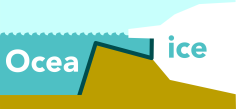
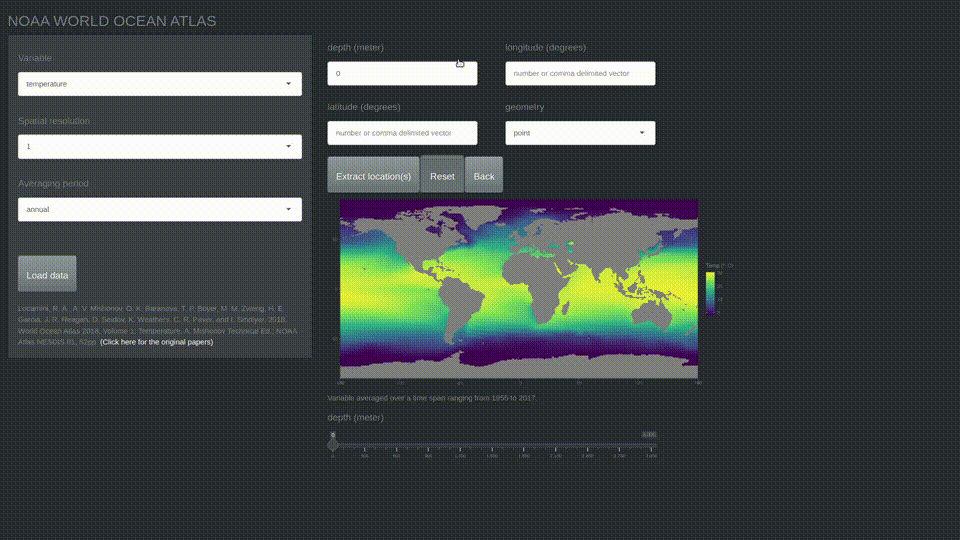
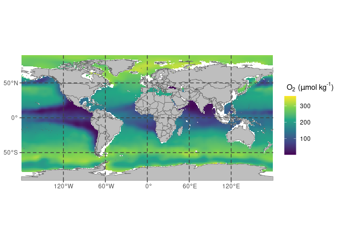
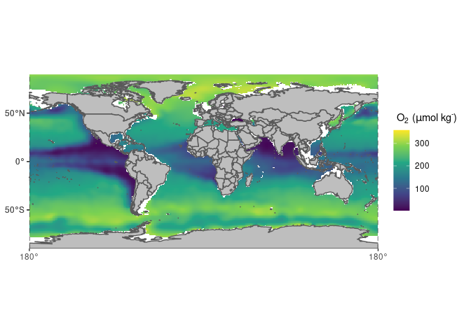

<!-- README.md is generated from README.Rmd. Please edit that file -->

# The oceanexplorer <a href="https://www.uu.nl/en/news/erc-grant-for-peter-bijl-to-predict-future-sea-level"></a>

<!-- badges: start -->

[](https://www.repostatus.org/#active)
[](https://choosealicense.com/licenses/mit/)
[](https://github.com/UtrechtUniversity/oceanexplorer/actions)
[](https://app.codecov.io/gh/UtrechtUniversity/Oceanexplorer?branch=master)
<!-- badges: end -->

The goal of oceanexplorer is to enable easy access and exploration of
the [World Ocean
Atlas](https://www.nodc.noaa.gov/OC5/SELECT/woaselect/woaselect.html) of
the US agency [NOAA](https://www.ncei.noaa.gov/).

<figure>

<figcaption aria-hidden="true">Demo of the ocean explorer
app</figcaption>
</figure>

## Check the app

Check the app here:
<https://utrecht-university.shinyapps.io/oceanexplorer/>

## Funding

This project was funded by ERC Starting grant number 802835, OceaNice,
awarded to Peter Bijl.

## Credits

The construction of the R (R Core Team 2022) package *oceanexplorer* and
associated documentation was aided by the packages; *devtools* (Wickham
et al. 2021), *roxygen2* (Wickham, Danenberg, et al. 2022), *testthat*
(Wickham 2022), *shinytest* (Chang, Csárdi, and Wickham 2021), *vdiffr*
(Henry et al. 2022), *knitr* (Xie 2014 ; Xie 2015), *rmarkdown* (Xie,
Allaire, and Grolemund 2018; Xie, Dervieux, and Riederer 2020), and the
superb guidance in the book: *R packages: organize, test, document, and
share your code*, by Wickham (2015).

Data transformation, cleaning and visualization is performed with:
*dplyr* (Wickham, François, et al. 2022), *ggplot2* (Wickham, Chang, et
al. 2022), and *rlang* (Henry and Wickham 2022).

In addition, this package relies on a set of packages for spatial data
analysis: *sf* (Pebesma 2022a) and *stars* (Pebesma 2022b).

The app is build with *shiny* (Chang et al. 2022) and the guidance in
the book: *Mastering Shiny: Build Interactive Apps, Reports &
Dashboards* (Wickham 2020) was a great help in learning how to develop
such applications. Furthermore, the packages *shinyjs* (Attali 2021),
*waiter* (Coene 2022), *bslib* (Sievert and Cheng 2022) and *thematic*
(Sievert, Schloerke, and Cheng 2021) ensure user-friendliness of the
interface and visually pleasing graphics.

## Installation

You can install the latest version of oceanexplorer from CRAN

``` r
# Install oceanexplorer from CRAN: 
install.packages("oceanexplorer")
```

## Example

The package allows extraction of global databases of several physical
and chemical parameters of the ocean from the NOAA World Ocean Atlas.

``` r
library(oceanexplorer)
# obtain the NOAA world ocean atlas for oxygen content
oxy_global <- get_NOAA("oxygen", 1, "annual")
```

Slice a specific interval from the array with `filter_NOAA()`, like so:

``` r
# filter a depth of 200 meters to show OMZs
(oxy_omz <- filter_NOAA(oxy_global, depth = 200))
#> stars object with 2 dimensions and 1 attribute
#> attribute(s):
#>            Min.  1st Qu.   Median     Mean  3rd Qu.     Max.  NA's
#> o_an  0.9701567 164.1833 218.6721 206.2584 266.9612 359.0279 26041
#> dimension(s):
#>     from  to offset delta refsys point values x/y
#> lon    1 360   -180     1 WGS 84    NA   NULL [x]
#> lat    1 180    -90     1 WGS 84    NA   NULL [y]
```

In addition, the sliced array can be plotted, like so:

``` r
# plot the NOAA world ocean atlas for oxygen content
plot_NOAA(oxy_omz, depth = NULL)
```



The same plot can be produced by taking the original data and supplying
a value to the `depth` argument and specifying the range of oxygen
content to `oxy_omz`.

``` r
# plot the NOAA world ocean atlas for oxygen content
plot_NOAA(oxy_global, depth = 200, rng = range(oxy_omz[[1]]))
```



# Interactive exploration

Lastly, the package can launch a Shiny app for interactive exploration
of the datasets.

``` r
# launch an interactive shiny session
NOAA_app()
```

The RStudio addin can be launched within the RStudio viewer pain by
executing the following code, or by using the `Addins` drop down menu in
the task-bar.

``` r
# launch an interactive shiny session
NOAA_addin()
```

## Code of Conduct

Please note that the oceanexplorer project is released with a
[Contributor Code of
Conduct](https://utrechtuniversity.github.io/oceanexplorer/CODE_OF_CONDUCT.html).
By contributing to this project, you agree to abide by its terms.

# References

<div id="refs" class="references csl-bib-body hanging-indent">

<div id="ref-shinyjs" class="csl-entry">

Attali, Dean. 2021. *Shinyjs: Easily Improve the User Experience of Your
Shiny Apps in Seconds*. <https://deanattali.com/shinyjs/>.

</div>

<div id="ref-shiny" class="csl-entry">

Chang, Winston, Joe Cheng, JJ Allaire, Carson Sievert, Barret Schloerke,
Yihui Xie, Jeff Allen, Jonathan McPherson, Alan Dipert, and Barbara
Borges. 2022. *Shiny: Web Application Framework for r*.
<https://shiny.rstudio.com/>.

</div>

<div id="ref-shinytest" class="csl-entry">

Chang, Winston, Gábor Csárdi, and Hadley Wickham. 2021. *Shinytest: Test
Shiny Apps*. <https://github.com/rstudio/shinytest>.

</div>

<div id="ref-waiter" class="csl-entry">

Coene, John. 2022. *Waiter: Loading Screen for Shiny*.
<https://CRAN.R-project.org/package=waiter>.

</div>

<div id="ref-vdiffr" class="csl-entry">

Henry, Lionel, Thomas Lin Pedersen, T Jake Luciani, Matthieu Decorde,
and Vaudor Lise. 2022. *Vdiffr: Visual Regression Testing and Graphical
Diffing*. <https://CRAN.R-project.org/package=vdiffr>.

</div>

<div id="ref-rlang" class="csl-entry">

Henry, Lionel, and Hadley Wickham. 2022. *Rlang: Functions for Base
Types and Core r and Tidyverse Features*.
<https://CRAN.R-project.org/package=rlang>.

</div>

<div id="ref-sf" class="csl-entry">

Pebesma, Edzer. 2022a. *Sf: Simple Features for r*.
<https://CRAN.R-project.org/package=sf>.

</div>

<div id="ref-stars" class="csl-entry">

———. 2022b. *Stars: Spatiotemporal Arrays, Raster and Vector Data
Cubes*. <https://CRAN.R-project.org/package=stars>.

</div>

<div id="ref-rversion" class="csl-entry">

R Core Team. 2022. *R: A Language and Environment for Statistical
Computing*. Vienna, Austria: R Foundation for Statistical Computing.
<https://www.R-project.org/>.

</div>

<div id="ref-bslib" class="csl-entry">

Sievert, Carson, and Joe Cheng. 2022. *Bslib: Custom Bootstrap ’Sass’
Themes for Shiny and Rmarkdown*.
<https://CRAN.R-project.org/package=bslib>.

</div>

<div id="ref-thematic" class="csl-entry">

Sievert, Carson, Barret Schloerke, and Joe Cheng. 2021. *Thematic:
Unified and Automatic Theming of Ggplot2, Lattice, and Base r Graphics*.
<https://CRAN.R-project.org/package=thematic>.

</div>

<div id="ref-Wickham2015" class="csl-entry">

Wickham, Hadley. 2015. *R Packages: Organize, Test, Document, and Share
Your Code*. O’Reilly Media, Inc. <https://r-pkgs.org/>.

</div>

<div id="ref-Wickham2020" class="csl-entry">

———. 2020. *Mastering Shiny: Build Interactive Apps, Reports &
Dashboards.* O’Reilly Media, Inc. <https://mastering-shiny.org/>.

</div>

<div id="ref-testthat" class="csl-entry">

———. 2022. *Testthat: Unit Testing for r*.
<https://CRAN.R-project.org/package=testthat>.

</div>

<div id="ref-ggplot2" class="csl-entry">

Wickham, Hadley, Winston Chang, Lionel Henry, Thomas Lin Pedersen,
Kohske Takahashi, Claus Wilke, Kara Woo, Hiroaki Yutani, and Dewey
Dunnington. 2022. *Ggplot2: Create Elegant Data Visualisations Using the
Grammar of Graphics*. <https://CRAN.R-project.org/package=ggplot2>.

</div>

<div id="ref-roxygen2" class="csl-entry">

Wickham, Hadley, Peter Danenberg, Gábor Csárdi, and Manuel Eugster.
2022. *Roxygen2: In-Line Documentation for r*.
<https://CRAN.R-project.org/package=roxygen2>.

</div>

<div id="ref-dplyr" class="csl-entry">

Wickham, Hadley, Romain François, Lionel Henry, and Kirill Müller. 2022.
*Dplyr: A Grammar of Data Manipulation*.
<https://CRAN.R-project.org/package=dplyr>.

</div>

<div id="ref-devtools" class="csl-entry">

Wickham, Hadley, Jim Hester, Winston Chang, and Jennifer Bryan. 2021.
*Devtools: Tools to Make Developing r Packages Easier*.
<https://CRAN.R-project.org/package=devtools>.

</div>

<div id="ref-knitr2014" class="csl-entry">

Xie, Yihui. 2014. “Knitr: A Comprehensive Tool for Reproducible Research
in R.” In *Implementing Reproducible Computational Research*, edited by
Victoria Stodden, Friedrich Leisch, and Roger D. Peng. Chapman;
Hall/CRC. <http://www.crcpress.com/product/isbn/9781466561595>.

</div>

<div id="ref-knitr2015" class="csl-entry">

———. 2015. *Dynamic Documents with R and Knitr*. 2nd ed. Boca Raton,
Florida: Chapman; Hall/CRC. <https://yihui.org/knitr/>.

</div>

<div id="ref-rmarkdown2018" class="csl-entry">

Xie, Yihui, J. J. Allaire, and Garrett Grolemund. 2018. *R Markdown: The
Definitive Guide*. Boca Raton, Florida: Chapman; Hall/CRC.
<https://bookdown.org/yihui/rmarkdown>.

</div>

<div id="ref-rmarkdown2020" class="csl-entry">

Xie, Yihui, Christophe Dervieux, and Emily Riederer. 2020. *R Markdown
Cookbook*. Boca Raton, Florida: Chapman; Hall/CRC.
<https://bookdown.org/yihui/rmarkdown-cookbook>.

</div>

</div>
