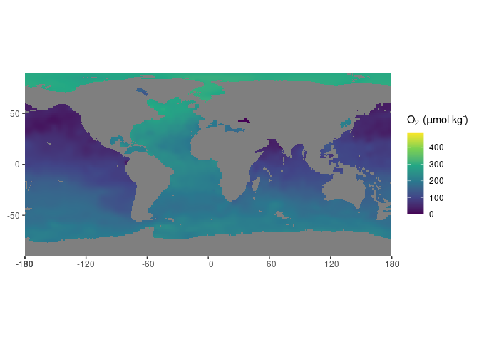

<!-- README.md is generated from README.Rmd. Please edit that file -->

# The oceanexplorer

<!-- badges: start -->

[](https://www.repostatus.org/#concept)
[](https://choosealicense.com/licenses/mit/)
[](/commits/master)
<!-- badges: end -->

The goal of oceanexplorer is to enable ease access and exploration of
the [WORLD OCEAN
ATLAS](https://www.nodc.noaa.gov/OC5/SELECT/woaselect/woaselect.html) of
the US agency [NOAA](https://www.ncei.noaa.gov/).

## Credits

The construction of the R (R Core Team 2021) package *oceanexplorer* and
associated documentation was aided by the packages; *devtools* (Wickham,
Hester, et al. 2021), *roxygen2* (Wickham, Danenberg, et al. 2021),
*testthat* (Wickham 2021), *knitr* (Xie 2014, 2015), *rmarkdown* (Xie,
Allaire, and Grolemund 2018; Xie, Dervieux, and Riederer 2020), and the
superb guidance in the book: *R packages: organize, test, document, and
share your code*, by Wickham (2015).

Data transformation, cleaning and visualization is performed with:
*dplyr* (Wickham, François, et al. 2021), *tibble* (Müller and Wickham
2021), *stringr* (Wickham 2019), *magrittr* (Bache and Wickham 2020),
and *rlang* (Henry and Wickham 2021).

In addition, this package relies on a set of packages for spatial data
analysis: *sf* (Pebesma 2021a), *stars* (Pebesma 2021b), and *ncmeta*
(Sumner 2020).

The app is build with *shiny* (Chang et al. 2021) and the guidance in
the book: *Mastering Shiny: Build Interactive Apps, Reports &
Dashboards* (Wickham 2020). was a great help in learning how to develop
such applications. Furthermore, the packages *waiter* (Coene 2021),
*bslib* (Sievert and Cheng 2021) and *thematic* (Sievert, Schloerke, and
Cheng 2021) ensure user friendliness and visually pleasing graphics.

## Installation

You can install the development version of oceanexplorer from GitHub

``` r
# Install oceanexplorer from GitHub: 
# install.packages("devtools")
devtools::install_github("UtrechtUniversity/oceanexplorer")
```

## Example

The package allows extraction of global databases of several physical
and chemical parameteres of the ocean from the NOAA WORLD OCEAN ATLAS.

``` r
library(oceanexplorer)
# obtain the NOAA world ocean atlas for oxygen content
(oxy_global <- get_NOAA("oxygen", 1, "annual", 2001))
#> Warning: ignoring unrecognized unit: micromoles_per_kilogram
#> stars object with 4 dimensions and 1 attribute
#> attribute(s), summary of first 1e+05 cells:
#>           Min. 1st Qu.   Median     Mean  3rd Qu.     Max.  NA's
#> o_an  145.5074  207.41 246.5956 266.2805 329.1397 489.0815 34528
#> dimension(s):
#>       from  to offset delta                       refsys point
#> lon      1 360   -180     1 +proj=longlat +a=6378137 ...    NA
#> lat      1 180    -90     1 +proj=longlat +a=6378137 ...    NA
#> depth    1  57     NA    NA                           NA FALSE
#> time     1   1     NA    NA                      POSIXct    NA
#>                        values x/y
#> lon                      NULL [x]
#> lat                      NULL [y]
#> depth [0,2.5),...,[1475,1500)    
#> time  1958-01-16 06:22:58 UTC
```

In addition, the data can be plotted, like so:

``` r
# plot the NOAA world ocean atlas for oxygen content
plot_NOAA(oxy_global)
```



Lastly the package can launch a Shiny app for interactive exploration of
the datasets.

``` r
# launch an interactive shiny session
NOAA_app()
```

# References

<div id="refs" class="references csl-bib-body hanging-indent">

<div id="ref-magrittr" class="csl-entry">

Bache, Stefan Milton, and Hadley Wickham. 2020. *Magrittr: A
Forward-Pipe Operator for r*.
<https://CRAN.R-project.org/package=magrittr>.

</div>

<div id="ref-shiny" class="csl-entry">

Chang, Winston, Joe Cheng, JJ Allaire, Carson Sievert, Barret Schloerke,
Yihui Xie, Jeff Allen, Jonathan McPherson, Alan Dipert, and Barbara
Borges. 2021. *Shiny: Web Application Framework for r*.
<https://shiny.rstudio.com/>.

</div>

<div id="ref-waiter" class="csl-entry">

Coene, John. 2021. *Waiter: Loading Screen for Shiny*.
<https://CRAN.R-project.org/package=waiter>.

</div>

<div id="ref-rlang" class="csl-entry">

Henry, Lionel, and Hadley Wickham. 2021. *Rlang: Functions for Base
Types and Core r and Tidyverse Features*.
<https://CRAN.R-project.org/package=rlang>.

</div>

<div id="ref-tibble" class="csl-entry">

Müller, Kirill, and Hadley Wickham. 2021. *Tibble: Simple Data Frames*.
<https://CRAN.R-project.org/package=tibble>.

</div>

<div id="ref-sf" class="csl-entry">

Pebesma, Edzer. 2021a. *Sf: Simple Features for r*.
<https://CRAN.R-project.org/package=sf>.

</div>

<div id="ref-stars" class="csl-entry">

———. 2021b. *Stars: Spatiotemporal Arrays, Raster and Vector Data
Cubes*. <https://CRAN.R-project.org/package=stars>.

</div>

<div id="ref-rversion" class="csl-entry">

R Core Team. 2021. *R: A Language and Environment for Statistical
Computing*. Vienna, Austria: R Foundation for Statistical Computing.
<https://www.R-project.org/>.

</div>

<div id="ref-bslib" class="csl-entry">

Sievert, Carson, and Joe Cheng. 2021. *Bslib: Custom Bootstrap ’Sass’
Themes for Shiny and Rmarkdown*.
<https://CRAN.R-project.org/package=bslib>.

</div>

<div id="ref-thematic" class="csl-entry">

Sievert, Carson, Barret Schloerke, and Joe Cheng. 2021. *Thematic:
Unified and Automatic Theming of Ggplot2, Lattice, and Base r Graphics*.
<https://CRAN.R-project.org/package=thematic>.

</div>

<div id="ref-ncmeta" class="csl-entry">

Sumner, Michael. 2020. *Ncmeta: Straightforward NetCDF Metadata*.
<https://github.com/hypertidy/ncmeta>.

</div>

<div id="ref-Wickham2015" class="csl-entry">

Wickham, Hadley. 2015. *R Packages: Organize, Test, Document, and Share
Your Code*. O’Reilly Media, Inc. <https://r-pkgs.org/>.

</div>

<div id="ref-stringr" class="csl-entry">

———. 2019. *Stringr: Simple, Consistent Wrappers for Common String
Operations*. <https://CRAN.R-project.org/package=stringr>.

</div>

<div id="ref-Wickham2020" class="csl-entry">

———. 2020. *Mastering Shiny: Build Interactive Apps, Reports &
Dashboards.* O’Reilly Media, Inc. <https://mastering-shiny.org/>.

</div>

<div id="ref-testthat" class="csl-entry">

———. 2021. *Testthat: Unit Testing for r*.
<https://CRAN.R-project.org/package=testthat>.

</div>

<div id="ref-roxygen2" class="csl-entry">

Wickham, Hadley, Peter Danenberg, Gábor Csárdi, and Manuel Eugster.
2021. *Roxygen2: In-Line Documentation for r*.
<https://CRAN.R-project.org/package=roxygen2>.

</div>

<div id="ref-dplyr" class="csl-entry">

Wickham, Hadley, Romain François, Lionel Henry, and Kirill Müller. 2021.
*Dplyr: A Grammar of Data Manipulation*.
<https://CRAN.R-project.org/package=dplyr>.

</div>

<div id="ref-devtools" class="csl-entry">

Wickham, Hadley, Jim Hester, Winston Chang, and Jennifer Bryan. 2021.
*Devtools: Tools to Make Developing r Packages Easier*.
<https://CRAN.R-project.org/package=devtools>.

</div>

<div id="ref-knitr2014" class="csl-entry">

Xie, Yihui. 2014. “Knitr: A Comprehensive Tool for Reproducible Research
in R.” In *Implementing Reproducible Computational Research*, edited by
Victoria Stodden, Friedrich Leisch, and Roger D. Peng. Chapman;
Hall/CRC. <http://www.crcpress.com/product/isbn/9781466561595>.

</div>

<div id="ref-knitr2015" class="csl-entry">

———. 2015. *Dynamic Documents with R and Knitr*. 2nd ed. Boca Raton,
Florida: Chapman; Hall/CRC. <https://yihui.org/knitr/>.

</div>

<div id="ref-rmarkdown2018" class="csl-entry">

Xie, Yihui, J. J. Allaire, and Garrett Grolemund. 2018. *R Markdown: The
Definitive Guide*. Boca Raton, Florida: Chapman; Hall/CRC.
<https://bookdown.org/yihui/rmarkdown>.

</div>

<div id="ref-rmarkdown2020" class="csl-entry">

Xie, Yihui, Christophe Dervieux, and Emily Riederer. 2020. *R Markdown
Cookbook*. Boca Raton, Florida: Chapman; Hall/CRC.
<https://bookdown.org/yihui/rmarkdown-cookbook>.

</div>

</div>
