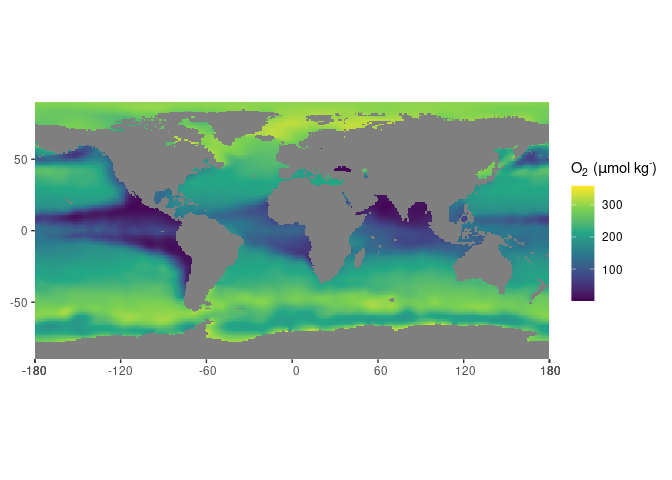

<!-- README.md is generated from README.Rmd. Please edit that file -->

# The oceanexplorer

<!-- badges: start -->

[](https://www.repostatus.org/#concept)
[](https://choosealicense.com/licenses/mit/)
[](/commits/master)
[](https://github.com/UtrechtUniversity/oceanexplorer/actions)
<!-- badges: end -->

The goal of oceanexplorer is to enable easy access and exploration of
the [WORLD OCEAN
ATLAS](https://www.nodc.noaa.gov/OC5/SELECT/woaselect/woaselect.html) of
the US agency [NOAA](https://www.ncei.noaa.gov/).

<figure>
<figcaption aria-hidden="true">Demo of the ocean explorer</figcaption>
</figure>

## Credits

The construction of the R (R Core Team 2021) package *oceanexplorer* and
associated documentation was aided by the packages; *devtools* (Wickham,
Hester, et al. 2021), *roxygen2* (Wickham, Danenberg, et al. 2021),
*testthat* (Wickham 2021), *knitr* (Xie 2014, 2015), *rmarkdown* (Xie,
Allaire, and Grolemund 2018; Xie, Dervieux, and Riederer 2020), and the
superb guidance in the book: *R packages: organize, test, document, and
share your code*, by Wickham (2015).

Data transformation, cleaning and visualization is performed with:
*dplyr* (Wickham, François, et al. 2021), *tibble* (Müller and Wickham
2021), *stringr* (Wickham 2019), *magrittr* (Bache and Wickham 2020),
and *rlang* (Henry and Wickham 2021).

In addition, this package relies on a set of packages for spatial data
analysis: *sf* (Pebesma 2021a), *stars* (Pebesma 2021b), and *ncmeta*
(Sumner 2020).

The app is build with *shiny* (Chang et al. 2021) and the guidance in
the book: *Mastering Shiny: Build Interactive Apps, Reports &
Dashboards* (Wickham 2020). was a great help in learning how to develop
such applications. Furthermore, the packages *waiter* (Coene 2021),
*bslib* (Sievert and Cheng 2021) and *thematic* (Sievert, Schloerke, and
Cheng 2021) ensure user friendliness and visually pleasing graphics.

## Installation

You can install the development version of oceanexplorer from GitHub

``` r
# Install oceanexplorer from GitHub: 
# install.packages("devtools")
devtools::install_github("UtrechtUniversity/oceanexplorer")
```

## Example

The package allows extraction of global databases of several physical
and chemical parameters of the ocean from the NOAA WORLD OCEAN ATLAS.

``` r
library(oceanexplorer)
# obtain the NOAA world ocean atlas for oxygen content
(oxy_global <- get_NOAA("oxygen", 1, "annual"))
#> $o_an
#> , , 1, 1
#> 
#>        [,1] [,2] [,3] [,4] [,5] [,6] [,7] [,8] [,9] [,10] [,11] [,12]    [,13]
#>   [1,]   NA   NA   NA   NA   NA   NA   NA   NA   NA    NA    NA    NA       NA
#>   [2,]   NA   NA   NA   NA   NA   NA   NA   NA   NA    NA    NA    NA 343.0600
#>   [3,]   NA   NA   NA   NA   NA   NA   NA   NA   NA    NA    NA    NA 342.6650
#>   [4,]   NA   NA   NA   NA   NA   NA   NA   NA   NA    NA    NA    NA 342.2161
#>   [5,]   NA   NA   NA   NA   NA   NA   NA   NA   NA    NA    NA    NA 341.7268
#>   [6,]   NA   NA   NA   NA   NA   NA   NA   NA   NA    NA    NA    NA 341.1729
#>   [7,]   NA   NA   NA   NA   NA   NA   NA   NA   NA    NA    NA    NA 340.4731
#>   [8,]   NA   NA   NA   NA   NA   NA   NA   NA   NA    NA    NA    NA 339.5958
#>   [9,]   NA   NA   NA   NA   NA   NA   NA   NA   NA    NA    NA    NA 338.5163
#>  [10,]   NA   NA   NA   NA   NA   NA   NA   NA   NA    NA    NA    NA 337.2904
#>  [11,]   NA   NA   NA   NA   NA   NA   NA   NA   NA    NA    NA    NA 335.9188
#>  [12,]   NA   NA   NA   NA   NA   NA   NA   NA   NA    NA    NA    NA 334.3916
#>  [13,]   NA   NA   NA   NA   NA   NA   NA   NA   NA    NA    NA    NA 332.8825
#>  [14,]   NA   NA   NA   NA   NA   NA   NA   NA   NA    NA    NA    NA 331.8877
#>  [15,]   NA   NA   NA   NA   NA   NA   NA   NA   NA    NA    NA    NA 330.6828
#>  [16,]   NA   NA   NA   NA   NA   NA   NA   NA   NA    NA    NA    NA 329.4985
#>  [17,]   NA   NA   NA   NA   NA   NA   NA   NA   NA    NA    NA    NA 328.1739
#>  [18,]   NA   NA   NA   NA   NA   NA   NA   NA   NA    NA    NA    NA 327.3513
#>  [19,]   NA   NA   NA   NA   NA   NA   NA   NA   NA    NA    NA    NA 327.2364
#>  [20,]   NA   NA   NA   NA   NA   NA   NA   NA   NA    NA    NA    NA 328.1036
#>  [21,]   NA   NA   NA   NA   NA   NA   NA   NA   NA    NA    NA    NA 325.9369
#>  [22,]   NA   NA   NA   NA   NA   NA   NA   NA   NA    NA    NA    NA       NA
#>  [23,]   NA   NA   NA   NA   NA   NA   NA   NA   NA    NA    NA    NA       NA
#>  [24,]   NA   NA   NA   NA   NA   NA   NA   NA   NA    NA    NA    NA       NA
#>  [25,]   NA   NA   NA   NA   NA   NA   NA   NA   NA    NA    NA    NA       NA
#>  [26,]   NA   NA   NA   NA   NA   NA   NA   NA   NA    NA    NA    NA       NA
#>  [27,]   NA   NA   NA   NA   NA   NA   NA   NA   NA    NA    NA    NA       NA
#>  [28,]   NA   NA   NA   NA   NA   NA   NA   NA   NA    NA    NA    NA       NA
#>  [29,]   NA   NA   NA   NA   NA   NA   NA   NA   NA    NA    NA    NA       NA
#>  [30,]   NA   NA   NA   NA   NA   NA   NA   NA   NA    NA    NA    NA       NA
#>  [31,]   NA   NA   NA   NA   NA   NA   NA   NA   NA    NA    NA    NA       NA
#>  [32,]   NA   NA   NA   NA   NA   NA   NA   NA   NA    NA    NA    NA       NA
#>  [33,]   NA   NA   NA   NA   NA   NA   NA   NA   NA    NA    NA    NA       NA
#>  [34,]   NA   NA   NA   NA   NA   NA   NA   NA   NA    NA    NA    NA       NA
#>  [35,]   NA   NA   NA   NA   NA   NA   NA   NA   NA    NA    NA    NA       NA
#>  [36,]   NA   NA   NA   NA   NA   NA   NA   NA   NA    NA    NA    NA       NA
#>  [37,]   NA   NA   NA   NA   NA   NA   NA   NA   NA    NA    NA    NA       NA
#>  [38,]   NA   NA   NA   NA   NA   NA   NA   NA   NA    NA    NA    NA       NA
#>  [39,]   NA   NA   NA   NA   NA   NA   NA   NA   NA    NA    NA    NA       NA
#>  [40,]   NA   NA   NA   NA   NA   NA   NA   NA   NA    NA    NA    NA       NA
#>  [41,]   NA   NA   NA   NA   NA   NA   NA   NA   NA    NA    NA    NA       NA
#>  [42,]   NA   NA   NA   NA   NA   NA   NA   NA   NA    NA    NA    NA       NA
#>  [43,]   NA   NA   NA   NA   NA   NA   NA   NA   NA    NA    NA    NA       NA
#>  [44,]   NA   NA   NA   NA   NA   NA   NA   NA   NA    NA    NA    NA       NA
#>  [45,]   NA   NA   NA   NA   NA   NA   NA   NA   NA    NA    NA    NA       NA
#>  [46,]   NA   NA   NA   NA   NA   NA   NA   NA   NA    NA    NA    NA       NA
#>  [47,]   NA   NA   NA   NA   NA   NA   NA   NA   NA    NA    NA    NA       NA
#>  [48,]   NA   NA   NA   NA   NA   NA   NA   NA   NA    NA    NA    NA       NA
#>  [49,]   NA   NA   NA   NA   NA   NA   NA   NA   NA    NA    NA    NA       NA
#>  [50,]   NA   NA   NA   NA   NA   NA   NA   NA   NA    NA    NA    NA       NA
#>  [51,]   NA   NA   NA   NA   NA   NA   NA   NA   NA    NA    NA    NA       NA
#>  [52,]   NA   NA   NA   NA   NA   NA   NA   NA   NA    NA    NA    NA       NA
#>  [53,]   NA   NA   NA   NA   NA   NA   NA   NA   NA    NA    NA    NA       NA
#>  [54,]   NA   NA   NA   NA   NA   NA   NA   NA   NA    NA    NA    NA       NA
#>  [55,]   NA   NA   NA   NA   NA   NA   NA   NA   NA    NA    NA    NA       NA
#>  [56,]   NA   NA   NA   NA   NA   NA   NA   NA   NA    NA    NA    NA       NA
#>  [57,]   NA   NA   NA   NA   NA   NA   NA   NA   NA    NA    NA    NA       NA
#>  [58,]   NA   NA   NA   NA   NA   NA   NA   NA   NA    NA    NA    NA       NA
#>  [59,]   NA   NA   NA   NA   NA   NA   NA   NA   NA    NA    NA    NA       NA
#>  [60,]   NA   NA   NA   NA   NA   NA   NA   NA   NA    NA    NA    NA       NA
#>  [61,]   NA   NA   NA   NA   NA   NA   NA   NA   NA    NA    NA    NA       NA
#>  [62,]   NA   NA   NA   NA   NA   NA   NA   NA   NA    NA    NA    NA       NA
#>  [63,]   NA   NA   NA   NA   NA   NA   NA   NA   NA    NA    NA    NA       NA
#>  [64,]   NA   NA   NA   NA   NA   NA   NA   NA   NA    NA    NA    NA       NA
#>  [65,]   NA   NA   NA   NA   NA   NA   NA   NA   NA    NA    NA    NA       NA
#>  [66,]   NA   NA   NA   NA   NA   NA   NA   NA   NA    NA    NA    NA       NA
#>  [67,]   NA   NA   NA   NA   NA   NA   NA   NA   NA    NA    NA    NA       NA
#>  [68,]   NA   NA   NA   NA   NA   NA   NA   NA   NA    NA    NA    NA       NA
#>  [69,]   NA   NA   NA   NA   NA   NA   NA   NA   NA    NA    NA    NA       NA
#>  [70,]   NA   NA   NA   NA   NA   NA   NA   NA   NA    NA    NA    NA       NA
#>  [71,]   NA   NA   NA   NA   NA   NA   NA   NA   NA    NA    NA    NA       NA
#>  [72,]   NA   NA   NA   NA   NA   NA   NA   NA   NA    NA    NA    NA       NA
#>  [73,]   NA   NA   NA   NA   NA   NA   NA   NA   NA    NA    NA    NA       NA
#>  [74,]   NA   NA   NA   NA   NA   NA   NA   NA   NA    NA    NA    NA       NA
#>  [75,]   NA   NA   NA   NA   NA   NA   NA   NA   NA    NA    NA    NA       NA
#>  [76,]   NA   NA   NA   NA   NA   NA   NA   NA   NA    NA    NA    NA       NA
#>  [77,]   NA   NA   NA   NA   NA   NA   NA   NA   NA    NA    NA    NA       NA
#>  [78,]   NA   NA   NA   NA   NA   NA   NA   NA   NA    NA    NA    NA       NA
#>  [79,]   NA   NA   NA   NA   NA   NA   NA   NA   NA    NA    NA    NA       NA
#>  [80,]   NA   NA   NA   NA   NA   NA   NA   NA   NA    NA    NA    NA       NA
#>  [81,]   NA   NA   NA   NA   NA   NA   NA   NA   NA    NA    NA    NA       NA
#>  [82,]   NA   NA   NA   NA   NA   NA   NA   NA   NA    NA    NA    NA       NA
#>  [83,]   NA   NA   NA   NA   NA   NA   NA   NA   NA    NA    NA    NA       NA
#>  [84,]   NA   NA   NA   NA   NA   NA   NA   NA   NA    NA    NA    NA       NA
#>  [85,]   NA   NA   NA   NA   NA   NA   NA   NA   NA    NA    NA    NA       NA
#>  [86,]   NA   NA   NA   NA   NA   NA   NA   NA   NA    NA    NA    NA       NA
#>  [87,]   NA   NA   NA   NA   NA   NA   NA   NA   NA    NA    NA    NA       NA
#>  [88,]   NA   NA   NA   NA   NA   NA   NA   NA   NA    NA    NA    NA       NA
#>  [89,]   NA   NA   NA   NA   NA   NA   NA   NA   NA    NA    NA    NA       NA
#>  [90,]   NA   NA   NA   NA   NA   NA   NA   NA   NA    NA    NA    NA       NA
#>  [91,]   NA   NA   NA   NA   NA   NA   NA   NA   NA    NA    NA    NA       NA
#>  [92,]   NA   NA   NA   NA   NA   NA   NA   NA   NA    NA    NA    NA       NA
#>  [93,]   NA   NA   NA   NA   NA   NA   NA   NA   NA    NA    NA    NA       NA
#>  [94,]   NA   NA   NA   NA   NA   NA   NA   NA   NA    NA    NA    NA       NA
#>  [95,]   NA   NA   NA   NA   NA   NA   NA   NA   NA    NA    NA    NA       NA
#>  [96,]   NA   NA   NA   NA   NA   NA   NA   NA   NA    NA    NA    NA       NA
#>  [97,]   NA   NA   NA   NA   NA   NA   NA   NA   NA    NA    NA    NA       NA
#>  [98,]   NA   NA   NA   NA   NA   NA   NA   NA   NA    NA    NA    NA       NA
#>  [99,]   NA   NA   NA   NA   NA   NA   NA   NA   NA    NA    NA    NA       NA
#> [100,]   NA   NA   NA   NA   NA   NA   NA   NA   NA    NA    NA    NA       NA
#> [101,]   NA   NA   NA   NA   NA   NA   NA   NA   NA    NA    NA    NA       NA
#> [102,]   NA   NA   NA   NA   NA   NA   NA   NA   NA    NA    NA    NA       NA
#> [103,]   NA   NA   NA   NA   NA   NA   NA   NA   NA    NA    NA    NA       NA
#> [104,]   NA   NA   NA   NA   NA   NA   NA   NA   NA    NA    NA    NA       NA
#> [105,]   NA   NA   NA   NA   NA   NA   NA   NA   NA    NA    NA    NA       NA
#> [106,]   NA   NA   NA   NA   NA   NA   NA   NA   NA    NA    NA    NA       NA
#> [107,]   NA   NA   NA   NA   NA   NA   NA   NA   NA    NA    NA    NA       NA
#> [108,]   NA   NA   NA   NA   NA   NA   NA   NA   NA    NA    NA    NA       NA
#> [109,]   NA   NA   NA   NA   NA   NA   NA   NA   NA    NA    NA    NA       NA
#> [110,]   NA   NA   NA   NA   NA   NA   NA   NA   NA    NA    NA    NA       NA
#> [111,]   NA   NA   NA   NA   NA   NA   NA   NA   NA    NA    NA    NA       NA
#> [112,]   NA   NA   NA   NA   NA   NA   NA   NA   NA    NA    NA    NA       NA
#> [113,]   NA   NA   NA   NA   NA   NA   NA   NA   NA    NA    NA    NA       NA
#> [114,]   NA   NA   NA   NA   NA   NA   NA   NA   NA    NA    NA    NA       NA
#> [115,]   NA   NA   NA   NA   NA   NA   NA   NA   NA    NA    NA    NA       NA
#> [116,]   NA   NA   NA   NA   NA   NA   NA   NA   NA    NA    NA    NA       NA
#> [117,]   NA   NA   NA   NA   NA   NA   NA   NA   NA    NA    NA    NA       NA
#> [118,]   NA   NA   NA   NA   NA   NA   NA   NA   NA    NA    NA    NA       NA
#> [119,]   NA   NA   NA   NA   NA   NA   NA   NA   NA    NA    NA    NA       NA
#> [120,]   NA   NA   NA   NA   NA   NA   NA   NA   NA    NA    NA    NA       NA
#> [121,]   NA   NA   NA   NA   NA   NA   NA   NA   NA    NA    NA    NA       NA
#> [122,]   NA   NA   NA   NA   NA   NA   NA   NA   NA    NA    NA    NA       NA
#> [123,]   NA   NA   NA   NA   NA   NA   NA   NA   NA    NA    NA    NA       NA
#> [124,]   NA   NA   NA   NA   NA   NA   NA   NA   NA    NA    NA    NA       NA
#> [125,]   NA   NA   NA   NA   NA   NA   NA   NA   NA    NA    NA    NA       NA
#> [126,]   NA   NA   NA   NA   NA   NA   NA   NA   NA    NA    NA    NA       NA
#> [127,]   NA   NA   NA   NA   NA   NA   NA   NA   NA    NA    NA    NA       NA
#> [128,]   NA   NA   NA   NA   NA   NA   NA   NA   NA    NA    NA    NA       NA
#> [129,]   NA   NA   NA   NA   NA   NA   NA   NA   NA    NA    NA    NA       NA
#> [130,]   NA   NA   NA   NA   NA   NA   NA   NA   NA    NA    NA    NA       NA
#> [131,]   NA   NA   NA   NA   NA   NA   NA   NA   NA    NA    NA    NA       NA
#> [132,]   NA   NA   NA   NA   NA   NA   NA   NA   NA    NA    NA    NA       NA
#> [133,]   NA   NA   NA   NA   NA   NA   NA   NA   NA    NA    NA    NA       NA
#> [134,]   NA   NA   NA   NA   NA   NA   NA   NA   NA    NA    NA    NA       NA
#> [135,]   NA   NA   NA   NA   NA   NA   NA   NA   NA    NA    NA    NA       NA
#> [136,]   NA   NA   NA   NA   NA   NA   NA   NA   NA    NA    NA    NA 341.5998
#> [137,]   NA   NA   NA   NA   NA   NA   NA   NA   NA    NA    NA    NA 342.3011
#> [138,]   NA   NA   NA   NA   NA   NA   NA   NA   NA    NA    NA    NA 342.9414
#> [139,]   NA   NA   NA   NA   NA   NA   NA   NA   NA    NA    NA    NA 343.4578
#> [140,]   NA   NA   NA   NA   NA   NA   NA   NA   NA    NA    NA    NA 343.8368
#> [141,]   NA   NA   NA   NA   NA   NA   NA   NA   NA    NA    NA    NA 344.1097
#> [142,]   NA   NA   NA   NA   NA   NA   NA   NA   NA    NA    NA    NA 344.3102
#> [143,]   NA   NA   NA   NA   NA   NA   NA   NA   NA    NA    NA    NA 344.4585
#> [144,]   NA   NA   NA   NA   NA   NA   NA   NA   NA    NA    NA    NA 344.3607
#> [145,]   NA   NA   NA   NA   NA   NA   NA   NA   NA    NA    NA    NA 344.4328
#> [146,]   NA   NA   NA   NA   NA   NA   NA   NA   NA    NA    NA    NA       NA
#> [147,]   NA   NA   NA   NA   NA   NA   NA   NA   NA    NA    NA    NA       NA
#> [148,]   NA   NA   NA   NA   NA   NA   NA   NA   NA    NA    NA    NA       NA
#> [149,]   NA   NA   NA   NA   NA   NA   NA   NA   NA    NA    NA    NA       NA
#> [150,]   NA   NA   NA   NA   NA   NA   NA   NA   NA    NA    NA    NA       NA
#> [151,]   NA   NA   NA   NA   NA   NA   NA   NA   NA    NA    NA    NA       NA
#> [152,]   NA   NA   NA   NA   NA   NA   NA   NA   NA    NA    NA    NA       NA
#> [153,]   NA   NA   NA   NA   NA   NA   NA   NA   NA    NA    NA    NA       NA
#> [154,]   NA   NA   NA   NA   NA   NA   NA   NA   NA    NA    NA    NA       NA
#> [155,]   NA   NA   NA   NA   NA   NA   NA   NA   NA    NA    NA    NA       NA
#> [156,]   NA   NA   NA   NA   NA   NA   NA   NA   NA    NA    NA    NA       NA
#> [157,]   NA   NA   NA   NA   NA   NA   NA   NA   NA    NA    NA    NA       NA
#> [158,]   NA   NA   NA   NA   NA   NA   NA   NA   NA    NA    NA    NA       NA
#> [159,]   NA   NA   NA   NA   NA   NA   NA   NA   NA    NA    NA    NA       NA
#> [160,]   NA   NA   NA   NA   NA   NA   NA   NA   NA    NA    NA    NA       NA
#> [161,]   NA   NA   NA   NA   NA   NA   NA   NA   NA    NA    NA    NA       NA
#> [162,]   NA   NA   NA   NA   NA   NA   NA   NA   NA    NA    NA    NA       NA
#> [163,]   NA   NA   NA   NA   NA   NA   NA   NA   NA    NA    NA    NA       NA
#> [164,]   NA   NA   NA   NA   NA   NA   NA   NA   NA    NA    NA    NA       NA
#> [165,]   NA   NA   NA   NA   NA   NA   NA   NA   NA    NA    NA    NA       NA
#> [166,]   NA   NA   NA   NA   NA   NA   NA   NA   NA    NA    NA    NA       NA
#> [167,]   NA   NA   NA   NA   NA   NA   NA   NA   NA    NA    NA    NA       NA
#> [168,]   NA   NA   NA   NA   NA   NA   NA   NA   NA    NA    NA    NA       NA
#> [169,]   NA   NA   NA   NA   NA   NA   NA   NA   NA    NA    NA    NA       NA
#> [170,]   NA   NA   NA   NA   NA   NA   NA   NA   NA    NA    NA    NA       NA
#> [171,]   NA   NA   NA   NA   NA   NA   NA   NA   NA    NA    NA    NA       NA
#> [172,]   NA   NA   NA   NA   NA   NA   NA   NA   NA    NA    NA    NA       NA
#> [173,]   NA   NA   NA   NA   NA   NA   NA   NA   NA    NA    NA    NA       NA
#> [174,]   NA   NA   NA   NA   NA   NA   NA   NA   NA    NA    NA    NA       NA
#> [175,]   NA   NA   NA   NA   NA   NA   NA   NA   NA    NA    NA    NA       NA
#> [176,]   NA   NA   NA   NA   NA   NA   NA   NA   NA    NA    NA    NA       NA
#> [177,]   NA   NA   NA   NA   NA   NA   NA   NA   NA    NA    NA    NA       NA
#> [178,]   NA   NA   NA   NA   NA   NA   NA   NA   NA    NA    NA    NA       NA
#> [179,]   NA   NA   NA   NA   NA   NA   NA   NA   NA    NA    NA    NA       NA
#> [180,]   NA   NA   NA   NA   NA   NA   NA   NA   NA    NA    NA    NA       NA
#> [181,]   NA   NA   NA   NA   NA   NA   NA   NA   NA    NA    NA    NA       NA
#> [182,]   NA   NA   NA   NA   NA   NA   NA   NA   NA    NA    NA    NA       NA
#> [183,]   NA   NA   NA   NA   NA   NA   NA   NA   NA    NA    NA    NA       NA
#> [184,]   NA   NA   NA   NA   NA   NA   NA   NA   NA    NA    NA    NA       NA
#> [185,]   NA   NA   NA   NA   NA   NA   NA   NA   NA    NA    NA    NA       NA
#> [186,]   NA   NA   NA   NA   NA   NA   NA   NA   NA    NA    NA    NA       NA
#> [187,]   NA   NA   NA   NA   NA   NA   NA   NA   NA    NA    NA    NA       NA
#> [188,]   NA   NA   NA   NA   NA   NA   NA   NA   NA    NA    NA    NA       NA
#> [189,]   NA   NA   NA   NA   NA   NA   NA   NA   NA    NA    NA    NA       NA
#> [190,]   NA   NA   NA   NA   NA   NA   NA   NA   NA    NA    NA    NA       NA
#> [191,]   NA   NA   NA   NA   NA   NA   NA   NA   NA    NA    NA    NA       NA
#> [192,]   NA   NA   NA   NA   NA   NA   NA   NA   NA    NA    NA    NA       NA
#> [193,]   NA   NA   NA   NA   NA   NA   NA   NA   NA    NA    NA    NA       NA
#> [194,]   NA   NA   NA   NA   NA   NA   NA   NA   NA    NA    NA    NA       NA
#> [195,]   NA   NA   NA   NA   NA   NA   NA   NA   NA    NA    NA    NA       NA
#> [196,]   NA   NA   NA   NA   NA   NA   NA   NA   NA    NA    NA    NA       NA
#> [197,]   NA   NA   NA   NA   NA   NA   NA   NA   NA    NA    NA    NA       NA
#> [198,]   NA   NA   NA   NA   NA   NA   NA   NA   NA    NA    NA    NA       NA
#> [199,]   NA   NA   NA   NA   NA   NA   NA   NA   NA    NA    NA    NA       NA
#> [200,]   NA   NA   NA   NA   NA   NA   NA   NA   NA    NA    NA    NA       NA
#> [201,]   NA   NA   NA   NA   NA   NA   NA   NA   NA    NA    NA    NA       NA
#> [202,]   NA   NA   NA   NA   NA   NA   NA   NA   NA    NA    NA    NA       NA
#> [203,]   NA   NA   NA   NA   NA   NA   NA   NA   NA    NA    NA    NA       NA
#> [204,]   NA   NA   NA   NA   NA   NA   NA   NA   NA    NA    NA    NA       NA
#> [205,]   NA   NA   NA   NA   NA   NA   NA   NA   NA    NA    NA    NA       NA
#> [206,]   NA   NA   NA   NA   NA   NA   NA   NA   NA    NA    NA    NA       NA
#> [207,]   NA   NA   NA   NA   NA   NA   NA   NA   NA    NA    NA    NA       NA
#> [208,]   NA   NA   NA   NA   NA   NA   NA   NA   NA    NA    NA    NA       NA
#> [209,]   NA   NA   NA   NA   NA   NA   NA   NA   NA    NA    NA    NA       NA
#> [210,]   NA   NA   NA   NA   NA   NA   NA   NA   NA    NA    NA    NA       NA
#> [211,]   NA   NA   NA   NA   NA   NA   NA   NA   NA    NA    NA    NA       NA
#> [212,]   NA   NA   NA   NA   NA   NA   NA   NA   NA    NA    NA    NA       NA
#> [213,]   NA   NA   NA   NA   NA   NA   NA   NA   NA    NA    NA    NA       NA
#> [214,]   NA   NA   NA   NA   NA   NA   NA   NA   NA    NA    NA    NA       NA
#> [215,]   NA   NA   NA   NA   NA   NA   NA   NA   NA    NA    NA    NA       NA
#> [216,]   NA   NA   NA   NA   NA   NA   NA   NA   NA    NA    NA    NA       NA
#> [217,]   NA   NA   NA   NA   NA   NA   NA   NA   NA    NA    NA    NA       NA
#> [218,]   NA   NA   NA   NA   NA   NA   NA   NA   NA    NA    NA    NA       NA
#> [219,]   NA   NA   NA   NA   NA   NA   NA   NA   NA    NA    NA    NA       NA
#> [220,]   NA   NA   NA   NA   NA   NA   NA   NA   NA    NA    NA    NA       NA
#> [221,]   NA   NA   NA   NA   NA   NA   NA   NA   NA    NA    NA    NA       NA
#> [222,]   NA   NA   NA   NA   NA   NA   NA   NA   NA    NA    NA    NA       NA
#> [223,]   NA   NA   NA   NA   NA   NA   NA   NA   NA    NA    NA    NA       NA
#> [224,]   NA   NA   NA   NA   NA   NA   NA   NA   NA    NA    NA    NA       NA
#> [225,]   NA   NA   NA   NA   NA   NA   NA   NA   NA    NA    NA    NA       NA
#> [226,]   NA   NA   NA   NA   NA   NA   NA   NA   NA    NA    NA    NA       NA
#> [227,]   NA   NA   NA   NA   NA   NA   NA   NA   NA    NA    NA    NA       NA
#> [228,]   NA   NA   NA   NA   NA   NA   NA   NA   NA    NA    NA    NA       NA
#> [229,]   NA   NA   NA   NA   NA   NA   NA   NA   NA    NA    NA    NA       NA
#> [230,]   NA   NA   NA   NA   NA   NA   NA   NA   NA    NA    NA    NA       NA
#> [231,]   NA   NA   NA   NA   NA   NA   NA   NA   NA    NA    NA    NA       NA
#> [232,]   NA   NA   NA   NA   NA   NA   NA   NA   NA    NA    NA    NA       NA
#> [233,]   NA   NA   NA   NA   NA   NA   NA   NA   NA    NA    NA    NA       NA
#> [234,]   NA   NA   NA   NA   NA   NA   NA   NA   NA    NA    NA    NA       NA
#> [235,]   NA   NA   NA   NA   NA   NA   NA   NA   NA    NA    NA    NA       NA
#> [236,]   NA   NA   NA   NA   NA   NA   NA   NA   NA    NA    NA    NA       NA
#> [237,]   NA   NA   NA   NA   NA   NA   NA   NA   NA    NA    NA    NA       NA
#> [238,]   NA   NA   NA   NA   NA   NA   NA   NA   NA    NA    NA    NA       NA
#> [239,]   NA   NA   NA   NA   NA   NA   NA   NA   NA    NA    NA    NA       NA
#> [240,]   NA   NA   NA   NA   NA   NA   NA   NA   NA    NA    NA    NA       NA
#> [241,]   NA   NA   NA   NA   NA   NA   NA   NA   NA    NA    NA    NA       NA
#> [242,]   NA   NA   NA   NA   NA   NA   NA   NA   NA    NA    NA    NA       NA
#> [243,]   NA   NA   NA   NA   NA   NA   NA   NA   NA    NA    NA    NA       NA
#> [244,]   NA   NA   NA   NA   NA   NA   NA   NA   NA    NA    NA    NA       NA
#> [245,]   NA   NA   NA   NA   NA   NA   NA   NA   NA    NA    NA    NA       NA
#> [246,]   NA   NA   NA   NA   NA   NA   NA   NA   NA    NA    NA    NA       NA
#> [247,]   NA   NA   NA   NA   NA   NA   NA   NA   NA    NA    NA    NA       NA
#> [248,]   NA   NA   NA   NA   NA   NA   NA   NA   NA    NA    NA    NA       NA
#> [249,]   NA   NA   NA   NA   NA   NA   NA   NA   NA    NA    NA    NA       NA
#> [250,]   NA   NA   NA   NA   NA   NA   NA   NA   NA    NA    NA    NA       NA
#> [251,]   NA   NA   NA   NA   NA   NA   NA   NA   NA    NA    NA    NA       NA
#> [252,]   NA   NA   NA   NA   NA   NA   NA   NA   NA    NA    NA    NA       NA
#> [253,]   NA   NA   NA   NA   NA   NA   NA   NA   NA    NA    NA    NA       NA
#> [254,]   NA   NA   NA   NA   NA   NA   NA   NA   NA    NA    NA    NA       NA
#> [255,]   NA   NA   NA   NA   NA   NA   NA   NA   NA    NA    NA    NA       NA
#> [256,]   NA   NA   NA   NA   NA   NA   NA   NA   NA    NA    NA    NA       NA
#> [257,]   NA   NA   NA   NA   NA   NA   NA   NA   NA    NA    NA    NA       NA
#> [258,]   NA   NA   NA   NA   NA   NA   NA   NA   NA    NA    NA    NA       NA
#> [259,]   NA   NA   NA   NA   NA   NA   NA   NA   NA    NA    NA    NA       NA
#> [260,]   NA   NA   NA   NA   NA   NA   NA   NA   NA    NA    NA    NA       NA
#> [261,]   NA   NA   NA   NA   NA   NA   NA   NA   NA    NA    NA    NA       NA
#> [262,]   NA   NA   NA   NA   NA   NA   NA   NA   NA    NA    NA    NA       NA
#> [263,]   NA   NA   NA   NA   NA   NA   NA   NA   NA    NA    NA    NA       NA
#> [264,]   NA   NA   NA   NA   NA   NA   NA   NA   NA    NA    NA    NA       NA
#> [265,]   NA   NA   NA   NA   NA   NA   NA   NA   NA    NA    NA    NA       NA
#> [266,]   NA   NA   NA   NA   NA   NA   NA   NA   NA    NA    NA    NA       NA
#> [267,]   NA   NA   NA   NA   NA   NA   NA   NA   NA    NA    NA    NA       NA
#> [268,]   NA   NA   NA   NA   NA   NA   NA   NA   NA    NA    NA    NA       NA
#> [269,]   NA   NA   NA   NA   NA   NA   NA   NA   NA    NA    NA    NA       NA
#> [270,]   NA   NA   NA   NA   NA   NA   NA   NA   NA    NA    NA    NA       NA
#> [271,]   NA   NA   NA   NA   NA   NA   NA   NA   NA    NA    NA    NA       NA
#> [272,]   NA   NA   NA   NA   NA   NA   NA   NA   NA    NA    NA    NA       NA
#> [273,]   NA   NA   NA   NA   NA   NA   NA   NA   NA    NA    NA    NA       NA
#> [274,]   NA   NA   NA   NA   NA   NA   NA   NA   NA    NA    NA    NA       NA
#> [275,]   NA   NA   NA   NA   NA   NA   NA   NA   NA    NA    NA    NA       NA
#> [276,]   NA   NA   NA   NA   NA   NA   NA   NA   NA    NA    NA    NA       NA
#> [277,]   NA   NA   NA   NA   NA   NA   NA   NA   NA    NA    NA    NA       NA
#> [278,]   NA   NA   NA   NA   NA   NA   NA   NA   NA    NA    NA    NA       NA
#> [279,]   NA   NA   NA   NA   NA   NA   NA   NA   NA    NA    NA    NA       NA
#> [280,]   NA   NA   NA   NA   NA   NA   NA   NA   NA    NA    NA    NA       NA
#> [281,]   NA   NA   NA   NA   NA   NA   NA   NA   NA    NA    NA    NA       NA
#> [282,]   NA   NA   NA   NA   NA   NA   NA   NA   NA    NA    NA    NA       NA
#> [283,]   NA   NA   NA   NA   NA   NA   NA   NA   NA    NA    NA    NA       NA
#> [284,]   NA   NA   NA   NA   NA   NA   NA   NA   NA    NA    NA    NA       NA
#> [285,]   NA   NA   NA   NA   NA   NA   NA   NA   NA    NA    NA    NA       NA
#> [286,]   NA   NA   NA   NA   NA   NA   NA   NA   NA    NA    NA    NA       NA
#> [287,]   NA   NA   NA   NA   NA   NA   NA   NA   NA    NA    NA    NA       NA
#> [288,]   NA   NA   NA   NA   NA   NA   NA   NA   NA    NA    NA    NA       NA
#> [289,]   NA   NA   NA   NA   NA   NA   NA   NA   NA    NA    NA    NA       NA
#> [290,]   NA   NA   NA   NA   NA   NA   NA   NA   NA    NA    NA    NA       NA
#> [291,]   NA   NA   NA   NA   NA   NA   NA   NA   NA    NA    NA    NA       NA
#> [292,]   NA   NA   NA   NA   NA   NA   NA   NA   NA    NA    NA    NA       NA
#> [293,]   NA   NA   NA   NA   NA   NA   NA   NA   NA    NA    NA    NA       NA
#> [294,]   NA   NA   NA   NA   NA   NA   NA   NA   NA    NA    NA    NA       NA
#> [295,]   NA   NA   NA   NA   NA   NA   NA   NA   NA    NA    NA    NA       NA
#> [296,]   NA   NA   NA   NA   NA   NA   NA   NA   NA    NA    NA    NA       NA
#> [297,]   NA   NA   NA   NA   NA   NA   NA   NA   NA    NA    NA    NA       NA
#> [298,]   NA   NA   NA   NA   NA   NA   NA   NA   NA    NA    NA    NA       NA
#> [299,]   NA   NA   NA   NA   NA   NA   NA   NA   NA    NA    NA    NA       NA
#> [300,]   NA   NA   NA   NA   NA   NA   NA   NA   NA    NA    NA    NA       NA
#> [301,]   NA   NA   NA   NA   NA   NA   NA   NA   NA    NA    NA    NA       NA
#> [302,]   NA   NA   NA   NA   NA   NA   NA   NA   NA    NA    NA    NA       NA
#> [303,]   NA   NA   NA   NA   NA   NA   NA   NA   NA    NA    NA    NA       NA
#> [304,]   NA   NA   NA   NA   NA   NA   NA   NA   NA    NA    NA    NA       NA
#> [305,]   NA   NA   NA   NA   NA   NA   NA   NA   NA    NA    NA    NA       NA
#> [306,]   NA   NA   NA   NA   NA   NA   NA   NA   NA    NA    NA    NA       NA
#> [307,]   NA   NA   NA   NA   NA   NA   NA   NA   NA    NA    NA    NA       NA
#> [308,]   NA   NA   NA   NA   NA   NA   NA   NA   NA    NA    NA    NA       NA
#> [309,]   NA   NA   NA   NA   NA   NA   NA   NA   NA    NA    NA    NA       NA
#> [310,]   NA   NA   NA   NA   NA   NA   NA   NA   NA    NA    NA    NA       NA
#> [311,]   NA   NA   NA   NA   NA   NA   NA   NA   NA    NA    NA    NA       NA
#> [312,]   NA   NA   NA   NA   NA   NA   NA   NA   NA    NA    NA    NA       NA
#> [313,]   NA   NA   NA   NA   NA   NA   NA   NA   NA    NA    NA    NA       NA
#> [314,]   NA   NA   NA   NA   NA   NA   NA   NA   NA    NA    NA    NA       NA
#> [315,]   NA   NA   NA   NA   NA   NA   NA   NA   NA    NA    NA    NA       NA
#> [316,]   NA   NA   NA   NA   NA   NA   NA   NA   NA    NA    NA    NA       NA
#> [317,]   NA   NA   NA   NA   NA   NA   NA   NA   NA    NA    NA    NA       NA
#> [318,]   NA   NA   NA   NA   NA   NA   NA   NA   NA    NA    NA    NA       NA
#> [319,]   NA   NA   NA   NA   NA   NA   NA   NA   NA    NA    NA    NA       NA
#> [320,]   NA   NA   NA   NA   NA   NA   NA   NA   NA    NA    NA    NA       NA
#> [321,]   NA   NA   NA   NA   NA   NA   NA   NA   NA    NA    NA    NA       NA
#> [322,]   NA   NA   NA   NA   NA   NA   NA   NA   NA    NA    NA    NA       NA
#> [323,]   NA   NA   NA   NA   NA   NA   NA   NA   NA    NA    NA    NA       NA
#> [324,]   NA   NA   NA   NA   NA   NA   NA   NA   NA    NA    NA    NA       NA
#> [325,]   NA   NA   NA   NA   NA   NA   NA   NA   NA    NA    NA    NA       NA
#> [326,]   NA   NA   NA   NA   NA   NA   NA   NA   NA    NA    NA    NA       NA
#> [327,]   NA   NA   NA   NA   NA   NA   NA   NA   NA    NA    NA    NA       NA
#> [328,]   NA   NA   NA   NA   NA   NA   NA   NA   NA    NA    NA    NA       NA
#> [329,]   NA   NA   NA   NA   NA   NA   NA   NA   NA    NA    NA    NA       NA
#> [330,]   NA   NA   NA   NA   NA   NA   NA   NA   NA    NA    NA    NA       NA
#> [331,]   NA   NA   NA   NA   NA   NA   NA   NA   NA    NA    NA    NA       NA
#> [332,]   NA   NA   NA   NA   NA   NA   NA   NA   NA    NA    NA    NA       NA
#> [333,]   NA   NA   NA   NA   NA   NA   NA   NA   NA    NA    NA    NA       NA
#> [334,]   NA   NA   NA   NA   NA   NA   NA   NA   NA    NA    NA    NA       NA
#> [335,]   NA   NA   NA   NA   NA   NA   NA   NA   NA    NA    NA    NA       NA
#> [336,]   NA   NA   NA   NA   NA   NA   NA   NA   NA    NA    NA    NA       NA
#> [337,]   NA   NA   NA   NA   NA   NA   NA   NA   NA    NA    NA    NA       NA
#> [338,]   NA   NA   NA   NA   NA   NA   NA   NA   NA    NA    NA    NA       NA
#> [339,]   NA   NA   NA   NA   NA   NA   NA   NA   NA    NA    NA    NA       NA
#> [340,]   NA   NA   NA   NA   NA   NA   NA   NA   NA    NA    NA    NA       NA
#> [341,]   NA   NA   NA   NA   NA   NA   NA   NA   NA    NA    NA    NA       NA
#> [342,]   NA   NA   NA   NA   NA   NA   NA   NA   NA    NA    NA    NA       NA
#> [343,]   NA   NA   NA   NA   NA   NA   NA   NA   NA    NA    NA    NA       NA
#> [344,]   NA   NA   NA   NA   NA   NA   NA   NA   NA    NA    NA    NA       NA
#> [345,]   NA   NA   NA   NA   NA   NA   NA   NA   NA    NA    NA    NA       NA
#> [346,]   NA   NA   NA   NA   NA   NA   NA   NA   NA    NA    NA    NA 390.5813
#> [347,]   NA   NA   NA   NA   NA   NA   NA   NA   NA    NA    NA    NA       NA
#> [348,]   NA   NA   NA   NA   NA   NA   NA   NA   NA    NA    NA    NA       NA
#> [349,]   NA   NA   NA   NA   NA   NA   NA   NA   NA    NA    NA    NA       NA
#> [350,]   NA   NA   NA   NA   NA   NA   NA   NA   NA    NA    NA    NA       NA
#> [351,]   NA   NA   NA   NA   NA   NA   NA   NA   NA    NA    NA    NA       NA
#> [352,]   NA   NA   NA   NA   NA   NA   NA   NA   NA    NA    NA    NA       NA
#> [353,]   NA   NA   NA   NA   NA   NA   NA   NA   NA    NA    NA    NA       NA
#> [354,]   NA   NA   NA   NA   NA   NA   NA   NA   NA    NA    NA    NA       NA
#> [355,]   NA   NA   NA   NA   NA   NA   NA   NA   NA    NA    NA    NA       NA
#> [356,]   NA   NA   NA   NA   NA   NA   NA   NA   NA    NA    NA    NA       NA
#> [357,]   NA   NA   NA   NA   NA   NA   NA   NA   NA    NA    NA    NA       NA
#> [358,]   NA   NA   NA   NA   NA   NA   NA   NA   NA    NA    NA    NA       NA
#> [359,]   NA   NA   NA   NA   NA   NA   NA   NA   NA    NA    NA    NA       NA
#> [360,]   NA   NA   NA   NA   NA   NA   NA   NA   NA    NA    NA    NA       NA
#>           [,14]    [,15]    [,16]    [,17]    [,18]    [,19]    [,20]    [,21]
#>   [1,] 329.6861 327.5101 324.8420 322.5554 320.9843 320.5471 321.5179 324.1431
#>   [2,] 334.4170 329.3205 325.5458 322.7478 320.9854 320.3626 321.2702 323.8548
#>   [3,] 335.8130 330.3593 326.1329 323.0151 321.1004 320.3419 321.1812 323.6774
#>   [4,] 336.1341 330.8228 326.5373 323.3264 321.3125 320.5008 321.2561 323.6109
#>   [5,] 336.0560 330.9727 326.7997 323.6528 321.6181 320.7754 321.3872 323.5716
#>   [6,] 335.7832 330.9395 326.9514 323.9478 321.9917 321.1149 321.5121 323.5691
#>   [7,] 335.3526 330.7722 327.0172 324.2031 322.3969 321.4697 321.8086 323.7109
#>   [8,] 334.7744 330.4821 326.9870 324.3987 322.7755 321.9622 322.1268 323.7213
#>   [9,] 334.0466 330.0723 326.8574 324.5245 323.0317 322.2269 322.5718 323.8720
#>  [10,] 333.1985 329.5634 326.6227 324.5014 323.2443 322.6517 323.0254 324.2792
#>  [11,] 332.2487 328.9722 326.3094 324.5961 323.6987 323.2400 323.3847 324.5520
#>  [12,] 331.2286 328.3512 326.0895 324.7691 324.1042 324.1089 324.1040 325.0762
#>  [13,] 330.2384 327.7540 325.8229 325.1480 324.8556 325.0340 324.9980 325.4270
#>  [14,] 329.3932 327.1948 325.7383 325.4868 325.6999 325.7840 325.8641 326.0047
#>  [15,] 328.5238 326.6847 325.6978 325.6192 326.3582 326.6357 326.7938 326.8116
#>  [16,] 327.6432 326.1265 325.6850 325.7516 326.7520 327.2157 327.3056 327.3890
#>  [17,] 326.7810 325.7167 325.5500 325.9202 326.8421 327.5554 327.6910 327.8789
#>  [18,] 326.0835 325.3668 325.2218 325.9870 326.9404 327.6442 327.8592 327.9918
#>  [19,] 325.6992 325.0895 325.1073 326.0085 327.0363 327.7574 328.1070 328.1949
#>  [20,] 325.5816 324.6411 324.8844 325.9229 327.1157 327.9507 328.4694 328.6339
#>  [21,] 324.1299 323.8643 324.6527 325.7901 327.0898 328.1962 328.8590 329.2818
#>  [22,] 321.5047 323.0276 324.2865 325.6400 327.1204 328.5448 329.3895 330.1096
#>  [23,] 320.2409 322.5212 324.1403 325.7599 327.3547 328.8945 330.0940 331.1786
#>  [24,] 320.7805 322.8101 324.4660 326.1634 327.8297 329.4468 330.9793 332.4533
#>  [25,] 322.0141 323.6253 325.1935 326.8637 328.5714 330.5031 332.1233 333.9461
#>  [26,] 323.0341 324.6321 326.2043 327.9041 329.6743 331.9015 333.6700 335.7002
#>  [27,] 324.1786 325.8174 327.3893 329.2524 331.2355 333.4808 335.6112 337.7202
#>  [28,] 325.4814 327.1688 328.7956 330.7630 333.0564 335.2760 337.7379 339.7955
#>  [29,] 327.5405 328.6095 330.3639 332.3810 334.8784 337.2144 339.7716 341.8094
#>  [30,]       NA 329.5360 332.1890 334.2639 336.6747 339.1345 341.6294 343.7821
#>  [31,]       NA 334.2623 335.0636 336.4907 338.6433 341.1459 343.5168 345.6146
#>  [32,]       NA 339.6174 337.7681 338.7071 340.6334 343.0579 345.2862 347.3196
#>  [33,]       NA       NA 337.8603 340.2304 342.5304 344.8654 346.9776 348.7918
#>  [34,]       NA       NA 339.1010 341.8382 344.2926 346.5601 348.5317 350.0909
#>  [35,]       NA       NA 340.5218 343.5639 345.9900 348.1942 350.0004 351.4049
#>  [36,]       NA       NA 343.0585 345.6725 347.6633 349.7281 351.1612 352.4388
#>  [37,]       NA       NA 347.4700 348.0320 349.1461 350.8882 352.1690 353.2074
#>  [38,]       NA       NA 350.9214 349.4418 349.8615 351.1850 352.4761 353.3620
#>  [39,]       NA       NA 349.2827 348.7137 349.5064 350.6869 352.1328 352.9659
#>  [40,]       NA       NA 345.9223 346.5022 347.8941 349.4784 351.0378 352.1133
#>  [41,]       NA       NA 340.3374 343.0247 345.4697 347.7628 349.6060 350.8863
#>  [42,]       NA       NA 336.8627 339.7530 342.6366 345.4070 347.7472 349.4655
#>  [43,]       NA       NA 334.5864 336.2360 339.4886 342.7128 345.7184 347.8365
#>  [44,]       NA       NA       NA 330.8502 335.7654 339.9326 343.5366 346.1173
#>  [45,]       NA       NA       NA 326.3806 332.5099 337.3832 341.4311 344.4387
#>  [46,]       NA       NA       NA 325.2051 330.5381 335.2767 339.5642 342.8894
#>  [47,]       NA       NA       NA 325.0868 329.2817 333.6524 337.9962 341.5988
#>  [48,]       NA       NA       NA 322.9848 327.6410 332.2734 336.7250 340.4560
#>  [49,]       NA       NA       NA 321.3151 326.1957 331.0965 335.7543 339.6357
#>  [50,]       NA       NA       NA 318.6295 324.9791 330.2080 335.0622 339.0620
#>  [51,]       NA       NA       NA 318.6981 324.8853 330.0446 334.8016 338.7086
#>  [52,]       NA       NA       NA 320.6837 325.9931 330.6637 335.1180 338.8283
#>  [53,]       NA       NA       NA 323.4317 328.1989 332.0756 335.8134 339.2304
#>  [54,]       NA       NA       NA       NA 331.6769 333.8443 336.7080 339.6688
#>  [55,]       NA       NA       NA       NA 332.6333 335.1200 337.6794 340.2044
#>  [56,]       NA       NA       NA       NA 334.6307 336.5273 338.5995 340.6313
#>  [57,]       NA       NA       NA       NA 336.8894 338.1414 339.5265 341.0755
#>  [58,]       NA       NA       NA       NA 340.3925 339.9344 340.4157 341.3785
#>  [59,]       NA       NA       NA       NA 342.3295 341.0926 340.9425 341.3940
#>  [60,]       NA       NA       NA       NA 342.9428 341.4824 340.9534 341.1154
#>  [61,]       NA       NA       NA       NA 342.7385 341.2869 340.5606 340.5751
#>  [62,]       NA       NA       NA 345.1934 342.3123 340.6906 339.8260 339.7935
#>  [63,]       NA       NA       NA 342.0721 340.8877 339.6376 338.9590 338.9932
#>  [64,]       NA       NA       NA 341.5767 339.8598 338.6224 338.0565 338.1655
#>  [65,]       NA       NA       NA 340.2737 338.6678 337.5629 337.2108 337.4677
#>  [66,]       NA       NA       NA 339.1173 337.4091 336.4735 336.3300 336.8610
#>  [67,]       NA       NA       NA 337.9493 336.0029 335.2939 335.4780 336.2433
#>  [68,]       NA       NA       NA 334.4824 333.8305 333.8148 334.5172 335.6367
#>  [69,]       NA       NA       NA 330.4834 331.4668 332.3622 333.5942 335.0593
#>  [70,]       NA       NA       NA 326.1909 329.4440 331.0985 332.7373 334.5185
#>  [71,]       NA       NA       NA 329.3150 329.5309 330.3924 332.0061 334.0196
#>  [72,]       NA       NA 348.3538 332.9102 329.3502 329.5121 331.2079 333.4853
#>  [73,]       NA       NA       NA 324.8844 326.0269 327.6635 330.0799 332.8351
#>  [74,]       NA       NA       NA 320.5872 322.9879 325.5699 328.7851 332.0931
#>  [75,]       NA       NA       NA 317.6571 320.2300 323.4515 327.3637 331.2634
#>  [76,]       NA       NA       NA 315.3944 316.8111 321.0206 325.7984 330.3592
#>  [77,]       NA       NA       NA       NA       NA 318.0880 323.9734 329.3725
#>  [78,]       NA       NA       NA       NA       NA 315.0288 322.1363 328.4864
#>  [79,]       NA       NA       NA       NA       NA 312.2422 320.6082 327.8501
#>  [80,]       NA       NA       NA       NA       NA       NA 319.7661 327.6518
#>  [81,]       NA       NA       NA       NA       NA 314.6047 321.9566 328.5738
#>  [82,]       NA       NA       NA       NA       NA       NA 324.2009 329.1415
#>  [83,]       NA       NA       NA       NA       NA       NA 321.8208 328.0935
#>  [84,]       NA       NA       NA       NA       NA       NA 317.0374 325.4933
#>  [85,]       NA       NA       NA       NA       NA 288.4690 308.4220 321.9775
#>  [86,]       NA       NA       NA       NA       NA 285.4861 305.3681 320.1883
#>  [87,]       NA       NA       NA       NA       NA 290.2213 306.2134 320.0256
#>  [88,]       NA       NA       NA       NA       NA 293.9475 307.7010 320.4625
#>  [89,]       NA       NA       NA       NA       NA 295.5106 308.6081 320.9416
#>  [90,]       NA       NA       NA       NA       NA 294.3997 308.6382 321.2649
#>  [91,]       NA       NA       NA       NA       NA 292.7812 308.9861 321.9156
#>  [92,]       NA       NA       NA       NA       NA 295.3636 311.3064 323.5820
#>  [93,]       NA       NA       NA       NA       NA 303.3225 315.9789 326.4092
#>  [94,]       NA       NA       NA       NA       NA 312.3399 321.6493 329.9156
#>  [95,]       NA       NA       NA       NA 322.0190 322.1401 327.2611 333.2657
#>  [96,]       NA       NA       NA       NA 324.5686 326.4807 330.7239 335.6408
#>  [97,]       NA       NA       NA       NA 325.5144 328.4035 332.4009 336.8645
#>  [98,]       NA       NA       NA       NA 325.0797 328.6997 332.8456 337.2926
#>  [99,]       NA       NA       NA       NA 324.9196 328.3271 332.4588 336.8619
#> [100,]       NA       NA       NA       NA 324.2339 327.1566 331.3232 335.9491
#> [101,]       NA       NA       NA       NA 326.7235 324.6136 329.1184 334.6083
#> [102,]       NA       NA       NA       NA       NA 315.1667 325.4896 333.1001
#> [103,]       NA       NA       NA       NA       NA 309.7761 324.0440 332.8582
#> [104,]       NA       NA       NA       NA       NA 305.8265 327.4799 335.1153
#> [105,]       NA       NA       NA       NA       NA       NA       NA 340.2234
#> [106,]       NA       NA       NA       NA       NA       NA       NA 341.8212
#> [107,]       NA       NA       NA       NA       NA       NA       NA 345.1200
#> [108,]       NA       NA       NA       NA       NA       NA       NA       NA
#> [109,]       NA       NA       NA       NA       NA       NA       NA       NA
#> [110,]       NA       NA       NA       NA       NA       NA       NA       NA
#> [111,]       NA       NA       NA       NA       NA       NA       NA       NA
#> [112,]       NA       NA       NA       NA       NA       NA       NA       NA
#> [113,]       NA       NA       NA       NA       NA       NA       NA       NA
#> [114,]       NA       NA       NA       NA       NA       NA       NA       NA
#> [115,]       NA       NA       NA       NA       NA       NA       NA       NA
#> [116,]       NA       NA       NA       NA       NA       NA       NA       NA
#> [117,]       NA       NA       NA       NA       NA       NA       NA       NA
#> [118,]       NA       NA       NA       NA       NA       NA       NA       NA
#> [119,]       NA       NA       NA       NA       NA       NA       NA       NA
#> [120,]       NA       NA       NA       NA       NA       NA       NA 371.3794
#> [121,]       NA       NA 323.3937 324.7215       NA 353.9716 351.5656 358.9774
#> [122,]       NA       NA 324.6217 331.4106 346.6152 346.4247 345.9745 346.5852
#> [123,]       NA       NA 325.0286 329.9469 336.7457 338.8852 338.8132 337.0927
#> [124,]       NA       NA 322.6078 326.6761 330.8132 332.6426 332.4444 330.0531
#> [125,]       NA 301.0458 314.7874 322.0768 326.2756 327.9195 327.3337 324.7774
#> [126,]       NA 302.4413 312.9919 319.7622 323.4634 324.4637 323.4194 320.7027
#> [127,]       NA 305.6498 313.8806 319.2920 321.8932 322.0776 320.4544 317.6988
#> [128,]       NA 309.5840 316.3203 320.2887 321.6613 320.7758 318.5273 315.5098
#> [129,]       NA 316.1935 320.7068 322.5738 322.4364 320.5281 317.5470 314.1507
#> [130,]       NA 326.2832 327.1257 326.0915 324.2114 321.0894 317.5626 313.8270
#> [131,] 355.8508 340.8164 334.5260 330.2718 326.7082 322.4524 318.1891 314.1660
#> [132,] 357.4708 346.8123 339.5565 333.8558 328.9934 324.0259 319.4057 315.2514
#> [133,] 358.5120 349.5401 342.4554 336.5268 331.1338 325.7674 320.8030 316.6315
#> [134,] 358.4868 350.3144 343.8625 338.1977 332.6920 327.2177 322.2765 318.2666
#> [135,] 355.2080 349.0299 343.9844 338.9878 333.8560 328.6923 323.8044 319.9989
#> [136,] 346.9934 346.1749 343.3302 339.3779 334.7361 329.8892 325.2425 321.7851
#> [137,] 344.6543 344.6741 342.8741 339.6974 335.5786 331.0852 326.8614 323.5004
#> [138,] 344.1284 344.1562 342.7802 340.1006 336.4412 332.2092 328.2392 325.1936
#> [139,] 344.1833 344.1373 342.9364 340.5202 337.2549 333.3872 329.5838 326.8093
#> [140,] 344.4243 344.3535 343.1571 340.9185 337.8663 334.3905 330.7876 328.1697
#> [141,] 344.7469 344.6858 343.5059 341.4141 338.4057 335.0873 331.7646 329.2302
#> [142,] 345.1902 345.2536 344.0192 342.0117 338.9271 335.6902 332.3097 329.7748
#> [143,] 345.8731 346.1501 345.0659 342.8721 339.7200 336.2223 332.8660 330.2018
#> [144,] 347.1612 347.6813 346.3961 343.7761 340.5379 336.8294 333.2124 330.5339
#> [145,] 350.3177 350.1025 348.0869 344.8029 341.2785 337.2235 333.5542 330.8526
#> [146,] 359.3216 353.8319 349.6117 345.4987 341.4842 337.3654 333.6535 330.9850
#> [147,] 363.6146 355.9463 350.2802 345.5479 341.2325 337.0735 333.5319 330.8899
#> [148,] 364.8943 355.9281 349.5417 344.7056 340.3997 336.5229 333.1573 330.6646
#> [149,] 365.3462 353.1739 347.1737 342.9976 339.2776 335.6683 332.5722 330.2934
#> [150,]       NA 344.1235 342.8281 340.7049 337.9064 334.9003 332.0996 330.0730
#> [151,]       NA 336.9850 339.1771 338.8716 336.9645 334.3070 331.6862 329.8329
#> [152,]       NA 333.5573 337.8756 338.5074 336.8366 334.2436 331.6099 329.7755
#> [153,]       NA 331.6529 340.1659 340.3459 337.8498 334.6457 331.7196 329.7300
#> [154,]       NA       NA 350.8014 344.8656 339.8593 335.4734 331.9352 329.6325
#> [155,]       NA       NA 359.0511 348.6054 341.6445 336.2430 332.1364 329.4454
#> [156,]       NA       NA       NA 348.9008 342.3685 336.6256 332.1521 329.1531
#> [157,]       NA       NA       NA 348.8002 342.6053 336.8165 332.0918 328.8271
#> [158,]       NA       NA       NA 348.4305 342.6828 336.9726 332.0738 328.5707
#> [159,]       NA       NA       NA 348.1995 343.0312 337.2000 332.0542 328.4021
#> [160,]       NA       NA       NA       NA 344.2680 337.4119 332.0556 328.3188
#> [161,]       NA       NA       NA       NA 344.2212 336.4269 331.5703 328.1387
#> [162,]       NA       NA       NA       NA       NA 333.0606 330.4110 327.8145
#> [163,]       NA       NA       NA       NA       NA 331.4118 329.7182 327.6944
#> [164,]       NA       NA       NA       NA       NA 331.6215 329.7995 327.8342
#> [165,]       NA       NA       NA       NA       NA 332.7962 330.3994 328.1607
#> [166,]       NA       NA       NA       NA       NA 333.7958 330.9817 328.4867
#> [167,]       NA       NA       NA       NA       NA 335.0358 331.4879 328.8123
#> [168,]       NA       NA       NA       NA       NA 338.3069 331.5502 328.5090
#> [169,]       NA       NA       NA       NA       NA       NA 328.0439 327.2850
#> [170,]       NA       NA       NA       NA       NA       NA 326.9117 326.2415
#> [171,]       NA       NA       NA       NA       NA       NA 327.0212 326.1358
#> [172,]       NA       NA       NA       NA       NA       NA 327.4993 326.3748
#> [173,]       NA       NA       NA       NA       NA       NA 328.5060 327.1162
#> [174,]       NA       NA       NA       NA       NA       NA       NA 328.4843
#> [175,]       NA       NA       NA       NA       NA       NA       NA 331.9238
#> [176,]       NA       NA       NA       NA       NA       NA 353.5922 337.9735
#> [177,]       NA       NA       NA       NA       NA       NA 347.0901 336.3431
#> [178,]       NA       NA       NA       NA       NA       NA       NA 330.8429
#> [179,]       NA       NA       NA       NA       NA       NA 331.7480 328.1275
#> [180,]       NA       NA       NA       NA       NA       NA 337.4012       NA
#> [181,]       NA       NA       NA       NA       NA       NA 339.3183 334.6309
#> [182,]       NA       NA       NA       NA       NA       NA 338.6319 334.9188
#> [183,]       NA       NA       NA       NA       NA       NA 339.1761 334.8583
#> [184,]       NA       NA       NA       NA       NA       NA       NA 332.8660
#> [185,]       NA       NA       NA       NA       NA       NA       NA 333.2353
#> [186,]       NA       NA       NA       NA       NA       NA       NA 336.0818
#> [187,]       NA       NA       NA       NA       NA       NA       NA 335.4629
#> [188,]       NA       NA       NA       NA       NA       NA       NA 334.2231
#> [189,]       NA       NA       NA       NA       NA       NA       NA 332.9866
#> [190,]       NA       NA       NA       NA       NA       NA       NA 331.7805
#> [191,]       NA       NA       NA       NA       NA       NA       NA 331.4799
#> [192,]       NA       NA       NA       NA       NA       NA       NA 331.6794
#> [193,]       NA       NA       NA       NA       NA       NA       NA 332.8542
#> [194,]       NA       NA       NA       NA       NA       NA       NA 334.0662
#> [195,]       NA       NA       NA       NA       NA       NA       NA 334.4468
#> [196,]       NA       NA       NA       NA       NA       NA       NA 334.7943
#> [197,]       NA       NA       NA       NA       NA       NA       NA 335.4641
#> [198,]       NA       NA       NA       NA       NA       NA       NA 337.0285
#> [199,]       NA       NA       NA       NA       NA       NA       NA 337.2024
#> [200,]       NA       NA       NA       NA       NA       NA       NA       NA
#> [201,]       NA       NA       NA       NA       NA       NA       NA 344.0644
#> [202,]       NA       NA       NA       NA       NA       NA       NA 344.6425
#> [203,]       NA       NA       NA       NA       NA       NA       NA 346.6917
#> [204,]       NA       NA       NA       NA       NA       NA       NA 347.3907
#> [205,]       NA       NA       NA       NA       NA       NA       NA 347.8754
#> [206,]       NA       NA       NA       NA       NA       NA 348.2684 348.0854
#> [207,]       NA       NA       NA       NA       NA       NA       NA 348.8547
#> [208,]       NA       NA       NA       NA       NA       NA       NA 349.8499
#> [209,]       NA       NA       NA       NA       NA       NA       NA 350.6719
#> [210,]       NA       NA       NA       NA       NA       NA       NA 350.1999
#> [211,]       NA       NA       NA       NA       NA       NA       NA 350.0152
#> [212,]       NA       NA       NA       NA       NA       NA       NA 349.6830
#> [213,]       NA       NA       NA       NA       NA       NA       NA 349.2244
#> [214,]       NA       NA       NA       NA       NA       NA       NA       NA
#> [215,]       NA       NA       NA       NA       NA       NA       NA       NA
#> [216,]       NA       NA       NA       NA       NA       NA       NA       NA
#> [217,]       NA       NA       NA       NA       NA       NA       NA       NA
#> [218,]       NA       NA       NA       NA       NA       NA       NA       NA
#> [219,]       NA       NA       NA       NA       NA       NA       NA 337.8963
#> [220,]       NA       NA       NA       NA       NA       NA       NA       NA
#> [221,]       NA       NA       NA       NA       NA       NA       NA       NA
#> [222,]       NA       NA       NA       NA       NA       NA       NA       NA
#> [223,]       NA       NA       NA       NA       NA       NA       NA       NA
#> [224,]       NA       NA       NA       NA       NA       NA       NA       NA
#> [225,]       NA       NA       NA       NA       NA       NA       NA       NA
#> [226,]       NA       NA       NA       NA       NA       NA       NA       NA
#> [227,]       NA       NA       NA       NA       NA       NA       NA       NA
#> [228,]       NA       NA       NA       NA       NA       NA       NA       NA
#> [229,]       NA       NA       NA       NA       NA       NA       NA       NA
#> [230,]       NA       NA       NA       NA       NA       NA       NA       NA
#> [231,]       NA       NA       NA       NA       NA       NA       NA       NA
#> [232,]       NA       NA       NA       NA       NA       NA       NA       NA
#> [233,]       NA       NA       NA       NA       NA       NA       NA       NA
#> [234,]       NA       NA       NA       NA       NA       NA       NA       NA
#> [235,]       NA       NA       NA       NA       NA       NA       NA       NA
#> [236,]       NA       NA       NA       NA       NA       NA       NA       NA
#> [237,]       NA       NA       NA       NA       NA       NA       NA       NA
#> [238,]       NA       NA       NA       NA       NA       NA       NA       NA
#> [239,]       NA       NA       NA       NA       NA       NA       NA       NA
#> [240,]       NA       NA       NA       NA       NA       NA       NA       NA
#> [241,]       NA       NA       NA       NA       NA       NA       NA       NA
#> [242,]       NA       NA       NA       NA       NA       NA       NA       NA
#> [243,]       NA       NA       NA       NA       NA       NA       NA       NA
#> [244,]       NA       NA       NA       NA       NA       NA       NA       NA
#> [245,]       NA       NA       NA       NA       NA       NA       NA       NA
#> [246,]       NA       NA       NA       NA       NA       NA       NA       NA
#> [247,]       NA       NA       NA       NA       NA       NA       NA       NA
#> [248,]       NA       NA       NA       NA       NA       NA       NA       NA
#> [249,]       NA       NA       NA       NA       NA       NA       NA       NA
#> [250,]       NA       NA       NA       NA       NA       NA       NA       NA
#> [251,]       NA       NA       NA       NA       NA       NA 359.0963 355.7799
#> [252,]       NA       NA       NA       NA       NA       NA 351.2813 352.8161
#> [253,]       NA       NA       NA       NA       NA       NA       NA 354.5832
#> [254,]       NA       NA       NA       NA       NA       NA       NA 355.5265
#> [255,]       NA       NA       NA       NA       NA       NA       NA       NA
#> [256,]       NA       NA       NA       NA       NA       NA       NA       NA
#> [257,]       NA       NA       NA       NA       NA       NA       NA       NA
#> [258,]       NA       NA       NA       NA       NA       NA       NA       NA
#> [259,]       NA       NA       NA       NA       NA       NA       NA       NA
#> [260,]       NA       NA       NA       NA       NA       NA       NA       NA
#> [261,]       NA       NA       NA       NA       NA       NA       NA       NA
#> [262,]       NA       NA       NA       NA       NA       NA       NA       NA
#> [263,]       NA       NA       NA       NA       NA       NA       NA       NA
#> [264,]       NA       NA       NA       NA       NA       NA       NA       NA
#> [265,]       NA       NA       NA       NA       NA       NA       NA       NA
#> [266,]       NA       NA       NA       NA       NA       NA       NA       NA
#> [267,]       NA       NA       NA       NA       NA       NA       NA       NA
#> [268,]       NA       NA       NA       NA       NA       NA       NA       NA
#> [269,]       NA       NA       NA       NA       NA       NA       NA       NA
#> [270,]       NA       NA       NA       NA       NA       NA       NA       NA
#> [271,]       NA       NA       NA       NA       NA       NA       NA       NA
#> [272,]       NA       NA       NA       NA       NA       NA       NA       NA
#> [273,]       NA       NA       NA       NA       NA       NA       NA       NA
#> [274,]       NA       NA       NA       NA       NA       NA       NA       NA
#> [275,]       NA       NA       NA       NA       NA       NA       NA       NA
#> [276,]       NA       NA       NA       NA       NA       NA       NA       NA
#> [277,]       NA       NA       NA       NA       NA       NA       NA       NA
#> [278,]       NA       NA       NA       NA       NA       NA       NA       NA
#> [279,]       NA       NA       NA       NA       NA       NA       NA       NA
#> [280,]       NA       NA       NA       NA       NA       NA       NA       NA
#> [281,]       NA       NA       NA       NA       NA       NA       NA       NA
#> [282,]       NA       NA       NA       NA       NA       NA       NA       NA
#> [283,]       NA       NA       NA       NA       NA       NA       NA       NA
#> [284,]       NA       NA       NA       NA       NA       NA       NA       NA
#> [285,]       NA       NA       NA       NA       NA       NA       NA       NA
#> [286,]       NA       NA       NA       NA       NA       NA       NA       NA
#> [287,]       NA       NA       NA       NA       NA       NA       NA       NA
#> [288,]       NA       NA       NA       NA       NA       NA       NA       NA
#> [289,]       NA       NA       NA       NA       NA       NA       NA       NA
#> [290,]       NA       NA       NA       NA       NA       NA       NA       NA
#> [291,]       NA       NA       NA       NA       NA       NA       NA       NA
#> [292,]       NA       NA       NA       NA       NA       NA       NA       NA
#> [293,]       NA       NA       NA       NA       NA       NA       NA       NA
#> [294,]       NA       NA       NA       NA       NA       NA       NA       NA
#> [295,]       NA       NA       NA       NA       NA       NA       NA       NA
#> [296,]       NA       NA       NA       NA       NA       NA       NA       NA
#> [297,]       NA       NA       NA       NA       NA       NA       NA       NA
#> [298,]       NA       NA       NA       NA       NA       NA       NA       NA
#> [299,]       NA       NA       NA       NA       NA       NA       NA       NA
#> [300,]       NA       NA       NA       NA       NA       NA       NA       NA
#> [301,]       NA       NA       NA       NA       NA       NA       NA       NA
#> [302,]       NA       NA       NA       NA       NA       NA       NA       NA
#> [303,]       NA       NA       NA       NA       NA       NA       NA       NA
#> [304,]       NA       NA       NA       NA       NA       NA       NA       NA
#> [305,]       NA       NA       NA       NA       NA       NA       NA       NA
#> [306,]       NA       NA       NA       NA       NA       NA       NA       NA
#> [307,]       NA       NA       NA       NA       NA       NA       NA       NA
#> [308,]       NA       NA       NA       NA       NA       NA       NA       NA
#> [309,]       NA       NA       NA       NA       NA       NA       NA       NA
#> [310,]       NA       NA       NA       NA       NA       NA       NA       NA
#> [311,]       NA       NA       NA       NA       NA       NA       NA       NA
#> [312,]       NA       NA       NA       NA       NA       NA       NA       NA
#> [313,]       NA       NA       NA       NA       NA       NA       NA       NA
#> [314,]       NA       NA       NA       NA       NA       NA       NA       NA
#> [315,]       NA       NA       NA       NA       NA       NA       NA       NA
#> [316,]       NA       NA       NA       NA       NA       NA       NA       NA
#> [317,]       NA       NA       NA       NA       NA       NA       NA       NA
#> [318,]       NA       NA       NA       NA       NA       NA       NA       NA
#> [319,]       NA       NA       NA       NA       NA       NA       NA       NA
#> [320,]       NA       NA       NA       NA       NA       NA       NA       NA
#> [321,]       NA       NA       NA       NA       NA       NA       NA       NA
#> [322,]       NA       NA       NA       NA       NA       NA       NA       NA
#> [323,]       NA       NA       NA       NA       NA       NA       NA       NA
#> [324,]       NA       NA       NA       NA       NA       NA       NA       NA
#> [325,]       NA       NA       NA       NA       NA       NA       NA       NA
#> [326,]       NA       NA       NA       NA       NA       NA       NA       NA
#> [327,]       NA       NA       NA       NA       NA       NA       NA       NA
#> [328,]       NA       NA       NA       NA       NA       NA       NA       NA
#> [329,]       NA       NA       NA       NA       NA       NA       NA       NA
#> [330,]       NA       NA       NA       NA       NA       NA       NA       NA
#> [331,]       NA       NA       NA       NA       NA       NA       NA       NA
#> [332,]       NA       NA       NA       NA       NA       NA       NA       NA
#> [333,]       NA       NA       NA       NA       NA       NA       NA       NA
#> [334,]       NA       NA       NA       NA       NA       NA       NA       NA
#> [335,]       NA       NA       NA       NA       NA       NA       NA       NA
#> [336,]       NA       NA       NA       NA       NA       NA       NA       NA
#> [337,]       NA       NA       NA       NA       NA       NA       NA       NA
#> [338,]       NA       NA       NA       NA       NA       NA       NA       NA
#> [339,]       NA       NA       NA       NA       NA       NA       NA       NA
#> [340,]       NA       NA       NA       NA       NA       NA       NA       NA
#> [341,]       NA       NA       NA       NA       NA       NA       NA       NA
#> [342,]       NA       NA       NA       NA       NA       NA       NA 334.4881
#> [343,]       NA       NA       NA       NA       NA       NA       NA 334.6414
#> [344,]       NA       NA       NA       NA       NA       NA       NA 334.7314
#> [345,] 348.6155 346.3948       NA       NA       NA       NA       NA 334.2567
#> [346,] 359.1196 346.0252       NA       NA       NA       NA       NA 332.5851
#> [347,] 351.1703 346.2791 343.8783       NA       NA       NA       NA 325.9484
#> [348,] 346.2621 344.0214 341.8756       NA       NA       NA       NA 323.3012
#> [349,] 343.7969 341.6560 339.4703       NA       NA       NA 316.7169 323.7671
#> [350,] 342.2374 339.3157 336.4146       NA       NA       NA 316.3092 323.9528
#> [351,] 340.7462 336.8888 332.1335 324.3896       NA       NA 317.3115 324.6332
#> [352,] 339.1540 335.2080 330.7349 325.3907 320.4207 316.9042 320.7050 325.9444
#> [353,] 337.4731 333.8460 329.9789 325.9484 322.6421 321.1227 322.8939 327.0444
#> [354,] 335.7818 332.5435 329.1901 325.9275 323.5087 322.6407 323.8976 327.3334
#> [355,] 334.1339 331.2206 328.2621 325.4910 323.5462 322.9178 324.0730 327.0060
#> [356,] 332.4819 329.8838 327.2318 324.7988 323.1711 322.6931 323.7959 326.6533
#> [357,] 330.9195 328.6154 326.2106 324.0182 322.5913 322.2371 323.4452 326.2310
#> [358,] 329.4628 327.4914 325.3112 323.3186 322.0070 321.7060 322.9387 325.6362
#> [359,] 328.3269 326.7253 324.6969 322.8058 321.5090 321.2107 322.2888 325.0636
#> [360,] 328.0127 326.6114 324.5098 322.5561 321.1570 320.8371 321.8755 324.4276
#>           [,22]    [,23]    [,24]    [,25]    [,26]    [,27]    [,28]    [,29]
#>   [1,] 327.5065 330.6367 332.1091 331.6566 329.8387 327.0373 323.9229 320.7994
#>   [2,] 327.2524 330.4855 332.2529 332.1597 330.7170 328.4101 325.7564 322.7390
#>   [3,] 327.0840 330.4321 332.3831 332.9204 332.0408 330.2821 327.9018 324.8908
#>   [4,] 327.0523 330.4666 332.5948 333.4551 333.0716 331.8148 329.9828 327.2834
#>   [5,] 326.9783 330.3501 332.7157 333.7635 333.7271 332.9994 331.6548 329.3805
#>   [6,] 326.7557 330.1721 332.7525 333.9851 334.2834 333.9153 332.9055 330.9451
#>   [7,] 326.6609 329.9284 332.5985 334.0700 334.6740 334.5973 333.8046 331.9692
#>   [8,] 326.5722 329.7810 332.4436 334.0894 334.9164 335.0637 334.4405 332.6246
#>   [9,] 326.7171 329.6389 332.2831 334.0396 335.0127 335.3141 334.8182 333.0849
#>  [10,] 326.7088 329.6024 332.1244 333.9013 334.9570 335.3671 334.9766 333.3334
#>  [11,] 326.7863 329.5304 332.0066 333.7210 334.7423 335.3093 334.9967 333.4007
#>  [12,] 326.9637 329.4658 331.8253 333.3678 334.4301 335.0528 334.9210 333.4315
#>  [13,] 327.1418 329.3883 331.4882 332.9915 334.0404 334.7160 334.7148 333.4030
#>  [14,] 327.4194 329.2709 331.1803 332.5627 333.5221 334.2540 334.4892 333.3438
#>  [15,] 327.8665 329.4022 331.0443 332.2107 332.9799 333.8800 334.1468 333.1224
#>  [16,] 328.2540 329.5702 331.0395 331.9132 332.7122 333.5371 333.7659 332.8250
#>  [17,] 328.5301 329.6935 330.9510 331.8813 332.5669 333.1890 333.2631 332.4903
#>  [18,] 328.5711 329.7589 331.0045 331.9544 332.5461 332.8638 332.8777 332.3246
#>  [19,] 328.6779 329.9214 331.2791 332.2658 332.8220 333.1827 333.0697 332.4315
#>  [20,] 329.1765 330.4783 331.9839 333.1384 333.7389 333.9613 333.8612 333.1418
#>  [21,] 330.0470 331.4575 333.0661 334.4259 335.2510 335.5051 335.4221 334.7528
#>  [22,] 331.1225 332.7555 334.5636 336.1144 337.1693 337.5558 337.4277 336.6130
#>  [23,] 332.4657 334.2753 336.3022 338.0245 339.2604 339.8107 339.6939 338.7678
#>  [24,] 334.0424 336.0341 338.1916 340.1493 341.5321 342.1537 341.9737 340.9526
#>  [25,] 335.8365 337.9543 340.1964 342.2172 343.7101 344.3761 344.1475 343.0167
#>  [26,] 337.7964 339.9796 342.1943 344.1932 345.6490 346.3021 346.0103 344.8094
#>  [27,] 339.8282 341.9811 344.0870 345.9886 347.2941 347.8477 347.4818 346.2834
#>  [28,] 341.8627 343.9320 345.8358 347.5006 348.5945 349.0238 348.6503 347.3979
#>  [29,] 343.8342 345.7509 347.4279 348.7960 349.6556 349.9063 349.4340 348.1574
#>  [30,] 345.7305 347.4435 348.8333 349.8566 350.4450 350.4796 349.8892 348.5544
#>  [31,] 347.4437 348.9242 350.0242 350.7324 351.0183 350.8261 350.0525 348.6208
#>  [32,] 348.9452 350.1596 350.9786 351.4254 351.4062 350.9324 349.9585 348.3611
#>  [33,] 350.1789 351.1330 351.7140 351.8796 351.5927 350.8693 349.6496 347.8482
#>  [34,] 351.2076 351.9064 352.2299 352.1342 351.6375 350.6376 349.1419 347.1006
#>  [35,] 352.2347 352.6134 352.6302 352.2027 351.4613 350.2030 348.4709 346.1819
#>  [36,] 353.0540 353.1899 352.9344 352.2717 351.1986 349.6716 347.6500 345.0666
#>  [37,] 353.6506 353.5828 353.0320 352.1801 350.8095 349.0304 346.7047 343.8447
#>  [38,] 353.7003 353.6016 352.9799 351.9590 350.3540 348.2760 345.6968 342.5833
#>  [39,] 353.3358 353.2263 352.6045 351.4474 349.7773 347.4784 344.6895 341.3666
#>  [40,] 352.5902 352.5113 351.9983 350.7544 349.0421 346.6510 343.8298 340.4936
#>  [41,] 351.5648 351.6839 351.2538 350.0358 348.2470 345.8814 343.1321 339.8707
#>  [42,] 350.4362 350.7428 350.3132 349.1877 347.5023 345.2081 342.5964 339.5771
#>  [43,] 349.1662 349.7425 349.4615 348.3744 346.7076 344.5667 342.2001 339.3843
#>  [44,] 347.8540 348.6135 348.5232 347.4913 345.9527 343.9640 341.8235 339.2180
#>  [45,] 346.5417 347.5551 347.5682 346.6817 345.2674 343.4901 341.5081 339.0166
#>  [46,] 345.2043 346.5488 346.7705 345.9727 344.7079 343.0926 341.2549 338.7774
#>  [47,] 344.1242 345.6752 346.0267 345.4629 344.4342 342.8742 340.9706 338.4448
#>  [48,] 343.2050 344.9758 345.5461 345.1764 344.2574 342.7554 340.7571 338.0717
#>  [49,] 342.5047 344.3758 345.2142 345.0861 344.2227 342.8333 340.6262 337.6858
#>  [50,] 342.0612 343.9587 344.9421 345.0451 344.3603 342.8677 340.5227 337.3816
#>  [51,] 341.8081 343.8080 344.8096 344.9753 344.4003 342.8275 340.4200 337.0522
#>  [52,] 341.7704 343.6890 344.7006 344.8755 344.3427 342.7326 340.2177 336.6828
#>  [53,] 341.9273 343.7146 344.5992 344.7252 344.1078 342.4597 339.8450 336.2023
#>  [54,] 342.1485 343.7272 344.4756 344.4644 343.7809 342.0006 339.3881 335.6191
#>  [55,] 342.3069 343.7118 344.2937 344.1531 343.2533 341.4451 338.6211 334.7849
#>  [56,] 342.4708 343.6486 344.0651 343.6505 342.5078 340.6172 337.7595 333.9280
#>  [57,] 342.5839 343.4864 343.6673 343.0825 341.8044 339.7321 336.7782 332.9292
#>  [58,] 342.5131 343.1599 343.1481 342.3759 340.9826 338.7210 335.7069 331.8145
#>  [59,] 342.2275 342.6825 342.5139 341.6228 339.9986 337.7199 334.7071 330.7540
#>  [60,] 341.6936 342.0240 341.7866 340.7704 339.0344 336.5728 333.5559 329.6364
#>  [61,] 340.9784 341.2650 340.9811 339.8805 338.1093 335.5550 332.4480 328.5913
#>  [62,] 340.1066 340.4519 340.2058 339.1130 337.2687 334.7423 331.4137 327.6112
#>  [63,] 339.3284 339.6587 339.4793 338.4226 336.5034 334.0215 330.6302 326.8518
#>  [64,] 338.5961 338.9906 338.8589 337.8851 335.9861 333.3045 330.0195 326.0798
#>  [65,] 338.0500 338.5171 338.3853 337.4211 335.5891 332.8264 329.5097 325.4401
#>  [66,] 337.6126 338.1232 338.0144 337.1266 335.3065 332.5753 329.0544 324.9308
#>  [67,] 337.1899 337.8697 337.8696 336.9850 335.1244 332.5011 328.8030 324.5775
#>  [68,] 336.8144 337.6475 337.7724 336.9320 335.2374 332.5729 328.7213 324.2255
#>  [69,] 336.4793 337.4751 337.7249 337.1203 335.4472 332.6725 328.6928 323.9320
#>  [70,] 336.1440 337.3195 337.8010 337.3030 335.7241 332.8235 328.6611 323.7001
#>  [71,] 335.8603 337.2447 337.8334 337.3886 335.8741 332.9897 328.6253 323.3760
#>  [72,] 335.6006 337.1264 337.8531 337.5268 335.9686 332.9828 328.4827 323.0107
#>  [73,] 335.2992 337.0672 337.8822 337.5974 335.9585 332.8400 328.3297 322.7604
#>  [74,] 334.9448 336.9888 337.9965 337.7054 335.9957 332.7006 327.9159 322.3508
#>  [75,] 334.5682 336.9818 338.1870 337.8714 336.0190 332.5628 327.6940 321.9781
#>  [76,] 334.1995 336.9445 338.3105 338.0466 336.0851 332.4238 327.3561 321.6192
#>  [77,] 333.7990 336.9522 338.4970 338.2148 336.0811 332.2352 327.0085 321.2739
#>  [78,] 333.5533 337.0465 338.6958 338.3215 335.9654 331.8201 326.4867 320.7903
#>  [79,] 333.5433 337.3328 339.0535 338.4554 335.7320 331.2137 325.8874 320.1762
#>  [80,] 333.7362 337.7262 339.3949 338.4630 335.2422 330.4309 324.9731 319.5517
#>  [81,] 334.3818 338.2267 339.6076 338.2065 334.6818 329.6790 324.1181 318.9121
#>  [82,] 334.6419 338.4849 339.6826 338.0658 334.0511 328.8690 323.4859 318.5078
#>  [83,] 334.2728 338.4027 339.5930 337.7862 333.6703 328.2888 323.0582 318.1668
#>  [84,] 333.0468 337.9394 339.3757 337.5548 333.3857 328.0045 322.6979 317.9439
#>  [85,] 331.6349 337.3749 339.1715 337.3102 333.0802 327.6768 322.3581 317.6632
#>  [86,] 330.6775 336.7987 338.8488 337.1149 332.7312 327.3120 322.0073 317.3671
#>  [87,] 330.4513 336.6526 338.6350 336.7499 332.3825 326.9701 321.6985 317.0658
#>  [88,] 330.4518 336.4776 338.2776 336.3602 332.1052 326.7003 321.4981 316.8374
#>  [89,] 330.5125 336.3089 338.0650 336.2424 331.9725 326.5489 321.3786 316.7373
#>  [90,] 330.7337 336.4615 338.0741 336.2176 331.9665 326.7321 321.4792 316.7474
#>  [91,] 331.2315 336.7799 338.3991 336.5924 332.3209 327.1209 321.7390 316.9394
#>  [92,] 332.4558 337.5833 339.0771 337.2654 333.0130 327.7378 322.2796 317.3683
#>  [93,] 334.2508 338.7803 340.0524 338.1916 333.9819 328.7066 323.1972 318.0280
#>  [94,] 336.3996 340.2399 341.2031 339.3159 335.2032 330.0219 324.2954 318.7348
#>  [95,] 338.4901 341.6388 342.3424 340.4849 336.5794 331.2574 325.3885 319.5017
#>  [96,] 340.0587 342.7685 343.3166 341.4986 337.6956 332.3580 326.3538 320.0903
#>  [97,] 340.8424 343.4237 343.9972 342.2975 338.5602 333.1694 326.9666 320.3299
#>  [98,] 341.0908 343.6026 344.3235 342.7666 338.9898 333.6996 327.3416 320.6190
#>  [99,] 340.7588 343.4230 344.2976 342.9859 339.4396 334.1396 327.5300 320.8045
#> [100,] 340.1544 342.9406 343.9911 342.8783 339.4404 334.2629 327.7446 320.9936
#> [101,] 339.2784 342.3064 343.4746 342.4856 339.1542 334.1605 327.8263 321.1163
#> [102,] 338.4799 341.7050 342.8666 341.7219 338.6666 333.8370 327.7737 321.2007
#> [103,] 338.4179 341.3937 342.1195 340.8546 337.9761 333.4836 327.7155 321.2687
#> [104,] 339.4627 341.4347 341.6643 340.3024 337.4848 333.2262 327.9425 321.9071
#> [105,] 341.1779 341.8833 341.3279 339.7927 337.2440 333.6378 328.7603 322.8514
#> [106,] 342.0278 342.0153 341.1747 339.6117 337.5645 334.5368 330.2083 324.5485
#> [107,] 343.0422 342.1252 341.0215 339.8016 338.2830 335.7920 331.9061 326.7029
#> [108,] 342.2800 341.8824 341.2191 340.3812 339.3271 337.3694 333.9621 329.1682
#> [109,] 341.5573 342.1630 342.0293 341.5652 340.8374 339.1774 336.1582 331.6709
#> [110,]       NA 343.4801 343.6110 343.2260 342.4706 341.0384 338.3701 334.1965
#> [111,] 321.2188 345.9354 345.9009 345.3360 344.4801 343.0538 340.4023 336.2439
#> [112,] 325.1859       NA 348.8752 347.6292 346.4139 344.8309 342.4417 338.4666
#> [113,] 330.6756       NA       NA 349.6417 348.2709 346.4549 344.1484 340.3804
#> [114,]       NA       NA       NA 351.9959 349.8157 347.7773 345.5220 342.1971
#> [115,]       NA       NA       NA       NA 350.8631 348.6277 346.5100 343.6065
#> [116,]       NA       NA       NA       NA 349.8281 348.8171 347.0359 344.5842
#> [117,]       NA       NA       NA       NA       NA 349.6123 347.5739 345.4470
#> [118,]       NA       NA       NA       NA       NA 346.5690 347.4630 346.0923
#> [119,]       NA       NA       NA       NA       NA 343.8424 349.2268 347.2850
#> [120,]       NA       NA       NA       NA       NA 340.9194       NA 348.8616
#> [121,] 366.2499 338.0250 320.4693 313.9324       NA       NA       NA 347.7956
#> [122,] 344.3782 331.8774 320.2773 310.8171       NA       NA       NA 345.4602
#> [123,] 333.1156 325.8381 318.2731 310.5936       NA       NA 341.7413 341.4170
#> [124,] 326.1622 321.4313 317.1267 314.2242 313.8730       NA 338.4059 338.2227
#> [125,] 321.2315 318.1689 316.0870 315.3688 315.2294       NA 334.6817 335.2367
#> [126,] 317.6191 315.5050 315.1305 316.2618 319.4289 326.8134 330.4965 332.4571
#> [127,] 314.8454 313.3542 313.8393 315.9990 319.5649 324.2479 327.9429 330.4827
#> [128,] 312.8008 311.7875 312.7602 315.3242 318.9435 322.9370 326.5680 329.3941
#> [129,] 311.4503 310.7785 311.9952 314.8645 318.5513 322.4566 326.1170 329.1503
#> [130,] 311.2238 310.4710 311.8958 314.9391 318.7096 322.7068 326.5175 329.7158
#> [131,] 311.5372 310.9623 312.5157 315.6603 319.6078 323.7234 327.6915 331.0405
#> [132,] 312.5826 312.1169 313.7370 316.9748 321.1239 325.4173 329.5684 332.9921
#> [133,] 314.0479 313.7732 315.5691 318.8800 323.2349 327.6667 331.9322 335.3460
#> [134,] 315.8578 315.7114 317.7051 321.2518 325.6930 330.3172 334.5145 337.8261
#> [135,] 317.9583 317.9279 320.1195 323.6989 328.1231 332.8741 337.0994 340.1908
#> [136,] 320.0765 320.2644 322.5288 326.1940 330.6523 335.2752 339.3212 342.2319
#> [137,] 321.9393 322.5959 324.9569 328.4987 332.8663 337.2478 341.1593 343.8155
#> [138,] 324.0796 324.7558 327.1635 330.6066 334.8788 338.9483 342.5387 344.8806
#> [139,] 325.8292 326.4946 329.0573 332.4074 336.4246 340.1384 343.3931 345.4505
#> [140,] 327.1457 327.9800 330.3050 333.4344 337.2010 340.8155 343.6996 345.5559
#> [141,] 328.0811 328.8051 330.8762 334.0348 337.4958 341.0489 343.6361 345.1977
#> [142,] 328.6943 329.2511 331.0705 334.1406 337.4136 340.8215 343.2346 344.5674
#> [143,] 329.1113 329.4576 331.2556 334.0938 337.4240 340.5256 342.8372 343.9572
#> [144,] 329.3179 329.7119 331.4256 334.0175 337.1731 339.9719 342.1651 343.2879
#> [145,] 329.5749 329.8889 331.4663 333.8883 336.7664 339.5574 341.5920 342.6991
#> [146,] 329.7165 329.9590 331.4680 333.7411 336.3308 338.8546 340.8783 342.1034
#> [147,] 329.7057 329.9243 331.3466 333.5459 336.0006 338.4127 340.2098 341.5891
#> [148,] 329.5484 329.8608 331.1881 333.3425 335.7314 338.0157 339.8282 341.1236
#> [149,] 329.3647 329.6598 330.9812 333.0763 335.4495 337.6206 339.5278 340.8606
#> [150,] 329.1514 329.5246 330.8896 332.7980 335.0509 337.2230 339.1670 340.6607
#> [151,] 329.1133 329.4243 330.7181 332.5742 334.7864 336.9166 338.8429 340.4248
#> [152,] 329.0142 329.4078 330.6167 332.4547 334.4822 336.5813 338.5760 340.2973
#> [153,] 328.9447 329.3402 330.5303 332.3010 334.2552 336.3317 338.3368 340.1529
#> [154,] 328.7636 329.0975 330.3123 332.0785 334.0195 336.0897 338.0536 339.9228
#> [155,] 328.4329 328.7203 329.9437 331.7042 333.6417 335.6645 337.6908 339.6018
#> [156,] 327.9565 328.1861 329.4195 331.2039 333.1984 335.1560 337.2749 339.2242
#> [157,] 327.4016 327.5277 328.7687 330.5425 332.6301 334.6215 336.7989 338.8005
#> [158,] 326.8863 326.8767 328.0661 329.8711 331.9220 334.0579 336.2457 338.4067
#> [159,] 326.5228 326.3147 327.4447 329.2770 331.3357 333.5319 335.7055 338.1528
#> [160,] 326.3032 325.9800 327.0445 328.8371 330.9025 333.1269 335.4282 337.8929
#> [161,] 326.1716 325.8259 326.8349 328.5819 330.7281 332.8158 335.0656 337.3597
#> [162,] 326.1348 325.7885 326.7264 328.5205 330.5844 332.6674 334.9298 337.0190
#> [163,] 326.1763 325.7963 326.6645 328.4810 330.5894 332.6237 334.6562 336.5971
#> [164,] 326.3345 325.8751 326.6991 328.4886 330.6470 332.7461 334.4638 336.2072
#> [165,] 326.5406 326.0927 326.8173 328.6051 330.6648 332.6711 334.2877 335.6751
#> [166,] 326.9215 326.2149 326.8000 328.4380 330.5894 332.4720 333.9055 334.9909
#> [167,] 326.9566 326.1570 326.6748 328.1680 330.1872 331.9529 333.3022 334.2719
#> [168,] 326.5938 325.8191 326.3186 327.5363 329.5221 331.2981 332.6000 333.5254
#> [169,] 326.0505 325.3296 325.6067 326.8992 328.8666 330.7383 332.0272 332.9487
#> [170,] 325.4431 324.7480 325.0298 326.3959 328.3661 330.2716 331.7208 332.8335
#> [171,] 325.1006 324.3045 324.5939 326.0163 328.1137 330.1805 331.8744 333.1162
#> [172,] 324.9934 324.1277 324.3729 325.8363 328.0584 330.4060 332.3591 333.7836
#> [173,] 325.4552 324.3083 324.3933 325.8285 328.1807 330.7411 332.9606 334.6446
#> [174,] 326.5261 324.8952 324.6620 325.9857 328.3987 331.1301 333.5894 335.4817
#> [175,] 328.3539 325.8001 325.1186 326.2504 328.6162 331.4325 334.0721 336.1798
#> [176,] 330.4228 326.6757 325.5808 326.5388 328.7875 331.6290 334.3634 336.6803
#> [177,] 330.1543 326.8756 325.8907 326.8105 328.9798 331.7301 334.5006 336.9062
#> [178,] 328.4206 326.5866 326.1257 327.1077 329.2199 331.8361 334.5021 336.8977
#> [179,] 327.0497 326.4502 326.5480 327.6317 329.6349 332.0616 334.5580 336.8157
#> [180,] 325.8161 326.8696 327.3572 328.4478 330.2961 332.5043 334.8117 336.8078
#> [181,] 330.1554 328.8029 328.7462 329.5985 331.2377 333.2388 335.2334 336.9133
#> [182,] 331.8330 330.4037 330.2092 330.9686 332.3887 334.1365 335.9145 337.3244
#> [183,] 332.6047 331.5841 331.4907 332.3315 333.6825 335.2577 336.7519 337.9432
#> [184,] 332.6834 332.4561 332.6655 333.6074 334.9789 336.4906 337.8135 338.7852
#> [185,] 333.3207 333.2673 333.7138 334.7453 336.2448 337.7711 339.0067 339.7623
#> [186,] 334.4902 334.0884 334.6180 335.8402 337.4810 339.0282 340.1812 340.7753
#> [187,] 334.6854 334.6286 335.3664 336.7956 338.6072 340.2099 341.2938 341.6684
#> [188,] 334.3346 334.8478 335.9239 337.5230 339.5281 341.2175 342.2353 342.4897
#> [189,] 333.8339 334.8317 336.2203 338.0378 340.1603 341.9743 343.0107 343.1064
#> [190,] 333.3892 334.6885 336.3185 338.3983 340.5736 342.3885 343.4045 343.4090
#> [191,] 333.2029 334.6968 336.3505 338.4517 340.5860 342.4279 343.3338 343.1990
#> [192,] 333.3093 334.7551 336.3539 338.2901 340.3263 341.9343 342.5637 342.3737
#> [193,] 333.8182 334.9232 336.3095 338.0161 339.7582 341.0784 341.5483 341.3499
#> [194,] 334.3961 335.1089 336.2168 337.6620 339.1281 340.1201 340.4217 340.2268
#> [195,] 334.7617 335.2898 336.1574 337.3565 338.5400 339.2978 339.5032 339.4102
#> [196,] 335.1264 335.5045 336.1587 337.1012 338.0097 338.6007 338.8251 338.9076
#> [197,] 335.6615 335.8469 336.3044 337.0009 337.6607 338.1457 338.4070 338.7199
#> [198,] 336.4314 336.3620 336.6035 337.0633 337.5396 338.0209 338.3661 338.8858
#> [199,] 336.8625 336.9435 337.1143 337.4089 337.7783 338.2055 338.6660 339.3408
#> [200,] 337.0434 337.8410 337.9241 338.0667 338.3462 338.7141 339.2353 339.9645
#> [201,] 340.9120 339.7834 339.2533 339.0490 339.1519 339.4228 339.9328 340.6028
#> [202,] 342.8789 341.5482 340.7583 340.3047 340.1625 340.2695 340.6046 341.1458
#> [203,] 344.5793 343.1552 342.1883 341.5633 341.2005 341.0818 341.2079 341.5620
#> [204,] 345.7377 344.5091 343.4874 342.7502 342.1667 341.8173 341.7375 341.8971
#> [205,] 346.5773 345.4917 344.5530 343.7140 342.9729 342.4539 342.2262 342.2065
#> [206,] 347.2300 346.2655 345.3922 344.4880 343.6503 343.0259 342.7026 342.5475
#> [207,] 347.9049 346.9765 346.0524 345.0842 344.2494 343.5933 343.1991 342.9191
#> [208,] 348.5732 347.5368 346.5625 345.6117 344.7809 344.1156 343.6927 343.2726
#> [209,] 349.0715 347.9049 346.9030 346.0053 345.2054 344.6038 344.1531 343.6246
#> [210,] 348.9047 347.8416 346.9757 346.2223 345.5182 344.9012 344.3944 343.8212
#> [211,] 348.5402 347.5821 346.8260 346.1981 345.6241 345.0965 344.5300 343.8907
#> [212,] 347.5686 346.9091 346.4585 346.0292 345.6122 345.1345 344.5581 343.8562
#> [213,] 345.1552 346.0742 346.0579 345.8423 345.5392 345.1204 344.5540 343.8494
#> [214,]       NA 346.1941 345.8324 345.6308 345.4144 345.0638 344.5446 343.8927
#> [215,]       NA 345.8925 345.3875 345.2650 345.1658 344.9229 344.5016 343.9192
#> [216,] 343.5582 344.1335 344.4355 344.6420 344.7264 344.6327 344.3396 343.8748
#> [217,] 341.1788 342.5684 343.3604 343.8375 344.0977 344.1511 343.9973 343.6555
#> [218,] 340.1795 341.4555 342.3416 342.9229 343.2859 343.4566 343.4469 343.2510
#> [219,] 339.3920 340.5593 341.3744 341.9325 342.3278 342.5784 342.6917 342.6428
#> [220,] 338.8676 339.8532 340.4456 340.8915 341.2608 341.5663 341.7809 341.8816
#> [221,]       NA 339.4614 339.5322 339.8101 340.1426 340.4780 340.7852 341.0170
#> [222,]       NA 338.2775 338.3702 338.6501 339.0027 339.3794 339.7603 340.1308
#> [223,]       NA 336.6357 337.0255 337.4550 337.8923 338.3326 338.7912 339.2529
#> [224,]       NA 334.9105 335.6717 336.3319 336.8975 337.4269 337.9648 338.5103
#> [225,]       NA 333.2545 334.4776 335.4164 336.1352 336.7567 337.3614 337.9580
#> [226,]       NA       NA 333.6224 334.8839 335.7259 336.4033 337.0238 337.6305
#> [227,]       NA       NA 333.6777 334.9480 335.7682 336.4003 336.9787 337.5482
#> [228,]       NA       NA 334.5071 335.6335 336.2871 336.7659 337.2130 337.6906
#> [229,]       NA       NA 336.1810 336.9705 337.2742 337.4554 337.6950 338.0380
#> [230,]       NA       NA 338.5061 338.9714 338.6636 338.3893 338.3505 338.5458
#> [231,]       NA       NA       NA 341.8737 340.2873 339.4038 339.0638 339.0888
#> [232,]       NA       NA       NA 343.7145 341.4628 340.2010 339.6785 339.6169
#> [233,]       NA       NA       NA 344.2334 341.9156 340.6306 340.1212 340.0798
#> [234,]       NA       NA       NA 343.9488 341.5925 340.6954 340.3968 340.4687
#> [235,]       NA       NA       NA       NA 339.9954 340.5541 340.6026 340.8208
#> [236,]       NA       NA       NA 347.2475 342.7032 341.2758 340.9486 341.1555
#> [237,]       NA       NA       NA 344.7123 342.5740 341.3999 341.1352 341.4291
#> [238,]       NA       NA 343.2231 342.9458 341.9383 341.2707 341.2411 341.6784
#> [239,]       NA       NA 342.5059 342.1652 341.5742 341.2417 341.4210 341.9764
#> [240,]       NA       NA 342.1541 341.9693 341.6097 341.4797 341.7803 342.3670
#> [241,]       NA       NA 342.5108 342.2745 342.0241 342.0116 342.3469 342.8511
#> [242,]       NA       NA 343.1117 342.8827 342.7138 342.7721 343.0685 343.4131
#> [243,]       NA       NA 343.8246 343.6433 343.5572 343.6428 343.8579 344.0089
#> [244,]       NA       NA 344.4369 344.4310 344.4326 344.5258 344.6311 344.5658
#> [245,]       NA       NA 345.2047 345.2606 345.2737 345.3258 345.3121 345.0403
#> [246,]       NA       NA 346.6584 346.1162 345.9922 345.9732 345.8507 345.4164
#> [247,]       NA       NA 346.8013 346.4783 346.4318 346.4214 346.2398 345.6920
#> [248,]       NA       NA 346.3826 346.4513 346.6154 346.6913 346.5010 345.8936
#> [249,]       NA       NA 345.6426 346.2081 346.6504 346.8455 346.6874 346.0636
#> [250,]       NA       NA 344.9717 345.9651 346.6558 346.9611 346.8379 346.2118
#> [251,] 350.0014 340.0591 344.2316 345.8835 346.7318 347.0967 346.9859 346.3496
#> [252,] 349.9318 345.9713 345.9930 346.5456 347.0374 347.2871 347.1202 346.4453
#> [253,] 350.8724 348.2111 347.3499 347.2335 347.3726 347.4143 347.1549 346.4486
#> [254,] 351.0249 349.0375 348.1110 347.7314 347.5861 347.4346 347.0682 346.2889
#> [255,] 348.8236 348.8771 348.4696 348.0369 347.6829 347.3322 346.8135 345.9503
#> [256,] 348.9936 349.3080 348.9283 348.3380 347.7552 347.1766 346.4836 345.5345
#> [257,] 351.0793 350.4251 349.6341 348.7509 347.8885 347.0728 346.2080 345.1503
#> [258,] 353.1167 351.6717 350.4599 349.2532 348.1210 347.0854 346.0786 344.9326
#> [259,]       NA 352.7215 351.2761 349.8097 348.4614 347.2664 346.1563 344.9433
#> [260,]       NA 354.1201 352.1054 350.3525 348.8567 347.6033 346.4722 345.2437
#> [261,]       NA 355.5199 352.6568 350.7489 349.2588 348.0562 347.0087 345.8054
#> [262,]       NA       NA 352.2727 350.9958 349.7373 348.6736 347.7731 346.6156
#> [263,]       NA       NA 352.7249 351.3842 350.3011 349.5028 348.7506 347.7057
#> [264,]       NA       NA 352.8703 351.8216 351.0205 350.4419 349.8305 348.9225
#> [265,]       NA       NA 352.6311 352.2001 351.7192 351.3990 351.0193 350.1938
#> [266,]       NA       NA       NA 352.7412 352.4159 352.2592 352.0588 351.2791
#> [267,]       NA       NA 354.1134 353.3486 353.0046 352.9402 352.8860 352.2371
#> [268,]       NA       NA       NA 353.5244 353.3192 353.3615 353.4033 352.9154
#> [269,]       NA       NA       NA 353.5732 353.3365 353.4856 353.6423 353.3186
#> [270,]       NA       NA       NA 352.6863 352.9382 353.2990 353.6009 353.4261
#> [271,]       NA       NA       NA 351.7993 352.3863 352.9021 353.2935 353.2671
#> [272,]       NA       NA       NA 351.3574 351.8281 352.3845 352.8221 352.8722
#> [273,]       NA       NA       NA 350.4836 351.1396 351.7756 352.2161 352.3080
#> [274,]       NA       NA       NA 349.5542 350.4176 351.1346 351.6189 351.7248
#> [275,]       NA       NA       NA 348.8729 349.8019 350.5525 351.0121 351.1163
#> [276,]       NA       NA       NA 348.3025 349.3273 350.0545 350.5045 350.5261
#> [277,]       NA       NA       NA 348.1904 349.0854 349.8142 350.2485 350.1397
#> [278,]       NA       NA       NA 348.0870 349.1006 349.8684 350.2400 350.0449
#> [279,]       NA       NA       NA 348.1093 349.3766 350.2472 350.5991 350.3305
#> [280,]       NA       NA       NA 348.4146 349.9918 350.9443 351.3299 350.9224
#> [281,]       NA       NA       NA       NA 351.1482 351.9203 352.2977 351.7511
#> [282,]       NA       NA       NA       NA 351.8383 352.9107 353.3901 352.8198
#> [283,]       NA       NA       NA 351.1177 352.6853 353.9810 354.5821 354.0956
#> [284,]       NA       NA       NA       NA 353.6326 355.0107 355.8531 355.4452
#> [285,]       NA       NA       NA 351.7388 353.9259 355.8440 356.9282 356.6368
#> [286,]       NA       NA       NA 351.5621 354.0143 356.3346 357.6653 357.5886
#> [287,]       NA       NA       NA 349.9962 353.4253 356.4247 358.0872 358.1845
#> [288,]       NA       NA       NA 348.2117 352.4517 356.0224 358.1467 358.3729
#> [289,]       NA       NA       NA 347.0485 351.4682 355.2592 357.5261 357.9444
#> [290,]       NA       NA       NA 345.4292 350.2951 354.1882 356.7238 357.2755
#> [291,]       NA       NA       NA 345.3834 349.2011 352.9615 355.5255 356.1779
#> [292,]       NA       NA       NA 341.1280 347.7993 351.8037 354.2525 354.8687
#> [293,]       NA       NA       NA       NA 348.6925 351.0612 352.9279 353.4535
#> [294,]       NA       NA       NA       NA 347.8442 349.8876 351.5298 351.9032
#> [295,]       NA       NA       NA 340.4151 345.0875 348.1670 349.9518 350.3095
#> [296,]       NA       NA       NA 339.9915 343.7750 346.6505 348.4385 348.7385
#> [297,]       NA       NA 336.7806 339.8582 342.9798 345.5183 347.1516 347.2939
#> [298,]       NA       NA 336.7022 339.5799 342.3586 344.5643 345.9301 346.0453
#> [299,]       NA       NA 336.0019 339.2981 341.9046 343.8694 344.9490 344.9532
#> [300,]       NA       NA 336.8915 339.5968 341.7354 343.3707 344.2285 344.0736
#> [301,]       NA       NA 338.9973 340.3495 341.8338 343.0689 343.6964 343.4047
#> [302,]       NA       NA 339.7565 340.8152 341.8803 342.8022 343.2426 342.9041
#> [303,]       NA       NA 340.8416 341.1620 341.7436 342.4263 342.7729 342.3441
#> [304,]       NA       NA       NA 341.1792 341.1015 341.7090 342.1095 341.7593
#> [305,]       NA       NA       NA 338.5602 339.4511 340.4810 341.1333 340.9328
#> [306,]       NA       NA       NA 335.3018 337.3046 338.9305 339.8882 339.8672
#> [307,]       NA       NA       NA 332.2086 335.1816 337.3214 338.5507 338.6379
#> [308,]       NA       NA       NA 330.5125 333.6044 335.9415 337.2520 337.3616
#> [309,]       NA       NA 324.4610 329.1290 332.4829 334.8725 336.1811 336.2198
#> [310,]       NA       NA 325.3070 328.9839 332.1234 334.3714 335.4921 335.3414
#> [311,]       NA       NA       NA 329.3494 332.4271 334.4566 335.3201 334.8681
#> [312,]       NA       NA       NA 330.9582 333.4533 335.0398 335.4955 334.6618
#> [313,]       NA       NA       NA 333.7176 334.9368 335.8883 335.8887 334.6464
#> [314,]       NA       NA       NA 335.2870 336.1108 336.5853 336.1673 334.6253
#> [315,]       NA       NA       NA 336.6256 336.9864 337.0717 336.3293 334.5517
#> [316,]       NA       NA       NA 337.4398 337.5095 337.3180 336.3388 334.4185
#> [317,]       NA       NA       NA 337.8224 337.7119 337.3341 336.2209 334.2390
#> [318,]       NA       NA       NA 337.8566 337.6590 337.1820 336.0141 334.0569
#> [319,]       NA       NA       NA 337.5572 337.4211 336.9495 335.8103 333.9421
#> [320,]       NA       NA       NA 337.0625 337.1347 336.7511 335.6958 333.9681
#> [321,]       NA       NA       NA 336.6249 336.9970 336.7321 335.7856 334.2249
#> [322,]       NA       NA       NA 336.8515 337.2656 337.0240 336.1711 334.7791
#> [323,]       NA       NA 339.6538 338.3874 338.0395 337.6657 336.8949 335.6726
#> [324,]       NA       NA 339.4633 339.0235 338.7832 338.5172 337.9059 336.8753
#> [325,]       NA       NA 339.6445 339.5479 339.5559 339.5272 339.1351 338.3039
#> [326,]       NA       NA 339.9047 340.0924 340.3879 340.6277 340.4578 339.7945
#> [327,]       NA       NA 340.0735 340.6334 341.2462 341.7395 341.7384 341.1727
#> [328,]       NA 339.1484 340.3654 341.2368 342.0941 342.7501 342.8281 342.2574
#> [329,]       NA 340.4002 341.0807 341.9408 342.8758 343.5732 343.6125 342.9252
#> [330,]       NA 341.1147 341.6956 342.5603 343.4812 344.0871 343.9709 343.0824
#> [331,]       NA 341.2055 342.0890 342.9900 343.8188 344.2384 343.8922 342.6872
#> [332,]       NA 341.3983 342.4622 343.2880 343.8993 344.0363 343.3645 341.8600
#> [333,]       NA 341.9428 342.9944 343.5271 343.7916 343.5591 342.5577 340.7744
#> [334,]       NA 344.8658 343.9498 343.7429 343.5482 342.9356 341.5939 339.5595
#> [335,]       NA 345.2039 344.0440 343.6052 343.1366 342.2257 340.5998 338.2915
#> [336,] 340.0611 342.6665 343.1421 343.1319 342.6039 341.4960 339.6124 337.0487
#> [337,] 341.3736 342.4408 342.7129 342.6382 342.0854 340.8080 338.7118 335.8705
#> [338,] 342.4413 342.4769 342.5060 342.3299 341.6112 340.1991 337.9312 334.8491
#> [339,] 343.6171 342.7044 342.3695 341.9876 341.2178 339.7167 337.2815 333.9905
#> [340,] 344.2980 342.5547 341.9330 341.5413 340.8128 339.3138 336.7678 333.3334
#> [341,] 341.0273 341.0670 341.0937 341.0117 340.3995 338.9367 336.3592 332.8035
#> [342,] 338.1210 339.6155 340.2544 340.4419 339.9583 338.5567 335.9724 332.3663
#> [343,] 337.0878 338.7755 339.6294 339.9294 339.5193 338.1476 335.5930 331.9359
#> [344,] 336.6285 338.2787 339.1596 339.4881 339.0812 337.7268 335.1735 331.5062
#> [345,] 335.9973 337.7084 338.7599 339.1146 338.7023 337.3042 334.7395 330.9882
#> [346,] 334.7008 336.9943 338.3487 338.8302 338.3941 336.9211 334.2296 330.3885
#> [347,] 332.0555 335.9837 337.9613 338.6060 338.1588 336.5829 333.7417 329.7175
#> [348,] 330.5331 335.3263 337.6615 338.4652 337.9799 336.2615 333.2248 328.9650
#> [349,] 330.2212 335.0072 337.5049 338.3643 337.7948 335.8919 332.6049 328.1231
#> [350,] 330.2329 334.9637 337.4537 338.2490 337.5202 335.3792 331.8567 327.0202
#> [351,] 330.6253 335.1540 337.5098 338.0456 337.0737 334.6564 330.8562 325.8096
#> [352,] 331.1268 335.4112 337.5598 337.7670 336.4096 333.6800 329.6699 324.4859
#> [353,] 331.5869 335.5174 337.3967 337.3210 335.5602 332.5016 328.2870 323.1053
#> [354,] 331.4087 335.2646 337.0885 336.7271 334.5526 331.1421 326.7810 321.6781
#> [355,] 331.0863 334.6728 336.4843 335.8766 333.4411 329.7702 325.3348 320.4503
#> [356,] 330.7370 334.0306 335.7042 334.9652 332.3164 328.4647 324.0851 319.4699
#> [357,] 329.8905 333.3442 334.8954 334.0008 331.2366 327.3902 323.2071 318.8705
#> [358,] 329.1803 332.5720 333.9715 332.9824 330.3001 326.5976 322.6931 318.7173
#> [359,] 328.7105 331.7492 332.9828 332.1335 329.5683 326.1232 322.5413 318.9434
#> [360,] 327.9554 330.9514 332.3703 331.5573 329.2760 326.1109 322.8714 319.5548
#>           [,30]    [,31]    [,32]    [,33]    [,34]    [,35]    [,36]    [,37]
#>   [1,] 317.2289 313.1106 308.2253 302.9792 297.9146 293.6934 290.6660 288.8471
#>   [2,] 319.0660 314.7166 309.7613 304.4260 299.2729 294.8006 291.4624 289.2701
#>   [3,] 321.2839 316.7882 311.6153 306.0830 300.8191 296.1485 292.4533 289.8622
#>   [4,] 323.7371 319.0029 313.5435 307.8871 302.4508 297.5804 293.6499 290.6156
#>   [5,] 325.7976 321.1565 315.5875 309.7437 304.0607 298.9965 294.8084 291.3978
#>   [6,] 327.4953 322.9337 317.2889 311.3161 305.5160 300.2808 295.8281 292.0361
#>   [7,] 328.7077 324.1200 318.5661 312.6296 306.7714 301.3350 296.6323 292.5213
#>   [8,] 329.4207 324.8903 319.4810 313.5666 307.5977 302.0864 297.2146 292.8548
#>   [9,] 329.8933 325.4006 320.0207 314.0930 308.1787 302.5644 297.6072 293.0725
#>  [10,] 330.1404 325.6631 320.2898 314.4797 308.5801 302.8808 297.8102 293.2929
#>  [11,] 330.2834 325.8191 320.5146 314.6475 308.6826 303.0633 298.1027 293.5128
#>  [12,] 330.3890 325.9450 320.6164 314.8690 308.8823 303.3278 298.2613 293.7548
#>  [13,] 330.4765 326.1004 320.8078 315.0479 309.1994 303.6060 298.5760 294.1017
#>  [14,] 330.5079 326.3462 321.1606 315.4901 309.6496 304.1276 299.1524 294.5955
#>  [15,] 330.5379 326.5711 321.6585 316.1392 310.4508 304.9059 299.8687 295.1991
#>  [16,] 330.5971 326.8989 322.2479 316.9438 311.3734 305.8954 300.6875 295.8690
#>  [17,] 330.5057 327.2440 323.0474 317.9769 312.4433 306.8725 301.4552 296.3936
#>  [18,] 330.5996 327.7141 323.9725 319.1128 313.5604 307.7871 302.1101 296.7175
#>  [19,] 330.8789 328.5252 324.9952 320.3220 314.7138 308.6344 302.5671 296.8036
#>  [20,] 331.9084 329.7299 326.2516 321.5036 315.7249 309.3243 302.8207 296.7116
#>  [21,] 333.3633 331.0475 327.5702 322.7381 316.6284 309.9176 302.9887 296.5188
#>  [22,] 335.1828 332.6408 329.0907 323.9572 317.5849 310.4572 303.2281 296.3546
#>  [23,] 337.0797 334.4676 330.5742 325.1275 318.4040 310.9343 303.4514 296.1345
#>  [24,] 339.0730 336.2451 331.9662 326.3044 319.4235 311.6306 303.6896 296.1841
#>  [25,] 340.9783 337.9595 333.4543 327.5164 320.2829 312.3280 304.1794 296.3142
#>  [26,] 342.6905 339.4363 334.8558 328.7057 321.2609 313.1656 304.8742 296.7692
#>  [27,] 344.1252 340.7675 336.0293 329.7547 322.2336 313.9535 305.5041 297.2473
#>  [28,] 345.1742 341.8028 336.9843 330.6359 322.9616 314.5443 305.9380 297.5183
#>  [29,] 345.9161 342.5237 337.6108 331.1321 323.3608 314.8683 306.1074 297.5580
#>  [30,] 346.3080 342.8169 337.8357 331.3379 323.5096 314.8201 305.9743 297.4277
#>  [31,] 346.2876 342.7673 337.7668 331.2282 323.2912 314.5208 305.6538 297.2115
#>  [32,] 345.9514 342.4074 337.3969 330.8213 322.8120 314.1192 305.2579 296.9764
#>  [33,] 345.3333 341.7404 336.7024 330.1405 322.1721 313.5744 304.8384 296.7644
#>  [34,] 344.4226 340.7212 335.6643 329.1730 321.3633 312.9356 304.4851 296.7072
#>  [35,] 343.2598 339.4287 334.3762 327.9250 320.3612 312.2231 304.1536 296.6944
#>  [36,] 341.9208 337.9061 332.8415 326.5204 319.2686 311.4678 303.7208 296.6653
#>  [37,] 340.4752 336.2575 331.2290 325.0875 318.1009 310.6431 303.2466 296.4653
#>  [38,] 338.9355 334.6501 329.6362 323.7659 317.0511 309.8860 302.7372 296.1664
#>  [39,] 337.6572 333.4184 328.4360 322.6649 316.2142 309.2748 302.2981 295.8425
#>  [40,] 336.6742 332.4664 327.5779 322.0529 315.7263 308.8957 302.0240 295.6117
#>  [41,] 336.2742 332.1554 327.3666 321.8458 315.5950 308.7874 301.9738 295.5602
#>  [42,] 336.1112 332.1093 327.4559 321.9906 315.7106 308.9659 302.1403 295.7347
#>  [43,] 336.1217 332.2282 327.6954 322.1021 315.8253 309.1684 302.4514 296.0875
#>  [44,] 336.1044 332.2987 327.6991 322.1389 315.9193 309.2959 302.7376 296.5514
#>  [45,] 335.9510 332.1556 327.4269 321.8219 315.6611 309.1659 302.8700 296.8584
#>  [46,] 335.6417 331.7116 326.9043 321.2501 315.0491 308.7881 302.6964 297.0670
#>  [47,] 335.1551 331.0938 326.1396 320.3958 314.2210 308.1347 302.2528 296.9187
#>  [48,] 334.6105 330.2989 325.1142 319.2922 313.1470 307.1584 301.5706 296.6153
#>  [49,] 333.9917 329.3612 324.0028 318.0818 311.9749 306.0735 300.8261 296.1233
#>  [50,] 333.4032 328.4895 322.8754 316.7599 310.6806 305.0150 300.0011 295.6700
#>  [51,] 332.7144 327.6331 321.7521 315.4738 309.5302 304.0678 299.3264 295.3321
#>  [52,] 332.1415 326.8511 320.7438 314.4924 308.7286 303.4899 298.9876 295.2971
#>  [53,] 331.4913 326.0752 319.9956 313.8946 308.2429 303.3002 298.9814 295.4016
#>  [54,] 330.8773 325.3338 319.3319 313.4543 308.0332 303.3616 299.3333 295.7871
#>  [55,] 330.0769 324.5990 318.6809 313.0638 307.9729 303.5226 299.5938 296.2456
#>  [56,] 329.1544 323.7003 317.9989 312.5791 307.7611 303.6103 299.9111 296.7833
#>  [57,] 328.1078 322.7237 317.2261 312.0681 307.5239 303.6567 300.1991 297.3921
#>  [58,] 327.1374 321.9411 316.5285 311.5475 307.2837 303.7025 300.5752 297.9870
#>  [59,] 326.0724 320.9678 315.7896 311.0744 307.1101 303.7505 300.9476 298.6186
#>  [60,] 325.1312 320.1487 315.1845 310.6323 306.8944 303.8329 301.3791 299.1823
#>  [61,] 324.1429 319.2646 314.5044 310.2088 306.6078 303.8705 301.6618 299.6721
#>  [62,] 323.2914 318.4896 313.8556 309.6716 306.2990 303.8305 301.8181 299.9942
#>  [63,] 322.4528 317.7923 313.2020 309.2406 306.0348 303.7255 301.7737 300.0993
#>  [64,] 321.6350 317.1005 312.6578 308.7430 305.6717 303.4473 301.6430 300.0436
#>  [65,] 320.9936 316.4743 312.0578 308.3155 305.3572 303.1492 301.3550 299.7646
#>  [66,] 320.3829 315.7621 311.4903 307.8326 304.9543 302.7278 300.9288 299.2880
#>  [67,] 319.8342 315.1703 310.9803 307.4416 304.5679 302.3103 300.4163 298.6862
#>  [68,] 319.3512 314.6727 310.4968 307.0329 304.1543 301.8467 299.8366 298.0343
#>  [69,] 318.8087 314.1224 310.0044 306.5926 303.6644 301.3503 299.2461 297.4301
#>  [70,] 318.3380 313.5387 309.4360 306.0195 303.1360 300.8071 298.6469 296.8163
#>  [71,] 317.9298 312.9448 308.8014 305.3947 302.5987 300.2255 298.1813 296.3323
#>  [72,] 317.4646 312.4302 308.1875 304.7992 301.9520 299.5482 297.6418 295.9024
#>  [73,] 317.0488 311.8565 307.5805 304.1009 301.3467 299.0744 297.1121 295.3255
#>  [74,] 316.5341 311.3573 307.0189 303.5415 300.7632 298.5543 296.5557 294.8677
#>  [75,] 316.1212 310.9101 306.5948 303.1180 300.3445 298.0395 296.1191 294.4099
#>  [76,] 315.7935 310.6572 306.2995 302.8120 300.0753 297.7137 295.7552 293.9312
#>  [77,] 315.5254 310.4336 306.1454 302.6456 299.8554 297.4204 295.3693 293.4857
#>  [78,] 315.2365 310.2868 306.0802 302.5854 299.6963 297.1672 295.0269 293.0468
#>  [79,] 314.8466 310.1673 306.0823 302.5686 299.5630 296.9752 294.7724 292.7384
#>  [80,] 314.5166 310.0462 306.0717 302.5797 299.5240 296.8067 294.4963 292.4311
#>  [81,] 314.2641 309.9772 306.1123 302.5870 299.4383 296.6806 294.3120 292.2787
#>  [82,] 314.0293 309.9117 306.0898 302.5427 299.3664 296.5638 294.1936 292.1829
#>  [83,] 313.8838 309.8624 306.0407 302.4918 299.2696 296.4766 294.1659 292.2288
#>  [84,] 313.7287 309.7588 305.9517 302.3860 299.2041 296.4586 294.2025 292.3474
#>  [85,] 313.5044 309.6067 305.8288 302.2737 299.1222 296.4914 294.3383 292.6219
#>  [86,] 313.2575 309.3868 305.6421 302.1260 299.0533 296.5251 294.5319 292.9539
#>  [87,] 312.9724 309.1216 305.3933 301.9300 298.9536 296.5750 294.7530 293.3271
#>  [88,] 312.7106 308.8349 305.1107 301.7103 298.8426 296.6002 294.9511 293.6877
#>  [89,] 312.5321 308.5932 304.8628 301.5045 298.7421 296.6549 295.1248 293.9997
#>  [90,] 312.4650 308.4431 304.7095 301.3999 298.7305 296.7656 295.3316 294.2632
#>  [91,] 312.5431 308.4666 304.7051 301.4184 298.8006 296.9134 295.5752 294.5314
#>  [92,] 312.8571 308.7361 304.9366 301.7306 299.1108 297.2181 295.8527 294.7890
#>  [93,] 313.1834 308.8502 305.0276 302.0146 299.5233 297.6284 296.2086 295.0077
#>  [94,] 313.5058 309.2092 305.3940 302.3582 299.9780 298.1323 296.5735 295.2086
#>  [95,] 313.9365 309.2439 305.5332 302.6690 300.4975 298.6515 296.9840 295.4093
#>  [96,] 314.2702 309.3032 305.7495 303.1322 300.9885 299.1492 297.3896 295.6346
#>  [97,] 314.4701 309.4704 305.9323 303.4146 301.3865 299.5438 297.6901 295.8029
#>  [98,] 314.4909 309.5889 306.0737 303.5305 301.6002 299.7701 297.8470 295.8000
#>  [99,] 314.5645 309.5764 306.0251 303.5382 301.6036 299.7535 297.8334 295.6906
#> [100,] 314.6863 309.5990 305.9991 303.4775 301.4549 299.5868 297.6088 295.4059
#> [101,] 314.8274 309.7195 305.9968 303.3405 301.1925 299.2899 297.2436 295.0403
#> [102,] 315.0245 309.9211 306.0688 303.2120 300.9445 298.9140 296.8000 294.5579
#> [103,] 315.2289 310.1272 306.2548 303.0940 300.5439 298.3760 296.1891 293.9076
#> [104,] 315.9074 310.6096 306.4170 303.0027 300.0675 297.5686 295.3253 293.0724
#> [105,] 316.8686 311.7166 307.1381 303.4435 299.9251 296.7912 294.1134 292.0386
#> [106,] 318.6477 313.3586 308.2126 303.6785 299.4698 295.9026 292.6920 291.0844
#> [107,] 320.9771 314.8962 309.2929 303.9465 298.9431 294.4194 289.4819       NA
#> [108,] 323.2950 316.6808 310.3692 304.0876 298.4550 293.3587       NA       NA
#> [109,] 325.6116 318.8302 311.4419 303.9578 297.2141 290.6692       NA       NA
#> [110,] 328.0671 320.9999 312.8162 304.4808 296.5854 290.2770       NA       NA
#> [111,] 330.5011 323.0780 314.3238 304.8872 294.6653       NA       NA       NA
#> [112,] 332.8843 325.2288 316.2059 306.0725 294.4214       NA       NA       NA
#> [113,] 335.0937 327.7193 318.8015 308.6454 297.2086       NA       NA       NA
#> [114,] 337.3149 330.3967 321.8792 312.3813 301.9871       NA       NA 310.6038
#> [115,] 339.2290 332.9244 325.1617 316.9160 309.6861 307.1051       NA 307.8981
#> [116,] 340.8038 335.2780 328.1719 320.3963 313.0063 307.0473 299.7867 301.5330
#> [117,] 342.2315 337.2892 330.4618 322.6986 315.0018 308.4671 302.8327 299.9570
#> [118,] 343.2915 338.6571 332.1888 324.4202 316.3400 309.2245 303.2603 298.4564
#> [119,] 344.2320 339.4914 333.0471 325.0451 316.7957 309.3685 302.8355 296.4117
#> [120,] 344.5869 339.7698 333.3767 325.2468 316.9033 309.4222 302.6901 295.1700
#> [121,] 343.9013 339.3296 333.0653 325.1496 316.9575 309.7607 303.9211 299.2597
#> [122,] 342.2542 338.2635 332.4580 324.8983 316.9158 310.0259 304.8911 300.9272
#> [123,] 339.8318 336.6920 331.5767 324.4288 316.7715 310.2630 305.9735 304.2963
#> [124,] 337.4198 335.0455 330.6415 324.0046 316.6572 310.3725 306.3441 304.9108
#> [125,] 335.1641 333.5289 329.8078 323.7946 316.8364 310.6534 306.6281 305.0625
#> [126,] 333.2312 332.3665 329.3632 324.0526 317.4620 311.4456 307.3063 305.5724
#> [127,] 331.8846 331.7179 329.4370 324.7961 318.6661 312.8313 308.6996 306.6460
#> [128,] 331.2509 331.6626 330.0123 326.0589 320.4035 314.7830 310.5816 308.3803
#> [129,] 331.3271 332.1925 331.0863 327.6776 322.6441 317.2022 312.9314 310.4885
#> [130,] 332.1137 333.2619 332.5659 329.5538 324.9277 319.9159 315.7706 313.0633
#> [131,] 333.5268 334.7708 334.1892 331.4662 327.2546 322.6042 318.5352 315.5173
#> [132,] 335.4454 336.5475 335.9004 333.3471 329.3937 325.1614 321.2961 317.9775
#> [133,] 337.6365 338.4507 337.5342 334.9332 331.2214 327.2943 323.7439 320.3100
#> [134,] 339.8578 340.3300 339.1323 336.4242 332.8594 329.2156 325.8535 322.5345
#> [135,] 341.9215 342.0565 340.5852 337.7582 334.2935 330.9254 327.7797 324.5371
#> [136,] 343.6826 343.4814 341.7852 338.9150 335.5762 332.3786 329.4516 326.4804
#> [137,] 344.9904 344.5761 342.7302 339.7990 336.6367 333.6229 330.9725 328.2951
#> [138,] 345.8291 345.1889 343.3232 340.4768 337.4426 334.6225 332.2406 329.9074
#> [139,] 346.2030 345.4680 343.5742 340.8397 337.9429 335.3634 333.2124 331.2684
#> [140,] 346.1010 345.3851 343.5357 340.9164 338.1373 335.6527 333.6882 332.2070
#> [141,] 345.6051 344.8180 343.0190 340.6263 337.8869 335.2888 333.3150 332.4923
#> [142,] 344.7589 343.9499 342.2002 339.9737 337.2228 334.1647 331.3809 332.0194
#> [143,] 343.9647 343.1348 341.5678 339.3121 336.5580 332.6282 325.6440 331.3759
#> [144,] 343.4450 342.4834 341.0615 339.1096 336.8298 334.0004       NA 335.0103
#> [145,] 342.9409 342.2674 341.0186 339.3611 337.4721 335.4387       NA 336.1112
#> [146,] 342.5212 342.1241 341.0505 339.5809 338.3485 338.3704 342.1938 336.9132
#> [147,] 342.1771 341.9776 340.9853 339.6314 338.3298 337.6495 337.6359 335.3846
#> [148,] 341.8569 341.8461 340.9969 339.6319 338.0595 336.7435 335.6566 334.0376
#> [149,] 341.7129 341.8800 341.1623 339.7261 337.9298 336.2245 334.7268 333.1853
#> [150,] 341.6483 341.8991 341.3775 340.0101 338.0804 336.0700 334.3206 332.7053
#> [151,] 341.6527 342.0882 341.7241 340.3748 338.4135 336.1884 334.1784 332.5894
#> [152,] 341.5835 342.2600 342.0657 340.8353 338.8196 336.4263 334.3817 332.7099
#> [153,] 341.5641 342.4027 342.3627 341.3239 339.2019 336.7885 334.4405 332.7708
#> [154,] 341.4925 342.3933 342.4189 341.4544 339.5274 337.1507 334.6697 332.8148
#> [155,] 341.2141 342.2333 342.4240 341.5698 339.6188 337.2375 334.8504 332.9337
#> [156,] 340.8905 341.9427 342.2253 341.4316 339.7873 337.4558 335.1544 333.0776
#> [157,] 340.5513 341.7625 342.1571 341.4851 340.0021 337.8564 335.5712 333.4276
#> [158,] 340.3989 341.7577 342.3588 341.8044 340.4923 338.4573 336.3446 334.1112
#> [159,] 340.2831 341.7846 342.4740 342.2528 341.1501 339.3827 337.1940 335.0584
#> [160,] 340.0271 341.6869 342.6725 342.5689 341.7435 340.1647 338.1051 335.7814
#> [161,] 339.6724 341.4223 342.4159 342.6324 341.9445 340.5771 338.8293 336.4631
#> [162,] 339.1445 340.7923 341.8988 342.3330 342.0066 340.7390 339.0555 336.6344
#> [163,] 338.4605 340.0539 341.2311 341.7772 341.6870 340.7533 338.9316 336.5875
#> [164,] 337.7789 339.2581 340.4241 341.1535 341.2117 340.3904 338.7917 336.3817
#> [165,] 336.9811 338.3045 339.4815 340.3596 340.6518 340.0404 338.5099 336.0760
#> [166,] 336.0824 337.3296 338.5251 339.5983 340.1498 339.6409 338.0690 335.7737
#> [167,] 335.1631 336.2719 337.5787 338.9139 339.7275 339.5648 338.2372 335.9637
#> [168,] 334.3009 335.3933 336.8167 338.4124 339.5195 339.7273 338.6396 336.4554
#> [169,] 333.7350 334.8329 336.3317 337.9825 339.5790 340.2680 339.5873 337.5914
#> [170,] 333.6921 334.7458 336.2775 338.1340 340.1179 341.0861 340.8391 339.1954
#> [171,] 334.1425 335.2115 336.6378 338.4347 340.7693 342.0028 342.4008 341.0861
#> [172,] 334.9542 336.0996 337.5498 339.4525 341.7212 343.1709 343.9923 343.1085
#> [173,] 335.9681 337.2320 338.7447 340.7181 342.9689 344.6620 345.4147 344.7399
#> [174,] 337.0594 338.5146 340.2179 342.1048 344.1912 346.0247 346.7453 346.2626
#> [175,] 337.9657 339.5901 341.4110 343.4466 345.3205 346.8331 347.3539 346.8776
#> [176,] 338.6266 340.3264 342.0742 343.9366 345.6930 346.9440 347.3954 346.7841
#> [177,] 338.8237 340.5545 342.1816 343.8686 345.3864 346.4269 346.6756 345.9240
#> [178,] 338.7667 340.3779 341.8358 343.3194 344.6838 345.5177 345.5680 344.6201
#> [179,] 338.5396 339.9420 341.2288 342.5554 343.7574 344.4314 344.2902 343.1273
#> [180,] 338.3317 339.4621 340.5446 341.6966 342.7346 343.2434 342.9273 341.5519
#> [181,] 338.1870 339.1003 339.9201 340.8651 341.7213 342.0603 341.5329 339.9702
#> [182,] 338.2780 338.8878 339.4936 340.2105 340.8427 340.9571 340.2621 338.5580
#> [183,] 338.5988 338.9879 339.3354 339.8192 340.2216 340.1053 339.1932 337.3087
#> [184,] 339.2040 339.3776 339.4744 339.7244 339.8961 339.5502 338.3877 336.3230
#> [185,] 339.9475 339.9023 339.8165 339.8593 339.8181 339.2418 337.8742 335.6447
#> [186,] 340.7835 340.4848 340.2200 340.1286 339.9138 339.1786 337.6549 335.2534
#> [187,] 341.5017 340.9857 340.6334 340.4332 340.1324 339.2870 337.6670 335.1776
#> [188,] 342.0840 341.4537 340.9181 340.6799 340.4015 339.5128 337.8711 335.3999
#> [189,] 342.5345 341.7657 341.1448 340.9456 340.5819 339.8317 338.1927 335.7948
#> [190,] 342.6923 341.8290 341.3705 341.1682 340.8039 340.0822 338.5381 336.1497
#> [191,] 342.5249 341.8237 341.4746 341.3347 341.0842 340.3579 338.8236 336.5085
#> [192,] 341.8771 341.4525 341.4256 341.5500 341.4461 340.5574 339.1546 336.9457
#> [193,] 340.9631 340.9313 341.2890 341.6837 341.5790 340.8741 339.4858 337.4141
#> [194,] 340.0551 340.3907 341.1135 341.6902 341.7371 341.1812 339.8954 337.9561
#> [195,] 339.4995 340.0742 340.9409 341.6571 341.8287 341.3492 340.1732 338.3652
#> [196,] 339.2493 340.0041 340.9705 341.7107 341.8862 341.4194 340.3128 338.4997
#> [197,] 339.3052 340.1857 341.1455 341.8085 341.9035 341.3951 340.2644 338.4104
#> [198,] 339.6371 340.5669 341.4420 341.9712 341.9222 341.2424 340.0384 338.1657
#> [199,] 340.1667 341.0536 341.8033 342.1445 341.9021 341.0931 339.7907 337.8927
#> [200,] 340.7849 341.5763 342.1560 342.2951 341.8931 340.9585 339.5362 337.5793
#> [201,] 341.3460 341.9947 342.4153 342.3877 341.8282 340.7878 339.2824 337.2989
#> [202,] 341.7480 342.2368 342.4944 342.3336 341.6503 340.5341 338.9660 336.9307
#> [203,] 341.9899 342.3082 342.3927 342.0778 341.3177 340.1223 338.5576 336.4972
#> [204,] 342.1228 342.2499 342.1308 341.7118 340.8685 339.6368 338.0255 335.9829
#> [205,] 342.2284 342.1624 341.8846 341.2672 340.3388 339.1300 337.5591 335.5092
#> [206,] 342.3767 342.0945 341.6289 340.9039 339.9182 338.7393 337.1734 335.0873
#> [207,] 342.6047 342.1267 341.4838 340.6895 339.6954 338.4749 336.9328 334.7414
#> [208,] 342.8689 342.2747 341.5072 340.6534 339.6851 338.4178 336.8447 334.4970
#> [209,] 343.0897 342.4433 341.6431 340.8583 339.8543 338.5841 336.8554 334.3862
#> [210,] 343.2352 342.5522 341.8790 341.0397 340.0260 338.7819 337.0498 334.4702
#> [211,] 343.2277 342.6038 341.9848 341.2664 340.3251 339.0850 337.2969 334.7531
#> [212,] 343.2092 342.6013 342.0187 341.3351 340.5323 339.2909 337.6419 335.1966
#> [213,] 343.1958 342.6147 342.0335 341.4039 340.6133 339.4846 337.9691 335.6679
#> [214,] 343.2243 342.6110 341.9722 341.3361 340.5230 339.4990 338.0838 336.0027
#> [215,] 343.2559 342.6112 341.8699 341.1214 340.3253 339.3422 337.9140 335.9840
#> [216,] 343.2515 342.5410 341.7260 340.8280 339.9389 338.8779 337.5215 335.7850
#> [217,] 343.1312 342.4172 341.5451 340.4803 339.4914 338.4717 337.2444 335.4692
#> [218,] 342.8630 342.1625 341.2119 340.1078 339.1352 338.0779 336.9164 335.2579
#> [219,] 342.3912 341.7967 340.7816 339.5849 338.6301 337.6331 336.6471 335.1476
#> [220,] 341.7748 341.2761 340.3353 339.1734 338.1713 337.1884 336.2696 334.8737
#> [221,] 341.0785 340.7113 339.8887 338.6974 337.6492 336.7085 335.8388 334.4990
#> [222,] 340.3249 340.1371 339.4744 338.4850 337.4256 336.4117 335.4016 334.1350
#> [223,] 339.5912 339.6024 339.2888 338.3182 337.3775 336.2233 335.1344 333.8157
#> [224,] 338.9290 339.2748 339.1945 338.4792 337.4552 336.2725 334.9868 333.5576
#> [225,] 338.5495 338.9949 339.1735 338.7648 337.8008 336.3878 334.9351 333.3219
#> [226,] 338.2886 339.0009 339.2879 339.1140 338.0607 336.6128 334.9082 333.0652
#> [227,] 338.2214 338.9391 339.4773 339.4392 338.4519 336.8111 334.8622 332.7434
#> [228,] 338.2883 339.0787 339.7847 339.8386 338.8236 336.9893 334.7513 332.3402
#> [229,] 338.5719 339.3501 340.1455 340.2042 339.1921 337.1392 334.5465 331.8468
#> [230,] 338.9779 339.6843 340.4852 340.5343 339.3728 337.0794 334.2060 331.2657
#> [231,] 339.4160 340.0473 340.6915 340.6472 339.2647 336.8283 333.6845 330.5758
#> [232,] 339.8572 340.3339 340.8192 340.5537 338.9958 336.3158 333.0934 329.7874
#> [233,] 340.2947 340.6559 340.8875 340.3749 338.6236 335.7401 332.4088 329.0358
#> [234,] 340.7173 340.9764 340.9875 340.1759 338.2954 335.2815 331.8019 328.2827
#> [235,] 341.0951 341.2782 341.1100 340.0517 337.9320 334.8634 331.3106 327.7838
#> [236,] 341.4586 341.5586 341.1810 339.8979 337.6350 334.4675 330.9889 327.5062
#> [237,] 341.8037 341.8547 341.2473 339.7654 337.3792 334.2289 330.8514 327.4475
#> [238,] 342.1231 342.1211 341.3410 339.6808 337.1646 334.0895 330.7995 327.5381
#> [239,] 342.4565 342.3853 341.4508 339.6145 337.0401 334.0553 330.8954 327.7739
#> [240,] 342.7907 342.5712 341.4930 339.5223 336.9514 334.0460 331.0269 327.9870
#> [241,] 343.1273 342.7098 341.4402 339.3504 336.7820 333.9602 331.0438 328.0562
#> [242,] 343.4514 342.7939 341.3132 339.1149 336.5266 333.7572 330.8993 328.1705
#> [243,] 343.7654 342.8366 341.1629 338.8378 336.2053 333.4735 330.7954 328.1433
#> [244,] 344.0526 342.8821 341.0109 338.5862 335.8888 333.2236 330.6112 328.1087
#> [245,] 344.2984 342.9084 340.8589 338.3688 335.6819 332.9930 330.5313 328.1134
#> [246,] 344.4726 342.9140 340.7603 338.2354 335.5105 332.8667 330.4897 328.2932
#> [247,] 344.6146 342.9385 340.7169 338.1398 335.4674 332.8229 330.5195 328.4996
#> [248,] 344.7480 343.0086 340.7590 338.1977 335.4836 332.9421 330.7078 328.8688
#> [249,] 344.8980 343.1509 340.9327 338.4072 335.7395 333.2998 331.1358 329.3575
#> [250,] 345.0464 343.3140 341.1895 338.7804 336.1894 333.7719 331.6691 329.9919
#> [251,] 345.1643 343.4930 341.4752 339.1538 336.7234 334.4668 332.4753 330.8190
#> [252,] 345.2460 343.6237 341.6756 339.4680 337.2802 335.1295 333.2563 331.6864
#> [253,] 345.2396 343.6479 341.8071 339.8585 337.8170 335.7871 333.9865 332.4851
#> [254,] 345.0662 343.5381 341.8792 340.0738 338.1564 336.3088 334.6387 333.0973
#> [255,] 344.7237 343.2709 341.7044 340.0241 338.3439 336.6564 335.0417 333.5104
#> [256,] 344.2705 342.8193 341.3407 339.8130 338.3430 336.7524 335.2364 333.7628
#> [257,] 343.8399 342.3456 340.9026 339.4753 338.1072 336.7575 335.3919 333.8621
#> [258,] 343.5380 341.9799 340.5044 339.1466 337.8976 336.7504 335.4416 333.8563
#> [259,] 343.4767 341.8401 340.2529 338.9127 337.7991 336.6923 335.4309 333.7069
#> [260,] 343.6947 341.9427 340.2160 338.7751 337.6138 336.5023 335.2718 333.4071
#> [261,] 344.2085 342.3201 340.4030 338.7598 337.4827 336.2978 334.8709 332.7304
#> [262,] 345.0039 342.9498 340.8127 338.8756 337.3049 335.9055 334.1829 331.6567
#> [263,] 346.0394 343.8224 341.4015 339.1283 337.1772 335.3708 333.2798 330.3703
#> [264,] 347.2168 344.8459 342.1565 339.5141 337.1179 334.8674 332.2263 328.8828
#> [265,] 348.4765 345.9775 343.0070 340.0019 337.1966 334.4281 331.3037 327.4133
#> [266,] 349.6675 347.1179 343.9981 340.7328 337.4297 334.1308 330.5070 326.1305
#> [267,] 350.7403 348.2862 345.1431 341.6655 337.9819 334.2194 330.0299 325.1253
#> [268,] 351.6300 349.3500 346.2754 342.6857 338.7382 334.5728 329.8773 324.5425
#> [269,] 352.2540 350.2500 347.3988 343.8684 339.6964 335.1625 330.1110 324.4355
#> [270,] 352.6081 350.8673 348.2867 344.8357 340.7211 336.0126 330.7506 324.7586
#> [271,] 352.6177 351.1886 348.8535 345.6637 341.6747 337.0345 331.6635 325.5527
#> [272,] 352.3351 351.0356 349.0332 346.1507 342.5025 337.9954 332.8086 326.7277
#> [273,] 351.8566 350.7596 348.9646 346.3193 342.9314 338.8314 333.8657 328.1168
#> [274,] 351.2829 350.1931 348.4950 346.0881 343.0581 339.2548 334.5962 329.3157
#> [275,] 350.6713 349.6162 347.8894 345.5657 342.6161 339.1458 335.0110 330.1973
#> [276,] 350.0131 348.8355 347.0289 344.6696 341.7753 338.4756 334.7193 330.3422
#> [277,] 349.4319 348.0575 346.0546 343.5403 340.6002 337.3490 333.8632 329.9691
#> [278,] 349.1222 347.4475 345.1350 342.3742 339.2851 335.9976 332.5374 329.0290
#> [279,] 349.1370 347.1123 344.4221 341.3127 337.9902 334.5740 331.1324 327.8091
#> [280,] 349.4860 347.1083 344.0035 340.5303 336.9134 333.3012 329.8201 326.4594
#> [281,] 350.1140 347.4066 343.9215 340.0567 336.1325 332.3237 328.6754 325.3979
#> [282,] 351.0439 348.0402 344.2003 339.9267 335.7208 331.7775 328.0744 324.6475
#> [283,] 352.2503 349.0841 344.8016 340.1538 335.6110 331.5645 327.8616 324.5261
#> [284,] 353.5461 350.1757 345.6627 340.8339 336.0894 331.7918 327.9558 324.7245
#> [285,] 354.7935 351.4131 346.7348 341.5898 336.6651 332.3066 328.5419 325.2694
#> [286,] 355.8036 352.3258 347.6690 342.4423 337.4229 332.9654 329.2025 325.7977
#> [287,] 356.3942 352.9745 348.2971 342.9845 337.7986 333.4117 329.8526 326.4796
#> [288,] 356.6112 353.0077 348.2522 343.0648 338.0594 333.7258 330.0366 326.9085
#> [289,] 356.3814 352.7832 347.9831 342.6962 337.6750 333.5301 330.1000 327.1588
#> [290,] 355.6324 352.0062 347.1768 341.9846 337.1093 333.0415 329.7524 326.9123
#> [291,] 354.4626 351.0323 346.1404 340.9604 336.1626 332.1632 328.9576 326.2460
#> [292,] 353.3034 349.7675 344.8784 339.6698 334.9468 330.9565 327.8175 325.2360
#> [293,] 351.8755 348.2596 343.5067 338.3121 333.4456 329.4648 326.3590 323.9389
#> [294,] 350.3436 346.7600 342.0156 336.7885 331.9601 327.9732 324.8720 322.4981
#> [295,] 348.7696 345.3208 340.6080 335.4045 330.5246 326.4481 323.2993 321.0644
#> [296,] 347.2654 343.9441 339.4014 334.1294 329.2634 325.1584 322.0457 319.7140
#> [297,] 345.9081 342.8635 338.4665 333.2938 328.3315 324.1570 320.9827 318.5628
#> [298,] 344.7461 341.7552 337.4899 332.6244 327.7191 323.4416 320.1072 317.5433
#> [299,] 343.6654 340.9455 336.9145 332.1260 327.2206 322.9407 319.5126 316.7413
#> [300,] 342.7209 340.1322 336.3385 331.7229 326.9376 322.6344 319.0977 316.1881
#> [301,] 342.0645 339.5662 335.9822 331.5309 326.8427 322.5517 318.8203 315.6695
#> [302,] 341.5503 339.0852 335.5978 331.3361 326.7963 322.5300 318.6321 315.2309
#> [303,] 341.0206 338.6288 335.2989 331.1643 326.6985 322.3995 318.4911 314.7990
#> [304,] 340.4228 338.0750 334.7594 330.7906 326.4715 322.2290 318.1659 314.0445
#> [305,] 339.6981 337.3822 334.1341 330.2446 326.0440 321.7805 317.5423 313.2275
#> [306,] 338.7093 336.4580 333.2759 329.4328 325.3358 321.0922 316.6431 312.0150
#> [307,] 337.5305 335.2618 332.0628 328.3083 324.2486 320.0558 315.6512 310.8127
#> [308,] 336.2244 333.8852 330.5986 326.9220 322.9833 318.9005 314.5551 309.6551
#> [309,] 334.9429 332.4812 329.1709 325.5089 321.6952 317.7794 313.4883 308.7543
#> [310,] 333.8484 331.2689 328.0102 324.3628 320.7082 316.9519 312.8173 308.1354
#> [311,] 333.1476 330.3587 327.1287 323.6389 320.1847 316.5777 312.5692 308.0185
#> [312,] 332.6742 329.7547 326.5341 323.2674 320.0293 316.5843 312.7093 308.3238
#> [313,] 332.3501 329.3694 326.2323 323.1540 320.1556 316.9272 313.1660 308.9066
#> [314,] 332.1003 329.0782 326.0159 323.1555 320.4278 317.4091 313.7997 309.6113
#> [315,] 331.9239 328.9224 326.0101 323.3983 320.8054 317.9858 314.5268 310.4407
#> [316,] 331.7838 328.8468 326.0484 323.6552 321.2721 318.5614 315.0927 310.9565
#> [317,] 331.6458 328.8330 326.2076 324.0158 321.7167 319.0414 315.5180 311.2331
#> [318,] 331.5665 328.9035 326.4604 324.3832 322.1570 319.4412 315.6903 311.1002
#> [319,] 331.6007 329.1411 326.9171 324.9118 322.7581 319.8637 315.8888 310.9435
#> [320,] 331.8265 329.6229 327.5939 325.7313 323.6266 320.6170 316.2902 310.9983
#> [321,] 332.3142 330.3886 328.6558 326.9327 324.7984 321.6388 317.0497 311.3740
#> [322,] 333.1255 331.4973 330.0064 328.4974 326.2938 322.9573 317.9583 311.7497
#> [323,] 334.2626 332.9206 331.6656 330.2659 327.9464 324.2102 318.7959 312.0605
#> [324,] 335.6973 334.5826 333.4992 332.0490 329.4535 325.2358 319.2839 312.0631
#> [325,] 337.2873 336.3247 335.2978 333.7158 330.6964 325.9285 319.3480 311.7789
#> [326,] 338.8864 337.9541 336.8581 334.8827 331.3938 326.0713 319.0478 311.2235
#> [327,] 340.2577 339.2624 337.9890 335.6264 331.5746 325.7305 318.3997 310.5337
#> [328,] 341.2611 340.0788 338.4471 335.6288 331.1678 324.9152 317.5340 309.8064
#> [329,] 341.7295 340.2955 338.2802 335.1380 330.3087 323.8832 316.5270 309.1218
#> [330,] 341.5979 339.8453 337.5043 334.0435 328.9655 322.5796 315.5161 308.5239
#> [331,] 340.9200 338.8363 336.1961 332.4821 327.3301 321.1547 314.4106 307.7891
#> [332,] 339.8156 337.4188 334.4717 330.5822 325.4799 319.4831 313.1435 306.9077
#> [333,] 338.4557 335.7686 332.5890 328.5403 323.5016 317.6920 311.6451 305.7563
#> [334,] 336.9763 334.0687 330.6750 326.5258 321.5492 315.9012 310.1159 304.3393
#> [335,] 335.4756 332.3499 328.8167 324.6137 319.6725 314.1832 308.4947 302.8440
#> [336,] 333.9814 330.6472 326.9906 322.8102 317.9599 312.5007 306.7398 301.2112
#> [337,] 332.5492 329.0164 325.2870 321.1210 316.2987 310.9029 305.1431 299.5781
#> [338,] 331.2647 327.5583 323.7722 319.6409 314.8586 309.4211 303.5556 297.8214
#> [339,] 330.2074 326.3352 322.5253 318.4367 313.6810 308.1343 302.1515 296.2510
#> [340,] 329.3640 325.3800 321.5463 317.5096 312.7479 307.0907 300.8273 294.8109
#> [341,] 328.6971 324.6170 320.7630 316.7469 311.9774 306.0704 299.6109 293.5581
#> [342,] 328.1530 323.9778 320.0342 315.9617 310.9939 305.0147 298.5202 292.5453
#> [343,] 327.6784 323.3129 319.2057 314.8602 309.8306 303.8113 297.4143 291.5342
#> [344,] 327.1559 322.5797 318.1319 313.5477 308.3644 302.4084 296.2841 290.8877
#> [345,] 326.4571 321.6547 316.8774 311.8986 306.6219 300.8354 295.2559 290.3235
#> [346,] 325.7325 320.6483 315.3988 310.1573 304.7228 299.2986 294.2212 289.9154
#> [347,] 324.8604 319.3230 313.7178 308.1726 302.7782 297.7623 293.2946 289.5552
#> [348,] 323.8368 317.8668 312.0452 306.2359 300.9077 296.3640 292.4696 289.3178
#> [349,] 322.5648 316.2984 310.2217 304.3646 299.3086 295.1857 291.8495 289.1593
#> [350,] 321.1934 314.9553 308.6553 302.8652 298.1241 294.3440 291.4003 289.0486
#> [351,] 319.8811 313.5946 307.1258 301.6688 297.1992 293.7691 291.1003 288.9577
#> [352,] 318.5662 312.2677 306.2422 301.0748 296.6254 293.3506 290.8562 288.8525
#> [353,] 317.3174 311.2360 305.4376 300.3914 296.2064 293.1629 290.6698 288.7238
#> [354,] 316.1461 310.4624 304.9909 300.0663 295.9869 292.9216 290.5014 288.6187
#> [355,] 315.2517 309.9342 304.6800 299.7838 295.6219 292.4675 290.2143 288.5420
#> [356,] 314.6605 309.6434 304.5081 299.6588 295.4651 292.0792 289.7815 288.3841
#> [357,] 314.4467 309.7528 304.7157 299.6500 295.1982 291.7998 289.5321 288.2993
#> [358,] 314.5863 310.0974 305.1703 300.0657 295.3778 291.7713 289.4369 288.2716
#> [359,] 315.1176 310.7705 305.8819 300.7495 295.9248 292.1343 289.6293 288.3564
#> [360,] 315.9919 311.8128 306.9240 301.7033 296.7785 292.7732 290.0669 288.5050
#>           [,38]    [,39]    [,40]    [,41]    [,42]    [,43]    [,44]    [,45]
#>   [1,] 288.0811 287.5811 286.6877 284.9772 282.4483 279.2061 275.6072 271.3273
#>   [2,] 288.0745 287.2120 286.0546 284.1781 281.4971 278.1500 274.3368 270.1381
#>   [3,] 288.1721 286.8399 285.2661 282.9206 280.0115 276.5507 272.7502 268.4969
#>   [4,] 288.3391 286.3660 284.2074 281.5425 278.3881 274.7632 270.8023 266.6584
#>   [5,] 288.5269 285.8813 283.1005 279.9649 276.5957 272.8446 268.9719 264.8856
#>   [6,] 288.6401 285.4200 282.0757 278.5454 274.9865 271.3355 267.5029 263.5959
#>   [7,] 288.6777 284.9600 281.2817 277.5627 273.8826 270.1972 266.5648 262.9488
#>   [8,] 288.7688 284.7278 280.7825 276.9610 273.2196 269.6895 266.2674 262.9272
#>   [9,] 288.8389 284.6587 280.6351 276.7423 273.0992 269.7558 266.5703 263.4674
#>  [10,] 288.9836 284.7737 280.7070 276.8809 273.3745 270.2130 267.2871 264.5302
#>  [11,] 289.2193 285.0452 281.0265 277.3426 274.0496 271.0600 268.3809 265.8378
#>  [12,] 289.5170 285.4767 281.6085 278.0527 274.9127 272.1965 269.7468 267.3051
#>  [13,] 289.9754 286.0117 282.3060 278.9483 276.0337 273.4366 271.0029 268.7448
#>  [14,] 290.4341 286.5780 283.0498 279.8875 277.1408 274.6428 272.2897 270.1681
#>  [15,] 291.0179 287.1617 283.7107 280.7177 278.0482 275.6480 273.4007 271.3279
#>  [16,] 291.4962 287.5512 284.1824 281.2979 278.7194 276.3435 274.1816 272.1098
#>  [17,] 291.7875 287.7610 284.3412 281.4027 278.9612 276.5182 274.2007 272.1326
#>  [18,] 291.8640 287.6447 284.1533 281.0989 278.5179 276.0481 273.8904 271.8645
#>  [19,] 291.6726 287.2338 283.6111 280.5616 277.8496 275.3312 273.0617 271.0906
#>  [20,] 291.3169 286.7006 282.9452 279.8089 277.0624 274.5740 272.3420 270.4519
#>  [21,] 290.8499 286.1227 282.2707 279.0176 276.3352 273.9159 271.7998 269.9723
#>  [22,] 290.3612 285.5085 281.6172 278.3159 275.6455 273.2993 271.3401 269.6043
#>  [23,] 289.8730 284.8010 280.9409 277.7190 274.9947 272.7628 270.9601 269.3552
#>  [24,] 289.7031 284.2355 280.1194 276.9878 274.3832 272.2724 270.6166 269.1672
#>  [25,] 289.3860 283.8039 279.5868 276.4259 273.8177 271.8192 270.2680 268.9630
#>  [26,] 289.4617 283.5444 279.0582 275.8023 273.3678 271.4415 270.0022 268.7696
#>  [27,] 289.6834 283.4184 278.8275 275.5508 273.1442 271.2634 269.8474 268.6920
#>  [28,] 289.8181 283.3619 278.8408 275.4889 273.2655 271.3991 269.9835 268.8016
#>  [29,] 289.8516 283.5265 278.9851 275.7521 273.6311 271.9204 270.5190 269.2953
#>  [30,] 289.8465 283.6129 279.1708 276.2975 274.3311 272.8026 271.5039 270.2406
#>  [31,] 289.7699 283.8044 279.6933 277.1378 275.3329 274.0037 272.8843 271.6543
#>  [32,] 289.7433 284.0749 280.2661 277.9578 276.5585 275.5623 274.5758 273.3994
#>  [33,] 289.8476 284.4741 281.0260 278.9218 277.8981 277.1145 276.3146 275.2469
#>  [34,] 290.0469 285.0013 281.7188 279.9125 279.0734 278.5374 277.9059 276.9389
#>  [35,] 290.3711 285.5374 282.4235 280.7407 280.0458 279.6502 279.1600 278.2097
#>  [36,] 290.6456 286.0054 283.0033 281.3748 280.7289 280.4094 279.9458 278.9572
#>  [37,] 290.7177 286.2266 283.2885 281.5727 280.9026 280.5774 280.1163 279.0558
#>  [38,] 290.5755 286.1505 283.1428 281.3895 280.6083 280.2632 279.6577 278.6116
#>  [39,] 290.2990 285.8572 282.7365 280.9074 279.8822 279.3176 278.6080 277.5038
#>  [40,] 290.0548 285.5153 282.2052 280.1865 278.9104 278.1689 277.3896 276.2406
#>  [41,] 289.9071 285.2418 281.8642 279.4885 277.9566 276.9427 276.0134 274.8831
#>  [42,] 290.0186 285.2498 281.7009 278.9248 277.1075 275.9319 274.9301 273.8286
#>  [43,] 290.4098 285.5105 281.7607 278.8473 276.8536 275.3524 274.2608 273.1656
#>  [44,] 290.9284 286.1349 282.3111 279.3138 277.1200 275.4723 274.2849 273.0450
#>  [45,] 291.4794 286.8661 283.1682 280.2641 278.0563 276.3940 274.9681 273.4308
#>  [46,] 291.9716 287.5650 284.1250 281.5215 279.4664 277.7987 276.2200 274.3803
#>  [47,] 292.1613 288.1638 285.0532 282.7298 280.9313 279.4335 277.7664 275.6719
#>  [48,] 292.2039 288.6498 285.7993 283.7428 282.2841 280.9714 279.3849 277.1641
#>  [49,] 292.0985 288.8598 286.3291 284.5869 283.4089 282.2363 280.7613 278.5349
#>  [50,] 292.0950 289.0689 286.8009 285.1970 284.2113 283.2450 281.7981 279.5606
#>  [51,] 291.9625 289.2783 287.2555 285.7596 284.7754 283.8994 282.4915 280.2591
#>  [52,] 292.1501 289.6143 287.6595 286.2799 285.3692 284.4199 282.9352 280.6505
#>  [53,] 292.4341 290.0434 288.1861 286.8807 285.9464 284.8786 283.3103 280.9099
#>  [54,] 292.9724 290.5645 288.8742 287.5127 286.4846 285.2965 283.5740 281.1051
#>  [55,] 293.5538 291.3159 289.6602 288.2557 287.0993 285.7796 283.7825 281.1525
#>  [56,] 294.2603 292.2022 290.5716 289.0883 287.6400 286.0813 283.8975 281.1151
#>  [57,] 295.0313 293.0686 291.4191 289.8622 288.2849 286.2611 283.9120 281.0056
#>  [58,] 295.7897 294.0228 292.3372 290.5290 288.7589 286.4877 283.8430 280.7830
#>  [59,] 296.5325 294.8030 293.0963 291.1023 288.9453 286.5372 283.6897 280.4502
#>  [60,] 297.2733 295.5045 293.5847 291.4983 289.0099 286.4594 283.4209 279.9928
#>  [61,] 297.9026 296.0182 293.9396 291.6980 289.0852 286.2641 283.0623 279.5379
#>  [62,] 298.1956 296.2158 294.1051 291.6850 288.9925 286.0484 282.9358 279.3241
#>  [63,] 298.2876 296.3590 294.1107 291.6022 288.9267 286.0254 282.8706 279.3025
#>  [64,] 298.1856 296.2751 293.9778 291.4777 288.8677 286.0722 282.9457 279.4620
#>  [65,] 297.9615 295.9925 293.8202 291.3583 288.7639 286.1437 283.1552 279.8507
#>  [66,] 297.5872 295.6400 293.5807 291.1999 288.7598 286.2370 283.4718 280.2523
#>  [67,] 297.0149 295.1523 293.2073 291.0316 288.7471 286.3545 283.7397 280.6849
#>  [68,] 296.3885 294.6015 292.7589 290.8058 288.7470 286.5142 284.0085 280.9921
#>  [69,] 295.7410 294.0371 292.3070 290.5691 288.6457 286.6529 284.2046 281.2291
#>  [70,] 295.1541 293.5234 291.9085 290.2611 288.6312 286.7980 284.4158 281.3582
#>  [71,] 294.6408 293.0309 291.5501 290.0482 288.5927 286.7790 284.5204 281.4451
#>  [72,] 294.2056 292.6182 291.1656 289.7928 288.4261 286.7069 284.4282 281.3324
#>  [73,] 293.7769 292.2650 290.8490 289.5278 288.1398 286.4493 284.1263 280.9688
#>  [74,] 293.3493 291.8738 290.4536 289.1531 287.6676 285.9687 283.6128 280.4736
#>  [75,] 292.8458 291.3611 290.0248 288.6821 287.2181 285.3123 282.9446 279.9047
#>  [76,] 292.3014 290.8476 289.4825 288.1121 286.5847 284.6529 282.1867 279.2567
#>  [77,] 291.7902 290.2809 288.8268 287.4320 285.8378 283.8599 281.4016 278.5190
#>  [78,] 291.3336 289.7464 288.2169 286.7664 285.0639 283.0076 280.5321 277.7112
#>  [79,] 290.9622 289.2970 287.7464 286.1615 284.3561 282.2105 279.6999 276.9073
#>  [80,] 290.6767 288.9931 287.4214 285.7443 283.8687 281.6071 278.9993 276.1786
#>  [81,] 290.5076 288.8713 287.3189 285.6404 283.7262 281.3859 278.6839 275.7333
#>  [82,] 290.4702 288.9262 287.4331 285.8299 283.9306 281.5668 278.7807 275.6998
#>  [83,] 290.5671 289.1573 287.7829 286.3571 284.5401 282.1937 279.3734 276.1779
#>  [84,] 290.8153 289.5458 288.3652 287.1037 285.4165 283.0742 280.2317 276.9582
#>  [85,] 291.2021 290.0808 289.0760 287.9522 286.4087 284.1185 281.1603 277.7630
#>  [86,] 291.6955 290.6997 289.8780 288.8174 287.2633 284.9867 281.9146 278.2282
#>  [87,] 292.2073 291.3215 290.5458 289.5528 287.9651 285.6532 282.5219 278.7680
#>  [88,] 292.6926 291.8768 291.0984 290.0775 288.4559 286.0997 283.0363 279.1871
#>  [89,] 293.1047 292.3270 291.5130 290.3940 288.7240 286.3840 283.4189 279.7403
#>  [90,] 293.4336 292.6653 291.7888 290.5440 288.7755 286.4221 283.4832 280.0452
#>  [91,] 293.6964 292.8778 291.9021 290.5230 288.6165 286.2454 283.2924 279.9673
#>  [92,] 293.8651 292.9861 291.8451 290.3025 288.2699 285.7919 282.8781 279.5777
#>  [93,] 293.9154 292.8996 291.6225 289.9220 287.6871 285.0235 282.1294 278.9647
#>  [94,] 293.9850 292.6989 291.2045 289.2926 286.8892 284.1214 281.1963 278.1463
#>  [95,] 293.9664 292.3968 290.6490 288.5073 285.9003 283.0791 280.1249 277.2451
#>  [96,] 293.8599 292.0086 289.9914 287.6237 284.8427 282.0175 279.1514 276.4205
#>  [97,] 293.7443 291.5523 289.2614 286.6805 283.8604 280.9906 278.2990 275.7236
#>  [98,] 293.5774 291.1071 288.4993 285.7661 283.0122 280.2099 277.5949 275.1746
#>  [99,] 293.2756 290.6052 287.7832 284.8337 282.0253 279.4104 277.0629 274.7980
#> [100,] 292.8821 290.0320 286.9608 284.0390 281.2660 278.8684 276.6432 274.5789
#> [101,] 292.4020 289.4119 286.1492 283.0664 280.4829 278.3390 276.5059 274.6172
#> [102,] 291.8562 288.8157 285.4237 281.9723 279.6266 277.9460 276.5690 275.0192
#> [103,] 291.3810 288.4058 284.8066 280.0815 278.5356 277.5270 276.7754 275.7439
#> [104,] 290.8185 288.6213 285.2749 275.2794 276.9189 276.8878 277.2882 277.1243
#> [105,] 289.7230 290.0134 292.3540       NA       NA 275.7685       NA 279.5264
#> [106,]       NA       NA       NA       NA       NA       NA       NA       NA
#> [107,]       NA       NA       NA       NA       NA       NA       NA       NA
#> [108,]       NA       NA       NA       NA       NA       NA       NA       NA
#> [109,]       NA       NA       NA       NA       NA       NA       NA       NA
#> [110,]       NA       NA       NA       NA       NA       NA       NA       NA
#> [111,]       NA       NA       NA       NA       NA       NA       NA       NA
#> [112,]       NA       NA       NA       NA       NA       NA       NA       NA
#> [113,] 282.9964 279.4413 295.6080       NA       NA       NA       NA       NA
#> [114,] 295.8322 290.4165 291.8666 289.5170       NA       NA 271.8758       NA
#> [115,] 299.1376 294.1525 291.6228 287.9198 281.5911       NA 275.3792 273.6915
#> [116,] 298.1897 294.7134 291.9297 288.6883 284.5484 280.1966 278.4541 275.4822
#> [117,] 296.6178 293.6648 291.8798 289.8939 287.4455 284.8100 282.4456 279.1081
#> [118,] 293.8156 290.5505 291.2654 291.1046 290.0999 288.6096 286.6184 283.4883
#> [119,] 288.9447 282.8353 291.0203 292.7865 292.7507 292.0277 290.5746 287.9383
#> [120,] 282.3918       NA 297.0519 296.0718 295.5386 294.9681 293.8577 291.7758
#> [121,]       NA       NA 300.5819 298.7319 297.7375 297.0001 295.9827 294.3316
#> [122,]       NA       NA 302.2257 300.3203 298.9287 297.7817 296.5522 295.0939
#> [123,] 306.2802       NA 303.4203 301.0883 299.0537 297.1861 295.4211 293.8452
#> [124,] 305.4530 306.2183 303.6479 301.1010 298.2677 295.3709 292.7407 290.7317
#> [125,] 305.0083 304.9649 303.3946 300.6012 296.8164 292.6285 288.9172 286.1830
#> [126,] 305.2523 304.9507 303.3259 299.8954 294.9325 289.3911 284.5302 280.9169
#> [127,] 306.0844 305.4610 303.3869 299.1201 292.9657 286.3049 280.3562 275.9330
#> [128,] 307.3912 306.2753 303.4915 298.3393 291.2668 283.7539 277.0464 271.9383
#> [129,] 309.0103 307.2747 303.6241 297.7220 289.9679 281.9761 274.9860 269.5024
#> [130,] 310.8053 308.2029 303.6826 297.1092 289.0979 281.0060 274.1083 268.4412
#> [131,] 312.7028 308.9682 303.5510 296.3017 288.3721 280.6065 273.9986 268.5712
#> [132,] 314.4901 309.9167 303.8195 295.9246 287.7690 280.5212 274.4856 269.4613
#> [133,] 316.3957 310.9881 304.1288 295.7900 287.7152 280.5552 275.1370 270.8168
#> [134,] 318.3825 312.7185 305.2179 296.7433 288.3924 280.9355 275.6505 271.7802
#> [135,] 320.4112 314.8155 307.2603 298.2738 289.4299 281.8009 276.3875 272.5072
#> [136,] 322.5997 317.2294 309.7971 300.7697 291.2932 282.9945 276.8967 273.1801
#> [137,] 324.8169 319.8061 312.7242 303.6359 293.6707 284.5296 277.5415 273.6114
#> [138,] 326.9890 322.4691 315.5993 306.4027 295.9405 286.1400 278.3311 273.5889
#> [139,] 328.8510 324.8998 318.3500 309.0702 298.1725 287.5659 279.0333 273.6887
#> [140,] 330.3364 326.9021 320.6704 311.4228 300.2966 289.1280 279.8191 274.0718
#> [141,] 331.3005 328.3950 322.6191 313.5211 302.3889 290.9266 281.3697 274.9381
#> [142,] 331.7453 329.3747 323.9792 315.3418 304.3724 292.9482 282.9654 276.2015
#> [143,] 332.0672 329.9600 324.8444 316.6054 306.0621 294.8214 284.7689 277.5828
#> [144,] 333.1806 330.4003 325.2397 317.3502 307.2797 296.4479 286.4696 279.0417
#> [145,] 333.6749 330.4377 325.2352 317.6333 308.1078 297.7261 287.7942 279.9699
#> [146,] 333.6632 330.1426 325.0183 317.7446 308.6093 298.6624 289.0943 280.9093
#> [147,] 332.8441 329.5657 324.7003 317.7002 309.0835 299.5488 290.2752 281.7258
#> [148,] 331.9590 329.0281 324.4139 317.9078 309.8990 300.6120 291.3695 282.6303
#> [149,] 331.3148 328.6538 324.4518 318.3658 310.7051 301.8838 292.7217 283.8115
#> [150,] 331.0592 328.5907 324.6895 319.0759 311.6978 303.3409 294.2109 285.0045
#> [151,] 331.0371 328.6858 325.0758 319.8554 312.9637 304.7320 295.6132 286.3607
#> [152,] 331.0247 328.8863 325.6032 320.6651 314.0836 306.0170 297.0059 287.7357
#> [153,] 331.0935 329.1278 326.0515 321.3841 315.1919 307.2428 298.2991 289.0204
#> [154,] 331.1844 329.2761 326.3722 322.0162 315.9956 308.2856 299.3831 290.1751
#> [155,] 331.1880 329.2678 326.5790 322.3885 316.4540 308.8499 300.2688 291.1973
#> [156,] 331.2897 329.3250 326.5587 322.4201 316.4910 309.0532 300.7616 291.9926
#> [157,] 331.5074 329.3918 326.4634 322.1378 316.2447 308.9287 300.9859 292.6569
#> [158,] 331.9073 329.5679 326.4303 321.9149 315.8848 308.7582 301.1027 293.2603
#> [159,] 332.6618 330.0467 326.6228 321.8339 315.7490 308.7207 301.3471 293.7854
#> [160,] 333.5301 330.6587 326.9029 321.9592 315.8550 308.9044 301.5772 294.2499
#> [161,] 333.9023 330.8077 326.9676 322.0937 315.9690 309.0880 301.8617 294.6417
#> [162,] 334.0616 330.9391 326.9972 321.9891 315.8779 309.2566 302.0810 294.7635
#> [163,] 333.8299 330.5702 326.5506 321.7086 315.9125 309.2918 302.1007 294.7090
#> [164,] 333.5262 330.1684 326.1767 321.4571 315.7560 309.1678 301.9892 294.5419
#> [165,] 333.0614 329.6558 325.7447 321.0052 315.4254 308.9714 301.8664 294.3379
#> [166,] 332.8235 329.3875 325.3799 320.6107 315.1275 308.7415 301.6659 294.0576
#> [167,] 332.8592 329.3988 325.3523 320.5890 315.0867 308.6210 301.6076 293.9168
#> [168,] 333.5455 330.0830 325.9321 321.0476 315.3259 308.8210 301.6584 293.9213
#> [169,] 334.8264 331.3814 327.0932 322.0127 316.2058 309.4355 301.9911 293.9772
#> [170,] 336.6365 333.2789 328.9856 323.7230 317.3767 310.2983 302.6664 294.4754
#> [171,] 338.7555 335.5326 331.2489 325.7570 319.0163 311.4734 303.5407 295.0029
#> [172,] 341.0570 338.0013 333.7764 327.8642 320.8788 312.7352 304.2162 295.6035
#> [173,] 343.1438 340.2958 336.0235 329.6721 322.3705 313.7327 304.8863 295.9638
#> [174,] 344.6984 341.6354 337.3538 331.0625 323.2274 314.2328 305.1684 296.0795
#> [175,] 345.3299 342.3162 337.7727 331.3139 323.2810 314.1408 304.7393 295.7809
#> [176,] 344.9543 341.8864 337.2036 330.6376 322.6301 313.5758 304.1499 295.3893
#> [177,] 343.9646 340.7122 335.9796 329.4303 321.4674 312.4859 303.2901 294.8369
#> [178,] 342.5280 339.1670 334.3584 327.9289 320.0516 311.3824 302.5659 294.3911
#> [179,] 340.8379 337.3286 332.4713 326.1454 318.5521 310.2242 301.8523 294.1299
#> [180,] 339.0694 335.4282 330.5178 324.3002 317.0208 309.0941 301.2491 294.0964
#> [181,] 337.3301 333.5761 328.6143 322.4909 315.5347 308.1038 300.8504 294.2076
#> [182,] 335.7503 331.8449 326.8743 320.9201 314.2557 307.3056 300.6175 294.4842
#> [183,] 334.3635 330.3754 325.4182 319.5877 313.2591 306.7784 300.5947 294.9386
#> [184,] 333.2564 329.1851 324.2109 318.4873 312.5941 306.5545 300.8169 295.5373
#> [185,] 332.4398 328.2583 323.3313 317.8374 312.2490 306.5832 301.2339 296.2812
#> [186,] 331.9495 327.7360 322.9180 317.6388 312.3089 306.9994 301.9555 297.1679
#> [187,] 331.8848 327.7080 322.9172 317.8195 312.6856 307.6584 302.8156 298.2015
#> [188,] 332.1114 327.9857 323.2876 318.3850 313.3728 308.3704 303.6083 299.1440
#> [189,] 332.5004 328.4521 323.8390 319.0021 314.0051 309.0720 304.2926 299.8206
#> [190,] 332.9580 328.9945 324.4746 319.6441 314.5738 309.5251 304.5961 300.0117
#> [191,] 333.4063 329.5683 325.1266 320.2539 315.0636 309.7587 304.5835 299.7118
#> [192,] 333.9480 330.1879 325.7299 320.7509 315.2637 309.6570 304.1103 298.8169
#> [193,] 334.5595 330.8262 326.2705 320.9886 315.2411 309.2150 303.2802 297.4428
#> [194,] 335.1211 331.3618 326.6154 321.0464 315.0461 308.7495 302.3158 295.8117
#> [195,] 335.5547 331.6595 326.7439 320.9378 314.7149 308.1156 301.2933 294.0679
#> [196,] 335.7017 331.7224 326.6369 320.7698 314.3715 307.6493 300.4247 292.5205
#> [197,] 335.5804 331.5878 326.4675 320.5406 314.0851 307.1056 299.4669 291.0100
#> [198,] 335.3426 331.3756 326.2942 320.3640 313.8174 306.6590 298.6151 289.6334
#> [199,] 335.0724 331.1671 326.1505 320.2407 313.6212 306.2599 297.9283 288.5009
#> [200,] 334.8137 330.9627 326.0110 320.1510 313.4956 306.0163 297.4765 287.6513
#> [201,] 334.5189 330.6993 325.8239 320.0311 313.4146 305.9225 297.3001 287.4728
#> [202,] 334.1213 330.3263 325.4928 319.7848 313.2877 305.9601 297.6124 287.9837
#> [203,] 333.6817 329.8394 324.9956 319.3098 312.9628 306.0929 298.1668 289.2113
#> [204,] 333.1418 329.2384 324.2769 318.4871 312.3240 305.8755 298.6875 290.5238
#> [205,] 332.6143 328.5250 323.2831 317.3559 311.3342 305.3734 298.8705 291.5550
#> [206,] 332.0431 327.7427 322.2256 316.0423 309.9799 304.2649 298.5267 291.8580
#> [207,] 331.5190 326.9498 321.1526 314.7461 308.5305 302.9956 297.5762 291.4001
#> [208,] 331.0704 326.2546 320.2033 313.5853 307.2428 301.6078 296.2936 290.2650
#> [209,] 330.7935 325.8010 319.5519 312.7453 306.1983 300.3724 294.9066 288.9176
#> [210,] 330.8135 325.7201 319.3467 312.3619 305.5903 299.4750 293.8027 287.6825
#> [211,] 331.1129 326.0458 319.6359 312.5361 305.5555 299.1880 293.2131 286.8754
#> [212,] 331.6794 326.7370 320.4049 313.2779 306.1751 299.5444 293.2812 286.7050
#> [213,] 332.3397 327.6611 321.5459 314.5511 307.4034 300.5578 294.0206 287.1999
#> [214,] 332.9490 328.6375 322.9272 316.1732 309.1030 302.1418 295.3494 288.1764
#> [215,] 333.1866 329.3693 324.1732 317.9368 311.0866 304.1379 297.0251 289.4180
#> [216,] 333.2976 329.8115 325.1181 319.4519 313.0894 306.1610 298.7925 290.8880
#> [217,] 333.1062 330.0163 325.8310 320.6578 314.6860 308.1673 300.7771 292.5761
#> [218,] 333.1099 330.1298 326.3146 321.6353 316.1115 309.8319 302.7153 294.8297
#> [219,] 333.0983 330.2938 326.6562 322.3807 317.2184 311.3620 304.6831 297.2873
#> [220,] 332.9532 330.3595 326.9544 322.9106 318.0700 312.6755 306.6554 299.7552
#> [221,] 332.7152 330.2783 327.0548 323.1103 318.6131 313.6171 308.3126 302.1115
#> [222,] 332.4164 330.0704 326.9189 323.1624 318.9805 314.3707 309.6189 304.2501
#> [223,] 332.0901 329.7647 326.7164 322.9644 318.9314 314.5620 310.1783 305.1122
#> [224,] 331.7465 329.3680 326.3129 322.6954 318.5623 314.4596 309.9076 304.9713
#> [225,] 331.3600 328.8669 325.7623 322.0667 317.8736 313.6164 309.1025 304.0310
#> [226,] 330.8938 328.2393 325.0085 321.2794 317.2422 313.0467 308.3228 303.1394
#> [227,] 330.3285 327.5074 324.1946 320.4408 316.6052 312.5404 308.1275 302.9406
#> [228,] 329.6818 326.7096 323.3561 319.6858 316.0238 312.3239 308.3403 303.4141
#> [229,] 328.9721 325.8643 322.4648 318.9688 315.4998 312.1250 308.4892 303.9668
#> [230,] 328.2236 324.9910 321.5641 318.1897 314.9120 311.7848 308.4008 304.2601
#> [231,] 327.4120 324.1434 320.7401 317.4297 314.2537 311.2513 307.9799 303.9780
#> [232,] 326.5582 323.2974 319.9783 316.7874 313.6619 310.6259 307.2399 303.1002
#> [233,] 325.7662 322.5368 319.3050 316.3115 313.1940 310.0287 306.3056 301.7531
#> [234,] 324.9901 321.8615 318.9577 316.0481 312.9264 309.4493 305.3042 300.1271
#> [235,] 324.4930 321.4653 318.6546 315.7568 312.7111 308.9241 304.2804 298.4705
#> [236,] 324.2786 321.2671 318.5528 315.6991 312.5753 308.4668 303.3793 296.6917
#> [237,] 324.2084 321.2473 318.5392 315.7324 312.2082 307.8919 302.1918 294.8865
#> [238,] 324.4300 321.4751 318.6194 315.5604 311.8764 306.9599 300.5861 292.6685
#> [239,] 324.6593 321.7002 318.7780 315.5292 311.5012 306.0356 298.8015 290.0701
#> [240,] 324.9386 321.9467 319.0226 315.6464 311.2510 305.0722 297.1908 287.6614
#> [241,] 325.1613 322.2740 319.3501 316.0238 311.3900 304.8609 296.2155 286.1738
#> [242,] 325.3216 322.5452 319.7119 316.4877 311.9676 305.3812 296.4238 285.8331
#> [243,] 325.4326 322.8405 320.2321 317.1269 312.8066 306.3931 297.3485 286.5036
#> [244,] 325.6516 323.2777 320.7901 317.9178 313.8745 307.5730 298.7343 287.7337
#> [245,] 325.9342 323.7180 321.5103 318.8997 315.0099 309.0122 300.5571 289.7631
#> [246,] 326.2451 324.3562 322.4649 320.1537 316.5009 310.6658 302.3883 291.7729
#> [247,] 326.7526 325.1986 323.7568 321.9347 318.3264 312.6408 304.5314 294.2411
#> [248,] 327.3525 326.1848 325.4779 324.9235 320.8222 314.6774 306.5633 296.4302
#> [249,] 327.9767 327.0379 327.1728 331.1570 324.3037 316.8289 308.2448 298.0376
#> [250,] 328.5673 327.1383 325.1276       NA 327.7243 318.5859 309.3521 298.9514
#> [251,] 329.3926 328.0836 326.2709       NA 328.7768 319.1895 309.6464 299.0945
#> [252,] 330.4528 329.7614 330.4813 336.1114 327.0603 318.4404 309.0925 298.5863
#> [253,] 331.2146 330.2800 329.7912 329.2921 324.0988 316.8299 307.8591 297.5376
#> [254,] 331.7075 330.3919 328.8974 326.5661 321.8979 315.0594 306.2784 296.2065
#> [255,] 332.0153 330.3298 328.2097 325.0573 320.1691 313.2207 304.4832 294.7028
#> [256,] 332.1223 330.1252 327.4883 323.7687 318.4881 311.2110 302.4373 293.0173
#> [257,] 332.0213 329.6897 326.5627 322.3568 316.5439 308.9875 300.1464 291.1784
#> [258,] 331.7550 328.9513 325.2755 320.5833 314.1375 306.3890 297.6184 289.2263
#> [259,] 331.2823 328.0240 323.7818 318.3622 311.4152 303.5829 295.0492 287.2185
#> [260,] 330.5547 326.7344 321.8211 315.8680 308.7944 300.6926 292.3863 285.2104
#> [261,] 329.5497 325.1556 319.5965 313.2466 305.9368 297.9876 290.1214 283.5781
#> [262,] 328.0160 323.1778 317.2707 310.6333 303.1707 295.6506 288.3098 282.0341
#> [263,] 326.2847 320.9887 314.8205 308.0905 300.8342 293.5663 286.7470 281.0932
#> [264,] 324.3577 318.8009 312.5058 305.6937 298.7502 291.8913 285.6075 280.4402
#> [265,] 322.5457 316.7108 310.3684 303.6467 296.9878 290.5887 284.8829 280.2236
#> [266,] 320.8184 314.7700 308.3055 301.7943 295.4211 289.5200 284.5103 280.4155
#> [267,] 319.4429 313.1315 306.5773 300.1127 294.2202 288.9492 284.4732 280.7857
#> [268,] 318.4616 311.9041 305.2647 298.9322 293.2823 288.5316 284.6184 281.4441
#> [269,] 318.0262 311.2450 304.5385 298.3211 292.8708 288.4889 284.9953 282.0529
#> [270,] 318.1735 311.2387 304.4555 298.2749 292.9668 288.7556 285.3908 282.5327
#> [271,] 318.8840 311.9113 305.0724 298.8431 293.5502 289.3221 285.8716 282.9025
#> [272,] 320.0852 313.1364 306.3432 300.0589 294.6360 290.2095 286.5017 283.1925
#> [273,] 321.6115 314.8297 308.0739 301.7660 296.1688 291.4075 287.2659 283.4483
#> [274,] 323.2458 316.7612 310.1507 303.8737 298.0833 292.8857 288.1946 283.8066
#> [275,] 324.6749 318.6063 312.3227 306.1064 300.1121 294.5395 289.2555 284.2524
#> [276,] 325.4981 320.0703 314.2018 308.2217 302.1005 296.1575 290.3554 284.8260
#> [277,] 325.7015 320.8935 315.5406 309.8167 303.7491 297.4998 291.2986 285.3686
#> [278,] 325.2003 320.9828 316.1865 310.7816 304.8634 298.4855 291.9754 285.7640
#> [279,] 324.2820 320.6606 316.3185 311.2337 305.3519 298.9404 292.3344 285.9486
#> [280,] 323.2013 319.8336 315.9520 311.1995 305.3781 298.9411 292.3125 285.9525
#> [281,] 322.4041 319.1711 315.3561 310.7108 305.0017 298.5386 291.8486 285.5800
#> [282,] 321.6485 318.4984 314.9224 310.1093 304.4000 297.8119 291.0929 284.9200
#> [283,] 321.3950 318.3022 314.4959 309.5500 303.6343 296.8674 290.1387 284.1531
#> [284,] 321.5558 318.3086 314.2635 309.1154 302.8698 295.9668 289.1715 283.2946
#> [285,] 321.9883 318.4668 314.1456 308.6905 302.0581 295.0249 288.2835 282.6139
#> [286,] 322.5587 318.8246 314.0476 308.2229 301.4320 294.2186 287.4901 282.0184
#> [287,] 323.1631 319.1373 314.1167 307.9203 300.8703 293.5747 286.9253 281.5814
#> [288,] 323.6227 319.5567 314.3425 307.9021 300.5913 293.2251 286.6075 281.2879
#> [289,] 323.9114 319.8296 314.6037 308.0391 300.6358 293.1565 286.5165 281.1867
#> [290,] 323.8771 319.9862 314.7466 308.2336 300.8161 293.3203 286.6678 281.3380
#> [291,] 323.4123 319.7130 314.6811 308.2691 300.9280 293.5992 287.0274 281.6800
#> [292,] 322.5731 319.1183 314.3300 308.1542 301.0139 293.9355 287.5066 282.1651
#> [293,] 321.4981 318.3005 313.7400 307.8123 301.0547 294.2386 287.9799 282.6921
#> [294,] 320.1980 317.1909 312.9460 307.3118 300.9578 294.4021 288.4031 283.1338
#> [295,] 318.9027 316.0099 311.9367 306.6176 300.5244 294.2528 288.5793 283.5466
#> [296,] 317.4996 314.6962 310.6891 305.5547 299.7674 293.9167 288.4501 283.5787
#> [297,] 316.1837 313.3178 309.3568 304.4204 298.8438 293.3147 288.1330 283.6225
#> [298,] 315.0587 312.1260 308.1345 303.3007 297.9191 292.5784 287.7074 283.4394
#> [299,] 314.1098 311.0208 307.0843 302.3186 297.0759 291.9312 287.2673 283.2026
#> [300,] 313.3021 310.0352 306.0874 301.3752 296.2045 291.1267 286.6457 282.8004
#> [301,] 312.5360 309.0812 304.9642 300.1712 295.1617 290.2254 285.7804 282.0982
#> [302,] 311.7496 307.9271 303.6511 298.8885 293.9495 289.1238 284.8399 281.1363
#> [303,] 310.9569 306.7257 302.1553 297.4010 292.5330 287.8867 283.7857 280.2089
#> [304,] 309.7614 305.3833 300.6144 295.7873 291.0245 286.5723 282.6612 279.3491
#> [305,] 308.5611 303.7838 298.8752 294.0510 289.4071 285.1916 281.5611 278.5248
#> [306,] 307.1345 302.0904 297.0867 292.2652 287.7725 283.8155 280.4834 277.7144
#> [307,] 305.7399 300.5206 295.4200 290.5979 286.2342 282.5061 279.4456 276.9840
#> [308,] 304.4638 299.1434 294.0876 289.2729 284.9937 281.3874 278.4816 276.2916
#> [309,] 303.5885 298.2314 293.0828 288.3145 284.1782 280.6616 277.8320 275.6885
#> [310,] 303.0161 297.7733 292.7082 288.0199 283.8344 280.2462 277.4959 275.3233
#> [311,] 302.9622 297.8214 292.8181 288.1990 283.9926 280.3752 277.4828 275.1615
#> [312,] 303.4039 298.3423 293.4016 288.7784 284.5674 280.9105 277.7961 275.2487
#> [313,] 304.1273 299.1755 294.3326 289.6798 285.4247 281.6107 278.3434 275.7214
#> [314,] 304.9631 300.1315 295.3438 290.6689 286.3683 282.5056 279.2515 276.3256
#> [315,] 305.8991 301.0661 296.2273 291.5567 287.2672 283.4335 280.1410 277.1439
#> [316,] 306.4153 301.6260 296.7606 292.1725 287.8528 284.0763 280.8437 277.8646
#> [317,] 306.4982 301.6227 296.7689 292.2097 288.0612 284.4536 281.2705 278.2657
#> [318,] 306.0909 301.0910 296.1567 291.5782 287.5918 284.1975 281.1974 278.3883
#> [319,] 305.5819 300.1737 295.2067 290.6615 286.7709 283.4757 280.6796 277.9450
#> [320,] 305.1211 299.3699 294.0892 289.4617 285.6405 282.5106 279.7997 277.0225
#> [321,] 305.0622 298.8178 293.0872 288.2617 284.5009 281.4007 278.4863 275.6333
#> [322,] 304.8705 298.2174 292.2330 287.2873 283.3610 280.0370 276.9483 273.8604
#> [323,] 304.7775 297.7423 291.4886 286.3689 282.2349 278.7511 275.3512 271.8081
#> [324,] 304.4297 297.1242 290.7764 285.6051 281.3280 277.4342 273.6924 269.7552
#> [325,] 303.9266 296.6024 290.2691 285.0160 280.4853 276.2985 272.1062 267.9353
#> [326,] 303.3582 296.1832 289.9228 284.5374 279.8815 275.4284 270.7964 266.1739
#> [327,] 302.8317 295.8954 289.8343 284.5288 279.6212 274.7834 269.7360 264.5424
#> [328,] 302.4586 295.8552 289.9684 284.7433 279.6699 274.5362 269.2315 263.5395
#> [329,] 302.1863 295.9408 290.2814 285.0258 279.7725 274.4536 269.0112 263.2468
#> [330,] 302.0148 295.9751 290.4420 285.0946 279.8057 274.5219 269.0101 263.4915
#> [331,] 301.6096 295.8300 290.3325 284.9250 279.6077 274.4520 269.1801 263.9750
#> [332,] 301.0161 295.3592 289.8503 284.5673 279.2460 274.1657 269.3051 264.5052
#> [333,] 300.0802 294.5614 289.0558 283.7964 278.8019 274.0151 269.4472 264.8557
#> [334,] 298.8233 293.4395 288.1604 282.9748 278.1553 273.6946 269.3421 265.1123
#> [335,] 297.3916 292.1663 287.0984 282.1170 277.5913 273.2459 269.1461 265.0592
#> [336,] 295.8565 290.8313 285.9878 281.2746 276.8542 272.6274 268.6800 264.7072
#> [337,] 294.2651 289.4160 284.8883 280.3130 275.9785 271.7791 267.8521 263.9443
#> [338,] 292.6320 287.9973 283.6775 279.2955 274.9765 270.7778 266.7669 263.1181
#> [339,] 291.0857 286.5602 282.4237 278.2612 274.0208 269.7361 265.9068 262.5094
#> [340,] 289.7038 285.4154 281.4286 277.3676 273.1658 269.0535 265.3847 262.2233
#> [341,] 288.5042 284.2731 280.4968 276.5849 272.5807 268.7196 265.2114 262.1818
#> [342,] 287.5293 283.4456 279.7417 275.8970 271.9979 268.2906 264.9684 262.2231
#> [343,] 286.7317 282.7671 278.9967 275.1553 271.4725 267.8936 264.7749 262.1348
#> [344,] 286.3069 282.3422 278.4344 274.5886 270.9259 267.4260 264.3636 261.7722
#> [345,] 286.1293 282.2326 278.2754 274.2940 270.5179 266.9435 263.9043 261.4883
#> [346,] 286.1299 282.4153 278.4437 274.3371 270.2735 266.5316 263.1191 261.5222
#> [347,] 286.2718 282.8119 279.0119 274.8345 270.4284 265.8111 260.5950 263.1301
#> [348,] 286.4712 283.3850 279.7890 275.8664 271.4893 266.0565       NA       NA
#> [349,] 286.6860 284.0067 280.9386 277.4304 273.5184 268.8565       NA       NA
#> [350,] 286.8636 284.5888 282.0901 279.3468 276.2939 273.1443       NA       NA
#> [351,] 286.9882 285.0754 283.1229 281.1028 279.0213 277.0507 275.8795       NA
#> [352,] 287.0769 285.4757 283.9742 282.5486 281.1542 279.8683 279.2406 280.3139
#> [353,] 287.1388 285.8035 284.6539 283.6306 282.6409 281.4941 280.3169 279.1553
#> [354,] 287.2037 286.1118 285.2273 284.4263 283.5472 282.3058 280.5840 278.4301
#> [355,] 287.3344 286.4676 285.7649 285.0272 284.0445 282.5222 280.2154 276.9998
#> [356,] 287.5298 286.9163 286.3090 285.4917 284.2434 282.3244 279.4816 275.5247
#> [357,] 287.6252 287.3178 286.8000 285.8164 284.2077 281.8599 278.6348 274.2901
#> [358,] 287.8252 287.5974 287.1098 285.9113 283.9610 281.2977 277.7884 273.3652
#> [359,] 287.9639 287.7528 287.1942 285.7755 283.6217 280.7128 277.0796 272.6866
#> [360,] 288.0663 287.7645 287.0448 285.5285 283.1367 280.0843 276.4054 272.1133
#>           [,46]    [,47]    [,48]    [,49]    [,50]    [,51]    [,52]    [,53]
#>   [1,] 266.6859 261.7788 257.0336 252.7214 248.9689 246.0090 243.9969 241.3293
#>   [2,] 265.7160 261.3596 257.1842 253.4562 250.3348 247.6326 245.2814 242.8799
#>   [3,] 264.2007 260.1719 256.5636 253.4200 250.7899 248.5079 246.1617 243.8807
#>   [4,] 262.5552 258.7445 255.4619 252.8037 250.5625 248.5478 246.5856 244.3902
#>   [5,] 260.9413 257.3073 254.3163 251.9848 250.1322 248.3993 246.5952 244.4228
#>   [6,] 259.7939 256.4126 253.6464 251.5057 249.8618 248.2911 246.4625 244.2464
#>   [7,] 259.4149 256.2505 253.7084 251.7397 250.1007 248.5404 246.5791 244.1892
#>   [8,] 259.7127 256.8441 254.5166 252.6599 250.9976 249.2014 247.0360 244.4064
#>   [9,] 260.6166 258.0322 255.8884 254.0537 252.2443 250.1928 247.7241 244.8245
#>  [10,] 261.9206 259.5904 257.5681 255.6725 253.6349 251.2957 248.5664 245.4926
#>  [11,] 263.4738 261.3320 259.3117 257.2422 254.9775 252.3837 249.4573 246.2600
#>  [12,] 265.0758 262.9550 260.8910 258.6611 256.1606 253.4016 250.3749 247.1510
#>  [13,] 266.6499 264.4993 262.2991 259.8618 257.1797 254.3425 251.3248 248.1391
#>  [14,] 268.0299 265.8572 263.5010 260.9103 258.1101 255.2465 252.2833 249.1587
#>  [15,] 269.1506 267.0446 264.5606 261.8418 258.9870 256.0959 253.1656 250.1176
#>  [16,] 270.0228 267.8458 265.3586 262.6194 259.7413 256.8358 253.9330 250.9369
#>  [17,] 270.2504 268.1949 265.7588 263.0985 260.2920 257.3907 254.4834 251.4193
#>  [18,] 269.9248 267.9581 265.7466 263.2475 260.5372 257.6976 254.7536 251.6671
#>  [19,] 269.2773 267.5089 265.4174 263.0635 260.4992 257.7155 254.7299 251.6028
#>  [20,] 268.7231 266.9490 264.9362 262.6655 260.1803 257.4872 254.5287 251.3412
#>  [21,] 268.2550 266.4569 264.4514 262.1897 259.7214 257.0110 254.1039 250.9087
#>  [22,] 267.9323 266.1136 264.0615 261.7700 259.2318 256.4981 253.5590 250.3907
#>  [23,] 267.7324 265.9297 263.8442 261.4747 258.8494 256.1387 253.1216 249.9136
#>  [24,] 267.6383 265.8579 263.7253 261.3095 258.6129 255.7591 252.6906 249.5591
#>  [25,] 267.5564 265.7967 263.6310 261.1720 258.3736 255.4037 252.2806 249.2305
#>  [26,] 267.4335 265.6533 263.4950 260.8755 258.0762 255.0593 251.8750 248.7545
#>  [27,] 267.3203 265.5526 263.3034 260.6358 257.6311 254.6042 251.3690 248.2689
#>  [28,] 267.4281 265.5551 263.1561 260.3137 257.2191 254.0457 250.9486 247.9229
#>  [29,] 267.7990 265.8117 263.1414 260.1806 256.9297 253.7191 250.5413 247.6232
#>  [30,] 268.6800 266.4821 263.6412 260.3844 256.9481 253.5531 250.4185 247.4789
#>  [31,] 270.0003 267.6562 264.6080 261.1255 257.4809 253.9580 250.6343 247.5890
#>  [32,] 271.6803 269.2319 266.0877 262.3969 258.6065 254.8420 251.3574 248.0321
#>  [33,] 273.5029 271.0364 267.7969 264.0436 260.1045 256.1978 252.3906 248.5969
#>  [34,] 275.2079 272.7428 269.4759 265.7413 261.7440 257.6659 253.6059 249.3844
#>  [35,] 276.5030 274.0362 270.9024 267.2444 263.1930 258.9754 254.6299 250.1515
#>  [36,] 277.2800 274.8527 271.7907 268.1681 264.1584 259.8651 255.3392 250.4891
#>  [37,] 277.3394 274.9537 272.0232 268.4760 264.4524 260.0723 255.3743 250.3625
#>  [38,] 276.8686 274.4792 271.5726 268.0551 264.0312 259.5725 254.8056 249.7515
#>  [39,] 275.8380 273.4524 270.5598 267.0300 263.0020 258.5485 253.8531 249.0092
#>  [40,] 274.4977 272.1635 269.2438 265.6989 261.6729 257.2895 252.7234 248.1313
#>  [41,] 273.2272 270.8647 267.8742 264.3212 260.3628 256.1088 251.7412 247.4696
#>  [42,] 272.1927 269.8115 266.7829 263.2350 259.2946 255.2126 251.0953 247.1646
#>  [43,] 271.4888 269.0825 266.0253 262.4690 258.6336 254.6663 250.7898 247.1078
#>  [44,] 271.2276 268.7093 265.5941 262.0523 258.2191 254.3440 250.6675 247.2781
#>  [45,] 271.3642 268.6717 265.4407 261.8339 258.0726 254.3081 250.7686 247.5489
#>  [46,] 271.9838 269.0007 265.6159 261.9586 258.1462 254.4650 250.9964 247.8997
#>  [47,] 272.9864 269.7561 266.1565 262.3732 258.5253 254.7879 251.3781 248.3342
#>  [48,] 274.2651 270.7800 266.9610 263.0271 259.0576 255.2388 251.7453 248.5999
#>  [49,] 275.5089 271.8364 267.8459 263.7109 259.5781 255.6110 252.0317 248.7043
#>  [50,] 276.4792 272.7219 268.5958 264.2875 259.9818 255.8666 252.1560 248.7717
#>  [51,] 277.1226 273.3181 269.1258 264.7217 260.2991 256.0492 252.2648 248.7665
#>  [52,] 277.4902 273.6884 269.4842 265.0533 260.5841 256.2746 252.4041 248.9440
#>  [53,] 277.7128 273.9133 269.7306 265.3443 260.9066 256.6461 252.7990 249.2533
#>  [54,] 277.8712 274.0559 269.9082 265.6116 261.2942 257.1565 253.4006 249.8986
#>  [55,] 277.8750 274.0953 269.9971 265.7989 261.6296 257.7375 254.2022 250.8262
#>  [56,] 277.7618 273.9760 269.9132 265.8452 261.9788 258.3077 254.9531 251.7051
#>  [57,] 277.5366 273.7449 269.7525 265.8746 262.2660 258.8627 255.6626 252.3767
#>  [58,] 277.2295 273.4507 269.5932 265.8882 262.4642 259.3597 256.2187 252.9359
#>  [59,] 276.8471 273.0532 269.3929 266.0186 262.8634 259.8025 256.4335 253.1833
#>  [60,] 276.3239 272.5899 269.1594 266.0142 262.9159 259.8247 256.4508 253.0408
#>  [61,] 275.8125 272.1162 268.7059 265.6130 262.7193 259.5459 256.0778 252.3994
#>  [62,] 275.3883 271.6322 268.3002 265.1391 262.1026 258.7904 255.1915 251.4150
#>  [63,] 275.3433 271.5295 268.0038 264.6794 261.3538 257.8485 254.1426 250.3685
#>  [64,] 275.6725 271.7238 267.8676 264.3579 260.7428 257.0184 253.1378 249.2747
#>  [65,] 276.0961 272.0677 268.0035 264.1814 260.2937 256.3521 252.3240 248.3519
#>  [66,] 276.5157 272.4518 268.3569 264.0944 260.0264 255.8848 251.7413 247.6904
#>  [67,] 276.9821 272.8813 268.5701 264.1579 259.8556 255.5602 251.3348 247.3162
#>  [68,] 277.3855 273.1584 268.6189 264.1732 259.7617 255.3562 251.0735 247.0718
#>  [69,] 277.5480 273.2873 268.6862 264.1156 259.5443 255.1973 250.9051 247.0123
#>  [70,] 277.5501 273.1632 268.5637 263.8776 259.4456 255.0708 250.8977 246.9799
#>  [71,] 277.4657 272.9648 268.2871 263.7011 259.3199 255.0344 250.9109 246.9694
#>  [72,] 277.2930 272.7525 268.0939 263.5712 259.2195 255.0669 250.9419 246.9933
#>  [73,] 277.0685 272.5626 267.9419 263.5296 259.2705 255.1502 250.9584 247.1019
#>  [74,] 276.6752 272.4280 267.9873 263.6441 259.4254 255.2892 251.2710 247.2341
#>  [75,] 276.3224 272.3053 268.1014 263.8960 259.6964 255.6543 251.6225 247.4000
#>  [76,] 275.8399 272.1159 268.1921 264.1858 260.1109 256.0423 251.9237 247.7509
#>  [77,] 275.3190 271.8485 268.1432 264.2672 260.2523 256.2330 252.0422 247.9769
#>  [78,] 274.6469 271.3557 267.8192 264.0865 260.1613 256.0918 251.9942 247.9014
#>  [79,] 273.9031 270.6893 267.2570 263.5771 259.6426 255.5963 251.5540 247.6041
#>  [80,] 273.1666 269.9686 266.5295 262.8256 258.9364 254.9252 250.9406 247.1157
#>  [81,] 272.6446 269.4094 265.9490 262.1913 258.2433 254.2299 250.3602 246.8250
#>  [82,] 272.4933 269.1886 265.5985 261.7733 257.8579 253.9187 250.1302 246.6870
#>  [83,] 272.8449 269.3802 265.6109 261.7474 257.8208 253.9952 250.3113 246.7945
#>  [84,] 273.4600 269.6657 265.7809 261.7231 257.9775 254.2081 250.7397 247.3012
#>  [85,] 273.8528 269.9507 266.1139 262.2595 258.5648 254.7741 251.2895 247.7832
#>  [86,] 274.2675 270.3867 266.5728 262.7359 259.2670 255.7686 251.9533 248.1494
#>  [87,] 274.8566 270.8940 267.2216 263.8679 260.4883 256.8544 252.8162 248.4803
#>  [88,] 275.3929 271.4413 268.0935 264.8755 261.3231 257.2752 253.2402 248.7101
#>  [89,] 275.9002 272.0792 268.6136 265.2023 261.6244 257.4383 253.1280 248.3699
#>  [90,] 276.2109 272.4058 268.7411 265.0415 261.1752 256.9359 252.3477 247.8285
#>  [91,] 276.2168 272.4264 268.5652 264.6354 260.5258 256.1361 251.5461 247.2703
#>  [92,] 275.9728 272.1742 268.1948 264.1143 259.8854 255.5030 251.0791 246.8766
#>  [93,] 275.5029 271.7259 267.7367 263.5771 259.3336 255.0210 250.8085 246.7900
#>  [94,] 274.8683 271.2062 267.2577 263.0625 258.8531 254.6996 250.6721 246.9080
#>  [95,] 274.2003 270.7055 266.8268 262.6092 258.4949 254.4927 250.6598 247.1150
#>  [96,] 273.5548 270.2702 266.4707 262.3529 258.2391 254.3289 250.7120 247.4543
#>  [97,] 273.0366 269.8806 266.1638 262.1340 258.0631 254.2308 250.8539 247.8361
#>  [98,] 272.6009 269.5571 265.9050 261.9002 257.8347 254.1054 250.8858 248.1266
#>  [99,] 272.2903 269.2558 265.6111 261.5510 257.4646 253.7616 250.6439 248.0996
#> [100,] 272.1711 269.1244 265.3683 261.1089 256.9551 253.2473 250.1667 247.5689
#> [101,] 272.3232 269.2336 265.2652 260.8271 256.5425 252.8388 249.5250 246.9568
#> [102,] 272.8510 269.7274 265.6669 261.1347 256.6460 252.6734 249.4881 247.0013
#> [103,] 273.9410 270.9393 266.7779 262.2594 257.6423 253.7046 250.0654 247.4366
#> [104,] 275.8004 273.0709 269.0364 264.5442 259.5526 255.1833 251.5521 249.0315
#> [105,] 278.9181 276.5024 272.2871 268.1582 261.9358 257.1211 252.7045 251.2858
#> [106,]       NA 281.7828 275.8310 274.2835 263.5670 259.0768 251.7388 255.5119
#> [107,]       NA       NA       NA       NA       NA 263.5579       NA       NA
#> [108,]       NA       NA       NA       NA       NA       NA       NA       NA
#> [109,]       NA       NA       NA       NA       NA       NA       NA       NA
#> [110,]       NA       NA       NA       NA       NA       NA       NA       NA
#> [111,]       NA       NA       NA       NA       NA       NA       NA       NA
#> [112,]       NA       NA       NA       NA       NA       NA       NA       NA
#> [113,]       NA       NA       NA       NA       NA       NA       NA       NA
#> [114,]       NA       NA       NA       NA       NA       NA       NA       NA
#> [115,]       NA       NA       NA       NA       NA       NA       NA       NA
#> [116,] 270.3373       NA       NA       NA       NA       NA       NA       NA
#> [117,] 274.2107 267.9897       NA 244.4437       NA       NA       NA       NA
#> [118,] 278.8642 272.7473 264.8429 257.3233       NA       NA       NA       NA
#> [119,] 283.9454 278.6956 272.2653 265.1806 257.0493       NA       NA       NA
#> [120,] 288.5948 284.4221 279.3342 273.5163 266.9475 259.5434       NA       NA
#> [121,] 291.9688 288.9452 285.2932 281.1691 276.9292 273.3897       NA       NA
#> [122,] 293.4063 291.4395 289.1764 286.7871 285.0193 285.7625       NA       NA
#> [123,] 292.5195 291.3471 290.1791 289.0879 288.9220 292.3790       NA       NA
#> [124,] 289.3803 288.5533 287.9491 287.3833 287.1020 288.0750 291.0733       NA
#> [125,] 284.4696 283.4970 282.8419 282.2008 281.3675 280.4414 279.3416 276.6005
#> [126,] 278.5689 277.0833 275.9082 274.7146 273.2050 271.2025 268.5449 264.6956
#> [127,] 272.8048 270.4872 268.4810 266.4812 264.2196 261.5726 258.5446 255.0608
#> [128,] 268.1061 264.9252 261.9607 259.0155 255.9882 252.8802 249.8378 246.9865
#> [129,] 265.0345 261.0992 257.2883 253.4813 249.7236 246.2298 243.2108 240.8937
#> [130,] 263.6763 259.1461 254.7071 250.2917 245.9917 242.1365 239.0952 237.0895
#> [131,] 263.7135 258.9906 254.0983 249.2488 244.5526 240.3791 237.2257 235.3137
#> [132,] 264.8704 260.2992 255.2655 249.9831 244.8459 240.3054 236.8500 234.9122
#> [133,] 266.6828 262.2727 257.2638 251.8508 246.3640 241.3432 237.6544 235.4749
#> [134,] 268.5670 264.6242 259.8143 254.3592 248.3946 243.1163 239.1191 236.4499
#> [135,] 269.7576 266.6163 262.1717 256.7048 250.7856 245.1342 240.8166 237.8760
#> [136,] 270.5187 267.8341 263.8193 258.5463 252.8505 247.2298 242.5730 239.4046
#> [137,] 270.7776 268.5138 264.9395 259.9420 254.5471 248.9996 244.3156 240.8683
#> [138,] 270.6965 268.6063 265.3420 260.8487 255.8864 250.6843 246.1339 242.4072
#> [139,] 270.7890 268.4167 265.5245 261.5504 256.9087 252.0773 247.8370 244.0124
#> [140,] 270.8523 268.5193 265.6765 261.9933 257.8492 253.5450 249.2734 245.3240
#> [141,] 271.1732 268.8362 266.0658 262.3709 258.5371 254.5106 250.3053 246.3160
#> [142,] 272.0657 269.5282 266.3101 262.7473 258.9107 254.9922 251.0806 246.9448
#> [143,] 273.0642 269.6827 266.5148 262.7497 259.1217 255.2152 251.4577 247.1160
#> [144,] 273.6447 269.7949 266.4388 262.5992 258.9113 255.3349 251.4310 247.3729
#> [145,] 274.1466 269.8071 265.8821 261.9744 258.6427 254.9626 251.1169 247.2089
#> [146,] 274.4304 269.5144 265.1197 261.3938 257.8190 254.4283 250.9196 247.0775
#> [147,] 274.6758 269.0862 264.4122 260.5099 256.9879 253.5189 250.2726 246.6819
#> [148,] 275.1437 268.7703 263.7695 259.5901 255.9464 252.7923 249.5549 246.4446
#> [149,] 275.7302 268.8177 263.2931 258.7982 255.2349 252.1356 249.1406 246.1404
#> [150,] 276.4655 269.1870 263.1970 258.5938 254.9045 251.6834 248.7433 245.9165
#> [151,] 277.5391 270.0165 263.8040 258.9233 254.9400 251.5891 248.6539 245.6376
#> [152,] 278.8119 271.0393 264.6115 259.5581 255.3859 251.8558 248.4830 245.2844
#> [153,] 280.1343 272.3337 265.8018 260.4757 256.0402 252.1005 248.4368 244.9703
#> [154,] 281.3195 273.5035 266.9068 261.4235 256.7650 252.4968 248.5359 244.6979
#> [155,] 282.5187 274.7092 268.0060 262.4365 257.5309 253.0187 248.7542 244.5784
#> [156,] 283.6607 275.9618 269.2978 263.5725 258.4984 253.7078 249.1552 244.7476
#> [157,] 284.7138 277.2607 270.6819 264.8531 259.4923 254.5873 249.7614 245.2225
#> [158,] 285.7127 278.5080 272.0388 266.0970 260.6645 255.5238 250.6725 246.0238
#> [159,] 286.5167 279.5765 273.1198 267.2251 261.7143 256.4918 251.6325 247.0237
#> [160,] 287.1186 280.3144 273.9332 267.9861 262.5153 257.3693 252.5478 247.9947
#> [161,] 287.4751 280.6364 274.2768 268.3943 262.9414 257.9492 253.2324 248.8058
#> [162,] 287.5182 280.6591 274.2596 268.3804 262.9841 258.0793 253.5229 249.2618
#> [163,] 287.3989 280.4017 273.8798 267.9362 262.6266 257.8059 253.3762 249.2620
#> [164,] 287.1105 279.9430 273.2709 267.2557 261.9009 257.1517 252.8681 248.8845
#> [165,] 286.7172 279.3491 272.4491 266.3444 260.9566 256.3075 252.0616 248.0801
#> [166,] 286.2781 278.6665 271.5349 265.3317 259.9777 255.3022 251.0395 247.0595
#> [167,] 285.9311 277.9354 270.6375 264.2634 258.9394 254.3336 250.1008 246.1090
#> [168,] 285.5717 277.3605 269.8991 263.4804 258.1660 253.6216 249.3913 245.3259
#> [169,] 285.5944 277.2461 269.5787 263.0971 257.8292 253.2638 249.0232 245.0066
#> [170,] 285.8038 277.4665 269.7388 263.3441 257.9983 253.3734 249.1424 245.0077
#> [171,] 286.4335 278.0877 270.5772 264.1086 258.7151 253.9912 249.6533 245.4241
#> [172,] 287.0812 278.9160 271.6123 265.3205 259.9101 255.1162 250.6103 246.1982
#> [173,] 287.5092 279.6573 272.7433 266.7839 261.4557 256.6159 251.8958 247.2928
#> [174,] 287.6819 280.3367 273.9537 268.3146 263.1694 258.3503 253.4704 248.6832
#> [175,] 287.7170 280.8728 274.9665 269.8113 264.9177 260.0782 255.1508 250.1975
#> [176,] 287.5895 281.2247 275.8980 271.1100 266.4287 261.6774 256.7909 251.6992
#> [177,] 287.4567 281.5583 276.6171 272.1345 267.6425 262.9203 257.8973 252.7594
#> [178,] 287.4432 281.8601 277.2179 272.8966 268.4718 263.6995 258.5400 253.4498
#> [179,] 287.6039 282.3028 277.8104 273.5737 269.1253 264.2205 258.9193 253.6580
#> [180,] 287.9519 282.8926 278.5383 274.3224 269.7583 264.6666 259.0903 253.6301
#> [181,] 288.4749 283.6854 279.4341 275.1685 270.4318 265.0594 259.2723 253.6086
#> [182,] 289.1638 284.6127 280.4325 276.1054 271.1981 265.5812 259.5387 253.6522
#> [183,] 289.9651 285.5977 281.4633 277.1064 272.0516 266.2916 260.0812 253.9931
#> [184,] 290.8346 286.5885 282.5476 278.1132 272.9582 267.0619 260.6885 254.4105
#> [185,] 291.7787 287.6504 283.5900 279.0538 273.7459 267.6666 261.0550 254.6161
#> [186,] 292.8223 288.7684 284.5293 279.7766 274.2016 267.8376 260.9727 254.4050
#> [187,] 293.9325 289.8828 285.3786 280.2968 274.3022 267.5035 260.3424 253.7079
#> [188,] 294.9377 290.7205 286.0002 280.4589 273.9810 266.8461 259.5360 252.8452
#> [189,] 295.5785 291.1068 286.0641 280.0980 273.2852 265.9216 258.6304 251.8438
#> [190,] 295.6295 290.9218 285.4065 279.1005 272.0919 264.7289 257.4850 250.7947
#> [191,] 294.9216 289.8461 284.0656 277.6223 270.5542 263.1222 256.0574 249.6449
#> [192,] 293.5654 288.0334 282.0892 275.3702 268.1994 261.0161 254.1706 248.1358
#> [193,] 291.5547 285.5179 279.2293 272.2449 265.1537 258.3114 251.8164 246.1368
#> [194,] 289.1356 282.3740 275.3300 268.2117 261.2644 254.6075 248.7549 243.9173
#> [195,] 286.5353 278.9494 271.1497 263.5331 256.5756 250.3304 245.3718 241.5393
#> [196,] 284.0774 275.3816 266.8103 258.6455 251.6007 245.9877 241.8732 239.1444
#> [197,] 281.8462 272.2025 262.8258 254.1319 246.9310 241.7455 238.5240 236.9668
#> [198,] 279.8541 269.5551 259.3062 250.1025 242.7306 237.9800 235.5593 235.1039
#> [199,] 278.1284 267.2781 256.4674 246.9330 239.4938 234.9375 233.0965 233.4781
#> [200,] 276.9491 265.7888 254.7936 244.9787 237.4046 232.9195 231.2853 231.9930
#> [201,] 276.7396 265.5432 254.5024 244.6591 236.9419 232.1689 230.2772 230.7713
#> [202,] 277.5100 266.6045 255.8302 246.0800 238.1192 232.7667 230.1298 229.8966
#> [203,] 279.1492 268.7718 258.3607 248.7582 240.5188 234.4666 230.8297 229.5913
#> [204,] 281.2192 271.2450 261.2703 251.7894 243.4167 236.7728 232.1881 229.9712
#> [205,] 282.8810 273.4496 263.7219 254.4212 246.0227 239.0099 233.6901 230.5456
#> [206,] 283.8573 274.7200 265.2735 256.0901 247.7704 240.5346 234.7360 230.8095
#> [207,] 283.8140 274.9792 265.5568 256.4458 248.1622 240.9559 234.9076 230.4549
#> [208,] 282.9767 274.2550 264.8922 255.7908 247.4607 240.2132 234.1350 229.4651
#> [209,] 281.6242 273.0097 263.6004 254.5076 246.0829 238.8814 232.8398 228.2640
#> [210,] 280.3517 271.7487 262.3836 253.1824 244.7792 237.5400 231.6848 227.3953
#> [211,] 279.4615 270.8820 261.5678 252.3922 243.9756 236.7043 231.0401 227.1389
#> [212,] 279.2185 270.6152 261.3626 252.2404 243.8480 236.6258 231.1576 227.6348
#> [213,] 279.5516 270.9617 261.7736 252.8219 244.2603 237.1607 231.7874 228.5479
#> [214,] 280.2038 271.5773 262.4608 253.4042 244.9163 237.8583 232.6572 229.4993
#> [215,] 281.1270 272.2929 263.1237 254.0272 245.5271 238.3588 233.1013 230.1118
#> [216,] 282.3693 273.0937 263.7216 254.4429 245.9146 238.6958 233.4151 230.3865
#> [217,] 283.8949 274.7091 265.2721 255.8040 246.9151 239.4401 233.9363 230.5946
#> [218,] 286.2786 277.0275 267.3780 257.7475 248.6924 240.8669 235.0583 231.4706
#> [219,] 289.0373 280.1218 270.4570 260.5694 251.1471 242.8413 236.7355 232.8307
#> [220,] 292.1274 283.3673 273.6149 263.2681 253.4117 244.8954 238.3681 234.0543
#> [221,] 295.1599 286.5197 276.5304 265.7378 255.2369 246.3103 239.6985 235.2677
#> [222,] 297.6061 289.1635 278.8699 267.5326 256.3987 246.9458 240.0679 235.8629
#> [223,] 298.8045 290.6081 280.0719 268.1346 256.3966 246.7409 239.9801 236.0232
#> [224,] 298.7113 290.2782 279.2737 267.0625 255.3525 245.8542 239.4540 235.8385
#> [225,] 297.5367 288.5508 277.4634 265.0024 253.5535 244.6132 238.8254 235.6694
#> [226,] 296.2552 287.0399 275.6274 263.1011 252.0390 243.8043 238.5830 235.7000
#> [227,] 296.0671 286.5732 274.8970 262.4299 251.7062 243.8643 238.8799 235.9553
#> [228,] 296.7357 287.4226 275.7641 263.3775 252.5578 244.6942 239.5342 236.3141
#> [229,] 297.8000 288.9436 277.5305 265.1560 254.0290 245.7502 240.2069 236.6644
#> [230,] 298.5648 290.2506 279.0495 266.6405 255.1835 246.5319 240.7016 237.0146
#> [231,] 298.5409 290.5896 279.6746 267.2934 255.6647 246.8518 241.0414 237.4779
#> [232,] 297.5908 289.7161 279.0364 266.8523 255.4412 246.9025 241.4441 238.2112
#> [233,] 295.8303 287.8745 277.3817 265.6840 254.8304 246.9263 242.0394 239.2220
#> [234,] 293.6364 285.2627 274.9498 263.8959 253.9731 246.8760 242.6981 240.2723
#> [235,] 291.1834 282.3037 272.1876 261.7990 253.0150 246.7356 243.1786 241.0835
#> [236,] 288.6643 279.3152 269.3091 259.4898 251.7808 246.3547 243.3776 241.4809
#> [237,] 286.1294 276.3503 266.3760 257.2290 250.1874 245.5065 243.0079 241.3898
#> [238,] 283.4507 273.2539 263.4046 254.8226 248.3927 244.4055 242.1617 240.6847
#> [239,] 280.3479 270.2083 260.5782 252.4624 246.5436 243.1166 241.1481 239.9064
#> [240,] 277.5334 267.3656 258.1159 250.5979 245.3081 242.2271 240.5397 239.3216
#> [241,] 275.4953 265.3340 256.4684 249.5968 244.9453 242.2747 240.6570 239.4285
#> [242,] 274.7177 264.4274 255.9069 249.5526 245.4674 243.0368 241.4636 240.0149
#> [243,] 275.1439 264.7232 256.2624 250.3209 246.6396 244.4176 242.7646 241.1043
#> [244,] 276.3543 265.7096 257.4189 251.6219 248.1554 246.0108 244.2889 242.4096
#> [245,] 278.0766 267.2234 258.8888 253.2841 249.8847 247.7624 245.9254 243.8384
#> [246,] 280.2177 269.3733 260.7256 255.0015 251.6702 249.5117 247.5371 245.1845
#> [247,] 282.6232 271.6028 262.5837 256.6727 253.2624 251.0146 248.8539 246.1953
#> [248,] 284.8415 273.5124 264.2785 258.0852 254.4739 252.0326 249.6773 246.6925
#> [249,] 286.4736 275.0255 265.5966 259.1107 255.1775 252.5634 249.8558 246.6853
#> [250,] 287.3566 275.9884 266.5244 259.7266 255.4514 252.4595 249.4560 246.3220
#> [251,] 287.6621 276.5438 267.1286 260.2288 255.7059 252.4083 249.0674 245.8719
#> [252,] 287.3752 276.6136 267.5486 260.7494 255.8878 252.1399 248.8676 245.6866
#> [253,] 286.7361 276.6083 267.9881 261.3450 256.2959 252.4127 249.0617 245.9574
#> [254,] 285.8972 276.4380 268.4341 261.9789 256.9489 252.9727 249.6411 246.6267
#> [255,] 285.0125 276.3410 269.0052 262.8969 257.8777 253.8890 250.5774 247.5736
#> [256,] 284.1404 276.3391 269.6884 263.9444 259.0532 255.0449 251.7053 248.6603
#> [257,] 283.1498 276.3020 270.3557 265.0244 260.2847 256.3026 252.8551 249.6818
#> [258,] 282.0999 276.1821 270.9455 266.0090 261.4341 257.4005 253.8864 250.5916
#> [259,] 280.8649 275.8744 271.3246 266.7420 262.3112 258.2929 254.7438 251.2701
#> [260,] 279.6433 275.2707 271.3152 267.1159 262.9106 258.9944 255.3034 251.7432
#> [261,] 278.5408 274.4390 270.9484 267.1655 263.2549 259.3507 255.6776 252.1210
#> [262,] 277.4348 273.7982 270.6463 267.0117 263.2676 259.6154 256.0179 252.4722
#> [263,] 276.7733 273.3592 270.2884 266.9747 263.4827 259.8359 256.2587 252.7743
#> [264,] 276.4662 273.3336 270.3090 267.1127 263.6242 260.0250 256.4842 253.1641
#> [265,] 276.5241 273.6051 270.5760 267.4085 263.8516 260.2743 256.7553 253.4457
#> [266,] 276.9993 274.0411 271.0160 267.7201 264.0507 260.4020 256.9391 253.6489
#> [267,] 277.6522 274.7231 271.5745 268.1447 264.3392 260.5555 257.0881 253.8685
#> [268,] 278.4902 275.4483 272.1339 268.4925 264.6003 260.7574 257.2274 253.9408
#> [269,] 279.0963 276.0657 272.6308 268.8788 264.9024 261.0292 257.3652 253.9554
#> [270,] 279.6270 276.4791 272.9044 269.0728 265.1052 261.1623 257.3591 253.9236
#> [271,] 279.8513 276.5197 272.8928 269.0105 265.1193 261.2334 257.5154 254.0270
#> [272,] 279.8927 276.3535 272.6036 268.7296 264.8770 261.1753 257.5888 254.2566
#> [273,] 279.7311 275.9554 272.1615 268.3598 264.6015 261.0266 257.7067 254.5683
#> [274,] 279.6274 275.5779 271.6284 267.8128 264.2955 260.9774 257.8690 254.9340
#> [275,] 279.5535 275.2274 271.1668 267.4302 264.0493 260.9044 257.9807 255.1617
#> [276,] 279.6949 275.0365 270.9185 267.2347 263.8553 260.8134 257.9992 255.1622
#> [277,] 279.9301 275.1049 270.8285 267.1021 263.8100 260.7478 257.8334 254.8960
#> [278,] 280.1479 275.2390 271.0183 267.2566 264.0287 260.7531 257.6543 254.4540
#> [279,] 280.2808 275.4460 271.3239 267.7025 264.3729 261.0539 257.6237 254.1102
#> [280,] 280.2713 275.5982 271.7330 268.2783 264.9353 261.4274 257.7873 253.8889
#> [281,] 280.1721 275.7707 272.1233 268.8989 265.5893 261.9813 257.8329 253.6604
#> [282,] 279.7766 275.7488 272.4977 269.4129 266.1442 262.3366 257.9407 253.4539
#> [283,] 279.3465 275.6754 272.7645 269.8636 266.6190 262.6982 257.8384 253.1618
#> [284,] 278.8147 275.5273 272.9532 270.3287 267.1281 262.8670 257.7728 252.7430
#> [285,] 278.3770 275.4147 273.1149 270.6653 267.1850 262.7545 257.7190 252.5063
#> [286,] 278.0305 275.2690 272.9814 270.4308 267.0363 262.7099 257.5107 252.2600
#> [287,] 277.6560 274.8933 272.5581 269.9806 266.5386 262.1296 257.0761 252.1581
#> [288,] 277.3838 274.5311 271.9717 269.1992 265.6704 261.4016 256.6736 251.9147
#> [289,] 277.2282 274.1836 271.4240 268.4109 264.7828 260.5544 256.0401 251.2144
#> [290,] 277.2203 273.9356 270.9734 267.7651 263.9920 259.7310 255.1207 250.3016
#> [291,] 277.4541 273.9511 270.6875 267.2079 263.2957 258.9811 254.2381 249.2169
#> [292,] 277.8073 274.0924 270.5071 266.8241 262.7373 258.2855 253.3935 248.1663
#> [293,] 278.2199 274.2498 270.3978 266.4782 262.2073 257.5100 252.4875 247.0847
#> [294,] 278.5702 274.4991 270.4235 266.1467 261.6803 256.7668 251.5574 245.8872
#> [295,] 278.9452 274.6996 270.4833 265.9647 261.2339 256.1523 250.6460 244.7503
#> [296,] 279.1934 275.0407 270.7699 266.1230 261.1498 255.7286 249.9584 243.7724
#> [297,] 279.4804 275.4578 271.1707 266.5444 261.3435 255.5665 249.5100 243.0612
#> [298,] 279.5962 275.8830 271.7437 267.1070 261.7545 255.7792 249.3465 242.5611
#> [299,] 279.6429 276.2236 272.2952 267.6638 262.2875 256.2770 249.5423 242.5383
#> [300,] 279.4403 276.0919 272.5667 268.1476 262.8173 256.7442 250.1185 243.1790
#> [301,] 278.8696 275.6975 272.3800 268.3005 263.2929 257.3942 251.0296 244.3317
#> [302,] 278.0769 275.1393 271.9555 268.1709 263.5436 257.9995 251.9309 245.6916
#> [303,] 277.1551 274.4424 271.4954 268.0658 263.7652 258.5990 252.8427 247.0317
#> [304,] 276.4439 273.9362 271.2149 268.0170 263.9890 259.1198 253.6733 248.1566
#> [305,] 275.8792 273.5637 271.0250 268.0078 264.2011 259.5595 254.3768 249.0205
#> [306,] 275.3663 273.2714 270.9497 268.1134 264.4198 259.9713 255.0118 249.6541
#> [307,] 274.9508 273.0199 270.8602 268.1555 264.6223 260.3673 255.4573 250.1541
#> [308,] 274.4449 272.6806 270.7295 268.1783 264.7893 260.5650 255.6452 250.4292
#> [309,] 273.8921 272.2950 270.4915 268.0367 264.6755 260.5123 255.5444 250.3153
#> [310,] 273.4743 271.9248 270.0699 267.6808 264.3852 260.0802 255.1543 249.8602
#> [311,] 273.1520 271.6049 269.6030 267.2488 263.8321 259.4157 254.4805 249.3249
#> [312,] 273.1477 271.2809 269.2313 266.6728 263.1751 258.7608 253.8081 248.7753
#> [313,] 273.4492 271.2072 268.8803 266.1151 262.4071 258.0077 253.1298 248.3469
#> [314,] 273.7090 271.2972 268.7235 265.6142 261.7259 257.2639 252.5285 247.9375
#> [315,] 274.2731 271.6486 268.6322 265.2108 261.1188 256.5901 251.9348 247.5028
#> [316,] 275.0075 271.9648 268.6095 264.8529 260.5988 255.9954 251.4205 247.1213
#> [317,] 275.3244 272.1375 268.6646 264.5400 260.0357 255.4289 251.0278 246.9684
#> [318,] 275.3875 272.1094 268.2971 263.9627 259.3139 254.8008 250.7115 247.0591
#> [319,] 274.9541 271.6215 267.5447 263.0432 258.3163 253.9135 250.2750 247.5903
#> [320,] 273.9818 270.5232 266.3364 261.6906 256.8650 252.4933 249.1817 248.0947
#> [321,] 272.5075 268.8675 264.6427 259.8701 254.9471 250.2416 246.0165       NA
#> [322,] 270.4875 266.7356 262.5375 257.7972 252.7938 247.6279       NA       NA
#> [323,] 268.1827 264.4677 260.3176 255.6277 250.7561 245.8297       NA       NA
#> [324,] 266.0128 262.2732 258.2400 253.4204 248.7608 244.7410       NA       NA
#> [325,] 263.9391 260.2975 256.8439 250.9598 246.1129       NA       NA       NA
#> [326,] 261.7500 258.2046       NA       NA       NA 246.6940       NA       NA
#> [327,] 258.8211       NA       NA       NA 246.8633 246.7549       NA       NA
#> [328,] 257.3137       NA       NA       NA 246.9359 245.5658       NA       NA
#> [329,] 256.9067 249.3929       NA       NA       NA 243.1908 241.7421       NA
#> [330,] 257.6942 251.5159 245.5547 243.3261 241.8463 240.7384 238.6515       NA
#> [331,] 258.7183 253.3558 248.3621 244.7448 241.9098 239.3709 236.3840 232.1971
#> [332,] 259.6088 254.6564 249.8643 245.6694 242.0625 238.8123 235.5032 231.8847
#> [333,] 260.2509 255.5586 250.8457 246.4145 242.4132 238.7643 235.1626 231.3742
#> [334,] 260.6746 256.1372 251.5300 247.0657 242.9149 239.0347 235.2251 231.3353
#> [335,] 260.8459 256.4559 251.9941 247.6223 243.4623 239.4696 235.5371 231.6129
#> [336,] 260.6464 256.5421 252.3374 248.1391 244.0606 240.0232 236.0008 232.0488
#> [337,] 260.2148 256.4919 252.7157 248.7825 244.8011 240.6871 236.6160 232.5541
#> [338,] 259.7904 256.4682 253.0569 249.4144 245.5048 241.3277 237.1848 232.9874
#> [339,] 259.4724 256.5390 253.4823 250.0649 246.2075 241.9645 237.5977 233.2672
#> [340,] 259.4406 256.8114 253.8632 250.4854 246.5827 242.2979 237.8033 233.5208
#> [341,] 259.6569 257.0478 254.0906 250.7001 246.8557 242.5989 238.0514 233.6913
#> [342,] 259.6598 257.0284 253.9966 250.6910 246.8721 242.7331 238.3377 234.0624
#> [343,] 259.3958 256.6842 253.6275 250.3050 246.8035 242.8651 238.6422 234.5215
#> [344,] 258.9068 256.2024 253.1730 249.9115 246.6155 242.9078 238.9274 234.9834
#> [345,] 258.8372 255.7864 252.7525 249.7369 246.5818 243.0258 239.1162 235.4178
#> [346,] 258.9790 255.8051 252.7580 249.7091 246.4782 243.0148 239.2857 235.7007
#> [347,] 259.5930 256.1149 252.8170 249.7666 246.4286 242.9260 239.2969 235.9181
#> [348,] 260.3158 256.5150 252.8561 249.5640 246.2533 242.6117 239.2294 236.1841
#> [349,]       NA 256.5404 252.7296 249.3175 245.8931 242.4898 239.3194 236.6959
#> [350,]       NA       NA 251.9535 249.0390 245.7258 242.5306 239.6938 237.4777
#> [351,]       NA       NA 252.7289 249.3072 245.6056 242.7828 240.3953 238.5383
#> [352,]       NA       NA       NA 249.8968 244.8489 243.0790 241.2597 239.7616
#> [353,] 277.1877       NA       NA       NA       NA 243.6705 242.0702 240.8815
#> [354,] 276.2211       NA       NA       NA 249.5364 245.1783 242.5577 241.3084
#> [355,] 272.8658 267.5116 256.4259       NA 248.4104       NA 241.7499 239.4730
#> [356,] 270.3240 263.5876 254.4835       NA       NA       NA       NA       NA
#> [357,] 268.7000 261.8123 253.5604 244.1005       NA       NA       NA       NA
#> [358,] 267.7834 261.2431 253.9256 246.1401 238.0552       NA       NA 235.6324
#> [359,] 267.4034 261.3978 255.0135 248.7145 243.0310 238.9612       NA       NA
#> [360,] 267.1747 261.7476 256.1935 251.0129 246.6851 243.7951 243.0141 238.8894
#>           [,54]    [,55]    [,56]    [,57]    [,58]    [,59]    [,60]    [,61]
#>   [1,] 239.4149 237.4020 235.1431 232.5370 229.7750 227.0748 224.9395 223.3745
#>   [2,] 240.7260 238.5453 236.1398 233.4151 230.4975 227.7302 225.5733 224.0085
#>   [3,] 241.6299 239.2950 236.7673 233.9416 230.9344 228.2260 226.0895 224.5118
#>   [4,] 242.0242 239.5334 236.8538 233.9999 231.0676 228.4628 226.3191 224.7389
#>   [5,] 241.9074 239.2963 236.5482 233.6596 230.8436 228.3037 226.2521 224.6378
#>   [6,] 241.6563 238.8759 236.0275 233.2218 230.4924 228.0461 225.9840 224.2346
#>   [7,] 241.4194 238.4878 235.6154 232.7401 230.0940 227.6734 225.6494 223.7583
#>   [8,] 241.4534 238.3681 235.3787 232.6265 229.9882 227.5033 225.2093 223.2426
#>   [9,] 241.6883 238.5430 235.5054 232.5862 229.8796 227.3627 225.0128 222.7902
#>  [10,] 242.1811 238.9299 235.7354 232.8621 230.0526 227.4227 224.8553 222.4542
#>  [11,] 242.8776 239.4893 236.2645 233.2060 230.3433 227.5163 224.8323 222.2709
#>  [12,] 243.7250 240.3219 236.9858 233.8272 230.7524 227.8378 224.9661 222.2231
#>  [13,] 244.7536 241.2691 237.8919 234.6442 231.4673 228.2694 225.2040 222.2754
#>  [14,] 245.8255 242.3724 238.9444 235.5393 232.1952 228.8232 225.5217 222.4041
#>  [15,] 246.8932 243.4115 239.9840 236.4090 232.8940 229.3340 225.8406 222.5748
#>  [16,] 247.7145 244.2376 240.6993 237.0990 233.3956 229.7000 226.0484 222.6742
#>  [17,] 248.1914 244.7714 241.1323 237.4162 233.6614 229.8517 226.1325 222.7381
#>  [18,] 248.3392 244.8412 241.1392 237.4067 233.6128 229.7465 226.0845 222.7128
#>  [19,] 248.2075 244.5909 240.8537 237.0549 233.2467 229.4628 225.9040 222.6329
#>  [20,] 247.8446 244.1665 240.3614 236.5377 232.7750 229.1326 225.6394 222.4584
#>  [21,] 247.4064 243.6815 239.8298 236.0187 232.3193 228.8207 225.4628 222.4016
#>  [22,] 246.9373 243.2391 239.4298 235.6762 232.0697 228.7169 225.5577 222.6828
#>  [23,] 246.5375 242.9385 239.2232 235.5769 232.1016 228.9008 225.9355 223.2200
#>  [24,] 246.2438 242.7651 239.1953 235.6986 232.4141 229.3507 226.5748 223.9779
#>  [25,] 245.9204 242.6234 239.2717 235.9583 232.8649 230.0057 227.3094 224.7677
#>  [26,] 245.6190 242.4423 239.2499 236.1940 233.3535 230.6505 228.1018 225.6809
#>  [27,] 245.2567 242.2111 239.2067 236.3692 233.7259 231.2368 228.7189 226.3115
#>  [28,] 244.9931 241.9953 239.1414 236.3932 233.9139 231.5395 229.1866 226.8472
#>  [29,] 244.7699 241.8789 238.9896 236.2990 233.9224 231.6848 229.4085 226.9414
#>  [30,] 244.6713 241.7645 238.8715 236.1546 233.6905 231.4352 229.1841 226.8430
#>  [31,] 244.6126 241.6632 238.6602 235.8017 233.3077 230.9710 228.7248 226.3889
#>  [32,] 244.7709 241.5413 238.3865 235.4071 232.8709 230.4596 228.1475 225.8598
#>  [33,] 244.9996 241.4359 238.0402 234.9628 232.3179 229.9072 227.6938 225.3940
#>  [34,] 245.3430 241.2865 237.6711 234.5918 231.8225 229.4583 227.2590 225.1294
#>  [35,] 245.5695 241.1899 237.3150 234.0270 231.2936 229.0180 226.9060 224.8911
#>  [36,] 245.5484 240.9390 236.9420 233.5801 230.8196 228.5405 226.4828 224.5486
#>  [37,] 245.3912 240.6810 236.4970 233.0647 230.2696 227.9802 226.0117 224.0803
#>  [38,] 244.9126 240.2607 236.1255 232.6674 229.7981 227.4368 225.4567 223.5037
#>  [39,] 244.2490 239.7654 235.7911 232.3115 229.4268 227.0101 224.9560 222.8639
#>  [40,] 243.6736 239.5446 235.7205 232.1685 229.1223 226.6880 224.5500 222.3831
#>  [41,] 243.3880 239.5329 235.7485 232.2604 229.1340 226.6107 224.3595 221.9977
#>  [42,] 243.4031 239.7797 236.1329 232.6803 229.4627 226.7182 224.3679 222.0243
#>  [43,] 243.6622 240.3067 236.8122 233.3117 230.0146 227.1704 224.7515 222.3589
#>  [44,] 244.0774 240.8856 237.5914 234.1069 230.8172 227.9212 225.3836 223.0290
#>  [45,] 244.5677 241.5387 238.2868 234.9548 231.7008 228.8312 226.2162 223.7491
#>  [46,] 245.0013 242.0794 238.9708 235.7444 232.5751 229.5958 226.9809 224.3483
#>  [47,] 245.4460 242.5060 239.4527 236.3158 233.1398 230.1706 227.4120 224.6765
#>  [48,] 245.6863 242.7257 239.7114 236.6061 233.4415 230.4457 227.5464 224.6908
#>  [49,] 245.7730 242.7301 239.7377 236.6835 233.5177 230.4338 227.3837 224.4270
#>  [50,] 245.7007 242.6757 239.6383 236.6183 233.4766 230.2769 227.2277 224.1144
#>  [51,] 245.5384 242.5723 239.6678 236.6206 233.4358 230.1974 227.0569 223.9394
#>  [52,] 245.7144 242.7144 239.7550 236.7607 233.5803 230.3122 227.0281 223.8488
#>  [53,] 246.1606 243.0667 240.1326 237.1197 233.8673 230.5503 227.2025 223.9740
#>  [54,] 246.8079 243.7401 240.7062 237.6037 234.2961 230.9021 227.5291 224.2050
#>  [55,] 247.6254 244.4955 241.3924 238.1484 234.7614 231.3269 227.8989 224.5261
#>  [56,] 248.5151 245.2505 241.9939 238.6462 235.2014 231.7536 228.3051 224.9105
#>  [57,] 249.1981 245.8264 242.4454 239.0028 235.5054 232.0601 228.6201 225.2575
#>  [58,] 249.5678 246.0807 242.5837 239.0585 235.5577 232.1187 228.7495 225.4384
#>  [59,] 249.5986 246.0222 242.3673 238.8080 235.3256 231.9086 228.5969 225.3617
#>  [60,] 249.2130 245.5734 241.9026 238.2968 234.9117 231.5206 228.2458 225.0510
#>  [61,] 248.6205 244.8598 241.1625 237.6247 234.3277 231.0547 227.8047 224.6489
#>  [62,] 247.6487 243.8670 240.3246 236.9423 233.7204 230.5464 227.3366 224.2021
#>  [63,] 246.5759 242.8848 239.4492 236.2713 233.1370 230.0576 226.8739 223.7889
#>  [64,] 245.5044 241.9906 238.6945 235.6594 232.6933 229.6245 226.5024 223.4449
#>  [65,] 244.6701 241.2919 238.1257 235.1864 232.3057 229.2934 226.2124 223.2218
#>  [66,] 244.0491 240.7637 237.7716 234.9282 232.0252 229.0597 226.0123 223.0596
#>  [67,] 243.7007 240.5051 237.5651 234.8058 231.8459 228.9528 225.8823 223.0054
#>  [68,] 243.5488 240.4254 237.5153 234.7166 231.7935 228.8549 225.8569 223.0265
#>  [69,] 243.4838 240.3560 237.4345 234.6234 231.7244 228.7531 225.8050 223.1000
#>  [70,] 243.4346 240.2312 237.2949 234.3732 231.4650 228.5450 225.7719 223.1526
#>  [71,] 243.3620 240.0477 236.9589 234.0137 231.1029 228.2863 225.6237 223.1775
#>  [72,] 243.2367 239.8168 236.5512 233.5300 230.6760 227.9496 225.4351 223.1562
#>  [73,] 243.1756 239.5540 236.2285 233.1665 230.3236 227.6994 225.3078 223.1898
#>  [74,] 243.2604 239.4754 236.0400 232.9773 230.1343 227.6110 225.3541 223.3817
#>  [75,] 243.4315 239.5950 236.0926 232.9838 230.2060 227.7804 225.6183 223.6991
#>  [76,] 243.7231 239.7638 236.2972 233.2386 230.5217 228.1376 226.0486 224.1682
#>  [77,] 243.8757 240.0433 236.6097 233.5749 230.9232 228.5922 226.5946 224.8608
#>  [78,] 243.9229 240.2654 236.9490 233.9714 231.3846 229.1589 227.2039 225.6009
#>  [79,] 243.8522 240.3858 237.1905 234.3203 231.8053 229.6717 227.8292 226.3403
#>  [80,] 243.6287 240.3712 237.3235 234.5488 232.1336 230.0787 228.3893 226.9743
#>  [81,] 243.4453 240.3186 237.3797 234.6908 232.3879 230.3941 228.7605 227.3777
#>  [82,] 243.4191 240.4293 237.4777 234.8089 232.5427 230.5967 228.9461 227.5754
#>  [83,] 243.6427 240.6093 237.6841 234.9565 232.6586 230.7001 229.0265 227.5917
#>  [84,] 244.0079 240.8242 237.8381 235.0722 232.6871 230.7236 228.9903 227.4619
#>  [85,] 244.2708 240.9323 237.9952 235.0804 232.6860 230.6638 228.9540 227.3789
#>  [86,] 244.5168 241.1033 237.9020 235.0955 232.6968 230.7003 228.9594 227.4139
#>  [87,] 244.6426 240.9705 237.8033 235.1944 232.8638 230.8620 229.1873 227.7443
#>  [88,] 244.5767 240.9061 237.7944 235.2595 233.0592 231.3106 229.7122 228.3726
#>  [89,] 244.2119 240.6915 237.8316 235.4233 233.4479 231.8502 230.4733 229.2784
#>  [90,] 243.8259 240.4511 237.8152 235.6443 233.8872 232.4740 231.3158 230.2951
#>  [91,] 243.4680 240.3313 237.8809 235.9367 234.3488 233.0926 232.1319 231.2826
#>  [92,] 243.2668 240.3600 238.1001 236.2754 234.8143 233.6431 232.7765 232.1193
#>  [93,] 243.3646 240.5911 238.4191 236.6511 235.2440 234.0810 233.2294 232.7266
#>  [94,] 243.6274 240.9131 238.7887 237.0497 235.6297 234.4488 233.6332 233.1332
#>  [95,] 244.0032 241.3975 239.2796 237.4987 235.9934 234.7031 233.6297 232.8679
#>  [96,] 244.5511 242.0739 239.9141 237.9829 236.2475 234.6792 233.4303 232.4088
#>  [97,] 245.2098 242.9116 240.7218 238.5478 236.4716 234.5002 232.8851 231.7578
#>  [98,] 245.7794 243.6783 241.5366 239.1824 236.7946 234.4739 232.5292 231.1595
#>  [99,] 246.0467 244.0698 242.1112 239.7637 237.2430 234.7990 232.5641 230.9301
#> [100,] 245.8635 244.0481 242.3367 240.2469 237.8647 235.4374 233.1361 231.3155
#> [101,] 245.2454 243.7954 242.4329 240.7234 238.7499 236.5538 234.2260 232.2793
#> [102,] 245.1147 243.6766 242.7067 241.4708 240.0054 238.2030 236.0937 233.9748
#> [103,] 245.3937 244.2502 243.3743 242.5552 241.6395 240.2949 238.3920 236.0386
#> [104,] 246.7134 245.1760 244.4000 243.9807 243.5073 242.5327 240.7139 238.4374
#> [105,] 248.3932 246.2338 245.4825 245.4944 245.5033 244.8147 243.1313 240.9136
#> [106,] 250.6374 246.5881 245.9218 246.9122 247.7192 247.4099 245.7832 243.2426
#> [107,] 251.9743 243.9260 244.8342 248.2445 250.4942 250.7262 249.1236 245.3062
#> [108,]       NA       NA 241.3042 250.4705 254.8628 255.5764 254.2965 246.5109
#> [109,]       NA       NA       NA       NA       NA       NA       NA 243.2618
#> [110,]       NA       NA       NA       NA       NA       NA       NA       NA
#> [111,]       NA       NA       NA       NA       NA       NA       NA       NA
#> [112,]       NA       NA       NA       NA       NA       NA       NA       NA
#> [113,]       NA       NA       NA       NA       NA       NA       NA       NA
#> [114,]       NA       NA       NA       NA       NA       NA       NA       NA
#> [115,]       NA       NA       NA       NA       NA       NA       NA       NA
#> [116,]       NA       NA       NA       NA       NA       NA       NA       NA
#> [117,]       NA       NA       NA       NA       NA       NA       NA       NA
#> [118,]       NA       NA       NA       NA       NA       NA       NA       NA
#> [119,]       NA       NA       NA       NA       NA       NA       NA       NA
#> [120,]       NA       NA       NA       NA       NA       NA       NA       NA
#> [121,]       NA       NA       NA       NA       NA       NA       NA       NA
#> [122,]       NA       NA       NA       NA       NA       NA       NA       NA
#> [123,]       NA       NA       NA       NA       NA       NA       NA       NA
#> [124,]       NA 261.5700       NA       NA       NA       NA       NA       NA
#> [125,] 266.2712 258.2941       NA       NA       NA       NA       NA       NA
#> [126,] 258.6918 253.0761       NA       NA       NA       NA       NA       NA
#> [127,] 250.9191 246.3786       NA       NA       NA       NA       NA       NA
#> [128,] 244.2355 241.3761 237.9583       NA       NA       NA       NA       NA
#> [129,] 239.1813 237.6639 235.8761 233.8836 236.3873       NA       NA       NA
#> [130,] 236.0266 235.3087 234.3624 233.0778 231.9538 228.1675       NA       NA
#> [131,] 234.5076 234.1233 233.3796 232.0246 230.0935 227.1500 223.8462       NA
#> [132,] 234.1177 233.6657 232.8671 231.2641 229.0668 226.4836 224.1171 222.8912
#> [133,] 234.5328 233.7458 232.6140 230.7528 228.3404 225.7797 223.9851 223.4453
#> [134,] 235.0833 234.0182 232.5496 230.4732 227.9627 225.6110 223.8525 222.8721
#> [135,] 236.1343 234.5374 232.6752 230.4359 227.8816 225.3986 223.6642 222.4808
#> [136,] 237.1386 235.1533 232.9786 230.4948 227.9486 225.4916 223.4832 222.0888
#> [137,] 238.2221 235.8954 233.3825 230.6190 227.8912 225.2676 223.0234 221.1875
#> [138,] 239.4701 236.7442 233.7505 230.6429 227.6586 224.8491 222.4235 220.3154
#> [139,] 240.6208 237.4185 233.9744 230.5043 227.2342 224.2498 221.7029 219.4295
#> [140,] 241.6443 237.9280 234.0499 230.2266 226.7594 223.7078 221.0549 218.7770
#> [141,] 242.3256 238.1878 234.0043 229.9889 226.3749 223.3205 220.6825 218.3865
#> [142,] 242.6875 238.3329 233.9529 229.9045 226.2922 223.2430 220.6790 218.3998
#> [143,] 242.8748 238.4282 234.0966 230.0164 226.5258 223.4867 220.9359 218.7383
#> [144,] 242.9851 238.6516 234.5456 230.5762 227.0738 224.0052 221.4064 219.2731
#> [145,] 243.2198 238.9494 234.9344 231.1454 227.7514 224.6969 222.0524 219.8123
#> [146,] 243.0920 239.2638 235.4409 231.8398 228.4630 225.4254 222.7127 220.3099
#> [147,] 243.1127 239.4758 235.9105 232.3992 229.0659 226.0248 223.2467 220.7233
#> [148,] 243.0882 239.6958 236.2835 232.9079 229.6811 226.5849 223.6707 221.0484
#> [149,] 243.0949 239.8854 236.5709 233.3097 230.1320 227.0323 223.9871 221.1353
#> [150,] 242.9326 239.7869 236.6059 233.4438 230.3673 227.3242 224.2317 221.2185
#> [151,] 242.5919 239.5020 236.4227 233.3504 230.3443 227.3989 224.3598 221.2363
#> [152,] 242.1380 238.9939 235.9032 232.9932 230.2375 227.4514 224.4850 221.4366
#> [153,] 241.6053 238.3829 235.3203 232.5773 230.0350 227.4541 224.6658 221.7169
#> [154,] 241.0983 237.7400 234.6954 232.0460 229.7401 227.4059 224.9030 222.1188
#> [155,] 240.7150 237.2260 234.1603 231.5945 229.3544 227.2006 224.7957 222.1123
#> [156,] 240.7196 237.0616 233.9682 231.4017 229.0819 226.9803 224.7294 222.1895
#> [157,] 241.0877 237.3922 234.2484 231.5738 229.1468 226.8965 224.5287 222.0132
#> [158,] 241.8280 238.1735 234.9945 232.2109 229.6558 227.1710 224.7026 222.1116
#> [159,] 242.8121 239.0963 235.8954 233.0524 230.3893 227.7459 225.0981 222.4325
#> [160,] 243.7977 240.1548 236.9529 234.0291 231.2458 228.5536 225.8045 223.0634
#> [161,] 244.6646 241.0530 237.7795 234.8880 232.0870 229.3245 226.5106 223.6973
#> [162,] 245.2514 241.6886 238.3472 235.4185 232.6169 229.8458 227.1072 224.2770
#> [163,] 245.3288 241.7705 238.4676 235.5073 232.6475 229.9279 227.2556 224.5348
#> [164,] 245.0323 241.4336 238.0725 235.0295 232.2233 229.5550 226.9925 224.4572
#> [165,] 244.2055 240.6499 237.2663 234.2609 231.4566 228.8885 226.4417 224.1246
#> [166,] 243.2382 239.4953 236.1460 233.1603 230.5260 228.1013 225.7981 223.6533
#> [167,] 242.1809 238.4657 235.1901 232.1905 229.6063 227.3393 225.2033 223.2511
#> [168,] 241.3850 237.6770 234.4056 231.4841 229.0205 226.8169 224.8338 223.0276
#> [169,] 241.0887 237.3391 233.9405 231.1377 228.7113 226.5790 224.6829 223.0014
#> [170,] 241.0352 237.2891 234.0665 231.1802 228.7912 226.5753 224.7529 223.1341
#> [171,] 241.3471 237.5479 234.2736 231.4299 229.1398 227.0005 225.0514 223.4291
#> [172,] 241.9712 238.0547 234.8200 232.0223 229.6514 227.5084 225.5573 223.8815
#> [173,] 242.8371 238.7726 235.4245 232.7573 230.3045 228.2900 226.2032 224.4882
#> [174,] 243.9684 239.7432 236.2170 233.5309 231.2401 229.1244 227.1206 225.2913
#> [175,] 245.4035 241.1108 237.4741 234.6974 232.3494 230.1067 228.1805 226.3937
#> [176,] 246.8406 242.5250 238.9235 236.1042 233.7653 231.5895 229.4557 227.5488
#> [177,] 248.0691 243.7699 240.3166 237.4651 234.9259 232.8186 230.6815 228.8278
#> [178,] 248.7101 244.5535 241.2524 238.5768 236.1221 233.9943 231.9226 230.0108
#> [179,] 248.8292 244.8680 241.7541 239.1656 236.9107 234.7584 232.7593 230.8856
#> [180,] 248.7420 244.9022 241.9223 239.4775 237.3695 235.3263 233.4223 231.5932
#> [181,] 248.6230 244.7459 241.8356 239.5628 237.5371 235.5732 233.6895 231.8901
#> [182,] 248.5341 244.6178 241.7009 239.4717 237.5018 235.5976 233.7407 232.0182
#> [183,] 248.6579 244.5495 241.5575 239.3361 237.3495 235.4539 233.6505 232.0392
#> [184,] 248.9245 244.6671 241.5390 239.1799 237.1257 235.2280 233.4958 232.0248
#> [185,] 249.0325 244.7551 241.5486 239.1072 236.9441 235.0226 233.3838 232.0658
#> [186,] 248.6949 244.4641 241.3761 239.0109 236.8556 234.9127 233.3456 232.2041
#> [187,] 248.0718 244.0557 241.1808 238.8769 236.7691 234.8700 233.4163 232.4462
#> [188,] 247.2966 243.4497 240.7827 238.6732 236.7604 234.9643 233.6013 232.7983
#> [189,] 246.5078 242.7497 240.3264 238.4150 236.6652 235.0187 233.8874 233.2883
#> [190,] 245.6179 241.9905 239.6921 238.0283 236.5154 235.1879 234.2793 233.9115
#> [191,] 244.5063 241.0115 238.9006 237.3891 236.1756 235.1823 234.6275 234.5725
#> [192,] 243.2400 239.9009 237.9290 236.6426 235.8369 235.3593 235.1952 235.4292
#> [193,] 241.8385 238.8882 237.2380 236.3722 236.0103 236.0565 236.4205 236.7945
#> [194,] 240.3783 238.0710 237.0714 236.8981 237.2743 238.0626 238.8462 239.0429
#> [195,] 238.9341 237.7671 237.8403 238.7605 240.2388 241.8868 243.0488 242.6346
#> [196,] 237.8074 238.0205 239.5417 241.9779 244.9765 247.7155 249.6259 248.9370
#> [197,] 237.0319 238.7658 241.9820 246.2702 251.5154 255.4134 259.2252 261.2320
#> [198,] 236.4566 239.6420 244.6576 250.6355 260.2903 263.7102       NA       NA
#> [199,] 235.7301 239.9033 247.0614       NA       NA       NA       NA       NA
#> [200,] 234.3793 237.8148       NA       NA       NA       NA       NA       NA
#> [201,] 232.9692 236.3207       NA       NA       NA       NA       NA       NA
#> [202,] 231.4204 233.7454       NA       NA       NA       NA       NA       NA
#> [203,] 230.2781 231.4505       NA       NA       NA       NA       NA       NA
#> [204,] 230.2084 232.7351 238.6869       NA       NA       NA       NA       NA
#> [205,] 229.8074 231.4064 235.0221       NA       NA       NA       NA       NA
#> [206,] 228.9914 229.1425 230.6768       NA       NA       NA       NA       NA
#> [207,] 227.7354 226.4758 225.7447       NA       NA       NA       NA       NA
#> [208,] 226.2481 224.0653 221.6110       NA       NA       NA       NA       NA
#> [209,] 225.0414 222.7414 220.3439 216.7044       NA       NA       NA       NA
#> [210,] 224.5262 222.5836 220.7510 218.5503 216.5876       NA       NA       NA
#> [211,] 224.8175 223.2882 221.8719 220.1342 218.3230 216.9726       NA       NA
#> [212,] 225.7614 224.5396 223.2570 221.5770 219.4111 216.6216 212.2055       NA
#> [213,] 226.8681 225.8442 224.5724 222.7980 220.4575 217.9244 215.0386 213.0513
#> [214,] 227.8720 226.9129 225.5656 223.7180 221.6196 219.3854 217.2255 215.6661
#> [215,] 228.5931 227.5580 226.2215 224.5654 222.5403 220.4457 218.5630 217.0547
#> [216,] 228.8746 227.8911 226.7021 225.1727 223.4476 221.5552 219.7421 217.9676
#> [217,] 229.0042 228.1326 227.1262 225.8093 224.1674 222.4095 220.3169 218.2870
#> [218,] 229.4129 228.6058 227.6877 226.4830 224.8679 223.0425 220.8000 218.5390
#> [219,] 230.5659 229.4017 228.4866 227.2429 225.5938 223.4003 221.0661 218.6048
#> [220,] 231.8036 230.5260 229.4481 228.0786 226.1768 223.8575 221.4324 218.8749
#> [221,] 233.0088 231.4952 230.2929 228.7625 226.7408 224.2796 221.7325 219.2099
#> [222,] 233.6087 232.1634 230.8794 229.2108 227.0915 224.6868 222.0922 219.6126
#> [223,] 233.8512 232.5413 231.1806 229.4305 227.2742 224.8823 222.3651 219.8224
#> [224,] 233.9331 232.6717 231.2669 229.4863 227.3590 224.9795 222.4273 219.7467
#> [225,] 233.9832 232.7028 231.2698 229.4781 227.4097 225.0605 222.4302 219.7006
#> [226,] 234.0676 232.7293 231.2629 229.4847 227.4687 225.2101 222.5921 219.8029
#> [227,] 234.1666 232.7001 231.2182 229.5009 227.6088 225.4433 222.9507 220.2368
#> [228,] 234.2545 232.6812 231.2140 229.6209 227.7954 225.7469 223.4454 220.9323
#> [229,] 234.3886 232.7274 231.3217 229.7777 227.9741 225.9010 223.6675 221.4171
#> [230,] 234.6496 232.9699 231.5239 229.9577 228.0871 225.9526 223.7202 221.6753
#> [231,] 235.2031 233.5248 231.9743 230.1782 228.0342 225.6636 223.4039 221.3470
#> [232,] 236.1116 234.3871 232.5905 230.4542 227.9176 225.3027 222.8501 220.8749
#> [233,] 237.2975 235.4747 233.3462 230.7531 227.8280 224.9530 222.4643 220.4289
#> [234,] 238.4699 236.5347 234.1161 231.1840 227.9637 224.8655 222.2591 220.0852
#> [235,] 239.3616 237.3322 234.7360 231.6633 228.4144 225.3031 222.6245 220.1945
#> [236,] 239.8015 237.7407 235.1303 232.1908 229.1536 226.2578 223.5394 220.8985
#> [237,] 239.7578 237.7413 235.3132 232.7564 230.1715 227.5843 224.8345 222.0102
#> [238,] 239.2331 237.3671 235.3184 233.2492 231.2252 229.0564 226.4099 223.3362
#> [239,] 238.5790 236.9811 235.3102 233.6882 232.1044 230.2473 227.6783 224.4141
#> [240,] 238.0885 236.6363 235.2676 233.9713 232.6326 230.8667 228.3007 224.8540
#> [241,] 238.0753 236.6366 235.2107 233.9517 232.5591 230.6798 227.9796 224.5455
#> [242,] 238.4480 236.7959 235.1293 233.5634 231.8705 229.6718 226.8508 223.5521
#> [243,] 239.1668 237.1169 235.0233 233.0034 230.8887 228.4191 225.4522 222.1973
#> [244,] 240.1515 237.6612 235.1287 232.6002 230.0617 227.2872 224.2298 221.0248
#> [245,] 241.2504 238.3472 235.3968 232.5142 229.7034 226.7474 223.5924 220.3940
#> [246,] 242.2637 239.0087 235.7673 232.6914 229.7560 226.7366 223.5739 220.4314
#> [247,] 242.9446 239.4426 236.0746 232.9895 230.1106 227.1805 224.1035 220.9926
#> [248,] 243.2106 239.5985 236.2640 233.3657 230.7106 227.9383 224.9955 221.9566
#> [249,] 243.0322 239.5177 236.4469 233.8060 231.4528 228.9014 226.0827 223.0771
#> [250,] 242.7110 239.3752 236.6903 234.3449 232.2577 229.9140 227.1923 224.1787
#> [251,] 242.4529 239.4136 236.9058 234.7863 232.8713 230.6915 228.1260 225.1804
#> [252,] 242.5283 239.6852 237.2472 235.1722 233.1943 230.9834 228.5482 225.7281
#> [253,] 242.9828 240.2000 237.6179 235.3278 233.2120 231.0767 228.7073 226.0894
#> [254,] 243.7307 240.8683 238.1030 235.5327 233.2127 231.0093 228.7040 226.2078
#> [255,] 244.6264 241.6303 238.6306 235.8205 233.3118 231.0809 228.8737 226.5062
#> [256,] 245.6041 242.3642 239.1168 236.1093 233.5390 231.2603 229.0956 226.7878
#> [257,] 246.4312 243.0051 239.6000 236.4819 233.7558 231.4218 229.2081 226.9576
#> [258,] 247.1635 243.5860 240.0155 236.7348 233.8763 231.4753 229.2086 226.9036
#> [259,] 247.7160 244.0012 240.3345 236.9509 233.9609 231.3638 228.9316 226.5224
#> [260,] 248.1566 244.4023 240.6248 237.0681 233.8978 231.0827 228.5065 225.8749
#> [261,] 248.5339 244.7425 240.9476 237.2551 233.8559 230.7776 227.9290 225.0197
#> [262,] 248.8492 245.1923 241.4058 237.5881 233.9390 230.5175 227.2730 224.0800
#> [263,] 249.2780 245.6838 241.9059 238.0214 234.1247 230.3650 226.7094 223.1899
#> [264,] 249.7327 246.2175 242.4355 238.4566 234.3718 230.2958 226.2929 222.5381
#> [265,] 250.1251 246.6579 242.8841 238.8533 234.6195 230.3927 226.2295 222.3845
#> [266,] 250.4503 246.9878 243.2430 239.1918 234.9489 230.7079 226.6616 222.8666
#> [267,] 250.7222 247.2717 243.5486 239.5850 235.4754 231.4198 227.5560 224.0209
#> [268,] 250.7086 247.4334 243.9003 240.1606 236.3344 232.5702 228.9802 225.6342
#> [269,] 250.6759 247.5394 244.3303 240.9661 237.5405 234.0673 230.6878 227.3984
#> [270,] 250.7752 247.7980 244.8832 241.9131 238.8382 235.6622 232.3884 229.0485
#> [271,] 250.9319 248.0788 245.5034 242.9100 240.1040 237.0443 233.7878 230.3316
#> [272,] 251.2703 248.6607 246.2357 243.7866 241.0601 238.0303 234.7300 231.2036
#> [273,] 251.7280 249.2302 246.8650 244.4291 241.7170 238.6108 235.2239 231.6783
#> [274,] 252.1847 249.7161 247.3242 244.8248 242.0612 238.8903 235.4314 231.9368
#> [275,] 252.4903 249.9104 247.4317 244.8958 242.0638 238.9039 235.5009 232.0830
#> [276,] 252.3822 249.7127 247.1022 244.5543 241.8004 238.7568 235.4870 232.2087
#> [277,] 251.8770 249.0836 246.4100 243.9115 241.2989 238.4310 235.3318 232.1384
#> [278,] 251.2520 248.3035 245.5793 243.1758 240.6912 237.9605 234.9666 231.8538
#> [279,] 250.6505 247.5953 244.8604 242.4261 240.0480 237.3512 234.3760 231.2563
#> [280,] 250.1713 246.9725 244.3383 241.8666 239.3698 236.6367 233.6209 230.4587
#> [281,] 249.7950 246.5011 243.7783 241.2708 238.7648 235.9097 232.8044 229.6174
#> [282,] 249.3260 245.9770 243.2756 240.7916 238.1145 235.2030 232.0237 228.7157
#> [283,] 248.7819 245.3921 242.6310 240.1315 237.5000 234.5650 231.3615 228.1003
#> [284,] 248.2560 244.8325 241.9623 239.4446 236.8076 233.9617 230.8937 227.7007
#> [285,] 247.8524 244.1404 241.2517 238.6663 236.1649 233.4835 230.6121 227.5762
#> [286,] 247.6073 243.7904 240.6654 238.0262 235.5476 232.9996 230.2531 227.3365
#> [287,] 247.5430 243.4162 240.0516 237.2835 234.8565 232.3728 229.7210 226.9032
#> [288,] 247.1383 242.9780 239.2766 236.3846 233.8470 231.3838 228.7938 226.0272
#> [289,] 246.3993 242.0029 238.1627 235.0485 232.4324 229.9546 227.4168 224.7207
#> [290,] 245.3584 240.7488 236.6604 233.4192 230.6953 228.1972 225.7201 223.1540
#> [291,] 244.1279 239.2379 235.0124 231.5977 228.7801 226.2927 223.9211 221.5245
#> [292,] 242.8173 237.7297 233.2861 229.7109 226.8464 224.4157 222.1906 219.9885
#> [293,] 241.4992 236.1370 231.4166 227.7500 224.9503 222.6439 220.6298 218.6661
#> [294,] 240.0799 234.3453 229.1047 225.5225 223.0428 220.9284 219.2416 217.7689
#> [295,] 238.6197 232.3143 225.5076 222.5602 221.0943 219.0038 217.7866 218.2150
#> [296,] 237.3895 230.8550       NA       NA 219.8723       NA       NA       NA
#> [297,] 236.3345 229.5612       NA       NA       NA       NA       NA       NA
#> [298,] 235.5057 228.0276       NA       NA       NA       NA       NA       NA
#> [299,] 235.2444 227.1104       NA       NA       NA       NA       NA       NA
#> [300,] 236.0080 228.0327       NA       NA       NA       NA       NA       NA
#> [301,] 237.7865 231.3934 225.6439       NA       NA       NA       NA       NA
#> [302,] 239.7394 234.2169 229.3016       NA       NA       NA       NA       NA
#> [303,] 241.5005 236.5753 232.5392       NA       NA       NA       NA       NA
#> [304,] 242.8615 238.1414 234.2308       NA       NA       NA       NA       NA
#> [305,] 243.8177 239.0053 234.6141       NA       NA       NA       NA       NA
#> [306,] 244.4838 239.5566 234.9123 230.1745       NA       NA       NA       NA
#> [307,] 244.9391 240.0219 235.4138 230.8806       NA       NA       NA       NA
#> [308,] 245.2381 240.3669 235.9875 231.8254       NA       NA       NA       NA
#> [309,] 245.1787 240.5539 236.5402 233.0726 230.2451       NA       NA       NA
#> [310,] 244.9031 240.5247 236.8614 233.8092 231.2177       NA       NA       NA
#> [311,] 244.5242 240.4211 237.0833 234.3593 231.9343       NA       NA       NA
#> [312,] 244.2289 240.4169 237.4158 235.0240 232.7429       NA       NA       NA
#> [313,] 244.0485 240.5459 237.9335 236.0244 234.1794       NA       NA       NA
#> [314,] 243.8768 240.6258 238.4106 237.2657       NA       NA       NA       NA
#> [315,] 243.5506 240.2590 238.1876 240.0303       NA       NA       NA       NA
#> [316,] 243.0901 238.9677       NA       NA       NA       NA       NA       NA
#> [317,] 243.0844 239.2641       NA       NA       NA       NA       NA       NA
#> [318,] 243.2601       NA       NA       NA       NA       NA       NA       NA
#> [319,] 245.1030       NA       NA       NA       NA       NA       NA       NA
#> [320,] 247.5038       NA       NA       NA       NA       NA       NA       NA
#> [321,]       NA       NA       NA       NA       NA       NA       NA       NA
#> [322,]       NA       NA       NA       NA       NA       NA       NA       NA
#> [323,]       NA       NA       NA       NA       NA       NA       NA       NA
#> [324,]       NA       NA       NA       NA       NA       NA       NA       NA
#> [325,]       NA       NA       NA       NA       NA       NA       NA       NA
#> [326,]       NA       NA       NA       NA       NA       NA       NA       NA
#> [327,]       NA       NA       NA       NA       NA       NA       NA       NA
#> [328,]       NA       NA       NA       NA       NA       NA       NA       NA
#> [329,]       NA       NA       NA       NA       NA       NA       NA       NA
#> [330,]       NA       NA       NA       NA       NA       NA       NA       NA
#> [331,]       NA       NA       NA       NA       NA       NA       NA       NA
#> [332,] 228.5670 221.0086       NA       NA       NA       NA       NA       NA
#> [333,] 227.2456 221.8904 216.4401 216.2727       NA       NA       NA       NA
#> [334,] 227.2586 222.9374 218.9499 216.2812 212.6684 211.0861       NA       NA
#> [335,] 227.6954 223.8389 220.3124 217.3904 214.7841 213.1515 212.2943 210.3992
#> [336,] 228.2496 224.6481 221.3779 218.6028 216.3515 214.7507 213.6101 212.4647
#> [337,] 228.8040 225.3768 222.3766 219.8943 217.9280 216.4212 215.1959 214.0324
#> [338,] 229.2604 226.0007 223.3343 221.2619 219.6309 218.2490 216.9330 215.5822
#> [339,] 229.5152 226.3974 224.1274 222.5489 221.3081 220.0687 218.6291 217.0386
#> [340,] 229.6541 226.6662 224.6891 223.5525 222.6882 221.5936 220.0495 218.2384
#> [341,] 229.8092 226.9816 225.1406 224.2085 223.5663 222.5968 221.0433 219.0967
#> [342,] 230.2230 227.3242 225.5159 224.5433 223.8727 222.9315 221.4812 219.5482
#> [343,] 230.7967 227.8616 225.9100 224.7153 223.8400 222.8589 221.5055 219.7588
#> [344,] 231.4131 228.5883 226.4495 224.9033 223.8224 222.7850 221.5100 219.9311
#> [345,] 232.0355 229.3544 227.1830 225.4660 224.0786 222.9518 221.7759 220.3751
#> [346,] 232.6916 230.1637 228.1148 226.2999 224.7855 223.5780 222.4420 221.0952
#> [347,] 233.2661 231.0466 229.1249 227.2840 225.6866 224.4087 223.2682 221.9698
#> [348,] 233.9212 231.9838 230.1700 228.3011 226.5806 225.2018 224.0366 222.7690
#> [349,] 234.6806 232.9734 231.2190 229.2267 227.3285 225.7961 224.5618 223.3122
#> [350,] 235.7417 234.1118 232.1889 229.9841 227.8565 226.1315 224.7908 223.5580
#> [351,] 237.0377 235.3739 233.0369 230.4988 228.1438 226.2579 224.8058 223.5629
#> [352,] 238.5523 236.9514 233.6821 230.7079 228.2033 226.2301 224.6857 223.3351
#> [353,] 240.3826 239.8458 233.7751 230.3988 227.9528 226.0297 224.5588 223.2436
#> [354,] 242.2754       NA       NA 229.1790 227.3066 225.6004 224.2961 222.9819
#> [355,]       NA       NA 230.8814 228.6911 226.7043 225.0936 223.8363 222.6702
#> [356,]       NA 232.1906 230.5528 228.3444 226.2627 224.6557 223.3477 222.2249
#> [357,] 237.0520 233.6290 231.1077 228.5791 226.3054 224.4573 223.0354 221.8893
#> [358,] 236.2560 234.1951 231.8270 229.3591 226.9299 224.8116 223.1394 221.8632
#> [359,] 237.9985 235.3692 232.9318 230.3715 227.8108 225.5145 223.6209 222.1386
#> [360,] 238.1599 236.2624 233.9955 231.4949 228.7802 226.2783 224.2387 222.7017
#>           [,62]    [,63]    [,64]    [,65]    [,66]    [,67]    [,68]    [,69]
#>   [1,] 222.1038 220.7409 219.0843 217.1385 215.0367 212.9364 210.9387 209.0689
#>   [2,] 222.7478 221.3486 219.5546 217.4298 215.1371 212.8017 210.5677 208.5698
#>   [3,] 223.1806 221.7152 219.8047 217.5023 215.0118 212.5662 210.1978 208.0361
#>   [4,] 223.3489 221.7211 219.7170 217.3719 214.8230 212.3641 209.9298 207.5979
#>   [5,] 223.1462 221.3549 219.2419 216.9118 214.5304 212.1467 209.8077 207.4775
#>   [6,] 222.6027 220.7601 218.6322 216.4542 214.2895 212.1153 209.8689 207.5444
#>   [7,] 221.9603 220.0426 218.0233 215.9265 213.9906 212.1016 210.0650 207.8014
#>   [8,] 221.3195 219.3348 217.3880 215.5315 213.7779 212.1150 210.1872 208.0911
#>   [9,] 220.7300 218.7311 216.8454 215.1087 213.5156 211.9050 210.1943 208.1814
#>  [10,] 220.2192 218.2025 216.2548 214.5845 213.0973 211.5777 209.9258 208.0181
#>  [11,] 219.8876 217.7277 215.8088 214.1118 212.5993 211.0978 209.4748 207.6120
#>  [12,] 219.6856 217.3707 215.3702 213.5959 212.0025 210.5301 208.8496 207.0320
#>  [13,] 219.5662 217.1270 214.9743 213.1154 211.4551 209.8489 208.1327 206.3356
#>  [14,] 219.5323 216.9447 214.6642 212.6619 210.9054 209.2085 207.5039 205.6685
#>  [15,] 219.5716 216.8973 214.4950 212.3950 210.4945 208.7055 206.9408 205.1744
#>  [16,] 219.6378 216.9378 214.5102 212.3083 210.3030 208.4407 206.6333 204.9260
#>  [17,] 219.7286 217.0666 214.6423 212.4488 210.4005 208.4788 206.6628 204.9800
#>  [18,] 219.7951 217.2079 214.9006 212.7316 210.7036 208.7775 206.9856 205.3535
#>  [19,] 219.7664 217.2593 215.0900 213.1077 211.1705 209.2885 207.5088 205.9186
#>  [20,] 219.6626 217.2750 215.2667 213.4711 211.7293 209.8657 208.1200 206.5618
#>  [21,] 219.7441 217.4921 215.5510 213.7757 212.1621 210.4121 208.6395 207.0444
#>  [22,] 220.0440 217.7459 215.8962 214.2629 212.6171 210.8386 209.0418 207.3898
#>  [23,] 220.6787 218.4545 216.5179 214.7431 212.9654 211.1230 209.2585 207.5935
#>  [24,] 221.5566 219.3272 217.2382 215.2802 213.3424 211.3304 209.3735 207.6353
#>  [25,] 222.4398 220.2399 218.0854 215.8940 213.6956 211.5046 209.4637 207.5880
#>  [26,] 223.3406 221.1475 218.8447 216.4948 213.9956 211.6068 209.4667 207.6016
#>  [27,] 224.0789 221.8090 219.3945 216.8388 214.2178 211.7310 209.5123 207.6432
#>  [28,] 224.5518 222.1561 219.6360 216.9876 214.2199 211.7600 209.6099 207.8157
#>  [29,] 224.5982 222.1687 219.5975 216.8278 214.1858 211.7637 209.6861 207.9511
#>  [30,] 224.3986 221.9357 219.2600 216.6130 214.0306 211.6994 209.6633 207.9554
#>  [31,] 223.9669 221.4692 218.9680 216.3657 213.8458 211.5136 209.4915 207.7557
#>  [32,] 223.5475 221.1810 218.7106 216.2014 213.7392 211.3051 209.1427 207.3710
#>  [33,] 223.2024 220.9819 218.6494 216.1636 213.6022 211.0934 208.8135 206.8438
#>  [34,] 223.0532 220.9213 218.6855 216.2379 213.5664 210.9404 208.4337 206.3534
#>  [35,] 222.9148 220.8852 218.6546 216.1941 213.5167 210.7523 208.1288 205.8887
#>  [36,] 222.5948 220.5839 218.3490 215.8904 213.1981 210.4116 207.8008 205.5963
#>  [37,] 222.1402 220.0397 217.7164 215.1626 212.5095 209.9241 207.5157 205.4170
#>  [38,] 221.4255 219.0373 216.6032 214.0495 211.6285 209.3113 207.2322 205.4270
#>  [39,] 220.5652 218.0117 215.3661 212.8985 210.7090 208.6988 206.9865 205.5397
#>  [40,] 219.7850 217.1165 214.3337 211.9491 209.9384 208.2838 206.9449 205.7335
#>  [41,] 219.3440 216.5219 213.7772 211.4104 209.5198 208.1407 206.9781 205.9750
#>  [42,] 219.4289 216.4849 213.7148 211.3617 209.5492 208.1623 207.1302 206.2667
#>  [43,] 219.7647 216.8733 214.1201 211.6966 209.8300 208.3841 207.3762 206.5886
#>  [44,] 220.4425 217.6455 214.7877 212.2438 210.1714 208.7076 207.7533 206.9625
#>  [45,] 221.1732 218.3217 215.4336 212.7666 210.5835 209.0379 208.0023 207.1932
#>  [46,] 221.7226 218.7891 215.8195 213.0732 210.8348 209.2122 208.1176 207.3672
#>  [47,] 221.8716 218.8844 215.8472 213.0289 210.7447 209.0902 207.9946 207.3010
#>  [48,] 221.7348 218.6046 215.5559 212.7349 210.4110 208.7225 207.6760 206.9823
#>  [49,] 221.3752 218.2292 215.0843 212.2975 209.9892 208.3322 207.3035 206.6031
#>  [50,] 221.0258 217.9016 214.8271 212.0485 209.7239 207.9917 206.8571 206.1784
#>  [51,] 220.7840 217.6731 214.6526 211.9428 209.6346 207.8795 206.6089 205.8138
#>  [52,] 220.7387 217.6472 214.7029 212.0007 209.6693 207.7854 206.4225 205.5015
#>  [53,] 220.7889 217.7080 214.7795 212.0688 209.7173 207.7676 206.3496 205.3376
#>  [54,] 220.9651 217.8551 214.8918 212.1672 209.7768 207.8504 206.3615 205.3214
#>  [55,] 221.2488 218.0832 215.0862 212.3189 209.9267 207.9898 206.5253 205.5029
#>  [56,] 221.6206 218.3936 215.3383 212.5638 210.1796 208.2164 206.7746 205.8030
#>  [57,] 221.9497 218.7349 215.6666 212.8702 210.4656 208.5402 207.1240 206.1879
#>  [58,] 222.1354 218.9896 215.9623 213.1706 210.7568 208.8790 207.5047 206.6129
#>  [59,] 222.1630 219.0661 216.0923 213.3647 211.0321 209.1899 207.8821 207.0646
#>  [60,] 221.9778 218.9530 216.0904 213.4843 211.2808 209.5182 208.2980 207.5581
#>  [61,] 221.6282 218.7301 216.0310 213.5850 211.5060 209.9010 208.7920 208.1168
#>  [62,] 221.2409 218.4738 215.9444 213.6923 211.7792 210.3630 209.3589 208.7366
#>  [63,] 220.8959 218.2612 215.8832 213.8211 212.1409 210.8559 209.9768 209.4202
#>  [64,] 220.6229 218.1203 215.9193 214.0628 212.6060 211.4312 210.6319 210.1553
#>  [65,] 220.4772 218.0859 216.0666 214.3929 213.0715 212.0499 211.3451 210.9160
#>  [66,] 220.4140 218.1323 216.2677 214.7653 213.5229 212.6558 212.0431 211.6731
#>  [67,] 220.4119 218.2260 216.4562 215.0557 213.9492 213.1826 212.6306 212.3186
#>  [68,] 220.5133 218.3854 216.6475 215.2821 214.2907 213.5696 213.1126 212.8578
#>  [69,] 220.6727 218.5894 216.8660 215.5241 214.5659 213.8998 213.4985 213.2634
#>  [70,] 220.8436 218.8036 217.1257 215.7915 214.8057 214.1581 213.7950 213.5427
#>  [71,] 220.9968 219.0573 217.3896 216.0675 215.0868 214.4151 214.0208 213.7550
#>  [72,] 221.1541 219.3043 217.6795 216.3604 215.3792 214.6871 214.2451 213.9546
#>  [73,] 221.2814 219.5733 218.0297 216.7341 215.7832 215.1005 214.5992 214.2264
#>  [74,] 221.5508 219.9072 218.4774 217.3024 216.3920 215.6789 215.1211 214.6835
#>  [75,] 221.9783 220.4470 219.1290 218.0968 217.2428 216.5568 215.9064 215.3156
#>  [76,] 222.5918 221.1903 220.0406 219.1428 218.3858 217.6821 216.9160 216.0958
#>  [77,] 223.3686 222.1189 221.1467 220.3974 219.6902 218.9102 217.9936 216.9833
#>  [78,] 224.2228 223.1649 222.3710 221.6781 220.9965 220.1035 218.9914 217.8029
#>  [79,] 225.1151 224.2107 223.4973 222.8230 222.0309 221.0567 219.7997 218.4313
#>  [80,] 225.8608 225.0439 224.3422 223.6118 222.7139 221.6090 220.2291 218.6718
#>  [81,] 226.3163 225.5070 224.7713 223.9664 222.9571 221.7071 220.2805 218.6480
#>  [82,] 226.4531 225.5707 224.7592 223.8620 222.7578 221.4617 220.0147 218.4067
#>  [83,] 226.3641 225.3754 224.4493 223.4944 222.3592 221.0866 219.6303 218.0438
#>  [84,] 226.1716 225.0986 224.0993 223.1114 221.9916 220.7267 219.3109 217.7539
#>  [85,] 226.0342 224.8548 223.8732 222.8927 221.8751 220.6096 219.2248 217.6733
#>  [86,] 226.0639 224.9560 224.0150 223.0430 222.0656 220.8837 219.4013 217.8270
#>  [87,] 226.4418 225.2962 224.4418 223.6498 222.6819 221.4960 219.8496 218.1435
#>  [88,] 227.1574 226.1332 225.2760 224.5507 223.6763 222.4119 220.8054 218.7825
#>  [89,] 228.1602 227.2426 226.4302 225.7760 224.8799 223.4152 221.6184 219.6275
#>  [90,] 229.3437 228.5374 227.7196 226.9597 226.1154 224.6013 222.5509 220.3949
#>  [91,] 230.5806 229.8112 228.9514 228.0941 226.9953 225.5542 223.5429 221.3515
#>  [92,] 231.5399 230.8636 230.0406 229.0687 227.7892 226.1949 224.1806 221.9941
#>  [93,] 232.0730 231.5773 230.7761 229.7429 228.3735 226.6479 224.8279 223.0770
#>  [94,] 232.4475 231.9033 231.1396 230.1169 228.8013 227.1774 225.4395 224.0125
#>  [95,] 232.3956 231.9240 231.2136 230.3388 229.1193 227.7068 226.2454 224.9821
#>  [96,] 231.9516 231.4825 231.0522 230.3497 229.3290 228.1407 227.0024 225.9443
#>  [97,] 231.0964 230.8139 230.6593 230.2455 229.4593 228.4917 227.5054 226.6191
#>  [98,] 230.4564 230.2965 230.2183 229.9938 229.4009 228.5652 227.7278 226.8990
#>  [99,] 230.0329 229.8023 229.6948 229.4772 229.0605 228.3405 227.6221 226.8490
#> [100,] 230.0885 229.4703 229.2836 228.8251 228.3811 227.7831 227.1556 226.4764
#> [101,] 230.6981 229.5611 228.9811 228.2650 227.7555 227.1156 226.4658 225.8447
#> [102,] 231.9703 230.3125 229.1301 228.1742 227.4352 226.5641 225.7403 225.2075
#> [103,] 233.7863 231.8849 230.1777 228.7658 227.5297 226.5328 225.6193 224.9502
#> [104,] 236.1006 233.7758 231.6486 229.9656 228.4971 227.2067 225.9816 225.0282
#> [105,] 238.3384 235.8389 233.6851 231.6996 229.9955 228.5482 227.1179 225.9105
#> [106,] 240.3673 237.8812 235.6517 233.5958 231.8746 230.3042 228.7415 227.2789
#> [107,] 242.1357 239.4690 237.2767 235.4597 233.8431 232.2819 230.5215 228.8008
#> [108,] 242.9653 239.6495 238.2858 237.2590 235.7197 234.4100 232.1832 230.0927
#> [109,] 243.2590 237.6445 238.8860 239.3464 237.2416 237.3882 233.6173 230.7090
#> [110,]       NA       NA       NA       NA       NA       NA 234.2013 230.0865
#> [111,]       NA       NA       NA       NA       NA       NA       NA       NA
#> [112,]       NA       NA       NA       NA       NA       NA       NA       NA
#> [113,]       NA       NA       NA       NA       NA       NA       NA       NA
#> [114,]       NA       NA       NA       NA       NA       NA       NA       NA
#> [115,]       NA       NA       NA       NA       NA       NA       NA       NA
#> [116,]       NA       NA       NA       NA       NA       NA       NA       NA
#> [117,]       NA       NA       NA       NA       NA       NA       NA       NA
#> [118,]       NA       NA       NA       NA       NA       NA       NA       NA
#> [119,]       NA       NA       NA       NA       NA       NA       NA       NA
#> [120,]       NA       NA       NA       NA       NA       NA       NA       NA
#> [121,]       NA       NA       NA       NA       NA       NA       NA       NA
#> [122,]       NA       NA       NA       NA       NA       NA       NA       NA
#> [123,]       NA       NA       NA       NA       NA       NA       NA       NA
#> [124,]       NA       NA       NA       NA       NA       NA       NA       NA
#> [125,]       NA       NA       NA       NA       NA       NA       NA       NA
#> [126,]       NA       NA       NA       NA       NA       NA       NA       NA
#> [127,]       NA       NA       NA       NA       NA       NA       NA       NA
#> [128,]       NA       NA       NA       NA       NA       NA       NA       NA
#> [129,]       NA       NA       NA       NA       NA       NA       NA       NA
#> [130,]       NA       NA       NA       NA       NA       NA       NA       NA
#> [131,]       NA       NA       NA       NA       NA       NA       NA       NA
#> [132,]       NA       NA       NA       NA       NA       NA       NA       NA
#> [133,] 223.9049 223.2103 225.6784 225.4589       NA       NA       NA       NA
#> [134,] 222.9181 223.0403 223.7444 224.3563       NA       NA       NA       NA
#> [135,] 222.1830 221.9342 221.9562 222.0448 221.9175       NA       NA       NA
#> [136,] 221.1669 220.4379 220.0806 219.9519 219.6355       NA       NA       NA
#> [137,] 219.8341 218.7038 218.1236 218.1979 219.2740 222.9330       NA       NA
#> [138,] 218.4992 217.0892 216.1147 215.9471 216.6142 218.0547       NA       NA
#> [139,] 217.2527 215.6383 214.4147 213.8100 213.7435 213.7087       NA       NA
#> [140,] 216.6152 214.7483 213.2537 212.2121 211.4359 210.3079 207.6083       NA
#> [141,] 216.3529 214.3733 212.6514 211.2952 210.0155 208.7507 207.3918 206.6953
#> [142,] 216.4238 214.4559 212.5225 210.7550 209.1839 207.8043 206.8678 206.5342
#> [143,] 216.7162 214.8467 212.8330 210.7554 208.8118 207.3806 206.4518 206.2122
#> [144,] 217.2681 215.2908 213.2728 211.1768 209.1633 207.5674 206.4874 206.0971
#> [145,] 217.8453 215.9077 213.8654 211.7884 209.6511 207.9586 206.7803 206.3024
#> [146,] 218.2722 216.3254 214.3039 212.2577 210.2246 208.3724 207.0623 206.3837
#> [147,] 218.5068 216.4348 214.4131 212.3560 210.3152 208.4483 207.0703 206.3084
#> [148,] 218.5734 216.3461 214.2171 212.0914 210.0167 208.1906 206.7917 205.9913
#> [149,] 218.4783 216.0718 213.8485 211.6066 209.5005 207.6508 206.2618 205.4658
#> [150,] 218.3494 215.7827 213.3094 211.0047 208.8267 206.9832 205.6503 204.8866
#> [151,] 218.3364 215.6234 212.9570 210.4789 208.2334 206.3921 205.0869 204.3335
#> [152,] 218.4258 215.5566 212.8451 210.2217 207.8973 206.0322 204.7228 203.9508
#> [153,] 218.7607 215.8097 212.9930 210.1907 207.7334 205.8530 204.5277 203.7814
#> [154,] 219.1667 216.1523 213.1684 210.3499 207.8191 205.7873 204.5443 203.8450
#> [155,] 219.2971 216.4495 213.3751 210.5172 207.9646 206.0247 204.7559 204.1004
#> [156,] 219.4116 216.5107 213.5566 210.6442 208.1298 206.1916 205.0607 204.5582
#> [157,] 219.3410 216.5147 213.5948 210.7376 208.2604 206.4563 205.3980 205.1075
#> [158,] 219.4224 216.6149 213.6556 210.8223 208.4012 206.6517 205.7499 205.5974
#> [159,] 219.6808 216.8321 213.8351 211.0120 208.5985 207.0015 206.2681 206.2317
#> [160,] 220.1923 217.2533 214.3046 211.5444 209.2105 207.6178 206.9440 206.9831
#> [161,] 220.8250 217.9343 215.0262 212.3005 210.1141 208.6298 207.9315 208.0092
#> [162,] 221.4353 218.6138 215.8483 213.2761 211.2217 209.8740 209.2335 209.2399
#> [163,] 221.8152 219.1249 216.6007 214.3212 212.4477 211.1925 210.5766 210.5709
#> [164,] 221.9449 219.5147 217.2229 215.1850 213.5825 212.5166 211.9915 211.8844
#> [165,] 221.8689 219.7304 217.7224 215.9640 214.5699 213.6564 213.1777 213.0046
#> [166,] 221.6684 219.8106 218.0779 216.5864 215.3742 214.5773 214.1360 213.9125
#> [167,] 221.4868 219.8656 218.3485 217.0615 216.0235 215.3187 214.8617 214.5687
#> [168,] 221.3973 219.9632 218.6485 217.4908 216.5426 215.8666 215.4113 215.0568
#> [169,] 221.4700 220.1371 218.9317 217.8966 216.9996 216.3363 215.8410 215.4345
#> [170,] 221.6746 220.3917 219.2560 218.2528 217.4178 216.7269 216.2058 215.7658
#> [171,] 221.9682 220.7088 219.5936 218.6206 217.7935 217.1084 216.5364 216.0930
#> [172,] 222.4173 221.1151 219.9973 219.0003 218.1311 217.4237 216.8803 216.4259
#> [173,] 223.0029 221.6778 220.4937 219.4951 218.5789 217.8339 217.2723 216.8903
#> [174,] 223.7666 222.4282 221.2280 220.1235 219.1825 218.3569 217.7982 217.4810
#> [175,] 224.7853 223.3870 222.1212 220.9403 219.9639 219.1079 218.5160 218.1913
#> [176,] 225.9370 224.4716 223.1999 222.0103 220.9061 220.0460 219.4619 219.1444
#> [177,] 227.1841 225.6141 224.3215 223.1163 222.0271 221.2162 220.6073 220.2573
#> [178,] 228.2813 226.7225 225.3890 224.2220 223.2322 222.4699 221.8928 221.5514
#> [179,] 229.2157 227.6875 226.3558 225.2530 224.3973 223.7111 223.2594 222.8586
#> [180,] 229.8360 228.3408 227.1208 226.1775 225.4119 224.8823 224.5195 224.2053
#> [181,] 230.2478 228.9335 227.8309 226.9507 226.3321 225.9222 225.7596 225.4781
#> [182,] 230.5236 229.3224 228.3536 227.6181 227.1159 226.8453 226.7539 226.6586
#> [183,] 230.7111 229.6696 228.8773 228.1979 227.7789 227.5813 227.5726 227.6000
#> [184,] 230.8771 229.9879 229.3086 228.7154 228.2399 228.1207 228.3087 228.4943
#> [185,] 231.0869 230.3436 229.7174 229.1712 228.7757 228.7174 229.0387 229.3594
#> [186,] 231.4006 230.7765 230.2048 229.6927 229.3892 229.4857 229.8844 230.3546
#> [187,] 231.8210 231.3459 230.8431 230.4003 230.2584 230.4589 231.0046 231.5422
#> [188,] 232.3804 232.0956 231.7697 231.5010 231.4524 231.6973 232.2238 232.6533
#> [189,] 233.1123 233.0973 233.1592 233.1211 233.1460 233.3219 233.5869 233.5908
#> [190,] 234.0022 234.4051 234.9957 235.4066 235.6471 235.6536 235.2886 234.5390
#> [191,] 234.9797 235.8973 237.2608 238.4629 239.0524 238.7849 237.6454 235.8023
#> [192,] 236.1080 237.5254 239.7133 241.9979 243.2702 243.0476 240.8810 237.6791
#> [193,] 237.3445 238.9269 242.1768 245.8208 248.1855 248.8874 245.0206 240.2645
#> [194,] 238.6917 239.3413 244.3190 250.0082 253.7239 258.7331 249.7965 243.3876
#> [195,] 239.8488 235.7979 245.6860 255.6688 257.4303       NA       NA       NA
#> [196,] 242.4687       NA       NA       NA       NA       NA       NA       NA
#> [197,]       NA       NA       NA       NA       NA       NA       NA       NA
#> [198,]       NA       NA       NA       NA       NA       NA       NA       NA
#> [199,]       NA       NA       NA       NA       NA       NA       NA       NA
#> [200,]       NA       NA       NA       NA       NA       NA       NA       NA
#> [201,]       NA       NA       NA       NA       NA       NA       NA       NA
#> [202,]       NA       NA       NA       NA       NA       NA       NA       NA
#> [203,]       NA       NA       NA       NA       NA       NA       NA       NA
#> [204,]       NA       NA       NA       NA       NA       NA       NA       NA
#> [205,]       NA       NA       NA       NA       NA       NA       NA       NA
#> [206,]       NA       NA       NA       NA       NA       NA       NA       NA
#> [207,]       NA       NA       NA       NA       NA       NA       NA       NA
#> [208,]       NA       NA       NA       NA       NA       NA       NA       NA
#> [209,]       NA       NA       NA       NA       NA       NA       NA       NA
#> [210,]       NA       NA       NA       NA       NA       NA       NA       NA
#> [211,]       NA       NA       NA       NA       NA       NA       NA       NA
#> [212,]       NA       NA       NA       NA       NA       NA       NA       NA
#> [213,]       NA       NA       NA       NA       NA       NA       NA       NA
#> [214,] 215.5113 217.7916       NA       NA       NA       NA       NA       NA
#> [215,] 216.0432 215.2955 212.5131 213.0612       NA       NA       NA       NA
#> [216,] 216.2984 214.7083 212.8065 211.3298       NA       NA       NA       NA
#> [217,] 216.3633 214.4752 212.6993 210.9740 208.5465 212.0930 211.1842 209.0937
#> [218,] 216.3692 214.3621 212.6524 211.4160 210.6176 211.2427 210.7967 209.6048
#> [219,] 216.3573 214.3516 212.7830 211.7579 211.3450 211.3918 211.0454 210.1033
#> [220,] 216.4437 214.4952 213.0567 212.1570 211.7814 211.7554 211.5864 210.8299
#> [221,] 216.9733 214.8546 213.2492 212.3221 212.0262 212.2016 212.1208 211.6514
#> [222,] 217.2449 215.0141 213.3049 212.3106 212.0510 212.4292 212.3624 212.2667
#> [223,] 217.2360 214.7833 212.7672 211.8234 211.4404 212.7504 212.7068 212.8594
#> [224,] 216.8555 213.9392 211.2530 210.9062 209.3786 214.3023       NA       NA
#> [225,] 216.3581 212.5254 207.3652       NA       NA       NA       NA       NA
#> [226,] 216.3171 211.9334 205.7563       NA       NA       NA       NA       NA
#> [227,] 217.1055 213.1344 207.8500       NA       NA       NA       NA       NA
#> [228,] 218.2301 215.3956 212.7991 212.5415       NA       NA       NA       NA
#> [229,] 219.1676 217.0226 215.1256 213.9262 212.7694 212.7279       NA       NA
#> [230,] 219.6966 217.8934 216.2827 214.9520 213.6534 212.5815 210.9333 210.3231
#> [231,] 219.6228 218.1218 216.7028 215.3620 214.1361 212.9941 211.9396 211.5832
#> [232,] 219.2450 217.8341 216.5193 215.2829 214.1271 213.0981 212.3000 211.8074
#> [233,] 218.7265 217.2046 215.9532 214.8354 213.7819 212.9393 212.2854 211.7326
#> [234,] 218.2816 216.6345 215.2415 214.1165 213.2632 212.6083 212.0534 211.5197
#> [235,] 218.1037 216.2404 214.6730 213.5020 212.7269 212.2130 211.7562 211.2622
#> [236,] 218.3674 216.1413 214.3412 213.0961 212.3564 211.9137 211.5046 210.9639
#> [237,] 219.0967 216.5137 214.3869 213.0113 212.1746 211.7101 211.3094 210.6765
#> [238,] 220.0392 217.0968 214.7839 213.2150 212.2134 211.6398 211.0870 210.3019
#> [239,] 220.9065 217.7286 215.2521 213.5098 212.3822 211.5859 210.7883 209.8432
#> [240,] 221.3096 218.0459 215.5349 213.7160 212.4134 211.3707 210.3124 209.3173
#> [241,] 221.0170 217.8623 215.4901 213.7005 212.2623 210.9534 209.7776 208.6597
#> [242,] 220.1609 217.2074 215.0250 213.3632 211.9089 210.4683 209.1569 208.1222
#> [243,] 218.9652 216.3541 214.3887 212.8508 211.4567 210.0000 208.7439 207.7702
#> [244,] 217.9892 215.5519 213.6916 212.3035 210.9693 209.6833 208.5307 207.7040
#> [245,] 217.4103 215.0038 213.1987 211.8409 210.5562 209.4682 208.4564 207.7427
#> [246,] 217.4855 214.9988 213.0793 211.6853 210.3858 209.3388 208.4405 207.8105
#> [247,] 218.0562 215.4830 213.3496 211.7309 210.4033 209.3274 208.5176 207.8575
#> [248,] 218.9511 216.2471 213.9456 212.0798 210.6221 209.4729 208.5626 207.8018
#> [249,] 220.0187 217.1084 214.6333 212.5597 210.9635 209.6835 208.6537 207.7327
#> [250,] 221.0625 218.0215 215.3685 213.2042 211.4789 210.0368 208.8167 207.6751
#> [251,] 222.0418 218.9888 216.2614 213.9746 212.1770 210.5798 209.1484 207.7529
#> [252,] 222.6734 219.7682 217.1456 214.8650 212.9572 211.2292 209.6095 208.0510
#> [253,] 223.2424 220.3905 217.8452 215.6589 213.7387 211.9232 210.1957 208.5284
#> [254,] 223.5513 220.9144 218.4726 216.3514 214.3802 212.5132 210.7436 209.0431
#> [255,] 223.9514 221.4315 219.0204 216.8553 214.8761 212.9702 211.1725 209.4868
#> [256,] 224.3385 221.8292 219.4168 217.1484 215.1064 213.1847 211.4203 209.7719
#> [257,] 224.5324 222.0156 219.5824 217.2317 215.0655 213.1159 211.3969 209.9036
#> [258,] 224.4397 221.8823 219.3611 216.9739 214.6984 212.7380 211.1027 209.8086
#> [259,] 223.9860 221.3827 218.7872 216.3599 214.0820 212.1368 210.6060 209.5193
#> [260,] 223.2078 220.5169 217.9052 215.4517 213.2488 211.3555 209.9272 208.9794
#> [261,] 222.1528 219.3473 216.7935 214.4098 212.2760 210.4303 209.1172 208.2892
#> [262,] 220.9740 218.1919 215.6289 213.3983 211.3244 209.6310 208.3561 207.6910
#> [263,] 219.9121 217.1553 214.7604 212.6120 210.7884 209.2216 207.9877 207.3767
#> [264,] 219.2664 216.4708 214.3031 212.4030 210.6904 209.3090 208.2383 207.6111
#> [265,] 219.2574 216.4785 214.4812 212.6456 211.1213 209.8789 208.9695 208.2975
#> [266,] 219.7196 217.1651 215.1570 213.4073 211.9066 210.8437 210.0286 209.3905
#> [267,] 220.9928 218.4870 216.2225 214.4487 212.9749 211.8661 211.0916 210.5161
#> [268,] 222.5557 219.9087 217.5478 215.6072 214.0942 213.0420 212.2651 211.6466
#> [269,] 224.2725 221.3538 218.8279 216.6671 215.0742 214.0201 213.2323 212.5968
#> [270,] 225.7577 222.5796 219.8317 217.6686 216.0205 214.8637 214.0780 213.3977
#> [271,] 226.8725 223.6462 220.7001 218.4986 216.7802 215.6558 214.7995 213.9789
#> [272,] 227.6505 224.4110 221.4591 219.2401 217.5670 216.3337 215.3550 214.3443
#> [273,] 228.1658 224.9828 222.1479 219.9612 218.2519 216.9271 215.7437 214.5095
#> [274,] 228.4969 225.4578 222.7655 220.5711 218.8432 217.3827 215.9571 214.3869
#> [275,] 228.7921 225.8805 223.2350 221.0968 219.2257 217.5865 215.9843 214.2134
#> [276,] 229.0387 226.1192 223.5214 221.3170 219.4601 217.6740 215.8453 213.7783
#> [277,] 229.0261 226.1983 223.7391 221.3699 219.3218 217.4451 215.4858 213.3479
#> [278,] 228.7919 225.9680 223.4278 221.2402 219.1313 217.0884 214.9854 212.7975
#> [279,] 228.2382 225.5806 223.0293 220.9035 218.7632 216.5914 214.4291 212.1191
#> [280,] 227.4478 224.8813 222.4783 220.2344 218.1111 216.0027 213.8196 211.5286
#> [281,] 226.5361 223.9074 221.6915 219.5699 217.5026 215.3618 213.2244 211.0107
#> [282,] 225.7137 223.1405 220.9220 218.8699 216.7840 214.7553 212.6996 210.6510
#> [283,] 225.0826 222.4841 220.2505 218.3360 216.3381 214.3213 212.3465 210.3800
#> [284,] 224.8035 222.2352 220.0025 217.9386 215.9175 213.9817 212.0736 210.3704
#> [285,] 224.6263 221.9271 219.6586 217.4985 215.5123 213.6128 211.9111 210.3757
#> [286,] 224.4850 221.7268 219.3226 216.9704 215.0078 213.2489 211.6609 210.2955
#> [287,] 224.0083 221.1606 218.6592 216.3663 214.4721 212.8257 211.4075 210.0228
#> [288,] 223.1695 220.3811 217.9341 215.8001 213.9804 212.3921 211.0188 209.5862
#> [289,] 221.9809 219.3830 217.1030 215.1718 213.4956 211.9860 210.5123 208.9422
#> [290,] 220.5903 218.2024 216.1512 214.4937 213.0007 211.5238 209.9603 208.2422
#> [291,] 219.1357 216.9341 215.0888 213.8146 212.4771 211.0611 209.4409 207.6183
#> [292,] 217.7355 215.6338 213.7158 213.2905 211.9603 210.6390 208.9598 207.0936
#> [293,] 216.4274 214.4085 210.9986 213.7147 211.3516 210.3819 208.4538 206.4585
#> [294,] 215.0384 214.6859       NA       NA       NA 210.9801 207.8243 205.3872
#> [295,]       NA       NA       NA       NA       NA       NA       NA 203.1544
#> [296,]       NA       NA       NA       NA       NA       NA       NA       NA
#> [297,]       NA       NA       NA       NA       NA       NA       NA       NA
#> [298,]       NA       NA       NA       NA       NA       NA       NA       NA
#> [299,]       NA       NA       NA       NA       NA       NA       NA       NA
#> [300,]       NA       NA       NA       NA       NA       NA       NA       NA
#> [301,]       NA       NA       NA       NA       NA       NA       NA       NA
#> [302,]       NA       NA       NA       NA       NA       NA       NA       NA
#> [303,]       NA       NA       NA       NA       NA       NA       NA       NA
#> [304,]       NA       NA       NA       NA       NA       NA       NA       NA
#> [305,]       NA       NA       NA       NA       NA       NA       NA       NA
#> [306,]       NA       NA       NA       NA       NA       NA       NA       NA
#> [307,]       NA       NA       NA       NA       NA       NA       NA       NA
#> [308,]       NA       NA       NA       NA       NA       NA       NA       NA
#> [309,]       NA       NA       NA       NA       NA       NA       NA       NA
#> [310,]       NA       NA       NA       NA       NA       NA       NA       NA
#> [311,]       NA       NA       NA       NA       NA       NA       NA       NA
#> [312,]       NA       NA       NA       NA       NA       NA       NA       NA
#> [313,]       NA       NA       NA       NA       NA       NA       NA       NA
#> [314,]       NA       NA       NA       NA       NA       NA       NA       NA
#> [315,]       NA       NA       NA       NA       NA       NA       NA       NA
#> [316,]       NA       NA       NA       NA       NA       NA       NA       NA
#> [317,]       NA       NA       NA       NA       NA       NA       NA       NA
#> [318,]       NA       NA       NA       NA       NA       NA       NA       NA
#> [319,]       NA       NA       NA       NA       NA       NA       NA       NA
#> [320,]       NA       NA       NA       NA       NA       NA       NA       NA
#> [321,]       NA       NA       NA       NA       NA       NA       NA       NA
#> [322,]       NA       NA       NA       NA       NA       NA       NA       NA
#> [323,]       NA       NA       NA       NA       NA       NA       NA       NA
#> [324,]       NA       NA       NA       NA       NA       NA       NA       NA
#> [325,]       NA       NA       NA       NA       NA       NA       NA       NA
#> [326,]       NA       NA       NA       NA       NA       NA       NA       NA
#> [327,]       NA       NA       NA       NA       NA       NA       NA       NA
#> [328,]       NA       NA       NA       NA       NA       NA       NA       NA
#> [329,]       NA       NA       NA       NA       NA       NA       NA       NA
#> [330,]       NA       NA       NA       NA       NA       NA       NA       NA
#> [331,]       NA       NA       NA       NA       NA       NA       NA 203.0715
#> [332,]       NA       NA       NA       NA       NA       NA 207.1921 204.0315
#> [333,]       NA       NA       NA       NA       NA 209.6211 206.5232 204.0269
#> [334,]       NA       NA       NA       NA 206.8421 207.1138 205.5874 203.7945
#> [335,] 212.4649 206.6749 207.4955 207.1350 207.0512 206.5727 205.3558 203.8626
#> [336,] 211.9107 209.7932 209.0331 208.3428 207.7087 206.9100 205.7570 204.3584
#> [337,] 212.9507 211.5878 210.5426 209.6149 208.7121 207.7392 206.5626 205.1443
#> [338,] 214.2771 213.0229 211.9218 210.9018 209.8869 208.7810 207.5081 206.0050
#> [339,] 215.4994 214.1742 213.0527 212.0270 210.9674 209.7957 208.4256 206.8371
#> [340,] 216.4652 215.0221 213.8589 212.8408 211.7958 210.6147 209.2206 207.6257
#> [341,] 217.1600 215.5684 214.3551 213.3405 212.3329 211.2086 209.8602 208.3628
#> [342,] 217.6085 215.9401 214.6854 213.6434 212.6859 211.6330 210.3829 209.0317
#> [343,] 217.8968 216.2324 214.9576 213.8770 212.9535 211.9482 210.7879 209.5798
#> [344,] 218.1922 216.6142 215.2406 214.1197 213.1388 212.1730 211.0665 209.8938
#> [345,] 218.7189 217.1190 215.5833 214.4000 213.3123 212.3176 211.2191 209.8483
#> [346,] 219.4803 217.8002 216.0837 214.7051 213.4767 212.4906 211.4991       NA
#> [347,] 220.3575 218.5543 216.6838 215.0349 213.6648 212.6720 211.8620       NA
#> [348,] 221.1909 219.2899 217.2295 215.2775 213.7521 212.7365 212.1332 212.2863
#> [349,] 221.7824 219.8732 217.6248 215.3712 213.5903 212.4186 211.5658 210.7914
#> [350,] 222.1078 220.1630 217.6766 215.2935 213.1397 211.7843 210.7599 209.8312
#> [351,] 222.0910 220.1591 217.6147 215.0807 212.6818 210.8727 209.7748 208.8540
#> [352,] 221.8982 220.0961 217.5305 214.6872 212.0667 210.1354 208.7489 207.9275
#> [353,] 221.7621 219.8347 217.3764 214.4609 211.7894 209.6937 208.1562 207.2345
#> [354,] 221.5397 219.6075 217.1882 214.4241 211.6235 209.4360 207.8863 206.9978
#> [355,] 221.2813 219.4119 216.9875 214.3144 211.7347 209.5805 208.1608 207.1057
#> [356,] 220.8878 219.0835 216.8414 214.3745 212.0351 210.1279 208.6638 207.5006
#> [357,] 220.5771 218.9609 216.9358 214.7117 212.6319 210.8696 209.3382 208.0611
#> [358,] 220.5720 219.0545 217.2708 215.3068 213.4072 211.7403 210.2128 208.6991
#> [359,] 220.8462 219.4700 217.8464 216.0281 214.1781 212.4293 210.8218 209.1627
#> [360,] 221.4419 220.0862 218.4681 216.6403 214.7305 212.8786 211.0717 209.3193
#>           [,70]    [,71]    [,72]    [,73]    [,74]    [,75]    [,76]    [,77]
#>   [1,] 207.2496 205.4632 203.7862 202.2559 201.1199 200.8537 199.7241 198.4641
#>   [2,] 206.6481 204.6670 202.7391 201.1208 200.0840 199.5090 198.8369 198.0216
#>   [3,] 205.9491 203.7473 201.5995 199.9015 198.8469 198.3577 197.9645 197.4417
#>   [4,] 205.2901 202.9515 200.7555 198.9738 197.8141 197.3665 197.1394 196.7875
#>   [5,] 205.0685 202.5767 200.2076 198.3866 197.2738 196.7822 196.5569 196.3569
#>   [6,] 205.1115 202.6370 200.2913 198.4525 197.3256 196.7654 196.4811 196.2742
#>   [7,] 205.4276 203.0260 200.8342 199.0440 197.9116 197.2592 196.9026 196.5485
#>   [8,] 205.8098 203.5601 201.4862 199.9040 198.8101 198.1318 197.6160 197.1097
#>   [9,] 206.0431 203.9668 202.1509 200.6690 199.6775 199.0055 198.4157 197.6891
#>  [10,] 206.0325 204.1197 202.3906 201.1528 200.2728 199.5780 198.9351 198.1384
#>  [11,] 205.6992 203.8493 202.3239 201.1635 200.3699 199.6910 199.0791 198.3617
#>  [12,] 205.0964 203.3400 201.8996 200.7734 200.0129 199.4647 198.8435 198.2836
#>  [13,] 204.4579 202.7299 201.3179 200.2416 199.4841 199.0062 198.5717 198.1321
#>  [14,] 203.8647 202.2432 200.8593 199.8077 199.1336 198.6657 198.3335 198.0925
#>  [15,] 203.4639 201.9141 200.6294 199.6453 198.9792 198.5563 198.2926 198.1794
#>  [16,] 203.3521 201.9047 200.6846 199.6810 198.9938 198.5585 198.3301 198.2407
#>  [17,] 203.4856 202.1526 200.9329 199.8933 199.1165 198.5646 198.2220 197.9848
#>  [18,] 203.9460 202.6655 201.4206 200.2737 199.3144 198.5595 197.9902 197.5406
#>  [19,] 204.5696 203.3306 202.0772 200.8189 199.6360 198.6099 197.6792 196.9702
#>  [20,] 205.1902 203.9145 202.6924 201.3624 200.0272 198.6480 197.4094 196.3459
#>  [21,] 205.7045 204.4655 203.1733 201.6987 200.1849 198.6575 197.1429 195.8043
#>  [22,] 205.9769 204.6978 203.3948 201.9236 200.3523 198.6220 196.9626 195.4916
#>  [23,] 206.1122 204.7984 203.4293 201.9790 200.3865 198.6616 196.9653 195.5085
#>  [24,] 206.1284 204.7742 203.4291 201.9576 200.4020 198.7795 197.2393 195.8953
#>  [25,] 206.0290 204.6425 203.3134 201.9218 200.4862 199.0784 197.7380 196.5457
#>  [26,] 206.0191 204.5788 203.2866 201.9923 200.6703 199.4535 198.3595 197.4275
#>  [27,] 206.0891 204.7449 203.4819 202.2180 201.0273 199.9368 199.0735 198.3438
#>  [28,] 206.3092 205.0242 203.7907 202.6195 201.4789 200.4435 199.6598 199.1390
#>  [29,] 206.5151 205.2927 204.1254 202.9805 201.8198 200.8081 200.0933 199.6554
#>  [30,] 206.5474 205.3766 204.2801 203.1810 202.0430 201.0352 200.3080 199.9138
#>  [31,] 206.3481 205.2168 204.1762 203.1586 202.0940 201.0953 200.3616 199.9352
#>  [32,] 205.9201 204.7931 203.8082 202.9018 201.9791 201.0560 200.2916 199.7433
#>  [33,] 205.3273 204.1532 203.2305 202.4172 201.6725 200.9462 200.0835 199.4588
#>  [34,] 204.7007 203.3996 202.5154 201.8550 201.3319 200.6410 199.7668 199.0475
#>  [35,] 204.1489 202.8447 201.9692 201.4082 201.0344 200.5729 199.7638 198.8573
#>  [36,] 203.8382 202.5603 201.7310 201.3525 201.1221 200.7069 199.9542 198.9260
#>  [37,] 203.7878 202.6414 201.9011 201.6084 201.4352 201.1569 200.4498 199.4258
#>  [38,] 203.9856 202.9612 202.3322 202.0579 201.9232 201.6285 200.9379 199.9598
#>  [39,] 204.3316 203.4214 202.8354 202.5444 202.3540 202.0076 201.3091 200.3627
#>  [40,] 204.7071 203.8972 203.3476 202.9812 202.7065 202.3098 201.6262 200.6785
#>  [41,] 205.0965 204.3784 203.7952 203.3874 203.0729 202.6263 201.9331 200.9683
#>  [42,] 205.4971 204.7805 204.1780 203.7178 203.3369 202.8798 202.1562 201.2987
#>  [43,] 205.8944 205.1736 204.5171 203.9521 203.5266 203.0345 202.3953 201.4695
#>  [44,] 206.2335 205.4621 204.7216 204.0698 203.4325 202.8213 202.1791 201.4214
#>  [45,] 206.4916 205.7000 204.8434 203.9812 203.2522 202.5538 201.8745 201.1032
#>  [46,] 206.6180 205.8208 204.8712 203.8648 202.9232 202.1476 201.4550 200.8705
#>  [47,] 206.5935 205.7869 204.7983 203.7434 202.7832 201.9046 201.2611 200.7613
#>  [48,] 206.4012 205.6207 204.6851 203.6454 202.6618 201.8707 201.3104 200.9581
#>  [49,] 206.0656 205.3583 204.5110 203.5087 202.5997 201.9458 201.5475 201.3369
#>  [50,] 205.6618 205.0240 204.2731 203.3551 202.6126 202.0954 201.8549 201.7885
#>  [51,] 205.2592 204.7082 203.9980 203.2404 202.6589 202.3408 202.2484 202.3047
#>  [52,] 204.8870 204.3153 203.7303 203.2060 202.7947 202.5970 202.6740 202.8644
#>  [53,] 204.6422 204.1293 203.6593 203.2797 203.0018 202.9699 203.1135 203.3728
#>  [54,] 204.6157 204.1406 203.7648 203.5023 203.4046 203.4685 203.6166 203.8388
#>  [55,] 204.8149 204.3768 204.1243 203.9887 203.9671 204.0453 204.1577 204.2999
#>  [56,] 205.1936 204.8298 204.6719 204.6060 204.6462 204.6963 204.7222 204.7271
#>  [57,] 205.6426 205.3675 205.2788 205.2903 205.3378 205.3388 205.2712 205.1079
#>  [58,] 206.1304 205.9255 205.8928 205.9440 205.9756 205.9421 205.7806 205.4906
#>  [59,] 206.6387 206.4865 206.4877 206.5410 206.5636 206.4857 206.2685 205.8948
#>  [60,] 207.1814 207.0540 207.0649 207.1095 207.1046 206.9960 206.7434 206.3599
#>  [61,] 207.7760 207.6545 207.6519 207.6598 207.6150 207.4786 207.2171 206.8443
#>  [62,] 208.4214 208.3022 208.2548 208.1997 208.1043 207.9333 207.6878 207.3469
#>  [63,] 209.1306 208.9928 208.8640 208.7360 208.5737 208.3921 208.1453 207.8474
#>  [64,] 209.8888 209.7018 209.5162 209.2988 209.0878 208.8841 208.6848 208.4569
#>  [65,] 210.6725 210.4818 210.2393 209.9360 209.6483 209.4450 209.2937 209.1345
#>  [66,] 211.4435 211.2229 210.9599 210.6357 210.3306 210.1063 209.9664 209.8063
#>  [67,] 212.1394 211.9613 211.6681 211.3196 210.9945 210.7602 210.5956 210.4098
#>  [68,] 212.6932 212.5214 212.2615 211.9240 211.5887 211.3169 211.0718 210.8362
#>  [69,] 213.1069 212.9395 212.6852 212.3744 212.0363 211.7131 211.4115 211.0748
#>  [70,] 213.3751 213.2141 212.9821 212.6813 212.3282 211.9800 211.5961 211.1442
#>  [71,] 213.5666 213.3904 213.1763 212.8888 212.5563 212.1766 211.7368 211.1911
#>  [72,] 213.7291 213.5433 213.3418 213.1017 212.7892 212.4052 211.9110 211.3040
#>  [73,] 213.9487 213.7357 213.5466 213.3408 213.0734 212.7121 212.2081 211.5639
#>  [74,] 214.3093 214.0247 213.8204 213.6528 213.4382 213.1150 212.6211 211.9849
#>  [75,] 214.8045 214.4210 214.1721 213.9987 213.8304 213.5565 213.1345 212.5198
#>  [76,] 215.4088 214.8905 214.5449 214.3392 214.1875 214.0065 213.6793 213.1287
#>  [77,] 216.0590 215.3444 214.8473 214.5890 214.4704 214.3968 214.1765 213.6898
#>  [78,] 216.6151 215.6747 215.0323 214.7218 214.6239 214.6067 214.4702 214.0680
#>  [79,] 217.0117 215.8331 215.0610 214.6441 214.5452 214.5358 214.5172 214.2339
#>  [80,] 217.1366 215.8174 214.8804 214.3542 214.1210 214.1384 214.1988 213.9896
#>  [81,] 217.0412 215.5885 214.5328 213.7819 213.5671 213.7055 213.8826 213.6975
#>  [82,] 216.7446 215.2509 214.0176 213.2712 213.0517 213.1414 213.3859 213.4167
#>  [83,] 216.4312 214.9063 213.6127 212.8989 212.6573 212.8558 213.2305 213.3271
#>  [84,] 216.1743 214.6062 213.3574 212.6909 212.5325 212.8649 213.2158 213.2733
#>  [85,] 216.0670 214.5977 213.4691 212.8359 212.7550 213.1252 213.3941 213.4894
#>  [86,] 216.2937 214.8012 213.7284 213.2988 213.3026 213.6155 213.8821 213.8473
#>  [87,] 216.5853 215.4075 214.4842 214.1231 214.1236 214.3003 214.4915 214.3070
#>  [88,] 217.1085 215.9575 215.3571 215.0439 215.1438 215.1705 215.0427 214.6503
#>  [89,] 217.7643 216.6502 216.2055 216.0860 216.0400 215.8414 215.4000 214.7868
#>  [90,] 218.5349 217.4608 217.0258 216.9821 216.7835 216.3705 215.6675 214.8255
#>  [91,] 219.4290 218.3493 217.9267 217.8718 217.5767 216.8807 216.0030 214.9275
#>  [92,] 220.4305 219.5861 219.1052 218.8803 218.3929 217.5173 216.4006 215.2839
#>  [93,] 221.6872 220.7906 220.3890 220.0387 219.3353 218.2635 217.0338 215.8579
#>  [94,] 222.8583 222.1258 221.6830 221.1539 220.2256 219.0058 217.7240 216.5469
#>  [95,] 224.1101 223.4312 222.8203 221.9589 220.8926 219.6627 218.3586 217.2337
#>  [96,] 225.0748 224.3112 223.4782 222.5062 221.3593 220.1449 218.8959 217.9193
#>  [97,] 225.7247 224.8184 223.7949 222.7723 221.6043 220.4601 219.4153 218.6439
#>  [98,] 226.0068 224.9925 223.9688 222.9296 221.9689 221.0255 220.2222 219.5942
#>  [99,] 225.9665 225.0431 224.1537 223.4090 222.7008 221.9871 221.3370 220.8619
#> [100,] 225.7844 225.0971 224.5254 224.0803 223.6209 223.0594 222.4903 222.0124
#> [101,] 225.3812 225.0739 224.8746 224.6731 224.2349 223.5007 222.6124 222.1011
#> [102,] 224.9350 224.9298 224.9950 224.7314 223.8258 222.2357 220.6053 219.9783
#> [103,] 224.5828 224.6812 224.7956 224.1217 222.1181 218.8743 215.5315 214.0815
#> [104,] 224.6019 224.6453 224.5309 223.2074 219.7283 213.7475 207.1386 201.1445
#> [105,] 225.2493 225.0555 224.7287 223.0634 218.4219 208.2309       NA       NA
#> [106,] 226.3377 226.0726 226.0209 225.1319 221.9899       NA       NA       NA
#> [107,] 227.7040 227.6117 228.3411 229.2408       NA       NA       NA       NA
#> [108,] 228.8584 229.0474 230.7653 233.1256       NA       NA       NA       NA
#> [109,] 229.1221 229.4702 232.8052       NA       NA       NA       NA       NA
#> [110,] 227.7381 227.1587       NA       NA       NA       NA       NA       NA
#> [111,]       NA       NA       NA       NA       NA       NA       NA       NA
#> [112,]       NA       NA       NA       NA       NA       NA       NA       NA
#> [113,]       NA       NA       NA       NA       NA       NA       NA       NA
#> [114,]       NA       NA       NA       NA       NA       NA       NA       NA
#> [115,]       NA       NA       NA       NA       NA       NA       NA       NA
#> [116,]       NA       NA       NA       NA       NA       NA       NA       NA
#> [117,]       NA       NA       NA       NA       NA       NA       NA       NA
#> [118,]       NA       NA       NA       NA       NA       NA       NA       NA
#> [119,]       NA       NA       NA       NA       NA       NA       NA       NA
#> [120,]       NA       NA       NA       NA       NA       NA       NA       NA
#> [121,]       NA       NA       NA       NA       NA       NA       NA       NA
#> [122,]       NA       NA       NA       NA       NA       NA       NA       NA
#> [123,]       NA       NA       NA       NA       NA       NA       NA       NA
#> [124,]       NA       NA       NA       NA       NA       NA       NA       NA
#> [125,]       NA       NA       NA       NA       NA       NA       NA       NA
#> [126,]       NA       NA       NA       NA       NA       NA       NA       NA
#> [127,]       NA       NA       NA       NA       NA       NA       NA       NA
#> [128,]       NA       NA       NA       NA       NA       NA       NA       NA
#> [129,]       NA       NA       NA       NA       NA       NA       NA       NA
#> [130,]       NA       NA       NA       NA       NA       NA       NA       NA
#> [131,]       NA       NA       NA       NA       NA       NA       NA       NA
#> [132,]       NA       NA       NA       NA       NA       NA       NA       NA
#> [133,]       NA       NA       NA       NA       NA       NA       NA       NA
#> [134,]       NA       NA       NA       NA       NA       NA       NA       NA
#> [135,]       NA       NA       NA       NA       NA       NA       NA       NA
#> [136,]       NA       NA       NA       NA       NA       NA       NA       NA
#> [137,]       NA       NA       NA       NA       NA       NA       NA       NA
#> [138,]       NA       NA       NA       NA       NA       NA       NA       NA
#> [139,]       NA       NA       NA       NA       NA       NA       NA       NA
#> [140,]       NA       NA       NA       NA       NA       NA       NA       NA
#> [141,] 206.9735       NA       NA       NA       NA       NA       NA       NA
#> [142,] 207.0637 208.3801 206.3001 202.5717       NA       NA       NA       NA
#> [143,] 206.4427 206.6679 205.6785 204.3120 204.3068 205.3926 204.0919 203.7418
#> [144,] 206.1462 206.1172 205.5624 204.6241 204.0529 203.8140 202.8621 202.0170
#> [145,] 206.1401 205.9944 205.4863 204.5727 203.5426 202.6463 201.7617 200.9700
#> [146,] 206.2171 205.9512 205.2742 204.2618 203.1277 201.8871 200.7965 200.0903
#> [147,] 206.0169 205.7534 205.0474 203.9062 202.5094 201.1539 200.0453 199.4445
#> [148,] 205.6439 205.3201 204.6083 203.4574 201.9608 200.6502 199.5867 199.0853
#> [149,] 205.0779 204.7392 204.0988 202.9979 201.6583 200.3184 199.3636 198.9996
#> [150,] 204.4616 204.1590 203.6105 202.6986 201.5191 200.3546 199.5349 199.2355
#> [151,] 203.9697 203.7138 203.3292 202.6417 201.6783 200.6902 200.0108 199.6808
#> [152,] 203.6118 203.4546 203.2787 202.8287 202.1404 201.3802 200.8547 200.5703
#> [153,] 203.4173 203.3799 203.3992 203.2700 202.9038 202.4383 202.0078 201.7053
#> [154,] 203.5869 203.6717 203.8570 203.9875 203.9625 203.7686 203.4864 203.0740
#> [155,] 203.9528 204.2124 204.5482 204.9228 205.1786 205.1856 204.9785 204.4855
#> [156,] 204.6389 204.9972 205.5367 206.0483 206.4566 206.5989 206.3984 205.7792
#> [157,] 205.3328 205.8573 206.5369 207.1681 207.6041 207.8074 207.5773 206.8505
#> [158,] 206.0366 206.7297 207.4965 208.1529 208.6119 208.7843 208.4856 207.6843
#> [159,] 206.7500 207.6003 208.4003 209.0598 209.4610 209.4890 209.1381 208.3192
#> [160,] 207.6147 208.4488 209.1897 209.7312 210.0367 209.9599 209.5724 208.7835
#> [161,] 208.5600 209.2964 209.9253 210.3519 210.4862 210.3036 209.7900 208.9990
#> [162,] 209.6555 210.1977 210.6369 210.8268 210.7303 210.4105 209.8136 209.0105
#> [163,] 210.8496 211.1667 211.2927 211.2061 210.9031 210.4093 209.6990 208.8563
#> [164,] 211.9786 212.0487 211.9427 211.5785 211.0192 210.3332 209.5224 208.6680
#> [165,] 212.9693 212.8316 212.4801 211.8981 211.1563 210.2890 209.4403 208.6133
#> [166,] 213.7487 213.4610 212.9323 212.2084 211.3209 210.3887 209.5543 208.8507
#> [167,] 214.3032 213.9212 213.3255 212.5099 211.6034 210.6861 209.9037 209.3884
#> [168,] 214.7062 214.2586 213.6669 212.8937 212.0322 211.1999 210.6266 210.3066
#> [169,] 215.0300 214.5892 214.0321 213.3826 212.6705 211.9960 211.5204 211.3220
#> [170,] 215.3572 214.9418 214.5046 213.9883 213.3689 212.8213 212.4481 212.2601
#> [171,] 215.6999 215.3403 215.0137 214.5913 214.1590 213.7275 213.3961 213.0944
#> [172,] 216.1217 215.8863 215.6001 215.3692 215.0793 214.6524 214.2863 213.8565
#> [173,] 216.6487 216.4717 216.3272 216.2598 216.1075 215.7474 215.3840 214.7828
#> [174,] 217.2814 217.1611 217.1072 217.1419 217.1011 217.0162 216.6018 215.9078
#> [175,] 218.0148 217.9946 218.0136 218.0253 218.0748 218.0628 217.7461 217.0235
#> [176,] 218.9686 218.8599 218.7358 218.8215 218.9458 218.9467 218.6883 217.9804
#> [177,] 220.0566 219.8400 219.6245 219.5705 219.6443 219.5824 219.2910 218.4966
#> [178,] 221.2238 220.8675 220.4819 220.1654 220.0273 219.8850 219.3734 218.4956
#> [179,] 222.4109 221.8798 221.2687 220.6704 220.2187 219.6750 218.9493 217.8546
#> [180,] 223.7269 222.9673 222.0297 221.1073 220.1080 219.0441 217.9863 216.7650
#> [181,] 224.9839 224.0767 222.9163 221.5098 219.8949 218.3766 216.8879 215.5805
#> [182,] 226.1970 225.2837 223.9328 221.9655 219.6965 217.8134 216.1301 214.9077
#> [183,] 227.3646 226.6090 224.9849 222.6562 219.9970 217.6609 215.8396 214.7198
#> [184,] 228.4256 227.7424 226.0023 223.5203 220.7577 218.1759 216.3581 215.1847
#> [185,] 229.4512 228.8217 227.1374 224.5835 221.8013 219.1223 217.2832 215.9728
#> [186,] 230.4946 229.8506 228.2881 225.8049 222.9951 220.3187 218.2344 216.6657
#> [187,] 231.5951 230.8308 229.1880 226.6766 223.8666 221.3727 219.1455 217.0254
#> [188,] 232.5103 231.4552 229.4847 226.9711 224.1906 221.6695 219.2337 216.9305
#> [189,] 232.9735 231.3611 228.7534 225.7254 223.0025 220.7381 218.6579 216.4545
#> [190,] 233.0449 230.4183 226.6528 222.6895 219.8641 218.2936 217.1376 215.5381
#> [191,] 233.0688 229.0059 223.2922 217.3329 214.5011 214.4827 214.8908 214.3674
#> [192,] 233.5682 228.2247 219.3501 208.0692 205.6748 209.7596 213.1217 213.6366
#> [193,] 234.8676 230.5875       NA       NA       NA       NA       NA 213.7641
#> [194,]       NA       NA       NA       NA       NA       NA       NA       NA
#> [195,]       NA       NA       NA       NA       NA       NA       NA       NA
#> [196,]       NA       NA       NA       NA       NA       NA       NA       NA
#> [197,]       NA       NA       NA       NA       NA       NA       NA       NA
#> [198,]       NA       NA       NA       NA       NA       NA       NA       NA
#> [199,]       NA       NA       NA       NA       NA       NA       NA       NA
#> [200,]       NA       NA       NA       NA       NA       NA       NA       NA
#> [201,]       NA       NA       NA       NA       NA       NA       NA       NA
#> [202,]       NA       NA       NA       NA       NA       NA       NA       NA
#> [203,]       NA       NA       NA       NA       NA       NA       NA       NA
#> [204,]       NA       NA       NA       NA       NA       NA       NA       NA
#> [205,]       NA       NA       NA       NA       NA       NA       NA       NA
#> [206,]       NA       NA       NA       NA       NA       NA       NA       NA
#> [207,]       NA       NA       NA       NA       NA       NA       NA       NA
#> [208,]       NA       NA       NA       NA       NA       NA       NA       NA
#> [209,]       NA       NA       NA       NA       NA       NA       NA       NA
#> [210,]       NA       NA       NA       NA       NA       NA       NA       NA
#> [211,]       NA       NA       NA       NA       NA       NA       NA       NA
#> [212,]       NA       NA       NA       NA       NA       NA       NA       NA
#> [213,]       NA       NA       NA       NA       NA       NA       NA       NA
#> [214,]       NA       NA       NA       NA       NA       NA       NA       NA
#> [215,]       NA       NA       NA       NA       NA       NA       NA       NA
#> [216,] 212.6965       NA       NA       NA       NA       NA       NA       NA
#> [217,] 209.1193 206.2780       NA       NA       NA       NA       NA       NA
#> [218,] 208.2982 205.7633 202.1729       NA       NA       NA       NA       NA
#> [219,] 208.6056 206.2851 203.0726       NA       NA       NA       NA       NA
#> [220,] 209.5104 207.6484 205.4937 203.9799       NA       NA       NA       NA
#> [221,] 210.5264 208.9439 207.2007 205.6786 204.9382       NA       NA       NA
#> [222,] 211.4210 209.9097 208.3737 206.5886 205.0514 203.5990 200.5941 201.6931
#> [223,] 212.1007 210.5080 209.4085 207.1559 205.0515 203.6836 202.5206 202.7614
#> [224,] 213.2320 210.3143 211.2319 207.5105 204.2939 203.5937 203.0815 203.1315
#> [225,]       NA       NA       NA       NA       NA 203.3478 203.1352 203.1834
#> [226,]       NA       NA       NA       NA       NA 203.4860 202.9699 203.0244
#> [227,]       NA       NA       NA       NA       NA       NA 202.2578 202.6044
#> [228,]       NA       NA       NA       NA       NA       NA 201.6230 201.9745
#> [229,]       NA       NA       NA       NA       NA       NA       NA       NA
#> [230,] 214.4405       NA       NA       NA       NA       NA       NA       NA
#> [231,] 212.2146 211.2593 212.1258 207.1318       NA       NA       NA       NA
#> [232,] 211.5035 210.7758 209.9014 207.5394 205.7057 206.1329 202.5298 202.3683
#> [233,] 211.1395 210.3236 209.1550 207.4501 205.8700 204.8566 203.2239 202.5442
#> [234,] 210.8852 210.0317 208.8205 207.2352 205.6247 204.2670 203.0776 202.3346
#> [235,] 210.6297 209.7406 208.4824 206.9310 205.2817 203.8077 202.6864 201.9159
#> [236,] 210.2348 209.3096 208.0808 206.5249 204.8788 203.3925 202.2525 201.4515
#> [237,] 209.8045 208.7778 207.5300 206.0376 204.4456 203.0194 201.8955 201.0759
#> [238,] 209.2908 208.1791 206.9129 205.5286 204.0676 202.7552 201.7159 200.9871
#> [239,] 208.7757 207.5843 206.3731 205.1111 203.8339 202.6908 201.7758 201.1875
#> [240,] 208.2393 207.1263 205.9903 204.8977 203.7855 202.8311 202.0675 201.6368
#> [241,] 207.6544 206.7368 205.8286 204.8923 203.9584 203.1132 202.5186 202.1570
#> [242,] 207.2596 206.5621 205.7881 205.0534 204.2909 203.5712 203.0052 202.6731
#> [243,] 207.0825 206.5146 205.9469 205.3403 204.7432 204.1022 203.4927 203.0567
#> [244,] 207.0931 206.5836 206.0961 205.6364 205.0943 204.4640 203.8147 203.2232
#> [245,] 207.2047 206.6576 206.1230 205.6600 205.1563 204.5200 203.8219 203.0317
#> [246,] 207.2208 206.5637 205.8750 205.2642 204.7496 204.1732 203.4218 202.5061
#> [247,] 207.1405 206.2572 205.3305 204.5490 203.9600 203.3775 202.6403 201.6600
#> [248,] 206.9342 205.8602 204.6369 203.6375 202.9172 202.4372 201.7271 200.7546
#> [249,] 206.6519 205.3461 203.9543 202.7460 201.9858 201.4647 200.8285 199.8748
#> [250,] 206.4001 204.9774 203.4290 202.1376 201.2040 200.6007 199.9733 199.1931
#> [251,] 206.3596 204.7872 203.1637 201.7418 200.7999 200.1799 199.6439 198.8363
#> [252,] 206.5172 204.8875 203.2231 201.8116 200.8361 200.1179 199.5195 198.7496
#> [253,] 206.8493 205.1884 203.5835 202.1749 201.1492 200.3604 199.7575 198.9927
#> [254,] 207.3281 205.6370 204.0940 202.7464 201.7191 200.8674 200.0951 199.2850
#> [255,] 207.8336 206.2301 204.7326 203.4382 202.3677 201.4632 200.4936 199.5537
#> [256,] 208.2812 206.8761 205.5413 204.3040 203.1409 202.0447 200.9930 199.9365
#> [257,] 208.6212 207.4734 206.3504 205.1752 203.9598 202.7276 201.5493 200.3942
#> [258,] 208.8118 207.9356 207.0190 205.9295 204.6875 203.3491 202.0235 200.8405
#> [259,] 208.7771 208.1542 207.4316 206.4095 205.1311 203.7183 202.3446 201.1433
#> [260,] 208.4752 208.0904 207.5189 206.5303 205.1682 203.7366 202.3651 201.1351
#> [261,] 207.9525 207.7703 207.3040 206.2958 204.8651 203.3458 201.9619 200.7496
#> [262,] 207.4073 207.3120 206.8880 205.8255 204.3383 202.6424 201.2355 200.1712
#> [263,] 207.1292 206.9375 206.3845 205.2227 203.6396 201.9194 200.5175 199.6152
#> [264,] 207.2058 206.9123 206.2336 204.9302 203.1465 201.4535 200.0901 199.2441
#> [265,] 207.8240 207.2912 206.3566 204.9229 203.0636 201.3925 200.0832 199.3705
#> [266,] 208.7792 208.0268 206.9356 205.3910 203.5886 201.8209 200.5633 199.9124
#> [267,] 209.8894 209.0311 207.8087 206.2090 204.3923 202.6486 201.3471 200.6828
#> [268,] 210.9670 210.0614 208.7775 207.1375 205.2963 203.5960 202.3136 201.5392
#> [269,] 211.8942 210.9137 209.5879 208.0003 206.1646 204.5088 203.1557 202.2907
#> [270,] 212.6159 211.5483 210.1461 208.4961 206.7605 205.1399 203.8027 202.8196
#> [271,] 213.0532 211.8621 210.3587 208.6640 206.9512 205.3772 204.0662 202.9401
#> [272,] 213.2265 211.8403 210.1817 208.4284 206.7380 205.2030 203.9167 202.7353
#> [273,] 213.0933 211.4928 209.6992 207.9051 206.2189 204.7305 203.4374 202.2939
#> [274,] 212.7415 210.9053 209.0390 207.1887 205.5334 204.1823 202.9569 201.8950
#> [275,] 212.3220 210.2088 208.2113 206.3640 204.8380 203.6319 202.5226 201.5574
#> [276,] 211.6969 209.5647 207.5400 205.6705 204.2143 203.1172 202.2574 201.4270
#> [277,] 211.1090 208.9254 206.8723 205.0477 203.7455 202.8090 202.1143 201.2476
#> [278,] 210.4842 208.2753 206.2784 204.6748 203.4953 202.6222 201.9021 201.1436
#> [279,] 209.8510 207.7312 205.8834 204.3590 203.2385 202.4342 201.6844 200.9050
#> [280,] 209.3019 207.3301 205.5977 204.1071 202.9595 202.0741 201.2845 200.4729
#> [281,] 208.9420 207.0641 205.3826 203.9076 202.6421 201.5847 200.6597 199.7650
#> [282,] 208.7539 207.0008 205.4079 203.8988 202.3579 201.0630 200.0060 199.1037
#> [283,] 208.6947 207.0866 205.5168 203.8686 202.1998 200.7645 199.5844 198.6764
#> [284,] 208.7352 207.3149 205.7208 204.0620 202.3518 200.7836 199.5267 198.6104
#> [285,] 208.7883 207.4263 205.9132 204.3208 202.6264 201.0419 199.7609 198.8069
#> [286,] 208.8408 207.4803 205.9430 204.4622 202.8990 201.4050 200.1242 199.1164
#> [287,] 208.6266 207.1424 205.7047 204.3154 202.9394 201.5766 200.3301 199.3145
#> [288,] 208.0515 206.4818 205.0354 203.7333 202.4603 201.2113 200.0861 199.1464
#> [289,] 207.2336 205.5259 204.0038 202.7013 201.4907 200.3546 199.3490 198.5272
#> [290,] 206.3866 204.5495 202.9263 201.5291 200.3003 199.1891 198.2669 197.5896
#> [291,] 205.6871 203.8127 202.1505 200.6782 199.3602 198.2123 197.3305 196.7222
#> [292,] 205.2112 203.4466 201.8789 200.4397 199.0892 197.9193 197.0014 196.3533
#> [293,] 204.7544 203.2618 201.9521 200.7174 199.4846 198.3061 197.3131 196.5551
#> [294,] 204.0626 202.9923 202.0527 201.1178 200.0752 199.0015 197.9725 197.0747
#> [295,] 203.0590 202.4818 201.9070 201.2860 200.4783 199.5556 198.5657 197.5455
#> [296,] 202.5049 201.8835 201.4575 201.0353 200.4452 199.6724 198.7496 197.7305
#> [297,]       NA 201.0274 200.7670 200.4653 200.0258 199.4000 198.6029 197.6215
#> [298,]       NA 200.1480 200.0285 199.7907 199.4366 198.9336 198.2734 197.4094
#> [299,]       NA 199.4577 199.4473 199.2124 198.8811 198.4477 197.9123 197.1769
#> [300,]       NA 199.1921 199.1986 198.8536 198.4736 198.1049 197.6541 197.0909
#> [301,]       NA 199.2905 199.4101 198.6825 198.1386 197.8257 197.5211 197.1585
#> [302,]       NA       NA 200.5403 198.4131 197.6152 197.5240 197.3814 197.2130
#> [303,]       NA       NA       NA       NA 196.3519 197.1945 197.2846 197.2634
#> [304,]       NA       NA       NA       NA       NA 197.5893 197.3238 197.3153
#> [305,]       NA       NA       NA       NA       NA       NA 197.1076 197.4524
#> [306,]       NA       NA       NA       NA       NA       NA       NA 197.8934
#> [307,]       NA       NA       NA       NA       NA       NA       NA 197.7247
#> [308,]       NA       NA       NA       NA       NA       NA       NA 197.1337
#> [309,]       NA       NA       NA       NA       NA       NA       NA 197.1862
#> [310,]       NA       NA       NA       NA       NA       NA       NA 197.3974
#> [311,]       NA       NA       NA       NA       NA       NA       NA       NA
#> [312,]       NA       NA       NA       NA       NA       NA       NA       NA
#> [313,]       NA       NA       NA       NA       NA       NA       NA       NA
#> [314,]       NA       NA       NA       NA       NA       NA       NA       NA
#> [315,]       NA       NA       NA       NA       NA       NA       NA       NA
#> [316,]       NA       NA       NA       NA       NA       NA       NA       NA
#> [317,]       NA       NA       NA       NA       NA       NA       NA       NA
#> [318,]       NA       NA       NA       NA       NA       NA       NA       NA
#> [319,]       NA       NA       NA       NA       NA 202.1875 203.9381 203.4821
#> [320,]       NA       NA       NA       NA       NA 202.5515 203.3432 203.3919
#> [321,]       NA       NA       NA       NA 201.8488 202.3659 203.4136 203.4634
#> [322,]       NA       NA       NA       NA       NA       NA       NA       NA
#> [323,]       NA       NA       NA       NA       NA       NA       NA       NA
#> [324,]       NA       NA       NA       NA       NA       NA       NA       NA
#> [325,]       NA       NA       NA       NA       NA       NA       NA 203.0963
#> [326,]       NA       NA       NA       NA       NA       NA 203.8193 202.2131
#> [327,]       NA       NA       NA       NA 201.0479 200.7355 201.3318 200.9170
#> [328,]       NA       NA 200.3109 199.0649 199.9842 200.0824 200.1199 199.9332
#> [329,]       NA 200.4472 200.2829 199.8992 199.9233 199.7995 199.6113 199.3983
#> [330,]       NA 200.4477 200.5249 200.4578 200.3196 200.0361 199.6995 199.4630
#> [331,] 200.9521 200.9877 201.0828 201.1479 201.0861 200.7225 200.2669 199.8700
#> [332,] 202.1285 201.6052 201.6845 201.9804 202.0058 201.6793 200.9545 200.2222
#> [333,] 202.4267 201.9021 202.2812 202.8876 203.0482 202.5792 201.6243 200.5355
#> [334,] 202.4924 202.1116 202.6031 203.3683 203.8242 203.4308 202.1608 200.7177
#> [335,] 202.6750 202.2731 202.7750 203.5708 204.2036 203.8057 202.4671 200.8034
#> [336,] 203.1174 202.4345 202.6256 203.3696 203.9190 203.5877 202.3535 200.6569
#> [337,] 203.7140 202.7297 202.4780 202.8600 203.2287 203.0095 201.9526 200.2862
#> [338,] 204.4281 203.1629 202.5091 202.4659 202.6189 202.3374 201.4340 199.9493
#> [339,] 205.1958 203.8371 202.9482 202.5928 202.4985 202.1693 201.3412 199.9688
#> [340,] 206.0388 204.7218 203.8343 203.3240 202.9698 202.4934 201.6397 200.3604
#> [341,] 206.9377 205.7895 204.9670 204.3466 203.7618 203.0407 202.0863 200.8059
#> [342,] 207.7946 206.8086 206.0360 205.2814 204.4042 203.4563 202.4269 201.0976
#> [343,] 208.5149 207.6087 206.7679 205.7853 204.6472 203.4058 202.2328 200.9543
#> [344,] 209.0184 208.1004 207.0259 205.7706 204.3376 202.9090 201.5967 200.3710
#> [345,]       NA 208.4772 206.8530 205.2787 203.5584 201.9289 200.6759 199.5296
#> [346,]       NA 207.7679 206.3233 204.5389 202.5422 200.5668 199.6704 198.7462
#> [347,] 209.0228 207.6368 205.9788 203.9907 201.6037 198.2847 198.8850 198.3835
#> [348,] 209.6086 207.7416 205.9347 203.9443 201.5945       NA 199.2979 198.7271
#> [349,] 209.2755 207.7031 206.0524 204.2959 202.3456       NA 200.9587 199.5134
#> [350,] 208.7164 207.4785 206.1263 204.7435 203.5343 203.1064 201.4717 200.0283
#> [351,] 207.9982 207.0967 206.0605 204.9400 203.8660 202.8920 201.5538 200.0836
#> [352,] 207.2757 206.6802 205.9278 204.9899 203.9377 202.7616 201.3206 199.6619
#> [353,] 206.7208 206.2755 205.7215 204.9220 203.8677 202.5291 200.8126 198.9406
#> [354,] 206.4538 205.9739 205.4222 204.6972 203.6740 202.1613 200.2972 198.2647
#> [355,] 206.3571 205.7173 205.0478 204.3346 203.3828 201.9202 200.0425 197.9064
#> [356,] 206.4019 205.4648 204.6687 203.9884 203.1973 201.9100 200.0823 197.9827
#> [357,] 206.7620 205.4228 204.3484 203.9177 203.3967 202.1630 200.3699 198.3412
#> [358,] 207.1570 205.5207 203.6940 203.9349 204.2448 202.6886 200.7105 198.6875
#> [359,] 207.5094 205.8663       NA       NA 206.7398 203.3718 200.9341 198.8556
#> [360,] 207.5932 205.9426 204.6285 203.0789       NA 203.0005 200.6266 198.7725
#>           [,78]    [,79]    [,80]    [,81]    [,82]    [,83]    [,84]    [,85]
#>   [1,] 197.3208 196.4899 196.0518 195.9531 196.0452 196.3010 196.7242 197.2641
#>   [2,] 197.1871 196.5644 196.3059 196.3080 196.5214 196.9319 197.4766 198.0791
#>   [3,] 196.8743 196.4755 196.3760 196.5590 196.9569 197.4911 198.1469 198.6932
#>   [4,] 196.4705 196.2642 196.2772 196.6528 197.2477 197.8585 198.5219 199.0782
#>   [5,] 196.1309 196.0258 196.1617 196.5965 197.1965 197.8744 198.5709 198.9769
#>   [6,] 196.0218 195.8631 196.0024 196.3676 196.8678 197.4799 198.0805 198.6780
#>   [7,] 196.2025 195.9456 195.8821 196.0418 196.3719 196.8768 197.5242 198.1742
#>   [8,] 196.5734 196.1189 195.8388 195.7726 195.9015 196.3189 196.9498 197.8092
#>   [9,] 196.9953 196.3975 195.9700 195.6981 195.6262 195.9076 196.5328 197.4436
#>  [10,] 197.3595 196.7141 196.2213 195.8304 195.6784 195.7606 196.3401 197.3023
#>  [11,] 197.6243 196.9885 196.5223 196.1546 195.9587 196.0423 196.4781 197.2688
#>  [12,] 197.6919 197.2314 196.9079 196.7016 196.5685 196.6745 196.9382 197.4469
#>  [13,] 197.6941 197.5116 197.3507 197.4108 197.4497 197.6028 197.6468 197.7591
#>  [14,] 197.8866 197.8736 197.8782 198.1197 198.3765 198.3524 198.2534 197.9932
#>  [15,] 198.0808 198.1212 198.3311 198.6207 198.8695 198.7795 198.5682 198.0659
#>  [16,] 198.1658 198.2402 198.3327 198.4909 198.7755 198.8325 198.5693 198.1573
#>  [17,] 197.8762 197.8466 197.8166 197.9789 198.2012 198.4546 198.4917 198.2239
#>  [18,] 197.2662 197.0104 196.8621 197.0430 197.4884 198.0340 198.4122 198.6552
#>  [19,] 196.3738 196.0416 196.0060 196.2503 196.9312 197.8447 198.7055 199.1468
#>  [20,] 195.5470 195.1144 195.1035 195.6617 196.7111 198.0598 199.2205 199.9767
#>  [21,] 194.8420 194.4758 194.5833 195.4244 196.8634 198.5810 199.9736 200.7653
#>  [22,] 194.4572 194.0618 194.3874 195.4939 197.1448 199.0610 200.6910 201.5414
#>  [23,] 194.4851 194.1015 194.4711 195.6738 197.5291 199.5238 201.2242 201.9986
#>  [24,] 194.9076 194.5734 194.9881 196.1169 197.9324 199.8963 201.5195 202.2015
#>  [25,] 195.7627 195.3949 195.7802 196.7474 198.5387 200.1991 201.6462 202.3369
#>  [26,] 196.7910 196.5133 196.8572 197.6763 199.1050 200.5602 201.8235 202.4924
#>  [27,] 197.9049 197.6839 197.9756 198.6283 199.7410 200.9830 202.0084 202.4752
#>  [28,] 198.8217 198.7553 198.9536 199.5205 200.3073 201.3046 202.1258 202.6804
#>  [29,] 199.4725 199.4834 199.6789 200.1027 200.7850 201.5548 202.3109 202.8154
#>  [30,] 199.7924 199.8345 200.0238 200.4015 201.0063 201.7506 202.5034 203.0470
#>  [31,] 199.7940 199.8214 200.0002 200.3552 200.9621 201.7325 202.5577 203.1629
#>  [32,] 199.5261 199.4685 199.5932 199.9760 200.6188 201.4187 202.2530 202.9913
#>  [33,] 198.9835 198.8239 198.8841 199.2820 199.9426 200.7562 201.5397 202.2627
#>  [34,] 198.3434 198.0530 198.0630 198.3879 198.9877 199.8335 200.4704 201.0163
#>  [35,] 197.9671 197.5029 197.3894 197.6889 198.1797 198.6037 199.1225 199.5787
#>  [36,] 198.0401 197.4227 197.1489 197.2888 197.5853 197.6850 197.9666 198.1091
#>  [37,] 198.4396 197.7315 197.3894 197.2465 197.2247 197.0345 196.8718 196.8850
#>  [38,] 198.9460 198.1698 197.7179 197.3991 197.0630 196.6740 196.2232 196.1382
#>  [39,] 199.3439 198.5403 197.9940 197.5653 197.0523 196.4691 195.9949 195.8935
#>  [40,] 199.6796 198.9207 198.3245 197.7426 197.1207 196.5358 196.1654 196.1773
#>  [41,] 200.0611 199.3159 198.7431 198.1180 197.4562 196.8859 196.6069 196.7927
#>  [42,] 200.4734 199.6748 199.1168 198.5832 197.8588 197.4032 197.3392 197.6756
#>  [43,] 200.6007 199.9390 199.5517 198.9947 198.4813 198.0307 198.1908 198.7263
#>  [44,] 200.6268 200.1242 199.6815 199.1959 198.9885 198.8265 199.2121 199.9957
#>  [45,] 200.4526 199.9495 199.7886 199.6257 199.5969 199.6169 200.2612 201.1433
#>  [46,] 200.3543 200.0302 199.9227 200.0200 200.1623 200.5916 201.2073 201.9820
#>  [47,] 200.4277 200.3430 200.3831 200.6003 200.9680 201.4721 202.1536 202.7094
#>  [48,] 200.7845 200.8141 201.0508 201.4863 201.9511 202.4344 202.9035 203.2269
#>  [49,] 201.3232 201.4785 201.9227 202.4258 203.0501 203.5647 203.8595 203.7695
#>  [50,] 201.8886 202.2287 202.7958 203.4768 204.2250 204.7375 204.9073 204.5281
#>  [51,] 202.5408 202.9832 203.6512 204.5430 205.4207 205.9299 205.9797 205.3747
#>  [52,] 203.1375 203.6743 204.4783 205.5197 206.4485 207.0814 207.0074 206.2006
#>  [53,] 203.7175 204.3056 205.2170 206.3049 207.3309 207.9562 207.7399 206.8803
#>  [54,] 204.1826 204.7829 205.7006 206.8319 207.8681 208.4950 208.3421 207.3938
#>  [55,] 204.5437 205.0534 205.9160 207.0124 208.0354 208.6299 208.4466 207.4864
#>  [56,] 204.8055 205.1507 205.8777 206.8660 207.8070 208.3610 208.1441 207.2549
#>  [57,] 205.0034 205.1514 205.7079 206.5533 207.3871 207.8986 207.6079 206.6193
#>  [58,] 205.2217 205.1991 205.5783 206.2972 207.0016 207.3393 207.0151 206.0156
#>  [59,] 205.5400 205.4018 205.6489 206.1952 206.7734 206.9982 206.6577 205.5794
#>  [60,] 205.9753 205.7619 205.9005 206.3216 206.8058 206.9603 206.5700 205.4897
#>  [61,] 206.4553 206.2297 206.3053 206.6365 207.0283 207.1715 206.7820 205.7563
#>  [62,] 206.9871 206.7673 206.8129 207.0949 207.4380 207.5681 207.2559 206.3678
#>  [63,] 207.5561 207.3710 207.3993 207.6385 207.9510 208.1060 207.8523 207.0475
#>  [64,] 208.2221 208.0616 208.0464 208.2241 208.5337 208.6976 208.5714 207.9034
#>  [65,] 208.9227 208.7951 208.7656 208.9158 209.1668 209.3389 209.2723 208.6336
#>  [66,] 209.6404 209.5038 209.4307 209.5439 209.8133 210.0277 209.9656 209.4158
#>  [67,] 210.2386 210.0366 209.9185 210.0303 210.3150 210.5441 210.4730 209.8862
#>  [68,] 210.5696 210.2950 210.1408 210.1583 210.3775 210.6584 210.6672 210.1494
#>  [69,] 210.6847 210.2748 209.9767 209.9047 210.0256 210.3001 210.3456 209.9321
#>  [70,] 210.6286 210.0695 209.5913 209.3461 209.3715 209.5608 209.6185 209.3123
#>  [71,] 210.5533 209.8439 209.2174 208.7872 208.6552 208.7631 208.8151 208.5310
#>  [72,] 210.5628 209.7830 209.0186 208.4468 208.1746 208.1095 208.0448 207.6692
#>  [73,] 210.7845 209.9258 209.0964 208.4397 208.0004 207.7101 207.4310 206.8931
#>  [74,] 211.1981 210.3157 209.4476 208.6813 208.0797 207.5936 207.0330 206.3364
#>  [75,] 211.7432 210.8470 209.9481 209.0986 208.3519 207.6418 206.8779 205.9715
#>  [76,] 212.3452 211.4424 210.4832 209.5552 208.6583 207.8648 206.9068 205.7344
#>  [77,] 212.9400 211.9869 210.9520 209.8761 208.9642 208.0537 207.0209 205.7370
#>  [78,] 213.3673 212.3709 211.2217 210.1142 209.1257 208.0718 207.0254 205.7730
#>  [79,] 213.5261 212.5162 211.2888 210.1198 209.0767 208.0837 207.0552 205.7324
#>  [80,] 213.4708 212.3492 211.2840 210.0496 209.0565 207.9977 206.8903 205.7532
#>  [81,] 213.1960 212.1913 211.2321 210.0089 209.0723 208.1060 207.0936 205.9820
#>  [82,] 213.0380 212.0447 211.1411 210.1060 209.3308 208.3902 207.4241 206.3441
#>  [83,] 212.8945 212.1059 211.1182 210.3176 209.5861 208.8735 208.0739 207.1081
#>  [84,] 212.9248 212.1703 211.3960 210.6310 209.9861 209.4121 208.8088 207.9441
#>  [85,] 213.0344 212.4858 211.5677 211.0111 210.4546 210.0413 209.3729 208.8012
#>  [86,] 213.3871 212.7673 211.8047 211.4267 211.0557 210.5793 209.8927 209.6645
#>  [87,] 213.6664 212.9974 212.1919 211.7566 211.3103 211.0254 210.6209 210.2000
#>  [88,] 213.9794 213.0548 212.4353 212.0892 211.9183 211.3985 211.1997 210.6812
#>  [89,] 214.0095 213.1600 212.5423 212.3139 212.3274 211.9052 211.7261 211.2311
#>  [90,] 213.9794 213.2365 212.7585 212.6459 212.7014 212.6251 212.4241 211.8958
#>  [91,] 214.0344 213.4352 213.1177 213.0393 213.1510 213.2326 213.1430 212.8844
#>  [92,] 214.4382 213.8458 213.5692 213.5483 213.7038 213.8165 213.8481 213.6307
#>  [93,] 215.0239 214.4714 214.2394 214.2269 214.3080 214.3804 214.3550 214.0794
#>  [94,] 215.6871 215.1890 215.0485 215.0995 215.1022 214.9519 214.6050 214.0038
#>  [95,] 216.4404 216.0173 215.9677 216.0954 216.1035 215.7092 214.9204 213.8250
#>  [96,] 217.2458 216.9206 216.9512 217.1498 217.1180 216.4868 215.2018 213.4778
#>  [97,] 218.1265 217.9454 218.0576 218.2354 218.0481 217.0910 215.2559 212.7656
#>  [98,] 219.2440 219.1578 219.2295 219.2106 218.6787 217.3682 215.0668 211.2939
#>  [99,] 220.5836 220.4463 220.2781 219.9119 218.8551 217.4528 215.5412 208.5134
#> [100,] 221.7747 221.5544 220.9462 220.3520 218.3311 217.3935       NA       NA
#> [101,] 222.2439 222.4347 220.9169 221.5917 216.2200       NA       NA       NA
#> [102,] 221.5411 224.3808 218.3081       NA       NA       NA       NA       NA
#> [103,] 218.7765       NA       NA       NA       NA       NA       NA       NA
#> [104,]       NA       NA       NA       NA       NA       NA       NA       NA
#> [105,]       NA       NA       NA       NA       NA       NA       NA       NA
#> [106,]       NA       NA       NA       NA       NA       NA       NA       NA
#> [107,]       NA       NA       NA       NA       NA       NA       NA       NA
#> [108,]       NA       NA       NA       NA       NA       NA       NA       NA
#> [109,]       NA       NA       NA       NA       NA       NA       NA       NA
#> [110,]       NA       NA       NA       NA       NA       NA       NA       NA
#> [111,]       NA       NA       NA       NA       NA       NA       NA       NA
#> [112,]       NA       NA       NA       NA       NA       NA       NA       NA
#> [113,]       NA       NA       NA       NA       NA       NA       NA       NA
#> [114,]       NA       NA       NA       NA       NA       NA       NA       NA
#> [115,]       NA       NA       NA       NA       NA       NA       NA       NA
#> [116,]       NA       NA       NA       NA       NA       NA       NA       NA
#> [117,]       NA       NA       NA       NA       NA       NA       NA       NA
#> [118,]       NA       NA       NA       NA       NA       NA       NA       NA
#> [119,]       NA       NA       NA       NA       NA       NA       NA       NA
#> [120,]       NA       NA       NA       NA       NA       NA       NA       NA
#> [121,]       NA       NA       NA       NA       NA       NA       NA       NA
#> [122,]       NA       NA       NA       NA       NA       NA       NA       NA
#> [123,]       NA       NA       NA       NA       NA       NA       NA       NA
#> [124,]       NA       NA       NA       NA       NA       NA       NA       NA
#> [125,]       NA       NA       NA       NA       NA       NA       NA       NA
#> [126,]       NA       NA       NA       NA       NA       NA       NA       NA
#> [127,]       NA       NA       NA       NA       NA       NA       NA       NA
#> [128,]       NA       NA       NA       NA       NA       NA       NA       NA
#> [129,]       NA       NA       NA       NA       NA       NA       NA       NA
#> [130,]       NA       NA       NA       NA       NA       NA       NA       NA
#> [131,]       NA       NA       NA       NA       NA       NA       NA       NA
#> [132,]       NA       NA       NA       NA       NA       NA       NA       NA
#> [133,]       NA       NA       NA       NA       NA       NA       NA       NA
#> [134,]       NA       NA       NA       NA       NA       NA       NA       NA
#> [135,]       NA       NA       NA       NA       NA       NA       NA       NA
#> [136,]       NA       NA       NA       NA       NA       NA       NA       NA
#> [137,]       NA       NA       NA       NA       NA       NA       NA       NA
#> [138,]       NA       NA       NA       NA       NA       NA       NA       NA
#> [139,]       NA       NA       NA       NA       NA       NA       NA       NA
#> [140,]       NA       NA       NA       NA       NA       NA       NA       NA
#> [141,]       NA       NA       NA       NA       NA       NA       NA       NA
#> [142,]       NA       NA       NA       NA       NA       NA       NA       NA
#> [143,]       NA       NA       NA       NA       NA       NA       NA       NA
#> [144,] 200.7896 199.4965       NA       NA       NA       NA       NA       NA
#> [145,] 200.2925 200.1371 201.1817       NA       NA       NA       NA       NA
#> [146,] 199.7047 199.7021 199.7365 198.5648       NA       NA       NA 199.4408
#> [147,] 199.2632 199.3947 199.5040 199.2599 199.1280 199.0993 199.3061 199.7196
#> [148,] 199.0746 199.4325 199.7004 199.7292 199.7013 199.7028 199.7895 199.9550
#> [149,] 199.1650 199.6158 200.0050 200.1752 200.2275 200.2445 200.2863 200.3380
#> [150,] 199.4615 199.8960 200.3194 200.5771 200.6988 200.7704 200.8525 200.9023
#> [151,] 199.8820 200.2268 200.5983 200.8779 201.0947 201.2817 201.4723 201.6110
#> [152,] 200.5591 200.6455 200.8842 201.1322 201.4050 201.7215 202.0502 202.3546
#> [153,] 201.4536 201.2893 201.2372 201.3672 201.6403 202.0184 202.4803 202.9641
#> [154,] 202.5533 202.0499 201.6734 201.5698 201.7742 202.1655 202.7132 203.3295
#> [155,] 203.7156 202.8632 202.1407 201.7910 201.8296 202.2088 202.7681 203.4669
#> [156,] 204.7799 203.6216 202.6818 202.1714 202.0076 202.2409 202.7877 203.5376
#> [157,] 205.7208 204.4552 203.2909 202.6114 202.3363 202.4447 202.9118 203.6456
#> [158,] 206.5364 205.2123 204.1024 203.2133 202.9060 202.8925 203.2342 203.9155
#> [159,] 207.2092 205.9609 204.8934 203.9729 203.5201 203.4518 203.7513 204.3319
#> [160,] 207.7745 206.5101 205.4402 204.5960 204.1508 203.9913 204.2374 204.7919
#> [161,] 208.0199 206.9396 205.8436 204.9723 204.4291 204.3200 204.5892 205.1159
#> [162,] 208.0681 206.9927 205.9518 205.0217 204.4569 204.2393 204.4683 205.0356
#> [163,] 207.9394 206.9137 205.8790 204.9628 204.2484 203.9146 204.0121 204.5635
#> [164,] 207.7695 206.9049 205.9702 205.0593 204.1385 203.6037 203.4688 203.8419
#> [165,] 207.8973 207.2196 206.5823 205.6046 204.5932 203.6429 203.2170 203.4277
#> [166,] 208.3668 207.9799 207.5461 206.6123 205.5413 204.3123 203.5771 203.5377
#> [167,] 209.2319 209.0720 208.8620 207.9736 206.8013 205.3807 204.5313 204.2626
#> [168,] 210.2235 210.3264 210.0937 209.2808 207.9311 206.6028 205.7134 205.3475
#> [169,] 211.3395 211.4376 211.0702 210.1999 208.8663 207.5901 206.7703 206.4603
#> [170,] 212.3270 212.2081 211.6857 210.6967 209.3564 208.1814 207.5070 207.2218
#> [171,] 212.8861 212.5095 211.8191 210.7285 209.3995 208.3806 207.8245 207.6208
#> [172,] 213.4179 212.6998 211.6609 210.3912 209.1518 208.2535 207.8282 207.7435
#> [173,] 214.0061 213.0008 211.6077 210.1205 208.8023 208.0100 207.7419 207.8097
#> [174,] 214.9018 213.5072 211.8296 210.1221 208.7028 207.8940 207.7019 207.8567
#> [175,] 215.8910 214.2457 212.3130 210.3786 208.8502 208.0112 207.7979 207.9068
#> [176,] 216.6808 214.8929 212.7766 210.7601 209.2321 208.3440 208.0064 207.9412
#> [177,] 217.1468 215.2865 213.0852 211.1097 209.7132 208.8156 208.3296 208.0145
#> [178,] 217.0339 215.1219 213.1040 211.3279 210.0649 209.2456 208.6890 208.1529
#> [179,] 216.3365 214.5298 212.8249 211.3279 210.2716 209.5570 208.9192 208.2209
#> [180,] 215.4067 213.8845 212.3397 211.1211 210.3428 209.6731 208.9523 208.1744
#> [181,] 214.4341 213.3167 212.0972 211.2340 210.4069 209.6366 208.7982 208.0019
#> [182,] 213.9064 213.0865 212.4012 211.7523 210.6812 209.6966 208.6294 207.7752
#> [183,] 214.0328 213.5258 213.0390 212.3308 211.1181 209.9447 208.6659 207.7802
#> [184,] 214.5906 214.1786 213.6890 212.8033 211.5167 210.1514 208.8610 208.1499
#> [185,] 215.0959 214.4879 213.8097 212.7973 211.5082 210.1260 209.0407 208.4219
#> [186,] 215.3603 214.3020 213.2613 212.1209 210.9178 209.8406 209.0242 208.5453
#> [187,] 215.1736 213.6109 212.2313 211.0610 210.0992 209.3810 208.8778 208.4283
#> [188,] 214.8255 212.7654 211.1205 210.0346 209.4223 209.0923 208.8151 208.4991
#> [189,] 214.2357 212.0364 210.3750 209.4477 209.1673 209.2174 209.2110 209.0583
#> [190,] 213.5937 211.6318 210.1947 209.4938 209.5299 209.9205 210.1874 210.2034
#> [191,] 213.1691 211.8524 210.7915 210.2528 210.5750 211.2603 211.7286 211.8328
#> [192,] 213.3107 212.8382 212.2168 211.4200 212.1577 213.2290 213.7717 213.7873
#> [193,] 213.8967 214.7296 214.7875 211.8257 213.9360 215.9784       NA       NA
#> [194,]       NA 217.6915 220.7961       NA       NA       NA       NA       NA
#> [195,]       NA       NA       NA       NA       NA       NA       NA       NA
#> [196,]       NA       NA       NA       NA       NA       NA       NA       NA
#> [197,]       NA       NA       NA       NA       NA       NA       NA       NA
#> [198,]       NA       NA       NA       NA       NA       NA       NA       NA
#> [199,]       NA       NA       NA       NA       NA       NA       NA       NA
#> [200,]       NA       NA       NA       NA       NA       NA       NA       NA
#> [201,]       NA       NA       NA       NA       NA       NA       NA       NA
#> [202,]       NA       NA       NA       NA       NA       NA       NA       NA
#> [203,]       NA       NA       NA       NA       NA       NA       NA       NA
#> [204,]       NA       NA       NA       NA       NA       NA       NA       NA
#> [205,]       NA       NA       NA       NA       NA       NA       NA       NA
#> [206,]       NA       NA       NA       NA       NA       NA       NA       NA
#> [207,]       NA       NA       NA       NA       NA       NA       NA       NA
#> [208,]       NA       NA       NA       NA       NA       NA       NA       NA
#> [209,]       NA       NA       NA       NA       NA       NA       NA       NA
#> [210,]       NA       NA       NA       NA       NA       NA       NA       NA
#> [211,]       NA       NA       NA       NA       NA       NA       NA       NA
#> [212,]       NA       NA       NA       NA       NA       NA       NA       NA
#> [213,]       NA       NA       NA       NA       NA       NA       NA       NA
#> [214,]       NA       NA       NA       NA       NA       NA       NA       NA
#> [215,]       NA       NA       NA       NA       NA       NA       NA       NA
#> [216,]       NA       NA       NA       NA       NA       NA       NA       NA
#> [217,]       NA       NA       NA       NA       NA       NA       NA       NA
#> [218,]       NA       NA       NA       NA       NA       NA       NA       NA
#> [219,]       NA       NA       NA       NA       NA       NA       NA       NA
#> [220,]       NA       NA       NA       NA       NA       NA       NA       NA
#> [221,]       NA       NA       NA 204.7493 206.5477 210.0651 210.5969 210.9916
#> [222,] 204.6396 204.6126 205.2662 205.5914 206.7300 208.4564 209.2782 209.5995
#> [223,] 203.7771 204.3001 204.8872 205.5434 206.4966 207.6585 208.3704 208.6541
#> [224,] 203.5887 204.0726 204.6441 205.3484 206.2218 207.1328 207.7719 207.9836
#> [225,] 203.5225 203.9843 204.5490 205.2522 206.0912 206.8989 207.4485 207.5347
#> [226,] 203.3957 203.9035 204.5008 205.2311 206.0547 206.7684 207.1734 207.1351
#> [227,] 203.1879 203.7908 204.4288 205.1220 205.8838 206.5306 206.8725 206.6799
#> [228,] 203.0134 203.6748 204.2683 204.8981 205.5719 206.0166 206.2466 205.8032
#> [229,] 203.2189 203.6018 204.0211 204.4371 204.8251 205.0653 205.1378 204.7325
#> [230,]       NA 203.4337 203.5576 203.6719 203.8065 203.9504 203.9795 203.6922
#> [231,] 203.4523 203.1131 202.9322 202.8075 202.7539 202.7981 202.8764 202.8676
#> [232,] 202.6124 202.5073 202.2352 201.9798 201.9326 202.0507 202.2841 202.3379
#> [233,] 202.2750 201.9676 201.5960 201.3719 201.4138 201.6515 201.9414 202.0566
#> [234,] 201.8434 201.4005 201.0675 200.9978 201.0787 201.4583 201.7361 201.8156
#> [235,] 201.3397 200.9172 200.6824 200.7404 200.9062 201.2987 201.5244 201.4878
#> [236,] 200.8839 200.5019 200.2723 200.3836 200.6996 201.0909 201.2355 201.1412
#> [237,] 200.5103 200.1506 200.0078 200.1313 200.4558 200.7567 200.8973 200.7801
#> [238,] 200.4683 200.1287 199.9138 199.9713 200.1893 200.4429 200.5563 200.4173
#> [239,] 200.7458 200.4392 200.1803 200.0918 200.1586 200.2899 200.3078 200.1108
#> [240,] 201.3391 201.0971 200.7959 200.5288 200.3865 200.3236 200.2096 199.8973
#> [241,] 201.9664 201.7785 201.4819 201.1191 200.8105 200.5319 200.2213 199.7290
#> [242,] 202.4986 202.3101 202.0061 201.6000 201.1601 200.6981 200.1913 199.5713
#> [243,] 202.7999 202.5270 202.1719 201.7190 201.2132 200.6489 200.0196 199.3553
#> [244,] 202.7404 202.2977 201.8314 201.3328 200.8221 200.2689 199.7128 199.1125
#> [245,] 202.2943 201.6082 200.9890 200.4582 199.9799 199.5687 199.1916 198.7522
#> [246,] 201.5402 200.5908 199.7932 199.1829 198.8057 198.6337 198.4557 198.2186
#> [247,] 200.5331 199.3623 198.3981 197.8003 197.5088 197.4564 197.5516 197.4940
#> [248,] 199.4741 198.2223 197.1864 196.5917 196.3708 196.4256 196.5103 196.6781
#> [249,] 198.5738 197.3566 196.3751 195.7562 195.6206 195.7697 195.8737 196.1007
#> [250,] 198.0256 196.8989 196.0205 195.5519 195.4377 195.5995 195.6570 195.8035
#> [251,] 197.8631 196.8643 196.1459 195.7658 195.7253 195.7971 195.9795 196.0352
#> [252,] 197.9494 197.1171 196.4705 196.1866 196.1179 196.1842 196.3364 196.3263
#> [253,] 198.1815 197.4150 196.8331 196.5772 196.4672 196.4653 196.4792 196.3457
#> [254,] 198.4090 197.6808 197.1382 196.8864 196.6790 196.5509 196.2748 196.0165
#> [255,] 198.6461 197.9274 197.3957 197.0466 196.7766 196.4641 196.1223 195.6190
#> [256,] 198.9720 198.2294 197.7152 197.3243 196.9181 196.4374 195.9030 195.3599
#> [257,] 199.3928 198.6061 198.0989 197.6399 197.1789 196.5859 195.9230 195.3170
#> [258,] 199.8317 199.0445 198.4882 198.0356 197.5297 196.9687 196.3101 195.7022
#> [259,] 200.1192 199.3457 198.8052 198.4036 197.9745 197.4223 196.8431 196.3000
#> [260,] 200.1174 199.4053 198.9492 198.6352 198.3035 197.9093 197.4336 197.0253
#> [261,] 199.8356 199.2537 198.9087 198.7249 198.5199 198.2266 197.8672 197.5074
#> [262,] 199.4214 198.9987 198.8135 198.7808 198.6694 198.4520 198.2036 197.9294
#> [263,] 199.0355 198.8005 198.8346 198.9185 198.9116 198.8062 198.5583 198.2912
#> [264,] 198.8866 198.8933 199.0605 199.2033 199.2950 199.2110 198.9685 198.6099
#> [265,] 199.1969 199.2768 199.4922 199.7025 199.8533 199.6773 199.3839 198.8021
#> [266,] 199.7479 199.8390 200.1262 200.3559 200.4372 200.2090 199.6578 198.7422
#> [267,] 200.5083 200.5961 200.7800 200.8588 200.8141 200.4645 199.6315 198.4557
#> [268,] 201.2259 201.1641 201.1127 201.0276 200.7850 200.1781 199.1911 197.8296
#> [269,] 201.7670 201.4083 201.0670 200.6951 200.1694 199.3789 198.2876 196.8995
#> [270,] 202.1096 201.3724 200.6851 199.8990 199.1047 198.1852 197.1296 195.9409
#> [271,] 201.9736 201.0043 200.0060 198.9626 197.9787 197.0198 196.0146 195.0856
#> [272,] 201.6321 200.5502 199.3621 198.1657 197.0614 196.0861 195.2000 194.4252
#> [273,] 201.2120 200.1088 198.9182 197.7259 196.5789 195.5626 194.6940 193.9512
#> [274,] 200.8383 199.8219 198.7894 197.6926 196.5760 195.4922 194.5184 193.6743
#> [275,] 200.6711 199.7854 198.9675 197.9632 196.9446 195.8450 194.7496 193.7749
#> [276,] 200.5635 199.7563 199.1447 198.4044 197.5396 196.5086 195.3675 194.3411
#> [277,] 200.4389 199.7498 199.2313 198.7563 198.2287 197.3581 196.3620 195.3832
#> [278,] 200.3467 199.6671 199.1744 198.8769 198.5455 197.9752 197.3576 196.6283
#> [279,] 200.0548 199.3196 198.8412 198.6242 198.4929 198.2695 197.9368 197.6315
#> [280,] 199.5772 198.8414 198.3181 198.0469 197.9427 197.9354 197.9105 198.0621
#> [281,] 198.9420 198.2350 197.6845 197.3007 197.0715 197.0297 197.1597 197.6420
#> [282,] 198.3684 197.7144 197.0750 196.5534 196.0876 195.7607 195.7145 196.1467
#> [283,] 197.9788 197.3480 196.6710 195.9048 195.0573 194.2635 193.7523 193.8386
#> [284,] 197.9044 197.2759 196.4861 195.4424 194.1140 192.6194 191.2761 190.9155
#> [285,] 198.0816 197.3876 196.4672 195.1602 193.3331 190.9112 187.9741       NA
#> [286,] 198.3276 197.5665 196.5858 195.1300 192.9531 189.6613 184.3659       NA
#> [287,] 198.5063 197.7337 196.7929 195.4338 193.4310 190.3155       NA       NA
#> [288,] 198.4038 197.7233 196.9451 195.9539 194.8235       NA       NA 183.4850
#> [289,] 197.9019 197.3813 196.8391 196.2552 195.7365       NA       NA 185.7227
#> [290,] 197.0959 196.7286 196.4327 196.2680 196.4327       NA       NA 187.7191
#> [291,] 196.3020 195.9791 195.7849 195.8483 196.6265       NA       NA 188.9540
#> [292,] 195.8409 195.4155 195.0169 194.7026       NA       NA       NA 188.9800
#> [293,] 195.8605 195.1577 194.3714 193.5339       NA       NA       NA 188.0297
#> [294,] 196.1583 195.1050 193.8427 192.4238       NA       NA       NA 188.0378
#> [295,] 196.4293 195.0226 193.3555 191.6733       NA       NA 186.8596 188.0191
#> [296,] 196.4867 194.7851 192.6316 190.1056       NA 190.2320 189.2884 188.7684
#> [297,] 196.3391 194.4927 191.9395 188.3956       NA 193.5595 191.4014 190.0658
#> [298,] 196.1985 194.3755 191.7288 187.9559       NA 195.6615 192.7748 191.1721
#> [299,] 196.1804 194.6777 192.4089 188.8260       NA 196.2424 192.8268 190.8317
#> [300,] 196.3841 195.4476 194.1572       NA       NA 195.1092 191.4582       NA
#> [301,] 196.7476 196.3672 196.1400       NA       NA 192.6933 189.2494       NA
#> [302,] 197.0710 197.1226 197.6677 199.2344       NA 191.1806 188.1673 182.8522
#> [303,] 197.2757 197.4277 198.0935 200.0521       NA 192.3306 189.4137       NA
#> [304,] 197.3070 197.2850       NA 200.6746       NA 195.3243 191.5989       NA
#> [305,] 197.4612 197.3237       NA       NA       NA 196.8750 194.1384 193.3247
#> [306,] 197.8179 198.0618 198.8927       NA       NA 197.3898 194.7559 193.7185
#> [307,] 197.8573 198.1449 198.6869 199.8787       NA       NA 193.7550 193.2151
#> [308,] 197.6882 197.8682 197.8605 198.1769       NA 193.3149 193.1498 192.9766
#> [309,] 197.8498 197.6875 196.6634 195.6806 194.1108 192.7410 192.5597 192.8122
#> [310,] 198.8314 198.2516 195.2703 193.6684 192.1549 190.9894 191.4359 192.3966
#> [311,]       NA       NA 192.5955 191.6001 189.8357 187.5865 189.8199 191.9667
#> [312,]       NA       NA 190.6774 190.3008 187.9614       NA 188.3661 191.3140
#> [313,]       NA       NA 190.9724 190.9875 189.8607 188.0829 188.0681 188.3127
#> [314,]       NA       NA 193.0673 192.9889 192.3970 191.1129 187.5033       NA
#> [315,]       NA 197.2635 196.3114 195.7093 195.4776 196.6112       NA       NA
#> [316,]       NA 201.6473 198.7211 197.6649 197.3034 197.9383 200.0957 193.3385
#> [317,]       NA       NA 199.5330 198.2304 197.6091 197.6536 197.5731 195.9328
#> [318,]       NA       NA 199.3282 198.0114 196.9602 197.2256 196.5654       NA
#> [319,] 204.0507 202.1917 199.7976 197.2095       NA       NA       NA       NA
#> [320,] 203.3177 202.2483 200.4198 198.0284       NA       NA       NA       NA
#> [321,] 203.5215 202.9998 201.5594 199.8715       NA       NA       NA       NA
#> [322,] 204.2179 204.5970 202.8948       NA       NA       NA       NA       NA
#> [323,]       NA       NA       NA       NA       NA       NA       NA       NA
#> [324,]       NA       NA 200.9946 202.9870       NA       NA       NA       NA
#> [325,] 201.1293 200.7814 202.0740 204.1918 208.0301       NA       NA       NA
#> [326,] 201.2630 201.2518 202.2333 203.8011 204.2324       NA       NA       NA
#> [327,] 200.6304 200.9795 202.1200 204.2893       NA       NA       NA       NA
#> [328,] 199.8486 200.1318 201.0756       NA       NA       NA       NA 193.4937
#> [329,] 199.2720 198.9332       NA       NA       NA 201.2437 195.8837       NA
#> [330,] 199.3982 199.3839       NA       NA 204.7017 201.8026 198.6276       NA
#> [331,] 199.7383 200.1462       NA       NA 205.0128 202.8506       NA       NA
#> [332,] 199.7266 199.5547 199.2188 201.3030 202.2408 202.1135 202.3234       NA
#> [333,] 199.7280 199.2647 199.2505 200.0776 200.8375 201.3004 201.7355       NA
#> [334,] 199.5424 198.8620 198.7654 199.2064 199.8883 200.6028 201.2299 201.5811
#> [335,] 199.3275 198.4781 198.2861 198.6113 199.3135 200.2326 201.1736 200.6033
#> [336,] 199.0220 198.0379 197.7293 198.0090 198.7977 199.8609       NA       NA
#> [337,] 198.6460 197.5581 197.1165 197.2417 198.1434 200.5421       NA 195.4653
#> [338,] 198.4299 197.2164 196.5400 195.9572       NA       NA 195.7228 195.8340
#> [339,] 198.4970 197.2591 196.5820 196.5824 197.9334 197.5923 196.7673 196.3541
#> [340,] 198.8505 197.4137 196.4765 196.1950       NA 198.1326 197.3942 196.9132
#> [341,] 199.3544 197.6728 195.8862       NA 198.5142 198.2486 197.6477 197.2089
#> [342,] 199.6535 198.1189 196.4075       NA       NA 198.5845 197.4290 196.9068
#> [343,] 199.6516 198.6430       NA 196.4724 196.9342 196.8588 196.3696 195.9707
#> [344,] 198.9771 197.3891 194.9762 195.6998 195.8800 195.6474 195.1930 194.8534
#> [345,] 198.2673 196.9485 195.7517 195.5524 195.4025 194.9880 194.4058 194.0495
#> [346,] 197.6793 196.6379 195.8625 195.5791 195.3825 194.9274 194.2859 193.9173
#> [347,] 197.4805 196.5987 196.0329 195.8322 195.7135 195.3643 194.8267 194.5134
#> [348,] 197.7870 196.8784 196.3535 196.2109 196.1832 195.9945 195.6747 195.5079
#> [349,] 198.3095 197.2992 196.7301 196.6046 196.6694 196.6620 196.5445 196.5345
#> [350,] 198.6851 197.5887 196.9680 196.8061 196.9094 197.0572 197.1421 197.2780
#> [351,] 198.6293 197.4653 196.8157 196.6718 196.8611 197.1282 197.3348 197.5245
#> [352,] 198.0742 196.8118 196.1367 196.0254 196.3320 196.7026 197.0477 197.2620
#> [353,] 197.1644 195.7892 195.0293 194.9834 195.3551 195.9136 196.3287 196.6188
#> [354,] 196.3339 194.8693 194.0567 193.9481 194.3350 194.9807 195.5079 195.8843
#> [355,] 195.9313 194.4575 193.6191 193.4575 193.7846 194.4070 194.9098 195.2737
#> [356,] 196.1207 194.6556 193.7920 193.5665 193.8490 194.3196 194.7436 194.9713
#> [357,] 196.5152 195.1448 194.3455 194.0975 194.2609 194.5822 194.8868 195.0563
#> [358,] 196.8927 195.6208 194.8943 194.6578 194.7484 194.9618 195.2071 195.4064
#> [359,] 197.1592 195.9659 195.3525 195.1387 195.1763 195.3560 195.6036 195.8947
#> [360,] 197.2954 196.2613 195.7266 195.5551 195.5939 195.7773 196.0963 196.5221
#>           [,86]    [,87]    [,88]    [,89]    [,90]    [,91]    [,92]    [,93]
#>   [1,] 197.7829 198.1100 198.0845 197.7293 197.2356 196.8671 196.7530 196.8205
#>   [2,] 198.5458 198.7754 198.5966 198.0947 197.5213 197.1344 197.0297 197.1029
#>   [3,] 199.1311 199.1611 198.9236 198.3438 197.7639 197.4122 197.3618 197.4256
#>   [4,] 199.4332 199.4015 199.0360 198.4951 197.9431 197.6501 197.6286 197.7724
#>   [5,] 199.2756 199.2392 199.0235 198.5399 198.0559 197.7725 197.7878 197.8790
#>   [6,] 199.0802 199.1580 198.9290 198.5168 198.0660 197.7613 197.7025 197.8344
#>   [7,] 198.7247 198.9376 198.8984 198.5332 198.1148 197.7578 197.5696 197.5685
#>   [8,] 198.5280 198.9812 198.9677 198.6534 198.2738 197.8494 197.5721 197.5636
#>   [9,] 198.3461 198.9463 199.1065 198.8673 198.5114 198.0925 197.7920 197.7364
#>  [10,] 198.2130 198.8532 199.1181 199.0139 198.7458 198.3325 198.0518 198.1212
#>  [11,] 198.0837 198.7306 199.0079 199.0026 198.7584 198.4251 198.1985 198.2602
#>  [12,] 198.0345 198.5264 198.7253 198.6880 198.5270 198.2577 198.0793 198.1411
#>  [13,] 198.0180 198.1898 198.3336 198.2234 198.0953 197.8623 197.6934 197.7377
#>  [14,] 197.9294 197.8092 197.7426 197.6743 197.5425 197.3438 197.2367 197.3142
#>  [15,] 197.7489 197.4429 197.3249 197.1108 196.9781 196.8967 196.9227 197.0680
#>  [16,] 197.7606 197.3914 197.0001 196.7225 196.5765 196.6445 196.8777 197.3885
#>  [17,] 197.8967 197.5322 197.1449 196.6716 196.4731 196.5929 197.1083 197.7519
#>  [18,] 198.5104 198.1599 197.4807 196.9311 196.6163 196.7286 197.2500 198.0031
#>  [19,] 199.1722 198.8125 198.1502 197.3707 196.8551 196.8416 197.2952 197.8461
#>  [20,] 200.0194 199.5770 198.6785 197.7232 196.9949 196.7778 197.0708 197.5567
#>  [21,] 200.8368 200.2013 199.0652 197.8485 196.9423 196.5826 196.7393 197.0415
#>  [22,] 201.4502 200.5840 199.2178 197.8309 196.7839 196.3463 196.3859 196.6080
#>  [23,] 201.8544 200.8242 199.3030 197.8207 196.7404 196.2570 196.2330 196.3768
#>  [24,] 201.9728 200.9675 199.4405 197.9186 196.8513 196.3957 196.4071 196.5907
#>  [25,] 202.1394 201.0494 199.6073 198.1373 197.1309 196.7087 196.7742 197.0649
#>  [26,] 202.2532 201.2308 199.8197 198.4154 197.4699 197.0895 197.1776 197.5643
#>  [27,] 202.2710 201.4592 200.1006 198.7079 197.8089 197.4345 197.5429 197.9334
#>  [28,] 202.5054 201.7022 200.3763 199.0117 198.0970 197.7187 197.8224 198.2343
#>  [29,] 202.7546 202.0037 200.8071 199.4666 198.4494 197.9830 198.0313 198.5173
#>  [30,] 203.1247 202.4994 201.2898 199.9556 198.9739 198.3667 198.3402 198.7933
#>  [31,] 203.3322 202.9162 201.8662 200.5928 199.5027 198.9010 198.8186 199.1655
#>  [32,] 203.2785 203.0228 202.2147 201.1164 200.0284 199.4371 199.2963 199.5645
#>  [33,] 202.6956 202.6061 202.0905 201.1924 200.2812 199.6858 199.4660 199.7336
#>  [34,] 201.5826 201.6606 201.4195 200.7158 200.0697 199.5770 199.3580 199.6075
#>  [35,] 200.1099 200.3054 200.3254 199.8940 199.4641 199.1189 199.0354 199.2791
#>  [36,] 198.4231 198.8164 199.0235 198.8752 198.6783 198.5383 198.6411 198.8625
#>  [37,] 197.1968 197.6240 197.8904 198.0124 197.9934 198.0368 198.2390 198.5471
#>  [38,] 196.3878 196.7706 197.1764 197.4364 197.5410 197.6902 197.9268 198.3495
#>  [39,] 196.1359 196.5865 197.0236 197.2849 197.4379 197.6365 197.9838 198.4510
#>  [40,] 196.4787 196.9551 197.3408 197.5616 197.6887 197.8829 198.2920 198.8472
#>  [41,] 197.2166 197.7152 198.0272 198.1540 198.2184 198.4073 198.8918 199.5224
#>  [42,] 198.2827 198.7297 198.9689 198.9632 198.9180 199.0651 199.5026 200.2039
#>  [43,] 199.5388 199.9656 199.9885 199.8347 199.6303 199.6261 200.0110 200.6178
#>  [44,] 200.6644 201.0988 200.9453 200.5903 200.1614 200.0524 200.2778 200.9593
#>  [45,] 201.7475 202.0062 201.6467 201.0664 200.4824 200.3526 200.5264 200.9939
#>  [46,] 202.5117 202.5215 201.8871 201.2297 200.6444 200.4584 200.5662 201.1637
#>  [47,] 202.8866 202.5377 201.8324 201.0556 200.6018 200.4622 200.7034 201.2322
#>  [48,] 203.0112 202.4567 201.5911 200.8367 200.3887 200.3270 200.6761 201.3799
#>  [49,] 203.2855 202.4073 201.4229 200.6676 200.3038 200.4510 200.9709 201.6496
#>  [50,] 203.6902 202.5856 201.5000 200.6815 200.3668 200.6805 201.2277 202.0128
#>  [51,] 204.2444 202.9672 201.7737 200.9483 200.6469 200.9479 201.6362 202.4588
#>  [52,] 204.8675 203.4025 202.1255 201.2780 200.9781 201.2490 201.9840 202.7113
#>  [53,] 205.4709 203.8783 202.5321 201.6694 201.3634 201.6490 202.2837 202.9975
#>  [54,] 205.8652 204.2709 202.9482 202.0559 201.7819 202.0754 202.6694 203.4202
#>  [55,] 205.9773 204.4600 203.1512 202.2912 202.0958 202.4160 203.0857 203.7974
#>  [56,] 205.7887 204.2332 202.9558 202.3021 202.2203 202.5977 203.3463 204.0567
#>  [57,] 205.1761 203.6671 202.5806 202.0061 202.1439 202.6410 203.4366 204.0370
#>  [58,] 204.5328 203.1004 202.1014 201.6633 201.9066 202.6078 203.4501 204.1564
#>  [59,] 204.1111 202.5963 201.6573 201.3542 201.7853 202.5830 203.4849 204.1734
#>  [60,] 203.9624 202.4749 201.3900 201.1898 201.6493 202.5707 203.5599 204.2375
#>  [61,] 204.2315 202.7086 201.5062 201.1002 201.5482 202.5285 203.5751 204.2941
#>  [62,] 204.8432 203.2080 201.8687 201.3472 201.5667 202.4803 203.5531 204.3788
#>  [63,] 205.7839 204.0976 202.7013 201.8139 201.8373 202.4961 203.6008 204.4874
#>  [64,] 206.6976 205.1394 203.6718 202.5859 202.3854 202.8915 203.9108 204.8003
#>  [65,] 207.5426 206.1085 204.7485 203.5257 203.1693 203.5410 204.4188 205.1314
#>  [66,] 208.3504 206.9009 205.4282 204.3702 203.8708 204.1939 204.8701 205.4983
#>  [67,] 208.8694 207.4324 205.9696 204.7963 204.3090 204.5141 205.1991 205.6903
#>  [68,] 209.0696 207.6014 206.0598 204.8638 204.3847 204.5307 205.1604 205.6727
#>  [69,] 208.9366 207.4658 205.9271 204.6579 204.1358 204.3657 205.0518 205.5840
#>  [70,] 208.4305 207.0506 205.5236 204.3396 203.8785 204.1823 204.9290 205.5835
#>  [71,] 207.6931 206.3751 205.0143 204.0322 203.7431 204.1983 205.0484 205.8675
#>  [72,] 206.8648 205.7460 204.6652 203.9140 203.8682 204.5001 205.5516 206.4009
#>  [73,] 206.0999 205.2227 204.3975 204.0139 204.2698 205.1124 206.3080 207.2301
#>  [74,] 205.5965 204.8336 204.3360 204.2386 204.7065 205.6990 207.0180 208.0168
#>  [75,] 205.0076 204.3104 204.0422 204.2697 204.9273 206.0541 207.3515 208.3752
#>  [76,] 204.6503 203.9492 203.6597 203.8665 204.6572 205.8987 207.2143 208.2239
#>  [77,] 204.4600 203.5006 203.1022 203.3595 204.1879 205.4122 206.7309 207.6091
#>  [78,] 204.4329 203.3353 202.8911 203.0158 203.7351 204.9092 206.1791 206.9821
#>  [79,] 204.4497 203.3597 202.8465 202.9029 203.5572 204.6704 205.8133 206.4793
#>  [80,] 204.5862 203.5514 202.9722 202.9692 203.5932 204.5534 205.6106 206.1780
#>  [81,] 204.7097 203.7580 203.1507 203.0654 203.6794 204.5457 205.4886 205.9198
#>  [82,] 205.2231 204.2078 203.4839 203.2334 203.6827 204.4274 205.2363 205.5486
#>  [83,] 206.0577 204.7904 203.9716 203.5581 203.7067 204.3014 204.9083 205.1195
#>  [84,] 206.8790 205.7078 204.6267 203.9718 203.7598 204.0389 204.4963 204.5982
#>  [85,] 207.8734 207.0618 205.7299 204.7050 204.0974 203.9588 204.1408 204.0922
#>  [86,] 209.0048 208.1977 206.8858 205.6421 204.5644 204.2272 204.1461 203.9777
#>  [87,] 209.9055 209.3193 208.1635 206.6803 205.3385 204.7843 204.3653 203.9536
#>  [88,] 210.5514 209.9534 208.7045 207.2296 205.5992 205.5425 204.9568 204.3678
#>  [89,] 210.8500 210.0035 208.5698 207.6098       NA 206.9719 205.4837 204.5334
#>  [90,] 211.3173 209.8194 207.6833 204.7623       NA 206.5415 204.8515 204.1273
#>  [91,] 212.0054 210.0315 207.1986 203.3252 197.2862 202.0601 203.1456 203.2945
#>  [92,] 212.6832 210.6533 207.6689 204.2309 201.3442 201.6672 202.0878 202.4282
#>  [93,] 213.0466 211.1737 208.2162 205.1289 202.7442 201.9377 201.7441 201.8131
#>  [94,] 212.9428 211.0478 208.4426 205.6826 203.5228 202.4089 201.9790 201.8995
#>  [95,] 212.4208 210.5307 208.1920 205.7859 203.8583 202.7004 202.2023 202.1161
#>  [96,] 211.6115 209.6501 207.5006 205.3571 203.5778 202.4927 202.0512 202.0258
#>  [97,] 210.3917 208.4493 206.4758 204.4796 202.6383 201.5597 201.3131 201.4428
#>  [98,] 208.2779 206.9761 205.3024 203.4194 200.9381 200.0359 200.0072 200.5479
#>  [99,] 204.0671 205.6709 204.3121 203.0660 197.8847 197.6271 198.2762 199.4749
#> [100,]       NA       NA       NA       NA       NA 193.8527 196.6661 198.3978
#> [101,]       NA       NA       NA       NA       NA       NA 196.2857 196.9461
#> [102,]       NA       NA       NA       NA       NA       NA       NA       NA
#> [103,]       NA       NA       NA       NA       NA       NA       NA       NA
#> [104,]       NA       NA       NA       NA       NA       NA       NA       NA
#> [105,]       NA       NA       NA       NA       NA       NA       NA       NA
#> [106,]       NA       NA       NA       NA       NA       NA       NA       NA
#> [107,]       NA       NA       NA       NA       NA       NA       NA       NA
#> [108,]       NA       NA       NA       NA       NA       NA       NA       NA
#> [109,]       NA       NA       NA       NA       NA       NA       NA       NA
#> [110,]       NA       NA       NA       NA       NA       NA       NA       NA
#> [111,]       NA       NA       NA       NA       NA       NA       NA       NA
#> [112,]       NA       NA       NA       NA       NA       NA       NA       NA
#> [113,]       NA       NA       NA       NA       NA       NA       NA       NA
#> [114,]       NA       NA       NA       NA       NA       NA       NA       NA
#> [115,]       NA       NA       NA       NA       NA       NA       NA       NA
#> [116,]       NA       NA       NA       NA       NA       NA       NA       NA
#> [117,]       NA       NA       NA       NA       NA       NA       NA       NA
#> [118,]       NA       NA       NA       NA       NA       NA       NA       NA
#> [119,]       NA       NA       NA       NA       NA       NA       NA       NA
#> [120,]       NA       NA       NA       NA       NA       NA       NA       NA
#> [121,]       NA       NA       NA       NA       NA       NA       NA       NA
#> [122,]       NA       NA       NA       NA       NA       NA       NA       NA
#> [123,]       NA       NA       NA       NA       NA       NA       NA       NA
#> [124,]       NA       NA       NA       NA       NA       NA       NA       NA
#> [125,]       NA       NA       NA       NA       NA       NA       NA       NA
#> [126,]       NA       NA       NA       NA       NA       NA       NA       NA
#> [127,]       NA       NA       NA       NA       NA       NA       NA       NA
#> [128,]       NA       NA       NA       NA       NA       NA       NA       NA
#> [129,]       NA       NA       NA       NA       NA       NA       NA       NA
#> [130,]       NA       NA       NA       NA       NA       NA       NA       NA
#> [131,]       NA       NA       NA       NA       NA       NA       NA 204.7691
#> [132,]       NA       NA       NA       NA       NA 205.7410 205.4061 204.4569
#> [133,]       NA       NA       NA       NA       NA 203.1770 204.0036 204.0851
#> [134,]       NA       NA       NA       NA       NA 202.1340 203.2982 203.8966
#> [135,]       NA       NA       NA       NA 203.0368 202.9110 203.3155 203.8577
#> [136,]       NA       NA       NA       NA 203.2699 203.2703 203.4769 203.9316
#> [137,]       NA       NA       NA 204.7046 203.8981 203.5928 203.6554 204.0160
#> [138,]       NA       NA       NA 204.4834 204.0330 203.8227 203.8792 204.1129
#> [139,]       NA       NA       NA 203.9396 204.0701 204.0232 204.0695 204.2410
#> [140,]       NA       NA       NA 204.6517 204.4678 204.3572 204.3635 204.4389
#> [141,]       NA       NA 206.0415 205.1546 204.7774 204.6805 204.6788 204.6771
#> [142,]       NA       NA 205.6749 204.9995 204.7867 204.7997 204.8824 204.8708
#> [143,]       NA 203.8728 204.2212 204.2381 204.3592 204.5536 204.7534 204.8931
#> [144,] 203.4665 203.1060 203.1199 203.2486 203.5363 203.9381 204.3414 204.6550
#> [145,] 202.2183 202.0666 202.0686 202.2317 202.6045 203.1498 203.7376 204.2215
#> [146,] 200.6910 201.0513 201.1982 201.4099 201.8159 202.4169 203.0770 203.6607
#> [147,] 200.2363 200.4903 200.6305 200.8536 201.2477 201.8200 202.4747 203.0986
#> [148,] 200.1471 200.2513 200.3424 200.5293 200.8672 201.3544 201.9395 202.5711
#> [149,] 200.3578 200.3322 200.3218 200.4049 200.6156 200.9685 201.4680 202.0831
#> [150,] 200.8658 200.7536 200.6245 200.5414 200.5692 200.7602 201.1482 201.7251
#> [151,] 201.6425 201.5383 201.3316 201.0864 200.9194 200.9241 201.1576 201.6263
#> [152,] 202.5518 202.5624 202.3837 202.0864 201.7897 201.6315 201.6910 201.9739
#> [153,] 203.3706 203.5863 203.5562 203.3121 202.9830 202.7365 202.6559 202.7235
#> [154,] 203.9200 204.3560 204.5101 204.3943 204.1378 203.8976 203.7344 203.6138
#> [155,] 204.2117 204.8043 205.0948 205.0915 204.9200 204.7146 204.5176 204.2795
#> [156,] 204.3555 205.0181 205.3681 205.3976 205.2494 205.0298 204.7932 204.5010
#> [157,] 204.4846 205.1257 205.4371 205.4156 205.2007 204.9076 204.6238 204.2806
#> [158,] 204.6749 205.2562 205.4410 205.2978 204.9753 204.6584 204.3301 204.0055
#> [159,] 204.9735 205.4391 205.5132 205.2538 204.8251 204.3880 204.0531 203.8622
#> [160,] 205.3847 205.7664 205.7360 205.3753 204.8822 204.4802 204.1543 203.9689
#> [161,] 205.7066 206.0680 206.0443 205.6689 205.1782 204.7431 204.4708 204.2598
#> [162,] 205.7030 206.1705 206.2511 205.9967 205.5397 204.9898 204.5897 204.4086
#> [163,] 205.2997 205.9361 206.2291 206.1021 205.6973 205.0949 204.5610 204.1538
#> [164,] 204.6063 205.4294 205.9450 206.0477 205.6976 205.0183 204.2152 203.5389
#> [165,] 204.0740 204.9762 205.6908 205.9690 205.7234 204.9268 203.9317 202.7953
#> [166,] 204.0446 204.8830 205.6478 206.0264 205.7672 204.9657 203.8075 202.6948
#> [167,] 204.5792 205.2443 205.8804 206.1923 205.9398 205.1314 204.0423 202.8793
#> [168,] 205.5133 205.9034 206.2614 206.3723 206.0618 205.2899 204.2763 203.4154
#> [169,] 206.4620 206.5902 206.6744 206.5467 206.1236 205.3411 204.4496 203.7860
#> [170,] 207.1459 207.1110 206.9842 206.6429 206.0568 205.2331 204.4205 203.8831
#> [171,] 207.5504 207.4355 207.1278 206.6269 205.8603 204.9411 204.0760 203.5356
#> [172,] 207.7588 207.6106 207.1885 206.5224 205.5723 204.4838 203.4649 202.6459
#> [173,] 207.8862 207.7428 207.2274 206.3604 205.2230 204.0074 202.9056 201.9398
#> [174,] 207.9746 207.7817 207.1636 206.1449 204.8891 203.6279 202.6206 201.9086
#> [175,] 207.9559 207.6653 206.9234 205.7898 204.4644 203.2715 202.5609 202.5632
#> [176,] 207.8069 207.3526 206.4842 205.2648 203.9364 202.8655 202.4718 203.0360
#> [177,] 207.6224 206.9567 205.9604 204.7003 203.4119 202.4926 202.4017 203.4521
#> [178,] 207.5095 206.6564 205.5496 204.2841 203.0724 202.3254 202.5134 203.9768
#> [179,] 207.4326 206.5096 205.3541 204.1177 203.0296 202.4628 202.8895 204.6386
#> [180,] 207.3806 206.4297 205.3669 204.2093 203.2701 202.8884 203.4980 205.3832
#> [181,] 207.2225 206.3646 205.5095 204.5414 203.7328 203.5091 204.1804 206.1313
#> [182,] 207.1540 206.5222 205.8255 205.0143 204.3720 204.1313 204.7428 206.6011
#> [183,] 207.2687 206.8079 206.3029 205.7057 205.0654 204.7515 205.1740 206.6453
#> [184,] 207.6442 207.3278 206.8845 206.3049 205.5799 205.0582 205.1904 206.1983
#> [185,] 207.9515 207.6922 207.2495 206.5910 205.7624 205.0504 204.8672 205.4825
#> [186,] 208.1142 207.7617 207.1947 206.4792 205.5151 204.6049 204.2514 204.6004
#> [187,] 208.0560 207.6084 207.0478 206.1940 205.0566 203.9104 203.4290 203.8587
#> [188,] 208.1528 207.7457 207.1425 206.0974 204.7279 203.0485 202.3203 203.3168
#> [189,] 208.8058 208.4360 207.8253 206.3918 204.9048 201.6567 199.9511 202.6094
#> [190,] 210.0445 209.7106 209.4765       NA       NA       NA       NA 202.0059
#> [191,] 211.7330 211.0422       NA       NA       NA       NA       NA       NA
#> [192,] 214.1118       NA       NA       NA       NA       NA       NA       NA
#> [193,]       NA       NA       NA       NA       NA       NA       NA       NA
#> [194,]       NA       NA       NA       NA       NA       NA       NA       NA
#> [195,]       NA       NA       NA       NA       NA       NA       NA       NA
#> [196,]       NA       NA       NA       NA       NA       NA       NA       NA
#> [197,]       NA       NA       NA       NA       NA       NA       NA       NA
#> [198,]       NA       NA       NA       NA       NA       NA       NA       NA
#> [199,]       NA       NA       NA       NA       NA       NA       NA       NA
#> [200,]       NA       NA       NA       NA       NA       NA       NA       NA
#> [201,]       NA       NA       NA       NA       NA       NA       NA       NA
#> [202,]       NA       NA       NA       NA       NA       NA       NA       NA
#> [203,]       NA       NA       NA       NA       NA       NA       NA       NA
#> [204,]       NA       NA       NA       NA       NA       NA       NA       NA
#> [205,]       NA       NA       NA       NA       NA       NA       NA       NA
#> [206,]       NA       NA       NA       NA       NA       NA       NA       NA
#> [207,]       NA       NA       NA       NA       NA       NA       NA       NA
#> [208,]       NA       NA       NA       NA       NA       NA       NA       NA
#> [209,]       NA       NA       NA       NA       NA       NA       NA       NA
#> [210,]       NA       NA       NA       NA       NA       NA       NA       NA
#> [211,]       NA       NA       NA       NA       NA       NA       NA       NA
#> [212,]       NA       NA       NA       NA       NA       NA       NA       NA
#> [213,]       NA       NA       NA       NA       NA       NA       NA       NA
#> [214,]       NA       NA       NA       NA       NA       NA       NA       NA
#> [215,]       NA       NA       NA       NA       NA       NA       NA       NA
#> [216,]       NA       NA       NA       NA       NA       NA       NA       NA
#> [217,]       NA       NA       NA       NA       NA       NA       NA       NA
#> [218,]       NA       NA       NA       NA       NA       NA       NA       NA
#> [219,]       NA       NA       NA       NA       NA       NA       NA       NA
#> [220,]       NA       NA       NA       NA       NA       NA       NA       NA
#> [221,] 209.8992       NA       NA       NA       NA       NA       NA       NA
#> [222,] 209.3232 209.0846 207.5640       NA       NA       NA       NA       NA
#> [223,] 208.4671 208.0717 207.4430 207.5930       NA       NA       NA       NA
#> [224,] 207.7490 207.2042 206.5488 206.2314 206.5885       NA       NA       NA
#> [225,] 207.0966 206.2552 205.2894 204.4056 203.4288 200.6565       NA       NA
#> [226,] 206.4863 205.3933 204.1835 203.1303 202.2730 201.2931 200.9869       NA
#> [227,] 205.7393 204.5811 203.3293 202.4057 201.8138 201.5809 201.3073       NA
#> [228,] 204.9244 203.8018 202.6785 202.0228 201.8670 202.2921 203.4293 206.5311
#> [229,] 204.0948 203.1564 202.2370 201.7927 201.8585 202.4843 203.6847 205.5317
#> [230,] 203.1814 202.4105 201.8419 201.4935 201.5826 202.1877 203.2479 204.5476
#> [231,] 202.5431 202.0014 201.4084 200.9989 201.0143 201.5782 202.5188 203.6069
#> [232,] 202.0821 201.5880 200.8868 200.3621 200.2892 200.8067 201.7731 202.8731
#> [233,] 201.7944 201.1908 200.3865 199.7834 199.6582 200.2065 201.2787 202.5170
#> [234,] 201.4747 200.8162 200.0062 199.3802 199.2790 199.8740 201.0721 202.4540
#> [235,] 201.1339 200.5146 199.7742 199.2198 199.1791 199.8394 201.0545 202.4522
#> [236,] 200.7949 200.2498 199.6216 199.1688 199.1803 199.8667 201.0059 202.2787
#> [237,] 200.4393 199.9586 199.4432 199.0960 199.1628 199.8244 200.8489 201.9071
#> [238,] 200.0757 199.6290 199.1933 198.9259 199.0523 199.7084 200.5569 201.3696
#> [239,] 199.7322 199.2711 198.8592 198.6680 198.8865 199.4384 200.1288 200.5358
#> [240,] 199.4366 198.9141 198.4780 198.2470 198.2895 198.6296 199.2370 199.5729
#> [241,] 199.1597 198.5571 197.9967 197.6315 197.6744 197.8887 198.1574 198.0744
#> [242,] 198.8677 198.1965 197.6427 197.1733 196.9089 196.9055 196.9172 196.9515
#> [243,] 198.6696 198.0248 197.4583 196.9736 196.5743 196.3421 196.2164 196.0260
#> [244,] 198.4837 197.9583 197.4681 196.9999 196.5448 196.1584 195.8984 195.6379
#> [245,] 198.3365 197.9138 197.5429 197.0803 196.5745 196.1291 195.7771 195.4732
#> [246,] 198.0264 197.7442 197.4465 197.0263 196.5191 196.0423 195.6280 195.2939
#> [247,] 197.4474 197.3378 197.1422 196.7807 196.2943 195.7755 195.3700 195.0340
#> [248,] 196.6833 196.7921 196.6840 196.4175 195.9917 195.4865 195.0098 194.6111
#> [249,] 196.1904 196.2562 196.2883 196.1428 195.7620 195.3068 194.7855 194.2450
#> [250,] 195.9543 196.0476 196.1148 195.9984 195.6984 195.3172 194.7710 194.1027
#> [251,] 196.1605 196.1004 196.0373 195.9865 195.8273 195.5065 194.9899 194.3410
#> [252,] 196.1486 196.1095 196.0447 196.0004 195.9767 195.7671 195.3536 194.7542
#> [253,] 196.0799 195.8731 195.8450 195.9208 196.0304 196.0241 195.7875 195.4094
#> [254,] 195.8015 195.4723 195.4451 195.6841 195.9729 196.1179 196.1620 196.0889
#> [255,] 195.1858 194.9245 194.9882 195.3299 195.6881 195.9414 196.2644 196.5204
#> [256,] 194.8071 194.6194 194.5977 194.8052 195.1724 195.5227 195.9514 196.4631
#> [257,] 194.8113 194.4697 194.3943 194.4542 194.6174 194.9414 195.3695 195.9743
#> [258,] 195.1848 194.8221 194.5871 194.4481 194.3818 194.5023 194.8402 195.3556
#> [259,] 195.8886 195.5398 195.1989 194.8563 194.5789 194.4637 194.5813 194.9186
#> [260,] 196.6210 196.3150 195.9841 195.5511 195.0925 194.7729 194.6522 194.8112
#> [261,] 197.2723 197.0096 196.6555 196.2070 195.6448 195.1573 194.8904 194.9614
#> [262,] 197.6966 197.4575 197.1166 196.6520 195.9901 195.3345 194.9950 195.0601
#> [263,] 198.0016 197.7632 197.3978 196.8132 196.1154 195.4220 195.0846 195.2061
#> [264,] 198.1949 197.8260 197.4090 196.8195 196.0607 195.4035 195.0684 195.3396
#> [265,] 198.1323 197.5685 197.0361 196.4874 195.8800 195.4660 195.2713 195.5610
#> [266,] 197.7797 196.9907 196.3764 195.9963 195.6055 195.4066 195.4807 195.8730
#> [267,] 197.1984 196.1753 195.5755 195.3591 195.3368 195.4082 195.7426 196.1707
#> [268,] 196.4523 195.4003 194.9158 194.9168 195.1928 195.6136 196.0427 196.5195
#> [269,] 195.6507 194.7592 194.5107 194.7523 195.2883 195.8820 196.3801 196.8550
#> [270,] 194.9138 194.2871 194.3152 194.7342 195.4540 196.1135 196.6280 197.0395
#> [271,] 194.3342 193.9947 194.2138 194.8333 195.6074 196.1830 196.5954 196.9363
#> [272,] 193.8701 193.7193 194.0486 194.7254 195.4182 195.9394 196.2631 196.5347
#> [273,] 193.4576 193.3506 193.7082 194.3816 195.0035 195.3713 195.5753 195.8158
#> [274,] 193.1119 193.0168 193.3442 193.9437 194.4797 194.7228 194.8016 194.9292
#> [275,] 193.1268 192.9271 193.2287 193.7737 194.1795 194.2842 193.9586 193.7844
#> [276,] 193.6408 193.3632 193.6081 194.0786 194.4660 194.3790 193.3546 191.7242
#> [277,] 194.7033 194.3944 194.4936 194.8929 195.2944 195.1354 193.6687       NA
#> [278,] 196.0810 195.8624 195.8814 196.0570 196.9461 197.4016       NA       NA
#> [279,] 197.4922 197.5564 197.5742 196.7745 199.1691 199.4968 199.5955       NA
#> [280,] 198.4936 199.2916 200.2928       NA 203.3326       NA       NA       NA
#> [281,] 198.6526 200.7950       NA       NA       NA       NA       NA       NA
#> [282,] 197.2386 199.7981       NA       NA       NA       NA       NA       NA
#> [283,] 194.4486       NA       NA       NA       NA       NA       NA       NA
#> [284,]       NA       NA       NA       NA       NA       NA       NA       NA
#> [285,]       NA       NA       NA       NA 187.4651       NA       NA       NA
#> [286,]       NA       NA       NA       NA 187.7749 191.8017 195.1471 196.7346
#> [287,]       NA       NA       NA 188.0721 187.6189 189.4247 191.2962 192.6423
#> [288,] 181.1851 184.0352       NA 186.6909 185.9598 187.0621 188.4827 190.1903
#> [289,] 184.9370 185.5597       NA 186.1392 182.6388 184.8676 186.1030 188.2990
#> [290,] 187.2422 187.1345 185.5714 183.3572       NA       NA       NA 186.4413
#> [291,] 189.1163 190.1616       NA       NA       NA       NA       NA 186.2927
#> [292,] 190.0007 192.5858       NA       NA       NA       NA       NA       NA
#> [293,] 189.4403       NA       NA       NA       NA       NA       NA       NA
#> [294,] 188.6283       NA       NA       NA       NA       NA       NA       NA
#> [295,] 188.2706       NA       NA       NA       NA       NA       NA       NA
#> [296,] 187.7615       NA       NA       NA       NA       NA       NA       NA
#> [297,] 188.9993       NA       NA       NA       NA       NA       NA       NA
#> [298,] 190.9229 193.7776 195.1699 195.6072       NA       NA       NA       NA
#> [299,] 189.8611 194.2873 197.0880 197.4315 196.4758       NA       NA       NA
#> [300,]       NA       NA       NA       NA 197.7035 198.1834 198.9312 201.4637
#> [301,]       NA       NA       NA       NA       NA       NA 200.5240 201.3678
#> [302,] 181.6903       NA       NA       NA 200.2012       NA       NA 201.4249
#> [303,]       NA       NA       NA       NA       NA       NA 200.9148 200.1156
#> [304,]       NA 193.6358 193.1581       NA       NA       NA 196.6735 197.6722
#> [305,] 192.2521 193.9544 194.2200       NA 187.6104       NA 192.9841 195.5466
#> [306,] 193.4839 195.6098 194.9707       NA 188.6495 190.1713       NA 194.5789
#> [307,] 192.3369       NA 196.3254 195.8071 190.6881 191.0731 191.4428 194.6431
#> [308,] 192.7265       NA 198.4470 197.1027       NA 191.9481       NA 196.0958
#> [309,] 193.2840       NA 198.4499 198.4412       NA       NA       NA       NA
#> [310,] 193.4787       NA       NA 199.8253 195.7224 196.4183 196.3414 198.1662
#> [311,] 194.3267       NA 203.2992 201.9416       NA 198.0058 197.4752 197.9855
#> [312,] 196.6482 204.3867 209.9422       NA       NA 198.3674 197.7156 197.8316
#> [313,] 196.7832 208.5465       NA       NA       NA 196.7874 197.1579 197.4365
#> [314,] 193.4825       NA       NA       NA       NA 196.4062 196.8245 197.1736
#> [315,] 189.9100       NA       NA       NA 194.8976 196.0662 196.6755 197.0977
#> [316,]       NA       NA 196.7028 196.4406 195.7922 196.1727 196.6415 197.0647
#> [317,]       NA       NA       NA       NA 195.6861 195.9588 196.3815 196.8675
#> [318,]       NA       NA       NA       NA 194.9558 195.4400 195.8738 196.4437
#> [319,]       NA       NA       NA       NA 194.6646 195.0690 195.3962 195.9964
#> [320,]       NA       NA       NA 197.2343 195.7635 195.2241 195.2532 195.8088
#> [321,]       NA       NA       NA 197.4932 196.3238 195.6224 195.5178 195.9843
#> [322,]       NA       NA       NA 197.7000 196.8177 196.1908 196.0509 196.3871
#> [323,]       NA       NA 200.2161 198.4215 197.2833 196.6754 196.5246 196.7188
#> [324,]       NA       NA 200.6044 198.5803 197.3561 196.7462 196.5968 196.6948
#> [325,]       NA       NA 199.5286 197.9820 196.9326 196.3731 196.2420 196.3548
#> [326,]       NA 198.8417 198.1954 197.1856 196.3448 195.8353 195.7327 195.8683
#> [327,] 196.0439 197.2992 197.3305 196.7137 196.0107 195.5599 195.4338 195.5730
#> [328,] 195.8222 196.9326 197.1470 196.7209 196.1301 195.6860 195.4709 195.5267
#> [329,] 196.5767 197.4176 197.5754 197.0627 196.4873 196.0236 195.7062 195.5790
#> [330,] 197.8757 198.4617 198.4646 197.3886 196.7609 196.2698 195.8577 195.4500
#> [331,] 198.0218 200.0145       NA 197.1715 196.7142 196.2629 195.7297 195.1234
#> [332,]       NA 200.5237       NA 196.6943 196.5305 196.1313 195.5909 194.9463
#> [333,]       NA       NA 197.7561 197.0648 196.5620 196.1110 195.6080 195.0525
#> [334,]       NA 200.5463 198.3723 197.2913 196.6181 196.1410 195.7344 195.3890
#> [335,] 199.0635 198.6777 197.8527 197.1145 196.5426 196.1040 195.7485 195.5679
#> [336,] 196.6464 197.2009 197.0957 196.7647 196.3979 196.0462 195.7587 195.5765
#> [337,] 196.0661 196.4559 196.5619 196.4874 196.2890 196.0300 195.7416 195.5110
#> [338,] 195.9444 196.1298 196.2652 196.3392 196.2543 196.0378 195.7373 195.4505
#> [339,] 196.2032 196.1699 196.2379 196.2926 196.0941 195.9124 195.5950 195.3089
#> [340,] 196.5762 196.3946 196.3296 196.0836 195.8945 195.5359 195.3308 195.0542
#> [341,] 196.8010 196.5264 196.2246 195.8343 195.6613 195.2081 194.9294 194.7539
#> [342,] 196.5335 196.2942 196.0604 195.6336 195.3286 194.9139 194.7429 194.5365
#> [343,] 195.7915 195.7146 195.6458 195.5067 195.1647 194.9135 194.6349 194.4496
#> [344,] 194.8275 195.0640 195.3230 195.4235 195.3122 195.0698 194.8019 194.6744
#> [345,] 194.1517 194.6668 195.2386 195.5746 195.6044 195.4404 195.2823 195.1675
#> [346,] 194.0838 194.7619 195.5146 195.9744 196.0765 196.0136 195.9374 195.8829
#> [347,] 194.7276 195.4146 196.1735 196.6178 196.7117 196.6362 196.6180 196.6788
#> [348,] 195.7809 196.4020 197.0437 197.3487 197.3355 197.2348 197.2345 197.3762
#> [349,] 196.8552 197.3718 197.8064 197.8956 197.7348 197.5679 197.5874 197.7843
#> [350,] 197.5715 197.9227 198.0989 197.9764 197.6818 197.4682 197.5077 197.7699
#> [351,] 197.7287 197.8653 197.7859 197.4847 197.1232 196.9254 197.0214 197.3800
#> [352,] 197.3697 197.2974 197.0052 196.5964 196.2786 196.1805 196.3828 196.8100
#> [353,] 196.6783 196.4952 196.1161 195.7214 195.4892 195.5653 195.8739 196.2793
#> [354,] 195.8882 195.6764 195.3878 195.0945 195.0110 195.1875 195.5001 195.9141
#> [355,] 195.2778 195.1536 194.9527 194.9010 194.9644 195.0933 195.2563 195.5681
#> [356,] 195.0377 195.0246 194.9476 194.9334 194.9489 195.0672 195.2437 195.3762
#> [357,] 195.1324 195.1729 195.2236 195.3168 195.2922 195.2507 195.3364 195.4619
#> [358,] 195.5673 195.7034 195.8237 195.8418 195.7707 195.6138 195.5917 195.7958
#> [359,] 196.2033 196.4563 196.5841 196.5261 196.3191 196.1317 196.0815 196.2384
#> [360,] 196.9721 197.3074 197.3920 197.2009 196.8413 196.5580 196.4765 196.5788
#>           [,94]    [,95]    [,96]    [,97]    [,98]    [,99]   [,100]   [,101]
#>   [1,] 196.9307 197.0613 197.2449 197.5051 197.7610 198.0146 198.3606 199.0481
#>   [2,] 197.1716 197.2742 197.4017 197.6590 197.9142 198.2238 198.7150 199.5063
#>   [3,] 197.5584 197.5530 197.7482 197.9378 198.2759 198.6819 199.2578 200.2712
#>   [4,] 197.9295 197.9645 198.1301 198.3484 198.7095 199.1832 199.9675 201.1429
#>   [5,] 198.0936 198.2447 198.4594 198.7101 199.1758 199.8737 200.7039 201.7359
#>   [6,] 197.9849 198.2787 198.5245 199.0984 199.6631 200.3876 201.3530 202.3255
#>   [7,] 197.7967 198.1989 198.7478 199.3862 200.1262 200.9888 201.9314 202.8918
#>   [8,] 197.7800 198.3862 199.0906 199.9674 200.8098 201.6808 202.4934 203.2868
#>   [9,] 198.1105 198.8587 199.8403 200.8101 201.6826 202.4030 203.0494 203.6644
#>  [10,] 198.6032 199.4898 200.6703 201.7538 202.5398 203.1337 203.5783 204.0049
#>  [11,] 198.8752 199.9181 201.2418 202.4435 203.3183 203.8324 204.1240 204.3796
#>  [12,] 198.7115 199.8639 201.2477 202.6895 203.7427 204.3133 204.6051 204.7631
#>  [13,] 198.2607 199.3186 200.8432 202.4637 203.8307 204.5926 204.9707 205.0812
#>  [14,] 197.7445 198.7517 200.3250 201.9626 203.5068 204.4893 205.0402 205.2013
#>  [15,] 197.5791 198.5549 199.8212 201.4843 202.9353 204.0099 204.7056 204.9662
#>  [16,] 197.9412 198.7376 199.5500 200.9880 202.2986 203.3191 204.0275 204.3507
#>  [17,] 198.2106 198.8703 199.4535 200.3585 201.3928 202.4891 203.1697 203.5124
#>  [18,] 198.4849 198.7715 199.0959 199.6714 200.5901 201.5266 202.2125 202.5901
#>  [19,] 198.2628 198.2939 198.4458 198.9936 199.8810 200.8132 201.4777 201.8286
#>  [20,] 197.8273 197.8619 197.9431 198.4896 199.3920 200.3186 201.0624 201.4238
#>  [21,] 197.1965 197.2619 197.5073 198.1135 199.1864 200.2753 201.0614 201.4027
#>  [22,] 196.6989 196.7221 197.0632 197.9477 199.3027 200.5793 201.4858 201.9524
#>  [23,] 196.5178 196.5457 196.9765 198.0276 199.6009 201.1351 202.4143 203.1824
#>  [24,] 196.6936 196.8831 197.3716 198.5341 200.2557 202.0328 203.5270 204.6014
#>  [25,] 197.3334 197.5981 198.1555 199.2102 200.9594 202.8707 204.5947 205.9319
#>  [26,] 197.9839 198.3778 199.0126 200.0422 201.6132 203.4132 205.1976 206.7181
#>  [27,] 198.4722 199.0834 199.8197 200.7688 202.1603 203.7992 205.4419 206.9152
#>  [28,] 198.9144 199.6799 200.5335 201.5083 202.6486 204.0039 205.4141 206.7821
#>  [29,] 199.2685 200.1806 201.2334 202.2256 203.1605 204.2124 205.4821 206.7720
#>  [30,] 199.6117 200.7074 201.8359 202.7493 203.5844 204.5475 205.7453 207.0746
#>  [31,] 199.9480 201.0631 202.2256 203.1297 203.9748 204.8941 206.1411 207.6303
#>  [32,] 200.2540 201.2121 202.3055 203.2062 204.0943 205.0846 206.4771 208.1507
#>  [33,] 200.2321 201.1019 202.0835 203.0244 203.9487 205.0743 206.5528 208.2970
#>  [34,] 199.9970 200.7263 201.5757 202.4685 203.4653 204.6996 206.2632 208.1517
#>  [35,] 199.6298 200.2083 200.9012 201.8257 202.9271 204.0530 205.7406 207.5380
#>  [36,] 199.2053 199.7460 200.4366 201.2140 202.1096 203.3628 205.1712 206.5834
#>  [37,] 198.9406 199.4632 200.0633 200.8191 201.7027 202.7231 204.2012 205.7994
#>  [38,] 198.8773 199.4256 200.0385 200.7146 201.4987 202.4232 203.6037 205.1004
#>  [39,] 199.0618 199.6502 200.3394 200.9752 201.5892 202.3378 203.3733 204.6037
#>  [40,] 199.5247 200.2392 200.9280 201.4854 201.9286 202.4846 203.2869 204.3667
#>  [41,] 200.2454 200.9702 201.6052 202.0782 202.4714 202.8918 203.4618 204.3787
#>  [42,] 200.9223 201.6531 202.2720 202.6733 203.0313 203.2953 203.8636 204.6825
#>  [43,] 201.3669 202.0840 202.7715 203.1677 203.5082 203.7896 204.3389 205.0597
#>  [44,] 201.7464 202.4297 203.0567 203.5073 203.8644 204.2352 204.8057 205.5423
#>  [45,] 201.7306 202.5280 203.2016 203.6981 204.0415 204.5184 205.1006 205.8988
#>  [46,] 201.9186 202.7029 203.2216 203.6980 204.1038 204.5769 205.2060 206.1014
#>  [47,] 201.9182 202.5650 203.1820 203.5910 203.9711 204.4272 205.1410 206.1291
#>  [48,] 202.0443 202.6182 203.0803 203.4193 203.7820 204.2347 204.9736 206.0135
#>  [49,] 202.2746 202.7754 203.0836 203.3223 203.5898 204.0148 204.7511 205.8980
#>  [50,] 202.6734 203.0125 203.1476 203.2344 203.4768 203.9202 204.6452 205.8399
#>  [51,] 203.0306 203.2784 203.4302 203.3796 203.4616 203.8714 204.6792 205.8948
#>  [52,] 203.3335 203.5973 203.6605 203.6971 203.8557 204.1466 204.8707 205.9635
#>  [53,] 203.6838 204.0196 204.0822 204.1645 204.2558 204.4346 204.9652 205.9140
#>  [54,] 203.9764 204.4228 204.6492 204.6959 204.6958 204.8514 205.1102 205.8532
#>  [55,] 204.3172 204.7493 205.0530 205.0634 205.0892 205.0521 205.2080 205.7309
#>  [56,] 204.6109 205.0029 205.1128 205.2388 205.1711 205.1794 205.2604 205.7415
#>  [57,] 204.6361 204.8928 204.9340 204.9895 204.9821 204.9839 205.1802 205.7145
#>  [58,] 204.5201 204.6730 204.5717 204.5044 204.4459 204.6178 204.8978 205.5749
#>  [59,] 204.4487 204.3708 204.1962 203.9515 203.9351 204.0979 204.4222 205.0786
#>  [60,] 204.4528 204.2415 203.8867 203.5922 203.5334 203.5580 203.8020 204.3948
#>  [61,] 204.5051 204.2421 203.7994 203.4394 203.2762 203.1824 203.3163 203.6257
#>  [62,] 204.5965 204.3227 203.8928 203.5652 203.2264 202.9851 202.8403 203.0146
#>  [63,] 204.8293 204.6117 204.1923 203.7743 203.4661 203.1437 202.8379 202.7435
#>  [64,] 205.1109 204.9649 204.5388 204.1831 203.8581 203.4721 203.1144 202.8676
#>  [65,] 205.4418 205.2061 204.8680 204.5569 204.3283 204.0050 203.7177 203.4012
#>  [66,] 205.6372 205.3098 204.9401 204.8104 204.6800 204.5344 204.2064 203.9241
#>  [67,] 205.7085 205.3799 205.0633 204.8568 204.8263 204.8234 204.6674 204.4023
#>  [68,] 205.7060 205.3990 205.0692 204.8704 204.8581 204.8442 204.7915 204.6034
#>  [69,] 205.7427 205.5296 205.2066 204.9359 204.8399 204.8014 204.7785 204.6236
#>  [70,] 205.8677 205.7822 205.4680 205.2324 204.9532 204.8366 204.6988 204.5564
#>  [71,] 206.2642 206.2442 205.9401 205.6947 205.3122 204.9809 204.6571 204.4268
#>  [72,] 206.8953 206.9684 206.7075 206.2920 205.6841 205.1478 204.5974 204.2854
#>  [73,] 207.7781 207.7334 207.3970 206.7833 206.0471 205.2032 204.5098 204.0733
#>  [74,] 208.4450 208.3328 207.8185 207.0871 206.1281 205.1351 204.2959 203.7891
#>  [75,] 208.7024 208.4966 207.8632 206.9955 205.9671 204.8863 203.9703 203.4334
#>  [76,] 208.4923 208.1915 207.4714 206.5899 205.5340 204.3812 203.4713 202.9201
#>  [77,] 207.8359 207.4230 206.7130 205.8783 204.8879 203.8242 202.9889 202.4566
#>  [78,] 207.0845 206.6277 205.8619 205.1789 204.4291 203.6380 202.8444 202.2971
#>  [79,] 206.4791 205.8774 205.1598 204.6488 204.1713 203.7560 203.1959 202.7102
#>  [80,] 206.0238 205.3130 204.6356 204.2695 204.1018 204.1040 203.8146 203.3719
#>  [81,] 205.6525 204.8280 203.9886 203.6084 203.6806 203.9975 204.0858 203.8127
#>  [82,] 205.2019 204.2823 203.2465 202.8721 202.9660 203.3957 203.7230 203.6453
#>  [83,] 204.6338 203.5703 202.5510 201.9119 202.0289 202.5379 203.0888 203.2233
#>  [84,] 204.0366 202.9508 201.9531 201.1858 201.2438 201.7743 202.4307 202.7159
#>  [85,] 203.5395 202.3828 201.4057 200.7552 200.7682 201.2039 201.8713 202.2978
#>  [86,] 203.1545 202.1491 201.0056 200.4919 200.4123 200.8134 201.4108 201.8761
#>  [87,] 203.1250 202.1689 200.9342 200.3142 200.2504 200.6070 201.1231 201.5572
#>  [88,] 203.3258 202.1527 201.0591 200.5414 200.4100 200.6979 201.1557 201.4757
#>  [89,] 203.6234 202.4574 201.6592 201.0891 201.0182 201.3226 201.6716 201.8482
#>  [90,] 203.5433 203.0192 202.4022 202.1137 202.1629 202.4005 202.6684 202.7912
#>  [91,] 203.2328 203.2077 203.2489 203.3141 203.5262 203.7291 203.9763 204.1895
#>  [92,] 202.6678 203.1216 203.8053 204.4470 204.7468 205.0479 205.3278 205.7085
#>  [93,] 202.3483 203.1443 204.0805 205.0858 205.7808 206.2574 206.6147 206.9350
#>  [94,] 202.2203 203.1232 204.1741 205.4655 206.6184 207.5271 208.0243 207.2537
#>  [95,] 202.3343 203.0948 204.2121 205.5894 207.1201 209.0833 210.6942       NA
#>  [96,] 202.3112 202.9354 204.0325 205.5383 207.3976 210.7800       NA       NA
#>  [97,] 201.8957 202.6633 203.5424 204.6271 206.0963       NA       NA       NA
#>  [98,] 201.2251 202.2133 203.1421 203.6062 203.5334       NA       NA 197.3198
#>  [99,] 200.7008 201.7482 202.5919 203.3775       NA       NA 195.3035 196.7256
#> [100,] 200.2296 201.5552 202.2322 202.4480       NA       NA 195.0912 196.4639
#> [101,] 200.3725 201.7149 202.1451 202.2650 202.7966       NA       NA 196.7395
#> [102,] 202.6954 202.6387 202.1344 201.6238 203.6476       NA       NA 197.0507
#> [103,] 201.2260       NA 202.0399       NA       NA       NA 196.3060 196.7210
#> [104,]       NA       NA       NA       NA       NA       NA 197.2683 196.9996
#> [105,]       NA       NA       NA       NA       NA       NA       NA       NA
#> [106,]       NA       NA       NA       NA       NA       NA       NA       NA
#> [107,]       NA       NA       NA       NA       NA       NA       NA       NA
#> [108,]       NA       NA       NA       NA       NA       NA       NA       NA
#> [109,]       NA       NA       NA       NA       NA       NA       NA       NA
#> [110,]       NA       NA       NA       NA       NA       NA       NA       NA
#> [111,]       NA       NA       NA       NA       NA       NA       NA       NA
#> [112,]       NA       NA       NA       NA       NA       NA       NA       NA
#> [113,]       NA       NA       NA       NA       NA       NA       NA       NA
#> [114,]       NA       NA       NA       NA       NA       NA       NA       NA
#> [115,]       NA       NA       NA       NA       NA       NA       NA       NA
#> [116,]       NA       NA       NA       NA       NA       NA       NA       NA
#> [117,]       NA       NA       NA       NA       NA       NA       NA       NA
#> [118,]       NA       NA       NA       NA       NA       NA       NA       NA
#> [119,]       NA       NA       NA       NA       NA       NA       NA       NA
#> [120,]       NA       NA       NA       NA       NA       NA       NA       NA
#> [121,]       NA       NA       NA       NA       NA       NA 197.8911 199.8331
#> [122,]       NA       NA       NA       NA       NA 197.0346 198.4967 199.7067
#> [123,]       NA       NA       NA       NA 196.8764 198.2502 199.3860 200.2371
#> [124,]       NA       NA       NA 197.0980 198.5526 199.6623 200.5469 201.1428
#> [125,]       NA       NA       NA 199.6681 200.4985 201.1743 201.7483 202.1348
#> [126,]       NA       NA       NA 202.5981 202.4000 202.5516 202.8183 203.0054
#> [127,]       NA       NA       NA 204.9342 203.8199 203.5650 203.6153 203.6907
#> [128,]       NA       NA       NA 205.1554 204.3268 204.1197 204.1562 204.2266
#> [129,]       NA       NA 203.1892 204.0809 204.2533 204.3915 204.5667 204.7153
#> [130,]       NA 201.5941 203.0169 203.8619 204.3528 204.7092 204.9985 205.2125
#> [131,] 201.5623 202.5900 203.4830 204.1890 204.7435 205.1830 205.4975 205.7100
#> [132,] 203.5002 203.7354 204.2272 204.7731 205.2778 205.7103 206.0050 206.1637
#> [133,] 204.1407 204.4554 204.9011 205.3204 205.7660 206.1511 206.4262 206.5604
#> [134,] 204.4008 204.8458 205.3291 205.7170 206.1236 206.4699 206.7756 206.8992
#> [135,] 204.5116 205.1124 205.6251 205.9817 206.3793 206.7970 207.1451 207.2660
#> [136,] 204.5641 205.2506 205.8074 206.2551 206.6785 207.1394 207.5106 207.6745
#> [137,] 204.5939 205.2583 205.8860 206.4350 206.9256 207.4466 207.8892 208.0855
#> [138,] 204.5683 205.1321 205.7527 206.3944 207.0015 207.5700 208.0338 208.2785
#> [139,] 204.5209 204.9224 205.4643 206.1063 206.7865 207.4117 207.9140 208.2220
#> [140,] 204.5579 204.7469 205.1592 205.7286 206.3870 206.9980 207.5130 207.9055
#> [141,] 204.6767 204.7406 204.9989 205.4893 206.0805 206.5989 207.0441 207.4978
#> [142,] 204.8342 204.8615 205.0757 205.4608 205.9302 206.3643 206.7298 207.1730
#> [143,] 204.9378 205.0157 205.1918 205.5057 205.8713 206.2190 206.5544 207.0422
#> [144,] 204.8483 204.9858 205.1558 205.4090 205.7046 206.0271 206.4067 206.9831
#> [145,] 204.5584 204.7532 204.9129 205.1091 205.3888 205.7685 206.2507 206.9464
#> [146,] 204.0982 204.3469 204.5285 204.7634 205.1330 205.6676 206.3136 207.1833
#> [147,] 203.6090 203.9652 204.2775 204.6560 205.1966 205.8941 206.6757 207.5096
#> [148,] 203.1568 203.6843 204.2001 204.7941 205.5383 206.3779 207.2415 208.0859
#> [149,] 202.7699 203.4825 204.2219 205.0333 205.9293 206.8368 207.6844 208.4770
#> [150,] 202.4532 203.2738 204.1558 205.0957 206.0615 206.9744 207.7946 208.5549
#> [151,] 202.2822 203.0578 203.9271 204.8652 205.8254 206.7264 207.5423 208.3227
#> [152,] 202.4194 202.9720 203.6344 204.4316 205.3236 206.2232 207.0839 207.9234
#> [153,] 202.8749 203.1014 203.4620 204.0353 204.8136 205.7175 206.6317 207.5566
#> [154,] 203.4770 203.3761 203.4400 203.7990 204.4540 205.3151 206.2425 207.2581
#> [155,] 203.9633 203.6427 203.4860 203.6567 204.1923 204.9960 205.9035 206.9486
#> [156,] 204.1045 203.6760 203.4097 203.4590 203.8592 204.5444 205.4346 206.5156
#> [157,] 203.9061 203.4905 203.2123 203.1970 203.4724 204.0212 204.8630 206.0082
#> [158,] 203.6107 203.2972 203.0645 203.0260 203.1930 203.6100 204.4041 205.6575
#> [159,] 203.5982 203.3600 203.1832 203.1253 203.2019 203.5254 204.3044 205.6743
#> [160,] 203.8610 203.7494 203.5950 203.5108 203.5289 203.8216 204.6461 206.1430
#> [161,] 204.2499 204.1981 204.0843 203.9844 203.9875 204.3068 205.2555 206.8987
#> [162,] 204.3732 204.2987 204.2991 204.1636 204.2839 204.7689 205.8991 207.7161
#> [163,] 204.0061 203.8737 204.0505 204.0631 204.3403 205.0521 206.3621 208.3544
#> [164,] 203.0912 203.0575 203.2634 203.7224 204.3414 205.2520 206.5743 208.4262
#> [165,] 202.3050 202.3732 202.8081 203.5809 204.5681 205.6925 206.7468 207.8028
#> [166,] 202.1113 202.1079 202.7467 203.9329 205.2488 206.7532 207.2331       NA
#> [167,] 202.3777 202.4709 203.4554 204.7173 206.1808 209.0752       NA       NA
#> [168,] 202.9954 203.3569 204.3049 205.6276       NA       NA       NA       NA
#> [169,] 203.6262 204.1055 205.1188 207.2492       NA       NA       NA       NA
#> [170,] 203.9192 204.6174 205.0027       NA       NA       NA       NA       NA
#> [171,] 203.7117 205.6005       NA       NA       NA       NA       NA       NA
#> [172,] 201.8978       NA       NA       NA       NA       NA       NA       NA
#> [173,] 200.5956       NA       NA       NA       NA       NA       NA       NA
#> [174,] 200.9567       NA       NA       NA       NA       NA       NA       NA
#> [175,] 203.4075 205.8607       NA       NA       NA       NA       NA       NA
#> [176,] 204.5654 206.7476       NA       NA       NA       NA       NA       NA
#> [177,] 205.5635 208.2531       NA       NA       NA       NA       NA       NA
#> [178,] 206.6387 210.1297       NA       NA       NA       NA       NA       NA
#> [179,] 207.6934 211.7328       NA       NA       NA       NA       NA       NA
#> [180,] 208.6129 212.7940       NA       NA       NA       NA       NA       NA
#> [181,] 209.3571 213.6048       NA       NA       NA       NA       NA       NA
#> [182,] 209.8258 214.5331 221.6556       NA       NA       NA       NA       NA
#> [183,] 209.3408 213.3577 218.9412       NA       NA       NA       NA       NA
#> [184,] 208.2047 211.0015 214.5191       NA       NA       NA       NA       NA
#> [185,] 206.6755 208.0971 209.4559       NA       NA       NA       NA       NA
#> [186,] 205.2809 205.3883       NA       NA       NA       NA       NA       NA
#> [187,] 204.6775       NA       NA       NA       NA       NA       NA       NA
#> [188,] 204.8523       NA       NA       NA       NA       NA       NA       NA
#> [189,] 205.2131       NA       NA       NA       NA       NA       NA       NA
#> [190,]       NA       NA       NA       NA       NA       NA       NA       NA
#> [191,]       NA       NA       NA       NA       NA       NA       NA       NA
#> [192,]       NA       NA       NA       NA       NA       NA       NA       NA
#> [193,]       NA       NA       NA       NA       NA       NA       NA       NA
#> [194,]       NA       NA       NA       NA       NA       NA       NA       NA
#> [195,]       NA       NA       NA       NA       NA       NA       NA       NA
#> [196,]       NA       NA       NA       NA       NA       NA       NA       NA
#> [197,]       NA       NA       NA       NA       NA       NA       NA       NA
#> [198,]       NA       NA       NA       NA       NA       NA       NA       NA
#> [199,]       NA       NA       NA       NA       NA       NA       NA       NA
#> [200,]       NA       NA       NA       NA       NA       NA       NA       NA
#> [201,]       NA       NA       NA       NA       NA       NA       NA       NA
#> [202,]       NA       NA       NA       NA       NA       NA       NA       NA
#> [203,]       NA       NA       NA       NA       NA       NA       NA       NA
#> [204,]       NA       NA       NA       NA       NA       NA       NA       NA
#> [205,]       NA       NA       NA       NA       NA       NA       NA       NA
#> [206,]       NA       NA       NA       NA       NA       NA       NA       NA
#> [207,]       NA       NA       NA       NA       NA       NA       NA       NA
#> [208,]       NA       NA       NA       NA       NA       NA       NA       NA
#> [209,]       NA       NA       NA       NA       NA       NA       NA       NA
#> [210,]       NA       NA       NA       NA       NA       NA       NA       NA
#> [211,]       NA       NA       NA       NA       NA       NA       NA       NA
#> [212,]       NA       NA       NA       NA       NA       NA       NA       NA
#> [213,]       NA       NA       NA       NA       NA       NA       NA       NA
#> [214,]       NA       NA       NA       NA       NA       NA       NA       NA
#> [215,]       NA       NA       NA       NA       NA       NA       NA       NA
#> [216,]       NA       NA       NA       NA       NA       NA       NA       NA
#> [217,]       NA       NA       NA       NA       NA       NA       NA       NA
#> [218,]       NA       NA       NA       NA       NA       NA       NA       NA
#> [219,]       NA       NA       NA       NA       NA       NA       NA       NA
#> [220,]       NA       NA       NA       NA       NA       NA       NA       NA
#> [221,]       NA       NA       NA       NA       NA       NA       NA       NA
#> [222,]       NA       NA       NA       NA       NA       NA       NA       NA
#> [223,]       NA       NA       NA       NA       NA       NA       NA       NA
#> [224,]       NA       NA       NA       NA       NA       NA       NA       NA
#> [225,]       NA       NA       NA       NA       NA       NA       NA       NA
#> [226,]       NA       NA       NA       NA       NA       NA       NA       NA
#> [227,]       NA       NA       NA       NA       NA       NA       NA       NA
#> [228,]       NA       NA       NA       NA       NA       NA       NA       NA
#> [229,] 207.2818       NA       NA       NA       NA       NA       NA       NA
#> [230,] 205.7535 206.6458 204.7507       NA       NA       NA       NA       NA
#> [231,] 204.4321 204.5146 203.0327 199.7720 199.9044       NA       NA       NA
#> [232,] 203.7015 203.8405 203.0092 201.5716 200.9441 200.5064 201.6155       NA
#> [233,] 203.5178 203.8365 203.3966 202.5204 201.9285 201.6167 201.6841 201.0288
#> [234,] 203.5707 204.0090 203.8031 203.1253 202.5967 202.4026 202.5144 202.7442
#> [235,] 203.5923 204.0378 203.8725 203.3428 202.9733 202.9324 203.1601 203.7078
#> [236,] 203.2703 203.6411 203.4375 203.0584 202.8707 203.0000 203.3436 203.8581
#> [237,] 202.6151 202.7867 202.5375 202.2789 202.2543 202.6137 203.1822 203.8619
#> [238,] 201.7489 201.6735 201.3895 201.2701 201.4538 202.0529 202.8391 203.7169
#> [239,] 200.6806 200.3536 200.1284 200.1550 200.5765 201.3892 202.3732 203.4220
#> [240,] 199.4470 199.0883 198.8548 199.0736 199.7125 200.6558 201.7546 202.8572
#> [241,] 197.8721 197.6767 197.6978 198.0006 198.7794 199.8338 200.9761 201.9985
#> [242,] 196.7701 196.5169 196.5491 197.0449 197.8893 198.9500 200.0534 201.0575
#> [243,] 195.7953 195.6176 195.7769 196.3126 197.1279 198.1405 199.1867 200.0656
#> [244,] 195.3622 195.2384 195.3177 195.7494 196.5140 197.4451 198.3788 199.1451
#> [245,] 195.1468 194.9237 194.9160 195.2605 195.8570 196.7113 197.4645 198.0722
#> [246,] 194.9486 194.6834 194.4787 194.5239 195.0123 195.6072 196.2816 196.7516
#> [247,] 194.6083 194.2442 193.8749 193.7371 193.9095 194.1746 194.7102 195.1796
#> [248,] 194.1584 193.6189 193.1228 192.7053 192.6123 192.7228 193.1037 193.5385
#> [249,] 193.6801 193.0385 192.3448 191.8258 191.4996 191.5455 191.8082 192.3600
#> [250,] 193.4118 192.6607 191.8566 191.2040 190.8551 190.8796 191.2792 192.0969
#> [251,] 193.4529 192.5729 191.7324 191.1537 190.8873 191.1000 191.8352 192.9429
#> [252,] 194.0223 193.1708 192.2906 191.6781 191.6387 192.2002 193.2741 194.6619
#> [253,] 194.8810 194.1312 193.3187 192.8622 193.0012 193.8726 195.3129 196.9301
#> [254,] 195.8605 195.3476 194.7339 194.3699 194.6741 195.7821 197.4711 199.2642
#> [255,] 196.5856 196.4130 196.0222 195.7324 196.1670 197.5097 199.5496 201.2443
#> [256,] 196.8685 196.9477 196.7273 196.5815 197.0619 198.6528 201.8272 202.1515
#> [257,] 196.5896 196.8474 196.7870 196.6194 196.8579 198.2528       NA       NA
#> [258,] 195.9454 196.3541 196.3322 195.9421 195.4146       NA       NA       NA
#> [259,] 195.4099 195.8374 195.8077 195.1318 194.4560       NA       NA       NA
#> [260,] 195.2357 195.7082 195.7674 194.1685 194.0247 193.0874       NA       NA
#> [261,] 195.4504 196.2534 197.3480       NA       NA       NA       NA 197.1244
#> [262,] 195.6798 196.7305 198.3564       NA       NA       NA 196.0804 196.9236
#> [263,] 195.8650 196.8283 197.9667 199.0778 198.7205 196.9137 196.5442 196.8925
#> [264,] 196.0068 196.8195 197.5486 197.9211 197.6742 197.0283 196.6839 196.8136
#> [265,] 196.1937 196.8489 197.3058 197.4521 197.2718 197.0062 196.8716 196.9397
#> [266,] 196.4077 196.9136 197.2208 197.3290 197.3448 197.3012 197.2607 197.2616
#> [267,] 196.6548 197.0641 197.3067 197.4468 197.5971 197.6397 197.6523 197.6117
#> [268,] 196.9747 197.3186 197.5228 197.6613 197.7971 197.9363 198.0424 197.9296
#> [269,] 197.2703 197.5837 197.7589 197.8714 197.9869 198.1606 198.3168 198.3190
#> [270,] 197.4029 197.6915 197.8559 197.9651 198.0798 198.3186 198.5775 198.8974
#> [271,] 197.2708 197.5749 197.7770 197.9212 198.0948 198.4443 198.9630 199.6225
#> [272,] 196.8777 197.2573 197.5586 197.7814 198.0525 198.5103 199.2685 200.2367
#> [273,] 196.2749 196.8009 197.2750 197.6124 197.9782 198.5480 199.4304 200.6710
#> [274,] 195.4891 196.2440 196.9836 197.3720 197.8212 198.4838 199.4235 200.8477
#> [275,] 194.6588 195.5948 196.9039 196.9804 197.4854 198.2029 199.2758 200.5641
#> [276,] 193.8453 194.6011       NA 196.0394 196.8589 197.7535 199.0715 200.4771
#> [277,] 194.4190       NA       NA 195.2416 196.0363 196.9426 198.7236 200.4440
#> [278,]       NA       NA       NA 194.5723 194.9113 195.3042 198.3751 200.1942
#> [279,]       NA       NA 194.9998 193.5919 193.7557       NA       NA       NA
#> [280,]       NA 193.7842 192.4821 190.9804       NA       NA       NA       NA
#> [281,] 190.8405       NA       NA       NA       NA       NA 196.9007 195.5339
#> [282,]       NA       NA       NA       NA 197.5881 197.0481 196.7335 195.8978
#> [283,]       NA       NA       NA       NA 198.2859 197.5636 197.0784 196.5035
#> [284,]       NA       NA       NA 199.5231 198.4624 197.8200 197.5032       NA
#> [285,] 193.5009 192.6435 194.6439 197.5329 198.2696 197.7479 197.8227       NA
#> [286,] 194.3741 194.1407 195.5822 197.6411 199.3109       NA       NA       NA
#> [287,] 193.1148 194.1743 195.9214 197.9426 199.9807 202.6284       NA       NA
#> [288,] 191.8245 193.7264 195.8078 197.8301 199.7227 201.7343 204.0490       NA
#> [289,] 190.7894 193.2234 195.4416 197.3216 198.8927 200.3828 201.9446       NA
#> [290,] 190.0983 192.9024 195.0841 196.6599 197.8082 198.8496 199.9278 200.7383
#> [291,] 190.2556 193.0545 194.9677 196.0959 196.7804 197.4613 198.3760 199.5491
#> [292,] 191.4575 193.7814 195.1019 195.7049 195.9505 196.3123 197.0534 198.0931
#> [293,] 192.2275 195.0609 195.4352 195.4070 195.3321 195.4714 196.0469 196.9531
#> [294,]       NA 198.4372 196.0389 195.2039 194.8096 194.8429 195.3691 196.1786
#> [295,]       NA       NA 194.7437 194.5923 194.3451 194.3343 194.9002 195.6254
#> [296,]       NA       NA 194.2520 194.2246 193.9270 193.6044 194.4575 195.1407
#> [297,]       NA       NA       NA       NA 193.4171 191.7896 194.0719 194.5825
#> [298,]       NA       NA       NA       NA 196.5617       NA 195.2168 193.9414
#> [299,] 198.3127       NA       NA 201.3786 197.8505 193.9431       NA 191.7791
#> [300,] 201.3455 203.5362       NA 202.3979 199.3495 196.6158 194.8237       NA
#> [301,] 202.1319 203.8786 206.2130 204.1660 200.6949 198.2214 195.4608 192.6515
#> [302,] 201.8582 203.6794       NA 207.1368 201.2709 200.0177 196.0902 192.7946
#> [303,] 200.6052 201.9626 203.8596       NA       NA 204.6962       NA       NA
#> [304,] 198.7113 199.9670 201.6506 204.3475       NA       NA       NA       NA
#> [305,] 197.0730 198.0929 198.3929       NA       NA       NA       NA       NA
#> [306,] 196.2756 197.2290       NA       NA       NA       NA       NA       NA
#> [307,] 196.3917 197.6201 198.5653       NA       NA       NA       NA 197.9496
#> [308,] 196.9106 198.0847 199.2477 200.8113 199.1168 198.4552 199.4125 198.2996
#> [309,] 197.1799 198.4146 199.3331 199.9711 199.6113 199.2504 199.1071 198.4390
#> [310,] 198.1789 198.8421 199.4913 199.9231 199.9044 199.6392 199.2172 198.5887
#> [311,] 198.3713 198.9559 199.5324 199.9373 200.0225 199.7959 199.3067 198.6879
#> [312,] 198.2031 198.7482 199.3139 199.7236 199.8566 199.6654 199.2081 198.6528
#> [313,] 197.8715 198.3783 198.8690 199.2381 199.3734 199.2340 198.8816 198.4691
#> [314,] 197.5802 197.9964 198.3839 198.6497 198.7500 198.6608 198.4354 198.1941
#> [315,] 197.4606 197.7849 198.0330 198.1753 198.2170 198.1727 198.0749 197.9915
#> [316,] 197.4307 197.7099 197.8756 197.9450 197.9688 197.9735 197.9670 197.9685
#> [317,] 197.3184 197.6515 197.8498 197.9552 198.0417 198.1209 198.1576 198.1476
#> [318,] 197.0516 197.5537 197.8933 198.1396 198.3651 198.5411 198.5836 198.4729
#> [319,] 196.7597 197.4715 198.0146 198.4481 198.8308 199.1050 199.1309 198.8738
#> [320,] 196.6545 197.5026 198.1970 198.7724 199.2623 199.5956 199.5908 199.1914
#> [321,] 196.7789 197.6081 198.3121 198.9065 199.4052 199.7263 199.6887 199.2265
#> [322,] 196.9992 197.6351 198.1854 198.6547 199.0559 199.3182 199.2825 198.9005
#> [323,] 197.0723 197.4392 197.7448 198.0219 198.2860 198.4958 198.5296 198.3151
#> [324,] 196.8890 197.0484 197.1593 197.2630 197.4328 197.6058 197.7275 197.6949
#> [325,] 196.4997 196.5720 196.6135 196.6674 196.7970 197.0010 197.2219 197.2505
#> [326,] 196.0974 196.2448 196.3068 196.3437 196.5081 196.8039 197.0848 197.1180
#> [327,] 195.8022 196.0309 196.1298 196.2711 196.5536 197.0003 197.2851 197.3267
#> [328,] 195.7210 195.8903 196.0299 196.2804 196.6842 197.3137 197.7423 197.8520
#> [329,] 195.5531 195.5901 195.7498 196.1062 196.7595 197.5499 198.1532 198.3240
#> [330,] 195.1507 195.0038 195.0620 195.4240 196.4294 197.4515 198.3748 198.6087
#> [331,] 194.5744 194.2589 194.3190 194.8834 196.0730 197.2215 198.2767 198.6078
#> [332,] 194.3524 193.9427 194.0099 194.6883 195.9287 197.1996 198.1777 198.4216
#> [333,] 194.5889 194.2662 194.4057 195.1179 196.2252 197.4064 198.0905 198.2075
#> [334,] 195.0329 194.8873 195.1469 195.8370 196.6979 197.5461 198.0306 197.9741
#> [335,] 195.2917 195.3126 195.5488 196.1557 196.8763 197.6782 197.9418 197.8907
#> [336,] 195.3365 195.4307 195.6254 196.1683 196.9204 197.6718 197.8915 197.8766
#> [337,] 195.3100 195.2981 195.5709 196.2144 196.9040 197.6560 198.0328 198.1340
#> [338,] 195.2865 195.2433 195.5384 196.2088 197.0173 197.7346 198.2337 198.3263
#> [339,] 195.1213 195.1498 195.5229 196.2350 197.0732 197.8013 198.2614 198.4807
#> [340,] 194.9216 195.0146 195.4700 196.1931 196.9916 197.7494 198.2487 198.5471
#> [341,] 194.6965 194.8595 195.3227 196.0140 196.7764 197.5233 198.0759 198.4863
#> [342,] 194.5018 194.7081 195.1534 195.8033 196.5235 197.2082 197.8301 198.3857
#> [343,] 194.4456 194.6385 195.0493 195.5983 196.2683 196.9878 197.7000 198.3389
#> [344,] 194.6584 194.8066 195.1413 195.6263 196.2390 196.9866 197.7824 198.4402
#> [345,] 195.1630 195.2599 195.5162 195.9262 196.5142 197.2490 198.0806 198.7648
#> [346,] 195.9082 195.9892 196.1249 196.4687 197.0542 197.7760 198.5640 199.1788
#> [347,] 196.7692 196.8111 196.9218 197.2078 197.7526 198.4893 199.2102 199.7051
#> [348,] 197.5160 197.6229 197.7706 198.0412 198.5625 199.2731 199.9542 200.3873
#> [349,] 198.0367 198.2575 198.3932 198.7425 199.2849 200.1320 200.8506 201.1629
#> [350,] 198.1471 198.4257 198.6368 199.0164 199.7017 200.6828 201.4866 201.7673
#> [351,] 197.8243 198.1470 198.3808 198.7829 199.5913 200.6555 201.6147 202.1028
#> [352,] 197.3121 197.5914 197.7893 198.1014 198.9838 200.1349 201.2365 201.8574
#> [353,] 196.6667 196.9086 197.0563 197.3928 198.1348 199.2764 200.4824 201.2181
#> [354,] 196.1497 196.4087 196.4654 196.7991 197.4664 198.5676 199.7161 200.5422
#> [355,] 195.9088 196.0074 196.1463 196.4055 197.1369 198.0771 199.0908 199.9323
#> [356,] 195.6257 195.8156 196.1380 196.4469 197.0231 197.8432 198.6962 199.5068
#> [357,] 195.8348 196.0069 196.3475 196.6260 197.2084 197.8179 198.4975 199.0820
#> [358,] 196.0844 196.3868 196.6401 197.0169 197.3926 197.8082 198.3200 198.9402
#> [359,] 196.4728 196.7345 196.9945 197.2970 197.6074 197.8917 198.2443 198.7710
#> [360,] 196.7480 196.9410 197.1676 197.4376 197.6970 197.9515 198.2243 198.8103
#>          [,102]   [,103]   [,104]   [,105]   [,106]   [,107]   [,108]   [,109]
#>   [1,] 200.0558 201.2131 202.2982 203.2183 203.9974 204.6517 205.1081 205.3466
#>   [2,] 200.6899 202.0120 203.1044 204.0811 204.9400 205.5747 205.9785 205.9853
#>   [3,] 201.5459 202.8945 204.0493 204.9598 205.8082 206.4866 206.6710 206.4906
#>   [4,] 202.3753 203.5070 204.8105 205.7220 206.4904 207.0038 207.1989 206.8655
#>   [5,] 203.0521 204.2408 205.2367 206.0765 206.7609 207.1249 207.1171 206.7764
#>   [6,] 203.4800 204.5235 205.3696 206.0610 206.6299 206.8687 206.7778 206.3295
#>   [7,] 203.7855 204.6406 205.4091 205.9728 206.2342 206.3405 206.1456 205.9013
#>   [8,] 204.0408 204.7689 205.3849 205.8362 205.9957 205.9137 205.7337 205.5195
#>   [9,] 204.2379 204.8255 205.2672 205.6651 205.8345 205.7689 205.5837 205.4185
#>  [10,] 204.4304 204.8881 205.2999 205.6500 205.7802 205.7490 205.5796 205.4269
#>  [11,] 204.6978 204.9782 205.3715 205.6913 205.8263 205.8213 205.6793 205.4877
#>  [12,] 204.9703 205.1900 205.4938 205.7348 205.9064 205.9173 205.7610 205.5331
#>  [13,] 205.1892 205.3381 205.5396 205.7653 205.9386 205.9195 205.7556 205.4955
#>  [14,] 205.2500 205.3241 205.4294 205.5907 205.7371 205.7465 205.6050 205.3625
#>  [15,] 205.0446 205.0569 205.0779 205.2207 205.3547 205.3552 205.1625 204.9142
#>  [16,] 204.4682 204.4525 204.4815 204.5854 204.6552 204.7077 204.5330 204.3044
#>  [17,] 203.6011 203.6442 203.6887 203.7875 203.8923 203.9587 203.8691 203.7023
#>  [18,] 202.7172 202.7735 202.8780 203.0455 203.2595 203.3382 203.3363 203.3954
#>  [19,] 201.9873 202.1016 202.3459 202.6342 202.9095 203.0878 203.2861 203.4914
#>  [20,] 201.6415 201.8657 202.2167 202.6573 203.0552 203.4763 203.7917 204.1202
#>  [21,] 201.6694 202.1004 202.6437 203.2985 203.8868 204.4296 204.9195 205.3893
#>  [22,] 202.4093 203.0392 203.7325 204.5745 205.2971 205.9755 206.6435 207.3063
#>  [23,] 203.8188 204.6013 205.5475 206.4462 207.2439 207.9857 208.8579 209.7756
#>  [24,] 205.5304 206.5119 207.5493 208.4270 209.2313 210.0777 211.1783 212.6393
#>  [25,] 207.0868 208.1990 209.2254 210.0489 210.8336 211.7546 213.1598 215.4714
#>  [26,] 207.9706 209.0922 210.0474 210.8776 211.6844 212.6846 214.1155 216.3331
#>  [27,] 208.1551 209.2417 210.1882 211.0463 211.9156 212.9363 214.1755 215.5214
#>  [28,] 207.9804 209.0712 210.0805 210.9696 211.8699 212.9204 214.0861 215.1600
#>  [29,] 208.0378 209.1786 210.2502 211.1360 212.0195 213.0313 214.1669 215.2026
#>  [30,] 208.4938 209.7593 210.8454 211.7074 212.5207 213.4527 214.5519 215.6185
#>  [31,] 209.2165 210.6225 211.7479 212.5395 213.2154 214.0329 215.1099 216.2465
#>  [32,] 209.8126 211.2996 212.4306 213.1721 213.7596 214.5407 215.6159 216.8011
#>  [33,] 210.0118 211.5292 212.6451 213.3801 213.9769 214.7613 215.8447 217.0538
#>  [34,] 209.8881 211.3640 212.4719 213.2007 213.7999 214.6087 215.7119 216.9276
#>  [35,] 209.3721 210.8416 211.9300 212.6855 213.3544 214.1982 215.3173 216.4956
#>  [36,] 208.4369 210.0487 211.2209 211.9434 212.7411 213.7021 214.8225 215.8620
#>  [37,] 207.7109 209.0037 210.1921 211.2697 212.1822 213.1634 214.2010 215.1363
#>  [38,] 206.6658 208.0587 209.4526 210.5623 211.5307 212.6012 213.6942 214.5397
#>  [39,] 205.9456 207.3855 208.6758 209.8088 210.9472 212.1058 213.1346 213.9774
#>  [40,] 205.5813 206.8518 208.0132 209.1624 210.3798 211.5348 212.6098 213.5621
#>  [41,] 205.4574 206.5215 207.6081 208.6196 209.8559 211.0466 212.2866 213.3807
#>  [42,] 205.6047 206.5074 207.4867 208.4590 209.5064 210.8093 212.1789 213.4426
#>  [43,] 206.0325 206.8335 207.6995 208.6333 209.7349 211.0513 212.4407 213.7618
#>  [44,] 206.4369 207.3734 208.2375 209.2142 210.2865 211.7090 213.1131 214.4506
#>  [45,] 206.8814 207.9134 208.9789 210.0397 211.2298 212.5761 214.0405 215.4122
#>  [46,] 207.1836 208.4030 209.6250 210.8927 212.2087 213.6108 215.0729 216.4514
#>  [47,] 207.3728 208.7585 210.1737 211.5600 212.9811 214.4769 216.0053 217.4612
#>  [48,] 207.4210 208.9896 210.5411 212.0645 213.5640 215.1132 216.7027 218.2589
#>  [49,] 207.4303 209.1216 210.7932 212.3896 213.9419 215.5001 217.1284 218.8396
#>  [50,] 207.4625 209.2168 210.9711 212.6152 214.1932 215.7583 217.4298 219.3734
#>  [51,] 207.5209 209.2880 211.0358 212.7188 214.3258 216.0127 217.7682 219.8368
#>  [52,] 207.4497 209.1815 210.9331 212.6496 214.4149 216.1548 218.0220 220.1913
#>  [53,] 207.2794 208.8907 210.6057 212.4243 214.2908 216.0059 217.9657 220.2637
#>  [54,] 206.9764 208.4910 210.1147 211.9387 213.8877 215.6784 217.5683 219.8165
#>  [55,] 206.7472 208.0473 209.6120 211.2694 212.9516 214.7911 216.8222 219.0033
#>  [56,] 206.5975 207.8043 209.2229 210.6368 212.1005 213.7552 215.7137 218.0314
#>  [57,] 206.5988 207.7619 208.8772 209.9786 211.2557 212.6753 214.5802 217.0123
#>  [58,] 206.4743 207.6292 208.6044 209.5539 210.5758 211.8527 213.6827 216.1725
#>  [59,] 206.0406 207.1607 208.1770 209.0775 209.9420 211.1849 212.9217 215.2535
#>  [60,] 205.3248 206.3696 207.3859 208.2838 209.2720 210.5109 212.1557 214.3656
#>  [61,] 204.3351 205.3405 206.4008 207.3996 208.4741 209.7065 211.2669 213.3118
#>  [62,] 203.5794 204.4206 205.4582 206.5120 207.5667 208.7218 210.1682 212.1145
#>  [63,] 203.1036 203.7697 204.6725 205.7081 206.6721 207.6589 208.9748 210.8897
#>  [64,] 202.9740 203.4686 204.1552 204.9948 205.8305 206.6726 207.8965 209.8546
#>  [65,] 203.2333 203.3983 203.8367 204.4079 205.0080 205.8408 207.1100 209.0908
#>  [66,] 203.6614 203.4984 203.6402 203.9575 204.4675 205.2492 206.5820 208.5881
#>  [67,] 204.0405 203.7183 203.5606 203.6758 204.0203 204.7924 206.2333 208.2616
#>  [68,] 204.2813 203.9039 203.6193 203.5829 203.8565 204.6909 206.0949 207.8799
#>  [69,] 204.3553 204.0282 203.7404 203.6952 203.9617 204.7637 206.0140 207.5729
#>  [70,] 204.3023 204.1121 203.9499 203.9823 204.2924 205.0018 206.0688 207.2269
#>  [71,] 204.2313 204.1583 204.1987 204.3595 204.6979 205.3154 206.1026 206.8455
#>  [72,] 204.1152 204.1877 204.3927 204.7111 205.0665 205.4769 205.9279 206.2352
#>  [73,] 203.9532 204.1170 204.4595 204.8664 205.1778 205.4397 205.5955 205.4957
#>  [74,] 203.6699 203.9011 204.3039 204.7114 204.9991 205.1117 205.0554 204.6342
#>  [75,] 203.3243 203.5264 203.9064 204.2836 204.5196 204.6068 204.5549 204.2126
#>  [76,] 202.8456 203.0205 203.3326 203.6163 203.8054 203.9500 204.2650 205.1463
#>  [77,] 202.3235 202.4254 202.6340 202.8068 202.8898 202.9813 203.3441       NA
#>  [78,] 202.0658 201.9941 201.9827 201.9712 201.8542 201.6866 201.7238       NA
#>  [79,] 202.2556 201.8837 201.5815 201.3041 200.8654 200.1750       NA       NA
#>  [80,] 202.6921 202.0295 201.4455 200.9374 200.1998 198.5992       NA       NA
#>  [81,] 203.0901 202.2104 201.4845 200.9478 200.4562       NA       NA       NA
#>  [82,] 203.0896 202.2381 201.5115 201.0437 200.7255       NA       NA       NA
#>  [83,] 202.8549 202.1099 201.4018 201.0763 201.5172       NA       NA       NA
#>  [84,] 202.5000 201.9028 201.1988 200.4807       NA       NA       NA       NA
#>  [85,] 202.2024 201.7579 201.2020 200.8039 200.7990       NA       NA       NA
#>  [86,] 201.9425 201.5865 201.0844 200.6992 200.8114       NA       NA       NA
#>  [87,] 201.6315 201.3459 200.8241 200.2546       NA       NA       NA       NA
#>  [88,] 201.4807 201.1097 200.5051 200.6459       NA       NA       NA       NA
#>  [89,] 201.7119 200.9844 199.3862       NA       NA       NA       NA       NA
#>  [90,] 202.6266 201.7107       NA       NA       NA       NA       NA       NA
#>  [91,] 204.4161 204.4526       NA       NA       NA       NA       NA       NA
#>  [92,] 206.5362 207.8319       NA       NA       NA       NA       NA       NA
#>  [93,] 208.3036 210.0940       NA       NA       NA 196.2120 200.4479       NA
#>  [94,] 209.7183       NA       NA       NA       NA 198.6600 200.5981 202.5887
#>  [95,]       NA       NA       NA       NA       NA 200.7234 200.5275 200.5190
#>  [96,]       NA       NA       NA       NA       NA 200.4188 200.0578 199.6109
#>  [97,]       NA       NA       NA       NA       NA 200.0892 199.7286 199.0736
#>  [98,] 198.9239 200.7395 199.6987 201.4692 201.3928 199.9544 199.2858 198.6883
#>  [99,] 197.9271 198.8700 198.9865 199.5500 199.5953 199.1336 198.7488 198.4389
#> [100,] 197.2452 197.7727 198.0697 198.3448 198.4249 198.3570 198.3117 198.3099
#> [101,] 196.9847 197.1763 197.3431 197.4606 197.5700 197.6789 197.8913 198.3356
#> [102,] 196.8056 196.7583 196.8124 196.9099 196.9659 196.9979 197.2070 198.3737
#> [103,] 196.5054 196.4133 196.4270 196.4943 196.5045 196.3076 195.5928       NA
#> [104,] 196.1730 196.1218 196.2464 196.3731 196.4128 196.1935       NA       NA
#> [105,] 195.1384 195.7401 196.1660 196.4352 196.6090 196.6148 196.3951 198.2799
#> [106,] 194.3525 195.4602 196.1532 196.6715 196.9977 197.2112 197.7656 199.4529
#> [107,]       NA 195.6351 196.2302 196.8927 197.3106 197.5012 197.6096       NA
#> [108,]       NA 195.2375 196.2138 197.0384 197.6377 197.9629 198.0303       NA
#> [109,]       NA       NA 196.1810 197.2396 197.8953 198.1010 197.8414       NA
#> [110,]       NA 192.5980 195.9368 197.5991 198.4456 198.6337 198.2324       NA
#> [111,]       NA 196.1790 197.4225 198.5306 199.2691 199.6227 199.4323       NA
#> [112,]       NA 198.7979 198.9043 199.6305 200.4164 201.0411 201.3190       NA
#> [113,] 200.6689 199.2459 199.5417 200.4353 201.5099 202.7336 203.7993 204.9498
#> [114,] 196.8006 197.8304 199.2188 200.6642 202.1896 204.4512       NA       NA
#> [115,] 192.2705 195.9080 198.4674 200.3947 201.9141 203.3829 204.7235       NA
#> [116,] 189.7822 194.9236 198.0865 200.1508 201.4824 202.4317 203.1153 203.3228
#> [117,] 191.3478 195.7287 198.6030 200.4265 201.3304 201.8145 202.1604 202.4372
#> [118,] 195.4819 197.8025 199.9160 201.4744 201.6268 201.6104 201.7164 201.9339
#> [119,] 199.0922 199.9145 201.5583 203.8065 202.1960 201.7213 201.6528 201.8099
#> [120,] 200.6265 201.1720       NA       NA 201.7504 201.7956 201.7927 201.9419
#> [121,] 200.2721 200.3849 199.6683 201.4249 201.7423 201.9571 202.1207 202.2210
#> [122,] 200.2937 200.5244 200.5797 201.2747 201.7614 202.1372 202.4461 202.5854
#> [123,] 200.7221 200.9397 201.0471 201.4114 201.9387 202.4212 202.7348 202.8287
#> [124,] 201.4667 201.5099 201.5159 201.6842 202.0947 202.6173 202.9487 203.1078
#> [125,] 202.2883 202.1658 202.0197 202.0438 202.3337 202.7890 203.1866 203.5193
#> [126,] 203.0198 202.8062 202.5544 202.4523 202.6678 203.1304 203.6263 204.0725
#> [127,] 203.6313 203.4212 203.1337 203.0414 203.2450 203.7608 204.4072 204.8529
#> [128,] 204.1940 204.0345 203.8832 203.9075 204.2001 204.8084 205.4533 205.9353
#> [129,] 204.7627 204.7415 204.7655 204.9290 205.3671 206.0244 206.7311 207.0766
#> [130,] 205.3446 205.4544 205.6710 206.0380 206.5747 207.3033 207.8595 207.9482
#> [131,] 205.8884 206.1126 206.4675 206.9634 207.5577 208.1568 208.7654 208.7300
#> [132,] 206.3159 206.5993 207.0694 207.6891 208.3264 208.8967 209.2602 209.2743
#> [133,] 206.6290 206.8764 207.4034 208.1645 208.9464 209.5475 209.8673 209.8196
#> [134,] 206.9025 207.0373 207.5236 208.4212 209.3999 210.0911 210.4801 210.3846
#> [135,] 207.2098 207.1957 207.6241 208.5064 209.6582 210.5725 211.0805 210.9488
#> [136,] 207.5526 207.4310 207.7551 208.6616 209.8149 210.9825 211.5028 211.4601
#> [137,] 207.9772 207.8228 208.0891 208.8973 210.0601 211.1987 211.8871 211.9978
#> [138,] 208.2982 208.2822 208.4764 209.1805 210.4580 211.5657 212.3634 212.5585
#> [139,] 208.3844 208.5193 208.9104 209.6601 210.8783 211.9764 212.8630 213.1830
#> [140,] 208.2190 208.6365 209.2945 210.2469 211.3950 212.6039 213.5023 213.8600
#> [141,] 208.0042 208.7004 209.5681 210.7851 211.9718 213.1778 213.9358 214.3081
#> [142,] 207.8344 208.7903 209.9583 211.2506 212.5078 213.5794 214.2325 214.4367
#> [143,] 207.8322 208.9335 210.2297 211.5989 212.7753 213.6464 214.1627 214.3027
#> [144,] 207.8757 209.1312 210.4462 211.7710 212.8587 213.6706 214.0428 214.1209
#> [145,] 208.0120 209.2605 210.6802 211.7960 212.7499 213.5698 214.0040 214.0921
#> [146,] 208.2796 209.4249 210.7502 211.8316 212.7109 213.4517 213.9407 214.1734
#> [147,] 208.6193 209.7324 210.8803 211.7690 212.6317 213.3087 213.9602 214.3933
#> [148,] 209.0032 210.0371 210.9515 211.8030 212.5379 213.2466 213.9516 214.5886
#> [149,] 209.2871 210.1673 211.0374 211.8314 212.5366 213.2452 213.9976 214.7423
#> [150,] 209.3312 210.1747 211.0296 211.8201 212.5385 213.2527 214.0284 214.8408
#> [151,] 209.1441 210.0328 210.9353 211.7611 212.5069 213.2195 213.9786 214.8163
#> [152,] 208.8369 209.8426 210.8408 211.7433 212.5051 213.1931 213.9117 214.7530
#> [153,] 208.5704 209.7084 210.8730 211.9070 212.7177 213.3677 214.0609 214.9128
#> [154,] 208.3927 209.6747 211.0491 212.2552 213.1455 213.8392 214.5791 215.4658
#> [155,] 208.2047 209.6372 211.1809 212.5557 213.6213 214.4756 215.3778 216.3941
#> [156,] 207.8775 209.4618 211.1154 212.6135 213.8660 215.0429 216.3223 217.6697
#> [157,] 207.4931 209.2051 210.9277 212.5018 214.0004 215.6024 217.3906 219.1407
#> [158,] 207.3046 209.1231 210.8595 212.4828 214.1850 216.1665 218.3856 220.5168
#> [159,] 207.4812 209.3568 211.0236 212.5888 214.4005 216.6756 219.2656 221.6597
#> [160,] 208.0510 209.8532 211.2493 212.6105 214.4200 216.8517 219.5575 222.0531
#> [161,] 208.8731 210.4846 211.1954 212.0771 213.8469 216.4338 219.0992 221.5850
#> [162,] 209.8538 211.5165 210.5337 210.4989 212.3447 215.4487 217.7675 220.1431
#> [163,] 211.0532 214.8047 208.5958 206.8588 209.4176 214.8654 215.5286 217.3244
#> [164,] 211.1448       NA       NA       NA       NA       NA 211.7856 211.6913
#> [165,]       NA       NA       NA       NA       NA       NA       NA       NA
#> [166,]       NA       NA       NA       NA       NA       NA       NA       NA
#> [167,]       NA       NA       NA       NA       NA       NA       NA       NA
#> [168,]       NA       NA       NA       NA       NA       NA       NA       NA
#> [169,]       NA       NA       NA       NA       NA       NA       NA       NA
#> [170,]       NA       NA       NA       NA       NA       NA       NA       NA
#> [171,]       NA       NA       NA       NA       NA       NA       NA       NA
#> [172,]       NA       NA       NA       NA       NA       NA       NA       NA
#> [173,]       NA       NA       NA       NA       NA       NA       NA       NA
#> [174,]       NA       NA       NA       NA       NA       NA       NA       NA
#> [175,]       NA       NA       NA       NA       NA       NA       NA       NA
#> [176,]       NA       NA       NA       NA       NA       NA       NA       NA
#> [177,]       NA       NA       NA       NA       NA       NA       NA       NA
#> [178,]       NA       NA       NA       NA       NA       NA       NA       NA
#> [179,]       NA       NA       NA       NA       NA       NA       NA       NA
#> [180,]       NA       NA       NA       NA       NA       NA       NA       NA
#> [181,]       NA       NA       NA       NA       NA       NA       NA       NA
#> [182,]       NA       NA       NA       NA       NA       NA       NA       NA
#> [183,]       NA       NA       NA       NA       NA       NA       NA       NA
#> [184,]       NA       NA       NA       NA       NA       NA       NA       NA
#> [185,]       NA       NA       NA       NA       NA       NA       NA       NA
#> [186,]       NA       NA       NA       NA       NA       NA       NA       NA
#> [187,]       NA       NA       NA       NA       NA       NA       NA       NA
#> [188,]       NA       NA       NA       NA       NA       NA       NA       NA
#> [189,]       NA       NA       NA       NA       NA       NA       NA       NA
#> [190,]       NA       NA       NA       NA       NA       NA       NA       NA
#> [191,]       NA       NA       NA       NA       NA       NA       NA       NA
#> [192,]       NA       NA       NA       NA       NA       NA       NA       NA
#> [193,]       NA       NA       NA       NA       NA       NA       NA       NA
#> [194,]       NA       NA       NA       NA       NA       NA       NA       NA
#> [195,]       NA       NA       NA       NA       NA       NA       NA       NA
#> [196,]       NA       NA       NA       NA       NA       NA       NA       NA
#> [197,]       NA       NA       NA       NA       NA       NA       NA       NA
#> [198,]       NA       NA       NA       NA       NA       NA       NA       NA
#> [199,]       NA       NA       NA       NA       NA       NA       NA       NA
#> [200,]       NA       NA       NA       NA       NA       NA       NA       NA
#> [201,]       NA       NA       NA       NA       NA       NA       NA       NA
#> [202,]       NA       NA       NA       NA       NA       NA       NA       NA
#> [203,]       NA       NA       NA       NA       NA       NA       NA       NA
#> [204,]       NA       NA       NA       NA       NA       NA       NA       NA
#> [205,]       NA       NA       NA       NA       NA       NA       NA       NA
#> [206,]       NA       NA       NA       NA       NA       NA       NA       NA
#> [207,]       NA       NA       NA       NA       NA       NA       NA       NA
#> [208,]       NA       NA       NA       NA       NA       NA       NA       NA
#> [209,]       NA       NA       NA       NA       NA       NA       NA       NA
#> [210,]       NA       NA       NA       NA       NA       NA       NA       NA
#> [211,]       NA       NA       NA       NA       NA       NA       NA       NA
#> [212,]       NA       NA       NA       NA       NA       NA       NA       NA
#> [213,]       NA       NA       NA       NA       NA       NA       NA       NA
#> [214,]       NA       NA       NA       NA       NA       NA       NA       NA
#> [215,]       NA       NA       NA       NA       NA       NA       NA       NA
#> [216,]       NA       NA       NA       NA       NA       NA       NA       NA
#> [217,]       NA       NA       NA       NA       NA       NA       NA       NA
#> [218,]       NA       NA       NA       NA       NA       NA       NA       NA
#> [219,]       NA       NA       NA       NA       NA       NA       NA       NA
#> [220,]       NA       NA       NA       NA       NA       NA 191.6326 187.6602
#> [221,]       NA       NA       NA       NA       NA 193.0472 191.8407 188.5923
#> [222,]       NA       NA       NA       NA 194.3198 193.7923 193.9781       NA
#> [223,]       NA       NA       NA 202.9322 196.0697 193.7853       NA       NA
#> [224,]       NA       NA       NA       NA       NA       NA       NA       NA
#> [225,] 201.9089       NA       NA       NA       NA       NA       NA       NA
#> [226,] 200.5268 199.5115       NA       NA       NA       NA       NA       NA
#> [227,] 199.6729 198.6624       NA       NA       NA       NA       NA       NA
#> [228,] 199.3952 198.8009       NA       NA       NA       NA       NA       NA
#> [229,]       NA 199.8356 202.1335       NA       NA       NA       NA       NA
#> [230,]       NA 200.9842 203.5325       NA       NA       NA       NA       NA
#> [231,]       NA 201.5409 204.4012 207.9827       NA       NA       NA       NA
#> [232,]       NA 202.0272 204.5452 207.4655       NA       NA       NA       NA
#> [233,] 203.6506 203.3350 204.3593 205.8119       NA       NA       NA       NA
#> [234,] 203.6594 203.2603 203.8419 203.8547 201.9826       NA       NA       NA
#> [235,] 204.9338       NA 203.9337 203.8033 203.3522 203.8802       NA       NA
#> [236,] 204.3210 203.9263 204.2139 204.1013 203.7685 203.4031       NA       NA
#> [237,] 204.4159 204.6825 204.7258 204.5338 204.1276 203.6162 202.7856       NA
#> [238,] 204.5489 204.9929 205.0415 204.8296 204.4948 204.0831 203.6259       NA
#> [239,] 204.3233 204.7768 204.9232 204.8512 204.6503 204.4922 204.3030 204.0181
#> [240,] 203.7293 204.1959 204.3814 204.4552 204.6156 204.8171 205.0419 205.4288
#> [241,] 202.7257 203.2804 203.5802 203.9508 204.4559 204.9599 205.4450 206.0684
#> [242,] 201.7390 202.2870 202.7725 203.4043 204.1032 204.7446 205.2933 205.9033
#> [243,] 200.7710 201.3270 201.9794 202.6901 203.4072 204.0217 204.5213 205.0255
#> [244,] 199.7789 200.3122 200.9602 201.6697 202.2975 202.7954 203.1896 203.5653
#> [245,] 198.5833 199.0948 199.7191 200.3609 200.9101 201.3049 201.6001 201.8736
#> [246,] 197.1810 197.6815 198.2886 198.9554 199.5174 199.8828 200.1291 200.3646
#> [247,] 195.6285 196.2064 196.8988 197.6510 198.3183 198.7552 199.0274 199.2545
#> [248,] 194.1622 194.9391 195.7780 196.6071 197.3580 197.8908 198.2266 198.4897
#> [249,] 193.1963 194.1361 195.0822 195.9139 196.6333 197.1907 197.5858 197.9215
#> [250,] 193.1266 194.1723 195.0385 195.7209 196.2511 196.6942 197.0757 197.4830
#> [251,] 194.1198 195.1311 195.7954 196.1325 196.3452 196.5669 196.7839 197.2287
#> [252,] 195.9955 196.9677 197.3136 197.1910 196.9523 196.9082 196.6725 197.2226
#> [253,] 198.4330 199.3544 199.4708 198.7177 197.7628 197.7855 196.0671 197.3894
#> [254,] 201.0484 202.3035 202.4631 200.5950 197.7748       NA       NA       NA
#> [255,] 203.7398 206.1102 207.4006       NA       NA       NA       NA       NA
#> [256,] 206.2997       NA       NA       NA       NA       NA       NA       NA
#> [257,]       NA       NA       NA       NA       NA       NA       NA       NA
#> [258,]       NA       NA       NA       NA       NA       NA       NA       NA
#> [259,]       NA       NA       NA       NA       NA       NA       NA       NA
#> [260,]       NA       NA       NA       NA       NA       NA       NA       NA
#> [261,] 198.1980       NA       NA       NA       NA       NA       NA       NA
#> [262,] 197.7089 198.3417 201.5479 203.1899 202.3352       NA       NA       NA
#> [263,] 197.5227 198.4624 200.1032 201.3029 201.8574       NA       NA       NA
#> [264,] 197.3071 198.1105 199.1616 200.0353 200.6160 201.1001       NA       NA
#> [265,] 197.2313 197.8011 198.4982 199.1105 199.4239 199.1875 197.5372       NA
#> [266,] 197.3446 197.6482 198.1027 198.5270 198.7596 198.6973 198.4803 199.0183
#> [267,] 197.5683 197.6337 197.8289 198.0784 198.2598 198.5013 198.8072 199.2975
#> [268,] 197.8195 197.7389 197.7143 197.7734 197.9977 198.5303 199.2745 200.2445
#> [269,] 198.2943 198.1370 197.9631 197.8882 198.0396 198.7271 199.8741 201.3633
#> [270,] 199.1056 199.0319 198.7596 198.4582 198.5590 199.2575 200.6221 202.4149
#> [271,] 200.1441 200.3367 200.1299 199.5735 199.4176 200.0620 201.5089 203.4360
#> [272,] 201.2086 201.9360 202.1484 201.1486 200.6026 200.9283 202.4113 204.6030
#> [273,] 202.1832 203.8447 205.4061 202.7917 201.8536 201.6030 203.1124 206.2729
#> [274,] 202.9007       NA       NA 203.1356 203.0379 201.2391 202.5363 208.5669
#> [275,] 201.7827 201.7182 206.2419 205.3741 206.0620       NA       NA       NA
#> [276,] 201.9561 203.2456 205.3990 206.0596       NA       NA       NA       NA
#> [277,] 202.4024 203.5455 205.6537 206.3959 205.7728       NA       NA       NA
#> [278,] 203.3619 202.5996 207.3931 207.8520 206.3325       NA       NA       NA
#> [279,]       NA       NA       NA       NA       NA       NA       NA       NA
#> [280,]       NA       NA       NA       NA       NA       NA       NA       NA
#> [281,] 194.0657       NA       NA       NA       NA       NA       NA       NA
#> [282,] 194.8173       NA       NA       NA       NA       NA       NA       NA
#> [283,] 195.2556       NA       NA       NA       NA       NA       NA       NA
#> [284,]       NA       NA       NA       NA       NA       NA       NA       NA
#> [285,]       NA       NA       NA       NA       NA       NA       NA       NA
#> [286,]       NA       NA       NA       NA       NA       NA       NA       NA
#> [287,]       NA       NA       NA       NA       NA       NA       NA       NA
#> [288,]       NA       NA       NA       NA       NA       NA 202.6566 205.4852
#> [289,]       NA       NA       NA       NA       NA 202.2639 204.1174 206.5986
#> [290,]       NA       NA       NA       NA 201.1161 202.9596 204.9313       NA
#> [291,] 201.2162 200.2290 200.1301 199.7260 201.5311 203.4957 205.7688       NA
#> [292,] 199.1380 199.4171 199.7175 200.2974 201.7598 203.6566 205.8480 208.4778
#> [293,] 197.9049 198.5618 199.1550 200.0321 201.4894 203.3326 205.3237 207.2815
#> [294,] 197.0011 197.6862 198.3649 199.3067 200.7059 202.4918 204.4538 206.4607
#> [295,] 196.2599 196.7662 197.2895 198.1004 199.4006 201.1111 203.1321 205.3544
#> [296,] 195.5634 195.7768 195.9976 196.5908 197.6464 199.3083 201.4412 203.9184
#> [297,] 194.8232 194.7198 194.6818 194.9352 195.7188 197.2668 199.5931 202.3237
#> [298,] 194.0561 193.8044 193.4595 193.0679 193.5489 195.0899 197.7065 200.7693
#> [299,] 193.1826 193.0210 192.5427 191.0770 190.8652 192.4061 195.8663 199.4973
#> [300,] 194.0844 192.7638 192.3282 188.3881 186.6988 188.0000 194.0871 199.0450
#> [301,]       NA 191.6082       NA       NA       NA       NA       NA 200.9048
#> [302,] 192.9000       NA       NA       NA       NA       NA       NA       NA
#> [303,]       NA 196.9761       NA       NA 195.3056       NA       NA       NA
#> [304,]       NA       NA       NA 198.2096 197.2779 197.1578 198.2389 201.5521
#> [305,]       NA       NA       NA 199.2064 198.2984 198.3001 199.1498 200.7417
#> [306,]       NA       NA 200.1760 199.0207 198.5591 198.7052 199.3757 200.4510
#> [307,] 196.8012 195.9502 197.9423 198.2378 198.3581 198.6879 199.3200 200.2218
#> [308,] 197.4514 197.0359 197.5179 197.8387 198.1473 198.5798 199.2068 200.0310
#> [309,] 197.7929 197.4444 197.5228 197.7564 198.1032 198.5832 199.2009 199.9657
#> [310,] 198.0139 197.7070 197.7089 197.9226 198.2851 198.7787 199.3741 200.0643
#> [311,] 198.1700 197.9232 197.9679 198.2352 198.6456 199.1508 199.6979 200.2843
#> [312,] 198.2297 198.0855 198.2272 198.5816 199.0584 199.5638 200.0397 200.5029
#> [313,] 198.1877 198.1694 198.4187 198.8561 199.3746 199.8595 200.2516 200.6076
#> [314,] 198.0833 198.1929 198.5235 198.9958 199.4984 199.9219 200.2358 200.5374
#> [315,] 198.0170 198.2128 198.5667 199.0059 199.4285 199.7631 200.0268 200.3453
#> [316,] 198.0428 198.2469 198.5693 198.9303 199.2405 199.4875 199.7462 200.1317
#> [317,] 198.1550 198.2786 198.5285 198.8145 199.0456 199.2561 199.5477 200.0108
#> [318,] 198.3149 198.2776 198.4350 198.6875 198.9389 199.1952 199.5449 200.0520
#> [319,] 198.4861 198.2337 198.2765 198.5568 198.9192 199.2997 199.7225 200.2236
#> [320,] 198.5933 198.1558 198.0994 198.4142 198.9112 199.4270 199.9143 200.3769
#> [321,] 198.5400 198.0188 197.8970 198.2116 198.7814 199.4033 199.9412 200.3659
#> [322,] 198.3064 197.8004 197.6568 197.9534 198.5415 199.1979 199.7655 200.1908
#> [323,] 197.9067 197.5034 197.4069 197.6783 198.2386 198.9069 199.5195 200.0221
#> [324,] 197.4671 197.2175 197.1395 197.4171 197.9547 198.6542 199.3648 200.0279
#> [325,] 197.1091 196.9423 196.9112 197.1539 197.7040 198.4640 199.3327 200.2133
#> [326,] 196.9531 196.7726 196.7633 197.0108 197.5212 198.3187 199.3157 200.4201
#> [327,] 197.1715 196.9670 196.8515 197.0007 197.4790 198.2424 199.2594 200.4518
#> [328,] 197.6108 197.3240 197.0880 197.1482 197.4438 198.1334 199.0716 200.2801
#> [329,] 198.1143 197.7449 197.4223 197.2206 197.3038 197.8208 198.7466 199.9249
#> [330,] 198.4167 197.9685 197.4549 197.1456 197.1939 197.5546 198.3374 199.4837
#> [331,] 198.4077 197.9273 197.3859 197.0283 197.0453 197.3977 198.1260 199.1118
#> [332,] 198.1718 197.6875 197.2035 196.9922 197.0411 197.5212 198.1291 198.9104
#> [333,] 197.8022 197.2887 196.9822 196.9320 197.2102 197.8350 198.5097 199.1490
#> [334,] 197.5158 197.0103 196.8111 196.9085 197.4572 198.1925 199.0286 199.7392
#> [335,] 197.3681 196.9021 196.7277 197.0242 197.7487 198.6981 199.6484 200.4371
#> [336,] 197.5163 197.0939 196.9281 197.2667 198.0543 199.1301 200.2616 201.0819
#> [337,] 197.7567 197.4282 197.3140 197.6599 198.4305 199.5391 200.6408 201.4882
#> [338,] 198.1206 197.8913 197.8447 198.1530 198.9014 199.9205 200.9031 201.6059
#> [339,] 198.4377 198.3878 198.4365 198.7617 199.4591 200.3424 201.1434 201.6597
#> [340,] 198.6750 198.8033 198.9649 199.3580 199.9942 200.7053 201.3351 201.6255
#> [341,] 198.7925 199.0328 199.3353 199.7652 200.3681 200.9955 201.4349 201.5401
#> [342,] 198.8172 199.1366 199.4840 199.9415 200.4898 201.0418 201.3381 201.3358
#> [343,] 198.8365 199.1702 199.4621 199.8555 200.3548 200.8335 201.0558 201.0507
#> [344,] 198.9146 199.1766 199.3692 199.6296 200.0562 200.4373 200.6748 200.7257
#> [345,] 199.1219 199.2254 199.2316 199.3480 199.6555 199.9960 200.3154 200.4542
#> [346,] 199.4545 199.3237 199.1012 199.0208 199.2287 199.6570 200.0757 200.3750
#> [347,] 199.8095 199.4930 199.0124 198.6690 198.8004 199.2827 199.8936 200.4484
#> [348,] 200.2868 199.7614 198.9861 198.4165 198.4430 199.0032 199.8139 200.6093
#> [349,] 200.9346 200.1813 199.1885 198.4105 198.2442 198.7050 199.6660 200.6560
#> [350,] 201.5063 200.6925 199.5052 198.5879 198.2288 198.6907 199.6402 200.7861
#> [351,] 201.8918 201.0179 199.9066 198.9165 198.4910 198.8114 199.7129 200.8646
#> [352,] 201.7564 201.1061 200.1594 199.2294 198.8105 199.0716 199.8959 201.0178
#> [353,] 201.3760 201.0065 200.2208 199.4710 199.1365 199.3908 200.1099 201.1325
#> [354,] 200.8680 200.7374 200.1468 199.6453 199.4790 199.7062 200.3369 201.2293
#> [355,] 200.4294 200.4183 200.1651 199.8342 199.7838 200.1393 200.7315 201.4918
#> [356,] 200.0649 200.1774 200.2122 200.1452 200.2690 200.6315 201.1570 201.7509
#> [357,] 199.7449 200.1374 200.3826 200.5395 200.8467 201.2747 201.7214 202.2330
#> [358,] 199.5510 200.2059 200.6625 201.0729 201.5302 202.0067 202.4568 202.8621
#> [359,] 199.5061 200.3396 201.0901 201.7043 202.2856 202.8397 203.2883 203.6781
#> [360,] 199.7008 200.6981 201.6169 202.4199 203.1168 203.7296 204.2036 204.5650
#>          [,110]   [,111]   [,112]   [,113]   [,114]   [,115]   [,116]   [,117]
#>   [1,] 205.4228 205.5449 205.8145 206.4432 207.3967 208.7540 210.4220 212.3306
#>   [2,] 205.7640 205.5258 205.4640 205.8849 206.8624 208.2928 210.1230 212.1559
#>   [3,] 205.9576 205.4404 205.1273 205.3709 206.2820 207.8329 209.7426 211.8575
#>   [4,] 206.1367 205.3350 204.9276 205.1577 206.0551 207.6188 209.5415 211.6919
#>   [5,] 206.0355 205.3901 205.0514 205.4397 206.4047 207.9359 209.8318 211.8637
#>   [6,] 205.8375 205.4794 205.4426 205.9107 207.0435 208.5640 210.4194 212.4478
#>   [7,] 205.5841 205.4703 205.7867 206.5552 207.7866 209.3656 211.1519 213.0841
#>   [8,] 205.4151 205.5323 206.0797 207.0057 208.2870 209.8637 211.6687 213.6239
#>   [9,] 205.4044 205.6522 206.2220 207.2103 208.5025 210.0520 211.8754 213.8670
#>  [10,] 205.4274 205.6926 206.2695 207.1926 208.4533 210.0148 211.8794 213.8517
#>  [11,] 205.4552 205.6260 206.1440 206.9821 208.1822 209.7268 211.6150 213.6396
#>  [12,] 205.4201 205.4973 205.8776 206.6472 207.8141 209.3519 211.2297 213.3627
#>  [13,] 205.3224 205.2950 205.5932 206.3016 207.4373 208.9982 210.8918 212.9966
#>  [14,] 205.0774 205.0158 205.3304 206.0476 207.1863 208.7663 210.6194 212.6906
#>  [15,] 204.6553 204.6956 205.1245 205.9290 207.0925 208.5991 210.3906 212.3223
#>  [16,] 204.2147 204.4823 205.0283 205.9746 207.1817 208.5720 210.2662 211.9783
#>  [17,] 203.7921 204.3019 205.1129 206.2428 207.4764 208.8068 210.1997 211.6985
#>  [18,] 203.6593 204.3506 205.4266 206.6499 207.8579 209.1086 210.3406 211.6049
#>  [19,] 203.9186 204.6896 205.8136 207.0846 208.2881 209.4476 210.5880 211.8241
#>  [20,] 204.6036 205.3409 206.2626 207.4919 208.7193 209.7869 210.9144 212.2457
#>  [21,] 205.8809 206.2732 206.6502 207.9164 209.1845 210.3242 211.4418 212.8361
#>  [22,] 207.7357 207.6505 206.3424 208.3982 209.8890 211.0955 212.3425 213.7774
#>  [23,] 210.5123 210.4966       NA 209.4935 211.1258 212.2796 213.5297 215.0621
#>  [24,] 214.2429       NA 213.0588 212.6225 213.0889 213.8529 214.9623 216.4375
#>  [25,]       NA       NA 215.6662 214.7819 214.7980 215.3193 216.2624 217.5683
#>  [26,]       NA 219.2646 216.7976 215.8664 215.7782 216.1849 216.9825 218.1445
#>  [27,] 216.3908 216.9921 216.3525 215.9268 215.9243 216.2827 216.9917 218.0580
#>  [28,] 215.8586 216.1208 215.8898 215.6573 215.6354 215.9283 216.5958 217.6807
#>  [29,] 215.8853 216.0980 215.9528 215.7082 215.5922 215.7465 216.3820 217.5958
#>  [30,] 216.3774 216.7042 216.6504 216.4210 216.2124 216.2394 216.8064 218.0899
#>  [31,] 217.1365 217.6316 217.7426 217.5681 217.3072 217.3038 217.7764 219.0175
#>  [32,] 217.8047 218.4706 218.7695 218.7534 218.5572 218.4831 218.8280 219.8540
#>  [33,] 218.1261 218.9149 219.3762 219.5352 219.4321 219.2780 219.4380 220.1774
#>  [34,] 218.0220 218.8754 219.4666 219.7821 219.7850 219.5466 219.4428 219.8465
#>  [35,] 217.5230 218.3701 219.0421 219.4722 219.5601 219.3430 219.0553 219.2074
#>  [36,] 216.7623 217.5006 218.1724 218.6840 218.8920 218.7066 218.4451 218.4887
#>  [37,] 215.9026 216.5210 217.0618 217.5923 217.8658 217.8747 217.7671 217.8557
#>  [38,] 215.1288 215.5334 216.0442 216.5182 216.8624 216.9169 216.9714 217.1728
#>  [39,] 214.5692 214.9946 215.4052 215.7042 216.0004 216.2000 216.3144 216.5550
#>  [40,] 214.2650 214.7470 215.1036 215.3693 215.5924 215.7348 215.8280 216.1060
#>  [41,] 214.1980 214.7460 215.0711 215.3802 215.5717 215.5830 215.6270 215.9860
#>  [42,] 214.3392 214.9630 215.3046 215.5568 215.7192 215.8586 216.0256 216.4026
#>  [43,] 214.7673 215.3464 215.7155 215.9772 216.2254 216.4577 216.7012 217.2867
#>  [44,] 215.4641 216.0812 216.4017 216.6637 216.9832 217.3187 217.7636 218.6557
#>  [45,] 216.4416 217.0591 217.3985 217.6928 217.9975 218.4557 219.0043 220.1301
#>  [46,] 217.5455 218.2623 218.7258 218.9964 219.3286 219.7999 220.4792 221.4684
#>  [47,] 218.6859 219.5760 220.1679 220.5922 220.9500 221.4943 222.1923 223.0932
#>  [48,] 219.6568 220.8435 221.6547 222.2281 222.8036 223.3626 224.1709 224.9573
#>  [49,] 220.5123 221.9844 223.0864 223.8971 224.6454 225.4438 226.2826 227.1426
#>  [50,] 221.4101 223.1427 224.5015 225.5140 226.4280 227.3906 228.3423 229.1959
#>  [51,] 222.0632 224.1534 225.8035 227.0481 228.1956 229.2322 230.2267 231.0989
#>  [52,] 222.6472 225.0286 226.9456 228.4008 229.8018 230.9590 231.8891 232.7169
#>  [53,] 222.7828 225.2260 227.4940 229.3660 230.9090 232.3032 233.3041 234.0733
#>  [54,] 222.4733 225.0882 227.5797 229.8664 231.6550 233.0579 234.2082 235.1117
#>  [55,] 221.6692 224.5156 227.2177 229.7003 231.8818 233.4028 234.6450 235.7740
#>  [56,] 220.7500 223.8657 226.7672 229.4244 231.7434 233.4817 234.8482 236.1658
#>  [57,] 219.9611 223.0972 226.2726 229.1312 231.4534 233.2770 234.8508 236.3813
#>  [58,] 219.0908 222.3367 225.5814 228.6461 231.0874 233.0372 234.7236 236.4073
#>  [59,] 218.1971 221.4346 224.8074 227.8955 230.4991 232.5946 234.4503 236.2903
#>  [60,] 217.1233 220.2903 223.6751 226.8707 229.6973 232.0296 234.0817 236.0676
#>  [61,] 215.9123 219.0424 222.5282 225.8328 228.8692 231.4262 233.6778 235.8453
#>  [62,] 214.6948 217.8483 221.3825 224.8780 228.1068 230.8687 233.3579 235.7600
#>  [63,] 213.5455 216.7946 220.3804 224.0161 227.3721 230.3779 233.1602 235.9113
#>  [64,] 212.5680 215.8624 219.4615 223.0787 226.5611 229.8412 233.0334 236.3158
#>  [65,] 211.8378 215.0121 218.4870 221.9672 225.5334 229.1201 232.8654 236.9152
#>  [66,] 211.2840 214.1349 217.3136 220.6131 224.2100 228.1096 232.4296 237.6163
#>  [67,] 210.6578 213.1161 215.8665 218.9487 222.5131 226.6644 231.1529 237.8796
#>  [68,] 209.8681 211.9642 214.2338 216.9278 220.3247 224.9437 227.6646       NA
#>  [69,] 209.0947 210.6553 212.4070 214.6024 217.0758       NA       NA       NA
#>  [70,] 208.3151 209.3404 210.6502 212.3186 214.3493       NA       NA 212.9729
#>  [71,] 207.4587 208.0487 208.9457 209.8956       NA 215.8786 212.5362       NA
#>  [72,] 206.4481 206.6930 207.4838 208.6536 210.1224 214.6899       NA       NA
#>  [73,] 205.1961 205.0717 205.9725 207.2505 209.5641       NA       NA       NA
#>  [74,] 203.6143 202.5047 204.3603 204.9383       NA       NA       NA       NA
#>  [75,] 202.2324       NA 204.1620       NA       NA       NA       NA       NA
#>  [76,]       NA       NA       NA       NA       NA       NA       NA       NA
#>  [77,]       NA       NA       NA       NA       NA       NA       NA       NA
#>  [78,]       NA       NA       NA       NA       NA       NA       NA       NA
#>  [79,]       NA       NA       NA       NA       NA       NA       NA       NA
#>  [80,]       NA       NA       NA       NA       NA       NA       NA       NA
#>  [81,]       NA       NA       NA       NA       NA       NA       NA       NA
#>  [82,]       NA       NA       NA       NA       NA       NA       NA       NA
#>  [83,]       NA       NA       NA       NA       NA       NA       NA       NA
#>  [84,]       NA       NA 194.2437 195.9967 201.1602 204.7452 204.3562 203.9908
#>  [85,] 198.4223 195.2313 195.5266 197.1050 199.9682 202.4003 203.4435 203.9831
#>  [86,] 196.1752 195.3952 195.8053 197.2509 199.4305 201.5468 203.0571 204.0500
#>  [87,] 193.8767 194.6505 195.6609 197.2745 199.3544 201.4688 203.2428 204.6003
#>  [88,] 193.0222 194.1203 195.6251 197.5117 199.6921 201.9009 203.9203 205.7192
#>  [89,] 192.4595 193.4756 195.7392 198.0148 200.2925 202.5662 204.8080 207.0964
#>  [90,]       NA       NA 196.1027 198.7737 200.9433 203.1185 205.4368 208.0725
#>  [91,]       NA       NA       NA 200.0458 201.4617 203.2865 205.4925 208.2465
#>  [92,]       NA       NA       NA 200.3526 201.5113 203.0624 205.0937 207.8138
#>  [93,]       NA       NA       NA 200.0920 201.2555 202.7248 204.6577 207.3853
#>  [94,] 199.0582       NA       NA 199.5429 200.9159 202.5341 204.5155 207.2929
#>  [95,] 199.0605 197.9750 197.0550 198.5714 200.5126 202.5166 204.7109 207.5766
#>  [96,] 198.6227 197.5066 196.6271 197.1809 200.0938 202.5355 204.9649 207.9132
#>  [97,] 198.0915 196.8463 194.8108       NA 200.1047 202.5990 205.2245 208.2415
#>  [98,] 197.8949 196.9216       NA       NA 199.9617 202.5916 205.2051 208.2278
#>  [99,] 197.8708 196.8669 195.0748       NA       NA 202.6393 204.7691       NA
#> [100,] 198.2052 197.6523 196.1239       NA 199.1027 203.2214       NA       NA
#> [101,] 198.8744 199.3460       NA       NA 201.2571 204.6423 206.0011 205.4881
#> [102,] 199.5319       NA       NA       NA 203.2343 208.0598 208.4689       NA
#> [103,] 199.8631       NA       NA       NA 204.0501       NA       NA       NA
#> [104,]       NA       NA       NA 201.2480 203.6777 205.6371 206.5966 207.0582
#> [105,] 201.3057       NA 202.5764 202.5337 203.8246 205.2059 206.2631 207.0256
#> [106,] 200.8212       NA 202.5614 202.4955 203.9933 205.1840 206.2384 207.1278
#> [107,] 200.5845 203.6175 202.5276       NA 204.5089 205.3290 206.3279 207.2712
#> [108,]       NA 202.2645 202.2584 203.0124 204.1893 205.2322 206.2858 207.2858
#> [109,]       NA 201.8350       NA 202.6683 203.9739 205.0603 206.0869 207.0954
#> [110,]       NA 201.7974 200.7811 202.5859 203.8762 204.9084 205.8362 206.7852
#> [111,]       NA 201.9063 202.1509 203.0462 203.9979 204.8622 205.6566 206.5345
#> [112,] 201.2813 202.3356 202.9074 203.5744 204.3105 205.0145 205.7142 206.5304
#> [113,] 203.4177 203.3421 203.6655 204.2024 204.8191 205.4635 206.1176 206.8980
#> [114,] 204.0343 203.9855 204.3124 204.8494 205.4584 206.1235 206.7993 207.5827
#> [115,] 203.9555 204.1321 204.6212 205.2939 206.0357 206.8010 207.5520 208.3942
#> [116,] 203.4384 203.8626 204.5969 205.4618 206.3737 207.2571 208.1362 209.0978
#> [117,] 202.7821 203.4012 204.3097 205.3474 206.4251 207.4385 208.4290 209.5622
#> [118,] 202.3214 202.9929 203.9410 205.0461 206.2255 207.3365 208.4977 209.7203
#> [119,] 202.1401 202.7350 203.6000 204.6669 205.8527 207.0902 208.3358 209.6102
#> [120,] 202.2016 202.6313 203.3107 204.2439 205.4574 206.8157 208.2051 209.5730
#> [121,] 202.3823 202.6496 203.1198 203.9664 205.2435 206.7341 208.2513 209.7443
#> [122,] 202.6208 202.7106 203.0684 203.9189 205.2417 206.8764 208.5647 210.1310
#> [123,] 202.8464 202.9084 203.1759 203.9962 205.3787 207.1626 208.9426 210.5700
#> [124,] 203.1517 203.2140 203.5352 204.2432 205.6166 207.3689 209.1426 210.8670
#> [125,] 203.6163 203.7393 204.0240 204.7398 205.8859 207.4774 209.1745 210.8732
#> [126,] 204.3232 204.4792 204.6979 205.2482 206.2475 207.5572 209.1274 210.7308
#> [127,] 205.0950 205.3195 205.4264 205.8705 206.6718 207.7963 209.1430 210.5599
#> [128,] 205.9993 205.9621 206.0363 206.3429 207.0300 207.9866 209.2213 210.4064
#> [129,] 207.0062 206.5267 206.4430 206.7461 207.3414 208.2315 209.2600 210.2498
#> [130,] 207.6850 207.0812 206.7830 207.0661 207.6169 208.3903 209.2879 210.1875
#> [131,] 208.2254 207.5226 207.1980 207.4218 207.9928 208.6434 209.4151 210.2636
#> [132,] 208.6900 208.0804 207.7069 207.7523 208.4026 208.9764 209.6902 210.5479
#> [133,] 209.2381 208.5087 208.1961 208.3211 208.7749 209.2773 209.9716 210.9283
#> [134,] 209.8397 209.1081 208.7175 208.7547 209.0826 209.6381 210.3519 211.3169
#> [135,] 210.3895 209.7048 209.2435 209.2751 209.5245 210.0729 210.7776 211.7846
#> [136,] 210.9975 210.3103 209.8693 209.8545 210.1618 210.6170 211.3421 212.3402
#> [137,] 211.5990 210.9935 210.6070 210.5468 210.7936 211.2504 211.9453 212.8995
#> [138,] 212.2456 211.7919 211.3988 211.2513 211.4350 211.8680 212.5225 213.4124
#> [139,] 213.0428 212.6240 212.1649 211.9477 212.0385 212.4293 213.0428 213.8647
#> [140,] 213.7692 213.3523 212.8500 212.5632 212.6187 212.9909 213.5835 214.3291
#> [141,] 214.2216 213.7767 213.3359 213.0331 213.1527 213.5824 214.1767 214.8810
#> [142,] 214.2995 213.8646 213.4945 213.3067 213.5583 214.1032 214.7377 215.4138
#> [143,] 214.1163 213.6482 213.3732 213.3491 213.7697 214.4003 215.0759 215.7410
#> [144,] 213.8357 213.4533 213.2322 213.3330 213.8065 214.4606 215.1190 215.7688
#> [145,] 213.8712 213.5145 213.3140 213.4718 213.9406 214.5204 215.0867 215.6696
#> [146,] 214.1223 213.9482 213.8415 214.0585 214.4422 214.8905 215.3406 215.8590
#> [147,] 214.5756 214.6102 214.6786 214.9204 215.3060 215.7116 216.0675 216.5258
#> [148,] 215.0150 215.2887 215.5310 215.8533 216.2987 216.7333 217.1043 217.5403
#> [149,] 215.3643 215.7914 216.1437 216.5626 217.0873 217.6445 218.1264 218.6083
#> [150,] 215.5591 216.0635 216.4507 216.9265 217.5577 218.2596 218.8932 219.4659
#> [151,] 215.6016 216.1735 216.5900 217.0881 217.7795 218.5781 219.3344 220.0154
#> [152,] 215.5845 216.2249 216.6924 217.2043 217.8991 218.7180 219.5399 220.3112
#> [153,] 215.7652 216.4495 216.9379 217.4256 218.0630 218.8324 219.6504 220.4790
#> [154,] 216.3475 217.0524 217.5177 217.8980 218.4096 219.0712 219.8407 220.6755
#> [155,] 217.3707 218.0551 218.4253 218.6654 219.0220 219.5467 220.2369 221.0307
#> [156,] 218.7952 219.4473 219.6461 219.7153 219.8794 220.2551 220.8563 221.5936
#> [157,] 220.4590 221.0734 221.1186 220.9817 220.9361 221.1335 221.6217 222.2930
#> [158,] 222.0394 222.7225 222.6910 222.3671 222.0823 222.0681 222.3866 222.9693
#> [159,] 223.3308 224.0771 224.0875 223.6712 223.2123 222.9552 223.0381 223.4872
#> [160,] 223.8844 224.8839 225.1113 224.8068 224.2731 223.7884 223.5890 223.8454
#> [161,] 223.6909 225.1058 225.7229 225.7287 225.3363 224.7338 224.2519 224.2242
#> [162,] 222.7776 224.9612 226.1027 226.6432 226.6744 226.0983 225.3189 224.8648
#> [163,] 221.3884 225.1526 226.5872 227.8271 228.7664 228.2713 227.0178 225.9250
#> [164,]       NA       NA       NA       NA 232.4617 231.6938 229.3256 227.3465
#> [165,]       NA       NA       NA       NA       NA 236.9888 231.6461 229.5037
#> [166,]       NA       NA       NA       NA       NA       NA       NA 231.0012
#> [167,]       NA       NA       NA       NA       NA       NA       NA       NA
#> [168,]       NA       NA       NA       NA       NA       NA       NA       NA
#> [169,]       NA       NA       NA       NA       NA       NA       NA       NA
#> [170,]       NA       NA       NA       NA       NA       NA       NA       NA
#> [171,]       NA       NA       NA       NA       NA       NA       NA       NA
#> [172,]       NA       NA       NA       NA       NA       NA       NA       NA
#> [173,]       NA       NA       NA       NA       NA       NA       NA       NA
#> [174,]       NA       NA       NA       NA       NA       NA       NA       NA
#> [175,]       NA       NA       NA       NA       NA       NA       NA       NA
#> [176,]       NA       NA       NA       NA       NA       NA       NA       NA
#> [177,]       NA       NA       NA       NA       NA       NA       NA       NA
#> [178,]       NA       NA       NA       NA       NA       NA       NA       NA
#> [179,]       NA       NA       NA       NA       NA       NA       NA       NA
#> [180,]       NA       NA       NA       NA       NA       NA       NA       NA
#> [181,]       NA       NA       NA       NA       NA       NA       NA       NA
#> [182,]       NA       NA       NA       NA       NA       NA       NA       NA
#> [183,]       NA       NA       NA       NA       NA       NA       NA       NA
#> [184,]       NA       NA       NA       NA       NA       NA       NA       NA
#> [185,]       NA       NA       NA       NA       NA       NA       NA       NA
#> [186,]       NA       NA       NA       NA       NA       NA       NA       NA
#> [187,]       NA       NA       NA       NA       NA       NA       NA       NA
#> [188,]       NA       NA       NA       NA       NA       NA       NA       NA
#> [189,]       NA       NA       NA       NA       NA       NA       NA       NA
#> [190,]       NA       NA       NA       NA       NA       NA       NA       NA
#> [191,]       NA       NA       NA       NA       NA       NA       NA       NA
#> [192,]       NA       NA       NA       NA       NA       NA       NA       NA
#> [193,]       NA       NA       NA       NA       NA       NA       NA       NA
#> [194,]       NA       NA       NA       NA       NA       NA       NA       NA
#> [195,]       NA       NA       NA       NA       NA       NA       NA       NA
#> [196,]       NA       NA       NA       NA       NA       NA       NA       NA
#> [197,]       NA       NA       NA       NA       NA       NA       NA       NA
#> [198,]       NA       NA       NA       NA       NA       NA       NA       NA
#> [199,]       NA       NA       NA       NA       NA       NA       NA       NA
#> [200,]       NA       NA       NA       NA       NA       NA       NA       NA
#> [201,]       NA       NA       NA       NA       NA       NA       NA       NA
#> [202,]       NA       NA       NA       NA       NA       NA       NA       NA
#> [203,]       NA       NA       NA       NA       NA       NA       NA       NA
#> [204,]       NA       NA       NA       NA       NA       NA       NA       NA
#> [205,]       NA       NA       NA       NA       NA       NA       NA       NA
#> [206,]       NA       NA       NA       NA       NA       NA       NA       NA
#> [207,]       NA       NA       NA       NA       NA       NA       NA       NA
#> [208,]       NA       NA       NA       NA       NA       NA       NA       NA
#> [209,]       NA       NA       NA       NA       NA       NA       NA       NA
#> [210,]       NA       NA       NA       NA       NA       NA       NA       NA
#> [211,]       NA       NA       NA       NA       NA       NA       NA       NA
#> [212,]       NA       NA       NA       NA       NA       NA       NA       NA
#> [213,]       NA       NA       NA       NA       NA       NA       NA       NA
#> [214,]       NA       NA       NA       NA       NA       NA       NA       NA
#> [215,]       NA       NA       NA       NA       NA       NA       NA       NA
#> [216,]       NA       NA       NA       NA       NA       NA 207.1214 201.1816
#> [217,]       NA       NA       NA       NA 197.6628 201.6420 208.4863       NA
#> [218,]       NA       NA       NA 200.8051 197.9850       NA       NA       NA
#> [219,] 185.6147 202.4224 199.0264 200.4517       NA       NA       NA       NA
#> [220,] 190.4251 202.3176       NA       NA       NA       NA       NA       NA
#> [221,] 186.0832       NA       NA       NA       NA       NA       NA       NA
#> [222,]       NA       NA       NA       NA       NA       NA       NA       NA
#> [223,]       NA       NA       NA       NA       NA       NA       NA       NA
#> [224,]       NA       NA       NA       NA       NA       NA       NA       NA
#> [225,]       NA       NA       NA       NA       NA       NA       NA       NA
#> [226,]       NA       NA       NA       NA       NA       NA       NA       NA
#> [227,]       NA       NA       NA       NA       NA       NA       NA       NA
#> [228,]       NA       NA       NA       NA       NA       NA       NA       NA
#> [229,]       NA       NA       NA       NA       NA       NA       NA       NA
#> [230,]       NA       NA       NA       NA       NA       NA       NA       NA
#> [231,]       NA       NA       NA       NA       NA       NA       NA       NA
#> [232,]       NA       NA       NA       NA       NA       NA       NA 209.3414
#> [233,]       NA       NA       NA       NA       NA 199.6159 201.4029 210.9769
#> [234,]       NA       NA       NA       NA       NA       NA 204.1408 212.9985
#> [235,]       NA       NA       NA       NA       NA       NA 207.0073       NA
#> [236,]       NA       NA       NA       NA       NA       NA       NA       NA
#> [237,]       NA       NA       NA       NA       NA       NA       NA       NA
#> [238,]       NA       NA       NA       NA       NA 198.8656 202.9845       NA
#> [239,] 204.0587       NA       NA       NA       NA 201.6850       NA       NA
#> [240,] 206.4679 209.1964       NA       NA 206.5152 204.4447       NA       NA
#> [241,] 207.1960 209.3308 212.9448 210.0146 207.5025 206.5206       NA       NA
#> [242,] 206.7553 207.8689 208.8813 208.0071 206.9279 206.7030       NA       NA
#> [243,] 205.6012 206.1664 206.4656 206.0564 205.4396 205.2577       NA       NA
#> [244,] 203.9745 204.3540 204.4697 204.1526 203.4926 202.5233       NA       NA
#> [245,] 202.2347 202.6156 202.7849 202.5922 201.9075 200.3158       NA       NA
#> [246,] 200.7217 201.1725 201.5720 201.7068 201.3527 200.1875       NA       NA
#> [247,] 199.6208 200.2001 200.9206 201.5392 201.7437 201.3591       NA       NA
#> [248,] 198.9097 199.6457 200.6912 201.9392 202.8341       NA       NA       NA
#> [249,] 198.4077 199.2611 200.5972 202.8295       NA       NA       NA       NA
#> [250,] 197.9841 198.7066 199.8243       NA       NA       NA       NA       NA
#> [251,] 197.7021 197.9786       NA       NA       NA       NA       NA       NA
#> [252,] 197.7546       NA       NA       NA       NA       NA       NA       NA
#> [253,] 199.5220 204.0597       NA       NA       NA       NA       NA       NA
#> [254,]       NA       NA       NA       NA       NA       NA       NA       NA
#> [255,]       NA       NA       NA       NA       NA       NA       NA       NA
#> [256,]       NA       NA       NA       NA       NA       NA       NA       NA
#> [257,]       NA       NA       NA       NA       NA       NA       NA       NA
#> [258,]       NA       NA       NA       NA       NA       NA       NA       NA
#> [259,]       NA       NA       NA       NA       NA       NA       NA       NA
#> [260,]       NA       NA       NA       NA       NA       NA       NA       NA
#> [261,]       NA       NA       NA       NA       NA       NA       NA       NA
#> [262,]       NA       NA       NA       NA       NA       NA       NA       NA
#> [263,]       NA       NA       NA       NA       NA       NA       NA       NA
#> [264,]       NA       NA       NA       NA       NA       NA       NA       NA
#> [265,]       NA       NA       NA       NA       NA       NA       NA       NA
#> [266,]       NA       NA       NA       NA       NA       NA       NA       NA
#> [267,] 199.2276       NA       NA       NA       NA       NA       NA       NA
#> [268,] 201.4568 203.2732       NA       NA       NA       NA       NA       NA
#> [269,] 203.0005 205.0007       NA       NA       NA       NA       NA       NA
#> [270,] 204.2828 206.2467       NA       NA       NA       NA       NA       NA
#> [271,] 205.3893 207.0841       NA       NA       NA       NA       NA       NA
#> [272,] 206.6966 207.9013 208.1161       NA       NA       NA       NA       NA
#> [273,] 208.9234       NA       NA       NA       NA       NA       NA       NA
#> [274,]       NA       NA       NA       NA       NA       NA       NA       NA
#> [275,]       NA       NA       NA       NA       NA       NA       NA       NA
#> [276,]       NA       NA       NA       NA       NA       NA       NA       NA
#> [277,]       NA       NA       NA       NA       NA       NA       NA       NA
#> [278,]       NA       NA       NA       NA       NA       NA       NA       NA
#> [279,]       NA       NA       NA       NA       NA       NA       NA       NA
#> [280,]       NA       NA       NA       NA       NA       NA       NA       NA
#> [281,]       NA       NA       NA       NA       NA       NA       NA       NA
#> [282,]       NA       NA       NA       NA       NA       NA       NA       NA
#> [283,]       NA       NA       NA       NA       NA       NA       NA       NA
#> [284,]       NA       NA       NA       NA       NA       NA       NA       NA
#> [285,]       NA       NA       NA       NA       NA       NA       NA       NA
#> [286,]       NA       NA       NA       NA       NA       NA       NA       NA
#> [287,]       NA       NA       NA       NA       NA       NA       NA       NA
#> [288,] 206.7106       NA       NA       NA       NA       NA       NA       NA
#> [289,] 207.2083 210.6216       NA       NA       NA       NA       NA       NA
#> [290,]       NA 210.0871       NA       NA       NA       NA       NA       NA
#> [291,]       NA       NA       NA       NA       NA       NA       NA       NA
#> [292,] 207.9716 210.4259       NA       NA       NA       NA       NA       NA
#> [293,] 208.6814 210.8599       NA       NA       NA       NA       NA       NA
#> [294,] 208.5499 211.2086 214.6477       NA       NA       NA       NA       NA
#> [295,] 207.8162 210.7930 214.5415       NA       NA       NA       NA       NA
#> [296,] 206.6186 209.6714 213.4021       NA       NA       NA       NA       NA
#> [297,] 205.1309 207.9169 210.7721 213.7334       NA       NA       NA       NA
#> [298,] 203.5983 205.9700 207.9438 209.7537       NA       NA       NA       NA
#> [299,] 202.2851 204.1378 205.0836 205.0274 204.1498       NA       NA       NA
#> [300,] 201.5717 202.8562 202.9806 201.0393 200.1941 204.4610       NA       NA
#> [301,] 201.8400 202.4949 202.7834       NA       NA 202.2451 207.2307       NA
#> [302,] 202.2945 202.4163 202.4493       NA       NA       NA 206.9247 218.4662
#> [303,] 202.5736 202.3694 201.8678 200.0165 198.4734 201.1466 208.4026 216.6858
#> [304,] 202.1367 202.4715 202.4852 202.1353 202.3292 204.5375 209.1242 215.2468
#> [305,] 201.8004 202.5854 203.1199 203.5027 204.1959 205.8851 208.9675 213.4562
#> [306,] 201.5417 202.5585 203.4421 204.2058 205.0403 206.2805 208.2538 211.2719
#> [307,] 201.2671 202.3756 203.4598 204.4534 205.3621 206.2646 207.2433 208.5627
#> [308,] 201.0194 202.1414 203.3309 204.4870 205.5123 206.2686 206.3688 204.2596
#> [309,] 200.8857 201.9730 203.2023 204.4925 205.7381 206.8446 207.8248       NA
#> [310,] 200.8918 201.9049 203.1227 204.5041 205.9634 207.3919 208.7891 210.5467
#> [311,] 200.9842 201.8945 203.0662 204.4918 206.0927 207.7224 209.1922 210.3055
#> [312,] 201.0665 201.8737 202.9986 204.4269 206.0906 207.8466 209.4660 210.6791
#> [313,] 201.0701 201.8104 202.8963 204.3018 205.9658 207.7907 209.5660 211.0294
#> [314,] 200.9847 201.7174 202.7792 204.1417 205.7726 207.6213 209.5251 211.2232
#> [315,] 200.8508 201.6262 202.6823 204.0046 205.5909 207.4381 209.4288 211.3118
#> [316,] 200.7305 201.5668 202.6273 203.9148 205.4649 207.3060 209.3531 211.3592
#> [317,] 200.6808 201.5427 202.5857 203.8425 205.3735 207.2243 209.3145 211.4066
#> [318,] 200.7193 201.5296 202.5110 203.7324 205.2727 207.1636 209.3133 211.4862
#> [319,] 200.8041 201.4904 202.3740 203.5697 205.1545 207.1275 209.3728 211.6529
#> [320,] 200.8368 201.3835 202.1876 203.3987 205.0694 207.1626 209.5277 211.9155
#> [321,] 200.7332 201.2025 201.9924 203.2635 205.0401 207.2559 209.7234 212.1944
#> [322,] 200.5574 201.0582 201.9006 203.2361 205.0771 207.3443 209.8444 212.3455
#> [323,] 200.4958 201.1096 202.0251 203.3633 205.1547 207.3608 209.8063 212.2776
#> [324,] 200.6914 201.4667 202.4351 203.6811 205.2994 207.3201 209.6268 212.0270
#> [325,] 201.1117 202.0462 203.0294 204.1235 205.5138 207.2922 209.4313 211.7529
#> [326,] 201.5388 202.6013 203.5757 204.5565 205.7388 207.3205 209.3374 211.6142
#> [327,] 201.7284 202.9331 203.9545 204.8752 205.9312 207.3997 209.3691 211.6625
#> [328,] 201.6527 202.9511 204.0408 205.0095 206.0972 207.5449 209.5194 211.8586
#> [329,] 201.3059 202.6614 203.8750 204.9810 206.1187 207.6667 209.6814 212.1025
#> [330,] 200.7196 202.0923 203.3955 204.5988 205.8334 207.6053 209.7578 212.2789
#> [331,] 200.1409 201.3234 202.5068 203.7806 205.2864 207.2791 209.6387 212.2922
#> [332,] 199.7814 200.6591 201.6075 202.8439 204.4569 206.6270 209.2924 212.2005
#> [333,] 199.7346 200.3319 201.1149 202.1878 203.8302 206.1071 208.8802 211.9086
#> [334,] 200.2286 200.6385 201.2216 202.1223 203.6047 205.7739 208.5479 211.6146
#> [335,] 200.9343 201.3367 201.7889 202.4429 203.6842 205.6598 208.3953 211.4365
#> [336,] 201.6012 201.9489 202.2976 202.8116 203.9165 205.7615 208.3262 211.3584
#> [337,] 201.9539 202.2706 202.5555 203.0235 204.0596 205.9103 208.4717 211.4754
#> [338,] 202.0399 202.2796 202.5082 203.0499 204.1627 206.0188 208.6551 211.5682
#> [339,] 201.8969 202.0134 202.2543 202.9025 204.1768 206.1616 208.7676 211.6510
#> [340,] 201.6349 201.6549 201.9613 202.6626 204.0205 206.0723 208.6322 211.5205
#> [341,] 201.4066 201.3615 201.6593 202.4672 203.8385 205.8945 208.4094 211.3043
#> [342,] 201.2006 201.1961 201.5663 202.4408 203.8168 205.6868 208.1409 211.0183
#> [343,] 200.9733 201.1256 201.6700 202.6390 203.9669 205.7111 208.0024 210.8328
#> [344,] 200.7800 201.0967 201.8580 202.9453 204.2563 205.8933 208.0599 210.7251
#> [345,] 200.6418 201.1471 202.0429 203.2560 204.5906 206.1620 208.2045 210.7216
#> [346,] 200.7154 201.3413 202.3036 203.5481 204.9137 206.4155 208.3607 210.7645
#> [347,] 200.9942 201.6884 202.6763 203.8798 205.1729 206.6341 208.4699 210.8032
#> [348,] 201.3195 202.1437 203.1574 204.2430 205.4517 206.8388 208.5651 210.7631
#> [349,] 201.6380 202.5777 203.6078 204.6063 205.6899 206.9588 208.5714 210.6515
#> [350,] 201.8930 202.9704 203.9417 204.8783 205.7168 206.7383 208.2627 210.3982
#> [351,] 202.0620 203.2262 204.1116 204.8753 205.5139 206.4529 207.8420 209.8424
#> [352,] 202.1791 203.2999 204.2153 204.8267 205.3033 206.0381 207.2699 209.3354
#> [353,] 202.2402 203.2995 204.2183 204.8311 205.2177 205.7858 206.9449 208.9644
#> [354,] 202.2804 203.3419 204.2458 204.9041 205.3990 205.8958 206.9207 208.6265
#> [355,] 202.3250 203.3567 204.3362 205.2028 205.7460 206.2720 207.0905 208.5854
#> [356,] 202.5246 203.4910 204.5434 205.4894 206.2430 206.8740 207.6314 208.9102
#> [357,] 202.8793 203.7850 204.8338 205.8945 206.8212 207.6532 208.4939 209.6588
#> [358,] 203.3960 204.2041 205.2305 206.3207 207.3629 208.3496 209.3960 210.6638
#> [359,] 204.1490 204.8126 205.6738 206.6489 207.6896 208.8481 210.1196 211.6014
#> [360,] 204.8716 205.2509 205.8697 206.7342 207.7317 208.9775 210.4462 212.1658
#>          [,118]   [,119]   [,120]   [,121]   [,122]   [,123]   [,124]   [,125]
#>   [1,] 214.4368 216.7340 219.1801 221.7072 224.2179 226.6110 228.9808 231.7207
#>   [2,] 214.3453 216.7288 219.1902 221.7074 224.2026 226.5765 228.9280 231.6547
#>   [3,] 214.1129 216.4779 218.9539 221.4593 223.9657 226.3445 228.7741 231.5886
#>   [4,] 213.9899 216.2942 218.7010 221.1544 223.6334 226.0811 228.6777 231.8141
#>   [5,] 214.0958 216.3397 218.7986 221.2090 223.6730 226.1866 229.0744 232.3942
#>   [6,] 214.6493 216.8284 219.1088 221.4833 223.9316 226.5482 229.5939 233.2053
#>   [7,] 215.1498 217.3585 219.6465 221.9871 224.4672 227.2182 230.3837 234.0284
#>   [8,] 215.6199 217.7913 219.9635 222.2951 224.7723 227.6373 230.9499 234.7601
#>   [9,] 215.9221 217.9209 220.0238 222.3669 224.9028 227.7896 231.2280 235.1700
#>  [10,] 215.9172 217.9068 220.0040 222.2689 224.8400 227.7669 231.3196 235.4652
#>  [11,] 215.7185 217.7659 219.9025 222.1036 224.6804 227.6931 231.4073 235.7051
#>  [12,] 215.4883 217.5748 219.6554 221.9500 224.4998 227.6495 231.4908 236.0925
#>  [13,] 215.1454 217.2627 219.3891 221.7346 224.3752 227.6630 231.6201 236.3618
#>  [14,] 214.7567 216.8285 218.9859 221.3742 224.0939 227.5462 231.7424 236.6913
#>  [15,] 214.2113 216.2418 218.3521 220.7921 223.7119 227.3139 231.7622 236.8279
#>  [16,] 213.6426 215.5524 217.6624 220.1682 223.2579 227.1177 231.7289 236.9150
#>  [17,] 213.3024 215.0414 217.1362 219.7371 222.9873 226.9787 231.7098 236.9720
#>  [18,] 213.2251 214.9354 217.1035 219.7655 223.0691 227.1056 231.8820 237.1474
#>  [19,] 213.3407 215.1880 217.4393 220.1276 223.4196 227.4888 232.2542 237.4539
#>  [20,] 213.8254 215.7238 217.9903 220.6383 223.8995 228.0008 232.7134 237.8767
#>  [21,] 214.5343 216.5077 218.6983 221.2350 224.4472 228.4897 233.1480 238.1949
#>  [22,] 215.5686 217.4983 219.6048 222.0277 225.1000 228.9574 233.4545 238.2440
#>  [23,] 216.8418 218.7161 220.6865 222.9601 225.8133 229.3851 233.5521 237.9293
#>  [24,] 218.1087 219.9148 221.7337 223.8407 226.4610 229.6876 233.3898 237.2737
#>  [25,] 219.0831 220.7594 222.4499 224.3956 226.8044 229.7134 233.0120 236.4993
#>  [26,] 219.5465 221.0748 222.6755 224.5818 226.8918 229.5947 232.6228 235.8428
#>  [27,] 219.4357 220.9814 222.6509 224.6086 226.9028 229.5798 232.4832 235.5562
#>  [28,] 219.1815 220.8955 222.7683 224.7353 227.0937 229.8214 232.8154 235.8481
#>  [29,] 219.3075 221.2227 223.2447 225.3602 227.7993 230.5070 233.4743 236.4906
#>  [30,] 219.9479 222.0037 224.1193 226.2669 228.6881 231.3808 234.3839 237.3370
#>  [31,] 220.8546 222.9801 225.0638 227.2317 229.5863 232.3167 235.1927 238.0343
#>  [32,] 221.5072 223.4699 225.5406 227.7297 230.2222 233.0625 235.9352 238.5484
#>  [33,] 221.4867 223.2462 225.2957 227.5653 230.2588 233.2922 236.1701 238.7348
#>  [34,] 220.8762 222.4146 224.4322 226.9034 229.7953 232.9036 236.0232 238.8248
#>  [35,] 219.9791 221.3775 223.3345 225.8846 229.0104 232.4008 235.6917 238.6305
#>  [36,] 219.1229 220.4056 222.3071 224.8683 228.0663 231.7033 235.3695 238.6215
#>  [37,] 218.3806 219.5258 221.3049 223.8229 227.1589 231.0629 235.1417 238.8502
#>  [38,] 217.7304 218.7258 220.3439 222.8100 226.2296 230.4283 234.9218 239.1520
#>  [39,] 217.0969 218.0566 219.5953 222.0278 225.5414 229.9889 234.8380 239.4854
#>  [40,] 216.6831 217.7093 219.3334 221.8181 225.3898 229.9668 235.0330 239.9832
#>  [41,] 216.6727 217.8764 219.6954 222.3204 225.9357 230.4798 235.5592 240.6750
#>  [42,] 217.2230 218.6457 220.6759 223.4361 227.0490 231.4580 236.4604 241.5582
#>  [43,] 218.3660 219.9478 222.0487 224.8657 228.4120 232.6616 237.4321 242.3840
#>  [44,] 219.8082 221.4524 223.4908 226.2512 229.6851 233.7498 238.3676 243.1334
#>  [45,] 221.1828 222.8118 224.7344 227.3672 230.7452 234.6939 239.0483 243.5708
#>  [46,] 222.5357 223.9718 225.8861 228.3531 231.6773 235.5033 239.6435 243.7795
#>  [47,] 224.1124 225.3610 227.0094 229.3917 232.5524 236.2863 240.1805 243.9310
#>  [48,] 225.9604 227.0236 228.5576 230.8527 233.7020 237.0685 240.6140 244.1640
#>  [49,] 228.0038 229.0810 230.4555 232.4992 235.0544 238.0155 241.2706 244.7059
#>  [50,] 230.0550 231.0940 232.5296 234.3836 236.6783 239.3740 242.4123 245.6840
#>  [51,] 231.9534 232.9793 234.4390 236.2295 238.4528 241.0844 244.0225 247.1246
#>  [52,] 233.5699 234.6310 236.1150 238.0065 240.2561 242.8952 245.7769 248.9123
#>  [53,] 234.9554 236.0745 237.5743 239.5209 241.8864 244.5724 247.5757 250.7118
#>  [54,] 236.0984 237.3171 238.8666 240.8611 243.2956 246.1196 249.2318 252.4736
#>  [55,] 236.9800 238.3532 240.0047 242.0661 244.6022 247.5600 250.8329 254.2702
#>  [56,] 237.6009 239.1787 240.9791 243.1631 245.8336 248.9613 252.4345 256.1308
#>  [57,] 238.0067 239.7786 241.7690 244.1303 246.9743 250.2931 253.9997 258.0048
#>  [58,] 238.2100 240.1643 242.3551 244.9162 247.9469 251.4585 255.4163 259.7957
#>  [59,] 238.2354 240.3462 242.7164 245.4570 248.6492 252.3014 256.4943 261.6503
#>  [60,] 238.1446 240.3862 242.8937 245.7574 249.0274 252.6632 256.6415       NA
#>  [61,] 238.0691 240.4456 243.0538 245.9559 249.2157 252.7480 256.9248       NA
#>  [62,] 238.2059 240.7585 243.4397 246.2272 249.3836 252.2807 257.5065       NA
#>  [63,] 238.7113 241.5244 244.3038 246.5814 250.0426 249.5612       NA       NA
#>  [64,] 239.6315 242.8101 246.0757 246.0119       NA       NA       NA       NA
#>  [65,] 240.9422 244.2269       NA       NA       NA       NA       NA       NA
#>  [66,]       NA 245.7994       NA       NA       NA       NA       NA       NA
#>  [67,]       NA       NA       NA 235.4524       NA       NA       NA       NA
#>  [68,]       NA       NA       NA       NA       NA       NA       NA       NA
#>  [69,] 219.5682       NA       NA       NA       NA       NA       NA       NA
#>  [70,]       NA       NA       NA       NA       NA       NA       NA       NA
#>  [71,]       NA       NA       NA       NA       NA       NA       NA       NA
#>  [72,]       NA       NA       NA       NA       NA       NA       NA       NA
#>  [73,]       NA       NA       NA       NA       NA       NA       NA       NA
#>  [74,]       NA       NA       NA       NA       NA       NA       NA       NA
#>  [75,]       NA       NA       NA       NA       NA       NA       NA       NA
#>  [76,]       NA       NA       NA       NA       NA       NA       NA       NA
#>  [77,]       NA       NA       NA       NA       NA       NA       NA       NA
#>  [78,]       NA       NA       NA       NA       NA       NA       NA       NA
#>  [79,]       NA       NA       NA       NA       NA       NA       NA       NA
#>  [80,]       NA       NA       NA       NA       NA       NA       NA       NA
#>  [81,]       NA       NA       NA       NA       NA       NA       NA       NA
#>  [82,]       NA       NA       NA       NA       NA       NA       NA       NA
#>  [83,]       NA       NA       NA       NA       NA       NA       NA       NA
#>  [84,] 204.6867       NA       NA       NA       NA       NA       NA       NA
#>  [85,] 204.4568       NA       NA       NA       NA       NA       NA       NA
#>  [86,] 204.6313 204.5866       NA       NA       NA       NA       NA       NA
#>  [87,] 205.5056 205.5683       NA       NA       NA       NA       NA       NA
#>  [88,] 207.3058 208.3995       NA       NA       NA       NA       NA       NA
#>  [89,] 209.6196 212.6333       NA       NA       NA       NA       NA       NA
#>  [90,] 211.3512 215.8603       NA       NA       NA       NA       NA       NA
#>  [91,] 211.7864 216.3968       NA       NA       NA       NA       NA       NA
#>  [92,] 211.3156 215.1930       NA       NA       NA       NA       NA       NA
#>  [93,] 211.0580 215.4452 220.1816       NA       NA       NA       NA       NA
#>  [94,] 211.1121 215.8795 221.2961       NA       NA       NA       NA       NA
#>  [95,] 211.4328 216.3573 222.7760       NA       NA       NA       NA       NA
#>  [96,] 211.5769 215.8376       NA       NA       NA       NA       NA       NA
#>  [97,] 211.6084 217.5308 226.7611       NA       NA       NA       NA       NA
#>  [98,]       NA       NA       NA       NA       NA       NA       NA       NA
#>  [99,]       NA       NA       NA       NA       NA       NA       NA       NA
#> [100,]       NA       NA 206.3353 208.3882 211.2699       NA       NA       NA
#> [101,] 204.1617 202.8198 205.6882 207.3008 208.3597       NA       NA       NA
#> [102,] 206.4103 205.6301 206.2806 206.8126 206.7191 205.1062       NA       NA
#> [103,] 207.6787 206.9902 206.9971 207.0055 206.6351 205.6393 204.3439       NA
#> [104,] 207.4786 207.5601 207.6315 207.5501 207.2172 206.5618 205.4043       NA
#> [105,] 207.6029 207.9917 208.2413 208.3096 208.2345 208.1814 208.3279 208.7348
#> [106,] 207.8594 208.4368 208.8711 209.1796 209.4554 209.9903 211.2508 214.0932
#> [107,] 208.1202 208.8638 209.4975 210.0758 210.7092 211.5919 213.0763 215.9465
#> [108,] 208.2348 209.1467 210.0340 210.9239 211.8787 212.8604 214.0119 215.9839
#> [109,] 208.1306 209.2406 210.4268 211.6651 212.8919 213.8698 214.5095 215.3410
#> [110,] 207.8825 209.1948 210.6993 212.2913 213.7567 214.7082 214.9076 214.7756
#> [111,] 207.6660 209.1505 210.9325 212.8159 214.4705 215.4237 215.3744 214.6669
#> [112,] 207.6654 209.2434 211.1876 213.2398 215.0193 216.0229 215.9294 215.0068
#> [113,] 207.9978 209.5586 211.5071 213.5876 215.4091 216.4857 216.4831 215.5780
#> [114,] 208.6530 210.1134 211.9223 213.8939 215.6708 216.8090 216.9527 216.1685
#> [115,] 209.4523 210.7942 212.4125 214.1902 215.8675 217.0469 217.3441 216.7077
#> [116,] 210.1939 211.4368 212.8816 214.4802 216.0578 217.2698 217.7175 217.2501
#> [117,] 210.6839 211.9268 213.2537 214.7444 216.2738 217.5450 218.1538 217.8705
#> [118,] 210.9131 212.1822 213.5357 215.0230 216.5689 217.9108 218.6631 218.5517
#> [119,] 210.9167 212.3458 213.8028 215.4064 216.9891 218.3383 219.1665 219.1824
#> [120,] 211.0039 212.5330 214.1798 215.8760 217.4585 218.7550 219.5772 219.6680
#> [121,] 211.2272 212.8863 214.6891 216.4278 217.9264 219.1108 219.8847 220.0116
#> [122,] 211.6984 213.4615 215.3281 217.0192 218.3850 219.4573 220.1767 220.3582
#> [123,] 212.2661 214.0874 215.9396 217.5270 218.8016 219.8538 220.5785 220.8013
#> [124,] 212.6057 214.4328 216.2902 217.9232 219.2063 220.2663 221.0255 221.2780
#> [125,] 212.6232 214.4897 216.3474 218.0291 219.3890 220.5170 221.3563 221.6257
#> [126,] 212.3755 214.1868 216.0206 217.7981 219.2614 220.5225 221.4384 221.7447
#> [127,] 212.0494 213.7003 215.4525 217.2325 218.8261 220.2451 221.2664 221.7013
#> [128,] 211.6962 213.1240 214.7771 216.5295 218.2666 219.8032 221.0211 221.6632
#> [129,] 211.3325 212.5937 214.1832 215.9519 217.7988 219.4723 220.9007 221.7580
#> [130,] 211.1528 212.3348 213.9521 215.7515 217.6697 219.4747 221.0495 222.0655
#> [131,] 211.2294 212.5511 214.2206 216.0961 217.9904 219.8519 221.4660 222.5701
#> [132,] 211.6395 213.0656 214.8167 216.7664 218.7087 220.4852 222.0675 223.1995
#> [133,] 212.1351 213.7705 215.5863 217.5827 219.4458 221.2227 222.7535 223.8823
#> [134,] 212.6734 214.3344 216.3126 218.3161 220.2281 221.9408 223.4411 224.5701
#> [135,] 213.1721 214.8967 216.8957 218.8912 220.8461 222.6160 224.1030 225.2669
#> [136,] 213.6925 215.3450 217.2991 219.3973 221.3965 223.1597 224.6915 225.9256
#> [137,] 214.1550 215.7633 217.6561 219.7584 221.7748 223.5914 225.1875 226.4833
#> [138,] 214.5508 216.0820 217.9297 220.0038 222.0601 223.9681 225.5328 226.8807
#> [139,] 214.9379 216.3428 218.1781 220.2188 222.3035 224.1615 225.7780 227.1281
#> [140,] 215.3195 216.6385 218.3126 220.4068 222.5227 224.4064 225.9804 227.3295
#> [141,] 215.7663 216.9452 218.5928 220.5573 222.6942 224.6402 226.2733 227.6164
#> [142,] 216.2249 217.3339 218.8653 220.8088 222.9050 224.9799 226.6566 228.0316
#> [143,] 216.5600 217.5354 218.9672 220.9276 223.1423 225.2803 227.0574 228.4985
#> [144,] 216.5228 217.5477 219.0783 221.0369 223.2671 225.4678 227.3591 228.8801
#> [145,] 216.4448 217.5484 219.1729 221.1311 223.4445 225.6471 227.5421 229.1226
#> [146,] 216.6355 217.8113 219.4595 221.4754 223.6755 225.7607 227.6417 229.2685
#> [147,] 217.2874 218.4728 220.0888 222.0270 223.9998 225.9020 227.6690 229.3352
#> [148,] 218.2579 219.3729 220.8604 222.5617 224.2967 225.9689 227.6305 229.3501
#> [149,] 219.2825 220.2720 221.5594 223.0164 224.5093 225.9908 227.5739 229.3533
#> [150,] 220.1304 221.0071 222.1143 223.3630 224.6567 226.0011 227.5426 229.3820
#> [151,] 220.7225 221.5570 222.5350 223.6152 224.7613 226.0166 227.5456 229.4439
#> [152,] 221.0965 221.9427 222.8483 223.8034 224.8302 226.0245 227.5578 229.5102
#> [153,] 221.3367 222.2063 223.0652 223.9215 224.8497 225.9984 227.5454 229.5524
#> [154,] 221.5521 222.4091 223.2075 223.9726 224.8161 225.9333 227.5143 229.5982
#> [155,] 221.8607 222.6549 223.3592 224.0217 224.7948 225.8934 227.5242 229.7074
#> [156,] 222.3553 223.0533 223.6393 224.1868 224.8810 225.9541 227.6216 229.9059
#> [157,] 223.0082 223.6333 224.1167 224.5441 225.1323 226.1459 227.8144 230.1168
#> [158,] 223.6722 224.2995 224.7411 225.0502 225.4940 226.4090 228.0547 230.3447
#> [159,] 224.1853 224.8876 225.3640 225.5761 225.8451 226.6436 228.2767 230.5899
#> [160,] 224.5060 225.2825 225.8400 225.9932 226.0854 226.7620 228.4425 230.8642
#> [161,] 224.7332 225.5231 226.1635 226.2734 226.1778 226.7020 228.5315 231.1761
#> [162,] 225.0072 225.6758 226.5176 226.5500 226.1330 226.1324 228.4562 231.4700
#> [163,] 225.2881 225.5923 227.2871 227.0582 225.9248 223.6852 228.0573 231.7072
#> [164,] 225.0415       NA 229.7150 228.2082 226.8125       NA 228.3375 232.0002
#> [165,] 228.2059 227.9043 229.4927 229.0661 227.5285 224.5129 228.8837 232.3264
#> [166,] 230.4346 229.9746 231.1431 230.7463 229.6308 228.7389 230.3871 232.8207
#> [167,] 232.5520       NA 234.2298 232.9457 231.5932 230.8040 231.4828 233.2297
#> [168,]       NA 235.5579 236.5645 235.2063 233.2992 232.1315 232.2721 233.5799
#> [169,]       NA       NA 241.2570 238.0896 234.6716 233.0101 232.8496 233.9063
#> [170,]       NA       NA 245.8088 241.3220 234.6421 233.1604 233.1523 234.1652
#> [171,]       NA       NA       NA       NA       NA 232.2770 233.1473 234.2836
#> [172,]       NA       NA       NA       NA       NA       NA 233.2188 234.2347
#> [173,]       NA       NA       NA       NA       NA       NA       NA 233.8227
#> [174,]       NA       NA       NA       NA       NA       NA       NA       NA
#> [175,]       NA       NA       NA       NA       NA       NA       NA       NA
#> [176,]       NA       NA       NA       NA       NA       NA       NA       NA
#> [177,]       NA       NA       NA       NA       NA       NA       NA       NA
#> [178,]       NA       NA       NA       NA       NA       NA       NA       NA
#> [179,]       NA       NA       NA       NA       NA       NA       NA       NA
#> [180,]       NA       NA       NA       NA       NA       NA       NA       NA
#> [181,]       NA       NA       NA       NA       NA       NA       NA       NA
#> [182,]       NA       NA       NA       NA       NA       NA       NA       NA
#> [183,]       NA       NA       NA       NA       NA       NA       NA       NA
#> [184,]       NA       NA       NA       NA       NA       NA       NA       NA
#> [185,]       NA       NA       NA       NA       NA       NA       NA       NA
#> [186,]       NA       NA       NA       NA       NA       NA       NA       NA
#> [187,]       NA       NA       NA       NA       NA       NA       NA       NA
#> [188,]       NA       NA       NA       NA       NA       NA       NA       NA
#> [189,]       NA       NA       NA       NA       NA       NA       NA       NA
#> [190,]       NA       NA       NA       NA       NA       NA       NA       NA
#> [191,]       NA       NA       NA       NA       NA       NA       NA       NA
#> [192,]       NA       NA       NA       NA       NA       NA       NA 224.3308
#> [193,]       NA       NA       NA       NA       NA       NA 218.7340 222.3916
#> [194,]       NA       NA       NA       NA       NA       NA 220.1526 222.9211
#> [195,]       NA       NA       NA       NA       NA       NA 221.8677 223.7051
#> [196,]       NA       NA       NA       NA       NA       NA 222.7196 224.0317
#> [197,]       NA       NA       NA       NA       NA 220.0107 221.8875 223.7708
#> [198,]       NA       NA       NA       NA 205.8285 216.0304 220.8395 223.5399
#> [199,]       NA       NA       NA       NA 208.2280 217.3211 221.5651 224.0075
#> [200,]       NA       NA       NA       NA 210.6857 223.3426 223.7792 225.0514
#> [201,]       NA       NA       NA       NA       NA       NA 225.0017 225.8934
#> [202,]       NA       NA       NA       NA       NA       NA 225.0106 226.2169
#> [203,]       NA       NA       NA       NA       NA       NA 224.3738 225.9995
#> [204,]       NA       NA       NA       NA       NA       NA 224.1391 225.9733
#> [205,]       NA       NA       NA       NA       NA 222.6600 224.7267 227.1498
#> [206,]       NA       NA       NA       NA       NA 223.4659 224.9195 227.0559
#> [207,]       NA       NA       NA       NA       NA 223.9532 224.3877 225.1261
#> [208,]       NA       NA 212.1088       NA       NA 222.9863 223.4153 224.2481
#> [209,]       NA       NA       NA       NA 214.6189 219.4468 221.7601 223.2462
#> [210,]       NA       NA       NA       NA 213.7329 218.1943 220.4709 221.9496
#> [211,]       NA       NA       NA       NA       NA 218.9116 219.5307 220.3866
#> [212,]       NA       NA       NA       NA       NA 216.7889 218.0782 218.9016
#> [213,]       NA       NA       NA       NA       NA 213.6936 216.9663 219.1488
#> [214,]       NA       NA       NA       NA       NA 212.5488 216.8209       NA
#> [215,]       NA       NA       NA       NA       NA 214.5184 221.0770 231.7368
#> [216,]       NA       NA       NA       NA       NA       NA       NA 249.8004
#> [217,]       NA       NA       NA       NA       NA       NA       NA       NA
#> [218,]       NA       NA       NA       NA       NA       NA       NA       NA
#> [219,]       NA       NA       NA       NA       NA       NA       NA       NA
#> [220,]       NA       NA       NA       NA       NA       NA       NA       NA
#> [221,]       NA       NA       NA       NA       NA       NA       NA       NA
#> [222,]       NA       NA       NA       NA       NA       NA       NA       NA
#> [223,]       NA       NA       NA       NA       NA       NA       NA       NA
#> [224,]       NA       NA       NA       NA       NA       NA       NA       NA
#> [225,]       NA       NA       NA       NA       NA       NA       NA       NA
#> [226,]       NA       NA       NA       NA       NA       NA       NA       NA
#> [227,]       NA       NA       NA       NA       NA       NA       NA       NA
#> [228,]       NA       NA       NA       NA       NA       NA       NA       NA
#> [229,]       NA       NA       NA       NA       NA       NA       NA       NA
#> [230,]       NA 232.1361 218.0398       NA       NA       NA       NA       NA
#> [231,] 211.5854 228.6071       NA       NA       NA       NA       NA       NA
#> [232,] 209.7514       NA       NA       NA       NA       NA       NA       NA
#> [233,]       NA       NA       NA       NA       NA       NA       NA       NA
#> [234,]       NA       NA       NA       NA       NA       NA       NA       NA
#> [235,]       NA       NA       NA       NA       NA       NA       NA       NA
#> [236,]       NA       NA       NA       NA       NA       NA       NA       NA
#> [237,]       NA       NA       NA       NA       NA       NA       NA       NA
#> [238,]       NA       NA       NA       NA       NA       NA       NA       NA
#> [239,]       NA       NA       NA       NA       NA       NA       NA       NA
#> [240,]       NA       NA       NA       NA       NA       NA       NA       NA
#> [241,]       NA       NA       NA       NA       NA       NA       NA       NA
#> [242,]       NA       NA       NA       NA       NA       NA       NA       NA
#> [243,]       NA       NA       NA       NA       NA       NA       NA       NA
#> [244,]       NA       NA       NA       NA       NA       NA       NA       NA
#> [245,]       NA       NA       NA       NA       NA       NA       NA       NA
#> [246,]       NA       NA       NA       NA       NA       NA       NA       NA
#> [247,]       NA       NA       NA       NA       NA       NA       NA       NA
#> [248,]       NA       NA       NA       NA       NA       NA       NA       NA
#> [249,]       NA       NA       NA       NA       NA       NA       NA       NA
#> [250,]       NA       NA       NA       NA       NA       NA       NA       NA
#> [251,]       NA       NA       NA       NA       NA       NA       NA       NA
#> [252,]       NA       NA       NA       NA       NA       NA       NA       NA
#> [253,]       NA       NA       NA       NA       NA       NA       NA       NA
#> [254,]       NA       NA       NA       NA       NA       NA       NA       NA
#> [255,]       NA       NA       NA       NA       NA       NA       NA       NA
#> [256,]       NA       NA       NA       NA       NA       NA       NA       NA
#> [257,]       NA       NA       NA       NA       NA       NA       NA       NA
#> [258,]       NA       NA       NA       NA       NA       NA       NA       NA
#> [259,]       NA       NA       NA       NA       NA       NA       NA       NA
#> [260,]       NA       NA       NA       NA       NA       NA       NA       NA
#> [261,]       NA       NA       NA       NA       NA       NA       NA       NA
#> [262,]       NA       NA       NA       NA       NA       NA       NA       NA
#> [263,]       NA       NA       NA       NA       NA       NA       NA       NA
#> [264,]       NA       NA       NA       NA       NA       NA       NA       NA
#> [265,]       NA       NA       NA       NA       NA       NA       NA       NA
#> [266,]       NA       NA       NA       NA       NA       NA       NA       NA
#> [267,]       NA       NA       NA       NA       NA       NA       NA       NA
#> [268,]       NA       NA       NA       NA       NA       NA       NA       NA
#> [269,]       NA       NA       NA       NA       NA       NA       NA       NA
#> [270,]       NA       NA       NA       NA       NA       NA       NA       NA
#> [271,]       NA       NA       NA       NA       NA       NA       NA       NA
#> [272,]       NA       NA       NA       NA       NA       NA       NA       NA
#> [273,]       NA       NA       NA       NA       NA       NA       NA       NA
#> [274,]       NA       NA       NA       NA       NA       NA       NA       NA
#> [275,]       NA       NA       NA       NA       NA       NA       NA       NA
#> [276,]       NA       NA       NA       NA       NA       NA       NA       NA
#> [277,]       NA       NA       NA       NA       NA       NA       NA       NA
#> [278,]       NA       NA       NA       NA       NA       NA       NA       NA
#> [279,]       NA       NA       NA       NA       NA       NA       NA       NA
#> [280,]       NA       NA       NA       NA       NA       NA       NA       NA
#> [281,]       NA       NA       NA       NA       NA       NA       NA       NA
#> [282,]       NA       NA       NA       NA       NA       NA       NA       NA
#> [283,]       NA       NA       NA       NA       NA       NA       NA       NA
#> [284,]       NA       NA       NA       NA       NA       NA       NA       NA
#> [285,]       NA       NA       NA       NA       NA       NA       NA       NA
#> [286,]       NA       NA       NA       NA       NA       NA       NA       NA
#> [287,]       NA       NA       NA       NA       NA       NA       NA       NA
#> [288,]       NA       NA       NA       NA       NA       NA       NA       NA
#> [289,]       NA       NA       NA       NA       NA       NA       NA       NA
#> [290,]       NA       NA       NA       NA       NA       NA       NA       NA
#> [291,]       NA       NA       NA       NA       NA       NA       NA       NA
#> [292,]       NA       NA       NA       NA       NA       NA       NA       NA
#> [293,]       NA       NA       NA       NA       NA       NA       NA       NA
#> [294,]       NA       NA       NA       NA       NA       NA       NA       NA
#> [295,]       NA       NA       NA       NA       NA       NA       NA       NA
#> [296,]       NA       NA       NA       NA       NA       NA       NA       NA
#> [297,]       NA       NA       NA       NA       NA       NA       NA       NA
#> [298,]       NA       NA       NA       NA       NA       NA       NA       NA
#> [299,]       NA       NA       NA       NA       NA       NA       NA       NA
#> [300,]       NA       NA       NA       NA       NA       NA       NA       NA
#> [301,]       NA       NA       NA       NA       NA       NA       NA       NA
#> [302,] 227.7120       NA       NA       NA       NA       NA 260.7190 261.1269
#> [303,] 225.0208 233.4757       NA       NA       NA 256.8153 257.8791 259.2343
#> [304,] 222.4937 230.9692 241.7052 249.3300 258.0449 254.6523 255.0114 256.9891
#> [305,] 219.3330 226.4452 234.3665 241.2582 246.8984 248.8095 250.9243 254.0846
#> [306,] 215.8395 221.6150 228.0126 234.0333 239.0382 242.5719 245.9932 250.3044
#> [307,] 212.2290 216.9805 222.2356 227.4235 232.0500 236.0475 240.0910       NA
#> [308,] 208.6306 212.9959 217.2776 221.4796 225.3813 229.2006 235.4054       NA
#> [309,] 205.7958 210.4031 213.6350 216.5287 218.9482 219.8940 232.0419       NA
#> [310,] 209.2020 210.2911 211.6856 212.9712 214.3290       NA 229.3883 238.4518
#> [311,] 210.4099 210.7153 210.8779 209.9517       NA       NA       NA 236.5237
#> [312,] 211.2849 211.5799 211.6165 211.0576       NA       NA       NA       NA
#> [313,] 211.9993 212.5842 213.0446 213.8888 216.7250 215.6534       NA       NA
#> [314,] 212.5027 213.3533 213.9747 214.6844 215.6350 215.4144       NA       NA
#> [315,] 212.8241 213.8761 214.5936 215.1974 215.7281 215.7104       NA       NA
#> [316,] 213.0340 214.2400 215.0724 215.7462 216.4028 216.8675       NA       NA
#> [317,] 213.1966 214.5248 215.4724 216.2969 217.3349 219.0688 222.9223       NA
#> [318,] 213.3818 214.8091 215.8233 216.6783 217.7118 219.2365 221.4232       NA
#> [319,] 213.6530 215.1609 216.1965 216.9838 217.8222 218.9117 220.1045       NA
#> [320,] 214.0145 215.5969 216.6412 217.3277 217.9434 218.7299 219.7960 221.3829
#> [321,] 214.3725 216.0275 217.0964 217.7111 218.1257 218.5919 219.1785 219.4122
#> [322,] 214.5754 216.3089 217.4466 218.0662 218.3856 218.7065 219.2864 220.1136
#> [323,] 214.5277 216.3450 217.6041 218.3186 218.6659 219.0033 219.8343 221.7599
#> [324,] 214.2813 216.1888 217.5971 218.4587 218.9063 219.3312 220.3536 222.7381
#> [325,] 214.0113 216.0035 217.5546 218.5673 219.1368 219.6552 220.7871 223.2872
#> [326,] 213.8927 215.9618 217.6205 218.7441 219.4069 220.0034 221.1927 223.6828
#> [327,] 213.9948 216.1266 217.8521 219.0345 219.7478 220.3837 221.5918 224.0266
#> [328,] 214.2606 216.4460 218.2025 219.4072 220.1428 220.7944 221.9841 224.3227
#> [329,] 214.5661 216.7954 218.5760 219.8044 220.5679 221.2365 222.3962 224.6044
#> [330,] 214.8143 217.0737 218.8955 220.1835 221.0154 221.7324 222.8641 224.9280
#> [331,] 214.9228 217.2500 219.1405 220.5323 221.4785 222.2771 223.4074 225.3439
#> [332,] 214.9108 217.3161 219.3116 220.8383 221.9319 222.8477 224.0096 225.8526
#> [333,] 214.7548 217.2792 219.4038 221.0844 222.3495 223.4102 224.6373 226.4269
#> [334,] 214.5339 217.1867 219.4430 221.2750 222.7190 223.9531 225.2801 227.0594
#> [335,] 214.3730 217.1217 219.4853 221.4469 223.0599 224.4679 225.9238 227.7371
#> [336,] 214.3737 217.1515 219.5752 221.6279 223.3614 224.9100 226.4963 228.3967
#> [337,] 214.4493 217.2279 219.6631 221.7456 223.5411 225.1784 226.8963 228.9445
#> [338,] 214.5328 217.2552 219.6426 221.7182 223.5428 225.2471 227.0876 229.3276
#> [339,] 214.4927 217.1584 219.5186 221.5816 223.4157 225.1817 227.1552 229.6030
#> [340,] 214.3730 217.0020 219.3660 221.4515 223.3206 225.1652 227.2629 229.8919
#> [341,] 214.1790 216.8892 219.3021 221.4381 223.3735 225.3083 227.5301 230.2882
#> [342,] 214.0139 216.8126 219.2968 221.5078 223.5317 225.5700 227.9011 230.7543
#> [343,] 213.8504 216.6903 219.2634 221.5582 223.6743 225.8024 228.2265 231.1489
#> [344,] 213.6911 216.5243 219.1522 221.4924 223.6917 225.8760 228.3595 231.3305
#> [345,] 213.5697 216.4135 219.0217 221.3409 223.5299 225.7223 228.2063 231.1934
#> [346,] 213.4956 216.2724 218.8994 221.2089 223.3149 225.3976 227.8074 230.7623
#> [347,] 213.4534 216.2224 218.8459 221.1643 223.1875 225.1703 227.4690 230.3439
#> [348,] 213.3724 216.2267 219.0482 221.4017 223.4382 225.3470 227.5198 230.2438
#> [349,] 213.2563 216.3520 219.5159 222.2081 224.2981 226.2150 228.2675 230.7531
#> [350,] 213.1785 216.6286 220.0295 223.2142 225.6072 227.5888 229.5135 231.6335
#> [351,] 212.8180 216.6647 220.4964 224.0631 226.7374 228.8492 230.7198 232.6127
#> [352,] 212.5963 216.3946 220.5690 224.2952 227.2533 229.5379 231.3965 233.1447
#> [353,] 211.9571 215.6115 219.8712 223.7387 226.8839 229.4094 231.3780 233.2076
#> [354,] 211.3257 214.9395 218.7724 222.4484 225.8003 228.5936 230.8484 232.9227
#> [355,] 210.7878 213.9523 217.4262 221.0960 224.4335 227.3951 229.9924 232.4546
#> [356,] 210.8427 213.4230 216.6143 220.0226 223.3120 226.3688 229.2102 232.0005
#> [357,] 211.3751 213.7103 216.5919 219.7007 222.8326 225.8181 228.7018 231.6896
#> [358,] 212.3544 214.5855 217.2092 220.0701 222.9855 225.7922 228.5834 231.5964
#> [359,] 213.4088 215.5968 218.0969 220.7895 223.5048 226.1024 228.6995 231.6208
#> [360,] 214.1423 216.3710 218.8217 221.4015 223.9808 226.4368 228.8877 231.6961
#>          [,126]   [,127]   [,128]   [,129]   [,130]   [,131]   [,132]   [,133]
#>   [1,] 235.2773 239.8027 245.0494 250.7400 256.7478 263.0277 269.5958 276.4656
#>   [2,] 235.1765 239.6499 244.8512 250.5564 256.7064 263.2531 270.0895 277.1173
#>   [3,] 235.2403 239.5956 244.6505 250.2495 256.4272 263.1519 270.2159 277.3941
#>   [4,] 235.5795 239.9153 244.7435 249.9843 256.0221 262.7448 269.9098 277.0910
#>   [5,] 236.1068 240.4714 244.9965 249.9458 255.6048 262.1471 269.1852 276.3371
#>   [6,] 237.1858 241.3903 245.4361 250.0957 255.4629 261.6676 268.5016 275.5645
#>   [7,] 238.0960 242.1905 246.2309 250.6475 255.6676 261.6612 268.2675 275.0907
#>   [8,] 238.8945 242.9918 247.2291 251.5861 256.5982 262.4455 268.9083 275.5584
#>   [9,] 239.4972 243.8682 248.3219 252.9899 258.1524 264.0023 270.3232 276.7066
#>  [10,] 240.0207 244.7581 249.5913 254.6045 259.9626 265.8640 272.1147 278.2950
#>  [11,] 240.5299 245.5830 250.7355 256.1194 261.8129 267.8650 273.9088 279.7981
#>  [12,] 241.1397 246.3831 251.7745 257.3999 263.2915 269.3575 275.3456 280.8390
#>  [13,] 241.5946 246.9661 252.5348 258.2466 264.2304 270.3343 276.1367 281.3128
#>  [14,] 241.9869 247.3389 252.8500 258.5986 264.6117 270.5885 276.1241 280.9329
#>  [15,] 242.2070 247.5208 252.9016 258.5739 264.3717 270.1186 275.3886 279.9265
#>  [16,] 242.2969 247.6206 252.8242 258.1678 263.7061 269.2482 274.3123 278.6466
#>  [17,] 242.3534 247.5919 252.5711 257.5956 262.8331 268.1704 273.1318 277.5617
#>  [18,] 242.4853 247.5735 252.3775 257.1761 262.1772 267.3369 272.3828 276.9368
#>  [19,] 242.6744 247.6639 252.2714 256.8191 261.6548 266.8188 271.9017 276.6037
#>  [20,] 243.0013 247.8089 252.2504 256.5839 261.3296 266.4486 271.6316 276.3983
#>  [21,] 243.1470 247.7494 251.9821 256.2220 260.8572 265.9580 271.1362 275.9497
#>  [22,] 242.9188 247.2640 251.3428 255.5202 260.1287 265.1742 270.3266 275.1420
#>  [23,] 242.2229 246.3178 250.3138 254.5335 259.1985 264.2366 269.3214 274.1178
#>  [24,] 241.1947 245.0979 249.1207 253.4915 258.2957 263.3571 268.3733 273.1064
#>  [25,] 240.1101 243.8938 248.0107 252.6036 257.5776 262.6753 267.6297 272.3215
#>  [26,] 239.2460 242.9502 247.1487 251.9131 257.0611 262.1947 267.1053 271.7819
#>  [27,] 238.8150 242.4250 246.5660 251.4365 256.6106 261.7901 266.6527 271.3729
#>  [28,] 239.0149 242.4088 246.4737 251.1249 256.2361 261.3250 266.2318 271.0157
#>  [29,] 239.5075 242.7653 246.5881 250.9666 255.8593 260.8098 265.7930 270.8294
#>  [30,] 240.2296 243.1323 246.6480 250.7878 255.6186 260.4771 265.5461 270.8554
#>  [31,] 240.6614 243.3696 246.5467 250.5585 255.2336 260.3807 265.6637 271.0923
#>  [32,] 240.9701 243.2709 246.2374 250.1829 254.9770 260.3401 265.9425 271.5691
#>  [33,] 240.9694 243.1524 245.9091 249.7871 254.7489 260.4083 266.3321 272.0851
#>  [34,] 241.0249 243.0606 245.8062 249.5939 254.6533 260.5221 266.5748 272.3303
#>  [35,] 241.0158 243.3281 246.1130 249.8933 254.9107 260.6934 266.5879 272.1278
#>  [36,] 241.4426 244.0818 246.9611 250.7644 255.5043 261.0033 266.5956 271.7372
#>  [37,] 242.0610 245.0152 248.1354 252.0219 256.4856 261.4388 266.4144 271.0624
#>  [38,] 242.8250 246.1820 249.5594 253.3420 257.5396 261.9300 266.2753 270.3919
#>  [39,] 243.5922 247.2703 250.8881 254.5126 258.4489 262.2408 265.9356 269.6483
#>  [40,] 244.4103 248.3186 252.0154 255.4639 258.9825 262.1825 265.4293 268.7275
#>  [41,] 245.3001 249.3238 252.8797 256.0500 259.0544 262.0066 264.9355 267.9494
#>  [42,] 246.2463 250.2330 253.5352 256.3258 258.9684 261.4897 264.1942 267.1327
#>  [43,] 247.0148 250.9595 253.9158 256.3314 258.6252 261.0006 263.6622 266.6053
#>  [44,] 247.5574 251.2404 253.9123 256.0088 258.1083 260.3421 263.0559 265.9970
#>  [45,] 247.6733 251.0637 253.5402 255.5129 257.4612 259.7760 262.4475 265.4745
#>  [46,] 247.5682 250.5933 253.0108 254.9495 256.9549 259.2710 261.9876 264.9781
#>  [47,] 247.4307 250.3925 252.7612 254.6699 256.6694 259.0451 261.6945 264.5532
#>  [48,] 247.4809 250.3706 252.8024 254.8649 256.8817 259.0743 261.5717 264.2404
#>  [49,] 247.9980 250.9369 253.3697 255.4494 257.3352 259.3960 261.6434 264.0420
#>  [50,] 248.8786 251.8605 254.3065 256.2896 258.0869 259.9684 261.9609 264.0055
#>  [51,] 250.3084 253.1823 255.5285 257.4259 259.1195 260.8262 262.5543 264.2764
#>  [52,] 251.9951 254.7570 257.0229 258.8593 260.4475 261.9686 263.4624 264.9482
#>  [53,] 253.7776 256.5358 258.7993 260.5765 262.0222 263.3525 264.6649 266.0356
#>  [54,] 255.6568 258.5414 260.8657 262.5208 263.7497 264.8681 266.0330 267.3899
#>  [55,] 257.6934 260.8305 263.2757 264.6476 265.4948 266.3622 267.3416 268.5501
#>  [56,] 259.8946 263.4905 266.3709 266.9865 267.0859 267.7137 268.4442       NA
#>  [57,] 262.1723 266.6161 271.4605 269.6420       NA       NA       NA       NA
#>  [58,] 264.1566 269.2864       NA       NA       NA       NA       NA       NA
#>  [59,] 265.3658       NA       NA       NA       NA       NA       NA       NA
#>  [60,]       NA       NA       NA       NA       NA       NA       NA       NA
#>  [61,]       NA       NA       NA       NA       NA       NA       NA       NA
#>  [62,]       NA       NA       NA       NA       NA       NA       NA       NA
#>  [63,]       NA       NA       NA       NA       NA       NA       NA       NA
#>  [64,]       NA       NA       NA       NA       NA       NA       NA       NA
#>  [65,]       NA       NA       NA       NA       NA       NA       NA       NA
#>  [66,]       NA       NA       NA       NA       NA       NA       NA       NA
#>  [67,]       NA       NA       NA       NA       NA       NA       NA       NA
#>  [68,]       NA       NA       NA       NA       NA       NA       NA       NA
#>  [69,]       NA       NA       NA       NA       NA       NA       NA       NA
#>  [70,]       NA       NA       NA       NA       NA       NA       NA       NA
#>  [71,]       NA       NA       NA       NA       NA       NA       NA       NA
#>  [72,]       NA       NA       NA       NA       NA       NA       NA       NA
#>  [73,]       NA       NA       NA       NA       NA       NA       NA       NA
#>  [74,]       NA       NA       NA       NA       NA       NA       NA       NA
#>  [75,]       NA       NA       NA       NA       NA       NA       NA       NA
#>  [76,]       NA       NA       NA       NA       NA       NA       NA       NA
#>  [77,]       NA       NA       NA       NA       NA       NA       NA       NA
#>  [78,]       NA       NA       NA       NA       NA       NA       NA       NA
#>  [79,]       NA       NA       NA       NA       NA       NA       NA       NA
#>  [80,]       NA       NA       NA       NA       NA       NA       NA       NA
#>  [81,]       NA       NA       NA       NA       NA       NA       NA       NA
#>  [82,]       NA       NA       NA       NA       NA       NA       NA       NA
#>  [83,]       NA       NA       NA       NA       NA       NA       NA       NA
#>  [84,]       NA       NA       NA       NA       NA       NA       NA       NA
#>  [85,]       NA       NA       NA       NA       NA       NA       NA       NA
#>  [86,]       NA       NA       NA       NA       NA       NA       NA       NA
#>  [87,]       NA       NA       NA       NA       NA       NA       NA       NA
#>  [88,]       NA       NA       NA       NA       NA       NA       NA       NA
#>  [89,]       NA       NA       NA       NA       NA       NA       NA       NA
#>  [90,]       NA       NA       NA       NA       NA       NA       NA       NA
#>  [91,]       NA       NA       NA       NA       NA       NA       NA       NA
#>  [92,]       NA       NA       NA       NA       NA       NA       NA       NA
#>  [93,]       NA       NA       NA       NA       NA       NA       NA       NA
#>  [94,]       NA       NA       NA       NA       NA       NA       NA       NA
#>  [95,]       NA       NA       NA       NA       NA       NA       NA       NA
#>  [96,]       NA       NA       NA       NA       NA       NA       NA       NA
#>  [97,]       NA       NA       NA       NA       NA       NA       NA       NA
#>  [98,]       NA       NA       NA       NA       NA       NA       NA       NA
#>  [99,]       NA       NA       NA       NA       NA       NA       NA       NA
#> [100,]       NA       NA       NA       NA       NA       NA       NA       NA
#> [101,]       NA       NA       NA       NA       NA       NA       NA       NA
#> [102,]       NA       NA       NA       NA       NA       NA       NA       NA
#> [103,]       NA       NA       NA       NA       NA       NA       NA       NA
#> [104,]       NA       NA       NA       NA       NA       NA       NA       NA
#> [105,]       NA       NA       NA       NA       NA       NA       NA       NA
#> [106,] 220.8372 233.0457 248.7499 266.4560       NA       NA       NA       NA
#> [107,] 221.5470 230.8131 243.3081 257.6696 271.3814       NA       NA       NA
#> [108,] 219.9265 226.9849 237.4771 250.4230 263.1414       NA       NA       NA
#> [109,] 217.6329 222.9641 232.2890 245.3721 261.0444 279.4297       NA       NA
#> [110,] 215.7316 219.6890 228.0809 241.1087 257.6605 276.3036       NA       NA
#> [111,] 214.7078 217.5746 225.0388 237.6136 254.2112 273.1949 294.4167 304.4774
#> [112,] 214.5144 216.5114 222.9482 234.5988 250.4427 268.1774 285.1934 297.0542
#> [113,] 214.8194 216.0979 221.4207 231.8310 246.6209 263.6228 280.2479 294.3496
#> [114,] 215.2753 215.9254 220.0861 229.0554 242.6356 259.2070 276.6546 293.3985
#> [115,] 215.7410 215.8334 218.8255 226.2202 238.4338 254.5698 273.2187 294.0325
#> [116,] 216.2601 215.8686 217.7563 223.5601 234.2428 249.5536 268.2841 289.1598
#> [117,] 216.9089 216.1448 217.0729 221.4146 230.5437 244.7435 263.0516 283.9865
#> [118,] 217.6503 216.6332 216.8303 219.9877 227.6998 240.6269 257.9897 278.1321
#> [119,] 218.3596 217.2039 216.9190 219.2157 225.7695 237.4230 253.5385 272.1235
#> [120,] 218.9222 217.7273 217.1658 218.8906 224.5482 235.0984 250.0894 267.7586
#> [121,] 219.3502 218.1770 217.4824 218.8038 223.7465 233.3464 247.3930 264.3689
#> [122,] 219.7694 218.6296 217.8362 218.8259 223.1813 231.9992 245.2375 261.6581
#> [123,] 220.2474 219.1030 218.2260 218.9734 222.9330 231.2232 243.8786 259.8377
#> [124,] 220.7265 219.5620 218.6483 219.3442 223.2074 231.3683 243.8427 259.5587
#> [125,] 221.0815 219.9665 219.1361 220.0087 224.1711 232.7163 245.5673 261.4974
#> [126,] 221.2794 220.3137 219.7334 221.0274 225.8545 235.2780 249.0493 265.5878
#> [127,] 221.4201 220.7081 220.5061 222.3874 228.0947 238.7022 253.7233 271.1611
#> [128,] 221.6215 221.2286 221.4491 223.9299 230.5198 242.3133 258.5916 276.9248
#> [129,] 221.9662 221.8821 222.4798 225.4393 232.6738 245.2769 262.3938 281.3156
#> [130,] 222.4697 222.6140 223.4705 226.6802 234.1107 246.8261 263.9839 282.8678
#> [131,] 223.0910 223.3744 224.3387 227.4982 234.5556 246.5060 262.6739 280.6989
#> [132,] 223.7816 224.1333 225.0718 227.8958 234.0315 244.3625 258.5291 274.8455
#> [133,] 224.5049 224.9028 225.7368 228.0192 232.8441 240.9741 252.4273 266.3521
#> [134,] 225.2626 225.7216 226.4354 228.1105 231.5163 237.2828 245.7766 256.9509
#> [135,] 226.0513 226.6037 227.2403 228.3978 230.5611 234.2333 240.0002 248.4327
#> [136,] 226.8387 227.5210 228.1600 228.9896 230.2787 232.4063 236.0214 242.0270
#> [137,] 227.5324 228.3775 229.1173 229.8453 230.6827 231.8904 234.0529 238.1451
#> [138,] 228.0499 229.0733 230.0024 230.8400 231.5960 232.4195 233.7713 236.5078
#> [139,] 228.3794 229.5814 230.7565 231.8498 232.7780 233.5816 234.5910 236.4772
#> [140,] 228.6186 229.9598 231.3798 232.7792 233.9963 234.9799 235.9412 237.3702
#> [141,] 228.9108 230.3172 231.9039 233.5541 235.0673 236.3018 237.3791 238.6394
#> [142,] 229.3036 230.6976 232.3386 234.1344 235.8736 237.3574 238.6302 239.9365
#> [143,] 229.7464 231.0762 232.6879 234.5349 236.4136 238.1049 239.6013 241.0812
#> [144,] 230.1421 231.4277 232.9904 234.8415 236.7887 238.6248 240.3151 242.0080
#> [145,] 230.4548 231.7754 233.3427 235.1788 237.1317 239.0328 240.8540 242.7073
#> [146,] 230.7257 232.1786 233.8201 235.6580 237.5751 239.4597 241.3069 243.2281
#> [147,] 230.9683 232.6410 234.4360 236.3245 238.2050 240.0037 241.7847 243.6702
#> [148,] 231.1869 233.1296 235.1421 237.1402 239.0004 240.6938 242.3466 244.1162
#> [149,] 231.3761 233.5863 235.8574 238.0134 239.8727 241.4557 242.9574 244.5621
#> [150,] 231.5528 233.9863 236.5184 238.8770 240.7010 242.1547 243.4865 244.9245
#> [151,] 231.7284 234.3360 237.1396 239.8766 241.4321 242.6499 243.8067 245.1209
#> [152,] 231.8705 234.5907 237.7067 241.7894 242.0958 242.8781 243.8775 245.1515
#> [153,] 231.9561 234.6125 237.3182       NA 242.1369 242.8002 243.7648 245.1115
#> [154,] 232.0718 234.7074 237.2747 241.3588 241.8683 242.6020 243.6671 245.1778
#> [155,] 232.2963 234.9603       NA 240.9355 241.6056 242.4686 243.7195 245.4280
#> [156,] 232.6948 235.9624 240.4425 240.6962 241.4493 242.4791 243.9284 245.8246
#> [157,] 232.8506 235.7664 238.5766 240.0624 241.2758 242.5962 244.2331 246.2675
#> [158,] 232.9916 235.6450 238.0042 239.7485 241.2145 242.7734 244.5651 246.6795
#> [159,] 233.2050 235.7212 237.9205 239.7393 241.3624 243.0453 244.9151 247.0374
#> [160,] 233.5287 235.9949 238.1276 239.9705 241.6872 243.4300 245.3218 247.3804
#> [161,] 233.9663 236.4425 238.5453 240.3942 242.1478 243.9241 245.7839 247.7281
#> [162,] 234.4424 236.9612 239.0536 240.9009 242.6719 244.4530 246.2495 248.0503
#> [163,] 234.8669 237.4202 239.4931 241.3372 243.1221 244.8976 246.6397 248.3188
#> [164,] 235.1671 237.7018 239.7518 241.5965 243.3982 245.1856 246.9010 248.5027
#> [165,] 235.3240 237.7850 239.8134 241.6587 243.4766 245.2879 246.9994 248.5703
#> [166,] 235.4191 237.7470 239.7529 241.6025 243.4281 245.2354 246.9484 248.5305
#> [167,] 235.4829 237.7077 239.7275 241.6013 243.4086 245.1649 246.8563 248.4570
#> [168,] 235.5983 237.7944 239.9124 241.8795 243.6435 245.2830 246.8942 248.4880
#> [169,] 235.7924 238.0507 240.4198 242.6502 244.3482 245.7818 247.2234 248.8210
#> [170,] 235.9925 238.3709 241.2383 244.2021 245.6656 246.6896 247.7887 249.7562
#> [171,] 236.0398 238.3898 242.0858 247.4262 247.6435 247.7774 247.7482 252.1607
#> [172,] 235.8121 237.1926       NA       NA       NA       NA       NA       NA
#> [173,] 235.9438 236.9141       NA       NA       NA       NA       NA       NA
#> [174,] 237.2647 237.3438       NA       NA       NA       NA       NA       NA
#> [175,] 238.0041       NA       NA       NA       NA       NA       NA       NA
#> [176,] 237.4937       NA       NA       NA       NA       NA       NA       NA
#> [177,] 235.8779       NA       NA       NA       NA       NA       NA       NA
#> [178,] 233.2983       NA       NA       NA       NA       NA       NA       NA
#> [179,]       NA 235.6467       NA       NA       NA       NA       NA       NA
#> [180,]       NA 233.6116       NA       NA       NA       NA       NA       NA
#> [181,]       NA 231.7940 232.4184 230.3799 235.4694       NA       NA       NA
#> [182,]       NA       NA 231.7816 232.2855 234.5093 236.6441       NA       NA
#> [183,]       NA       NA 231.8574 232.4652 233.6528 235.5540       NA       NA
#> [184,]       NA       NA 232.3877 232.0886       NA 234.2220 233.1647       NA
#> [185,]       NA       NA 232.3594 232.1856 233.0005 232.6118 232.0179 231.1845
#> [186,]       NA       NA 231.5462 231.3203 231.3544 231.2963 231.1520 230.8590
#> [187,]       NA       NA 230.5266 230.2215 229.9015 230.1879 230.5267 230.7534
#> [188,]       NA       NA 230.0971 229.1605 227.9195 229.0995 230.1262 230.9834
#> [189,]       NA       NA 230.6412 228.3835       NA       NA 229.9507 231.3621
#> [190,]       NA       NA       NA 229.6760       NA       NA       NA       NA
#> [191,]       NA       NA 232.7206 231.9155 232.8619 232.3111 231.6348 232.3788
#> [192,]       NA 230.5726 232.0687 232.3594 233.0357 233.4491 233.1318       NA
#> [193,] 223.5518 228.9899 232.5275 232.2587 233.3673 235.1888       NA       NA
#> [194,] 225.4203 229.2852       NA 230.6182 232.8328 235.8519       NA       NA
#> [195,] 225.9252 228.7398       NA 227.7364 231.4837       NA       NA       NA
#> [196,] 225.7632 227.6344       NA       NA 229.0964       NA       NA 233.7055
#> [197,] 225.2783 226.1548 225.9054       NA       NA       NA       NA 233.5686
#> [198,] 225.0783 225.6147 224.8865 222.0699       NA       NA 231.3837       NA
#> [199,] 225.4442 226.0451 225.8352 225.2402 226.5720       NA 231.3194       NA
#> [200,] 226.2378 226.9839 227.0122 226.4509 227.7743       NA       NA       NA
#> [201,] 227.1600 228.4172 228.6644 225.7180       NA       NA       NA       NA
#> [202,] 227.9023 230.7462       NA       NA       NA       NA       NA       NA
#> [203,] 227.4097       NA       NA       NA       NA       NA       NA       NA
#> [204,] 226.5904       NA       NA       NA       NA       NA       NA       NA
#> [205,]       NA 230.1092 231.6087       NA 238.5963       NA       NA       NA
#> [206,]       NA 229.2361       NA 231.0623 238.2466       NA       NA       NA
#> [207,] 224.6986 228.6135 229.7135       NA       NA       NA       NA       NA
#> [208,] 224.9650       NA       NA       NA       NA       NA       NA       NA
#> [209,] 224.6722       NA       NA       NA       NA       NA       NA 284.2698
#> [210,] 223.3362       NA       NA       NA       NA       NA       NA 284.2689
#> [211,] 220.8868       NA       NA       NA       NA       NA       NA 284.1418
#> [212,] 217.8779       NA       NA       NA       NA       NA       NA 284.1409
#> [213,] 214.7406       NA       NA       NA       NA       NA       NA 284.3818
#> [214,]       NA       NA       NA       NA       NA       NA       NA 284.5730
#> [215,]       NA       NA       NA       NA       NA       NA       NA 284.2414
#> [216,] 244.1231       NA       NA       NA       NA       NA       NA 283.0287
#> [217,]       NA       NA       NA       NA       NA       NA       NA 280.9578
#> [218,]       NA       NA       NA       NA       NA       NA       NA 278.2231
#> [219,]       NA       NA       NA       NA       NA       NA 270.9870 275.2005
#> [220,]       NA       NA       NA       NA       NA       NA 272.6204 275.6199
#> [221,]       NA       NA       NA       NA       NA       NA 274.3271 280.3206
#> [222,]       NA       NA       NA       NA       NA       NA       NA       NA
#> [223,]       NA       NA       NA       NA       NA       NA       NA       NA
#> [224,]       NA       NA       NA       NA       NA       NA       NA       NA
#> [225,]       NA       NA       NA       NA       NA       NA       NA       NA
#> [226,]       NA       NA       NA       NA       NA       NA       NA       NA
#> [227,]       NA       NA       NA       NA       NA       NA       NA       NA
#> [228,]       NA       NA       NA       NA       NA       NA       NA       NA
#> [229,]       NA       NA       NA       NA       NA       NA       NA       NA
#> [230,]       NA       NA       NA 278.9584 299.1517       NA 327.0474 309.8029
#> [231,]       NA       NA 277.1897 285.2429 297.3032 304.7482 316.8223 314.3185
#> [232,]       NA       NA 276.4895 287.4167 299.9720 310.5606 321.1891 319.2636
#> [233,]       NA       NA 274.8541 287.7579 304.3847 316.1637 338.1286       NA
#> [234,]       NA       NA 272.4184 284.2319 313.5951       NA 351.4998       NA
#> [235,]       NA       NA       NA       NA       NA       NA       NA       NA
#> [236,]       NA       NA       NA       NA       NA       NA       NA       NA
#> [237,]       NA       NA       NA       NA       NA       NA       NA       NA
#> [238,]       NA       NA       NA       NA       NA       NA       NA       NA
#> [239,]       NA       NA       NA       NA       NA       NA       NA       NA
#> [240,]       NA       NA       NA       NA       NA       NA       NA       NA
#> [241,]       NA       NA       NA       NA       NA       NA       NA       NA
#> [242,]       NA       NA       NA       NA       NA       NA       NA       NA
#> [243,]       NA       NA       NA       NA       NA       NA       NA       NA
#> [244,]       NA       NA       NA       NA       NA       NA       NA       NA
#> [245,]       NA       NA       NA       NA       NA       NA       NA       NA
#> [246,]       NA       NA       NA       NA       NA       NA       NA       NA
#> [247,]       NA       NA       NA       NA       NA       NA       NA       NA
#> [248,]       NA       NA       NA       NA       NA       NA       NA       NA
#> [249,]       NA       NA       NA       NA       NA       NA       NA       NA
#> [250,]       NA       NA       NA       NA       NA       NA       NA       NA
#> [251,]       NA       NA       NA       NA       NA       NA       NA       NA
#> [252,]       NA       NA       NA       NA       NA       NA       NA       NA
#> [253,]       NA       NA       NA       NA       NA       NA       NA       NA
#> [254,]       NA       NA       NA       NA       NA       NA       NA       NA
#> [255,]       NA       NA       NA       NA       NA       NA       NA       NA
#> [256,]       NA       NA       NA       NA       NA       NA       NA       NA
#> [257,]       NA       NA       NA       NA       NA       NA       NA       NA
#> [258,]       NA       NA       NA       NA       NA       NA       NA       NA
#> [259,]       NA       NA       NA       NA       NA       NA       NA       NA
#> [260,]       NA       NA       NA       NA       NA       NA       NA       NA
#> [261,]       NA       NA       NA       NA       NA       NA       NA       NA
#> [262,]       NA       NA       NA       NA       NA       NA       NA       NA
#> [263,]       NA       NA       NA       NA       NA       NA       NA       NA
#> [264,]       NA       NA       NA       NA       NA       NA       NA       NA
#> [265,]       NA       NA       NA       NA       NA       NA       NA       NA
#> [266,]       NA       NA       NA       NA       NA       NA       NA       NA
#> [267,]       NA       NA       NA       NA       NA       NA       NA       NA
#> [268,]       NA       NA       NA       NA       NA       NA       NA       NA
#> [269,]       NA       NA       NA       NA       NA       NA       NA       NA
#> [270,]       NA       NA       NA       NA       NA       NA       NA       NA
#> [271,]       NA       NA       NA       NA       NA       NA       NA       NA
#> [272,]       NA       NA       NA       NA       NA       NA       NA       NA
#> [273,]       NA       NA       NA       NA       NA       NA       NA       NA
#> [274,]       NA       NA       NA       NA       NA       NA       NA       NA
#> [275,]       NA       NA       NA       NA       NA       NA       NA       NA
#> [276,]       NA       NA       NA       NA       NA       NA       NA       NA
#> [277,]       NA       NA       NA       NA       NA       NA       NA       NA
#> [278,]       NA       NA       NA       NA       NA       NA       NA       NA
#> [279,]       NA       NA       NA       NA       NA       NA       NA       NA
#> [280,]       NA       NA       NA       NA       NA       NA       NA       NA
#> [281,]       NA       NA       NA       NA       NA       NA       NA       NA
#> [282,]       NA       NA       NA       NA       NA       NA       NA       NA
#> [283,]       NA       NA       NA       NA       NA       NA       NA       NA
#> [284,]       NA       NA       NA       NA       NA       NA       NA       NA
#> [285,]       NA       NA       NA       NA       NA       NA       NA       NA
#> [286,]       NA       NA       NA       NA       NA       NA       NA       NA
#> [287,]       NA       NA       NA       NA       NA       NA       NA       NA
#> [288,]       NA       NA       NA       NA       NA       NA       NA       NA
#> [289,]       NA       NA       NA       NA       NA       NA       NA       NA
#> [290,]       NA       NA       NA       NA       NA       NA       NA       NA
#> [291,]       NA       NA       NA       NA       NA       NA       NA       NA
#> [292,]       NA       NA       NA       NA       NA       NA       NA       NA
#> [293,]       NA       NA       NA       NA       NA       NA       NA       NA
#> [294,]       NA       NA       NA       NA       NA       NA       NA       NA
#> [295,]       NA       NA       NA       NA       NA       NA       NA       NA
#> [296,]       NA       NA       NA       NA       NA       NA       NA       NA
#> [297,]       NA       NA       NA       NA       NA       NA       NA       NA
#> [298,]       NA       NA       NA       NA       NA       NA       NA       NA
#> [299,]       NA       NA       NA       NA       NA       NA       NA       NA
#> [300,]       NA       NA       NA 280.4023       NA       NA       NA       NA
#> [301,] 263.8063       NA       NA 280.8013 293.7005       NA       NA       NA
#> [302,] 262.0822       NA       NA 279.9890       NA       NA       NA       NA
#> [303,] 261.3122 264.0087       NA 278.7207       NA       NA       NA       NA
#> [304,] 260.2281 264.6322 270.6293 277.4654       NA       NA       NA       NA
#> [305,] 258.5474 263.9025 270.1911 276.2013       NA       NA       NA       NA
#> [306,] 256.3869 262.4801 270.1884       NA       NA       NA       NA       NA
#> [307,]       NA       NA       NA       NA       NA       NA       NA       NA
#> [308,]       NA       NA       NA       NA       NA       NA       NA       NA
#> [309,]       NA       NA       NA       NA 259.4271       NA       NA       NA
#> [310,]       NA       NA       NA 253.4550 260.4583       NA       NA       NA
#> [311,] 238.0357 243.2455 245.3121 254.1036 262.3931 270.6798 286.1411       NA
#> [312,] 236.9142 242.3012 247.6832 255.4496 264.5228 275.1494 288.6103       NA
#> [313,] 236.0041 241.4886 247.9874 255.9738 265.5741 277.0299 290.7069 306.7723
#> [314,]       NA 239.8431 247.3486 255.6626 265.5300 277.1607 290.5677       NA
#> [315,]       NA 239.6356 246.5151 254.7218 264.5621 275.9696 288.8688 303.8438
#> [316,]       NA 240.2195 244.9538 253.0454 262.7199 273.4873 284.9967 297.4290
#> [317,]       NA       NA 240.4184 250.3976 260.1341 270.0592 279.8239 288.9743
#> [318,]       NA       NA       NA 248.1597 257.2397 266.1792 274.5083 281.4410
#> [319,]       NA       NA       NA 246.9059 254.0948 262.1281 269.7752 276.1371
#> [320,]       NA       NA       NA       NA 249.8075 257.9512 265.8011 271.7646
#> [321,]       NA       NA       NA       NA       NA       NA       NA       NA
#> [322,] 220.5193 232.5668       NA       NA       NA       NA       NA       NA
#> [323,] 225.5820 233.8059 243.2835 257.0133       NA 284.2635 294.1144       NA
#> [324,] 227.2336 234.5045 243.8750 255.2899 266.5592 281.8286 295.5757       NA
#> [325,] 227.7687 234.5411 243.4534 254.3474 266.6966 280.9507 295.9087       NA
#> [326,] 227.9776 234.3079 242.7198 253.2214 265.6252 279.6412 294.6414 310.8445
#> [327,] 228.1005 234.0078 241.8913 251.9283 264.0517 277.7635 292.1630 306.2334
#> [328,] 228.1628 233.6666 241.0341 250.5584 262.2817 275.7076 289.9084 304.0181
#> [329,] 228.1888 233.3078 240.1841 249.1812 260.4344 273.5364 287.5403 301.3354
#> [330,] 228.2496 233.0000 239.4211 247.8778 258.5936 271.2756 285.0223 298.5155
#> [331,] 228.4104 232.8203 238.8075 246.7142 256.8048 268.9301 282.3017 295.5525
#> [332,] 228.7038 232.7968 238.3730 245.7302 255.1318 266.5500 279.4043 292.4500
#> [333,] 229.1062 232.9303 238.1469 245.0084 253.7108 264.3188 276.4881 289.2575
#> [334,] 229.6196 233.2445 238.2008 244.6703 252.7603 262.5380 273.8890 286.2093
#> [335,] 230.2447 233.7724 238.5956 244.8309 252.4590 261.4837 271.9680 283.6745
#> [336,] 230.9464 234.4963 239.3257 245.4783 252.8121 261.2359 270.9214 281.9358
#> [337,] 231.6402 235.3362 240.2774 246.4450 253.5988 261.5992 270.6575 281.0353
#> [338,] 232.2564 236.1701 241.2549 247.4518 254.4986 262.2421 270.8955 280.7845
#> [339,] 232.7804 236.8983 242.0719 248.2505 255.2207 262.8710 271.3539 280.9340
#> [340,] 233.2649 237.4828 242.6261 248.7079 255.6403 263.3541 271.8955 281.3403
#> [341,] 233.7370 237.9187 242.9187 248.8634 255.8407 263.7991 272.5725 282.0055
#> [342,] 234.2075 238.2713 243.0831 248.9001 256.0007 264.3341 273.4846 282.9885
#> [343,] 234.5913 238.5516 243.2105 248.9817 256.2423 264.9774 274.5450 284.2074
#> [344,] 234.7824 238.7025 243.2888 249.0499 256.4852 265.5275 275.5167 285.4300
#> [345,] 234.6779 238.6078 243.1614 248.8549 256.4120 265.7150 276.0660 286.3585
#> [346,] 234.2580 238.2568 242.8344 248.4903 255.9430 265.3498 276.0395 286.8352
#> [347,] 233.8017 237.7372 242.2521 247.9486 255.3107 264.6922 275.5912 286.9078
#> [348,] 233.5606 237.3788 241.8258 247.4639 254.7460 264.0705 275.0690 286.7690
#> [349,] 233.7485 237.3068 241.6698 247.2460 254.4876 263.7281 274.6955 286.5522
#> [350,] 234.2090 237.4833 241.7096 247.2717 254.5288 263.6657 274.4576 286.2190
#> [351,] 234.7888 237.7665 241.8139 247.3932 254.6684 263.6617 274.1630 285.5693
#> [352,] 235.1481 237.9573 241.9566 247.5084 254.7412 263.5030 273.5659 284.4639
#> [353,] 235.2598 238.0739 242.0878 247.6439 254.7441 263.1516 272.6227 282.8023
#> [354,] 235.2244 238.2096 242.3372 247.8959 254.7944 262.7283 271.5127 280.8950
#> [355,] 235.1271 238.4543 242.7925 248.3414 254.9657 262.4098 270.4272 278.9382
#> [356,] 235.0795 238.7944 243.4042 248.9512 255.2698 262.1819 269.4947 277.2637
#> [357,] 235.0903 239.1640 244.0080 249.5805 255.6341 262.0583 268.7817 276.0206
#> [358,] 235.1622 239.4945 244.5258 250.1182 255.9862 262.0410 268.4169 275.3111
#> [359,] 235.2405 239.7330 244.9055 250.5142 256.3098 262.2318 268.4926 275.2358
#> [360,] 235.3025 239.8406 245.0808 250.7233 256.5844 262.6127 268.9644 275.7252
#>          [,134]   [,135]   [,136]   [,137]   [,138]   [,139]   [,140]   [,141]
#>   [1,] 283.6199 290.9730 297.9773 304.1764 309.0922 312.4904 314.4251 314.9362
#>   [2,] 284.2531 291.2933 297.9285 303.6859 308.3790 311.8126 314.0399 314.9995
#>   [3,] 284.4507 291.2647 297.5168 302.9330 307.3844 310.9054 313.5466 315.5459
#>   [4,] 284.1096 290.8099 296.7840 301.8086 306.0369 309.6136 312.9089 317.3513
#>   [5,] 283.3651 289.9083 295.7610 300.4983 304.4013 307.6359 310.3161 312.7479
#>   [6,] 282.4385 288.8813 294.6006 299.3526 302.9625 305.6173 307.5183 308.7856
#>   [7,] 282.0010 288.4278 293.9713 298.3808 301.6510 303.7284 304.8399 304.7326
#>   [8,] 282.0888 288.2758 293.6518 298.0219 300.7932 302.3232 302.4739 301.1673
#>   [9,] 283.0510 288.8666 293.9462 297.8075 300.3752 301.4858 301.0467 299.6525
#>  [10,] 284.1888 289.5166 294.2588 297.9279 300.0956 300.8202 300.4153 299.2047
#>  [11,] 285.3275 290.2138 294.5405 297.8607 299.8777 300.4724 300.2317 299.1128
#>  [12,] 285.9222 290.4040 294.3484 297.4392 299.3688 299.9862 300.4057 299.6576
#>  [13,] 285.8335 289.9855 293.5459 296.4416 298.3704 299.7122 300.7936 300.8174
#>  [14,] 285.1028 288.8013 292.0057 294.7534 297.1560 299.4767 301.4724 302.8033
#>  [15,] 283.7964 287.1942 290.2964 293.2217 295.9767 298.9879 301.9865 304.7876
#>  [16,] 282.4405 285.7191 288.7560 291.7719 294.8358 298.4597 302.4350 305.7765
#>  [17,] 281.4143 284.8030 287.8795 290.8806 294.0492 297.7548 302.1068 305.7538
#>  [18,] 280.8423 284.3051 287.4555 290.5083 293.6655 297.2234 301.3199 305.1039
#>  [19,] 280.6676 284.1959 287.3421 290.3383 293.4494 296.8156 300.5479 304.1074
#>  [20,] 280.5614 284.0997 287.2672 290.3036 293.4029 296.6480 300.0350 303.1563
#>  [21,] 280.1483 283.7878 287.0414 290.1880 293.3908 296.6198 299.7029 302.3633
#>  [22,] 279.4164 283.1743 286.6155 289.9518 293.3284 296.6380 299.5922 301.8372
#>  [23,] 278.4452 282.3765 286.0410 289.6324 293.2354 296.6956 299.6165 301.6159
#>  [24,] 277.5088 281.6052 285.5175 289.3619 293.1955 296.7977 299.7319 301.5630
#>  [25,] 276.7791 281.0513 285.1902 289.2901 293.3198 297.0212 299.9323 301.6307
#>  [26,] 276.3200 280.7644 285.1698 289.4891 293.6674 297.4133 300.2417 301.7691
#>  [27,] 276.0754 280.7455 285.4060 289.9609 294.2803 297.9983 300.6599 301.9458
#>  [28,] 275.9358 280.9518 285.8524 290.6221 295.0329 298.6537 301.1106 302.1031
#>  [29,] 275.9809 281.3023 286.4519 291.2957 295.6025 299.0640 301.3672 302.1380
#>  [30,] 276.2557 281.6960 286.9052 291.8018 296.0511 299.3279 301.3296 301.8928
#>  [31,] 276.6861 282.1522 287.3177 292.0374 296.0685 299.1656 301.0026 301.4956
#>  [32,] 277.1739 282.4680 287.4805 292.0495 295.9027 298.8178 300.5338 300.9807
#>  [33,] 277.5093 282.5426 287.3406 291.7517 295.4951 298.2810 299.9164 300.4190
#>  [34,] 277.5233 282.3019 286.8593 291.1255 294.8132 297.5345 299.1845 299.8115
#>  [35,] 277.0725 281.5994 285.9265 290.1068 293.8203 296.5889 298.3278 299.1297
#>  [36,] 276.3220 280.5670 284.7546 288.8557 292.5722 295.4542 297.3541 298.3525
#>  [37,] 275.3160 279.3059 283.3605 287.4536 291.2169 294.2073 296.2636 297.4546
#>  [38,] 274.2948 278.1327 282.0602 286.0480 289.7928 292.8723 295.0632 296.4109
#>  [39,] 273.2138 276.9494 280.7842 284.6657 288.3741 291.4785 293.7402 295.1841
#>  [40,] 272.1973 275.8254 279.5747 283.3795 286.9930 290.0360 292.2803 293.7556
#>  [41,] 271.2147 274.8271 278.5464 282.2464 285.7015 288.5804 290.7132 292.1515
#>  [42,] 270.4862 274.0493 277.7229 281.2953 284.5315 287.1652 289.1033 290.4614
#>  [43,] 269.8453 273.4437 277.0907 280.5336 283.5238 285.8650 287.5674 288.8140
#>  [44,] 269.3259 272.9181 276.5598 279.9088 282.6747 284.7392 286.1996 287.3112
#>  [45,] 268.8078 272.4106 276.0327 279.3311 281.9468 283.8020 285.0556 286.0246
#>  [46,] 268.2785 271.8182 275.4250 278.7064 281.2722 283.0290 284.1584 285.0100
#>  [47,] 267.6992 271.1411 274.6576 277.9351 280.5453 282.3519 283.4988 284.2975
#>  [48,] 267.1392 270.3092 273.6955 276.9587 279.6934 281.7144 283.0851 283.9976
#>  [49,] 266.5741 269.4296 272.5923 275.8027 278.7192 281.1175 282.9490 284.3055
#>  [50,] 266.1720 268.6558 271.5287 274.6540 277.7788 280.6496 283.0703 285.0461
#>  [51,] 266.0959 268.2176 270.7881 273.8197 277.1574 280.5096 283.5094 285.9385
#>  [52,] 266.5265 268.3734 270.6942 273.6385 277.1610 280.9633 284.5443 286.5268
#>  [53,] 267.5670 269.2930 271.4597 274.3053 277.9388 282.1518 287.3330       NA
#>  [54,] 269.2059 270.9923 273.1126 275.7581 279.3010 282.8502       NA       NA
#>  [55,] 271.4323 273.3112 275.5387 277.6482 281.5488 286.2655       NA       NA
#>  [56,] 274.9460 275.8154 278.8074 278.4927 283.4734       NA       NA       NA
#>  [57,]       NA       NA       NA       NA       NA       NA       NA       NA
#>  [58,]       NA       NA       NA       NA       NA       NA       NA       NA
#>  [59,]       NA       NA       NA       NA       NA       NA       NA       NA
#>  [60,]       NA       NA       NA       NA       NA       NA       NA       NA
#>  [61,]       NA       NA       NA       NA       NA       NA       NA       NA
#>  [62,]       NA       NA       NA       NA       NA       NA       NA       NA
#>  [63,]       NA       NA       NA       NA       NA       NA       NA       NA
#>  [64,]       NA       NA       NA       NA       NA       NA       NA       NA
#>  [65,]       NA       NA       NA       NA       NA       NA       NA       NA
#>  [66,]       NA       NA       NA       NA       NA       NA       NA       NA
#>  [67,]       NA       NA       NA       NA       NA       NA       NA       NA
#>  [68,]       NA       NA       NA       NA       NA       NA       NA       NA
#>  [69,]       NA       NA       NA       NA       NA       NA       NA       NA
#>  [70,]       NA       NA       NA       NA       NA       NA       NA       NA
#>  [71,]       NA       NA       NA       NA       NA       NA       NA       NA
#>  [72,]       NA       NA       NA       NA       NA       NA       NA       NA
#>  [73,]       NA       NA       NA       NA       NA       NA       NA       NA
#>  [74,]       NA       NA       NA       NA       NA       NA       NA       NA
#>  [75,]       NA       NA       NA       NA       NA       NA       NA       NA
#>  [76,]       NA       NA       NA       NA       NA       NA       NA       NA
#>  [77,]       NA       NA       NA       NA       NA       NA       NA       NA
#>  [78,]       NA       NA       NA       NA       NA       NA       NA       NA
#>  [79,]       NA       NA       NA       NA       NA       NA       NA       NA
#>  [80,]       NA       NA       NA       NA       NA       NA       NA       NA
#>  [81,]       NA       NA       NA       NA       NA       NA       NA       NA
#>  [82,]       NA       NA       NA       NA       NA       NA       NA       NA
#>  [83,]       NA       NA       NA       NA       NA       NA       NA       NA
#>  [84,]       NA       NA       NA       NA       NA       NA       NA       NA
#>  [85,]       NA       NA       NA       NA       NA       NA       NA       NA
#>  [86,]       NA       NA       NA       NA       NA       NA       NA       NA
#>  [87,]       NA       NA       NA       NA       NA       NA       NA       NA
#>  [88,]       NA       NA       NA       NA       NA       NA       NA       NA
#>  [89,]       NA       NA       NA       NA       NA       NA       NA       NA
#>  [90,]       NA       NA       NA       NA       NA       NA       NA       NA
#>  [91,]       NA       NA       NA       NA       NA       NA       NA       NA
#>  [92,]       NA       NA       NA       NA       NA       NA       NA       NA
#>  [93,]       NA       NA       NA       NA       NA       NA       NA       NA
#>  [94,]       NA       NA       NA       NA       NA       NA       NA       NA
#>  [95,]       NA       NA       NA       NA       NA       NA       NA       NA
#>  [96,]       NA       NA       NA       NA       NA       NA       NA       NA
#>  [97,]       NA       NA       NA       NA       NA       NA       NA       NA
#>  [98,]       NA       NA       NA       NA       NA       NA       NA       NA
#>  [99,]       NA       NA       NA       NA       NA       NA       NA       NA
#> [100,]       NA       NA       NA       NA       NA       NA       NA       NA
#> [101,]       NA       NA       NA       NA       NA       NA       NA       NA
#> [102,]       NA       NA       NA       NA       NA       NA       NA       NA
#> [103,]       NA       NA       NA       NA       NA       NA       NA       NA
#> [104,]       NA       NA       NA       NA       NA       NA       NA       NA
#> [105,]       NA       NA       NA       NA       NA       NA       NA       NA
#> [106,]       NA       NA       NA       NA       NA       NA       NA       NA
#> [107,]       NA       NA       NA       NA       NA       NA       NA       NA
#> [108,]       NA       NA       NA       NA       NA       NA       NA       NA
#> [109,]       NA       NA       NA       NA       NA       NA       NA       NA
#> [110,]       NA       NA       NA       NA       NA       NA       NA       NA
#> [111,]       NA       NA       NA       NA       NA       NA       NA       NA
#> [112,] 303.4817       NA       NA       NA       NA       NA       NA       NA
#> [113,] 305.7671       NA       NA       NA       NA       NA       NA       NA
#> [114,] 308.0185       NA       NA       NA       NA       NA       NA       NA
#> [115,]       NA       NA       NA       NA       NA       NA       NA       NA
#> [116,] 311.0278       NA       NA       NA       NA       NA       NA       NA
#> [117,] 306.7572       NA       NA       NA 308.7950 312.4517       NA       NA
#> [118,] 299.8441       NA       NA       NA 308.5115 314.5156       NA       NA
#> [119,] 290.5307 304.5989       NA 310.9616 311.8306 316.2092       NA       NA
#> [120,] 285.8424 302.9283       NA       NA 311.6284 317.4307 323.2941       NA
#> [121,] 282.2317 299.4070 315.8892 319.6363 313.0531 318.5708 324.0635       NA
#> [122,] 279.2395 296.0488 310.6035 320.9472       NA       NA 325.7160 335.4120
#> [123,] 277.2165 293.9576 309.0304 323.3567       NA       NA       NA       NA
#> [124,] 276.6381 293.2368 308.2131 321.4573       NA       NA       NA       NA
#> [125,] 278.4422 294.3643 308.3238 319.6388       NA       NA       NA       NA
#> [126,] 282.6422 298.1357 310.9974 318.8956       NA       NA       NA 350.3665
#> [127,] 288.5053 304.0682 318.5817       NA       NA       NA       NA 349.9323
#> [128,] 294.4161 309.2333 321.5727 332.5006       NA 341.6153 347.0362 345.4740
#> [129,] 298.8364 312.9786 323.8959 333.0194 342.2425 340.5819 341.1271 340.0489
#> [130,] 300.2634 314.1160 324.2201 331.4839 336.2474 336.7177 335.9815 334.1614
#> [131,] 297.7209 311.7256 322.0493 328.8811 332.3441 332.4123 330.5040 327.5986
#> [132,] 291.1134 305.4940 316.8217 324.4098 327.8235 327.3043 324.2357 320.2281
#> [133,] 281.3932 296.0283 308.6313 317.5653 321.6289 320.8997 316.9859 312.1585
#> [134,] 270.3082 284.7311 298.3046 308.5812 313.6001 313.0892 308.8430 303.7149
#> [135,] 259.7427 273.2904 287.0991 298.2319 304.1164 304.1371 300.1500 295.3858
#> [136,] 251.1305 263.1421 276.2802 287.4841 293.8678 294.5784 291.4381 287.7547
#> [137,] 245.1166 255.1317 266.7782 277.2377 283.6617 285.1189 283.3230 281.3623
#> [138,] 241.6018 249.4648 259.1218 268.2249 274.3129 276.5406 276.4176 276.6079
#> [139,] 240.0850 245.9407 253.4779 260.9662 266.5333 269.5397 271.2383 273.6981
#> [140,] 239.9349 244.1549 249.7888 255.7503 260.7959 264.5555 268.0110 272.5533
#> [141,] 240.5925 243.6667 247.8585 252.6151 257.2612 261.6864 266.6157 272.7586
#> [142,] 241.6377 244.0641 247.3459 251.3111 255.7029 260.6197 266.5501 273.6741
#> [143,] 242.7913 244.9788 247.8161 251.3448 255.5896 260.7613 267.1684 274.6674
#> [144,] 243.8602 246.0578 248.7604 252.1076 256.2542 261.4490 267.8752 275.2731
#> [145,] 244.7199 247.0189 249.7460 253.0401 257.0957 262.1422 268.2986 275.2955
#> [146,] 245.3336 247.7219 250.4973 253.7790 257.7328 262.5482 268.2997 274.7666
#> [147,] 245.7686 248.1658 250.9482 254.1955 258.0342 262.5898 267.9145 273.8338
#> [148,] 246.1145 248.4373 251.1548 254.3333 258.0401 262.3484 267.2740 272.6746
#> [149,] 246.4129 248.6027 251.2117 254.2883 257.8590 261.9430 266.5157 271.4377
#> [150,] 246.6268 248.6932 251.1915 254.1656 257.6098 261.5006 265.7547 270.2373
#> [151,] 246.7393 248.7415 251.1734 254.0612 257.3960 261.1129 265.0783 269.1487
#> [152,] 246.7886 248.8173 251.2424 254.0680 257.2919 260.8329 264.5285 268.2130
#> [153,] 246.8808 249.0177 251.4686 254.2335 257.3255 260.6744 264.1103 267.4400
#> [154,] 247.1237 249.3829 251.8653 254.5466 257.4723 260.6074 263.7864 266.7958
#> [155,] 247.5377 249.8972 252.3806 254.9422 257.6729 260.5818 263.5161 266.2432
#> [156,] 248.0651 250.4747 252.9079 255.3345 257.8773 260.5651 263.2717 265.7491
#> [157,] 248.5759 250.9854 253.3602 255.6791 258.0622 260.5584 263.0539 265.3001
#> [158,] 248.9949 251.3745 253.7037 255.9528 258.2291 260.5733 262.8646 264.8723
#> [159,] 249.3107 251.6328 253.9139 256.1305 258.3593 260.5906 262.6897 264.4530
#> [160,] 249.5490 251.7666 253.9746 256.1730 258.3962 260.5615 262.5027 264.0293
#> [161,] 249.7327 251.7826 253.8791 256.0565 258.2912 260.4415 262.2730 263.6088
#> [162,] 249.8636 251.7122 253.6715 255.8038 258.0577 260.2272 262.0099 263.2268
#> [163,] 249.9526 251.6059 253.4160 255.4861 257.7612 259.9687 261.7555 262.9266
#> [164,] 250.0059 251.5042 253.1784 255.1884 257.4781 259.7296 261.5565 262.7280
#> [165,] 250.0115 251.4167 253.0036 254.9630 257.2579 259.5522 261.4301 262.6315
#> [166,] 249.9729 251.3517 252.9038 254.8224 257.1174 259.4596 261.3977 262.6516
#> [167,] 249.9168 251.2991 252.8308 254.7400 257.0615 259.4757 261.5032 262.8459
#> [168,] 249.9156 251.2443 252.7438 254.6859 257.0884 259.6305 261.8206 263.3143
#> [169,] 250.0629 251.1550 252.5848 254.6065 257.1880 259.9754 262.4417 264.1920
#> [170,] 250.4587 250.8851 252.2419 254.4638 257.3697 260.5352 263.4424 265.6867
#> [171,] 251.2281 249.9052 251.4846 254.2149 257.6137 261.2586 264.7995 268.3894
#> [172,]       NA 246.2304 250.0463 253.8513 257.8976 261.9858 265.8719 269.8944
#> [173,]       NA 243.8136 248.9505 253.6820 258.3283 262.7818 266.5929 269.9532
#> [174,]       NA 242.5276 248.4327 253.8355 259.0428 264.0615 267.5694 270.8522
#> [175,]       NA 242.2538 248.5002 254.2559 259.9354 266.7631 268.6483 271.9584
#> [176,]       NA 243.2406 249.0086 254.7231 259.6774       NA 268.2318       NA
#> [177,]       NA 242.9482 249.4491 255.8253       NA       NA 268.1308       NA
#> [178,]       NA 244.0330 250.0912 256.7870       NA       NA 268.4796       NA
#> [179,]       NA 245.8387 249.9977       NA       NA       NA       NA       NA
#> [180,]       NA       NA       NA       NA       NA       NA       NA       NA
#> [181,]       NA       NA       NA       NA       NA       NA       NA 281.9812
#> [182,]       NA       NA       NA       NA       NA       NA       NA       NA
#> [183,]       NA       NA       NA       NA       NA       NA       NA       NA
#> [184,]       NA       NA       NA       NA       NA       NA       NA       NA
#> [185,]       NA       NA       NA       NA       NA       NA       NA       NA
#> [186,]       NA       NA       NA       NA       NA       NA       NA       NA
#> [187,]       NA       NA       NA       NA       NA       NA       NA       NA
#> [188,]       NA       NA       NA       NA       NA       NA       NA       NA
#> [189,] 233.6561       NA       NA       NA       NA       NA       NA       NA
#> [190,] 234.2466       NA       NA       NA       NA       NA       NA       NA
#> [191,]       NA       NA       NA       NA       NA       NA       NA       NA
#> [192,]       NA       NA       NA       NA       NA       NA       NA       NA
#> [193,]       NA       NA       NA       NA       NA       NA       NA       NA
#> [194,]       NA 240.4775       NA       NA       NA       NA       NA       NA
#> [195,] 237.3204       NA       NA       NA       NA       NA       NA       NA
#> [196,] 237.5017       NA       NA       NA       NA       NA       NA       NA
#> [197,]       NA       NA       NA       NA       NA       NA       NA       NA
#> [198,]       NA       NA       NA       NA       NA       NA       NA       NA
#> [199,]       NA       NA       NA       NA       NA       NA       NA       NA
#> [200,]       NA       NA       NA       NA       NA       NA       NA       NA
#> [201,]       NA       NA       NA       NA       NA       NA       NA       NA
#> [202,]       NA       NA       NA       NA       NA       NA       NA       NA
#> [203,]       NA       NA       NA       NA       NA       NA       NA       NA
#> [204,]       NA       NA       NA       NA       NA       NA       NA       NA
#> [205,]       NA       NA       NA       NA       NA       NA       NA       NA
#> [206,]       NA       NA       NA       NA       NA       NA       NA       NA
#> [207,]       NA       NA       NA       NA       NA       NA       NA       NA
#> [208,]       NA       NA       NA       NA       NA       NA       NA       NA
#> [209,]       NA       NA       NA       NA       NA       NA       NA       NA
#> [210,] 289.1251       NA       NA       NA       NA       NA       NA       NA
#> [211,] 288.0907 290.9882       NA       NA       NA       NA       NA       NA
#> [212,] 288.1370 292.6629 299.7155       NA       NA       NA       NA       NA
#> [213,] 287.7034 291.8667 298.8558       NA       NA       NA       NA       NA
#> [214,] 286.4707 288.2870       NA       NA       NA       NA       NA       NA
#> [215,] 285.3432       NA       NA       NA       NA       NA       NA       NA
#> [216,] 283.4177 284.4404       NA       NA       NA       NA       NA       NA
#> [217,] 280.8852 281.1062       NA       NA       NA       NA       NA       NA
#> [218,] 278.0565 277.1211       NA 314.6682       NA       NA       NA       NA
#> [219,] 275.9588       NA       NA       NA       NA       NA       NA       NA
#> [220,] 274.3446       NA       NA       NA       NA       NA       NA       NA
#> [221,]       NA       NA       NA       NA       NA       NA       NA       NA
#> [222,]       NA       NA       NA       NA       NA       NA       NA       NA
#> [223,]       NA       NA       NA       NA       NA       NA       NA       NA
#> [224,]       NA       NA       NA       NA       NA       NA       NA       NA
#> [225,]       NA       NA       NA       NA       NA       NA       NA       NA
#> [226,]       NA       NA       NA       NA       NA       NA       NA       NA
#> [227,]       NA       NA 297.7768       NA       NA       NA       NA       NA
#> [228,] 303.1994 310.1956 298.7940 287.8059 293.6031       NA       NA       NA
#> [229,] 307.1149 306.8913 300.2034 294.1599 293.2928       NA       NA       NA
#> [230,] 309.6383 310.3881 300.5444 295.4707 292.8419       NA       NA       NA
#> [231,] 311.1336       NA 295.6631 294.6393 293.4768 293.9588       NA       NA
#> [232,]       NA       NA 293.5512 293.6613 293.1543       NA       NA       NA
#> [233,]       NA       NA 293.5450 291.5938 289.3915       NA       NA       NA
#> [234,]       NA       NA 292.6331 290.5882 289.2127       NA       NA       NA
#> [235,]       NA       NA 293.6233 288.7989       NA       NA       NA       NA
#> [236,]       NA       NA       NA       NA       NA       NA       NA       NA
#> [237,]       NA       NA       NA       NA       NA       NA       NA       NA
#> [238,]       NA       NA       NA       NA       NA       NA       NA       NA
#> [239,]       NA       NA       NA       NA       NA       NA       NA       NA
#> [240,]       NA       NA       NA       NA       NA       NA       NA       NA
#> [241,]       NA       NA       NA       NA       NA       NA       NA       NA
#> [242,]       NA       NA       NA       NA       NA       NA       NA       NA
#> [243,]       NA       NA       NA       NA       NA       NA       NA       NA
#> [244,]       NA       NA       NA       NA       NA       NA       NA       NA
#> [245,]       NA       NA       NA       NA       NA       NA       NA       NA
#> [246,]       NA       NA       NA       NA       NA       NA       NA       NA
#> [247,]       NA       NA       NA       NA       NA       NA       NA       NA
#> [248,]       NA       NA       NA       NA       NA       NA       NA       NA
#> [249,]       NA       NA       NA       NA       NA       NA       NA       NA
#> [250,]       NA       NA       NA       NA       NA       NA       NA       NA
#> [251,]       NA       NA       NA       NA       NA       NA       NA       NA
#> [252,]       NA       NA       NA       NA       NA       NA       NA       NA
#> [253,]       NA       NA       NA       NA       NA       NA       NA       NA
#> [254,]       NA       NA       NA       NA       NA       NA       NA       NA
#> [255,]       NA       NA       NA       NA       NA       NA       NA       NA
#> [256,]       NA       NA       NA       NA       NA       NA       NA       NA
#> [257,]       NA       NA       NA       NA       NA       NA       NA       NA
#> [258,]       NA       NA       NA       NA       NA       NA       NA       NA
#> [259,]       NA       NA       NA       NA       NA       NA       NA       NA
#> [260,]       NA       NA       NA       NA       NA       NA       NA       NA
#> [261,]       NA       NA       NA       NA       NA       NA       NA       NA
#> [262,]       NA       NA       NA       NA       NA       NA       NA       NA
#> [263,]       NA       NA       NA       NA       NA       NA       NA       NA
#> [264,]       NA       NA       NA       NA       NA       NA       NA       NA
#> [265,]       NA       NA       NA       NA       NA       NA       NA       NA
#> [266,]       NA       NA       NA       NA       NA       NA       NA       NA
#> [267,]       NA       NA       NA       NA       NA       NA       NA       NA
#> [268,]       NA       NA       NA       NA       NA       NA       NA       NA
#> [269,]       NA       NA       NA       NA       NA       NA       NA       NA
#> [270,]       NA       NA       NA       NA       NA       NA       NA       NA
#> [271,]       NA       NA       NA       NA       NA       NA       NA       NA
#> [272,]       NA       NA       NA       NA       NA       NA       NA       NA
#> [273,]       NA       NA       NA       NA       NA       NA       NA       NA
#> [274,]       NA       NA       NA       NA       NA       NA       NA       NA
#> [275,]       NA       NA       NA       NA       NA       NA       NA       NA
#> [276,]       NA       NA       NA       NA       NA       NA       NA       NA
#> [277,]       NA       NA       NA       NA       NA       NA       NA       NA
#> [278,]       NA       NA       NA       NA       NA       NA       NA       NA
#> [279,]       NA       NA       NA       NA       NA       NA       NA       NA
#> [280,]       NA       NA       NA       NA       NA       NA       NA       NA
#> [281,]       NA       NA       NA       NA       NA       NA       NA       NA
#> [282,]       NA       NA       NA       NA       NA       NA       NA       NA
#> [283,]       NA       NA       NA       NA       NA       NA       NA       NA
#> [284,]       NA       NA       NA       NA       NA       NA       NA       NA
#> [285,]       NA       NA       NA       NA       NA       NA       NA       NA
#> [286,]       NA       NA       NA       NA       NA       NA       NA       NA
#> [287,]       NA       NA       NA       NA       NA       NA       NA       NA
#> [288,]       NA       NA       NA       NA       NA       NA       NA       NA
#> [289,]       NA       NA       NA       NA       NA       NA       NA       NA
#> [290,]       NA       NA       NA       NA       NA       NA       NA       NA
#> [291,]       NA       NA       NA       NA       NA       NA       NA       NA
#> [292,]       NA       NA       NA       NA       NA       NA       NA       NA
#> [293,]       NA       NA       NA       NA       NA       NA       NA       NA
#> [294,]       NA       NA       NA       NA       NA       NA       NA       NA
#> [295,]       NA       NA       NA       NA       NA       NA       NA       NA
#> [296,]       NA       NA       NA       NA       NA       NA       NA       NA
#> [297,]       NA       NA       NA       NA       NA       NA       NA       NA
#> [298,]       NA       NA       NA       NA       NA       NA       NA       NA
#> [299,]       NA       NA       NA       NA       NA       NA       NA       NA
#> [300,]       NA       NA       NA       NA       NA       NA       NA       NA
#> [301,]       NA       NA       NA       NA       NA       NA       NA       NA
#> [302,]       NA       NA       NA       NA       NA       NA       NA       NA
#> [303,]       NA       NA       NA       NA       NA       NA       NA       NA
#> [304,]       NA       NA       NA       NA       NA       NA       NA       NA
#> [305,]       NA       NA       NA       NA       NA       NA       NA       NA
#> [306,]       NA       NA       NA       NA       NA       NA       NA       NA
#> [307,]       NA       NA       NA       NA       NA       NA       NA       NA
#> [308,]       NA       NA       NA       NA       NA       NA       NA       NA
#> [309,]       NA       NA       NA       NA       NA       NA       NA       NA
#> [310,]       NA       NA       NA       NA       NA       NA       NA       NA
#> [311,]       NA       NA       NA       NA       NA       NA       NA       NA
#> [312,]       NA       NA       NA       NA       NA       NA       NA       NA
#> [313,]       NA       NA       NA       NA       NA       NA       NA       NA
#> [314,]       NA       NA       NA       NA       NA       NA       NA       NA
#> [315,]       NA       NA       NA       NA       NA       NA       NA       NA
#> [316,]       NA       NA       NA       NA       NA       NA       NA       NA
#> [317,] 296.7930       NA       NA       NA       NA       NA       NA       NA
#> [318,] 285.5874 282.7198       NA       NA       NA       NA       NA       NA
#> [319,] 281.3332 288.3846 305.9015       NA       NA       NA       NA       NA
#> [320,] 275.3159 283.1886 295.1949 295.8405       NA       NA       NA       NA
#> [321,]       NA 274.1446 295.9837 298.2717 310.1474       NA       NA       NA
#> [322,]       NA 265.5826       NA 291.0829 307.3813 289.6045 298.5609 327.7868
#> [323,]       NA       NA       NA       NA       NA       NA       NA       NA
#> [324,]       NA       NA 318.1229       NA 326.5398 335.2908       NA       NA
#> [325,]       NA 311.0613 315.9117 317.7816 323.7994 327.9532       NA 337.5608
#> [326,]       NA 313.5448 316.7509 319.3000 323.2528 328.1284 336.7339 335.0665
#> [327,] 317.6670 316.8588 318.2894 319.7435 321.9472 325.0254 328.9947 330.2127
#> [328,] 318.0822       NA 319.8237 319.6547 320.6791 322.1229 324.2747 326.2419
#> [329,] 314.2166 326.0186       NA 318.5648 319.5306 320.2516 321.4570 323.6708
#> [330,] 310.5575 320.4980 328.3496 321.5336 319.4875 319.0424 319.9315 322.0434
#> [331,] 307.1444 315.8460 320.7138 319.9243 318.7882 318.4115 319.2208 321.3507
#> [332,] 304.0454 312.6723 317.5032 318.6308 318.4098 318.3994 319.3905 321.4643
#> [333,] 301.0700 310.2485 315.8536 318.1476 318.7143 319.1643 320.3630 322.3335
#> [334,] 298.1995 308.1248 314.7779 318.1906 319.6360 320.6710 322.1252 323.8255
#> [335,] 295.6358 306.2112 313.9268 318.4957 320.9491 322.7762 324.6949 325.6489
#> [336,] 293.6609 304.6116 313.1886 318.8141 322.3250 325.2427 328.7338       NA
#> [337,] 292.3879 303.4146 312.5221 318.9168 323.2634 327.0622 331.8312       NA
#> [338,] 291.7210 302.5624 311.8279 318.6248 323.4294 327.5429 332.1577 337.9962
#> [339,] 291.4511 301.9239 311.0265 317.8801 322.8423 326.9367 331.1018 335.8999
#> [340,] 291.4592 301.4167 310.1038 316.7646 321.6703 325.5230 329.0378 332.4479
#> [341,] 291.7460 301.1017 309.2257 315.5445 320.1784 323.6695 326.5406 328.9185
#> [342,] 292.3772 301.1233 308.6637 314.5370 318.7547 321.7724 323.9819 325.5360
#> [343,] 293.3835 301.6420 308.5779 313.9210 317.6722 320.1465 321.6535 322.5098
#> [344,] 294.5760 302.5211 309.0093 313.8589 317.0796 318.9140 319.7470 320.0169
#> [345,] 295.7234 303.6296 309.8410 314.2435 316.9103 318.1296 318.3304 318.0787
#> [346,] 296.6701 304.7834 310.8882 314.9139 317.0780 317.7345 317.3683 316.6778
#> [347,] 297.3384 305.8478 311.9861 315.7281 317.4365 317.5949 316.7805 315.7465
#> [348,] 297.7442 306.6735 312.9306 316.4623 317.8051 317.5694 316.4427 315.1800
#> [349,] 297.8775 307.1344 313.5330 316.9125 318.0055 317.5361 316.2261 314.8443
#> [350,] 297.6193 307.0804 313.5615 316.9144 317.9229 317.3723 316.0454 314.6310
#> [351,] 296.8330 306.3217 312.9338 316.4299 317.5307 317.0867 315.8957 314.5154
#> [352,] 295.3195 304.6665 311.5057 315.4160 316.8323 316.7032 315.8107 314.5043
#> [353,] 293.1374 302.3562 309.5090 313.9179 315.8393 316.2840 315.8368 314.7715
#> [354,] 290.5026 299.4429 306.8746 311.9315 314.6617 315.7801 315.9978 315.7681
#> [355,] 287.8513 296.6037 304.2100 309.7794 313.3001 315.1262 315.8549 315.8860
#> [356,] 285.5498 293.9813 301.6605 307.7427 311.9978 314.3899 315.6092 316.0258
#> [357,] 283.8521 292.0250 299.7177 306.2723 310.8947 313.8040 315.3183 315.9162
#> [358,] 282.8615 290.8155 298.5213 305.2624 310.1652 313.3537 315.0426 315.5448
#> [359,] 282.5824 290.4053 298.0246 304.7503 309.8000 313.1825 314.9336 315.3487
#> [360,] 282.9583 290.5289 297.8955 304.4382 309.5626 313.0400 315.2977 317.7633
#>          [,142]   [,143]   [,144]   [,145]   [,146]   [,147]   [,148]   [,149]
#>   [1,] 311.8401 314.2432 316.2397 317.9664 319.5155 320.9607 322.6079 324.8419
#>   [2,] 314.2121 314.6715 315.6818 316.8582 318.2435 319.7212 321.5937 324.2059
#>   [3,] 315.6559 313.7373 314.0727 315.2305 316.6811 318.3838 320.6287 323.7528
#>   [4,]       NA 310.2386 311.2344 312.9193 314.8603 317.0545 319.8567 323.5821
#>   [5,] 314.2262 306.3938 307.4500 310.1445 312.9841 315.9436 319.4541 323.8404
#>   [6,] 309.6739       NA 301.9362 307.1377 311.3713 315.2856 319.5775 324.6451
#>   [7,] 304.1947       NA 298.2944 305.1712 310.5283 315.2935 320.2775 325.9515
#>   [8,] 297.8599 288.6157 297.9245 304.8374 310.6515 315.9668 321.3932 327.3296
#>   [9,] 297.5998 295.8667 300.0342 305.7042 311.5058 317.1070 322.7253 328.5745
#>  [10,] 298.0532 298.0155 301.1197 306.5821 312.5908 318.4415 324.1126 329.6019
#>  [11,] 298.3595 298.3809 300.5365 306.9964 313.6458 319.8212 325.5510 330.7963
#>  [12,] 298.9349 297.5429 296.2247 307.1673 314.8082 321.2392 327.0166 332.2307
#>  [13,] 300.1074 297.4116       NA 310.4980 316.7652 322.7807 328.4535 333.8196
#>  [14,] 303.0872 301.8600       NA 312.9686 318.6747 324.2029 329.6578 335.1862
#>  [15,] 306.3839 307.5641 311.2807 315.0576 320.5862 325.4144 330.4472 335.6335
#>  [16,] 308.2809 310.1390 312.8420       NA 323.1264 326.3401 330.9539 335.8874
#>  [17,] 308.8087 310.8820 313.2930       NA 323.7551 325.9159 331.2107 338.1921
#>  [18,] 308.1754 310.1929 312.2243       NA       NA 322.3866 329.8823 338.9656
#>  [19,] 306.8393 308.5331 309.3499 309.1381       NA 319.6824 326.9956       NA
#>  [20,] 305.4234 306.7365 307.1171 306.3540       NA 317.9722 325.7219       NA
#>  [21,] 304.2270 305.2500 305.6349 305.1814       NA       NA 325.6424       NA
#>  [22,] 303.3208 304.2262 305.1367 306.8107 311.1161       NA 325.9964       NA
#>  [23,] 302.7159 303.3784 304.3286 306.1682 309.0002       NA       NA       NA
#>  [24,] 302.3755 302.7614 303.5449 305.1994 307.2165       NA       NA       NA
#>  [25,] 302.2018 302.3352 302.9505 304.7125 307.8979 313.4210       NA       NA
#>  [26,] 302.1053 301.9752 302.3329 303.8145 306.5886 311.3735       NA       NA
#>  [27,] 302.0327 301.6281 301.6628 302.5923 303.7488       NA       NA       NA
#>  [28,] 301.9203 301.2909 301.1197 301.9659 303.8041 306.6753       NA       NA
#>  [29,] 301.7144 300.8922 300.5612 301.3381 303.3196 306.2780 309.9392 318.6062
#>  [30,] 301.3576 300.4077 299.9615 300.6315 302.5514 305.4571 309.3076 314.8239
#>  [31,] 300.9122 299.9295 299.4237 299.9429 301.5918 304.0920 307.1475 310.7687
#>  [32,] 300.4514 299.5308 299.0060 299.3694 300.7110 302.5928 304.5059 305.4945
#>  [33,] 300.0274 299.2784 298.7768 298.9967 300.0132 301.3756 302.7556 304.0948
#>  [34,] 299.6329 299.0685 298.6287 298.7392 299.3878 300.3089 300.9989 300.9730
#>  [35,] 299.1915 298.8305 298.5029 298.4984 298.8817 299.4318 299.8063 299.6228
#>  [36,] 298.6481 298.5152 298.2181 298.1054 298.3418 298.6914 298.8800 298.7646
#>  [37,] 297.9574 297.9800 297.8027 297.6371 297.7426 297.9642 298.1867 298.2204
#>  [38,] 297.0720 297.2351 297.1279 297.0041 297.0265 297.2782 297.5576 297.6573
#>  [39,] 295.9687 296.2648 296.2762 296.2081 296.3196 296.6811 297.1671 297.4313
#>  [40,] 294.6259 295.0730 295.2757 295.3854 295.6551 296.2301 297.1549 298.3213
#>  [41,] 293.0970 293.7215 294.1656 294.5431 295.0340 295.8208 297.1073 299.0239
#>  [42,] 291.4628 292.2973 293.0425 293.7371 294.4364 295.2892 296.6837 299.7240
#>  [43,] 289.8523 290.8947 291.9830 293.0260 293.8987 294.4748 294.7674       NA
#>  [44,] 288.3596 289.6098 291.0664 292.5482 293.7258 294.0538 294.0919       NA
#>  [45,] 287.0590 288.4657 290.2991 292.4093 294.3986 293.9538       NA       NA
#>  [46,] 285.9603 287.3693 289.5167 292.4447 297.5016       NA       NA       NA
#>  [47,] 285.0451 286.0204 288.2417 290.4215       NA       NA       NA       NA
#>  [48,] 284.4365 283.7227       NA       NA       NA       NA       NA       NA
#>  [49,] 285.1917       NA       NA 295.1219       NA       NA       NA       NA
#>  [50,] 286.8029 288.2733       NA       NA       NA       NA       NA       NA
#>  [51,] 288.6454 290.6729       NA       NA       NA       NA       NA       NA
#>  [52,] 291.1435       NA       NA       NA       NA       NA       NA       NA
#>  [53,]       NA       NA       NA       NA       NA       NA       NA       NA
#>  [54,]       NA       NA       NA       NA       NA       NA       NA       NA
#>  [55,]       NA       NA       NA       NA       NA       NA       NA       NA
#>  [56,]       NA       NA       NA       NA       NA       NA       NA       NA
#>  [57,]       NA       NA       NA       NA       NA       NA       NA       NA
#>  [58,]       NA       NA       NA       NA       NA       NA       NA       NA
#>  [59,]       NA       NA       NA       NA       NA       NA       NA       NA
#>  [60,]       NA       NA       NA       NA       NA       NA       NA       NA
#>  [61,]       NA       NA       NA       NA       NA       NA       NA       NA
#>  [62,]       NA       NA       NA       NA       NA       NA       NA       NA
#>  [63,]       NA       NA       NA       NA       NA       NA       NA       NA
#>  [64,]       NA       NA       NA       NA       NA       NA       NA       NA
#>  [65,]       NA       NA       NA       NA       NA       NA       NA       NA
#>  [66,]       NA       NA       NA       NA       NA       NA       NA       NA
#>  [67,]       NA       NA       NA       NA       NA       NA       NA       NA
#>  [68,]       NA       NA       NA       NA       NA       NA       NA       NA
#>  [69,]       NA       NA       NA       NA       NA       NA       NA       NA
#>  [70,]       NA       NA       NA       NA       NA       NA       NA       NA
#>  [71,]       NA       NA       NA       NA       NA       NA       NA       NA
#>  [72,]       NA       NA       NA       NA       NA       NA       NA       NA
#>  [73,]       NA       NA       NA       NA       NA       NA       NA       NA
#>  [74,]       NA       NA       NA       NA       NA       NA       NA       NA
#>  [75,]       NA       NA       NA       NA       NA       NA       NA       NA
#>  [76,]       NA       NA       NA       NA       NA       NA       NA       NA
#>  [77,]       NA       NA       NA       NA       NA       NA       NA       NA
#>  [78,]       NA       NA       NA       NA       NA       NA       NA       NA
#>  [79,]       NA       NA       NA       NA       NA       NA       NA       NA
#>  [80,]       NA       NA       NA       NA       NA       NA       NA       NA
#>  [81,]       NA       NA       NA       NA       NA       NA       NA       NA
#>  [82,]       NA       NA       NA       NA       NA       NA       NA       NA
#>  [83,]       NA       NA       NA       NA       NA       NA       NA       NA
#>  [84,]       NA       NA       NA       NA       NA       NA       NA       NA
#>  [85,]       NA       NA       NA       NA       NA       NA       NA       NA
#>  [86,]       NA       NA       NA       NA       NA       NA       NA       NA
#>  [87,]       NA       NA       NA       NA       NA       NA       NA       NA
#>  [88,]       NA       NA       NA       NA       NA       NA       NA       NA
#>  [89,]       NA       NA       NA       NA       NA       NA       NA 351.8427
#>  [90,]       NA       NA       NA       NA       NA       NA       NA 348.9303
#>  [91,]       NA       NA       NA       NA       NA       NA 342.5100 343.5751
#>  [92,]       NA       NA       NA       NA       NA       NA 339.4736 340.4390
#>  [93,]       NA       NA       NA       NA       NA       NA 339.8770 339.4000
#>  [94,]       NA       NA       NA       NA       NA 351.1586 343.4969 339.5466
#>  [95,]       NA       NA       NA       NA       NA 349.6586 343.5125 338.8924
#>  [96,]       NA       NA       NA       NA       NA 347.7220 342.1873 337.5392
#>  [97,]       NA       NA       NA       NA       NA 345.7114 340.3049 335.7611
#>  [98,]       NA       NA       NA       NA       NA 343.0641 337.9479 333.6210
#>  [99,]       NA       NA       NA 344.3225 339.4454 340.2018 335.1998 330.9023
#> [100,]       NA 332.2523 334.6478 340.1492 340.3695 343.2438 332.1308 326.5981
#> [101,]       NA 334.2734 333.3422       NA 338.8577       NA 323.6762 316.6685
#> [102,]       NA       NA       NA       NA 337.7700       NA 319.6078       NA
#> [103,]       NA       NA       NA       NA       NA 343.6079 318.4174       NA
#> [104,]       NA       NA       NA       NA       NA       NA       NA       NA
#> [105,]       NA       NA       NA       NA       NA       NA       NA       NA
#> [106,]       NA       NA       NA       NA       NA       NA       NA       NA
#> [107,]       NA       NA       NA       NA       NA       NA       NA       NA
#> [108,]       NA       NA       NA       NA       NA       NA       NA       NA
#> [109,]       NA       NA       NA       NA       NA       NA       NA       NA
#> [110,]       NA       NA       NA       NA       NA       NA       NA       NA
#> [111,]       NA       NA       NA       NA       NA       NA       NA       NA
#> [112,]       NA       NA       NA       NA       NA       NA       NA       NA
#> [113,]       NA       NA       NA       NA       NA       NA       NA       NA
#> [114,]       NA       NA       NA       NA       NA       NA       NA       NA
#> [115,]       NA       NA       NA       NA       NA       NA       NA       NA
#> [116,]       NA       NA       NA       NA       NA       NA       NA       NA
#> [117,]       NA       NA       NA       NA       NA       NA       NA       NA
#> [118,]       NA       NA       NA       NA       NA       NA       NA       NA
#> [119,]       NA       NA       NA       NA       NA       NA       NA 344.8517
#> [120,]       NA       NA       NA       NA       NA       NA 339.9198 339.1178
#> [121,]       NA       NA       NA       NA       NA 340.7351 337.1050 334.5533
#> [122,]       NA       NA       NA       NA 348.3508 339.9396 334.1062 330.3548
#> [123,]       NA       NA       NA       NA 344.9256 337.1945 330.7484 326.5553
#> [124,]       NA       NA       NA 354.8250 343.2432 334.2591 327.4356 323.2908
#> [125,]       NA       NA       NA 350.0123 339.5505 330.7657 324.2641 320.7492
#> [126,] 355.5587 359.2280 357.7727 345.0977 335.0626 326.9641 321.3302 318.9531
#> [127,] 349.8986 349.3423 345.7057 337.8487 329.7675 323.0013 318.7242 317.9115
#> [128,] 344.1434 341.8029 337.4284 331.0627 324.4501 319.1610 316.5589 317.6828
#> [129,] 338.0948 334.9552 330.3704 324.7568 319.3534 315.6183 314.8989 318.1729
#> [130,] 331.5395 328.0163 323.5711 318.7292 314.5695 312.4632 313.7175 319.0637
#> [131,] 324.2986 320.6970 316.7707 312.9655 310.1943 309.7901 312.8526 319.8247
#> [132,] 316.4052 313.0686 310.0879 307.6339 306.4405 307.6883 312.1039 319.8241
#> [133,] 308.1274 305.4402 303.8006 303.0232 303.5614 306.2556 311.4203 318.7578
#> [134,] 299.9492 298.2960 298.3161 299.3931 301.6991 305.4790 311.0833 318.1385
#> [135,] 292.4334 292.1912 294.0027 296.8551 300.6384 305.1295 310.8596 317.4693
#> [136,] 286.1786 287.5856 291.1172 295.4514 300.1455 304.9100 310.2831 316.0952
#> [137,] 281.6394 284.7615 289.6831 294.9400 299.9017 304.5062 309.1186 314.0777
#> [138,] 278.9822 283.7083 289.5446 295.0916 299.7859 303.7430 307.3386 310.9481
#> [139,] 278.0943 284.0944 290.3529 295.6770 299.6909 302.7171 305.4200 308.2854
#> [140,] 278.6172 285.4421 291.6790 296.4097 299.5344 301.6012 303.4411 305.5110
#> [141,] 279.9590 287.1483 293.0397 297.0364 299.2899 300.5590 301.6274 303.0018
#> [142,] 281.4342 288.6015 294.0086 297.2999 298.8629 299.5271 300.0810 300.9998
#> [143,] 282.4832 289.3638 294.2998 297.0684 298.1615 298.4388 298.6889 299.3611
#> [144,] 282.7994 289.2840 293.8512 296.3175 297.1688 297.2412 297.3398 297.9005
#> [145,] 282.3529 288.4350 292.7591 295.1069 295.8842 295.8818 295.9271 296.4734
#> [146,] 281.2962 287.0094 291.1788 293.5189 294.3310 294.3419 294.3917 294.9716
#> [147,] 279.8407 285.2064 289.2606 291.6430 292.5489 292.6270 292.7155 293.3372
#> [148,] 278.1754 283.2015 287.1359 289.5740 290.5977 290.7737 290.9187 291.5735
#> [149,] 276.4478 281.1186 284.9064 287.3900 288.5451 288.8354 289.0426 289.7245
#> [150,] 274.7647 279.0533 282.6566 285.1574 286.4502 286.8791 287.1598 287.8670
#> [151,] 273.2024 277.0791 280.4530 282.9295 284.3507 284.9383 285.3279 286.0711
#> [152,] 271.8105 275.2550 278.3466 280.7486 282.2685 283.0263 283.5595 284.3722
#> [153,] 270.6021 273.6050 276.3595 278.6304 280.2007 281.1339 281.8504 282.7707
#> [154,] 269.5624 272.1356 274.5254 276.5966 278.1711 279.2798 280.2018 281.2660
#> [155,] 268.6614 270.8403 272.8695 274.7031 276.2407 277.4995 278.6267 279.8544
#> [156,] 267.8731 269.7097 271.4041 272.9945 274.4718 275.8424 277.1685 278.5656
#> [157,] 267.1591 268.7014 270.1059 271.4858 272.8868 274.3442 275.8468 277.3957
#> [158,] 266.4768 267.7632 268.9267 270.1325 271.4783 273.0100 274.6630 276.3506
#> [159,] 265.7953 266.8435 267.8119 268.8996 270.2297 271.8399 273.6270 275.4462
#> [160,] 265.1187 265.9496 266.7643 267.7800 269.1374 270.8437 272.7608 274.6964
#> [161,] 264.4849 265.1307 265.8203 266.8000 268.2124 270.0272 272.0674 274.1126
#> [162,] 263.9525 264.4465 265.0297 265.9846 267.4554 269.3783 271.5329 273.6748
#> [163,] 263.5583 263.9338 264.4210 265.3452 266.8551 268.8668 271.1194 273.3476
#> [164,] 263.3117 263.6013 264.0010 264.8761 266.3929 268.4568 270.7816 273.0845
#> [165,] 263.2055 263.4455 263.7794 264.5929 266.0703 268.1299 270.4879 272.8545
#> [166,] 263.2547 263.4906 263.7816 264.5189 265.9126 267.9049 270.2365 272.6400
#> [167,] 263.5167 263.7852 264.0433 264.6775 265.9525 267.8232 270.0658 272.4669
#> [168,] 264.0831 264.3927 264.5878 265.0255 266.1903 267.9241 270.0332 272.3680
#> [169,] 265.0632 265.3842 265.4189 265.3212 266.5458 268.2368 270.1988 272.4119
#> [170,] 266.5478 266.8078 266.6895 264.7049 266.9299 268.8000 270.6123 272.6360
#> [171,]       NA       NA       NA       NA 267.8936 269.8072 271.3166 273.0616
#> [172,]       NA       NA       NA       NA 270.1683 271.4552 272.2025 273.5236
#> [173,] 272.4027       NA       NA       NA       NA 273.7903 272.7665 273.3888
#> [174,] 273.8612       NA       NA       NA       NA 276.7818       NA       NA
#> [175,] 274.9170 282.0005 286.5804       NA       NA       NA       NA 276.8788
#> [176,]       NA       NA 289.6501       NA       NA       NA       NA       NA
#> [177,]       NA       NA       NA       NA       NA       NA       NA       NA
#> [178,]       NA       NA       NA       NA       NA       NA       NA       NA
#> [179,]       NA       NA       NA       NA       NA 279.2484       NA 282.1426
#> [180,]       NA       NA       NA       NA 277.7801 279.2615 280.3490 281.3825
#> [181,]       NA       NA       NA 276.9527 278.3656 279.7315 280.9805 282.0909
#> [182,]       NA       NA 276.9883 277.8220 279.0715 280.4435 281.8234 283.1329
#> [183,] 279.1486 275.8914 277.0610 278.3695 279.8328 281.3556 282.8860 284.3490
#> [184,]       NA 275.3312 277.0381 278.9322 280.7665 282.5137 284.2067 285.7598
#> [185,]       NA 274.9343 276.8548 279.7027 281.9792 283.9490 285.8492 287.5825
#> [186,]       NA       NA       NA 281.0982 283.5995 285.6175 287.8054 290.9038
#> [187,]       NA       NA       NA 283.6719 285.7507 287.1779 288.9124       NA
#> [188,]       NA       NA       NA 287.1069 288.5813 288.4284 290.8571       NA
#> [189,]       NA       NA       NA       NA       NA       NA 293.3478       NA
#> [190,]       NA       NA       NA       NA       NA       NA       NA       NA
#> [191,]       NA       NA       NA       NA       NA       NA       NA 303.4219
#> [192,]       NA       NA       NA       NA       NA 332.7159 309.5518       NA
#> [193,]       NA       NA       NA       NA       NA       NA       NA       NA
#> [194,]       NA       NA       NA       NA       NA       NA       NA       NA
#> [195,]       NA       NA       NA 347.6021       NA       NA       NA       NA
#> [196,]       NA       NA       NA 348.0813 350.7307       NA       NA       NA
#> [197,]       NA       NA       NA       NA 350.5997       NA       NA       NA
#> [198,]       NA       NA       NA       NA 349.9821 356.3930 357.8271       NA
#> [199,]       NA       NA       NA       NA 348.6613 354.6754       NA 358.6116
#> [200,]       NA       NA       NA       NA 346.6832 352.5121       NA 356.5035
#> [201,]       NA       NA       NA       NA 344.1389 349.9400 352.0576 354.0194
#> [202,]       NA       NA       NA       NA       NA       NA 349.3889 353.2369
#> [203,]       NA       NA       NA       NA       NA       NA       NA       NA
#> [204,]       NA       NA       NA       NA       NA       NA       NA       NA
#> [205,]       NA       NA       NA       NA       NA       NA       NA       NA
#> [206,]       NA       NA       NA       NA       NA       NA       NA       NA
#> [207,]       NA       NA       NA       NA       NA       NA       NA       NA
#> [208,]       NA       NA       NA       NA       NA       NA       NA       NA
#> [209,]       NA       NA       NA       NA       NA       NA       NA       NA
#> [210,]       NA       NA       NA       NA       NA       NA       NA       NA
#> [211,]       NA       NA       NA       NA       NA       NA       NA       NA
#> [212,]       NA       NA       NA       NA       NA       NA       NA       NA
#> [213,]       NA       NA       NA       NA       NA       NA       NA       NA
#> [214,]       NA       NA       NA       NA       NA       NA       NA       NA
#> [215,]       NA       NA       NA       NA       NA       NA       NA       NA
#> [216,]       NA       NA       NA       NA       NA       NA       NA       NA
#> [217,]       NA       NA       NA       NA       NA       NA       NA       NA
#> [218,]       NA       NA       NA       NA       NA       NA       NA       NA
#> [219,]       NA       NA       NA       NA       NA       NA       NA       NA
#> [220,]       NA       NA       NA       NA       NA       NA       NA       NA
#> [221,]       NA       NA       NA       NA       NA       NA       NA       NA
#> [222,]       NA       NA       NA       NA       NA       NA       NA       NA
#> [223,]       NA       NA       NA       NA       NA       NA       NA       NA
#> [224,]       NA       NA       NA       NA       NA       NA       NA       NA
#> [225,]       NA       NA       NA       NA       NA       NA       NA       NA
#> [226,]       NA       NA       NA       NA       NA       NA       NA       NA
#> [227,]       NA       NA       NA       NA       NA       NA       NA       NA
#> [228,]       NA       NA       NA       NA       NA       NA       NA       NA
#> [229,]       NA       NA       NA       NA       NA       NA       NA       NA
#> [230,]       NA       NA       NA       NA       NA       NA       NA       NA
#> [231,]       NA       NA       NA       NA       NA       NA       NA       NA
#> [232,]       NA       NA       NA       NA       NA       NA       NA       NA
#> [233,]       NA       NA       NA       NA       NA       NA       NA       NA
#> [234,]       NA       NA       NA       NA       NA       NA       NA       NA
#> [235,]       NA       NA       NA       NA       NA       NA       NA       NA
#> [236,]       NA       NA       NA       NA       NA       NA       NA       NA
#> [237,]       NA       NA       NA       NA       NA       NA       NA       NA
#> [238,]       NA       NA       NA       NA       NA       NA       NA       NA
#> [239,]       NA       NA       NA       NA       NA       NA       NA       NA
#> [240,]       NA       NA       NA       NA       NA       NA       NA       NA
#> [241,]       NA       NA       NA       NA       NA       NA       NA       NA
#> [242,]       NA       NA       NA       NA       NA       NA       NA       NA
#> [243,]       NA       NA       NA       NA       NA       NA       NA       NA
#> [244,]       NA       NA       NA       NA       NA       NA       NA       NA
#> [245,]       NA       NA       NA       NA       NA       NA       NA       NA
#> [246,]       NA       NA       NA       NA       NA       NA       NA       NA
#> [247,]       NA       NA       NA       NA       NA       NA       NA       NA
#> [248,]       NA       NA       NA       NA       NA       NA       NA       NA
#> [249,]       NA       NA       NA       NA       NA       NA       NA       NA
#> [250,]       NA       NA       NA       NA       NA       NA       NA       NA
#> [251,]       NA       NA       NA       NA       NA       NA       NA       NA
#> [252,]       NA       NA       NA       NA       NA       NA       NA       NA
#> [253,]       NA       NA       NA       NA       NA       NA       NA       NA
#> [254,]       NA       NA       NA       NA       NA       NA       NA       NA
#> [255,]       NA       NA       NA       NA       NA       NA       NA       NA
#> [256,]       NA       NA       NA       NA       NA       NA       NA       NA
#> [257,]       NA       NA       NA       NA       NA       NA       NA       NA
#> [258,]       NA       NA       NA       NA       NA       NA       NA       NA
#> [259,]       NA       NA       NA       NA       NA       NA       NA       NA
#> [260,]       NA       NA       NA       NA       NA       NA       NA       NA
#> [261,]       NA       NA       NA       NA       NA       NA       NA       NA
#> [262,]       NA       NA       NA       NA       NA       NA       NA       NA
#> [263,]       NA       NA       NA       NA       NA       NA       NA       NA
#> [264,]       NA       NA       NA       NA       NA       NA       NA       NA
#> [265,]       NA       NA       NA       NA       NA       NA       NA       NA
#> [266,]       NA       NA       NA       NA       NA       NA       NA       NA
#> [267,]       NA       NA       NA       NA       NA       NA       NA       NA
#> [268,]       NA       NA       NA       NA       NA       NA       NA       NA
#> [269,]       NA       NA       NA       NA       NA       NA       NA       NA
#> [270,]       NA       NA       NA       NA       NA       NA       NA       NA
#> [271,]       NA       NA       NA       NA       NA       NA       NA       NA
#> [272,]       NA       NA       NA       NA       NA       NA       NA       NA
#> [273,]       NA       NA       NA       NA       NA       NA       NA       NA
#> [274,]       NA       NA       NA       NA       NA       NA       NA       NA
#> [275,]       NA       NA       NA       NA       NA       NA       NA       NA
#> [276,]       NA       NA       NA       NA       NA       NA       NA       NA
#> [277,]       NA       NA       NA       NA       NA       NA       NA       NA
#> [278,]       NA       NA       NA       NA       NA       NA       NA       NA
#> [279,]       NA       NA       NA       NA       NA       NA       NA       NA
#> [280,]       NA       NA       NA       NA       NA       NA       NA       NA
#> [281,]       NA       NA       NA       NA       NA       NA       NA       NA
#> [282,]       NA       NA       NA       NA       NA       NA       NA       NA
#> [283,]       NA       NA       NA       NA       NA       NA       NA       NA
#> [284,]       NA       NA       NA       NA       NA       NA       NA       NA
#> [285,]       NA       NA       NA       NA       NA       NA       NA       NA
#> [286,]       NA       NA       NA       NA       NA       NA       NA       NA
#> [287,]       NA       NA       NA       NA       NA       NA       NA       NA
#> [288,]       NA       NA       NA       NA       NA       NA       NA       NA
#> [289,]       NA       NA       NA       NA       NA       NA       NA       NA
#> [290,]       NA       NA       NA       NA       NA       NA       NA       NA
#> [291,]       NA       NA       NA       NA       NA       NA       NA       NA
#> [292,]       NA       NA       NA       NA       NA       NA       NA       NA
#> [293,]       NA       NA       NA       NA       NA       NA       NA       NA
#> [294,]       NA       NA       NA       NA       NA       NA       NA       NA
#> [295,]       NA       NA       NA       NA       NA       NA       NA       NA
#> [296,]       NA       NA       NA       NA       NA       NA       NA       NA
#> [297,]       NA       NA       NA       NA       NA       NA       NA       NA
#> [298,]       NA       NA       NA       NA       NA       NA       NA       NA
#> [299,]       NA       NA       NA       NA       NA       NA       NA       NA
#> [300,]       NA       NA       NA       NA       NA       NA       NA       NA
#> [301,]       NA       NA       NA       NA       NA       NA       NA       NA
#> [302,]       NA       NA       NA       NA       NA       NA       NA       NA
#> [303,]       NA       NA       NA       NA       NA       NA       NA       NA
#> [304,]       NA       NA       NA       NA       NA       NA       NA       NA
#> [305,]       NA       NA       NA       NA       NA       NA       NA       NA
#> [306,]       NA       NA       NA       NA       NA       NA       NA       NA
#> [307,]       NA       NA       NA       NA       NA       NA       NA       NA
#> [308,]       NA       NA       NA       NA       NA       NA       NA       NA
#> [309,]       NA       NA       NA       NA       NA       NA       NA       NA
#> [310,]       NA       NA       NA       NA       NA       NA       NA       NA
#> [311,]       NA       NA       NA       NA       NA       NA       NA       NA
#> [312,]       NA       NA       NA       NA       NA       NA       NA       NA
#> [313,]       NA       NA       NA       NA       NA       NA       NA       NA
#> [314,]       NA       NA       NA       NA       NA       NA       NA       NA
#> [315,]       NA       NA       NA       NA       NA       NA       NA       NA
#> [316,]       NA       NA       NA       NA       NA       NA       NA       NA
#> [317,]       NA       NA       NA       NA       NA       NA       NA       NA
#> [318,]       NA       NA       NA       NA       NA       NA       NA       NA
#> [319,]       NA       NA       NA       NA 320.5269       NA       NA       NA
#> [320,]       NA       NA       NA       NA 319.6246 312.4048       NA       NA
#> [321,]       NA       NA       NA 322.5319 319.3266 314.3943       NA       NA
#> [322,]       NA       NA       NA 324.8885 320.8062 315.9374 309.7650       NA
#> [323,]       NA       NA       NA 327.1346 322.9923 318.8252 315.4397 315.8895
#> [324,]       NA       NA       NA 330.1830 325.2125 320.9538 317.3165 314.1306
#> [325,] 342.0512 337.5733 337.5288 331.2630 326.6946 322.5773 318.7063 314.5411
#> [326,] 335.9637 334.9798 333.9699 330.8438 327.5015 324.1156 320.6823 316.7397
#> [327,] 331.6937 332.2898 331.9184 330.5364 328.3728 325.9899 323.2291 319.4945
#> [328,] 328.5750 330.1551 330.8352 330.6238 329.6461 328.4392 326.9768 324.4438
#> [329,] 326.1668 328.6552 330.3305 331.1715 331.3867 331.5979 331.9420 332.4556
#> [330,] 324.8611 327.8267 330.1912 331.7815 333.2644 334.9798 337.2835 340.4343
#> [331,] 324.2453 327.3497 330.0789 332.4308 334.9204 338.0105 342.1969 348.1392
#> [332,] 324.2308 327.0326 329.7716 332.5530 335.9548 340.0258 345.5211 352.8255
#> [333,] 324.7145 326.9348 329.1707 331.9878 335.8431 340.8383 347.1090 355.0501
#> [334,] 325.8109 327.1026 328.4079 330.5581 334.4706 340.1379 346.9796 355.4658
#> [335,] 327.9071 327.7462 327.4091 327.7040 331.6912 338.1242 344.8614 352.4450
#> [336,] 332.5600 328.9050 326.4135 321.3247       NA 335.6353 341.8479 348.9628
#> [337,] 337.6639       NA       NA       NA       NA       NA 337.8882 341.6074
#> [338,]       NA       NA       NA       NA       NA       NA       NA 342.2948
#> [339,] 341.8368       NA       NA       NA       NA       NA       NA 340.2056
#> [340,] 335.5161 336.8258       NA       NA       NA       NA       NA       NA
#> [341,] 330.7340 331.7742       NA       NA       NA       NA       NA       NA
#> [342,] 326.5619 327.1262 326.9366       NA       NA       NA       NA       NA
#> [343,] 323.0365 323.5389 323.9349 323.4905 332.3701       NA       NA       NA
#> [344,] 320.2216 320.8768 322.2887 324.7351 330.0818       NA       NA 328.8997
#> [345,] 318.0399 318.7787 320.6570 323.5478 326.8986 325.8761 324.1938       NA
#> [346,] 316.4143 317.1388 319.1656 322.4554 328.3966 327.3283 327.3468 330.1187
#> [347,] 315.2847 315.9039 317.6195 319.1440       NA 327.6992 327.7635 328.1009
#> [348,] 314.5815 315.2160 317.3479 321.0237 327.9234 327.5315 327.9418 328.4450
#> [349,] 314.1169 314.6188 316.6674 320.0912 324.2685 326.4402 328.0213 329.4084
#> [350,] 313.7430 313.9650 315.7863 318.9427 322.6236 325.6591 328.0536 330.0982
#> [351,] 313.3778 313.1242 314.7718 317.8707 321.5837 325.0810 328.0026 330.4157
#> [352,] 312.9398 311.5335 313.5047 316.9019 320.8334 324.6011 327.8102 330.4703
#> [353,] 312.7472 307.2737 311.7607 316.1425 320.3576 324.2433 327.5400 330.2743
#> [354,] 316.0760       NA 310.5922 316.0838 320.3438 324.1244 327.1132 329.5533
#> [355,] 315.0463 312.0711 314.2215 317.5424 320.9744 324.1546 326.7038 328.8939
#> [356,] 315.8548 315.3999 316.6910 319.0517 321.6592 324.2264 326.2894 328.1760
#> [357,] 316.1010 316.6532 317.9779 319.9163 322.0839 324.1551 325.9255 327.5768
#> [358,] 315.3183 316.4706 318.1632 320.0780 322.0288 323.7545 325.2789 327.0019
#> [359,] 312.7466 315.2394 317.5593 319.6037 321.4723 322.9994 324.5099 326.3387
#> [360,]       NA 313.9354 316.7325 318.8314 320.5730 322.0575 323.6017 325.5926
#>          [,150]   [,151]   [,152]   [,153]   [,154]   [,155]   [,156]   [,157]
#>   [1,] 327.8304 331.1160 333.7962 334.0378 337.5501 336.2706       NA       NA
#>   [2,] 327.6039 331.2037 334.1983 335.9842 337.6013 337.3354       NA       NA
#>   [3,] 327.6718 331.7641 335.2545 337.6471 339.1986 339.9689       NA       NA
#>   [4,] 328.0720 332.6667 336.5471 339.2169 340.9071 341.8485       NA       NA
#>   [5,] 328.9069 333.9491 337.9327 340.7201 342.6823 344.0321       NA       NA
#>   [6,] 330.3582 335.9926 339.4630 342.0224 344.3297       NA       NA       NA
#>   [7,] 332.4627 340.0488 341.0552 342.8642 345.1750       NA       NA       NA
#>   [8,] 333.9179       NA 341.4049 342.7516 346.1860       NA       NA       NA
#>   [9,] 334.7747 341.8885 340.7363 340.3468       NA 349.3900       NA       NA
#>  [10,] 334.6412 338.5604 339.2402 338.5842       NA 345.8197       NA       NA
#>  [11,] 335.2176 338.1673 338.8828 338.2424       NA 344.5107 366.0641 338.2913
#>  [12,] 336.6174 339.5303 339.5764 339.1406       NA 343.1585 363.8549 334.9702
#>  [13,] 338.8711 343.3881 340.5069 340.2575 343.5432 339.9067       NA 331.3883
#>  [14,] 341.3448       NA 338.7159 337.6658 337.8523 337.1894       NA 327.5970
#>  [15,] 340.8828       NA       NA 333.2797 333.7420       NA       NA       NA
#>  [16,] 338.7659       NA       NA       NA 331.1903       NA       NA       NA
#>  [17,]       NA       NA       NA       NA       NA       NA       NA       NA
#>  [18,] 333.4154       NA       NA       NA       NA       NA       NA       NA
#>  [19,]       NA       NA       NA       NA       NA       NA       NA       NA
#>  [20,]       NA       NA       NA       NA       NA       NA       NA       NA
#>  [21,]       NA       NA       NA       NA       NA       NA       NA       NA
#>  [22,]       NA       NA       NA       NA       NA       NA       NA       NA
#>  [23,]       NA       NA       NA       NA       NA       NA       NA       NA
#>  [24,]       NA       NA       NA       NA       NA       NA       NA       NA
#>  [25,]       NA       NA       NA       NA       NA       NA       NA       NA
#>  [26,]       NA       NA       NA       NA       NA       NA       NA       NA
#>  [27,]       NA       NA       NA       NA       NA       NA       NA       NA
#>  [28,] 319.6590       NA       NA       NA       NA       NA       NA       NA
#>  [29,]       NA       NA       NA       NA       NA       NA       NA       NA
#>  [30,]       NA       NA       NA       NA       NA       NA       NA       NA
#>  [31,]       NA       NA       NA       NA       NA       NA       NA       NA
#>  [32,] 302.6552       NA       NA       NA       NA       NA       NA       NA
#>  [33,]       NA       NA       NA       NA       NA       NA       NA       NA
#>  [34,] 299.1203       NA       NA       NA       NA       NA       NA       NA
#>  [35,] 298.7918       NA       NA       NA       NA       NA       NA       NA
#>  [36,] 298.2834       NA       NA       NA       NA       NA       NA       NA
#>  [37,] 298.1310       NA       NA       NA       NA       NA       NA       NA
#>  [38,] 297.3632       NA       NA       NA       NA       NA       NA       NA
#>  [39,] 296.6415       NA       NA       NA       NA       NA       NA       NA
#>  [40,]       NA       NA       NA       NA       NA       NA       NA       NA
#>  [41,]       NA       NA       NA       NA       NA       NA       NA       NA
#>  [42,]       NA       NA       NA       NA       NA       NA       NA       NA
#>  [43,]       NA       NA       NA       NA       NA       NA       NA       NA
#>  [44,]       NA       NA       NA       NA       NA       NA       NA       NA
#>  [45,]       NA       NA       NA       NA       NA       NA       NA       NA
#>  [46,]       NA       NA       NA       NA       NA       NA       NA       NA
#>  [47,]       NA       NA       NA       NA       NA       NA       NA       NA
#>  [48,]       NA       NA       NA       NA       NA       NA       NA       NA
#>  [49,]       NA       NA       NA       NA       NA       NA       NA       NA
#>  [50,]       NA       NA       NA       NA       NA       NA       NA       NA
#>  [51,]       NA       NA       NA       NA       NA       NA       NA       NA
#>  [52,]       NA       NA       NA       NA       NA       NA       NA       NA
#>  [53,]       NA       NA       NA       NA       NA       NA       NA       NA
#>  [54,]       NA       NA       NA       NA       NA       NA       NA       NA
#>  [55,]       NA       NA       NA       NA       NA       NA       NA       NA
#>  [56,]       NA       NA       NA       NA       NA       NA       NA       NA
#>  [57,]       NA       NA       NA       NA       NA       NA       NA       NA
#>  [58,]       NA       NA       NA       NA       NA       NA       NA       NA
#>  [59,]       NA       NA       NA       NA       NA       NA       NA       NA
#>  [60,]       NA       NA       NA       NA       NA       NA       NA       NA
#>  [61,]       NA       NA       NA       NA       NA       NA       NA       NA
#>  [62,]       NA       NA       NA       NA       NA       NA       NA       NA
#>  [63,]       NA       NA       NA       NA       NA       NA       NA       NA
#>  [64,]       NA       NA       NA       NA       NA       NA       NA       NA
#>  [65,]       NA       NA       NA       NA       NA       NA       NA       NA
#>  [66,]       NA       NA       NA       NA       NA       NA       NA       NA
#>  [67,]       NA       NA       NA       NA       NA       NA       NA       NA
#>  [68,]       NA       NA       NA       NA       NA       NA       NA       NA
#>  [69,]       NA       NA       NA       NA       NA       NA       NA       NA
#>  [70,]       NA       NA       NA       NA       NA       NA       NA       NA
#>  [71,]       NA       NA       NA       NA       NA       NA       NA       NA
#>  [72,]       NA       NA       NA       NA       NA       NA       NA       NA
#>  [73,]       NA       NA       NA       NA       NA       NA       NA       NA
#>  [74,]       NA       NA       NA       NA       NA       NA       NA       NA
#>  [75,]       NA       NA       NA       NA       NA       NA       NA       NA
#>  [76,]       NA       NA       NA       NA       NA       NA       NA       NA
#>  [77,]       NA       NA       NA       NA       NA       NA       NA       NA
#>  [78,]       NA       NA       NA       NA       NA       NA       NA       NA
#>  [79,]       NA       NA       NA       NA       NA       NA       NA       NA
#>  [80,]       NA       NA       NA       NA       NA       NA       NA       NA
#>  [81,]       NA       NA       NA       NA       NA       NA       NA       NA
#>  [82,]       NA       NA       NA       NA       NA       NA       NA       NA
#>  [83,]       NA       NA       NA       NA       NA       NA       NA       NA
#>  [84,]       NA       NA       NA       NA       NA       NA       NA       NA
#>  [85,]       NA       NA       NA       NA       NA       NA       NA       NA
#>  [86,]       NA       NA       NA       NA       NA       NA       NA       NA
#>  [87,] 382.2781 343.4706       NA       NA       NA       NA       NA       NA
#>  [88,] 371.5582 350.1392 339.4709       NA       NA       NA       NA       NA
#>  [89,] 354.0292 346.0392 337.8779       NA       NA       NA       NA       NA
#>  [90,] 346.8079 342.1302 336.3685 330.1914       NA       NA       NA       NA
#>  [91,] 342.2458 339.2172 335.3626 331.2627       NA       NA       NA       NA
#>  [92,] 339.3834 337.1932 334.7975 333.3082 335.0887       NA       NA       NA
#>  [93,] 337.6970 335.4963 333.3353 332.1267 334.0061       NA       NA       NA
#>  [94,] 336.5393 333.7798 331.0591 327.9460       NA       NA       NA       NA
#>  [95,] 335.2817 332.1958 329.2845 326.1100       NA       NA       NA       NA
#>  [96,] 333.8049 330.6716 327.9101 325.9762       NA       NA       NA       NA
#>  [97,] 332.1498 329.0554 325.8387       NA       NA       NA       NA       NA
#>  [98,] 330.4529 327.8341 325.3232       NA       NA       NA 344.0368       NA
#>  [99,] 328.6695 326.7498 326.3153 329.1126       NA       NA 347.4478 357.9679
#> [100,] 326.9322 324.3649 324.1203 329.8461       NA 348.2693 349.6174 351.6408
#> [101,] 328.2861 319.7211       NA       NA 345.9073 349.3404 351.2189 352.3297
#> [102,] 349.9243 316.6470 324.7195 331.2220 347.0826 351.7746 353.5587 354.0263
#> [103,]       NA       NA       NA       NA       NA       NA 357.0283 356.4761
#> [104,]       NA       NA       NA       NA       NA       NA       NA 361.9027
#> [105,]       NA       NA       NA       NA 349.5446       NA       NA 365.5141
#> [106,]       NA       NA       NA       NA 350.6339       NA       NA 366.2785
#> [107,]       NA       NA       NA       NA 351.5265       NA       NA       NA
#> [108,]       NA       NA       NA       NA       NA       NA       NA       NA
#> [109,]       NA       NA       NA 388.4860       NA       NA       NA       NA
#> [110,]       NA       NA 390.1946       NA       NA       NA       NA       NA
#> [111,]       NA       NA 391.2710       NA       NA       NA       NA       NA
#> [112,] 383.7558 390.8700 390.4645       NA       NA       NA       NA       NA
#> [113,] 378.8614 382.8291 384.4772       NA       NA       NA       NA       NA
#> [114,] 373.0701 376.9304 378.2648       NA       NA       NA       NA       NA
#> [115,]       NA 373.7540 372.1564       NA       NA       NA       NA       NA
#> [116,]       NA       NA       NA       NA       NA       NA       NA       NA
#> [117,]       NA 358.1003 356.2381 352.5205 358.1638 360.3110       NA       NA
#> [118,] 346.8440 349.9194 351.1072 352.4630 356.4736 360.0280       NA       NA
#> [119,] 343.3559 344.3402 346.5209 350.1174 355.5125 362.9580 376.0602       NA
#> [120,] 338.2650 339.1765 342.0564 346.8079 352.9800 360.0740 367.8701 373.2865
#> [121,] 333.3567 334.4564 337.9748 343.4382 349.8225 356.2379 362.0897 366.1159
#> [122,] 328.9474 330.4053 334.6141 340.5975 347.1129 353.0954 357.9183 361.1592
#> [123,] 325.3076 327.3159 332.2277 338.7828 345.2267 350.8391 355.0483 357.8467
#> [124,] 322.6044 325.4336 331.1124 338.0588 344.5801 349.7427 353.4235 355.7830
#> [125,] 320.9007 324.8094 331.3856 338.7220 345.0774 349.8522 353.0087 354.5526
#> [126,] 320.4480 325.5379 333.0396 340.7307 346.9070 351.0941 354.1696 352.6527
#> [127,] 321.1121 327.7381 336.2461 344.2333 350.2164 353.1125 359.7894       NA
#> [128,] 322.8583 331.3484 341.1653 349.8607 356.0712 351.0021       NA       NA
#> [129,] 325.5898 336.0328 347.6243 358.2525       NA       NA       NA       NA
#> [130,] 328.5312 341.3991 355.9308 369.7480       NA       NA       NA       NA
#> [131,] 330.8744 346.0383 365.0480       NA       NA       NA       NA       NA
#> [132,] 331.0662 347.5287       NA       NA       NA       NA       NA       NA
#> [133,] 327.0580       NA       NA       NA       NA       NA       NA       NA
#> [134,] 325.8801       NA       NA       NA       NA       NA       NA       NA
#> [135,] 324.8608       NA       NA       NA       NA       NA       NA       NA
#> [136,]       NA       NA       NA       NA       NA       NA       NA       NA
#> [137,]       NA       NA       NA       NA       NA       NA       NA       NA
#> [138,] 314.2007       NA       NA       NA       NA       NA       NA       NA
#> [139,] 311.6266 316.5335 318.9194       NA       NA       NA       NA       NA
#> [140,] 307.9414 310.4307 311.2835 308.8369       NA       NA       NA       NA
#> [141,] 304.7226 306.3176 307.0553 306.5442 305.9525 311.3459       NA       NA
#> [142,] 302.2822 303.5288 304.2738 304.4278 304.6161 305.8924       NA       NA
#> [143,] 300.4302 301.5326 302.2523 302.4594 302.2609 301.1396       NA       NA
#> [144,] 298.9069 299.9868 300.7441 301.0795 301.0418 299.6205       NA       NA
#> [145,] 297.5014 298.6351 299.5079 300.2490 301.6352 305.0959 314.6209       NA
#> [146,] 296.0586 297.2502 298.2064 299.1780 301.1302 305.1906 310.9775       NA
#> [147,] 294.4760 295.7132 296.7082 297.8071 300.1453 305.1047 313.2469 324.7433
#> [148,] 292.7420 294.0044 295.0250 296.2251 298.8768 304.5016 313.6366 324.7325
#> [149,] 290.9010 292.1742 293.2423 294.5874 297.5852 303.9167 314.5059 329.3265
#> [150,] 289.0339 290.3269 291.4834 293.0263 296.3595 303.1877 314.4368 329.7866
#> [151,] 287.2371 288.5705 289.8626 291.6625 295.3248 302.4743 313.9564 329.2589
#> [152,] 285.5628 286.9826 288.4660 290.5700 294.5449 301.9099 313.4234 328.5071
#> [153,] 284.0308 285.5682 287.2947 289.7130 293.9656 301.4566 312.9092 327.6807
#> [154,] 282.6356 284.3026 286.2647 288.9440 293.3458 300.8437 312.2491 326.7100
#> [155,] 281.3510 283.1260 285.2445 287.9982 292.2245 299.4146 311.0468 325.5677
#> [156,] 280.1681 282.0024 284.1269 286.6195 289.9519 295.5821 308.4214 324.5784
#> [157,] 279.0723 280.9370 282.9584 284.8975 286.2628 285.2747       NA 324.7633
#> [158,] 278.1071 280.0073 281.9958 283.8474 285.1739       NA       NA       NA
#> [159,] 277.2858 279.2340 281.2973 283.3646       NA       NA       NA       NA
#> [160,] 276.6202 278.6282 280.7974 283.0507       NA       NA       NA 331.7665
#> [161,] 276.1109 278.1703 280.4347 282.8977       NA       NA       NA 333.4893
#> [162,] 275.7306 277.8095 280.0845 282.6256       NA       NA       NA 335.2731
#> [163,] 275.4439 277.4949 279.6555 281.9488       NA       NA       NA 337.2197
#> [164,] 275.2223 277.2550 279.2674 281.0894       NA       NA       NA       NA
#> [165,] 275.0653 277.1681 279.2466 281.1151 281.8855       NA       NA       NA
#> [166,] 274.9676 277.2900 279.7885 282.4978 284.8377       NA       NA 344.2295
#> [167,] 274.9202 277.5442 280.6625 284.7151 290.2036 298.6888       NA 341.6183
#> [168,] 274.9011 277.7809 281.3768 286.2598 292.9444 301.0204 331.4600 336.4960
#> [169,] 274.9272 277.8916 281.6321 286.8449 294.8083 303.7042 331.3914 333.7340
#> [170,] 275.0347 277.8423 281.0923 285.2189 296.0603 308.0047 329.3339 330.6957
#> [171,] 275.2931 277.8481 280.0067 287.5423 301.3244 314.3612 322.2002 326.3836
#> [172,] 275.7764 278.6167 281.5481 291.3556 301.7993 311.2517 318.1698 322.6098
#> [173,] 276.0686 279.5861 283.5071 294.2516 302.8275 309.8817 315.4366 319.2663
#> [174,] 275.6465 280.3182 284.8534       NA 304.8727 308.8802 313.0056 316.0702
#> [175,] 277.6557 281.2728 285.4764 296.7422 302.1198 306.6760 310.3051 312.8475
#> [176,] 276.7728 281.6783 284.9004 293.4047 299.5747 304.2063 307.4802 309.6433
#> [177,] 277.0462 281.9828 285.1269 292.0206 297.6681 301.8710 304.7148 306.5564
#> [178,] 277.9614 282.0178 283.9708 291.4032 296.2524 299.7513 302.0967 303.6573
#> [179,] 279.2753       NA 281.2069 293.0059 295.3650 297.8166 299.6407 300.9770
#> [180,] 280.9500       NA 280.5840 291.8995 293.8036 295.7935 297.3099 298.5333
#> [181,] 282.8439 284.0301 282.8222 288.5723 291.7152 293.7607 295.1619 296.3626
#> [182,] 284.2692 285.4157 283.9545 287.6632 290.3432 292.0990 293.3331 294.5187
#> [183,] 285.6476 286.9597 284.3575 287.5571 289.6123 290.9016 291.8921 293.0331
#> [184,] 286.9764 288.6233 285.0883 288.4357 289.5085 290.1497 290.8358 291.9010
#> [185,] 287.8885 290.2659 286.1927 291.5420 289.8573 289.6738 290.0838 291.0882
#> [186,]       NA       NA       NA       NA 288.8217 289.0482 289.5119 290.5439
#> [187,]       NA       NA       NA       NA 288.5387 288.6323 289.1467 290.2548
#> [188,]       NA       NA       NA       NA 288.8123 288.1942 288.8983 290.2001
#> [189,]       NA       NA       NA       NA       NA 286.6959 288.6254 290.4054
#> [190,]       NA       NA       NA       NA       NA 286.5635 288.8726 291.1005
#> [191,]       NA       NA       NA       NA       NA       NA 289.4094 292.5414
#> [192,]       NA       NA       NA       NA       NA       NA 290.7603 295.5744
#> [193,]       NA       NA       NA       NA       NA       NA       NA 302.5882
#> [194,]       NA       NA       NA       NA       NA       NA       NA       NA
#> [195,]       NA       NA       NA       NA       NA       NA       NA       NA
#> [196,]       NA       NA       NA       NA       NA       NA       NA       NA
#> [197,]       NA       NA       NA       NA       NA       NA       NA       NA
#> [198,]       NA       NA       NA       NA       NA       NA       NA       NA
#> [199,]       NA       NA 376.7140       NA       NA       NA       NA       NA
#> [200,] 355.6132 370.3834 373.7776 370.9727       NA       NA       NA       NA
#> [201,] 354.3188       NA 376.9751 371.3285       NA       NA       NA       NA
#> [202,] 353.0225       NA       NA       NA       NA       NA       NA       NA
#> [203,] 351.7583       NA       NA       NA       NA 376.3804       NA       NA
#> [204,]       NA       NA       NA       NA       NA 376.8718       NA       NA
#> [205,]       NA       NA       NA       NA       NA       NA       NA       NA
#> [206,]       NA       NA       NA       NA       NA       NA       NA       NA
#> [207,]       NA       NA       NA       NA       NA       NA       NA       NA
#> [208,]       NA       NA       NA       NA       NA       NA       NA       NA
#> [209,]       NA       NA       NA       NA       NA       NA       NA       NA
#> [210,]       NA       NA       NA       NA       NA       NA       NA       NA
#> [211,]       NA       NA       NA       NA       NA       NA       NA       NA
#> [212,]       NA       NA       NA       NA       NA       NA       NA       NA
#> [213,]       NA       NA       NA       NA       NA       NA       NA       NA
#> [214,]       NA       NA       NA       NA       NA       NA       NA       NA
#> [215,]       NA       NA       NA       NA       NA       NA       NA       NA
#> [216,]       NA       NA       NA       NA       NA       NA 310.5251       NA
#> [217,]       NA       NA       NA       NA       NA       NA 314.8951       NA
#> [218,]       NA       NA       NA       NA       NA       NA 315.1668       NA
#> [219,]       NA       NA       NA       NA       NA       NA 317.2266       NA
#> [220,]       NA       NA       NA       NA       NA       NA 320.0116       NA
#> [221,]       NA       NA       NA       NA       NA       NA       NA       NA
#> [222,]       NA       NA       NA       NA       NA       NA       NA       NA
#> [223,]       NA       NA       NA       NA       NA       NA       NA       NA
#> [224,]       NA       NA       NA       NA       NA       NA       NA       NA
#> [225,]       NA       NA       NA       NA       NA       NA       NA       NA
#> [226,]       NA       NA       NA       NA       NA       NA       NA       NA
#> [227,]       NA       NA       NA       NA       NA       NA       NA       NA
#> [228,]       NA       NA       NA       NA       NA       NA       NA       NA
#> [229,]       NA       NA       NA       NA       NA       NA       NA       NA
#> [230,]       NA       NA       NA       NA       NA       NA       NA       NA
#> [231,]       NA       NA       NA       NA       NA       NA       NA       NA
#> [232,]       NA       NA       NA       NA       NA       NA       NA       NA
#> [233,]       NA       NA       NA       NA       NA       NA       NA       NA
#> [234,]       NA       NA       NA       NA       NA       NA       NA       NA
#> [235,]       NA       NA       NA       NA       NA       NA       NA       NA
#> [236,]       NA       NA       NA       NA       NA       NA       NA       NA
#> [237,]       NA       NA       NA       NA       NA       NA       NA       NA
#> [238,]       NA       NA       NA       NA       NA       NA       NA       NA
#> [239,]       NA       NA       NA       NA       NA       NA       NA       NA
#> [240,]       NA       NA       NA       NA       NA       NA       NA       NA
#> [241,]       NA       NA       NA       NA       NA       NA       NA       NA
#> [242,]       NA       NA       NA       NA       NA       NA       NA       NA
#> [243,]       NA       NA       NA       NA       NA       NA       NA       NA
#> [244,]       NA       NA       NA       NA       NA       NA       NA       NA
#> [245,]       NA       NA       NA       NA       NA       NA       NA       NA
#> [246,]       NA       NA       NA       NA       NA       NA       NA       NA
#> [247,]       NA       NA       NA       NA       NA       NA       NA       NA
#> [248,]       NA       NA       NA       NA       NA       NA       NA       NA
#> [249,]       NA       NA       NA       NA       NA       NA       NA       NA
#> [250,]       NA       NA       NA       NA       NA       NA       NA       NA
#> [251,]       NA       NA       NA       NA       NA       NA       NA       NA
#> [252,]       NA       NA       NA       NA       NA       NA       NA       NA
#> [253,]       NA       NA       NA       NA       NA       NA       NA       NA
#> [254,]       NA       NA       NA       NA       NA       NA       NA       NA
#> [255,]       NA       NA       NA       NA       NA       NA       NA       NA
#> [256,]       NA       NA       NA       NA       NA       NA       NA       NA
#> [257,]       NA       NA       NA       NA       NA       NA       NA       NA
#> [258,]       NA       NA       NA       NA       NA       NA       NA       NA
#> [259,]       NA       NA       NA       NA       NA       NA       NA       NA
#> [260,]       NA       NA       NA       NA       NA       NA       NA       NA
#> [261,]       NA       NA       NA       NA       NA       NA       NA       NA
#> [262,]       NA       NA       NA       NA       NA       NA       NA       NA
#> [263,]       NA       NA       NA       NA       NA       NA       NA       NA
#> [264,]       NA       NA       NA       NA       NA       NA       NA       NA
#> [265,]       NA       NA       NA       NA       NA       NA       NA       NA
#> [266,]       NA       NA       NA       NA       NA       NA       NA       NA
#> [267,]       NA       NA       NA       NA       NA       NA       NA       NA
#> [268,]       NA       NA       NA       NA       NA       NA       NA       NA
#> [269,]       NA       NA       NA       NA       NA       NA       NA       NA
#> [270,]       NA       NA       NA       NA       NA       NA       NA       NA
#> [271,]       NA       NA       NA       NA       NA       NA       NA       NA
#> [272,]       NA       NA       NA       NA       NA       NA       NA       NA
#> [273,]       NA       NA       NA       NA       NA       NA       NA       NA
#> [274,]       NA       NA       NA       NA       NA       NA       NA       NA
#> [275,]       NA       NA       NA       NA       NA       NA       NA       NA
#> [276,]       NA       NA       NA       NA       NA       NA       NA       NA
#> [277,]       NA       NA       NA       NA       NA       NA       NA       NA
#> [278,]       NA       NA       NA       NA       NA       NA       NA       NA
#> [279,]       NA       NA       NA       NA       NA       NA       NA       NA
#> [280,]       NA       NA       NA       NA       NA       NA       NA       NA
#> [281,]       NA       NA       NA       NA       NA       NA       NA       NA
#> [282,]       NA       NA       NA       NA       NA       NA       NA       NA
#> [283,]       NA       NA       NA       NA       NA       NA       NA       NA
#> [284,]       NA       NA       NA       NA       NA       NA       NA       NA
#> [285,]       NA       NA       NA       NA       NA       NA       NA       NA
#> [286,]       NA       NA       NA       NA       NA       NA       NA       NA
#> [287,]       NA       NA       NA       NA       NA       NA       NA       NA
#> [288,]       NA       NA       NA       NA       NA       NA       NA       NA
#> [289,]       NA       NA       NA       NA       NA       NA       NA       NA
#> [290,]       NA       NA       NA       NA       NA       NA       NA       NA
#> [291,]       NA       NA       NA       NA       NA       NA       NA       NA
#> [292,]       NA       NA       NA       NA       NA       NA       NA       NA
#> [293,]       NA       NA       NA       NA       NA       NA       NA       NA
#> [294,]       NA       NA       NA       NA       NA       NA       NA       NA
#> [295,]       NA       NA       NA       NA       NA       NA       NA       NA
#> [296,]       NA       NA       NA       NA       NA       NA       NA       NA
#> [297,]       NA       NA       NA       NA       NA       NA       NA       NA
#> [298,]       NA       NA       NA       NA       NA       NA       NA       NA
#> [299,]       NA       NA       NA       NA       NA       NA       NA       NA
#> [300,]       NA       NA       NA       NA       NA       NA       NA       NA
#> [301,]       NA       NA       NA       NA       NA       NA       NA       NA
#> [302,]       NA       NA       NA       NA       NA       NA       NA       NA
#> [303,]       NA       NA       NA       NA       NA       NA       NA       NA
#> [304,]       NA       NA       NA       NA       NA       NA       NA       NA
#> [305,]       NA       NA       NA       NA       NA       NA       NA       NA
#> [306,]       NA       NA       NA       NA       NA       NA       NA       NA
#> [307,]       NA       NA       NA       NA       NA       NA       NA       NA
#> [308,]       NA       NA       NA       NA       NA       NA       NA       NA
#> [309,]       NA       NA       NA       NA       NA       NA       NA       NA
#> [310,]       NA       NA       NA       NA       NA       NA       NA       NA
#> [311,]       NA       NA       NA       NA       NA       NA       NA       NA
#> [312,]       NA       NA       NA       NA       NA       NA       NA       NA
#> [313,]       NA       NA       NA       NA       NA       NA       NA       NA
#> [314,]       NA       NA       NA       NA       NA       NA       NA       NA
#> [315,]       NA       NA       NA       NA       NA       NA       NA       NA
#> [316,]       NA       NA       NA       NA       NA       NA       NA       NA
#> [317,]       NA       NA       NA       NA       NA       NA       NA       NA
#> [318,]       NA       NA       NA       NA       NA       NA       NA       NA
#> [319,]       NA       NA       NA       NA       NA       NA       NA       NA
#> [320,]       NA       NA       NA       NA       NA       NA       NA       NA
#> [321,]       NA       NA       NA       NA       NA       NA       NA       NA
#> [322,]       NA       NA       NA       NA       NA       NA       NA       NA
#> [323,]       NA       NA       NA       NA       NA       NA       NA       NA
#> [324,]       NA       NA       NA       NA       NA       NA       NA       NA
#> [325,]       NA       NA       NA       NA       NA       NA       NA       NA
#> [326,]       NA       NA       NA       NA       NA       NA       NA       NA
#> [327,]       NA       NA       NA       NA       NA       NA       NA       NA
#> [328,]       NA       NA       NA       NA       NA       NA       NA       NA
#> [329,]       NA       NA       NA       NA       NA       NA       NA       NA
#> [330,]       NA       NA       NA       NA       NA       NA       NA       NA
#> [331,]       NA       NA       NA       NA       NA       NA       NA       NA
#> [332,]       NA       NA       NA       NA       NA       NA       NA       NA
#> [333,]       NA       NA       NA       NA       NA       NA       NA       NA
#> [334,]       NA       NA       NA       NA       NA       NA       NA       NA
#> [335,]       NA       NA       NA       NA       NA       NA       NA       NA
#> [336,]       NA       NA       NA       NA       NA       NA       NA       NA
#> [337,] 337.4220 338.9272       NA       NA       NA       NA       NA       NA
#> [338,] 338.7014 336.2675       NA       NA       NA       NA       NA       NA
#> [339,] 338.0645 337.3574       NA       NA       NA       NA       NA       NA
#> [340,] 336.6288 338.3633       NA       NA       NA       NA       NA       NA
#> [341,]       NA       NA       NA       NA       NA       NA       NA       NA
#> [342,]       NA 328.0701       NA       NA       NA       NA       NA       NA
#> [343,]       NA       NA       NA       NA       NA       NA       NA       NA
#> [344,]       NA       NA       NA       NA       NA       NA       NA       NA
#> [345,] 324.4983       NA       NA       NA       NA       NA       NA       NA
#> [346,] 324.3096       NA       NA       NA       NA       NA       NA       NA
#> [347,] 326.1401       NA       NA       NA       NA       NA       NA       NA
#> [348,] 328.3538       NA       NA       NA       NA       NA       NA       NA
#> [349,] 330.8700       NA       NA       NA       NA       NA       NA       NA
#> [350,] 332.3437       NA       NA       NA       NA       NA       NA       NA
#> [351,] 332.8037       NA       NA       NA       NA       NA       NA       NA
#> [352,] 332.9454       NA       NA       NA       NA       NA       NA       NA
#> [353,] 332.8977 336.2638       NA       NA       NA       NA       NA       NA
#> [354,] 331.7007 333.8079       NA       NA       NA       NA       NA       NA
#> [355,] 330.8119 332.4865       NA       NA       NA       NA       NA       NA
#> [356,] 330.0467 332.1206 334.1421       NA       NA       NA       NA       NA
#> [357,] 329.6027 332.1316 334.9211       NA       NA       NA       NA       NA
#> [358,] 329.2586 332.2148 335.6719       NA       NA       NA       NA       NA
#> [359,] 328.8515 332.1408 336.0938       NA       NA       NA       NA       NA
#> [360,] 328.3430 331.7467 335.6624       NA       NA       NA       NA       NA
#>          [,158]   [,159]   [,160]   [,161]   [,162]   [,163]   [,164]   [,165]
#>   [1,]       NA       NA 339.1909       NA       NA 390.3574 391.7939 393.8715
#>   [2,]       NA       NA 336.2794 351.3110       NA 390.4466 391.5530 393.8033
#>   [3,]       NA       NA 336.0614 345.7002       NA 387.1434 389.6524 392.8355
#>   [4,]       NA 339.8371 341.7108 350.9240 366.1154 378.7210 386.1641 391.2864
#>   [5,]       NA 329.9141 339.6155 350.5241 363.0264 374.6322 383.4154 389.7186
#>   [6,]       NA 325.8556 337.8546 349.1730 360.7423 372.0911 381.4131 388.3157
#>   [7,]       NA 327.8644 338.0027 348.1254 359.1353 370.2934 379.8253 386.9904
#>   [8,] 332.4176 333.6047 339.2964 347.5802 357.8916 368.7847 378.5157 385.9123
#>   [9,] 335.0959 335.7267 339.7440 347.0000 356.7932 367.4853 377.2478 384.7896
#>  [10,] 335.1545 335.8374 339.2806 346.1107 355.6763 366.2839 376.0544 383.7262
#>  [11,] 335.0592 334.8313 337.9756 344.7204 354.3566 365.0620 374.9480 382.7539
#>  [12,] 332.5429 332.0757 335.5645 342.8538 352.9178 363.8372 373.8784 381.7995
#>  [13,] 328.6021 326.8578 331.4756 340.2101 351.2022 362.5865 372.8384 380.9239
#>  [14,] 323.9465 316.2718 324.8943 336.7586 349.3740 361.4638 371.9622 380.2149
#>  [15,] 323.4398       NA 315.7891 333.2850 348.0171 360.7715 371.4164 379.6756
#>  [16,]       NA       NA 313.7191 332.6968 348.2032 360.9965 371.3908 379.4435
#>  [17,]       NA       NA 315.0180 335.4485 350.5659 362.4718 372.0736 379.5626
#>  [18,]       NA       NA       NA 343.3766 355.6278 365.2932 373.4051 379.9767
#>  [19,]       NA       NA       NA       NA 362.9980 368.8765 375.0631 380.5490
#>  [20,]       NA       NA       NA       NA 367.6242 371.6192 376.4508 381.0548
#>  [21,]       NA       NA       NA       NA 369.2841 373.0869 377.3213 381.3658
#>  [22,]       NA       NA       NA       NA 369.7629 373.7503 377.7556 381.4929
#>  [23,]       NA       NA       NA       NA 370.5427 374.1636 377.9813 381.4991
#>  [24,]       NA       NA       NA       NA       NA 374.2137 378.0499 381.5092
#>  [25,]       NA       NA       NA       NA 370.2689 374.2909 378.1571 381.6212
#>  [26,]       NA       NA       NA       NA 370.0186 374.3419 378.3516 381.8911
#>  [27,]       NA       NA       NA       NA 369.9322 374.5765 378.7399 382.3078
#>  [28,]       NA       NA       NA       NA 370.2617 375.1429 379.3957 382.9855
#>  [29,]       NA       NA       NA       NA 371.2876 376.1556 380.3920 383.9370
#>  [30,]       NA       NA       NA       NA 373.0683 377.6082 381.6920 385.1035
#>  [31,]       NA       NA       NA       NA 374.8159 379.2830 383.1684 386.3930
#>  [32,]       NA       NA       NA       NA 377.3279 381.2070 384.7284 387.6791
#>  [33,]       NA       NA       NA       NA 379.9819 383.0714 386.1489 388.8113
#>  [34,]       NA       NA       NA       NA 381.9580 384.3370 387.2378 389.6573
#>  [35,]       NA       NA       NA 372.3545 379.5625 384.1148 387.7197 390.1342
#>  [36,]       NA       NA       NA 373.1840 379.4434 384.1842 387.8775 390.3227
#>  [37,]       NA       NA       NA 374.3944 379.9501 384.6629 388.1745 390.5110
#>  [38,]       NA       NA       NA 376.2315 381.0835 385.5043 388.5017 390.8162
#>  [39,]       NA       NA       NA 378.5361 382.6139 386.5016 389.2431 391.1470
#>  [40,]       NA       NA       NA 380.0638 383.6903 387.3326 389.9471 391.4572
#>  [41,]       NA       NA       NA 380.4818 384.1657 387.7020 390.3744 391.4844
#>  [42,]       NA       NA       NA 379.6714 383.8246 387.6135 390.2159 391.2810
#>  [43,]       NA       NA 369.0302 377.0815 382.8652 387.1246 389.7488 390.7000
#>  [44,]       NA       NA 367.9635 376.3562 382.2411 386.5618 389.1231 390.1167
#>  [45,]       NA       NA       NA 377.7460 382.0490 385.9421 388.4031 389.3038
#>  [46,]       NA       NA       NA 377.2834 381.2162 384.9567 387.3222 388.2646
#>  [47,]       NA       NA       NA 375.4083 379.6339 383.4912 385.9549 386.9254
#>  [48,]       NA       NA       NA 372.5622 377.4778 381.6934 384.3237 385.3585
#>  [49,]       NA       NA       NA 369.5673 375.1908 379.7611 382.7308 383.8564
#>  [50,]       NA       NA       NA 367.0997 373.0818 377.9719 381.1595 382.3568
#>  [51,]       NA       NA       NA 364.7220 371.3094 376.5086 379.9270 381.1508
#>  [52,]       NA       NA       NA 362.4044 370.2206 375.7101 379.2460 380.6007
#>  [53,]       NA       NA       NA       NA 370.9682 375.8577 379.6445 381.2965
#>  [54,]       NA       NA       NA 358.4704 368.9370 376.4858 381.3099 383.9699
#>  [55,]       NA       NA       NA 357.0052 369.7430 379.5799 384.6065 390.0971
#>  [56,]       NA       NA       NA 355.2326       NA       NA 387.1189 404.5474
#>  [57,]       NA       NA       NA 354.0378       NA       NA       NA       NA
#>  [58,]       NA       NA       NA 353.0917       NA       NA       NA       NA
#>  [59,]       NA       NA       NA 351.8593       NA       NA       NA       NA
#>  [60,]       NA       NA       NA 350.7375       NA       NA       NA       NA
#>  [61,]       NA       NA       NA 349.6913 365.0095       NA       NA       NA
#>  [62,]       NA       NA       NA 349.9518       NA       NA       NA       NA
#>  [63,]       NA       NA 336.4567       NA       NA       NA       NA       NA
#>  [64,]       NA       NA       NA       NA       NA       NA       NA 445.0471
#>  [65,]       NA       NA       NA       NA       NA       NA       NA 449.1974
#>  [66,]       NA       NA       NA       NA       NA       NA       NA 454.2666
#>  [67,]       NA       NA       NA       NA       NA       NA 440.2272       NA
#>  [68,]       NA       NA       NA       NA       NA       NA 447.6185       NA
#>  [69,]       NA       NA       NA       NA       NA       NA 454.7425       NA
#>  [70,]       NA       NA       NA       NA       NA       NA 460.4897       NA
#>  [71,]       NA       NA       NA       NA       NA       NA 463.1929       NA
#>  [72,]       NA       NA       NA       NA       NA       NA 476.3563 476.6985
#>  [73,]       NA       NA       NA       NA       NA       NA       NA 472.1740
#>  [74,]       NA       NA       NA       NA       NA       NA       NA 469.2482
#>  [75,]       NA       NA       NA       NA       NA       NA       NA 463.7757
#>  [76,]       NA       NA       NA       NA       NA       NA       NA 456.8721
#>  [77,]       NA       NA       NA       NA 412.0247 455.6084 448.7324 448.0082
#>  [78,]       NA       NA       NA       NA 410.6032       NA 439.3082 438.5473
#>  [79,]       NA       NA       NA       NA 407.5768       NA 429.5443 430.8596
#>  [80,]       NA 385.9698       NA       NA 411.3377       NA       NA 426.2859
#>  [81,]       NA 377.2962 370.2932 394.1659       NA       NA       NA 419.6631
#>  [82,]       NA       NA       NA 382.4454       NA       NA       NA 409.5518
#>  [83,]       NA       NA       NA 374.8241       NA       NA       NA       NA
#>  [84,]       NA       NA       NA 369.1818       NA       NA       NA 403.0553
#>  [85,]       NA       NA       NA       NA       NA 391.6475       NA       NA
#>  [86,]       NA       NA       NA       NA       NA       NA       NA       NA
#>  [87,]       NA       NA       NA       NA       NA       NA       NA       NA
#>  [88,]       NA       NA       NA       NA 379.5479       NA       NA 395.5947
#>  [89,]       NA       NA       NA       NA 374.0664 384.4234       NA       NA
#>  [90,]       NA       NA       NA 366.2602 370.7970 381.4330       NA       NA
#>  [91,]       NA       NA 338.2364 364.1360       NA       NA 381.7590       NA
#>  [92,]       NA       NA 333.5915       NA       NA       NA       NA       NA
#>  [93,]       NA       NA 333.1734       NA       NA       NA       NA       NA
#>  [94,]       NA 370.7721 333.9917       NA       NA       NA       NA       NA
#>  [95,]       NA       NA       NA       NA       NA       NA       NA       NA
#>  [96,]       NA       NA       NA       NA       NA       NA       NA       NA
#>  [97,]       NA       NA       NA       NA       NA       NA       NA       NA
#>  [98,]       NA       NA       NA       NA       NA       NA       NA       NA
#>  [99,]       NA       NA       NA       NA       NA       NA       NA       NA
#> [100,] 346.3076 348.8887       NA       NA       NA       NA       NA       NA
#> [101,] 352.2060 356.7215       NA       NA       NA       NA       NA 354.5058
#> [102,] 353.5960       NA       NA       NA       NA       NA       NA 352.4308
#> [103,] 353.0584 358.0114 347.1977       NA       NA       NA       NA 350.1288
#> [104,]       NA       NA       NA       NA       NA       NA       NA 347.0914
#> [105,]       NA       NA       NA       NA       NA       NA 337.8780 347.2504
#> [106,]       NA       NA       NA       NA       NA       NA 339.4901 347.8394
#> [107,]       NA       NA       NA       NA       NA 340.4723 343.6982 348.9110
#> [108,]       NA       NA       NA       NA       NA 346.3007 346.2685 349.1237
#> [109,]       NA       NA       NA       NA       NA 345.3282 346.3925 347.9680
#> [110,]       NA       NA       NA       NA 345.8766 345.7311 346.1222 346.3362
#> [111,]       NA       NA       NA       NA 350.4259 347.6670 346.0036 344.9601
#> [112,]       NA       NA       NA       NA 352.0763 348.1912 345.4866 344.3125
#> [113,]       NA       NA       NA 352.9057 350.4627 347.7729 345.2701 344.0326
#> [114,]       NA       NA       NA 353.1324 350.5980 347.8680 345.2318 343.8790
#> [115,]       NA 374.0723 358.4046 355.3101 351.6575 348.2393 345.3969 343.6682
#> [116,]       NA 374.5697 364.3030 358.0099 353.0099 348.9264 345.7209 343.4923
#> [117,]       NA 374.6653 366.2024 359.4911 353.9469 349.4735 345.9823 343.4826
#> [118,]       NA 373.6560 366.4236 359.9069 354.3116 349.7276 346.2715 343.5423
#> [119,] 387.4441 374.1821 366.0420 359.5704 354.1236 349.8514 346.3934 343.8158
#> [120,] 374.3953 369.5464 363.8427 358.3200 353.4602 349.2972 346.0369 343.8038
#> [121,] 367.1262 364.9844 361.0800 356.5258 352.0564 348.3955 345.8433 344.4236
#> [122,] 362.3867 361.2777 358.3605 354.4421 350.2041 346.4126 344.2614 346.8816
#> [123,] 359.1672 358.3928 356.0208 352.1952 347.6693 343.6147 337.6505 352.7622
#> [124,] 357.1559 356.6224 354.5885 350.4126 344.1077 342.7939       NA       NA
#> [125,] 356.7483 356.0566 354.6846 350.6705       NA       NA       NA       NA
#> [126,] 358.9991 356.1227       NA       NA       NA       NA       NA       NA
#> [127,]       NA 355.3640       NA       NA       NA       NA       NA       NA
#> [128,]       NA       NA       NA       NA       NA       NA       NA       NA
#> [129,]       NA       NA 344.8960       NA       NA       NA       NA       NA
#> [130,]       NA       NA       NA       NA       NA       NA       NA       NA
#> [131,]       NA       NA       NA       NA       NA       NA       NA       NA
#> [132,]       NA       NA       NA       NA       NA       NA       NA       NA
#> [133,]       NA       NA       NA       NA       NA       NA       NA       NA
#> [134,]       NA       NA       NA       NA       NA       NA       NA       NA
#> [135,]       NA       NA       NA       NA       NA       NA       NA       NA
#> [136,]       NA       NA       NA       NA       NA       NA       NA       NA
#> [137,]       NA       NA       NA       NA       NA       NA       NA       NA
#> [138,]       NA       NA       NA       NA       NA       NA       NA       NA
#> [139,]       NA       NA       NA       NA       NA       NA       NA       NA
#> [140,]       NA       NA       NA       NA       NA       NA       NA       NA
#> [141,]       NA       NA       NA       NA       NA       NA       NA       NA
#> [142,]       NA       NA       NA       NA       NA       NA       NA       NA
#> [143,]       NA       NA       NA       NA       NA       NA       NA       NA
#> [144,]       NA       NA       NA       NA       NA       NA       NA       NA
#> [145,]       NA       NA       NA       NA       NA       NA       NA       NA
#> [146,]       NA       NA       NA       NA       NA       NA       NA       NA
#> [147,]       NA       NA       NA       NA       NA       NA       NA       NA
#> [148,]       NA       NA       NA       NA       NA       NA       NA       NA
#> [149,] 349.7446       NA       NA       NA       NA       NA       NA       NA
#> [150,] 348.0650       NA       NA       NA       NA       NA       NA       NA
#> [151,] 346.8157       NA       NA       NA       NA       NA       NA       NA
#> [152,] 345.6086       NA       NA       NA       NA       NA       NA       NA
#> [153,] 344.3443       NA       NA       NA       NA       NA       NA       NA
#> [154,] 342.7261       NA       NA       NA       NA       NA       NA       NA
#> [155,] 340.7350 355.1705       NA       NA       NA       NA       NA       NA
#> [156,] 339.6815 353.8794       NA       NA       NA       NA       NA       NA
#> [157,] 339.5443 351.8723       NA       NA       NA       NA       NA       NA
#> [158,] 341.8311 348.4895 352.9045       NA       NA       NA       NA       NA
#> [159,] 341.7872 347.3473 352.7340       NA       NA       NA       NA       NA
#> [160,] 339.9825 346.3810 352.4116 359.4972 363.3934 357.5345       NA       NA
#> [161,] 340.0119 345.7876 350.9249 355.1967 356.6593 352.9020 344.7784       NA
#> [162,] 340.7824 345.6970 349.9764 353.1393 354.1767 352.1110 348.0932 345.1084
#> [163,] 342.1083 346.0349 349.5155 352.2458 353.3512 352.2583 349.5975 346.3355
#> [164,] 344.3536 346.5808 349.2362 351.6642 353.0797 352.6485 350.7535 347.8909
#> [165,] 345.1656 346.5168 348.6888 351.0594 352.7967 353.0927 352.0176 350.4948
#> [166,] 344.2798 345.5347 347.6340 350.1681 352.3807 353.3495 353.0192 352.2872
#> [167,] 342.1682 343.7137 346.0233 348.9107 351.6898 353.3439 353.6315 353.3840
#> [168,] 339.0201 341.2307 343.9299 347.2883 350.7025 353.0384 353.9061 353.9997
#> [169,] 336.0687 338.4615 341.4812 345.3528 349.4397 352.4701 353.8851 354.2893
#> [170,] 332.9016 335.4009 338.7156 343.1238 347.9126 351.6623 353.6255 354.3524
#> [171,] 329.2779 332.0246 335.6668 340.6237 346.1310 350.6098 353.1490 354.2137
#> [172,] 325.6086 328.4613 332.3945 337.8896 344.1101 349.3278 352.4652 353.8907
#> [173,] 321.9898 324.8035 328.9687 334.9669 341.8778 347.8214 351.5725 353.3826
#> [174,] 318.4054 321.1208 325.4687 331.9119 339.4629 346.1134 350.4812 352.6908
#> [175,] 314.8548 317.4806 321.9806 328.7997 336.9154 344.2289 349.1987 351.8080
#> [176,] 311.4145 313.9839 318.5962 325.7063 334.2903 342.1975 347.7350 350.7332
#> [177,] 308.1657 310.7059 315.3925 322.7021 331.6437 340.0508 346.0985 349.4597
#> [178,] 305.1627 307.7036 312.4334 319.8504 329.0240 337.8197 344.3013 347.9866
#> [179,] 302.4449 305.0154 309.7601 317.1919 326.4722 335.5262 342.3490 346.3094
#> [180,] 300.0295 302.6564 307.3869 314.7483 324.0125 333.1930 340.2497 344.4287
#> [181,] 297.9326 300.6253 305.3160 312.5287 321.6555 330.8258 338.0102 342.3479
#> [182,] 296.1686 298.9168 303.5315 310.5248 319.4011 328.4325 335.6357 340.0772
#> [183,] 294.7400 297.5143 302.0080 308.7188 317.2456 326.0213 333.1443 337.6392
#> [184,] 293.6330 296.3938 300.7259 307.0951 315.1887 323.6048 330.5575 335.0695
#> [185,] 292.8222 295.5317 299.6617 305.6396 313.2309 321.2019 327.9130 332.4165
#> [186,] 292.2805 294.9092 298.8039 304.3490 311.3837 318.8432 325.2581 329.7384
#> [187,] 292.0012 294.5250 298.1488 303.2290 309.6679 316.5700 322.6562 327.1060
#> [188,] 291.9909 294.3904 297.7077 302.2953 308.1145 314.4389 320.1845 324.6072
#> [189,] 292.2924 294.5309 297.4949 301.5592 306.7508 312.5045 317.9272 322.3383
#> [190,] 293.0224 294.9857 297.5051 301.0114 305.5910 310.8211 315.9663 320.3984
#> [191,] 294.3524 295.7798 297.6900 300.5987 304.6167 309.4173 314.3786 318.8946
#> [192,] 296.5607 296.8376 297.8793 300.1963 303.7752 308.3036 313.2296 317.9445
#> [193,] 299.8297 297.7050 297.6206 299.5555 302.9714 307.4710 312.5695 317.6581
#> [194,] 302.6323 296.8797 295.9720 298.3331 302.1076 306.9106 312.4236 318.1034
#> [195,]       NA       NA 291.4157 296.4538 301.2463 306.6485 312.7757 319.2535
#> [196,]       NA       NA 289.9563 295.4310 300.7838 306.7560 313.5490 320.8629
#> [197,]       NA       NA 290.3094 295.0624 300.6848 307.1740 314.6278 322.7824
#> [198,]       NA       NA       NA 294.2268 300.6343 307.7386 315.8438 324.7467
#> [199,]       NA       NA       NA 294.4308 300.6183 308.3243 317.0431 326.4955
#> [200,]       NA       NA       NA       NA 299.5609 308.7464 318.1452 328.0080
#> [201,]       NA       NA       NA 294.5091 300.9304 309.5862 319.2862 329.6223
#> [202,]       NA       NA       NA       NA 300.2428 310.0178 320.2777 331.2459
#> [203,]       NA       NA       NA       NA 300.5384 310.5170 321.0524 332.4288
#> [204,]       NA       NA       NA       NA 301.0646 311.0033 321.5488 333.0061
#> [205,]       NA       NA       NA       NA 301.7102 311.4609 321.7867 333.0086
#> [206,]       NA       NA       NA       NA 302.5603 311.9614 321.8776 332.6205
#> [207,]       NA       NA       NA       NA 303.7159 312.6035 321.9864 332.1808
#> [208,]       NA       NA       NA       NA 305.1813 313.4440 322.2157 331.8344
#> [209,]       NA       NA       NA       NA 306.9706 314.5028 322.6130 331.6352
#> [210,]       NA       NA       NA       NA 308.8768 315.7304 323.1915 331.6279
#> [211,]       NA       NA       NA       NA 310.8199 317.1114 323.9625 331.8384
#> [212,]       NA       NA       NA 308.7106 313.3473 318.7137 324.9286 332.2657
#> [213,]       NA       NA       NA 311.1532 315.4686 320.3208 326.0297 332.8828
#> [214,]       NA       NA       NA 313.4181 317.4306 321.9212 327.2232 333.6422
#> [215,]       NA       NA       NA 315.4298 319.2612 323.4933 328.4675 334.4999
#> [216,]       NA       NA       NA 317.2569 320.9957 325.0186 329.7175 335.4102
#> [217,]       NA       NA 316.5925 319.4510 322.7404 326.4856 330.9278 336.3232
#> [218,]       NA       NA 318.3816 321.3716 324.3869 327.8516 332.0478 337.1821
#> [219,]       NA       NA 320.7379 323.5378 326.0695 329.1338 333.0403 337.9286
#> [220,]       NA       NA 324.9275 326.3786 327.8838 330.3239 333.8651 338.5087
#> [221,]       NA 340.0356 332.3521 329.7868 329.6551 331.3208 334.4637 338.8708
#> [222,]       NA 341.1067 335.1098 331.7102 330.7886 331.9399 334.7763 338.9914
#> [223,] 351.8988 342.6297 335.9509 332.3181 331.1995 332.1516 334.8146 338.8885
#> [224,] 351.6277 341.8058 334.4817 331.6116 330.9596 332.0462 334.6636 338.6443
#> [225,]       NA       NA 329.0496 329.7432 330.3533 331.8296 334.4768 338.3568
#> [226,]       NA       NA 326.9026 328.7221 330.0723 331.8199 334.4362 338.1619
#> [227,]       NA       NA 326.6919 328.7406 330.4014 332.2207 334.6923 338.1510
#> [228,] 344.8399 339.5168 327.1932 329.5555 331.3596 333.1042 335.2989 338.4008
#> [229,]       NA 338.9505       NA 331.1661 332.9324 334.4676 336.2908 338.9258
#> [230,]       NA       NA       NA 333.2288 335.0461 336.2838 337.6173 339.6999
#> [231,]       NA       NA 330.7021 334.9824 337.8825 338.5437 339.1598 340.6700
#> [232,]       NA       NA 332.7660 338.0986 343.0204 341.2095 340.5821 341.7020
#> [233,]       NA       NA 334.7697 341.6100       NA       NA 340.7103 342.7216
#> [234,]       NA       NA 336.9029 344.9220       NA       NA 342.9677 344.6449
#> [235,]       NA       NA 339.3732       NA       NA       NA       NA 347.9695
#> [236,]       NA       NA 341.9656       NA       NA       NA       NA       NA
#> [237,]       NA       NA 344.7482       NA       NA 362.6791       NA       NA
#> [238,]       NA       NA 347.8344       NA 365.8285 364.3510       NA       NA
#> [239,]       NA       NA 351.0873 361.1859 364.7321 364.3696 361.8376       NA
#> [240,]       NA       NA       NA       NA 367.5510 366.5561 365.8053       NA
#> [241,]       NA       NA       NA 365.9963 367.7623 368.5839 370.0869       NA
#> [242,]       NA       NA       NA 368.2213 369.0183 369.6598 370.6852 371.5009
#> [243,]       NA       NA       NA 370.8827 370.1885 370.1560 370.8759 372.8876
#> [244,]       NA       NA       NA 373.2505 370.4227 369.4673 369.9657 373.2985
#> [245,]       NA       NA       NA 371.6402 368.7974 367.4932 367.4307 370.0526
#> [246,]       NA       NA       NA 369.3159 367.1139 364.5400 362.0318 356.9645
#> [247,]       NA       NA 361.5796 367.2468 365.8760 362.8573 360.6112 358.3297
#> [248,]       NA       NA       NA       NA       NA 360.9468 360.3487 359.8831
#> [249,]       NA       NA       NA       NA       NA 361.3463 360.2378 359.5588
#> [250,]       NA       NA       NA       NA       NA       NA 360.0891 360.5197
#> [251,]       NA       NA       NA       NA       NA       NA       NA 365.5197
#> [252,]       NA       NA       NA       NA       NA       NA       NA 366.5317
#> [253,]       NA       NA       NA       NA       NA       NA 365.1693 363.5334
#> [254,] 337.7298       NA 359.4847 363.1557       NA 365.0091 364.8739 362.9283
#> [255,]       NA       NA       NA       NA       NA 366.3016 366.1381 363.7575
#> [256,]       NA       NA       NA       NA       NA       NA 369.3407 365.8891
#> [257,]       NA       NA       NA       NA       NA 368.4930       NA 369.5950
#> [258,]       NA       NA       NA       NA       NA       NA 371.9777 367.8624
#> [259,]       NA       NA       NA       NA       NA       NA 372.9580 367.8988
#> [260,]       NA       NA       NA       NA       NA       NA 373.8834 368.5575
#> [261,]       NA       NA       NA       NA       NA       NA 374.5795 370.0100
#> [262,]       NA       NA       NA       NA       NA       NA       NA 374.3760
#> [263,]       NA       NA       NA       NA       NA       NA       NA 376.0968
#> [264,]       NA       NA       NA       NA       NA       NA       NA 376.2328
#> [265,]       NA       NA       NA       NA       NA       NA       NA 375.8152
#> [266,]       NA       NA       NA       NA       NA       NA       NA 375.2666
#> [267,]       NA       NA       NA       NA       NA       NA       NA       NA
#> [268,]       NA       NA       NA       NA       NA       NA       NA       NA
#> [269,]       NA       NA       NA       NA       NA       NA       NA       NA
#> [270,]       NA       NA       NA       NA       NA       NA       NA       NA
#> [271,]       NA       NA       NA       NA       NA       NA       NA       NA
#> [272,]       NA       NA       NA       NA       NA       NA       NA       NA
#> [273,]       NA       NA       NA       NA       NA       NA       NA       NA
#> [274,]       NA       NA       NA       NA       NA       NA       NA       NA
#> [275,]       NA       NA       NA       NA       NA       NA       NA       NA
#> [276,]       NA       NA       NA       NA       NA       NA       NA       NA
#> [277,]       NA       NA       NA       NA       NA       NA       NA       NA
#> [278,]       NA       NA       NA       NA       NA       NA       NA       NA
#> [279,]       NA       NA       NA       NA       NA       NA       NA       NA
#> [280,]       NA       NA       NA       NA       NA       NA       NA       NA
#> [281,]       NA       NA       NA       NA       NA       NA       NA       NA
#> [282,]       NA       NA       NA       NA       NA       NA       NA       NA
#> [283,]       NA       NA       NA       NA       NA       NA       NA       NA
#> [284,]       NA       NA       NA       NA       NA       NA       NA       NA
#> [285,]       NA       NA       NA       NA       NA       NA       NA       NA
#> [286,]       NA       NA       NA       NA       NA       NA       NA       NA
#> [287,]       NA       NA       NA       NA       NA       NA       NA       NA
#> [288,]       NA       NA       NA       NA       NA       NA       NA       NA
#> [289,]       NA       NA       NA       NA       NA       NA       NA       NA
#> [290,]       NA       NA       NA       NA       NA       NA       NA       NA
#> [291,]       NA       NA       NA       NA       NA       NA       NA       NA
#> [292,]       NA       NA       NA       NA       NA       NA       NA       NA
#> [293,]       NA       NA       NA       NA       NA       NA       NA       NA
#> [294,]       NA       NA       NA       NA       NA       NA       NA       NA
#> [295,]       NA       NA       NA       NA       NA       NA       NA 399.2500
#> [296,]       NA       NA       NA       NA       NA       NA       NA 398.3296
#> [297,]       NA       NA       NA       NA       NA       NA       NA 397.4482
#> [298,]       NA       NA       NA       NA       NA       NA       NA 396.5370
#> [299,]       NA       NA       NA       NA       NA       NA       NA 395.3897
#> [300,]       NA       NA       NA       NA       NA       NA       NA 393.3510
#> [301,]       NA       NA       NA       NA       NA       NA 389.0183 390.1860
#> [302,]       NA       NA       NA       NA       NA       NA 389.4192 389.7035
#> [303,]       NA       NA       NA       NA       NA       NA 389.8823 390.7532
#> [304,]       NA       NA       NA       NA       NA       NA       NA 394.2081
#> [305,]       NA       NA       NA       NA       NA       NA       NA 396.7899
#> [306,]       NA       NA       NA       NA       NA       NA       NA 398.7027
#> [307,]       NA       NA       NA       NA       NA       NA       NA 400.3465
#> [308,]       NA       NA       NA       NA       NA       NA       NA 401.6044
#> [309,]       NA       NA       NA       NA       NA       NA       NA 401.6543
#> [310,]       NA       NA       NA       NA       NA       NA 402.1626 399.8304
#> [311,]       NA       NA       NA       NA 404.6650 406.5294 402.8656 399.5781
#> [312,]       NA       NA       NA       NA 405.6320 405.7603 403.1334 399.7697
#> [313,]       NA       NA       NA       NA       NA 407.7727 404.0773 400.3629
#> [314,]       NA       NA       NA       NA       NA 408.7482 404.9943 401.2030
#> [315,]       NA       NA       NA       NA       NA 409.0248 405.9304 402.4574
#> [316,]       NA       NA       NA       NA       NA 409.7036 407.2808 404.5089
#> [317,]       NA       NA       NA       NA       NA 412.0083 409.1761 407.6096
#> [318,]       NA       NA       NA       NA       NA 412.1343 409.8002 409.6746
#> [319,]       NA       NA       NA       NA       NA 411.5962 408.1962       NA
#> [320,]       NA       NA       NA       NA       NA       NA 407.0465       NA
#> [321,]       NA       NA       NA       NA       NA       NA       NA       NA
#> [322,]       NA       NA       NA       NA       NA       NA       NA       NA
#> [323,]       NA       NA       NA       NA       NA       NA       NA       NA
#> [324,]       NA       NA       NA       NA       NA       NA       NA       NA
#> [325,]       NA       NA       NA       NA       NA       NA 401.8245 403.4468
#> [326,]       NA       NA       NA       NA       NA       NA 399.7313 396.6271
#> [327,]       NA       NA       NA       NA       NA       NA 397.1961 396.5682
#> [328,]       NA       NA       NA       NA       NA       NA 394.3080 395.1888
#> [329,]       NA       NA       NA       NA       NA       NA 390.2816       NA
#> [330,]       NA       NA       NA       NA       NA       NA 383.7706       NA
#> [331,]       NA       NA       NA       NA       NA 378.1078 378.1420       NA
#> [332,]       NA       NA       NA       NA       NA 380.8521 378.0718 374.7085
#> [333,]       NA       NA       NA       NA 388.4926 383.2025 378.5224 373.8821
#> [334,]       NA       NA       NA       NA 391.5431 385.2790 379.6275 374.7421
#> [335,]       NA       NA       NA       NA 394.8531 387.5175 381.1474 375.8905
#> [336,]       NA       NA       NA       NA 397.6804 389.4240 382.7483 377.3740
#> [337,]       NA       NA       NA       NA       NA 390.3706 384.7347 379.1217
#> [338,]       NA       NA       NA       NA 410.6071 396.6058 387.8459 381.3179
#> [339,]       NA       NA       NA       NA 409.0126 398.1665 389.6796 383.1189
#> [340,]       NA       NA       NA       NA 406.9106 397.7890 390.3456 384.4336
#> [341,]       NA       NA       NA       NA 402.6290 395.8013 390.1051 385.1566
#> [342,]       NA       NA       NA 394.0677 394.6866 392.3930 389.0962 385.3602
#> [343,]       NA       NA       NA 387.8973 389.2951 389.2727 387.8915 385.3386
#> [344,]       NA       NA       NA 381.8919 384.7117 386.3656 386.5513 385.5561
#> [345,]       NA       NA       NA 376.3382 380.4969 383.6096 385.2235 385.5656
#> [346,]       NA       NA       NA 370.9110 376.5068 380.9612 383.8002 385.5981
#> [347,]       NA       NA       NA 365.9358 372.8962 378.5514 382.6837 385.4613
#> [348,]       NA       NA       NA 361.8725 369.9129 376.6306 381.7499 385.2249
#> [349,]       NA       NA       NA 359.5406 367.7719 375.0771 381.0745 385.3084
#> [350,]       NA       NA       NA 357.2632 366.1083 373.9171 380.5200 385.3844
#> [351,]       NA       NA       NA 355.7131 365.0217 373.2533 380.1894 385.4375
#> [352,]       NA       NA       NA 354.8153 364.6352 373.0993 380.2275 385.7104
#> [353,]       NA       NA       NA 355.4243 365.2484 373.5586 380.5689 386.2407
#> [354,]       NA       NA       NA 360.2523 367.0257 374.5479 381.3245 386.8083
#> [355,]       NA       NA       NA 359.6573 367.6786 375.4383 382.0713 387.4366
#> [356,]       NA       NA       NA 358.6376 368.1125 376.3977 383.0727 388.2427
#> [357,]       NA       NA       NA 358.1283 369.1093 377.8705 384.3518 389.2261
#> [358,]       NA       NA       NA 358.0626 371.6275 380.3159 386.2718 390.5490
#> [359,]       NA       NA       NA 357.1936 378.6066 384.2512 388.5656 392.0152
#> [360,]       NA       NA       NA       NA       NA 388.8339 390.7825 393.2350
#>          [,166]   [,167]   [,168]   [,169]   [,170]   [,171]   [,172]   [,173]
#>   [1,] 395.8122 397.3527 398.5697 399.5602 400.3758 400.8877 400.7475 399.7671
#>   [2,] 395.8621 397.5651 398.7119 399.8196 400.7740 401.2628 401.1151 400.2254
#>   [3,] 395.3380 397.3960 398.7470 399.8549 400.9506 401.4791 401.5053 400.6768
#>   [4,] 394.5753 396.9837 398.5081 399.8783 401.0272 401.7846 401.8370 401.0903
#>   [5,] 393.6313 396.3407 398.1277 399.6996 401.0111 401.9538 402.1225 401.4593
#>   [6,] 392.7411 395.6501 397.6515 399.4348 400.9417 402.0449 402.3120 401.7675
#>   [7,] 391.8255 394.8844 397.0757 399.0244 400.7467 402.0072 402.4253 402.0065
#>   [8,] 390.7837 393.9656 396.2903 398.5780 400.4679 401.8972 402.4800 402.1826
#>   [9,] 389.6972 393.1801 395.4166 397.9888 400.1029 401.7141 402.4627 402.3066
#>  [10,] 388.7240 392.2136 394.5397 397.3052 399.7002 401.5008 402.3941 402.4031
#>  [11,] 387.9169 391.3064 393.9808 396.7014 399.2248 401.2531 402.3168 402.4686
#>  [12,] 387.2024 390.5687 393.4034 396.1130 398.8575 401.0431 402.2664 402.6080
#>  [13,] 386.5474 390.0948 392.9123 395.7104 398.5501 400.8884 402.2903 402.7921
#>  [14,] 385.9501 389.6212 392.5156 395.4115 398.2998 400.7545 402.3436 402.9941
#>  [15,] 385.4807 389.2406 392.1624 395.0964 398.0695 400.6630 402.3854 403.1327
#>  [16,] 385.1399 388.9104 391.8411 394.8172 397.8599 400.5601 402.3597 403.2128
#>  [17,] 384.9510 388.6067 391.5281 394.5538 397.6510 400.4323 402.3397 403.2428
#>  [18,] 384.8700 388.3513 391.2407 394.2866 397.4104 400.2733 402.2719 403.2635
#>  [19,] 384.8947 388.1258 390.9552 393.9947 397.1359 400.0538 402.1587 403.2400
#>  [20,] 384.8933 387.8978 390.6527 393.6686 396.8073 399.7480 401.9479 403.1233
#>  [21,] 384.8389 387.6662 390.3452 393.2808 396.2993 399.3169 401.6432 402.9253
#>  [22,] 384.7055 387.3772 389.9453 392.6472 395.6165 398.6239 401.2090 402.6432
#>  [23,] 384.5713 387.1051 389.4347 391.9698 394.9720 397.9012 400.6239 402.2912
#>  [24,] 384.4808 386.9129 389.0574 391.3014 394.2791 397.1536 400.1095 401.9154
#>  [25,] 384.5395 386.8553 388.8485 391.0520 393.8150 396.7699 399.6526 401.5217
#>  [26,] 384.7797 386.9795 388.8926 390.9458 393.4630 396.4633 399.2598 401.1465
#>  [27,] 385.2178 387.3025 389.0690 390.9783 393.3247 396.2352 398.8387 400.9017
#>  [28,] 385.8603 387.8821 389.4179 391.0715 393.2168 395.9569 398.4826 400.6304
#>  [29,] 386.7334 388.6016 389.8005 391.2270 393.1106 395.7022 398.2054 400.4273
#>  [30,] 387.7303 389.4126 390.2874 391.4170 392.9940 395.4774 397.9719 400.3100
#>  [31,] 388.7821 390.1722 390.7384 391.5149 392.8609 395.2611 397.8351 400.2996
#>  [32,] 389.7812 390.8470 391.0318 391.5385 392.6865 395.0719 397.7412 400.3458
#>  [33,] 390.6230 391.4007 391.2459 391.5467 392.4559 394.8236 397.6784 400.5023
#>  [34,] 391.2325 391.7424 391.4719 391.5286 392.3322 394.5496 397.5424 400.6171
#>  [35,] 391.5869 391.9483 391.5625 391.2713 392.1177 394.2637 397.3199 400.6561
#>  [36,] 391.7014 391.9342 391.5616 390.9869 391.7901 393.8498 396.9836 400.5199
#>  [37,] 391.6484 391.8102 391.3174 390.6846 391.1884 393.2674 396.5258 400.2682
#>  [38,] 391.6477 391.6657 390.7672 390.0907 390.5002 392.5747 395.9626 399.9065
#>  [39,] 391.8385 391.4507 390.2944 389.3466 389.6108 391.7481 395.3333 399.4615
#>  [40,] 391.8584 390.9746 389.5962 388.3918 388.5838 390.8787 394.6693 398.9733
#>  [41,] 391.6409 390.3397 388.6875 387.2262 387.4777 389.9124 393.9028 398.4608
#>  [42,] 391.0411 389.5200 387.4392 385.9325 386.2913 388.8951 393.0912 397.9149
#>  [43,] 390.2234 388.3392 386.0788 384.5894 385.0331 387.7797 392.2070 397.2711
#>  [44,] 389.3423 387.2814 384.7491 383.2065 383.7179 386.6175 391.2959 396.6131
#>  [45,] 388.3150 386.1717 383.4941 381.8210 382.3839 385.4515 390.3694 395.9256
#>  [46,] 387.2130 384.9340 382.1433 380.3934 381.0135 384.2838 389.4881 395.2990
#>  [47,] 385.9789 383.4441 380.6599 378.9359 379.6962 383.1844 388.6471 394.7212
#>  [48,] 384.4403 381.9621 379.1494 377.4970 378.4374 382.1815 387.9283 394.2146
#>  [49,] 382.9348 380.4726 377.7145 376.1762 377.3175 381.3290 387.3544 393.8582
#>  [50,] 381.4693 379.0532 376.4392 375.0266 376.3664 380.6519 386.9421 393.6557
#>  [51,] 380.3503 377.8139 375.3337 374.1361 375.6759 380.1803 386.7175 393.5822
#>  [52,] 379.8204 377.2514 374.6996 373.6446 375.3135 379.9656 386.6698 393.6929
#>  [53,] 380.3315 377.5431 374.8316 373.7491 375.4902 380.1536 386.8602 394.0839
#>  [54,] 382.6275 379.1096 375.7290 374.1780 375.7876 380.5079 387.3078 394.5609
#>  [55,] 387.2799 381.8557 377.0863 374.8517 376.2124 380.8588 387.7379 395.1374
#>  [56,] 394.8408 385.3477 377.8759 374.9050 376.1355 380.9226 388.0095 395.6105
#>  [57,] 402.2821 387.9724 376.1573 373.5576 375.4081 380.7515 388.2523 396.0408
#>  [58,] 408.6288       NA 366.4992 370.1259 374.0126 380.3512 388.3757 396.3285
#>  [59,] 414.3868       NA 363.6340 368.1718 372.9369 379.9641 388.5261 396.6479
#>  [60,] 419.1133       NA 365.4994 367.5271 372.0776 379.5503 388.5033 396.8083
#>  [61,] 423.8931       NA 369.6351 365.5769 370.4707 378.9038 388.4720 396.9870
#>  [62,]       NA       NA       NA 355.2726 367.1230 377.9488 388.2455 397.1021
#>  [63,]       NA       NA       NA 352.5634 365.8634 377.7247 388.3606 397.3730
#>  [64,]       NA       NA       NA 354.1751 366.8463 378.3748 388.8282 397.6406
#>  [65,]       NA       NA       NA 359.9584 369.7378 379.8771 389.8069 398.0893
#>  [66,]       NA       NA 379.4741 368.2483 372.7994 381.1629 390.5991 398.5538
#>  [67,]       NA       NA 381.5483 361.2688 371.9245 381.6324 391.1829 398.9615
#>  [68,]       NA       NA       NA       NA 371.6280 382.0324 391.6039 399.2237
#>  [69,]       NA 418.9036       NA       NA 372.1635 382.2334 391.8916 399.5013
#>  [70,]       NA 418.0197       NA       NA 372.4539 382.4856 391.9897 399.6619
#>  [71,]       NA       NA 386.3792       NA 373.8328 383.4061 392.0635 399.6472
#>  [72,]       NA       NA 391.0907 363.6407 375.4887 384.2494 392.1870 399.6758
#>  [73,]       NA 415.5313 393.1502 380.9243 381.7599 386.2594 392.4680 399.5746
#>  [74,]       NA 411.5765 385.8124 383.4343 385.7463 387.4451 392.1942 398.9515
#>  [75,]       NA 409.9064       NA 382.2045 393.1224 385.2960 390.2148 397.7974
#>  [76,]       NA       NA       NA 377.6142       NA 368.7441 385.6140 396.3104
#>  [77,]       NA       NA 392.2557       NA       NA 368.7333 385.5142 396.0378
#>  [78,]       NA       NA 393.7941       NA 390.0891 384.6538 389.9157 397.0486
#>  [79,]       NA       NA       NA       NA 390.7029 389.1867 392.0796 397.7669
#>  [80,]       NA       NA 400.9677       NA 391.5790 390.0508 392.4959 397.7621
#>  [81,]       NA       NA       NA       NA 392.5132 387.8016 391.2923 396.9638
#>  [82,]       NA       NA 402.3369 387.7942       NA 376.8777 387.9857 395.5864
#>  [83,]       NA       NA 400.9528       NA 394.2089 382.1923 387.4509 394.4730
#>  [84,]       NA       NA       NA       NA 395.2191 367.9778 384.1748 393.3055
#>  [85,]       NA       NA       NA       NA       NA       NA 387.5388 393.7811
#>  [86,]       NA       NA       NA 395.7649       NA       NA 387.2541 394.5387
#>  [87,]       NA       NA       NA       NA       NA       NA       NA 397.8383
#>  [88,] 391.3813       NA 399.7161       NA       NA       NA       NA 397.9076
#>  [89,]       NA       NA 396.1873       NA       NA       NA       NA 397.3429
#>  [90,]       NA       NA       NA       NA       NA       NA       NA 396.8344
#>  [91,]       NA       NA 398.3214       NA       NA       NA       NA 396.3929
#>  [92,]       NA       NA 394.5284       NA       NA       NA       NA 396.0145
#>  [93,]       NA       NA       NA       NA       NA       NA       NA 395.7168
#>  [94,]       NA       NA       NA       NA       NA       NA       NA 395.4362
#>  [95,]       NA       NA       NA       NA       NA       NA       NA       NA
#>  [96,]       NA       NA       NA       NA       NA       NA       NA       NA
#>  [97,]       NA       NA       NA       NA       NA       NA       NA       NA
#>  [98,]       NA       NA       NA       NA       NA       NA       NA       NA
#>  [99,]       NA       NA       NA       NA       NA       NA       NA       NA
#> [100,]       NA       NA       NA       NA       NA       NA       NA       NA
#> [101,]       NA       NA       NA       NA       NA       NA       NA       NA
#> [102,] 369.6616       NA       NA       NA       NA       NA       NA       NA
#> [103,] 366.8718       NA       NA       NA       NA       NA       NA       NA
#> [104,] 357.8573 361.3827 375.0889       NA       NA       NA       NA       NA
#> [105,] 356.1213 363.4463 372.5254       NA       NA       NA       NA       NA
#> [106,] 355.7858 363.6496 372.2369       NA       NA       NA       NA       NA
#> [107,] 355.3972 362.9439 372.0033 383.1654       NA       NA       NA       NA
#> [108,] 353.9249 360.5321 369.6059       NA       NA       NA       NA       NA
#> [109,] 350.8871 355.6556       NA       NA       NA       NA       NA       NA
#> [110,] 346.2588       NA       NA       NA 395.8074       NA       NA       NA
#> [111,] 343.9730       NA       NA       NA 396.8392       NA       NA       NA
#> [112,] 343.2399       NA       NA       NA 397.3462       NA       NA       NA
#> [113,] 343.0839       NA       NA       NA       NA       NA       NA       NA
#> [114,] 343.0745       NA       NA       NA       NA       NA       NA       NA
#> [115,] 342.3132       NA       NA       NA       NA       NA       NA       NA
#> [116,] 341.5468       NA       NA       NA       NA       NA       NA       NA
#> [117,] 341.3379       NA       NA       NA       NA       NA       NA       NA
#> [118,] 341.3099       NA       NA       NA       NA       NA       NA       NA
#> [119,] 341.2888       NA       NA       NA       NA       NA       NA       NA
#> [120,] 341.3383       NA       NA       NA       NA       NA       NA 397.7850
#> [121,] 341.3423       NA       NA       NA       NA       NA       NA 398.0058
#> [122,]       NA       NA       NA       NA       NA       NA       NA       NA
#> [123,]       NA       NA       NA       NA       NA       NA       NA       NA
#> [124,]       NA       NA       NA       NA       NA       NA       NA       NA
#> [125,]       NA       NA       NA       NA       NA       NA       NA       NA
#> [126,]       NA       NA       NA       NA       NA       NA       NA       NA
#> [127,]       NA       NA       NA       NA       NA       NA       NA       NA
#> [128,]       NA       NA       NA       NA       NA       NA       NA 399.4326
#> [129,]       NA       NA       NA       NA       NA       NA       NA       NA
#> [130,]       NA       NA       NA       NA       NA       NA       NA       NA
#> [131,]       NA       NA       NA       NA       NA       NA       NA       NA
#> [132,]       NA       NA       NA       NA       NA       NA       NA       NA
#> [133,]       NA       NA       NA       NA       NA       NA       NA       NA
#> [134,]       NA       NA       NA       NA       NA       NA       NA       NA
#> [135,]       NA       NA       NA       NA       NA       NA       NA       NA
#> [136,]       NA       NA       NA       NA       NA       NA       NA       NA
#> [137,]       NA       NA       NA       NA       NA       NA       NA       NA
#> [138,]       NA       NA       NA       NA       NA       NA       NA       NA
#> [139,]       NA       NA       NA       NA       NA       NA       NA       NA
#> [140,]       NA       NA       NA       NA       NA       NA       NA       NA
#> [141,]       NA       NA       NA       NA       NA       NA       NA       NA
#> [142,]       NA       NA       NA       NA       NA       NA       NA       NA
#> [143,]       NA       NA       NA       NA       NA       NA       NA       NA
#> [144,]       NA       NA       NA       NA       NA       NA       NA       NA
#> [145,]       NA       NA       NA       NA       NA       NA       NA       NA
#> [146,]       NA       NA       NA       NA       NA       NA       NA       NA
#> [147,]       NA       NA       NA       NA       NA       NA       NA       NA
#> [148,]       NA       NA       NA       NA       NA       NA       NA       NA
#> [149,]       NA       NA       NA       NA       NA       NA       NA       NA
#> [150,]       NA       NA       NA       NA       NA       NA       NA       NA
#> [151,]       NA       NA       NA       NA       NA       NA       NA       NA
#> [152,]       NA       NA       NA       NA       NA       NA       NA       NA
#> [153,]       NA       NA       NA       NA       NA       NA       NA       NA
#> [154,]       NA       NA       NA       NA       NA       NA       NA       NA
#> [155,]       NA       NA       NA       NA       NA       NA       NA       NA
#> [156,]       NA       NA       NA       NA       NA       NA       NA       NA
#> [157,]       NA       NA       NA       NA       NA       NA       NA       NA
#> [158,]       NA       NA       NA       NA       NA       NA       NA       NA
#> [159,]       NA       NA       NA       NA       NA       NA       NA       NA
#> [160,]       NA       NA       NA       NA       NA       NA       NA       NA
#> [161,]       NA       NA       NA       NA       NA       NA       NA 384.0626
#> [162,]       NA       NA       NA       NA       NA       NA       NA 383.1755
#> [163,]       NA 352.5146       NA 360.2983       NA       NA       NA 382.3250
#> [164,] 344.0050 351.6822 356.8770 360.5929 364.1256       NA       NA 381.4225
#> [165,] 349.9791 353.3284 357.2382 360.9790 364.9511       NA       NA 380.4856
#> [166,] 352.5268 354.6683 357.7209 361.0174 364.7049       NA       NA 379.7893
#> [167,] 353.7951 355.4520 357.8643 360.4731 363.1077       NA       NA 378.6507
#> [168,] 354.4700 355.8336 357.7498 359.7778 361.6951 363.0519       NA 377.9065
#> [169,] 354.8208 355.9814 357.5604 359.2001 360.8698 362.1889       NA 376.5842
#> [170,] 354.9516 355.9839 357.3105 358.7704 360.7129 363.6978 369.0471 372.9294
#> [171,] 354.9131 355.8546 356.9814 358.2606 360.1672 363.1856 367.2847 370.9990
#> [172,] 354.7104 355.5875 356.5445 357.6432 359.4061 362.2810 365.9896 369.5813
#> [173,] 354.3404 355.1761 355.9939 356.9231 358.5211 361.2510 364.8334 368.3509
#> [174,] 353.8005 354.6028 355.3033 356.0955 357.5734 360.2139 363.7101 367.1649
#> [175,] 353.0721 353.8513 354.4615 355.1504 356.5452 359.1378 362.4961 365.9561
#> [176,] 352.1483 352.9077 353.4460 354.0781 355.4369 358.0482 361.3272 364.6774
#> [177,] 351.0146 351.7582 352.2524 352.8774 354.2361 356.8380 360.0534 363.4108
#> [178,] 349.6657 350.4040 350.8789 351.5433 352.9790 355.5906 358.7788 362.1755
#> [179,] 348.1038 348.8499 349.3381 350.0844 351.6255 354.3177 357.4790 360.9465
#> [180,] 346.3295 347.1075 347.6379 348.5128 350.2278 353.0559 356.3338 359.8478
#> [181,] 344.3511 345.1889 345.8108 346.8506 348.7950 351.8154 355.2251 358.7522
#> [182,] 342.1853 343.1205 343.8846 345.1397 347.3279 350.5238 354.1459 357.7477
#> [183,] 339.8620 340.9373 341.8890 343.3905 345.8445 349.2792 353.0395 356.7432
#> [184,] 337.4234 338.6850 339.8725 341.6563 344.3870 348.0565 351.9496 355.7676
#> [185,] 334.9232 336.4182 337.8868 339.9836 342.9957 346.9283 350.9791 355.0103
#> [186,] 332.4229 334.1991 335.9881 338.4203 341.7433 345.8989 350.2846 354.3922
#> [187,] 329.9946 332.0887 334.2295 337.0076 340.6279 345.0990 349.6689 353.6916
#> [188,] 327.7154 330.1389 332.6308 335.7519 339.6819 344.2965 349.1410 353.0018
#> [189,] 325.6702 328.3923 331.1709 334.5862 338.9188 343.6207 348.3314 352.2772
#> [190,] 323.9424 326.8802 329.7527 333.2073 338.5255 342.9268 347.5154 351.6275
#> [191,] 322.6518 325.6887 328.2200 330.3875 339.3902 342.0196 346.5023 350.8505
#> [192,] 321.9850 325.1243 327.2112       NA       NA 338.6172 345.1049 350.1522
#> [193,] 322.1507 325.6124 327.7229       NA       NA 337.2761 344.4437 349.8699
#> [194,] 323.3075 327.4030 329.1571       NA       NA 337.8595 344.7385 350.0528
#> [195,] 325.5584 331.4904       NA       NA       NA 339.5850 345.7389 350.6645
#> [196,] 328.2068 335.2159       NA       NA       NA 341.6254 347.1646 351.6527
#> [197,] 331.2646       NA       NA       NA       NA 343.8694 348.9170 352.9545
#> [198,] 334.1773       NA       NA       NA       NA 345.6789 351.2987 354.6240
#> [199,] 336.3068 346.7370       NA       NA       NA       NA 356.1395 356.9678
#> [200,] 337.6942 346.1911 351.0793       NA       NA       NA 358.8596 358.9761
#> [201,] 339.8555 348.9963 354.9446       NA       NA       NA 361.1335 360.8213
#> [202,] 342.6591 354.7451       NA       NA       NA       NA 361.9830 362.4013
#> [203,] 344.5338 357.6289       NA       NA       NA       NA 365.0581 364.5123
#> [204,] 345.2922 358.5922       NA 367.9680       NA       NA 368.2438 366.6558
#> [205,] 345.0133 357.8922       NA 370.2800       NA       NA 369.4131 368.5269
#> [206,] 343.9250 355.2454 365.3929 372.5155       NA       NA 372.8866 370.7057
#> [207,] 342.9432 353.7284 364.0330 373.9888       NA       NA 375.8858 372.6042
#> [208,] 342.1139 352.5896 362.9524 373.4413 385.9411 381.2722 376.8513 373.8259
#> [209,] 341.4244 351.5001 361.3661 370.3990 377.4417 378.4046 376.5022 374.2215
#> [210,] 340.9218 350.5849 360.0866 368.4008 374.2665 376.6422 376.2362 374.3993
#> [211,] 340.6768 350.0105 359.2230 367.4907 373.5239 376.3538 376.4292 374.6926
#> [212,] 340.6942 349.7877 359.0504 367.5150 374.4515 378.0770 377.7647 375.4541
#> [213,] 340.9202 349.8231 359.1632 368.3606 378.0981       NA 380.8723 376.7626
#> [214,] 341.2752 349.8793 359.0962 368.3400 378.3474       NA 381.2813 377.0463
#> [215,] 341.7196 349.9078 358.6313 367.4204 376.4338 386.5510 380.3668 376.6064
#> [216,] 342.2263 349.9470 358.0704 365.8167 372.5445 377.6069 376.8669 375.2257
#> [217,] 342.7719 350.0360 357.5801 364.6401 370.0088 373.6652 374.3423 374.0375
#> [218,] 343.3065 350.1780 357.2112 363.7268 368.4834 371.5819 372.5893 372.8321
#> [219,] 343.7696 350.3080 356.9846 363.0447 367.3929 370.1736 371.0857 371.3511
#> [220,] 344.1175 350.4005 356.7033 362.4083 366.4619 368.9381 369.6465 369.8368
#> [221,] 344.2898 350.3369 356.3990 361.9037 365.6253 367.7505 368.3644 368.2843
#> [222,] 344.2557 350.1419 356.0032 361.3747 364.6352 366.6458 367.0557 367.0885
#> [223,] 344.0405 349.8184 355.5785 360.8470 363.7758 365.6877 365.9183 365.9952
#> [224,] 343.7054 349.4139 355.2054 360.3411 362.9633 364.7390 364.9615 365.2069
#> [225,] 343.3191 348.9986 354.7327 359.4785 362.2155 363.6227 364.6144 364.6865
#> [226,] 342.9571 348.5242 354.3322 359.2735 362.3518 361.7689 365.1703 364.7528
#> [227,] 342.7188 348.2104 354.0783 359.2279 363.9995       NA 369.2517 365.5180
#> [228,] 342.6109 347.8888 353.6928 359.4002 365.3578       NA 367.9223 364.6180
#> [229,] 342.6625 347.3887 353.0371 359.2500 365.6446       NA 361.6736 362.2009
#> [230,] 342.8434 346.9822 352.2816 358.2780 364.9702       NA 359.4982 360.6246
#> [231,] 343.2042 346.7675 351.6067 357.0999 363.6748       NA 358.4030 359.4360
#> [232,] 343.7632 346.6215 350.7594 355.6947 361.6048       NA 357.0097 357.9276
#> [233,] 344.3776 346.7045 350.1979 353.9352 356.8394 355.7862 354.9120 356.1049
#> [234,] 345.2765 346.9735 350.0992 353.2531 356.2113       NA 350.8106 353.8474
#> [235,] 345.7954 347.3447 350.5098 354.0214 358.3733       NA 350.1009 352.7014
#> [236,] 342.9055 347.1559 350.7516 354.4209 358.5163       NA 349.1544 351.5447
#> [237,]       NA 348.1709 351.4002 354.6531 358.2804       NA       NA 349.7824
#> [238,]       NA 349.8667 352.1324 354.3076 355.8643       NA       NA 348.4144
#> [239,]       NA 351.8389 353.2054 354.6847 356.7040       NA       NA 348.4038
#> [240,]       NA 356.3194 354.5232 354.7113 356.1689       NA       NA 350.2367
#> [241,]       NA 357.5927 354.1032 353.9633 355.3161       NA 349.1400 351.1815
#> [242,]       NA       NA 350.1467 352.1645 354.0012       NA 349.3912 351.5905
#> [243,]       NA       NA 348.1167 350.6790 352.8551       NA 349.4323 351.6946
#> [244,]       NA       NA 347.1975 349.3670 351.4143       NA       NA 351.8842
#> [245,]       NA       NA 347.1262 348.0160 349.3052       NA 349.6298 351.3194
#> [246,]       NA       NA 344.9174 345.8972 346.8021 346.0431 349.0116 351.4707
#> [247,] 356.0550       NA 341.9937 344.2454 345.8360 347.0364 349.0032 351.4951
#> [248,] 361.5125       NA 339.9465 343.2350 345.2345 347.1520 349.2306 351.6184
#> [249,] 358.0028       NA 341.9383 343.7888 345.3087 347.2335 349.3156 351.6669
#> [250,] 357.0809 350.5680 346.6078 345.3037 345.6911 347.1300 349.2544 351.6750
#> [251,] 359.0638 352.9185 348.8711 346.4560 346.0217 347.0407 348.9056 351.3466
#> [252,] 359.9900 354.2356 349.9479 346.9945 346.1322 346.9091 348.6039 350.9131
#> [253,] 359.3990 354.5307 350.1866 347.1794 346.1754 346.7837 348.3601 350.6814
#> [254,] 359.2196 354.5525 350.2449 347.2445 346.1515 346.6137 348.2281 350.4444
#> [255,] 359.7016 354.7634 350.3075 347.2484 346.1260 346.4810 348.0378 350.1947
#> [256,] 360.6973 355.1461 350.3584 347.1779 346.0053 346.3433 347.8090 349.8641
#> [257,] 361.9065 355.5692 350.4783 347.0925 345.8358 346.1661 347.5399 349.6029
#> [258,] 361.8288 355.6274 350.5048 347.0592 345.7113 345.9858 347.2862 349.3917
#> [259,] 361.9393 355.7103 350.5594 347.0951 345.6722 345.8893 347.1371 349.2286
#> [260,] 362.1923 355.7936 350.5860 347.1792 345.7515 345.9095 347.1154 349.1655
#> [261,] 362.4563 355.6598 350.5092 347.2603 345.9138 346.0302 347.2105 349.1321
#> [262,] 362.0394 354.8646 350.2528 347.3165 346.1301 346.2767 347.4008 349.2169
#> [263,]       NA 352.2558 349.8205 347.4248 346.4149 346.6007 347.6947 349.4193
#> [264,] 361.0158 354.9055 350.6191 347.8632 346.7839 346.9653 348.0428 349.8839
#> [265,] 364.2939 356.5230 351.3300 348.2941 347.1084 347.3075 348.4324 350.3209
#> [266,] 364.2214 356.6159 351.5073 348.5504 347.3801 347.5454 348.7013 350.6673
#> [267,] 361.1397 355.3651 351.0299 348.4505 347.4964 347.6927 348.8131 350.7572
#> [268,] 359.1242 353.5045 350.1775 348.2041 347.5370 347.6798 348.7316 350.6666
#> [269,]       NA 349.9467 348.8766 347.8559 347.5361 347.4753 348.2842 350.3075
#> [270,]       NA 348.4668 348.1155 347.7211 347.8774 346.9635 347.0730 349.3601
#> [271,]       NA 348.2339 347.8103 347.6469 349.5657 345.7896 344.0176 347.8612
#> [272,]       NA 348.7342 347.4624 345.7030       NA 342.6608       NA 346.4933
#> [273,]       NA 349.1162 347.6948 346.1300       NA       NA 344.2021 347.3647
#> [274,]       NA 349.3727 348.1734 347.8477       NA       NA 344.7687 347.7408
#> [275,]       NA       NA 347.7235 349.2815       NA       NA 345.0522 347.7508
#> [276,]       NA       NA 349.8733 350.5435       NA       NA       NA 346.9500
#> [277,]       NA       NA 352.6209 351.8842       NA       NA 345.2068 348.4403
#> [278,]       NA 358.2552 355.2018 353.1055       NA       NA 346.3550 349.5916
#> [279,]       NA       NA 356.8592       NA       NA 347.5486 348.6296 350.9067
#> [280,]       NA       NA 358.4888       NA       NA 348.1106 349.9041 351.9744
#> [281,]       NA       NA 359.9256       NA       NA 349.5705 351.1730 352.9277
#> [282,]       NA       NA 361.1851       NA 358.9309 352.9259 352.6229 353.8064
#> [283,]       NA       NA       NA       NA       NA 350.6759 352.9269 354.4824
#> [284,]       NA       NA       NA       NA       NA 352.1963 354.2956 355.5133
#> [285,]       NA       NA       NA       NA 363.3189 358.2973 356.9847 356.9971
#> [286,]       NA       NA       NA       NA 364.7306 360.9646 358.9612 358.2435
#> [287,]       NA       NA 369.6371 367.5651 364.9917 362.2629 360.2571 359.3244
#> [288,]       NA       NA 370.5195       NA 365.5765 363.2055 361.2946 360.2110
#> [289,]       NA       NA 371.0086 368.4261 366.2922 364.0788 362.2333 361.1417
#> [290,]       NA       NA 371.4790 369.3655 367.1748 364.9737 363.1382 361.9654
#> [291,]       NA       NA 372.9230 370.5625 368.1721 365.9555 363.9786 362.8001
#> [292,]       NA       NA 374.5207 371.9743 369.2652 366.9204 364.8744 363.7375
#> [293,]       NA       NA 376.3615 373.3877 370.4688 367.8662 365.7766 364.5161
#> [294,]       NA 386.0806 379.5444 375.1924 371.7711 368.8918 366.7526 365.4136
#> [295,] 390.7129 386.0469 380.8673 376.4098 372.8545 369.8936 367.6621 366.2596
#> [296,] 391.8893 386.6013 381.6558 377.3722 373.7334 370.8447 368.5122 367.1418
#> [297,] 391.9480 386.8771 382.1369 378.0301 374.5010 371.6018 369.3256 367.8592
#> [298,] 391.5629 386.8627 382.3836 378.4494 375.0009 372.2008 369.9339 368.4313
#> [299,] 390.8647 386.6097 382.4783 378.7041 375.3709 372.6243 370.3785 368.9370
#> [300,] 389.7788 386.1844 382.4767 378.8846 375.6945 372.8865 370.6603 369.2728
#> [301,] 388.5647 385.8035 382.4995 379.0821 375.9250 373.1034 370.8163 369.5378
#> [302,] 388.3435 385.8421 382.7031 379.3410 376.0921 373.2662 370.8712 369.5927
#> [303,] 389.1194 386.3900 383.0999 379.6872 376.3942 373.4428 370.9750 369.6360
#> [304,] 390.8454 387.3746 383.6948 380.0855 376.6698 373.4522 371.1007 369.6505
#> [305,] 392.5557 388.4607 384.3636 380.4516 376.9038 373.5531 371.2977 369.6276
#> [306,] 394.0092 389.4585 384.9964 380.7823 377.0300 373.6376 371.4181 369.5966
#> [307,] 395.1971 390.2902 385.5204 381.0385 377.1077 373.8072 371.4630 369.7544
#> [308,] 396.0065 390.8672 385.8855 381.1622 377.1425 373.8855 371.2575 369.6998
#> [309,] 396.1918 391.1147 386.0543 381.1470 376.9404 373.8235 371.0878 369.4637
#> [310,] 395.7644 391.0877 386.0569 381.0185 376.6176 373.3793 370.6650 368.9661
#> [311,] 395.6431 391.0680 385.9921 380.8005 376.2175 372.7611 369.9581 368.3136
#> [312,] 395.7879 391.1310 385.8965 380.5100 375.6720 371.9966 369.1755 367.5412
#> [313,] 396.1845 391.3029 385.8057 380.1466 375.0453 371.1405 368.3513 366.7449
#> [314,] 396.8623 391.6242 385.7373 379.7426 374.3769 370.2501 367.4341 365.9400
#> [315,] 398.0909 392.1776 385.7065 379.2834 373.6611 369.4002 366.6336 365.2948
#> [316,] 400.6859 393.0044 385.6537 378.7560 372.8666 368.5246 365.8528 364.7047
#> [317,]       NA 393.3906 385.3241 378.0459 371.9922 367.6607 365.1208 364.2364
#> [318,]       NA 392.7174 384.4994 377.1024 370.9921 366.7479 364.3943 363.8933
#> [319,]       NA 391.1660 383.2090 375.9040 369.8867 365.8280 363.9483 363.7049
#> [320,]       NA 389.3958 381.7253 374.5817 368.6984 364.9737 363.4904 363.3499
#> [321,]       NA 387.6821 380.1208 373.1515 367.4912 364.0226 363.0586 363.0411
#> [322,]       NA 385.8921 378.4555 371.7069 366.2566 363.0414 362.1233 362.4517
#> [323,]       NA 383.8122 376.6551 370.2495 365.0532 362.0058 361.2052 361.8264
#> [324,]       NA 381.8857 374.8437 368.7266 363.9172 361.1543 360.2306 361.0504
#> [325,]       NA 379.8613 373.1125 367.2382 362.8377 360.3850 359.6355 360.5852
#> [326,] 386.8222 377.7918 371.1039 365.7229 361.9067 359.8008 359.2090 360.3911
#> [327,]       NA 373.5375 368.5686 364.2373 361.0848 359.4045 359.1776 360.5166
#> [328,]       NA 369.4091 366.1807 362.9257 360.4879 359.2990 359.3744 360.8663
#> [329,]       NA 366.7327 364.4677 362.0489 360.2258 359.4550 359.8936 361.5035
#> [330,]       NA 365.4634 363.5231 361.6696 360.3359 359.9008 360.5310 362.2316
#> [331,]       NA 364.1123 363.0461 361.7437 360.7673 360.5940 361.3692 363.1790
#> [332,] 362.5060 363.8888 363.3217 362.2965 361.5312 361.5096 362.3295 364.1909
#> [333,] 368.1266 365.9638 364.4653 363.2509 362.5469 362.5917 363.3581 365.2940
#> [334,] 370.3991 367.6820 365.7749 364.4276 363.7531 363.6894 364.4627 366.3358
#> [335,] 371.8830 369.0048 367.0842 365.6655 365.0008 364.8955 365.7201 367.5136
#> [336,] 373.3645 370.3852 368.3773 367.0078 366.3876 366.2068 367.0617 368.8083
#> [337,] 374.9469 371.8305 369.8378 368.4521 367.8936 367.7164 368.5305 370.2405
#> [338,] 376.6393 373.3897 371.3110 370.0470 369.4397 369.2625 370.1183 371.7275
#> [339,] 378.3457 375.0669 372.8658 371.6175 371.0321 370.9440 371.6941 373.2390
#> [340,] 379.7179 376.6038 374.3916 373.2435 372.6897 372.6007 373.2258 374.7954
#> [341,] 380.9309 377.9685 375.9963 374.9039 374.3751 374.3616 374.9256 376.4762
#> [342,] 382.0392 379.3275 377.5450 376.6086 376.0473 376.0695 376.6718 378.1450
#> [343,] 383.0488 380.7011 379.2254 378.3055 377.7487 377.8719 378.4421 379.7450
#> [344,] 384.0345 382.3252 380.9826 380.0454 379.4654 379.5018 380.1382 381.3472
#> [345,] 384.8301 384.0078 382.9086 381.9022 381.2828 381.2531 381.8081 382.8724
#> [346,] 385.7041 385.5475 384.6288 383.7870 383.1176 383.0031 383.4956 384.3660
#> [347,] 386.6015 386.8306 386.2959 385.6509 385.0166 384.8886 385.1812 385.8279
#> [348,] 387.3047 388.0871 387.9586 387.5040 386.9550 386.6794 386.8568 387.2651
#> [349,] 388.0535 389.1134 389.3132 389.0933 388.7870 388.4666 388.5143 388.6805
#> [350,] 388.4851 390.0284 390.7150 390.6369 390.4535 390.1387 390.1104 390.0705
#> [351,] 388.9832 390.8490 391.7509 391.8539 391.9320 391.6907 391.5797 391.4135
#> [352,] 389.5349 391.6316 392.6244 392.9627 393.1412 393.0987 392.9475 392.6787
#> [353,] 390.1111 392.4374 393.4937 394.0426 394.2323 394.3159 394.2297 393.8171
#> [354,] 390.6742 393.1324 394.2892 394.9832 395.2296 395.5074 395.3990 394.8978
#> [355,] 391.2739 393.7830 395.0365 395.8391 396.2778 396.6135 396.4430 395.9019
#> [356,] 391.8940 394.3149 395.7509 396.6592 397.1950 397.6289 397.4202 396.7847
#> [357,] 392.5982 394.9820 396.4054 397.3915 398.0002 398.4834 398.2697 397.5329
#> [358,] 393.5800 395.7250 397.0573 398.0744 398.7551 399.2415 399.0138 398.1910
#> [359,] 394.5813 396.4113 397.6641 398.6517 399.4241 399.8749 399.6604 398.7791
#> [360,] 395.3744 397.0104 398.2227 399.2217 399.9604 400.4958 400.2624 399.2911
#>          [,174]   [,175]   [,176]   [,177]   [,178]   [,179]   [,180]
#>   [1,] 398.1422 395.7069 392.3773 388.5899 384.5190 380.8593 377.8135
#>   [2,] 398.6170 396.2147 392.9212 388.9933 384.7848 380.9876 377.8135
#>   [3,] 399.1026 396.6946 393.4248 389.3630 385.0575 381.0719 377.8135
#>   [4,] 399.5772 397.1792 393.9188 389.7770 385.3517 381.1596 377.8135
#>   [5,] 400.0065 397.6277 394.3328 390.1270 385.5586 381.2847 377.8135
#>   [6,] 400.3790 398.0239 394.7095 390.4489 385.7871 381.3709 377.8135
#>   [7,] 400.6949 398.3640 395.0137 390.7909 386.0653 381.5324 377.8135
#>   [8,] 400.9341 398.5793 395.2462 391.0133 386.2552 381.7049 377.8135
#>   [9,] 401.1138 398.7242 395.4503 391.1952 386.4290 381.8861 377.8135
#>  [10,] 401.2478 398.8336 395.4679 391.2520 386.5256 381.9570 377.8135
#>  [11,] 401.4123 399.0559 395.5808 391.4178 386.6260 382.0056 377.8135
#>  [12,] 401.6143 399.3152 395.7511 391.6158 386.7471 382.1008 377.8135
#>  [13,] 401.9228 399.6785 396.0929 391.8722 386.9568 382.2155 377.8135
#>  [14,] 402.2351 400.0828 396.5267 392.1804 387.1531 382.3395 377.8135
#>  [15,] 402.5103 400.4201 396.9408 392.4784 387.3257 382.4092 377.8135
#>  [16,] 402.7795 400.7253 397.2285 392.7349 387.5488 382.4795 377.8135
#>  [17,] 402.9023 400.9569 397.5029 392.9460 387.6803 382.5608 377.8135
#>  [18,] 402.9868 401.1233 397.7157 393.1806 387.8817 382.7107 377.8135
#>  [19,] 403.0543 401.2345 397.9093 393.4167 388.1176 382.7811 377.8135
#>  [20,] 403.0515 401.3196 398.0495 393.5254 388.3182 382.9407 377.8135
#>  [21,] 402.9663 401.2959 398.1211 393.6170 388.4117 383.0160 377.8135
#>  [22,] 402.8000 401.1982 398.0697 393.5956 388.3964 383.0463 377.8135
#>  [23,] 402.5653 401.0452 397.9462 393.4862 388.3002 383.0132 377.8135
#>  [24,] 402.3138 400.8667 397.7839 393.2881 388.1400 382.8950 377.8135
#>  [25,] 402.0582 400.7150 397.6221 393.1045 387.9721 382.7055 377.8135
#>  [26,] 401.8211 400.6194 397.5905 392.9456 387.7330 382.5305 377.8135
#>  [27,] 401.6561 400.6056 397.5783 392.8900 387.5259 382.4072 377.8135
#>  [28,] 401.5185 400.6778 397.6604 393.0077 387.4902 382.3797 377.8135
#>  [29,] 401.4679 400.8221 397.8357 393.1188 387.4680 382.3779 377.8135
#>  [30,] 401.5023 400.9838 398.0607 393.3349 387.5823 382.4441 377.8135
#>  [31,] 401.6729 401.2633 398.4344 393.6775 387.7904 382.4547 377.8135
#>  [32,] 401.9852 401.7572 398.9511 394.0491 388.0532 382.5844 377.8135
#>  [33,] 402.3988 402.3028 399.6221 394.6047 388.4410 382.7466 377.8135
#>  [34,] 402.7326 402.8317 400.2429 395.1863 388.8172 382.9522 377.8135
#>  [35,] 402.9789 403.2708 400.7421 395.7133 389.1972 383.1921 377.8135
#>  [36,] 403.0658 403.5344 401.0895 396.0876 389.5710 383.4272 377.8135
#>  [37,] 403.0027 403.6536 401.3257 396.4084 389.8794 383.6160 377.8135
#>  [38,] 402.8209 403.6373 401.4661 396.6388 390.1501 383.8143 377.8135
#>  [39,] 402.5973 403.5726 401.5469 396.8389 390.4051 383.9945 377.8135
#>  [40,] 402.3148 403.4538 401.6043 397.0336 390.6700 384.1795 377.8135
#>  [41,] 402.0229 403.2921 401.6488 397.1846 390.8549 384.3362 377.8135
#>  [42,] 401.6408 403.0719 401.5751 397.2821 391.0103 384.4843 377.8135
#>  [43,] 401.2043 402.8253 401.4498 397.2890 391.1185 384.5528 377.8135
#>  [44,] 400.7574 402.5226 401.2066 397.2373 391.1583 384.5937 377.8135
#>  [45,] 400.3052 402.1158 400.9249 397.0553 391.2037 384.6571 377.8135
#>  [46,] 399.8238 401.6698 400.6914 396.8521 391.1791 384.7393 377.8135
#>  [47,] 399.3232 401.1928 400.2325 396.5941 391.1623 384.8493 377.8135
#>  [48,] 398.9295 400.9038 399.8697 396.5150 391.1783 384.9241 377.8135
#>  [49,] 398.6278 400.6738 399.6063 396.4060 391.1665 384.9979 377.8135
#>  [50,] 398.5393 400.6102 399.5808 396.3723 391.2412 385.0622 377.8135
#>  [51,] 398.6024 400.7677 399.7196 396.3911 391.2086 385.0498 377.8135
#>  [52,] 398.9433 401.0684 400.0957 396.4361 391.1333 384.9903 377.8135
#>  [53,] 399.5199 401.6560 400.5222 396.6811 391.2668 384.9773 377.8135
#>  [54,] 400.1225 402.3800 401.0721 396.9584 391.3860 384.9115 377.8135
#>  [55,] 400.6897 403.1111 401.5617 397.3277 391.5435 385.0397 377.8135
#>  [56,] 401.2010 403.5433 401.9828 397.6361 391.7224 385.1440 377.8135
#>  [57,] 401.6718 403.9217 402.3626 397.9552 391.9767 385.1767 377.8135
#>  [58,] 402.0504 404.2604 402.6786 398.1172 392.1487 385.2180 377.8135
#>  [59,] 402.3830 404.4452 402.9537 398.2958 392.2499 385.1093 377.8135
#>  [60,] 402.5562 404.6046 403.0736 398.3596 392.0212 384.8471 377.8135
#>  [61,] 402.7078 404.6886 403.1624 398.2762 391.8133 384.7052 377.8135
#>  [62,] 402.8322 404.7828 403.1637 398.2318 391.5312 384.4026 377.8135
#>  [63,] 402.9757 404.8664 403.1870 398.1886 391.3374 384.1326 377.8135
#>  [64,] 403.1642 405.0044 403.2122 398.1077 391.1949 384.0484 377.8135
#>  [65,] 403.4158 405.1808 403.2977 398.1383 391.1686 383.9492 377.8135
#>  [66,] 403.7635 405.3489 403.3951 398.2934 391.3062 384.0187 377.8135
#>  [67,] 403.9934 405.4866 403.5412 398.4787 391.4107 384.1824 377.8135
#>  [68,] 404.1712 405.5620 403.5945 398.6563 391.5515 384.3559 377.8135
#>  [69,] 404.2868 405.5925 403.5993 398.7118 391.6170 384.3980 377.8135
#>  [70,] 404.3065 405.5540 403.5455 398.6968 391.5669 384.3708 377.8135
#>  [71,] 404.2567 405.4485 403.4292 398.5641 391.4607 384.3075 377.8135
#>  [72,] 404.1269 405.2603 403.2346 398.3874 391.3266 384.2205 377.8135
#>  [73,] 403.8422 404.9699 402.9641 398.1639 391.1697 384.1705 377.8135
#>  [74,] 403.3344 404.5609 402.6398 397.9392 391.0627 384.1675 377.8135
#>  [75,] 402.6183 404.0809 402.2752 397.7075 391.0128 384.1900 377.8135
#>  [76,] 401.8715 403.6039 401.9432 397.4783 391.0074 384.2390 377.8135
#>  [77,] 401.5387 403.2713 401.6574 397.2882 390.9530 384.2592 377.8135
#>  [78,] 401.6238 403.0772 401.4113 397.0765 390.8613 384.2535 377.8135
#>  [79,] 401.6776 402.8749 401.1456 396.8389 390.7007 384.1879 377.8135
#>  [80,] 401.4314 402.5417 400.8172 396.5647 390.4978 384.0587 377.8135
#>  [81,] 400.8310 402.0471 400.4032 396.2255 390.2263 383.8855 377.8135
#>  [82,] 399.9819 401.4334 399.9234 395.8376 389.9445 383.7272 377.8135
#>  [83,] 399.1398 400.7989 399.4301 395.4460 389.6375 383.5371 377.8135
#>  [84,] 398.4164 400.2285 398.9569 395.0749 389.3650 383.3440 377.8135
#>  [85,] 398.2025 399.8450 398.5507 394.7151 389.0421 383.1383 377.8135
#>  [86,] 398.3850 399.6505 398.2162 394.3563 388.7311 382.9799 377.8135
#>  [87,] 399.1350 399.6063 397.9372 394.0462 388.4222 382.7821 377.8135
#>  [88,] 399.1625 399.4112 397.6384 393.7458 388.1862 382.6067 377.8135
#>  [89,] 398.8422 399.1066 397.3267 393.4624 387.9576 382.4715 377.8135
#>  [90,] 398.4814 398.8103 397.0577 393.2146 387.7867 382.4453 377.8135
#>  [91,] 398.2128 398.6248 396.8952 393.0835 387.8081 382.5055 377.8135
#>  [92,] 398.1693 398.6721 396.9117 393.1333 387.9406 382.5661 377.8135
#>  [93,] 398.6489 399.1631 397.2013 393.2857 388.1610 382.7705 377.8135
#>  [94,] 400.5517 400.4580 397.8558 393.5551 388.2937 382.8895 377.8135
#>  [95,] 406.9969 402.8718 398.7922 393.8833 388.4430 382.9094 377.8135
#>  [96,] 409.1321 404.2302 399.4380 394.0826 388.3952 382.8077 377.8135
#>  [97,] 409.3429 404.6498 399.6699 394.0819 388.2507 382.7119 377.8135
#>  [98,] 409.0980 404.6228 399.6245 393.9644 388.0162 382.5235 377.8135
#>  [99,] 408.8606 404.4449 399.4451 393.7917 387.8177 382.3735 377.8135
#> [100,] 408.6480 404.2235 399.2238 393.5840 387.5529 382.2152 377.8135
#> [101,] 408.4724 403.9997 398.9662 393.3394 387.2841 382.0468 377.8135
#> [102,] 408.3361 403.7931 398.7074 393.0480 386.9997 381.8595 377.8135
#> [103,] 408.2390 403.6109 398.4677 392.7844 386.7242 381.6536 377.8135
#> [104,] 408.1595 403.4560 398.2570 392.5503 386.5182 381.4988 377.8135
#> [105,] 408.0655 403.3351 398.0976 392.3663 386.3506 381.3683 377.8135
#> [106,] 407.9980 403.2817 398.0175 392.2531 386.2338 381.2907 377.8135
#> [107,] 407.9797 403.3564 398.0597 392.2248 386.1725 381.2473 377.8135
#> [108,] 407.9856 403.7026 398.2911 392.2842 386.1421 381.2109 377.8135
#> [109,] 407.9401 404.8453 398.8141 392.3991 386.1004 381.1584 377.8135
#> [110,]       NA 408.7785 399.5511 392.3878 385.9419 381.0332 377.8135
#> [111,] 407.6635 404.3914 398.2084 391.7563 385.5284 380.8026 377.8135
#> [112,] 407.6136 402.8461 397.0935 390.9904 385.0076 380.5343 377.8135
#> [113,] 407.5705 402.1062 396.2750 390.3035 384.4912 380.2335 377.8135
#> [114,] 407.3313 401.5699 395.6270 389.7159 384.0472 379.9605 377.8135
#> [115,] 407.1245 401.1185 395.0730 389.1739 383.5862 379.7022 377.8135
#> [116,] 406.8967 400.6527 394.5224 388.6493 383.1684 379.4856 377.8135
#> [117,] 406.5856 400.0882 393.9116 388.1086 382.7363 379.2281 377.8135
#> [118,] 405.8995 399.2495 393.1743 387.5326 382.3357 378.9955 377.8135
#> [119,] 403.8909 397.8814 392.2876 386.9447 381.9542 378.7996 377.8135
#> [120,] 399.2122 396.0981 391.4330 386.4078 381.6391 378.6392 377.8135
#> [121,] 398.9474 395.7285 391.0469 386.0299 381.3905 378.4790 377.8135
#> [122,] 402.7674 396.6275 391.0570 385.8010 381.1902 378.3111 377.8135
#> [123,] 403.7603 397.0163 390.9977 385.5180 380.9090 378.1214 377.8135
#> [124,] 403.6690 396.8744 390.7061 385.1331 380.5540 377.9227 377.8135
#> [125,] 403.1606 396.4006 390.2209 384.5685 380.0877 377.6214 377.8135
#> [126,] 402.4967 395.6833 389.5347 383.9200 379.6396 377.2998 377.8135
#> [127,] 401.2722 394.7384 388.7666 383.2703 379.1782 376.9810 377.8135
#> [128,] 398.3412 393.5319 388.0007 382.7361 378.7857 376.7835 377.8135
#> [129,] 399.3567 393.3507 387.5992 382.3929 378.5448 376.7410 377.8135
#> [130,] 399.4847 393.2291 387.3319 382.1590 378.4942 376.7998 377.8135
#> [131,] 399.6861 393.1994 387.2184 382.1023 378.5540 376.8484 377.8135
#> [132,] 399.1999 393.0962 387.2050 382.1633 378.7249 377.0248 377.8135
#> [133,] 399.7442 393.4722 387.5268 382.4045 378.9584 377.2339 377.8135
#> [134,] 398.8459 394.0426 388.1228 382.8402 379.3091 377.4621 377.8135
#> [135,]       NA 396.0603 389.1901 383.5269 379.7372 377.7303 377.8135
#> [136,]       NA 397.1121 389.9230 384.1120 380.1301 377.9952 377.8135
#> [137,]       NA 397.0641 390.1676 384.4721 380.4442 378.2351 377.8135
#> [138,]       NA 396.4278 390.0757 384.6104 380.6628 378.3812 377.8135
#> [139,]       NA 396.0849 389.9266 384.6234 380.7737 378.4718 377.8135
#> [140,]       NA 395.6596 389.7473 384.5860 380.8300 378.5231 377.8135
#> [141,]       NA 394.7846 389.4540 384.5653 380.9098 378.5920 377.8135
#> [142,]       NA 394.8634 389.4757 384.6636 380.9818 378.6619 377.8135
#> [143,]       NA 395.0418 389.6166 384.8180 381.0933 378.7316 377.8135
#> [144,]       NA 395.2654 389.7831 384.9380 381.1856 378.7640 377.8135
#> [145,]       NA 395.5349 389.9581 385.0564 381.2536 378.7916 377.8135
#> [146,]       NA 395.6007 390.0685 385.1487 381.3148 378.8142 377.8135
#> [147,]       NA 395.6512 390.1521 385.2251 381.3785 378.8540 377.8135
#> [148,]       NA 395.6197 390.2323 385.3150 381.4460 378.8929 377.8135
#> [149,]       NA 395.7452 390.3561 385.4242 381.5179 378.9460 377.8135
#> [150,]       NA 396.0777 390.5414 385.5577 381.5988 379.0039 377.8135
#> [151,]       NA 396.2186 390.6479 385.6539 381.6711 379.0586 377.8135
#> [152,]       NA 396.2702 390.6809 385.6863 381.7021 379.1009 377.8135
#> [153,]       NA 396.2390 390.5662 385.5843 381.6576 379.1099 377.8135
#> [154,]       NA 395.9119 390.1716 385.2800 381.4908 379.0574 377.8135
#> [155,]       NA 395.0064 389.3101 384.6839 381.1595 378.9299 377.8135
#> [156,]       NA 392.5069 387.7287 383.7500 380.6627 378.7352 377.8135
#> [157,] 388.8883 388.4383 385.6837 382.6409 380.0832 378.4969 377.8135
#> [158,] 388.6681 386.7598 384.2729 381.7095 379.5576 378.2716 377.8135
#> [159,] 388.3274 385.7331 383.2737 380.9912 379.1309 378.0860 377.8135
#> [160,] 387.2196 384.6527 382.4126 380.4019 378.7880 377.9403 377.8135
#> [161,] 384.3732 383.2350 381.5655 379.8893 378.5089 377.8260 377.8135
#> [162,] 382.9539 382.1758 380.8502 379.4605 378.2849 377.7364 377.8135
#> [163,] 381.9651 381.3349 380.2531 379.0992 378.1001 377.6622 377.8135
#> [164,] 381.0922 380.5975 379.7285 378.7856 377.9398 377.6047 377.8135
#> [165,] 380.2592 379.8941 379.2428 378.4930 377.7923 377.5509 377.8135
#> [166,] 379.4971 379.2283 378.7694 378.2140 377.6554 377.5020 377.8135
#> [167,] 378.6190 378.5440 378.2961 377.9437 377.5273 377.4565 377.8135
#> [168,] 377.7532 377.8510 377.8244 377.6729 377.4086 377.4158 377.8135
#> [169,] 376.6084 377.0418 377.2960 377.3657 377.2753 377.3806 377.8135
#> [170,] 374.8689 376.0563 376.7059 377.0267 377.1156 377.3169 377.8135
#> [171,] 373.4573 375.0810 376.0568 376.6351 376.8976 377.2257 377.8135
#> [172,] 372.2390 374.1490 375.3849 376.1804 376.6306 377.1051 377.8135
#> [173,] 371.1008 373.2234 374.6587 375.6740 376.3070 376.9548 377.8135
#> [174,] 369.9289 372.2003 373.9022 375.1361 375.9502 376.7663 377.8135
#> [175,] 368.7901 371.1711 373.0692 374.5518 375.5698 376.5777 377.8135
#> [176,] 367.6138 370.1113 372.2686 373.9557 375.1889 376.3815 377.8135
#> [177,] 366.3792 369.0539 371.4538 373.3647 374.8024 376.1867 377.8135
#> [178,] 365.1252 368.0116 370.6195 372.7509 374.4124 375.9888 377.8135
#> [179,] 363.9557 367.0710 369.8288 372.1264 374.0236 375.7932 377.8135
#> [180,] 362.9341 366.0945 369.0390 371.5653 373.6476 375.6028 377.8135
#> [181,] 362.0089 365.2728 368.3426 371.0035 373.2816 375.4165 377.8135
#> [182,] 361.0837 364.4442 367.6222 370.4761 372.9318 375.2154 377.8135
#> [183,] 360.1703 363.6394 366.9722 369.9667 372.5949 375.0663 377.8135
#> [184,] 359.3335 362.8682 366.3579 369.4914 372.2751 374.9088 377.8135
#> [185,] 358.5603 362.1559 365.7808 369.0318 371.9642 374.7372 377.8135
#> [186,] 358.0096 361.4478 365.1989 368.5810 371.6705 374.5896 377.8135
#> [187,] 357.3893 360.8124 364.5280 368.1262 371.3848 374.4836 377.8135
#> [188,] 356.8108 360.1339 363.8737 367.6587 371.1771 374.3979 377.8135
#> [189,] 355.8478 359.4078 363.2366 367.2784 370.9406 374.2519 377.8135
#> [190,] 355.0230 358.7172 362.7101 366.8833 370.7349 374.1846 377.8135
#> [191,] 354.2890 358.2327 362.2892 366.5369 370.4797 374.0731 377.8135
#> [192,] 353.8911 357.8652 362.0029 366.2809 370.2793 373.9603 377.8135
#> [193,] 353.7492 357.6828 361.8518 366.0793 370.1134 373.8883 377.8135
#> [194,] 353.8606 357.6965 361.8315 365.8937 370.0011 373.8151 377.8135
#> [195,] 354.2563 357.9908 361.9430 365.8841 369.9320 373.7845 377.8135
#> [196,] 354.9762 358.4057 362.0490 365.8657 369.8693 373.7418 377.8135
#> [197,] 355.8711 358.9602 362.3772 366.0279 369.8931 373.7030 377.8135
#> [198,] 356.9993 359.7024 362.8036 366.1435 369.8687 373.6790 377.8135
#> [199,] 358.3403 360.5804 363.2901 366.4803 370.0170 373.7998 377.8135
#> [200,] 359.7627 361.6453 363.9460 366.9841 370.2121 373.9292 377.8135
#> [201,] 361.1975 362.7069 364.7379 367.5705 370.6469 374.1609 377.8135
#> [202,] 362.6622 363.8351 365.6358 368.2538 371.1118 374.3948 377.8135
#> [203,] 364.4059 365.0979 366.6233 368.9968 371.6291 374.6511 377.8135
#> [204,] 366.1273 366.4465 367.7205 369.7693 372.0955 374.8596 377.8135
#> [205,] 367.7353 367.7666 368.8300 370.4747 372.5733 375.0855 377.8135
#> [206,] 369.2945 369.0171 369.8382 371.2656 372.9795 375.2278 377.8135
#> [207,] 370.7096 370.0921 370.7174 372.0354 373.5326 375.4698 377.8135
#> [208,] 371.7354 371.0364 371.5180 372.7212 373.9527 375.7520 377.8135
#> [209,] 372.3201 371.6895 372.1781 373.2421 374.3914 375.9617 377.8135
#> [210,] 372.7058 372.1086 372.6076 373.6677 374.7832 376.1427 377.8135
#> [211,] 373.1377 372.4694 372.9910 373.9040 374.9574 376.2258 377.8135
#> [212,] 373.6600 372.7857 373.3688 374.2332 375.1780 376.3722 377.8135
#> [213,] 374.2777 373.2445 373.6339 374.4953 375.3408 376.4613 377.8135
#> [214,] 374.4446 373.4660 373.7743 374.6328 375.3706 376.5464 377.8135
#> [215,] 374.3441 373.5610 373.7184 374.6352 375.2900 376.4574 377.8135
#> [216,] 373.9027 373.4633 373.6765 374.5284 375.2863 376.3889 377.8135
#> [217,] 373.1881 373.2348 373.6624 374.3706 375.2034 376.3337 377.8135
#> [218,] 372.3805 372.8151 373.4553 374.2191 375.0986 376.2974 377.8135
#> [219,] 371.2364 371.8731 372.9258 373.8974 374.8882 376.2101 377.8135
#> [220,] 369.9418 370.6694 371.9326 373.2685 374.4613 376.0354 377.8135
#> [221,] 368.5195 369.4099 370.8315 372.5187 373.9019 375.7600 377.8135
#> [222,] 367.2760 368.1595 369.5313 371.5082 373.2324 375.4659 377.8135
#> [223,] 366.1794 367.0201 368.5548 370.5480 372.5872 375.1890 377.8135
#> [224,] 365.3257 366.0441 367.5938 369.6717 372.0708 374.9505 377.8135
#> [225,] 364.7525 365.2749 366.8091 369.0538 371.6754 374.7498 377.8135
#> [226,] 364.3551 364.7336 366.2609 368.6429 371.3781 374.6096 377.8135
#> [227,] 364.1776 364.2548 365.7949 368.3282 371.1911 374.5212 377.8135
#> [228,] 363.4049 363.7900 365.3747 368.0581 371.0388 374.4740 377.8135
#> [229,] 362.3465 363.3551 365.1034 367.7711 370.8799 374.4204 377.8135
#> [230,] 361.4232 362.8078 364.8392 367.5429 370.6900 374.3352 377.8135
#> [231,] 360.6172 362.2835 364.5360 367.2209 370.4596 374.2186 377.8135
#> [232,] 359.4797 361.4342 364.0152 366.8347 370.1971 374.0609 377.8135
#> [233,] 358.2109 360.4287 363.3323 366.4292 369.9306 373.9140 377.8135
#> [234,] 356.8280 359.4152 362.7371 366.0429 369.6831 373.8265 377.8135
#> [235,] 355.7963 358.7848 362.2068 365.6979 369.4606 373.7165 377.8135
#> [236,] 354.7681 358.1952 361.7853 365.3722 369.2552 373.6158 377.8135
#> [237,] 353.7733 357.6201 361.3258 365.0639 369.0509 373.5206 377.8135
#> [238,] 353.0090 357.0468 360.8761 364.7819 368.8513 373.4019 377.8135
#> [239,] 352.8423 356.7824 360.5602 364.4926 368.6577 373.2630 377.8135
#> [240,] 353.3607 356.7881 360.3894 364.2855 368.4745 373.1337 377.8135
#> [241,] 353.8633 356.9065 360.3216 364.1346 368.3331 372.9374 377.8135
#> [242,] 354.2120 357.0133 360.3269 364.0293 368.2242 372.8364 377.8135
#> [243,] 354.2726 356.9836 360.3284 363.9698 368.1278 372.7436 377.8135
#> [244,] 354.3738 356.9135 360.3158 363.8958 368.0045 372.6034 377.8135
#> [245,] 354.1529 356.9263 360.2088 363.8171 367.9109 372.5180 377.8135
#> [246,] 353.9915 356.7543 360.1666 363.7584 367.8468 372.4724 377.8135
#> [247,] 353.7603 356.7880 360.1556 363.7648 367.8571 372.4557 377.8135
#> [248,] 354.0867 356.9983 360.2228 363.8595 367.9289 372.4949 377.8135
#> [249,] 354.1539 357.2323 360.3585 363.9530 368.0155 372.5587 377.8135
#> [250,] 354.1979 357.1623 360.3747 364.0256 368.1194 372.6424 377.8135
#> [251,] 353.9698 356.9443 360.2638 364.0417 368.1958 372.6903 377.8135
#> [252,] 353.6848 356.6756 360.1389 364.0420 368.2433 372.7472 377.8135
#> [253,] 353.3822 356.5341 360.0335 364.0184 368.3127 372.7940 377.8135
#> [254,] 353.0608 356.3142 359.9641 364.0518 368.4321 372.9049 377.8135
#> [255,] 352.8644 356.1352 359.9012 364.1286 368.5252 373.0488 377.8135
#> [256,] 352.5980 355.9032 359.8582 364.2181 368.6360 373.1924 377.8135
#> [257,] 352.3534 355.7452 359.7924 364.2456 368.7332 373.2750 377.8135
#> [258,] 352.1558 355.6064 359.6934 364.2110 368.7432 373.2846 377.8135
#> [259,] 351.9682 355.4621 359.5808 364.1264 368.6978 373.2632 377.8135
#> [260,] 351.8336 355.3483 359.4545 364.0145 368.6176 373.2185 377.8135
#> [261,] 351.7506 355.2112 359.3651 363.9264 368.5432 373.1585 377.8135
#> [262,] 351.8376 355.1884 359.3164 363.8988 368.5082 373.1009 377.8135
#> [263,] 352.0498 355.2973 359.4280 363.9601 368.5270 373.0839 377.8135
#> [264,] 352.4346 355.6786 359.6506 364.0944 368.6007 373.1046 377.8135
#> [265,] 352.7902 356.0915 359.9674 364.2738 368.7115 373.1364 377.8135
#> [266,] 353.1459 356.4547 360.2099 364.4532 368.8214 373.1444 377.8135
#> [267,] 353.3451 356.6955 360.3862 364.6071 368.9202 373.1803 377.8135
#> [268,] 353.4434 356.7979 360.6130 364.6982 368.9675 373.2055 377.8135
#> [269,] 353.1790 356.5774 360.6095 364.7882 368.9701 373.1977 377.8135
#> [270,] 352.7061 356.3193 360.4744 364.6179 368.8997 373.1471 377.8135
#> [271,] 351.7351 355.8116 360.0500 364.4669 368.8271 373.1156 377.8135
#> [272,] 351.1134 355.4789 359.8314 364.3051 368.7789 373.1659 377.8135
#> [273,] 351.1678 355.3511 359.7526 364.3627 368.8108 373.2156 377.8135
#> [274,] 351.3840 355.4452 359.9026 364.4726 368.9060 373.3023 377.8135
#> [275,] 351.4905 355.6404 360.0846 364.6391 369.0414 373.3937 377.8135
#> [276,] 351.5513 355.8622 360.3152 364.8311 369.1881 373.4747 377.8135
#> [277,] 352.2258 356.2872 360.6225 365.0495 369.3322 373.5106 377.8135
#> [278,] 353.0143 356.8164 360.9737 365.2799 369.4799 373.5876 377.8135
#> [279,] 353.8539 357.3738 361.3347 365.5165 369.6583 373.6715 377.8135
#> [280,] 354.6140 357.8629 361.6609 365.7389 369.8061 373.7180 377.8135
#> [281,] 355.2408 358.2682 361.8889 365.8952 369.9286 373.7596 377.8135
#> [282,] 355.8233 358.6631 362.0899 365.9918 369.9859 373.7593 377.8135
#> [283,] 356.3557 359.0447 362.2977 366.1363 370.0573 373.7493 377.8135
#> [284,] 357.1346 359.5473 362.6623 366.3331 370.1204 373.7473 377.8135
#> [285,] 358.0279 360.1389 363.0997 366.6070 370.2389 373.8104 377.8135
#> [286,] 358.9151 360.7146 363.5884 366.9149 370.3795 373.8660 377.8135
#> [287,] 359.7746 361.3346 363.9922 367.2266 370.5793 373.9364 377.8135
#> [288,] 360.4818 361.9143 364.4705 367.5489 370.8086 374.0377 377.8135
#> [289,] 361.2395 362.6029 364.9586 367.8921 371.0256 374.1405 377.8135
#> [290,] 362.0635 363.2925 365.5127 368.2888 371.2718 374.2606 377.8135
#> [291,] 362.8058 364.0031 366.0897 368.7238 371.5624 374.3903 377.8135
#> [292,] 363.6357 364.7198 366.7303 369.2065 371.8813 374.5357 377.8135
#> [293,] 364.4392 365.4979 367.3573 369.6887 372.1948 374.7014 377.8135
#> [294,] 365.2853 366.2233 367.9518 370.1686 372.5251 374.8678 377.8135
#> [295,] 366.0884 366.8990 368.4966 370.5992 372.8280 375.0097 377.8135
#> [296,] 366.8076 367.5046 368.9949 370.9893 373.1069 375.1308 377.8135
#> [297,] 367.4397 368.0445 369.4405 371.3469 373.3632 375.2622 377.8135
#> [298,] 367.9844 368.4844 369.8311 371.6673 373.5999 375.3802 377.8135
#> [299,] 368.4561 368.9682 370.1730 371.9435 373.8028 375.4854 377.8135
#> [300,] 368.8407 369.3667 370.5312 372.1795 373.9703 375.5702 377.8135
#> [301,] 369.1208 369.6481 370.7971 372.3980 374.0841 375.6349 377.8135
#> [302,] 369.3059 369.8027 370.9779 372.4996 374.1447 375.6634 377.8135
#> [303,] 369.3285 369.8544 370.9814 372.5244 374.1530 375.6393 377.8135
#> [304,] 369.3656 369.8832 370.9498 372.4564 374.1084 375.5944 377.8135
#> [305,] 369.3936 369.8317 370.8486 372.3763 374.0336 375.5285 377.8135
#> [306,] 369.3283 369.6953 370.7342 372.2686 373.9352 375.4464 377.8135
#> [307,] 369.1362 369.4467 370.5426 372.1181 373.8328 375.3843 377.8135
#> [308,] 368.8852 369.1160 370.2894 371.9542 373.7212 375.3393 377.8135
#> [309,] 368.4458 368.7470 370.0277 371.7713 373.6131 375.2660 377.8135
#> [310,] 367.9570 368.3611 369.7677 371.6224 373.5710 375.2256 377.8135
#> [311,] 367.4554 368.0083 369.5537 371.4902 373.5125 375.2458 377.8135
#> [312,] 366.9002 367.6166 369.3584 371.4248 373.4724 375.2681 377.8135
#> [313,] 366.2751 367.2057 369.1230 371.3648 373.4784 375.2790 377.8135
#> [314,] 365.7052 366.9085 368.9236 371.2545 373.4978 375.3152 377.8135
#> [315,] 365.2047 366.6444 368.8046 371.2876 373.5833 375.3766 377.8135
#> [316,] 364.9421 366.5553 368.8977 371.3874 373.6805 375.4658 377.8135
#> [317,] 364.7476 366.5205 369.0664 371.5557 373.8062 375.5599 377.8135
#> [318,] 364.6530 366.5893 369.2269 371.6708 373.8682 375.6329 377.8135
#> [319,] 364.7573 366.6564 369.3278 371.8124 373.9240 375.6585 377.8135
#> [320,] 364.8453 366.8688 369.4256 371.9072 373.9397 375.6862 377.8135
#> [321,] 364.8811 366.8788 369.4632 371.9602 373.9908 375.7010 377.8135
#> [322,] 364.3813 366.7361 369.4185 371.9543 373.9825 375.6991 377.8135
#> [323,] 363.7879 366.3408 369.2765 371.8744 373.9516 375.6906 377.8135
#> [324,] 363.1199 366.1014 369.1597 371.8177 373.9475 375.7068 377.8135
#> [325,] 362.8198 365.9477 369.1473 371.8540 374.0150 375.7526 377.8135
#> [326,] 362.7238 366.0569 369.3059 372.0210 374.1569 375.8408 377.8135
#> [327,] 363.0181 366.3414 369.6038 372.2910 374.3625 375.9595 377.8135
#> [328,] 363.5003 366.8462 370.0219 372.6382 374.6078 376.1066 377.8135
#> [329,] 364.2132 367.4093 370.5127 373.0320 374.8792 376.2511 377.8135
#> [330,] 364.9894 368.0897 371.0535 373.4521 375.1679 376.4074 377.8135
#> [331,] 365.8822 368.8700 371.6421 373.8948 375.4754 376.5796 377.8135
#> [332,] 366.7619 369.7115 372.3221 374.3983 375.8247 376.7784 377.8135
#> [333,] 367.7857 370.6317 373.0536 374.9738 376.2335 377.0089 377.8135
#> [334,] 368.8836 371.6244 373.9450 375.6710 376.7271 377.2840 377.8135
#> [335,] 370.0548 372.7554 374.9734 376.4970 377.3191 377.6030 377.8135
#> [336,] 371.4106 374.0358 376.1477 377.4395 377.9600 377.9247 377.8135
#> [337,] 372.8537 375.4030 377.3304 378.3906 378.5992 378.2507 377.8135
#> [338,] 374.3030 376.7229 378.4553 379.2711 379.1714 378.5361 377.8135
#> [339,] 375.6150 377.9568 379.4660 380.0342 379.6522 378.7742 377.8135
#> [340,] 376.9795 379.1090 380.3718 380.6685 380.0592 378.9635 377.8135
#> [341,] 378.3329 380.2422 381.2144 381.2221 380.3851 379.1132 377.8135
#> [342,] 379.8260 381.3533 382.0097 381.7161 380.6399 379.2260 377.8135
#> [343,] 381.2819 382.4703 382.7393 382.1478 380.8477 379.3068 377.8135
#> [344,] 382.6465 383.4744 383.4127 382.5259 381.0242 379.3634 377.8135
#> [345,] 383.9211 384.4359 384.0569 382.8716 381.1886 379.4182 377.8135
#> [346,] 385.1642 385.3557 384.6669 383.2118 381.3543 379.4825 377.8135
#> [347,] 386.3682 386.2429 385.2507 383.5578 381.5391 379.5615 377.8135
#> [348,] 387.5210 387.1071 385.8311 383.9144 381.7295 379.6513 377.8135
#> [349,] 388.6554 387.9552 386.4158 384.2878 381.9418 379.7506 377.8135
#> [350,] 389.7750 388.8070 387.0106 384.6839 382.1756 379.8642 377.8135
#> [351,] 390.8846 389.6655 387.6360 385.1094 382.4329 379.9893 377.8135
#> [352,] 391.9439 390.5077 388.2713 385.5482 382.7018 380.1174 377.8135
#> [353,] 392.9232 391.3069 388.8874 385.9789 382.9669 380.2340 377.8135
#> [354,] 393.8163 392.0385 389.4588 386.3800 383.2186 380.3445 377.8135
#> [355,] 394.6831 392.7094 389.9781 386.7445 383.4334 380.4375 377.8135
#> [356,] 395.4376 393.3250 390.4424 387.0715 383.6364 380.5271 377.8135
#> [357,] 396.1005 393.8624 390.8573 387.3784 383.8197 380.6056 377.8135
#> [358,] 396.6664 394.3306 391.2328 387.6466 383.9903 380.6808 377.8135
#> [359,] 397.1609 394.7662 391.6127 387.9088 384.1558 380.7527 377.8135
#> [360,] 397.6410 395.2395 392.0067 388.2381 384.3380 380.8011 377.8135
#> 
#> , , 2, 1
#> 
#>        [,1] [,2] [,3] [,4] [,5] [,6] [,7] [,8] [,9] [,10] [,11] [,12]    [,13]
#>   [1,]   NA   NA   NA   NA   NA   NA   NA   NA   NA    NA    NA    NA       NA
#>   [2,]   NA   NA   NA   NA   NA   NA   NA   NA   NA    NA    NA    NA 341.9063
#>   [3,]   NA   NA   NA   NA   NA   NA   NA   NA   NA    NA    NA    NA 341.0269
#>   [4,]   NA   NA   NA   NA   NA   NA   NA   NA   NA    NA    NA    NA 340.1711
#>   [5,]   NA   NA   NA   NA   NA   NA   NA   NA   NA    NA    NA    NA 339.3833
#>   [6,]   NA   NA   NA   NA   NA   NA   NA   NA   NA    NA    NA    NA 338.6350
#>   [7,]   NA   NA   NA   NA   NA   NA   NA   NA   NA    NA    NA    NA 337.8687
#>   [8,]   NA   NA   NA   NA   NA   NA   NA   NA   NA    NA    NA    NA 337.0558
#>   [9,]   NA   NA   NA   NA   NA   NA   NA   NA   NA    NA    NA    NA 336.1274
#>  [10,]   NA   NA   NA   NA   NA   NA   NA   NA   NA    NA    NA    NA 335.1529
#>  [11,]   NA   NA   NA   NA   NA   NA   NA   NA   NA    NA    NA    NA 334.0832
#>  [12,]   NA   NA   NA   NA   NA   NA   NA   NA   NA    NA    NA    NA 332.9164
#>  [13,]   NA   NA   NA   NA   NA   NA   NA   NA   NA    NA    NA    NA 331.8227
#>  [14,]   NA   NA   NA   NA   NA   NA   NA   NA   NA    NA    NA    NA 331.2893
#>  [15,]   NA   NA   NA   NA   NA   NA   NA   NA   NA    NA    NA    NA 330.5253
#>  [16,]   NA   NA   NA   NA   NA   NA   NA   NA   NA    NA    NA    NA 329.7902
#>  [17,]   NA   NA   NA   NA   NA   NA   NA   NA   NA    NA    NA    NA 328.9158
#>  [18,]   NA   NA   NA   NA   NA   NA   NA   NA   NA    NA    NA    NA 328.5569
#>  [19,]   NA   NA   NA   NA   NA   NA   NA   NA   NA    NA    NA    NA 328.8537
#>  [20,]   NA   NA   NA   NA   NA   NA   NA   NA   NA    NA    NA    NA 329.8521
#>  [21,]   NA   NA   NA   NA   NA   NA   NA   NA   NA    NA    NA    NA 327.6413
#>  [22,]   NA   NA   NA   NA   NA   NA   NA   NA   NA    NA    NA    NA       NA
#>  [23,]   NA   NA   NA   NA   NA   NA   NA   NA   NA    NA    NA    NA       NA
#>  [24,]   NA   NA   NA   NA   NA   NA   NA   NA   NA    NA    NA    NA       NA
#>  [25,]   NA   NA   NA   NA   NA   NA   NA   NA   NA    NA    NA    NA       NA
#>  [26,]   NA   NA   NA   NA   NA   NA   NA   NA   NA    NA    NA    NA       NA
#>  [27,]   NA   NA   NA   NA   NA   NA   NA   NA   NA    NA    NA    NA       NA
#>  [28,]   NA   NA   NA   NA   NA   NA   NA   NA   NA    NA    NA    NA       NA
#>  [29,]   NA   NA   NA   NA   NA   NA   NA   NA   NA    NA    NA    NA       NA
#>  [30,]   NA   NA   NA   NA   NA   NA   NA   NA   NA    NA    NA    NA       NA
#>  [31,]   NA   NA   NA   NA   NA   NA   NA   NA   NA    NA    NA    NA       NA
#>  [32,]   NA   NA   NA   NA   NA   NA   NA   NA   NA    NA    NA    NA       NA
#>  [33,]   NA   NA   NA   NA   NA   NA   NA   NA   NA    NA    NA    NA       NA
#>  [34,]   NA   NA   NA   NA   NA   NA   NA   NA   NA    NA    NA    NA       NA
#>  [35,]   NA   NA   NA   NA   NA   NA   NA   NA   NA    NA    NA    NA       NA
#>  [36,]   NA   NA   NA   NA   NA   NA   NA   NA   NA    NA    NA    NA       NA
#>  [37,]   NA   NA   NA   NA   NA   NA   NA   NA   NA    NA    NA    NA       NA
#>  [38,]   NA   NA   NA   NA   NA   NA   NA   NA   NA    NA    NA    NA       NA
#>  [39,]   NA   NA   NA   NA   NA   NA   NA   NA   NA    NA    NA    NA       NA
#>  [40,]   NA   NA   NA   NA   NA   NA   NA   NA   NA    NA    NA    NA       NA
#>  [41,]   NA   NA   NA   NA   NA   NA   NA   NA   NA    NA    NA    NA       NA
#>  [42,]   NA   NA   NA   NA   NA   NA   NA   NA   NA    NA    NA    NA       NA
#>  [43,]   NA   NA   NA   NA   NA   NA   NA   NA   NA    NA    NA    NA       NA
#>  [44,]   NA   NA   NA   NA   NA   NA   NA   NA   NA    NA    NA    NA       NA
#>  [45,]   NA   NA   NA   NA   NA   NA   NA   NA   NA    NA    NA    NA       NA
#>  [46,]   NA   NA   NA   NA   NA   NA   NA   NA   NA    NA    NA    NA       NA
#>  [47,]   NA   NA   NA   NA   NA   NA   NA   NA   NA    NA    NA    NA       NA
#>  [48,]   NA   NA   NA   NA   NA   NA   NA   NA   NA    NA    NA    NA       NA
#>  [49,]   NA   NA   NA   NA   NA   NA   NA   NA   NA    NA    NA    NA       NA
#>  [50,]   NA   NA   NA   NA   NA   NA   NA   NA   NA    NA    NA    NA       NA
#>  [51,]   NA   NA   NA   NA   NA   NA   NA   NA   NA    NA    NA    NA       NA
#>  [52,]   NA   NA   NA   NA   NA   NA   NA   NA   NA    NA    NA    NA       NA
#>  [53,]   NA   NA   NA   NA   NA   NA   NA   NA   NA    NA    NA    NA       NA
#>  [54,]   NA   NA   NA   NA   NA   NA   NA   NA   NA    NA    NA    NA       NA
#>  [55,]   NA   NA   NA   NA   NA   NA   NA   NA   NA    NA    NA    NA       NA
#>  [56,]   NA   NA   NA   NA   NA   NA   NA   NA   NA    NA    NA    NA       NA
#>  [57,]   NA   NA   NA   NA   NA   NA   NA   NA   NA    NA    NA    NA       NA
#>  [58,]   NA   NA   NA   NA   NA   NA   NA   NA   NA    NA    NA    NA       NA
#>  [59,]   NA   NA   NA   NA   NA   NA   NA   NA   NA    NA    NA    NA       NA
#>  [60,]   NA   NA   NA   NA   NA   NA   NA   NA   NA    NA    NA    NA       NA
#>  [61,]   NA   NA   NA   NA   NA   NA   NA   NA   NA    NA    NA    NA       NA
#>  [62,]   NA   NA   NA   NA   NA   NA   NA   NA   NA    NA    NA    NA       NA
#>  [63,]   NA   NA   NA   NA   NA   NA   NA   NA   NA    NA    NA    NA       NA
#>  [64,]   NA   NA   NA   NA   NA   NA   NA   NA   NA    NA    NA    NA       NA
#>  [65,]   NA   NA   NA   NA   NA   NA   NA   NA   NA    NA    NA    NA       NA
#>  [66,]   NA   NA   NA   NA   NA   NA   NA   NA   NA    NA    NA    NA       NA
#>  [67,]   NA   NA   NA   NA   NA   NA   NA   NA   NA    NA    NA    NA       NA
#>  [68,]   NA   NA   NA   NA   NA   NA   NA   NA   NA    NA    NA    NA       NA
#>  [69,]   NA   NA   NA   NA   NA   NA   NA   NA   NA    NA    NA    NA       NA
#>  [70,]   NA   NA   NA   NA   NA   NA   NA   NA   NA    NA    NA    NA       NA
#>  [71,]   NA   NA   NA   NA   NA   NA   NA   NA   NA    NA    NA    NA       NA
#>  [72,]   NA   NA   NA   NA   NA   NA   NA   NA   NA    NA    NA    NA       NA
#>  [73,]   NA   NA   NA   NA   NA   NA   NA   NA   NA    NA    NA    NA       NA
#>  [74,]   NA   NA   NA   NA   NA   NA   NA   NA   NA    NA    NA    NA       NA
#>  [75,]   NA   NA   NA   NA   NA   NA   NA   NA   NA    NA    NA    NA       NA
#>  [76,]   NA   NA   NA   NA   NA   NA   NA   NA   NA    NA    NA    NA       NA
#>  [77,]   NA   NA   NA   NA   NA   NA   NA   NA   NA    NA    NA    NA       NA
#>  [78,]   NA   NA   NA   NA   NA   NA   NA   NA   NA    NA    NA    NA       NA
#>  [79,]   NA   NA   NA   NA   NA   NA   NA   NA   NA    NA    NA    NA       NA
#>  [80,]   NA   NA   NA   NA   NA   NA   NA   NA   NA    NA    NA    NA       NA
#>  [81,]   NA   NA   NA   NA   NA   NA   NA   NA   NA    NA    NA    NA       NA
#>  [82,]   NA   NA   NA   NA   NA   NA   NA   NA   NA    NA    NA    NA       NA
#>  [83,]   NA   NA   NA   NA   NA   NA   NA   NA   NA    NA    NA    NA       NA
#>  [84,]   NA   NA   NA   NA   NA   NA   NA   NA   NA    NA    NA    NA       NA
#>  [85,]   NA   NA   NA   NA   NA   NA   NA   NA   NA    NA    NA    NA       NA
#>  [86,]   NA   NA   NA   NA   NA   NA   NA   NA   NA    NA    NA    NA       NA
#>  [87,]   NA   NA   NA   NA   NA   NA   NA   NA   NA    NA    NA    NA       NA
#>  [88,]   NA   NA   NA   NA   NA   NA   NA   NA   NA    NA    NA    NA       NA
#>  [89,]   NA   NA   NA   NA   NA   NA   NA   NA   NA    NA    NA    NA       NA
#>  [90,]   NA   NA   NA   NA   NA   NA   NA   NA   NA    NA    NA    NA       NA
#>  [91,]   NA   NA   NA   NA   NA   NA   NA   NA   NA    NA    NA    NA       NA
#>  [92,]   NA   NA   NA   NA   NA   NA   NA   NA   NA    NA    NA    NA       NA
#>  [93,]   NA   NA   NA   NA   NA   NA   NA   NA   NA    NA    NA    NA       NA
#>  [94,]   NA   NA   NA   NA   NA   NA   NA   NA   NA    NA    NA    NA       NA
#>  [95,]   NA   NA   NA   NA   NA   NA   NA   NA   NA    NA    NA    NA       NA
#>  [96,]   NA   NA   NA   NA   NA   NA   NA   NA   NA    NA    NA    NA       NA
#>  [97,]   NA   NA   NA   NA   NA   NA   NA   NA   NA    NA    NA    NA       NA
#>  [98,]   NA   NA   NA   NA   NA   NA   NA   NA   NA    NA    NA    NA       NA
#>  [99,]   NA   NA   NA   NA   NA   NA   NA   NA   NA    NA    NA    NA       NA
#> [100,]   NA   NA   NA   NA   NA   NA   NA   NA   NA    NA    NA    NA       NA
#> [101,]   NA   NA   NA   NA   NA   NA   NA   NA   NA    NA    NA    NA       NA
#> [102,]   NA   NA   NA   NA   NA   NA   NA   NA   NA    NA    NA    NA       NA
#> [103,]   NA   NA   NA   NA   NA   NA   NA   NA   NA    NA    NA    NA       NA
#> [104,]   NA   NA   NA   NA   NA   NA   NA   NA   NA    NA    NA    NA       NA
#> [105,]   NA   NA   NA   NA   NA   NA   NA   NA   NA    NA    NA    NA       NA
#> [106,]   NA   NA   NA   NA   NA   NA   NA   NA   NA    NA    NA    NA       NA
#> [107,]   NA   NA   NA   NA   NA   NA   NA   NA   NA    NA    NA    NA       NA
#> [108,]   NA   NA   NA   NA   NA   NA   NA   NA   NA    NA    NA    NA       NA
#> [109,]   NA   NA   NA   NA   NA   NA   NA   NA   NA    NA    NA    NA       NA
#> [110,]   NA   NA   NA   NA   NA   NA   NA   NA   NA    NA    NA    NA       NA
#> [111,]   NA   NA   NA   NA   NA   NA   NA   NA   NA    NA    NA    NA       NA
#> [112,]   NA   NA   NA   NA   NA   NA   NA   NA   NA    NA    NA    NA       NA
#> [113,]   NA   NA   NA   NA   NA   NA   NA   NA   NA    NA    NA    NA       NA
#> [114,]   NA   NA   NA   NA   NA   NA   NA   NA   NA    NA    NA    NA       NA
#> [115,]   NA   NA   NA   NA   NA   NA   NA   NA   NA    NA    NA    NA       NA
#> [116,]   NA   NA   NA   NA   NA   NA   NA   NA   NA    NA    NA    NA       NA
#> [117,]   NA   NA   NA   NA   NA   NA   NA   NA   NA    NA    NA    NA       NA
#> [118,]   NA   NA   NA   NA   NA   NA   NA   NA   NA    NA    NA    NA       NA
#> [119,]   NA   NA   NA   NA   NA   NA   NA   NA   NA    NA    NA    NA       NA
#> [120,]   NA   NA   NA   NA   NA   NA   NA   NA   NA    NA    NA    NA       NA
#> [121,]   NA   NA   NA   NA   NA   NA   NA   NA   NA    NA    NA    NA       NA
#> [122,]   NA   NA   NA   NA   NA   NA   NA   NA   NA    NA    NA    NA       NA
#> [123,]   NA   NA   NA   NA   NA   NA   NA   NA   NA    NA    NA    NA       NA
#> [124,]   NA   NA   NA   NA   NA   NA   NA   NA   NA    NA    NA    NA       NA
#> [125,]   NA   NA   NA   NA   NA   NA   NA   NA   NA    NA    NA    NA       NA
#> [126,]   NA   NA   NA   NA   NA   NA   NA   NA   NA    NA    NA    NA       NA
#> [127,]   NA   NA   NA   NA   NA   NA   NA   NA   NA    NA    NA    NA       NA
#> [128,]   NA   NA   NA   NA   NA   NA   NA   NA   NA    NA    NA    NA       NA
#> [129,]   NA   NA   NA   NA   NA   NA   NA   NA   NA    NA    NA    NA       NA
#> [130,]   NA   NA   NA   NA   NA   NA   NA   NA   NA    NA    NA    NA       NA
#> [131,]   NA   NA   NA   NA   NA   NA   NA   NA   NA    NA    NA    NA       NA
#> [132,]   NA   NA   NA   NA   NA   NA   NA   NA   NA    NA    NA    NA       NA
#> [133,]   NA   NA   NA   NA   NA   NA   NA   NA   NA    NA    NA    NA       NA
#> [134,]   NA   NA   NA   NA   NA   NA   NA   NA   NA    NA    NA    NA       NA
#> [135,]   NA   NA   NA   NA   NA   NA   NA   NA   NA    NA    NA    NA       NA
#> [136,]   NA   NA   NA   NA   NA   NA   NA   NA   NA    NA    NA    NA 342.5965
#> [137,]   NA   NA   NA   NA   NA   NA   NA   NA   NA    NA    NA    NA 343.3196
#> [138,]   NA   NA   NA   NA   NA   NA   NA   NA   NA    NA    NA    NA 343.9751
#> [139,]   NA   NA   NA   NA   NA   NA   NA   NA   NA    NA    NA    NA 344.4966
#> [140,]   NA   NA   NA   NA   NA   NA   NA   NA   NA    NA    NA    NA 344.8595
#> [141,]   NA   NA   NA   NA   NA   NA   NA   NA   NA    NA    NA    NA 345.0977
#> [142,]   NA   NA   NA   NA   NA   NA   NA   NA   NA    NA    NA    NA 345.2310
#> [143,]   NA   NA   NA   NA   NA   NA   NA   NA   NA    NA    NA    NA 345.2670
#> [144,]   NA   NA   NA   NA   NA   NA   NA   NA   NA    NA    NA    NA 345.2408
#> [145,]   NA   NA   NA   NA   NA   NA   NA   NA   NA    NA    NA    NA 345.1545
#> [146,]   NA   NA   NA   NA   NA   NA   NA   NA   NA    NA    NA    NA       NA
#> [147,]   NA   NA   NA   NA   NA   NA   NA   NA   NA    NA    NA    NA       NA
#> [148,]   NA   NA   NA   NA   NA   NA   NA   NA   NA    NA    NA    NA       NA
#> [149,]   NA   NA   NA   NA   NA   NA   NA   NA   NA    NA    NA    NA       NA
#> [150,]   NA   NA   NA   NA   NA   NA   NA   NA   NA    NA    NA    NA       NA
#> [151,]   NA   NA   NA   NA   NA   NA   NA   NA   NA    NA    NA    NA       NA
#> [152,]   NA   NA   NA   NA   NA   NA   NA   NA   NA    NA    NA    NA       NA
#> [153,]   NA   NA   NA   NA   NA   NA   NA   NA   NA    NA    NA    NA       NA
#> [154,]   NA   NA   NA   NA   NA   NA   NA   NA   NA    NA    NA    NA       NA
#> [155,]   NA   NA   NA   NA   NA   NA   NA   NA   NA    NA    NA    NA       NA
#> [156,]   NA   NA   NA   NA   NA   NA   NA   NA   NA    NA    NA    NA       NA
#> [157,]   NA   NA   NA   NA   NA   NA   NA   NA   NA    NA    NA    NA       NA
#> [158,]   NA   NA   NA   NA   NA   NA   NA   NA   NA    NA    NA    NA       NA
#> [159,]   NA   NA   NA   NA   NA   NA   NA   NA   NA    NA    NA    NA       NA
#> [160,]   NA   NA   NA   NA   NA   NA   NA   NA   NA    NA    NA    NA       NA
#> [161,]   NA   NA   NA   NA   NA   NA   NA   NA   NA    NA    NA    NA       NA
#> [162,]   NA   NA   NA   NA   NA   NA   NA   NA   NA    NA    NA    NA       NA
#> [163,]   NA   NA   NA   NA   NA   NA   NA   NA   NA    NA    NA    NA       NA
#> [164,]   NA   NA   NA   NA   NA   NA   NA   NA   NA    NA    NA    NA       NA
#> [165,]   NA   NA   NA   NA   NA   NA   NA   NA   NA    NA    NA    NA       NA
#> [166,]   NA   NA   NA   NA   NA   NA   NA   NA   NA    NA    NA    NA       NA
#> [167,]   NA   NA   NA   NA   NA   NA   NA   NA   NA    NA    NA    NA       NA
#> [168,]   NA   NA   NA   NA   NA   NA   NA   NA   NA    NA    NA    NA       NA
#> [169,]   NA   NA   NA   NA   NA   NA   NA   NA   NA    NA    NA    NA       NA
#> [170,]   NA   NA   NA   NA   NA   NA   NA   NA   NA    NA    NA    NA       NA
#> [171,]   NA   NA   NA   NA   NA   NA   NA   NA   NA    NA    NA    NA       NA
#> [172,]   NA   NA   NA   NA   NA   NA   NA   NA   NA    NA    NA    NA       NA
#> [173,]   NA   NA   NA   NA   NA   NA   NA   NA   NA    NA    NA    NA       NA
#> [174,]   NA   NA   NA   NA   NA   NA   NA   NA   NA    NA    NA    NA       NA
#> [175,]   NA   NA   NA   NA   NA   NA   NA   NA   NA    NA    NA    NA       NA
#> [176,]   NA   NA   NA   NA   NA   NA   NA   NA   NA    NA    NA    NA       NA
#> [177,]   NA   NA   NA   NA   NA   NA   NA   NA   NA    NA    NA    NA       NA
#> [178,]   NA   NA   NA   NA   NA   NA   NA   NA   NA    NA    NA    NA       NA
#> [179,]   NA   NA   NA   NA   NA   NA   NA   NA   NA    NA    NA    NA       NA
#> [180,]   NA   NA   NA   NA   NA   NA   NA   NA   NA    NA    NA    NA       NA
#> [181,]   NA   NA   NA   NA   NA   NA   NA   NA   NA    NA    NA    NA       NA
#> [182,]   NA   NA   NA   NA   NA   NA   NA   NA   NA    NA    NA    NA       NA
#> [183,]   NA   NA   NA   NA   NA   NA   NA   NA   NA    NA    NA    NA       NA
#> [184,]   NA   NA   NA   NA   NA   NA   NA   NA   NA    NA    NA    NA       NA
#> [185,]   NA   NA   NA   NA   NA   NA   NA   NA   NA    NA    NA    NA       NA
#> [186,]   NA   NA   NA   NA   NA   NA   NA   NA   NA    NA    NA    NA       NA
#> [187,]   NA   NA   NA   NA   NA   NA   NA   NA   NA    NA    NA    NA       NA
#> [188,]   NA   NA   NA   NA   NA   NA   NA   NA   NA    NA    NA    NA       NA
#> [189,]   NA   NA   NA   NA   NA   NA   NA   NA   NA    NA    NA    NA       NA
#> [190,]   NA   NA   NA   NA   NA   NA   NA   NA   NA    NA    NA    NA       NA
#> [191,]   NA   NA   NA   NA   NA   NA   NA   NA   NA    NA    NA    NA       NA
#> [192,]   NA   NA   NA   NA   NA   NA   NA   NA   NA    NA    NA    NA       NA
#> [193,]   NA   NA   NA   NA   NA   NA   NA   NA   NA    NA    NA    NA       NA
#> [194,]   NA   NA   NA   NA   NA   NA   NA   NA   NA    NA    NA    NA       NA
#> [195,]   NA   NA   NA   NA   NA   NA   NA   NA   NA    NA    NA    NA       NA
#>           [,14]    [,15]    [,16]    [,17]    [,18]    [,19]    [,20]    [,21]
#>   [1,] 328.9658 327.1424 324.7068 322.5067 320.8334 320.1192 320.5589 322.6139
#>   [2,] 333.5439 328.8019 325.3093 322.6703 320.8891 320.0564 320.5200 322.6009
#>   [3,] 334.6800 329.6808 325.8131 322.9245 321.0642 320.2077 320.7045 322.7462
#>   [4,] 334.7495 329.9970 326.1504 323.2353 321.3570 320.5621 321.1684 323.0873
#>   [5,] 334.4796 330.0420 326.3687 323.5815 321.7760 321.0573 321.6819 323.4315
#>   [6,] 334.0956 329.9650 326.5313 323.9316 322.2701 321.6282 322.2326 323.7792
#>   [7,] 333.6482 329.8278 326.6737 324.2964 322.8379 322.2575 322.7027 324.1459
#>   [8,] 333.1518 329.6462 326.7768 324.6436 323.4066 322.9136 323.1191 324.4257
#>   [9,] 332.5892 329.4183 326.8380 324.9432 323.8233 323.3681 323.5067 324.6200
#>  [10,] 331.9827 329.1514 326.8327 325.1145 324.1747 323.7268 323.8714 324.8415
#>  [11,] 331.3284 328.8460 326.7845 325.4085 324.6159 324.1886 324.1789 324.9633
#>  [12,] 330.6472 328.5407 326.8395 325.7754 325.0999 324.8993 324.6802 325.2301
#>  [13,] 330.0239 328.2680 326.8452 326.3354 325.9132 325.7750 325.3679 325.4561
#>  [14,] 329.5547 328.0128 326.9863 326.8091 326.7914 326.4648 326.0992 325.8769
#>  [15,] 329.0387 327.7633 327.1174 327.0465 327.4308 327.2331 326.8461 326.4707
#>  [16,] 328.4892 327.4272 327.1887 327.1947 327.7991 327.7010 327.2039 326.8183
#>  [17,] 327.9255 327.1575 327.0779 327.3073 327.7881 327.8077 327.3864 327.0851
#>  [18,] 327.4647 326.8541 326.7063 327.2107 327.6608 327.6268 327.2957 326.9718
#>  [19,] 327.1984 326.5182 326.4226 326.9727 327.4241 327.4514 327.2146 326.9548
#>  [20,] 327.0081 325.9083 325.9615 326.6131 327.1583 327.3899 327.3260 327.2534
#>  [21,] 325.2682 324.8092 325.4222 326.2300 326.9382 327.5179 327.6605 327.8669
#>  [22,] 321.9224 323.5045 324.7373 325.8617 326.8741 327.8158 328.2285 328.7887
#>  [23,] 320.0952 322.5948 324.2761 325.7766 327.0893 328.2141 329.0409 329.9872
#>  [24,] 320.2882 322.5880 324.3730 326.0394 327.5217 328.7886 329.9615 331.3195
#>  [25,] 321.3519 323.2232 324.9633 326.6558 328.1765 329.8043 331.1255 332.8395
#>  [26,] 322.2552 324.1356 325.9098 327.6452 329.2281 331.1183 332.6019 334.5672
#>  [27,] 323.2939 325.3093 327.1087 328.9766 330.7148 332.5739 334.4074 336.5411
#>  [28,] 324.5143 326.7702 328.6322 330.5190 332.4618 334.2209 336.3793 338.5272
#>  [29,] 326.5311 328.6314 330.4714 332.2197 334.2107 335.9966 338.2275 340.4003
#>  [30,]       NA 330.8925 332.7362 334.1779 335.9195 337.7589 339.8950 342.2003
#>  [31,]       NA 336.1153 335.6980 336.2888 337.6989 339.5395 341.5601 343.8414
#>  [32,]       NA 341.4023 337.9557 338.0782 339.3369 341.1730 343.1328 345.3615
#>  [33,]       NA       NA 336.7226 338.8566 340.7650 342.6678 344.6130 346.6502
#>  [34,]       NA       NA 336.9244 339.7807 342.0736 344.0880 345.9817 347.8976
#>  [35,]       NA       NA 337.9165 341.0481 343.4227 345.5120 347.3951 349.2270
#>  [36,]       NA       NA 340.1432 342.7775 344.8229 346.9026 348.5808 350.3852
#>  [37,]       NA       NA 343.6887 344.6819 346.0669 347.9976 349.6656 351.3252
#>  [38,]       NA       NA 346.4065 345.7311 346.6586 348.3614 350.1435 351.7386
#>  [39,]       NA       NA 344.3495 344.9029 346.3545 348.0748 350.0628 351.6547
#>  [40,]       NA       NA 341.2368 342.9789 345.0497 347.2150 349.3619 351.1473
#>  [41,]       NA       NA 337.3194 340.2459 343.1496 345.9197 348.3402 350.2693
#>  [42,]       NA       NA 334.2820 337.5095 340.8539 344.0731 346.8885 349.1543
#>  [43,]       NA       NA 331.9703 334.2802 338.0798 341.8294 345.2250 347.7735
#>  [44,]       NA       NA       NA 329.1186 334.7234 339.4366 343.3234 346.2383
#>  [45,]       NA       NA       NA 324.9633 331.8485 337.1621 341.4310 344.6977
#>  [46,]       NA       NA       NA 324.3139 330.2051 335.3089 339.7043 343.2313
#>  [47,]       NA       NA       NA 324.3249 329.1607 333.8815 338.2303 341.9400
#>  [48,]       NA       NA       NA 322.8941 327.9324 332.6635 336.9359 340.7149
#>  [49,]       NA       NA       NA 322.5373 327.0746 331.6014 335.9428 339.8264
#>  [50,]       NA       NA       NA 321.6854 326.4119 330.7937 335.1543 339.1220
#>  [51,]       NA       NA       NA 320.5915 325.9936 330.4562 334.7492 338.6222
#>  [52,]       NA       NA       NA 322.0485 326.7083 330.7860 334.8570 338.5725
#>  [53,]       NA       NA       NA 324.6218 328.4844 331.8137 335.2616 338.7627
#>  [54,]       NA       NA       NA       NA 331.1994 333.0539 335.8156 338.9756
#>  [55,]       NA       NA       NA       NA 331.1956 333.7577 336.4529 339.3120
#>  [56,]       NA       NA       NA       NA 332.3900 334.6753 337.0984 339.5760
#>  [57,]       NA       NA       NA       NA 334.1190 335.9453 337.8564 339.9461
#>  [58,]       NA       NA       NA       NA 337.1118 337.5233 338.6825 340.2496
#>  [59,]       NA       NA       NA       NA 339.0656 338.7285 339.2746 340.3312
#>  [60,]       NA       NA       NA       NA 340.0553 339.3854 339.4786 340.1862
#>  [61,]       NA       NA       NA       NA 340.2723 339.5752 339.3498 339.8177
#>  [62,]       NA       NA       NA 346.4256 341.6058 339.6335 338.9464 339.2030
#>  [63,]       NA       NA       NA 342.1064 340.2893 338.8070 338.2525 338.5263
#>  [64,]       NA       NA       NA 340.4960 338.9505 337.8175 337.4274 337.7487
#>  [65,]       NA       NA       NA 338.8946 337.6325 336.7508 336.5984 337.0726
#>  [66,]       NA       NA       NA 338.0495 336.4138 335.6046 335.7181 336.4750
#>  [67,]       NA       NA       NA 336.6654 334.8846 334.3297 334.7957 335.8302
#>  [68,]       NA       NA       NA 333.0976 332.5424 332.7307 333.7079 335.1467
#>  [69,]       NA       NA       NA 329.2606 329.9216 331.0056 332.6036 334.4893
#>  [70,]       NA       NA       NA 324.2106 327.1626 329.2459 331.4928 333.8376
#>  [71,]       NA       NA       NA 324.2993 325.7379 327.8594 330.4591 333.2027
#>  [72,]       NA       NA 321.7321 322.1618 323.9019 326.4259 329.4453 332.5909
#>  [73,]       NA       NA       NA 318.9657 321.7635 324.8874 328.4144 331.9694
#>  [74,]       NA       NA       NA 317.2322 319.9502 323.3345 327.3436 331.3083
#>  [75,]       NA       NA       NA 314.9792 317.8439 321.6059 326.1193 330.5587
#>  [76,]       NA       NA       NA 312.7077 314.7756 319.3878 324.6691 329.7018
#>  [77,]       NA       NA       NA       NA       NA 316.5113 322.8920 328.7315
#>  [78,]       NA       NA       NA       NA       NA 313.4657 321.0870 327.8603
#>  [79,]       NA       NA       NA       NA       NA 310.6529 319.6421 327.2477
#>  [80,]       NA       NA       NA       NA       NA       NA 319.0925 327.1001
#>  [81,]       NA       NA       NA       NA       NA 313.2524 321.1073 327.9807
#>  [82,]       NA       NA       NA       NA       NA       NA 323.3910 328.5653
#>  [83,]       NA       NA       NA       NA       NA       NA 321.2608 327.6360
#>  [84,]       NA       NA       NA       NA       NA       NA 316.7686 325.2343
#>  [85,]       NA       NA       NA       NA       NA 289.7127 308.8575 322.0307
#>  [86,]       NA       NA       NA       NA       NA 286.7247 306.0660 320.4548
#>  [87,]       NA       NA       NA       NA       NA 291.4719 307.0472 320.4420
#>  [88,]       NA       NA       NA       NA       NA 295.3130 308.6765 321.0186
#>  [89,]       NA       NA       NA       NA       NA 297.1032 309.7491 321.6505
#>  [90,]       NA       NA       NA       NA       NA 296.1625 309.9444 322.1379
#>  [91,]       NA       NA       NA       NA       NA 294.8724 310.4842 322.9663
#>  [92,]       NA       NA       NA       NA       NA 297.4602 312.8657 324.7675
#>  [93,]       NA       NA       NA       NA       NA 305.2788 317.5034 327.6842
#>  [94,]       NA       NA       NA       NA       NA 313.9796 323.0209 331.2094
#>  [95,]       NA       NA       NA       NA 321.8881 322.9137 328.3340 334.5356
#>  [96,]       NA       NA       NA       NA 324.5840 327.0164 331.6549 336.9271
#>  [97,]       NA       NA       NA       NA 325.4475 328.8256 333.2929 338.2196
#>  [98,]       NA       NA       NA       NA 324.9179 329.0751 333.7481 338.7303
#>  [99,]       NA       NA       NA       NA 324.7224 328.6792 333.3892 338.4118
#> [100,]       NA       NA       NA       NA 323.8864 327.5001 332.2791 337.5836
#> [101,]       NA       NA       NA       NA 326.4788 325.0652 330.0873 336.2534
#> [102,]       NA       NA       NA       NA       NA 315.9255 326.3523 334.6010
#> [103,]       NA       NA       NA       NA       NA 310.9690 324.3121 333.8817
#> [104,]       NA       NA       NA       NA       NA 307.2549 325.4242 335.1678
#> [105,]       NA       NA       NA       NA       NA       NA       NA 339.6237
#> [106,]       NA       NA       NA       NA       NA       NA       NA 340.8817
#> [107,]       NA       NA       NA       NA       NA       NA       NA 344.2639
#> [108,]       NA       NA       NA       NA       NA       NA       NA       NA
#> [109,]       NA       NA       NA       NA       NA       NA       NA       NA
#> [110,]       NA       NA       NA       NA       NA       NA       NA       NA
#> [111,]       NA       NA       NA       NA       NA       NA       NA       NA
#> [112,]       NA       NA       NA       NA       NA       NA       NA       NA
#> [113,]       NA       NA       NA       NA       NA       NA       NA       NA
#> [114,]       NA       NA       NA       NA       NA       NA       NA       NA
#> [115,]       NA       NA       NA       NA       NA       NA       NA       NA
#> [116,]       NA       NA       NA       NA       NA       NA       NA       NA
#> [117,]       NA       NA       NA       NA       NA       NA       NA       NA
#> [118,]       NA       NA       NA       NA       NA       NA       NA       NA
#> [119,]       NA       NA       NA       NA       NA       NA       NA       NA
#> [120,]       NA       NA       NA       NA       NA       NA       NA 366.3025
#> [121,]       NA       NA 319.8388 319.4121       NA 349.2605 344.9303 354.6946
#> [122,]       NA       NA 321.2141 326.0360 338.2956 340.6204 340.9536 343.3188
#> [123,]       NA       NA 321.8000 325.4375 331.1199 333.8172 334.5738 334.2712
#> [124,]       NA       NA 319.7848 322.9733 326.3746 328.2482 328.6381 327.3640
#> [125,]       NA 302.1859 313.5696 319.2253 322.5119 323.9767 323.7770 322.1124
#> [126,]       NA 305.7694 312.9708 317.5641 320.1592 320.8251 320.0603 318.0865
#> [127,]       NA 309.3824 314.3664 317.5476 319.0156 318.7818 317.3344 315.1778
#> [128,]       NA 313.4499 317.1156 318.9100 319.1573 317.8916 315.8058 313.3329
#> [129,]       NA 319.1105 321.4462 321.5857 320.4048 318.1617 315.3105 312.4309
#> [130,]       NA 328.4392 327.6457 325.4502 322.7235 319.2974 315.8846 312.5993
#> [131,] 355.1099 341.5265 334.8582 330.0017 325.7254 321.2356 317.0846 313.4268
#> [132,] 357.5620 347.5682 340.0790 333.9519 328.5586 323.3907 318.8425 314.9870
#> [133,] 360.5214 350.9649 343.4243 337.0689 331.2240 325.7227 320.7628 316.8080
#> [134,] 361.0245 352.0581 345.1910 339.1489 333.3185 327.7112 322.7352 318.8528
#> [135,] 356.5122 350.6156 345.4927 340.3020 334.9293 329.6106 324.6796 320.9706
#> [136,] 348.3450 347.8018 345.0027 340.9465 336.1470 331.1610 326.4847 323.0282
#> [137,] 346.0355 346.3430 344.6541 341.4314 337.1808 332.5510 328.2569 324.9392
#> [138,] 345.5040 345.8147 344.5682 341.8614 338.0717 333.7305 329.6855 326.6582
#> [139,] 345.4995 345.6986 344.6211 342.2227 338.7820 334.7659 330.9329 328.1726
#> [140,] 345.6232 345.7309 344.7028 342.4536 339.2089 335.4917 331.8561 329.2536
#> [141,] 345.7799 345.8230 344.7863 342.5768 339.4366 335.8455 332.4583 329.9521
#> [142,] 346.0040 346.0396 344.9342 342.6668 339.5422 336.0003 332.5713 330.1241
#> [143,] 346.4397 346.5236 345.2791 342.8319 339.5981 336.0146 332.6487 330.1166
#> [144,] 347.4937 347.5527 345.9255 343.1394 339.6900 336.0015 332.5134 330.0233
#> [145,] 350.3417 349.5784 346.9685 343.5429 339.7477 335.8914 332.4053 329.9379
#> [146,] 358.9045 352.9298 348.1912 343.8332 339.6422 335.6603 332.1012 329.6673
#> [147,] 362.7870 354.7196 348.6292 343.6104 339.1628 335.0758 331.6642 329.2445
#> [148,] 363.6137 354.3850 347.7471 342.6144 338.1602 334.2433 331.0040 328.7362
#> [149,] 363.4320 351.3832 345.2612 340.8148 336.8754 333.1590 330.1583 328.0840
#> [150,]       NA 342.4209 341.0927 338.5413 335.3482 332.1709 329.3997 327.6324
#> [151,]       NA 337.3505 338.1150 336.8135 334.3354 331.4832 328.8226 327.2294
#> [152,]       NA 335.4578 337.1220 336.3831 334.0432 331.2389 328.5956 327.1171
#> [153,]       NA 333.7824 338.4593 337.5566 334.7379 331.4845 328.6935 327.1292
#> [154,]       NA       NA 345.4227 340.6980 336.2279 332.1598 328.9505 327.1641
#> [155,]       NA       NA 350.8849 343.6706 337.7393 332.8620 329.2285 327.1639
#> [156,]       NA       NA       NA 345.5177 338.7853 333.2662 329.3328 327.0854
#> [157,]       NA       NA       NA 345.7433 338.9738 333.3445 329.2828 326.8872
#> [158,]       NA       NA       NA 344.4634 338.3830 333.1324 329.1274 326.6583
#> [159,]       NA       NA       NA 341.5889 337.3562 332.7113 328.8330 326.4459
#> [160,]       NA       NA       NA       NA 337.0598 332.2510 328.5593 326.3036
#> [161,]       NA       NA       NA       NA 336.6003 330.9751 327.9425 326.1389
#> [162,]       NA       NA       NA       NA       NA 327.7393 326.8418 325.9315
#> [163,]       NA       NA       NA       NA       NA 325.9659 326.2844 326.0223
#> [164,]       NA       NA       NA       NA       NA 326.7678 326.7485 326.4744
#> [165,]       NA       NA       NA       NA       NA 328.4336 327.7935 327.1505
#> [166,]       NA       NA       NA       NA       NA 330.2003 328.9095 327.8562
#> [167,]       NA       NA       NA       NA       NA 332.2166 329.9511 328.5546
#> [168,]       NA       NA       NA       NA       NA 336.7287 330.5106 328.5498
#> [169,]       NA       NA       NA       NA       NA       NA 326.9000 327.4654
#> [170,]       NA       NA       NA       NA       NA       NA 326.2553 326.6209
#> [171,]       NA       NA       NA       NA       NA       NA 326.9236 326.7227
#> [172,]       NA       NA       NA       NA       NA       NA 327.8669 327.0091
#> [173,]       NA       NA       NA       NA       NA       NA 328.7472 327.4068
#> [174,]       NA       NA       NA       NA       NA       NA       NA 327.8900
#> [175,]       NA       NA       NA       NA       NA       NA       NA 331.8965
#> [176,]       NA       NA       NA       NA       NA       NA 354.4526 338.3836
#> [177,]       NA       NA       NA       NA       NA       NA 348.5495 336.6992
#> [178,]       NA       NA       NA       NA       NA       NA       NA 330.1773
#> [179,]       NA       NA       NA       NA       NA       NA 330.2797 326.5574
#> [180,]       NA       NA       NA       NA       NA       NA 336.2615       NA
#> [181,]       NA       NA       NA       NA       NA       NA 338.6363 334.0535
#> [182,]       NA       NA       NA       NA       NA       NA 339.3637 336.2837
#> [183,]       NA       NA       NA       NA       NA       NA 345.9235 338.8294
#> [184,]       NA       NA       NA       NA       NA       NA       NA 337.7905
#> [185,]       NA       NA       NA       NA       NA       NA       NA 338.7633
#> [186,]       NA       NA       NA       NA       NA       NA       NA 341.9515
#> [187,]       NA       NA       NA       NA       NA       NA       NA 341.3778
#> [188,]       NA       NA       NA       NA       NA       NA       NA 340.0043
#> [189,]       NA       NA       NA       NA       NA       NA       NA 338.6248
#> [190,]       NA       NA       NA       NA       NA       NA       NA 337.2654
#> [191,]       NA       NA       NA       NA       NA       NA       NA 336.3381
#> [192,]       NA       NA       NA       NA       NA       NA       NA 335.1297
#> [193,]       NA       NA       NA       NA       NA       NA       NA 335.6244
#> [194,]       NA       NA       NA       NA       NA       NA       NA 334.2362
#> [195,]       NA       NA       NA       NA       NA       NA       NA 332.1675
#>           [,22]    [,23]    [,24]    [,25]    [,26]    [,27]    [,28]    [,29]
#>   [1,] 325.5140 328.3556 329.8753 329.7251 328.4508 326.3282 323.8839 321.2571
#>   [2,] 325.4667 328.4545 330.2699 330.5016 329.6262 327.9959 326.0323 323.5730
#>   [3,] 325.6287 328.7017 330.6666 331.4924 331.1569 330.1148 328.4653 325.9499
#>   [4,] 326.0312 329.0443 331.1491 332.2569 332.3221 331.6682 330.4967 328.3409
#>   [5,] 326.3811 329.2422 331.5213 332.7711 333.1143 332.8775 332.0459 330.2523
#>   [6,] 326.5684 329.3535 331.7843 333.1666 333.7803 333.8217 333.2238 331.6440
#>   [7,] 326.5995 329.3375 331.8214 333.4022 334.2702 334.5302 334.0710 332.5434
#>   [8,] 326.5959 329.2802 331.8094 333.5388 334.5950 335.0235 334.6735 333.1101
#>   [9,] 326.6840 329.2264 331.7495 333.5738 334.7542 335.3026 335.0336 333.4998
#>  [10,] 326.7126 329.2377 331.6434 333.4987 334.7650 335.3975 335.1884 333.6958
#>  [11,] 326.6953 329.1578 331.5427 333.3567 334.6110 335.3927 335.2284 333.7382
#>  [12,] 326.7996 329.0463 331.3347 333.0392 334.3679 335.2230 335.2143 333.7749
#>  [13,] 326.8560 328.8618 330.9591 332.6914 334.0694 335.0062 335.1133 333.7912
#>  [14,] 326.9673 328.6350 330.6013 332.2834 333.6569 334.7133 335.0494 333.8436
#>  [15,] 327.2216 328.6268 330.4087 331.9627 333.2585 334.5406 334.9433 333.8271
#>  [16,] 327.4124 328.6571 330.3366 331.6988 333.1198 334.4369 334.8740 333.8522
#>  [17,] 327.4896 328.6409 330.1741 331.6786 333.0930 334.3430 334.7516 333.9286
#>  [18,] 327.3546 328.5826 330.1340 331.7415 333.1650 334.2670 334.7809 334.2388
#>  [19,] 327.3250 328.6284 330.3304 332.0213 333.5227 334.8267 335.3635 334.8241
#>  [20,] 327.7357 329.1456 331.0186 332.8829 334.5019 335.8299 336.4195 335.8931
#>  [21,] 328.6399 330.1454 332.1178 334.1927 336.2041 337.5346 338.2345 337.6044
#>  [22,] 329.7794 331.5410 333.7085 336.0926 338.2520 339.6098 340.1721 339.4187
#>  [23,] 331.2234 333.1861 335.6355 338.1386 340.3485 341.9026 342.3208 341.2733
#>  [24,] 332.8944 335.1021 337.6821 340.4104 342.5843 344.0986 344.2327 343.1344
#>  [25,] 334.7964 337.1850 339.8417 342.5368 344.7953 346.0817 346.0784 344.8697
#>  [26,] 336.8474 339.3600 342.0282 344.5998 346.7340 347.8417 347.7177 346.3973
#>  [27,] 338.9390 341.4912 344.0740 346.5207 348.3997 349.3234 349.0421 347.6739
#>  [28,] 340.9588 343.5053 345.9154 348.1234 349.7344 350.4610 350.0906 348.6299
#>  [29,] 342.8545 345.3224 347.5296 349.4513 350.7843 351.2752 350.7422 349.2112
#>  [30,] 344.6243 346.9413 348.8942 350.4779 351.4991 351.7317 351.0177 349.3855
#>  [31,] 346.1978 348.3169 349.9969 351.2547 351.9303 351.8660 350.9441 349.1863
#>  [32,] 347.5381 349.4511 350.8493 351.8030 352.0831 351.6818 350.5268 348.6352
#>  [33,] 348.6683 350.3165 351.4754 352.0674 352.0151 351.3108 349.8717 347.7985
#>  [34,] 349.7025 351.0703 351.9005 352.1459 351.7820 350.7146 348.9988 346.7597
#>  [35,] 350.7519 351.8050 352.2789 352.0815 351.3707 349.9754 348.0313 345.5802
#>  [36,] 351.7098 352.5021 352.5800 352.0237 350.8674 349.1866 346.9900 344.2858
#>  [37,] 352.5188 353.0293 352.7056 351.8656 350.3523 348.3824 345.9124 343.0048
#>  [38,] 352.8182 353.2263 352.7501 351.6334 349.8482 347.5796 344.9149 341.8151
#>  [39,] 352.7373 353.0678 352.5317 351.2221 349.3116 346.8571 344.0317 340.7563
#>  [40,] 352.2812 352.5803 352.0972 350.6647 348.7017 346.1524 343.3143 340.0722
#>  [41,] 351.5132 351.9475 351.4734 350.0475 348.0392 345.5517 342.7650 339.5847
#>  [42,] 350.5885 351.1189 350.6768 349.3420 347.4112 344.9994 342.3759 339.3903
#>  [43,] 349.4753 350.2074 349.8873 348.6291 346.7419 344.4969 342.1004 339.2788
#>  [44,] 348.2755 349.1687 349.0263 347.8330 346.1358 344.0212 341.8274 339.1734
#>  [45,] 347.0177 348.1450 348.1098 347.1018 345.5410 343.6537 341.5998 339.0314
#>  [46,] 345.7068 347.1391 347.3282 346.4243 345.0448 343.3338 341.4312 338.8746
#>  [47,] 344.6178 346.2375 346.5634 345.9312 344.8241 343.1890 341.2333 338.6443
#>  [48,] 343.6104 345.4896 346.0610 345.6517 344.6773 343.1409 341.1113 338.3605
#>  [49,] 342.8092 344.8272 345.7165 345.5907 344.7057 343.3060 341.0678 338.0537
#>  [50,] 342.2668 344.3853 345.4726 345.6026 344.9152 343.4271 341.0687 337.8449
#>  [51,] 341.9273 344.2208 345.3849 345.6110 345.0621 343.5032 341.0722 337.5884
#>  [52,] 341.8029 344.0854 345.3374 345.6157 345.1128 343.5164 340.9521 337.2675
#>  [53,] 341.8333 344.0844 345.2865 345.5716 344.9951 343.3180 340.6134 336.7816
#>  [54,] 341.9190 344.0471 345.2063 345.3955 344.7448 342.8880 340.1393 336.1565
#>  [55,] 341.9585 343.9748 345.0291 345.1245 344.2542 342.3338 339.3274 335.2571
#>  [56,] 342.0210 343.8438 344.7662 344.6118 343.4925 341.4706 338.4057 334.3324
#>  [57,] 342.0815 343.6218 344.3111 343.9905 342.7393 340.5318 337.3660 333.2542
#>  [58,] 342.0020 343.2512 343.7171 343.2043 341.8348 339.4330 336.1837 332.0468
#>  [59,] 341.7453 342.7475 343.0038 342.3510 340.7347 338.3081 335.0629 330.8629
#>  [60,] 341.2713 342.0730 342.2006 341.3867 339.6397 337.0139 333.7494 329.6161
#>  [61,] 340.6275 341.3073 341.3246 340.3766 338.5826 335.8533 332.4909 328.4425
#>  [62,] 339.8322 340.4913 340.4902 339.5048 337.6158 334.8961 331.3274 327.3675
#>  [63,] 339.1174 339.6991 339.7104 338.7255 336.7399 334.0661 330.4572 326.5483
#>  [64,] 338.4245 339.0344 339.0525 338.1123 336.1311 333.2724 329.7985 325.7720
#>  [65,] 337.9002 338.5728 338.5563 337.6022 335.6723 332.7562 329.2983 325.1829
#>  [66,] 337.4751 338.1806 338.1686 337.2819 335.3678 332.5103 328.8919 324.7716
#>  [67,] 337.0455 337.9344 338.0368 337.1450 335.1972 332.4733 328.7260 324.5404
#>  [68,] 336.6546 337.7202 337.9651 337.1242 335.3654 332.6257 328.7421 324.2987
#>  [69,] 336.2927 337.5596 337.9565 337.3983 335.6907 332.8706 328.8570 324.1321
#>  [70,] 335.9209 337.4232 338.1082 337.6827 336.0927 333.1531 328.9627 324.0201
#>  [71,] 335.5956 337.3622 338.1880 337.8480 336.3650 333.4712 329.0553 323.7641
#>  [72,] 335.3086 337.2434 338.2338 338.0359 336.5203 333.5185 328.9764 323.4339
#>  [73,] 335.0108 337.1786 338.2518 338.1067 336.5127 333.3814 328.8299 323.1513
#>  [74,] 334.6726 337.0859 338.3357 338.1802 336.5238 333.2084 328.3424 322.6211
#>  [75,] 334.3099 337.0478 338.4700 338.2761 336.4771 332.9989 328.0211 322.0823
#>  [76,] 333.9308 336.9554 338.5049 338.3639 336.4546 332.7601 327.5424 321.5263
#>  [77,] 333.5046 336.8823 338.5821 338.4057 336.3373 332.4651 327.0648 320.9926
#>  [78,] 333.2149 336.8797 338.6460 338.3649 336.0873 331.9395 326.4323 320.3688
#>  [79,] 333.1616 337.0580 338.8591 338.3337 335.7151 331.2204 325.7502 319.6807
#>  [80,] 333.3147 337.3538 339.0391 338.1758 335.0780 330.3386 324.7849 319.0589
#>  [81,] 333.9018 337.7439 339.1242 337.7912 334.4078 329.5209 323.9413 318.5078
#>  [82,] 334.1298 337.9389 339.1031 337.5500 333.6974 328.6843 323.3642 318.2549
#>  [83,] 333.7929 337.8334 338.9660 337.2123 333.2888 328.1219 323.0236 318.0981
#>  [84,] 332.6590 337.3915 338.7337 336.9619 332.9938 327.8687 322.7639 318.0691
#>  [85,] 331.3939 336.8861 338.5437 336.7163 332.6965 327.5847 322.5233 317.9643
#>  [86,] 330.5703 336.3848 338.2646 336.5575 332.3914 327.2855 322.2782 317.8132
#>  [87,] 330.4677 336.3354 338.1356 336.2720 332.1249 327.0387 322.0776 317.6402
#>  [88,] 330.5994 336.2958 337.9142 336.0146 331.9746 326.8852 321.9803 317.4969
#>  [89,] 330.8256 336.3082 337.8901 336.0841 332.0080 326.8640 321.9426 317.4534
#>  [90,] 331.2422 336.6852 338.1443 336.2877 332.1843 327.1717 322.1198 317.4917
#>  [91,] 331.9557 337.2701 338.7447 336.9275 332.7586 327.7176 322.4557 317.7095
#>  [92,] 333.3931 338.3519 339.7381 337.9063 333.7105 328.5209 323.1394 318.2410
#>  [93,] 335.3834 339.8401 341.0560 339.1830 334.9857 329.7248 324.1924 319.0272
#>  [94,] 337.7077 341.5868 342.5691 340.6780 336.5239 331.1933 325.3880 319.7256
#>  [95,] 339.9485 343.2707 344.0758 342.2293 338.1528 332.6510 326.6241 320.7083
#>  [96,] 341.6748 344.6825 345.4159 343.6286 339.6230 334.0768 327.8351 321.5668
#>  [97,] 342.6443 345.6254 346.4543 344.7940 340.8719 335.2796 328.9624 322.4787
#>  [98,] 343.0843 346.0954 347.1330 345.6802 341.8299 336.3317 329.9520 323.4857
#>  [99,] 342.9581 346.1963 347.4792 346.2964 342.7215 337.3248 330.8206 324.3759
#> [100,] 342.5042 345.9618 347.5104 346.6374 343.2107 338.0399 331.6742 325.2618
#> [101,] 341.7125 345.5099 347.2640 346.5708 343.3793 338.4783 332.3756 326.0254
#> [102,] 340.8881 344.9929 346.8018 346.1143 343.2273 338.6245 332.8730 326.6816
#> [103,] 340.5926 344.6317 346.2443 345.5454 342.9375 338.6504 333.2762 327.2405
#> [104,] 341.2490 344.6508 345.8386 345.0505 342.6892 338.7929 333.8811 328.1555
#> [105,] 342.6510 344.9565 345.5874 344.7472 342.6997 339.4092 334.8825 329.2157
#> [106,] 343.4557 345.1076 345.4178 344.6508 343.0764 340.4117 336.3899 330.8555
#> [107,] 344.9219 345.4562 345.3445 344.8532 343.8386 341.6805 338.0071 332.7320
#> [108,] 345.7594 345.6580 345.5980 345.4277 344.8057 343.1393 339.7610 334.7026
#> [109,] 345.5697 345.9033 346.2058 346.3114 345.9634 344.5911 341.4752 336.5996
#> [110,]       NA 346.3790 347.1628 347.4406 347.1794 345.9123 343.0970 338.4431
#> [111,] 340.3997 348.3464 348.6958 348.8546 348.4866 347.1660 344.4562 339.9118
#> [112,] 342.6171       NA 350.5087 350.5260 349.7071 348.2105 345.6662 341.3003
#> [113,] 344.8900       NA       NA 352.7436 350.7557 348.9491 346.5121 342.5511
#> [114,]       NA       NA       NA 352.1488 350.9948 349.2605 347.0138 343.5945
#> [115,]       NA       NA       NA       NA 351.4470 349.3807 347.2860 344.4374
#> [116,]       NA       NA       NA       NA 350.6031 349.0207 347.2258 344.9248
#> [117,]       NA       NA       NA       NA       NA 348.6758 347.0588 345.2928
#> [118,]       NA       NA       NA       NA       NA 345.1609 346.3373 345.4467
#> [119,]       NA       NA       NA       NA       NA 342.0547 347.3869 346.1362
#> [120,]       NA       NA       NA       NA       NA 338.6533       NA 347.0969
#> [121,] 364.1311 344.1389 331.3712 317.1798       NA       NA       NA 345.4064
#> [122,] 343.4840 334.5383 324.7778 313.4009       NA       NA       NA 342.9425
#> [123,] 332.1018 326.6611 319.9810 311.9049       NA       NA 339.6788 339.7262
#> [124,] 324.8058 321.0993 317.1316 313.4322 310.6518       NA 336.3368 336.8088
#> [125,] 319.5579 317.1824 315.3692 314.0940 312.7317       NA 332.8992 334.0609
#> [126,] 315.7502 314.1838 314.1203 315.1585 318.1500 325.8374 329.3623 331.5897
#> [127,] 313.0238 312.1289 313.0083 315.1703 318.7970 323.4604 327.1252 329.8536
#> [128,] 311.2174 310.8397 312.2116 314.9541 318.5231 322.3955 325.9861 328.9596
#> [129,] 310.3973 310.1490 311.7135 314.8004 318.4718 322.1466 325.7461 328.8854
#> [130,] 310.5089 310.2452 312.0500 315.1529 318.8032 322.6051 326.3355 329.5880
#> [131,] 311.2134 310.9864 312.9055 316.0023 319.9271 323.8314 327.6752 331.0101
#> [132,] 312.6674 312.4763 314.3138 317.5907 321.6834 325.7108 329.6859 333.0102
#> [133,] 314.4814 314.4788 316.4408 319.7937 323.9784 328.1401 332.1284 335.3506
#> [134,] 316.6624 316.7023 318.8252 322.3301 326.5670 330.8773 334.7335 337.7648
#> [135,] 319.0803 319.1819 321.4076 324.9251 329.0925 333.4556 337.2533 340.0218
#> [136,] 321.3886 321.6620 323.9311 327.4332 331.5836 335.7770 339.3744 341.9196
#> [137,] 323.4372 324.0725 326.3315 329.6779 333.7064 337.6232 341.0518 343.3391
#> [138,] 325.5528 326.1763 328.4607 331.6334 335.5295 339.1090 342.2346 344.2302
#> [139,] 327.1743 327.7695 330.1822 333.2216 336.8150 340.0225 342.8430 344.6277
#> [140,] 328.2669 329.0536 331.1941 334.0139 337.2795 340.4133 342.8766 344.5619
#> [141,] 328.8827 329.5683 331.4804 334.3062 337.2800 340.3654 342.5877 344.0556
#> [142,] 329.1132 329.6802 331.4128 334.1652 336.9674 339.8975 342.0154 343.3371
#> [143,] 329.1537 329.5576 331.3139 333.8683 336.8160 339.4857 341.5658 342.6783
#> [144,] 328.9656 329.4912 331.2219 333.6429 336.4768 338.9311 340.9147 342.0549
#> [145,] 328.8557 329.3546 331.0443 333.3955 336.0685 338.5832 340.4803 341.6448
#> [146,] 328.6570 329.1635 330.8520 333.1606 335.6814 338.0520 340.0168 341.3086
#> [147,] 328.3658 328.8813 330.5847 332.9297 335.4300 337.8056 339.6581 341.0974
#> [148,] 327.9342 328.6073 330.3176 332.7130 335.2648 337.6142 339.5560 340.9381
#> [149,] 327.5085 328.2415 330.0466 332.5022 335.1224 337.4076 339.4609 340.8867
#> [150,] 327.1300 327.9682 329.8957 332.2892 334.8835 337.2207 339.3180 340.8880
#> [151,] 326.9369 327.8221 329.7686 332.1964 334.8086 337.1650 339.2401 340.8921
#> [152,] 326.7927 327.8597 329.7866 332.2473 334.7617 337.1410 339.2708 341.0699
#> [153,] 326.8420 327.9912 329.9628 332.4098 334.9232 337.3049 339.4312 341.2516
#> [154,] 326.9143 328.0564 330.1641 332.6841 335.2099 337.5724 339.6213 341.4305
#> [155,] 326.9192 328.1102 330.2685 332.8356 335.4300 337.7605 339.8276 341.5446
#> [156,] 326.7553 327.9839 330.2322 332.9395 335.6292 337.9120 339.9935 341.6173
#> [157,] 326.4480 327.6771 330.0177 332.8014 335.6750 338.0542 340.1268 341.6342
#> [158,] 326.1254 327.3206 329.7090 332.6297 335.5940 338.1837 340.1935 341.6477
#> [159,] 325.8804 327.0040 329.4363 332.4763 335.5709 338.2867 340.2250 341.5605
#> [160,] 325.7476 326.8654 329.2831 332.3473 335.5338 338.3355 340.2599 341.5087
#> [161,] 325.7331 326.8587 329.2500 332.2771 335.5525 338.1949 340.1423 341.2364
#> [162,] 325.8583 326.9884 329.2261 332.1688 335.3166 337.9491 339.8910 340.8400
#> [163,] 326.0984 327.1318 329.2063 331.9859 334.9717 337.4673 339.3255 340.1861
#> [164,] 326.4966 327.3555 329.2348 331.8038 334.5747 336.9710 338.4498 339.3046
#> [165,] 326.9637 327.7358 329.3955 331.7697 334.1519 336.2215 337.4850 338.1126
#> [166,] 327.6282 328.0314 329.4319 331.5123 333.7504 335.4339 336.4027 336.7658
#> [167,] 327.9130 328.1228 329.3700 331.1412 333.0407 334.3934 335.1510 335.4028
#> [168,] 327.7280 327.8736 329.0003 330.3642 332.0887 333.3058 333.9236 334.1715
#> [169,] 327.2912 327.3864 328.1513 329.5198 331.1456 332.3575 332.9806 333.2826
#> [170,] 326.7368 326.7376 327.4099 328.7556 330.3435 331.6241 332.4464 332.9860
#> [171,] 326.3816 326.1322 326.7346 328.1194 329.8529 331.3550 332.4484 333.2231
#> [172,] 326.1408 325.7350 326.2647 327.6893 329.5887 331.4034 332.8509 333.8944
#> [173,] 326.3058 325.6394 326.0121 327.4232 329.4215 331.5694 333.3315 334.7776
#> [174,] 326.9787 325.9128 326.0023 327.2614 329.4224 331.8429 334.0050 335.7260
#> [175,] 328.7907 326.6182 326.1920 327.2988 329.5480 332.0865 334.5445 336.6786
#> [176,] 330.8748 327.3346 326.4134 327.4019 329.6595 332.4262 335.1986 337.5526
#> [177,] 330.4116 327.3124 326.5681 327.7148 329.9408 332.8260 335.7254 338.2062
#> [178,] 328.2055 326.8080 326.7043 328.0624 330.4041 333.3107 336.1772 338.6924
#> [179,] 326.4382 326.5637 327.2223 328.7841 331.1994 333.9862 336.7212 339.1124
#> [180,] 325.0887 327.1207 328.2501 329.9612 332.3151 334.9478 337.5118 339.6096
#> [181,] 330.3792 329.5841 330.1164 331.5450 333.8028 336.2551 338.5049 340.2307
#> [182,] 333.2669 332.0690 332.3134 333.5642 335.5455 337.7726 339.7527 341.1259
#> [183,] 335.5087 334.1598 334.2568 335.5831 337.5326 339.5017 341.1435 342.1885
#> [184,] 336.5169 335.8367 336.1377 337.5433 339.4059 341.2830 342.7144 343.4386
#> [185,] 337.7082 337.1065 337.6564 339.1369 341.1499 343.0225 344.3150 344.7661
#> [186,] 339.1878 338.1679 338.7995 340.5132 342.7220 344.6353 345.8075 346.0572
#> [187,] 339.5222 338.8793 339.7064 341.6346 344.0507 346.0305 347.1172 347.1585
#> [188,] 339.2025 339.2907 340.4550 342.5438 345.0460 347.1448 348.1647 348.0646
#> [189,] 338.7268 339.3313 340.8682 343.2319 345.8177 347.9047 348.9269 348.6837
#> [190,] 338.1131 339.1788 340.9010 343.3681 346.0769 348.2223 349.1971 348.8053
#> [191,] 337.3391 338.6353 340.5532 343.0923 345.8230 347.8861 348.8203 348.3544
#> [192,] 336.4998 337.9002 339.8550 342.3997 344.9967 346.9569 347.6560 347.1587
#> [193,] 335.9612 337.1451 339.0339 341.4205 343.7994 345.5687 346.1471 345.7074
#> [194,] 334.9451 336.2184 338.0584 340.3507 342.5291 343.9884 344.4355 344.0911
#> [195,] 333.6743 335.2063 337.0735 339.2216 341.1908 342.4485 342.8827 342.7302
#>           [,30]    [,31]    [,32]    [,33]    [,34]    [,35]    [,36]    [,37]
#>   [1,] 318.0193 314.0978 309.3407 304.0151 298.6350 293.9760 290.4469 288.2496
#>   [2,] 320.3306 316.1543 311.2245 305.6976 300.0858 295.0186 291.0598 288.3546
#>   [3,] 322.7320 318.4555 313.2941 307.5108 301.6425 296.2645 291.8406 288.7357
#>   [4,] 325.1776 320.6890 315.2328 309.3354 303.2488 297.5917 292.9052 289.3454
#>   [5,] 327.0501 322.6935 317.1724 311.0900 304.7848 298.9469 294.0103 290.0784
#>   [6,] 328.5305 324.2435 318.6847 312.5037 306.1554 300.1899 295.0242 290.7767
#>   [7,] 329.5727 325.2218 319.7663 313.6574 307.3243 301.2243 295.8769 291.3536
#>   [8,] 330.1561 325.8346 320.5080 314.4512 308.0682 301.9689 296.5354 291.8195
#>   [9,] 330.5173 326.2081 320.9014 314.8460 308.5778 302.4491 297.0143 292.1846
#>  [10,] 330.6730 326.3495 321.0341 315.1091 308.9043 302.7678 297.2769 292.5235
#>  [11,] 330.7376 326.3929 321.1300 315.1623 308.9383 302.9456 297.6029 292.8150
#>  [12,] 330.7825 326.4128 321.1108 315.2734 309.0632 303.1835 297.7809 293.1176
#>  [13,] 330.8430 326.4703 321.1761 315.3334 309.2951 303.4383 298.1227 293.4703
#>  [14,] 330.9011 326.6529 321.4171 315.6544 309.6538 303.9076 298.7267 294.0074
#>  [15,] 331.0373 326.8659 321.8260 316.1936 310.3702 304.6552 299.4356 294.6272
#>  [16,] 331.3259 327.2886 322.3831 316.9267 311.2346 305.6228 300.2763 295.3371
#>  [17,] 331.5691 327.8393 323.2191 317.9320 312.2726 306.6171 301.1018 295.9595
#>  [18,] 332.0537 328.6358 324.2429 319.0854 313.3958 307.5744 301.8551 296.3357
#>  [19,] 332.8368 329.7543 325.4977 320.3637 314.6054 308.4895 302.3962 296.5984
#>  [20,] 334.1535 331.1118 326.8833 321.6808 315.6840 309.2838 302.8199 296.6901
#>  [21,] 335.7472 332.5604 328.3131 322.9403 316.6747 310.0208 303.1961 296.8014
#>  [22,] 337.3887 334.0957 329.6997 324.1938 317.6303 310.6127 303.5802 296.9180
#>  [23,] 339.0384 335.7578 331.0916 325.3176 318.4643 311.1383 303.9322 296.9459
#>  [24,] 340.7599 337.3288 332.3802 326.3955 319.4261 311.8450 304.2841 297.1591
#>  [25,] 342.4203 338.7946 333.8106 327.5247 320.2491 312.5432 304.8377 297.4272
#>  [26,] 343.9213 340.1064 335.1154 328.6136 321.2026 313.3689 305.5358 297.8999
#>  [27,] 345.1581 341.3190 336.1801 329.6170 322.1189 314.1286 306.1328 298.3475
#>  [28,] 346.0468 342.2311 337.0455 330.4529 322.8048 314.6462 306.5011 298.5507
#>  [29,] 346.6151 342.8436 337.5889 330.8990 323.1354 314.8916 306.5585 298.4763
#>  [30,] 346.8000 342.9825 337.7295 331.0431 323.1986 314.7334 306.3071 298.2096
#>  [31,] 346.5506 342.7640 337.5437 330.8586 322.8869 314.3242 305.8399 297.8374
#>  [32,] 345.9656 342.2249 337.0599 330.3580 322.3181 313.7950 305.2984 297.4529
#>  [33,] 345.1031 341.3895 336.2629 329.6073 321.5978 313.1328 304.7258 297.0894
#>  [34,] 343.9677 340.2254 335.1445 328.5924 320.7376 312.4066 304.2482 296.8922
#>  [35,] 342.6210 338.8235 333.8087 327.3351 319.7290 311.6513 303.8193 296.7488
#>  [36,] 341.1679 337.2400 332.2599 325.9500 318.6823 310.9249 303.3626 296.6272
#>  [37,] 339.7202 335.6049 330.6739 324.5678 317.5876 310.1689 302.9131 296.3932
#>  [38,] 338.2641 334.0861 329.1499 323.3233 316.6354 309.5086 302.4732 296.0971
#>  [39,] 337.1442 332.9890 328.0469 322.2972 315.8781 308.9904 302.1075 295.8014
#>  [40,] 336.3271 332.1465 327.2679 321.7508 315.4438 308.6656 301.8815 295.5962
#>  [41,] 336.0521 331.9196 327.0943 321.5445 315.3096 308.5648 301.8406 295.5497
#>  [42,] 335.9464 331.8983 327.1685 321.6449 315.3772 308.6992 301.9770 295.7121
#>  [43,] 335.9877 331.9956 327.3554 321.6892 315.4216 308.8309 302.2470 296.0537
#>  [44,] 335.9845 332.0462 327.3180 321.6839 315.4615 308.9204 302.5001 296.5207
#>  [45,] 335.8624 331.9221 327.0678 321.3702 315.2131 308.8026 302.6566 296.8429
#>  [46,] 335.6299 331.5369 326.5993 320.8641 314.6665 308.4895 302.5696 297.1649
#>  [47,] 335.2429 331.0199 325.9366 320.1117 313.9573 307.9424 302.2368 297.1047
#>  [48,] 334.7874 330.3328 325.0167 319.1093 312.9721 307.0835 301.6614 296.9119
#>  [49,] 334.2689 329.4862 323.9950 318.0011 311.8900 306.0780 300.9809 296.4696
#>  [50,] 333.7561 328.6826 322.9507 316.7626 310.6662 305.0670 300.1825 296.0077
#>  [51,] 333.1155 327.8750 321.8830 315.5333 309.5644 304.1476 299.5004 295.6336
#>  [52,] 332.5660 327.1057 320.8936 314.5757 308.7783 303.5667 299.1375 295.5398
#>  [53,] 331.8877 326.2977 320.1210 313.9673 308.2945 303.3665 299.0916 295.5870
#>  [54,] 331.2002 325.5039 319.4295 313.5103 308.0797 303.4144 299.4194 295.9361
#>  [55,] 330.3276 324.7227 318.7461 313.1049 308.0154 303.5736 299.6842 296.3633
#>  [56,] 329.3448 323.7914 318.0522 312.6288 307.8195 303.6901 300.0179 296.9170
#>  [57,] 328.2550 322.7818 317.2973 312.1559 307.6335 303.7831 300.3550 297.5464
#>  [58,] 327.2249 321.9544 316.5866 311.6822 307.4637 303.9124 300.7978 298.2151
#>  [59,] 326.0516 320.9388 315.8759 311.2594 307.3656 304.0550 301.2613 298.9160
#>  [60,] 324.9987 320.0739 315.2585 310.8677 307.2247 304.2157 301.7675 299.5587
#>  [61,] 323.9286 319.1486 314.5840 310.4844 307.0190 304.3368 302.1352 300.1084
#>  [62,] 323.0241 318.3658 313.9553 309.9934 306.7664 304.3705 302.3526 300.4947
#>  [63,] 322.1655 317.6827 313.3459 309.6336 306.5897 304.3470 302.3850 300.6671
#>  [64,] 321.3880 317.0545 312.8817 309.2295 306.3119 304.1595 302.3358 300.6868
#>  [65,] 320.8397 316.5328 312.4018 308.9055 306.1032 303.9510 302.1365 300.4931
#>  [66,] 320.3572 315.9677 311.9533 308.5223 305.7797 303.5929 301.7780 300.1018
#>  [67,] 319.9420 315.4896 311.5373 308.1955 305.4330 303.1926 301.2912 299.5596
#>  [68,] 319.5674 315.0906 311.1065 307.7905 304.9774 302.6936 300.6873 298.9320
#>  [69,] 319.1049 314.5687 310.5966 307.2845 304.3923 302.0816 300.0000 298.2882
#>  [70,] 318.7023 313.9778 309.9640 306.5986 303.7090 301.3622 299.2339 297.5591
#>  [71,] 318.3168 313.3298 309.2033 305.7804 302.9276 300.5266 298.5262 296.8848
#>  [72,] 317.8193 312.6927 308.3721 304.9088 301.9611 299.5032 297.6588 296.1974
#>  [73,] 317.2701 311.8997 307.4505 303.8281 300.9310 298.5709 296.7477 295.3207
#>  [74,] 316.5604 311.1088 306.4814 302.7763 299.7790 297.5237 295.7431 294.5497
#>  [75,] 315.8839 310.2805 305.5800 301.7901 298.7839 296.5409 294.9024 293.8230
#>  [76,] 315.2574 309.6393 304.8087 300.9589 297.9723 295.7713 294.2273 293.2246
#>  [77,] 314.7361 309.0760 304.2526 300.3463 297.3748 295.1954 293.7556 292.7907
#>  [78,] 314.2634 308.6783 303.8970 300.0045 297.0122 294.8723 293.4560 292.4497
#>  [79,] 313.8010 308.4731 303.7882 299.8871 296.8895 294.7881 293.4081 292.3168
#>  [80,] 313.5059 308.4187 303.8515 300.0284 297.0323 294.8885 293.4440 292.2700
#>  [81,] 313.4133 308.5634 304.1548 300.3382 297.3440 295.1667 293.6295 292.3592
#>  [82,] 313.4344 308.8329 304.5363 300.7478 297.7369 295.5008 293.8446 292.4680
#>  [83,] 313.5815 309.1824 304.9684 301.2179 298.1367 295.8156 294.0677 292.6285
#>  [84,] 313.7236 309.4713 305.3518 301.6069 298.5042 296.0974 294.2256 292.7213
#>  [85,] 313.7561 309.6646 305.6256 301.8904 298.7369 296.3031 294.4070 292.8965
#>  [86,] 313.7067 309.6975 305.7321 302.0248 298.8756 296.3979 294.5421 293.0904
#>  [87,] 313.5700 309.6008 305.6595 301.9992 298.8934 296.4761 294.6858 293.3423
#>  [88,] 313.4005 309.4096 305.4837 301.8694 298.8397 296.5172 294.8341 293.6183
#>  [89,] 313.2578 309.2031 305.2781 301.7157 298.7805 296.5871 295.0068 293.8994
#>  [90,] 313.2040 309.0667 305.1500 301.6412 298.8091 296.7349 295.2530 294.1901
#>  [91,] 313.2830 309.1174 305.1806 301.6992 298.9299 296.9481 295.5599 294.5045
#>  [92,] 313.6972 309.4525 305.4782 302.0870 299.3026 297.3250 295.9092 294.8114
#>  [93,] 314.1152 309.6713 305.6451 302.4752 299.8167 297.8230 296.3418 295.1054
#>  [94,] 314.5137 310.1590 306.2339 302.9785 300.3936 298.4287 296.7976 295.3821
#>  [95,] 315.1448 310.4122 306.5645 303.5503 301.1324 299.0815 297.2895 295.7140
#>  [96,] 315.8543 310.9638 307.2478 304.3693 301.9157 299.7451 297.8020 295.9748
#>  [97,] 316.6842 311.8280 308.0719 305.1487 302.6252 300.3158 298.1555 296.1743
#>  [98,] 317.5623 312.6880 308.8751 305.8238 303.1950 300.7337 298.3667 296.1249
#>  [99,] 318.4232 313.4303 309.5183 306.3776 303.5757 300.9178 298.4094 295.9777
#> [100,] 319.2229 314.1330 310.0851 306.7554 303.7645 300.9365 298.2333 295.6589
#> [101,] 319.9785 314.8104 310.5800 307.0200 303.8084 300.7799 297.8906 295.2200
#> [102,] 320.7301 315.4718 311.0299 307.1715 303.7176 300.4574 297.4101 294.6417
#> [103,] 321.3311 315.9511 311.4055 307.2014 303.3909 299.8802 296.6749 293.8314
#> [104,] 322.1991 316.5064 311.5510 307.0706 302.8140 298.9339 295.5462 292.6557
#> [105,] 323.1338 317.4529 312.0709 307.1729 302.3643 297.8615 294.0305 290.9532
#> [106,] 324.6587 318.7629 312.6840 306.9539 301.4067 296.5181 292.2741 289.4720
#> [107,] 326.5951 319.7953 313.0958 306.5445 300.2952 294.4975 288.9383       NA
#> [108,] 328.3306 320.8989 313.4710 305.9978 298.9444 292.2875       NA       NA
#> [109,] 329.9551 322.2073 313.8150 305.1613 297.2022 289.5306       NA       NA
#> [110,] 331.6564 323.6364 314.4994 305.0596 296.0910 289.0366       NA       NA
#> [111,] 333.4358 325.1668 315.4504 304.9441 293.4272       NA       NA       NA
#> [112,] 335.1646 326.8631 317.0110 305.9396 293.2052       NA       NA       NA
#> [113,] 336.8472 328.9778 319.4210 308.5619 296.2252       NA       NA       NA
#> [114,] 338.5434 331.3636 322.4935 312.5275 301.5641       NA       NA 312.1513
#> [115,] 340.0974 333.7635 325.8527 317.3587 309.8788 307.2623       NA 308.4129
#> [116,] 341.3624 335.9984 328.9341 321.0712 313.6512 307.8587 301.1186 302.7079
#> [117,] 342.4586 337.8713 331.2542 323.5722 315.8904 309.4871 304.1529 301.3999
#> [118,] 343.2303 339.0760 332.9667 325.3759 317.3888 310.4004 304.6518 299.9880
#> [119,] 343.8693 339.8009 333.7678 326.0471 317.9046 310.6018 304.1911 297.9168
#> [120,] 343.8373 339.9228 334.0841 326.2480 318.0395 310.6270 303.9715 296.4625
#> [121,] 342.9162 339.3769 333.6988 326.1352 318.0647 310.9212 305.1214 300.6118
#> [122,] 341.1896 338.2189 333.0463 325.8223 317.9679 311.0847 305.9360 302.0611
#> [123,] 338.9712 336.6546 332.1107 325.2784 317.6993 311.1425 306.7826 305.0627
#> [124,] 336.7037 335.0072 331.1270 324.7587 317.4396 311.0490 306.8978 305.3162
#> [125,] 334.5765 333.5210 330.2487 324.4418 317.4646 311.1520 306.9461 305.2043
#> [126,] 332.7966 332.4181 329.7679 324.6042 317.9530 311.7827 307.4422 305.5097
#> [127,] 331.5968 331.8155 329.8202 325.2728 319.0440 313.0200 308.6989 306.4119
#> [128,] 331.0840 331.7964 330.3622 326.4463 320.6963 314.8568 310.4567 308.0234
#> [129,] 331.2585 332.3445 331.3971 327.9873 322.8568 317.2008 312.7121 310.0687
#> [130,] 332.1046 333.4030 332.8265 329.8029 325.0655 319.8695 315.5285 312.6005
#> [131,] 333.5386 334.8647 334.3654 331.6555 327.3404 322.5127 318.2527 315.0605
#> [132,] 335.4182 336.5473 335.9801 333.4431 329.4319 324.9955 320.9954 317.5648
#> [133,] 337.5312 338.3381 337.4691 334.8914 331.1016 327.0906 323.3947 319.9429
#> [134,] 339.6319 340.0685 338.9307 336.1925 332.5692 328.8513 325.4895 322.1989
#> [135,] 341.5632 341.6580 340.1636 337.2815 333.7706 330.3687 327.3422 324.2894
#> [136,] 343.1754 342.9237 341.2027 338.2023 334.8817 331.6966 329.0233 326.2936
#> [137,] 344.3336 343.8856 341.9606 338.9238 335.7691 332.9531 330.6300 328.2892
#> [138,] 345.0353 344.3735 342.4237 339.5320 336.5721 334.0784 332.1366 330.1783
#> [139,] 345.2901 344.5391 342.5687 339.8891 337.1699 335.0785 333.4428 331.9086
#> [140,] 345.0841 344.4147 342.5403 340.0835 337.5594 335.6967 334.3094 333.2421
#> [141,] 344.5265 343.8482 342.1266 339.9686 337.6441 335.6895 334.2933 333.8296
#> [142,] 343.6643 343.0855 341.4230 339.4763 337.2248 334.8974 332.6307 333.4540
#> [143,] 342.8733 342.2856 340.8877 339.0445 336.7589 333.5957 327.2464 332.6833
#> [144,] 342.3970 341.7113 340.4618 338.9514 337.1142 335.3007       NA 335.8541
#> [145,] 342.0347 341.6118 340.5296 339.1615 337.6506 336.2457       NA 336.1847
#> [146,] 341.8717 341.6639 340.7211 339.3537 338.3158 338.4843 342.1794 336.6369
#> [147,] 341.8287 341.7282 340.7945 339.4519 338.1632 337.4158 337.2269 334.7697
#> [148,] 341.7818 341.7987 340.9602 339.5440 337.8708 336.3940 335.0775 333.2274
#> [149,] 341.8321 342.0266 341.3070 339.8345 337.8781 335.9521 334.1861 332.4236
#> [150,] 341.9554 342.2579 341.7385 340.3406 338.2797 336.0092 333.9796 332.1961
#> [151,] 342.1974 342.6658 342.3606 340.9597 338.8696 336.4027 334.1381 332.4846
#> [152,] 342.4000 343.0847 342.9671 341.6804 339.5066 336.8949 334.6488 332.9955
#> [153,] 342.6905 343.5632 343.5378 342.3959 340.0855 337.4396 334.9416 333.3741
#> [154,] 342.9251 343.8315 343.8086 342.7389 340.5721 337.9121 335.2878 333.5895
#> [155,] 342.9702 343.9091 343.9960 343.0014 340.7460 338.0382 335.4856 333.6740
#> [156,] 342.9232 343.7304 343.8249 342.8477 340.9052 338.2137 335.6879 333.7066
#> [157,] 342.7798 343.4907 343.6089 342.6712 340.9478 338.4830 335.9636 333.7879
#> [158,] 342.6074 343.1400 343.1842 342.3744 340.9231 338.7757 336.4410 334.2118
#> [159,] 342.3601 342.7303 342.6936 342.1216 340.8733 339.0299 336.9379 334.9666
#> [160,] 342.0353 342.3022 342.2032 341.6918 340.7097 339.1741 337.3172 335.3920
#> [161,] 341.7259 341.8459 341.7561 341.2615 340.3225 339.0612 337.6568 335.8333
#> [162,] 341.2245 341.3493 341.1858 340.7286 339.8826 338.7436 337.4956 335.8954
#> [163,] 340.4833 340.5266 340.3750 339.8789 339.1576 338.2914 337.0574 335.7451
#> [164,] 339.4827 339.4666 339.2876 338.9279 338.2411 337.4887 336.5239 335.4052
#> [165,] 338.2199 338.1771 338.0251 337.7397 337.2148 336.5757 335.8591 334.8301
#> [166,] 336.8038 336.8531 336.7639 336.6369 336.2783 335.8300 335.2422 334.4083
#> [167,] 335.4252 335.4688 335.5646 335.7007 335.6394 335.4481 335.1077 334.4550
#> [168,] 334.2286 334.3824 334.6822 335.0497 335.2717 335.5102 335.4246 334.9681
#> [169,] 333.4438 333.7464 334.2103 334.6878 335.3155 335.9924 336.2816 335.9946
#> [170,] 333.3416 333.7387 334.2913 335.0244 335.9696 336.9099 337.4885 337.4659
#> [171,] 333.8218 334.3876 335.0284 335.8736 337.1215 338.3106 339.2398 339.3173
#> [172,] 334.7535 335.5360 336.4107 337.4583 338.8040 340.1046 341.2212 341.3259
#> [173,] 335.9373 336.9850 338.0863 339.4077 340.8571 342.2003 343.1324 343.1073
#> [174,] 337.2259 338.5532 339.9495 341.2883 342.7591 344.1297 344.8876 344.7041
#> [175,] 338.4447 340.0027 341.5125 342.9941 344.2887 345.3700 345.7743 345.4293
#> [176,] 339.5156 341.1162 342.5724 343.9182 345.0802 345.9091 346.1590 345.5241
#> [177,] 340.1669 341.7915 343.0873 344.2451 345.1565 345.7597 345.7466 344.9178
#> [178,] 340.5713 342.0227 343.1313 344.0718 344.8236 345.1958 344.9672 343.8942
#> [179,] 340.8026 341.9883 342.8607 343.5944 344.1786 344.3882 343.9587 342.6707
#> [180,] 341.0324 341.8658 342.4427 342.9542 343.3623 343.3949 342.7881 341.3189
#> [181,] 341.2961 341.7942 342.0207 342.2711 342.4755 342.3439 341.5987 339.9467
#> [182,] 341.7590 341.8363 341.7338 341.6914 341.6704 341.3616 340.4240 338.6146
#> [183,] 342.4243 342.1427 341.6726 341.3268 341.0480 340.5225 339.4408 337.4906
#> [184,] 343.3347 342.7161 341.8831 341.2290 340.6920 339.9525 338.6075 336.5641
#> [185,] 344.3511 343.4106 342.2953 341.3565 340.5764 339.6011 338.1136 335.9454
#> [186,] 345.4093 344.1508 342.7721 341.6375 340.6928 339.5988 338.0119 335.6880
#> [187,] 346.3028 344.7935 343.2512 341.9908 341.0042 339.8446 338.2372 335.8828
#> [188,] 346.9771 345.3020 343.6331 342.3346 341.4113 340.3230 338.7894 336.5225
#> [189,] 347.4141 345.5877 343.8278 342.6624 341.7520 340.9504 339.4861 337.3534
#> [190,] 347.4123 345.5393 343.9873 342.9066 342.1970 341.5276 340.2587 338.1416
#> [191,] 346.9805 345.3159 343.9406 343.0906 342.5589 341.9811 340.8212 338.8287
#> [192,] 346.0117 344.6654 343.7243 343.2158 342.9742 342.3144 341.2548 339.3242
#> [193,] 344.7341 343.8746 343.3920 343.2214 342.9774 342.4956 341.4088 339.6038
#> [194,] 343.4459 343.0389 342.9949 343.0436 342.9415 342.5133 341.4596 339.7115
#> [195,] 342.4559 342.3997 342.5805 342.7913 342.7704 342.3288 341.2803 339.5703
#>           [,38]    [,39]    [,40]    [,41]    [,42]    [,43]    [,44]    [,45]
#>   [1,] 287.2737 286.9071 286.3449 284.9762 282.6847 279.4319 275.7047 271.2215
#>   [2,] 286.9980 286.2660 285.5551 284.0969 281.7315 278.4006 274.4428 270.0147
#>   [3,] 286.8565 285.6607 284.5218 282.7317 280.1927 276.8195 272.8426 268.3849
#>   [4,] 286.8446 285.0256 283.3634 281.2810 278.5372 274.9855 270.9467 266.5907
#>   [5,] 287.0017 284.5569 282.2526 279.6323 276.7400 273.1631 269.2445 264.9575
#>   [6,] 287.2511 284.2186 281.3118 278.3488 275.2390 271.7434 267.8716 263.8240
#>   [7,] 287.4602 283.9739 280.7460 277.5897 274.2635 270.7784 267.1373 263.3630
#>   [8,] 287.7245 284.0056 280.4947 277.1837 273.7997 270.4496 266.9753 263.4489
#>   [9,] 287.9896 284.1618 280.6463 277.2172 273.9349 270.6335 267.3653 264.0659
#>  [10,] 288.2798 284.4522 280.8918 277.5060 274.2624 271.1393 268.0775 265.1220
#>  [11,] 288.5813 284.7668 281.2509 277.9461 274.8409 271.8486 269.0233 266.2852
#>  [12,] 288.9366 285.1560 281.6424 278.4193 275.4221 272.6776 270.0596 267.4945
#>  [13,] 289.3521 285.6040 282.1553 278.9821 276.1258 273.4635 270.9389 268.5995
#>  [14,] 289.8137 286.0299 282.6223 279.5423 276.7930 274.2296 271.8264 269.6739
#>  [15,] 290.3710 286.4924 283.0565 280.0313 277.3024 274.8409 272.5669 270.5491
#>  [16,] 290.8566 286.7998 283.3629 280.3662 277.6652 275.2016 273.0592 271.1195
#>  [17,] 291.1837 287.0707 283.4560 280.3709 277.7531 275.1803 272.9441 271.0615
#>  [18,] 291.3238 287.0327 283.3959 280.1775 277.3191 274.7010 272.6128 270.8298
#>  [19,] 291.4039 286.8569 283.0612 279.8082 276.8176 274.1637 271.9486 270.2269
#>  [20,] 291.2959 286.6073 282.7570 279.4046 276.4032 273.7149 271.5049 269.8814
#>  [21,] 291.1523 286.4093 282.4731 278.9708 276.0491 273.4248 271.3611 269.7487
#>  [22,] 291.0280 286.1620 282.1846 278.6744 275.7570 273.2550 271.2937 269.7422
#>  [23,] 290.8550 285.7921 281.7334 278.3314 275.3944 273.0664 271.2589 269.8045
#>  [24,] 290.8813 285.4557 281.1827 277.8523 275.0223 272.8056 271.1692 269.8376
#>  [25,] 290.7424 285.1689 280.7744 277.3914 274.6251 272.5096 270.9791 269.7315
#>  [26,] 290.8915 284.9824 280.3771 276.9088 274.3497 272.2700 270.7502 269.5365
#>  [27,] 291.0661 284.8680 280.1926 276.7179 274.1927 272.1751 270.6328 269.3833
#>  [28,] 291.1352 284.7342 280.1537 276.6808 274.3285 272.3330 270.7655 269.4550
#>  [29,] 291.0560 284.7830 280.1740 276.8506 274.6556 272.8011 271.2515 269.8600
#>  [30,] 290.9100 284.7266 280.2061 277.2419 275.2166 273.6230 272.1834 270.7753
#>  [31,] 290.6864 284.7820 280.5949 277.9513 276.1042 274.7179 273.4961 272.1366
#>  [32,] 290.5311 284.9444 281.0636 278.6636 277.2359 276.2163 275.1470 273.8566
#>  [33,] 290.5071 285.2492 281.7699 279.5840 278.5430 277.7481 276.9073 275.7372
#>  [34,] 290.5880 285.6974 282.4529 280.6032 279.7646 279.2435 278.6129 277.5630
#>  [35,] 290.7916 286.1824 283.1602 281.5245 280.8622 280.5418 280.1175 279.0879
#>  [36,] 290.9604 286.5907 283.7518 282.2762 281.7463 281.5580 281.1897 280.0653
#>  [37,] 290.9470 286.7496 284.0531 282.5900 282.1181 281.9867 281.5833 280.3869
#>  [38,] 290.7550 286.6185 283.9447 282.4800 281.9799 281.8539 281.3098 280.0847
#>  [39,] 290.4660 286.3072 283.5144 282.0182 281.3524 281.0436 280.3442 279.0130
#>  [40,] 290.2190 285.9304 282.9687 281.3376 280.3979 279.8122 279.0190 277.6607
#>  [41,] 290.0710 285.6482 282.5663 280.5431 279.3573 278.5145 277.5044 276.0591
#>  [42,] 290.1737 285.6321 282.3740 279.9056 278.3255 277.2133 276.0587 274.6381
#>  [43,] 290.5673 285.8871 282.3960 279.7175 277.8539 276.3072 274.9847 273.5432
#>  [44,] 291.0957 286.5247 282.8801 280.0287 277.8546 276.0433 274.5467 272.9767
#>  [45,] 291.6916 287.2819 283.7083 280.8232 278.5076 276.5674 274.8136 272.9593
#>  [46,] 292.2637 288.0190 284.6142 281.9305 279.6306 277.6134 275.6625 273.5312
#>  [47,] 292.5466 288.6546 285.5070 282.9757 280.8381 278.8687 276.8237 274.5048
#>  [48,] 292.6587 289.1559 286.1942 283.8296 281.9084 280.0663 278.0667 275.6798
#>  [49,] 292.5695 289.3235 286.6269 284.4989 282.7724 281.0936 279.2078 276.8430
#>  [50,] 292.5322 289.4655 286.9667 284.9359 283.3918 281.9148 280.1347 277.8346
#>  [51,] 292.3183 289.5659 287.2589 285.3937 283.9328 282.5940 280.8631 278.6581
#>  [52,] 292.4239 289.7973 287.5997 285.8314 284.5006 283.1812 281.5114 279.2701
#>  [53,] 292.6234 290.1154 288.0410 286.4467 285.1387 283.8249 282.0593 279.7075
#>  [54,] 293.1042 290.5950 288.7288 287.0941 285.8348 284.4414 282.5580 280.0846
#>  [55,] 293.6485 291.3705 289.5699 287.9816 286.6081 285.1154 282.9759 280.3368
#>  [56,] 294.3994 292.2807 290.5168 288.9510 287.3437 285.5893 283.3100 280.4681
#>  [57,] 295.1980 293.2195 291.4714 289.8326 288.0993 285.9594 283.5428 280.5706
#>  [58,] 295.9955 294.1853 292.4358 290.5307 288.6403 286.2811 283.6183 280.5474
#>  [59,] 296.7931 295.0032 293.2386 291.1445 288.8897 286.4136 283.5906 280.4253
#>  [60,] 297.5911 295.7363 293.7364 291.5515 288.9838 286.3576 283.3582 280.0861
#>  [61,] 298.2698 296.2969 294.1154 291.7524 289.0116 286.1118 282.9611 279.6202
#>  [62,] 298.6266 296.5434 294.3117 291.7395 288.8515 285.7749 282.6395 279.2332
#>  [63,] 298.7826 296.7488 294.3658 291.6604 288.7277 285.5741 282.3268 278.8971
#>  [64,] 298.7656 296.7656 294.3244 291.5930 288.6476 285.4986 282.1776 278.7179
#>  [65,] 298.6417 296.6062 294.2957 291.5999 288.6664 285.5471 282.2305 278.8035
#>  [66,] 298.3824 296.4084 294.2471 291.6722 288.8486 285.7767 282.5059 279.0495
#>  [67,] 297.9199 296.0935 294.1031 291.7519 289.0935 286.1489 282.9009 279.4211
#>  [68,] 297.3805 295.6937 293.8782 291.8438 289.3704 286.5410 283.2975 279.7744
#>  [69,] 296.7738 295.2492 293.6467 291.8565 289.5805 286.8773 283.6647 280.1120
#>  [70,] 296.1565 294.8084 293.3766 291.7029 289.6971 287.1753 283.9861 280.4856
#>  [71,] 295.5358 294.2833 293.0678 291.6003 289.7472 287.3062 284.2706 280.8188
#>  [72,] 294.9217 293.7823 292.6609 291.3956 289.6612 287.4000 284.4356 280.9839
#>  [73,] 294.2951 293.3185 292.2962 291.1128 289.4758 287.2770 284.4822 281.0587
#>  [74,] 293.6625 292.8080 291.8517 290.7298 289.1396 286.9781 284.2214 280.9784
#>  [75,] 293.0226 292.2542 291.4052 290.2265 288.6641 286.4913 283.7815 280.6130
#>  [76,] 292.4600 291.7545 290.8735 289.6655 288.0030 285.8334 283.1492 280.1276
#>  [77,] 291.9922 291.2154 290.2374 288.9759 287.2400 285.0037 282.3319 279.3395
#>  [78,] 291.6292 290.7249 289.6129 288.2250 286.3727 284.0923 281.3959 278.4643
#>  [79,] 291.3791 290.2791 289.0290 287.4784 285.5282 283.1698 280.4751 277.5580
#>  [80,] 291.2083 289.9693 288.5953 286.9127 284.8606 282.4165 279.7022 276.7980
#>  [81,] 291.1469 289.8379 288.3838 286.6143 284.5029 282.0210 279.2511 276.2804
#>  [82,] 291.1579 289.8267 288.3523 286.5928 284.5013 282.0091 279.1766 276.1703
#>  [83,] 291.2530 289.9410 288.5184 286.8937 284.8352 282.3521 279.5246 276.4632
#>  [84,] 291.4013 290.1831 288.9199 287.4268 285.4888 282.9955 280.1621 277.0216
#>  [85,] 291.6300 290.5598 289.4622 288.1152 286.2999 283.8562 280.9063 277.6779
#>  [86,] 291.9517 291.0176 290.1291 288.8768 287.0769 284.6519 281.5972 278.1225
#>  [87,] 292.3195 291.5053 290.7035 289.5643 287.7717 285.3279 282.2177 278.6596
#>  [88,] 292.7043 291.9723 291.2005 290.0790 288.2986 285.8161 282.7491 279.0946
#>  [89,] 293.0794 292.3823 291.5960 290.4037 288.5928 286.1258 283.1379 279.5950
#>  [90,] 293.4041 292.7155 291.8594 290.5543 288.6626 286.1790 283.1935 279.8075
#>  [91,] 293.6896 292.9266 291.9660 290.5359 288.5154 285.9733 282.9496 279.6286
#>  [92,] 293.9138 293.0467 291.9181 290.3191 288.1600 285.4967 282.4594 279.1418
#>  [93,] 294.0361 293.0057 291.7217 289.9530 287.5912 284.7532 281.6888 278.4498
#>  [94,] 294.1830 292.8687 291.3709 289.3929 286.8428 283.8861 280.7703 277.6136
#>  [95,] 294.2784 292.7271 290.9074 288.6804 285.9573 282.9305 279.7783 276.7319
#>  [96,] 294.2005 292.4271 290.3700 287.8858 284.9957 281.9755 278.8797 275.9389
#>  [97,] 294.1496 292.0185 289.7139 287.0648 284.1107 281.0403 278.0948 275.2605
#>  [98,] 293.9569 291.5507 289.0083 286.2138 283.3041 280.3074 277.4332 274.7131
#>  [99,] 293.5703 291.0274 288.3166 285.3373 282.4040 279.5571 276.9114 274.3137
#> [100,] 293.0953 290.4205 287.5088 284.6158 281.7133 279.0619 276.5127 274.0810
#> [101,] 292.5411 289.7877 286.7564 283.7686 281.0385 278.6312 276.4229 274.1335
#> [102,] 291.9286 289.2417 286.2287 282.9270 280.3902 278.3951 276.5955 274.5988
#> [103,] 291.3310 288.9830 286.0516 281.5782 279.5970 278.2081 276.9478 275.4169
#> [104,] 290.3855 289.4893 287.3700 278.0033 278.2118 277.9516 277.6136 276.9175
#> [105,] 287.7787 291.3909 295.9202       NA       NA 277.7247       NA 279.5360
#> [106,]       NA       NA       NA       NA       NA       NA       NA       NA
#> [107,]       NA       NA       NA       NA       NA       NA       NA       NA
#> [108,]       NA       NA       NA       NA       NA       NA       NA       NA
#> [109,]       NA       NA       NA       NA       NA       NA       NA       NA
#> [110,]       NA       NA       NA       NA       NA       NA       NA       NA
#> [111,]       NA       NA       NA       NA       NA       NA       NA       NA
#> [112,]       NA       NA       NA       NA       NA       NA       NA       NA
#> [113,] 284.7395 281.1625 295.7091       NA       NA       NA       NA       NA
#> [114,] 297.3903 291.8305 292.9727 291.3537       NA       NA 271.9155       NA
#> [115,] 300.3084 295.4228 292.7169 288.7325 281.3217       NA 275.0774 274.4878
#> [116,] 299.5236 296.0272 292.9310 289.2263 284.4414 279.5870 278.1805 275.6021
#> [117,] 298.1328 295.0660 292.8603 290.3585 287.4083 284.4733 282.1713 279.0430
#> [118,] 295.4613 292.2348 292.3305 291.5483 290.0584 288.3015 286.2916 283.2918
#> [119,] 290.6361 285.4087 292.1997 293.1908 292.6716 291.7069 290.2285 287.7038
#> [120,] 283.3539       NA 297.7828 296.2821 295.3917 294.6591 293.5707 291.6140
#> [121,]       NA       NA 300.8707 298.7160 297.5240 296.7382 295.8135 294.3332
#> [122,]       NA       NA 302.0366 300.0826 298.6642 297.5863 296.5272 295.2812
#> [123,] 306.9604       NA 302.9132 300.7099 298.7690 297.0584 295.5163 294.1854
#> [124,] 305.5941 305.8007 303.1973 300.7073 297.9985 295.2973 292.9005 291.1709
#> [125,] 304.9156 304.6022 302.9539 300.2146 296.5667 292.5659 289.0587 286.6407
#> [126,] 304.9771 304.5057 302.8520 299.5089 294.6723 289.2081 284.5178 281.2480
#> [127,] 305.6444 304.9121 302.8800 298.7328 292.6091 285.8765 280.0193 275.9508
#> [128,] 306.8391 305.6779 303.0105 297.9725 290.7324 283.0077 276.2351 271.4521
#> [129,] 308.4307 306.7432 303.2453 297.3717 289.1682 280.7921 273.5824 268.4576
#> [130,] 310.2689 307.8081 303.4288 296.8253 288.1796 279.4125 272.1245 266.8166
#> [131,] 312.2440 308.6664 303.4303 295.9939 287.3463 278.6534 271.5096 266.4192
#> [132,] 314.1019 309.7677 303.9558 295.8047 286.8185 278.6013 271.7851 266.8473
#> [133,] 316.1335 310.9706 304.3429 295.8380 287.0097 278.8335 272.5908 267.9917
#> [134,] 318.2379 312.8593 305.5049 297.0581 288.0881 279.6404 273.4536 269.0579
#> [135,] 320.3655 315.0148 307.6224 298.6724 289.5056 281.0738 274.6916 270.0804
#> [136,] 322.6707 317.5038 310.2507 301.3069 291.6725 282.8690 275.8140 271.2167
#> [137,] 325.0721 320.2567 313.3513 304.4068 294.4259 284.9312 277.1186 272.1262
#> [138,] 327.5235 323.1797 316.4714 307.4515 297.0439 286.9945 278.4585 272.8324
#> [139,] 329.7415 325.9273 319.4684 310.3283 299.5088 288.7057 279.6823 273.4203
#> [140,] 331.5905 328.2144 321.9590 312.8100 301.7241 290.3836 280.6049 274.0724
#> [141,] 332.7867 329.8460 323.9287 314.8195 303.6258 292.0638 282.0431 274.7693
#> [142,] 333.2128 330.7326 325.1165 316.3034 305.1860 293.7063 283.3716 275.9716
#> [143,] 333.2380 330.9624 325.5752 317.1201 306.3697 295.0515 284.7584 277.2232
#> [144,] 333.8284 330.8735 325.4451 317.2810 307.0108 296.0962 286.1820 278.5931
#> [145,] 333.7005 330.3271 324.8803 317.0212 307.2914 296.9413 287.3263 279.7220
#> [146,] 333.2040 329.5254 324.1907 316.6660 307.3855 297.5763 288.4704 280.7873
#> [147,] 332.0383 328.6169 323.5725 316.4141 307.7496 298.4570 289.6591 281.7842
#> [148,] 331.0118 327.9953 323.2690 316.6629 308.6448 299.6859 290.9921 282.9377
#> [149,] 330.4657 327.7976 323.5525 317.4385 309.8425 301.3351 292.7083 284.3959
#> [150,] 330.5317 328.1424 324.2722 318.6382 311.3768 303.3139 294.6316 285.9320
#> [151,] 330.9981 328.7946 325.2546 320.0552 313.3147 305.3395 296.5787 287.6788
#> [152,] 331.4614 329.5738 326.3837 321.5134 315.0764 307.2366 298.5041 289.4180
#> [153,] 331.9417 330.2876 327.3198 322.7207 316.7035 308.8971 300.1801 290.9585
#> [154,] 332.2319 330.7009 327.9190 323.6582 317.8009 310.1769 301.3694 292.1418
#> [155,] 332.2462 330.6759 328.1970 324.0501 318.2480 310.7027 302.1249 292.9763
#> [156,] 332.2196 330.4817 327.8834 323.8864 318.0835 310.6349 302.2771 293.5302
#> [157,] 332.0927 330.1566 327.3868 323.0872 317.3445 310.0393 302.0052 293.6801
#> [158,] 332.1258 330.0003 326.8735 322.3223 316.3766 309.2839 301.5766 293.7794
#> [159,] 332.6377 330.1281 326.6433 321.7882 315.6900 308.6236 301.2142 293.7851
#> [160,] 333.3614 330.6456 326.7914 321.6690 315.4121 308.4008 301.0979 293.9083
#> [161,] 333.7350 330.8183 326.8949 321.7594 315.4845 308.5178 301.3398 294.1963
#> [162,] 333.9499 331.1207 327.1461 321.9119 315.6557 308.8573 301.7068 294.4939
#> [163,] 333.8003 331.0177 327.0914 322.0564 316.0542 309.2992 302.1039 294.7704
#> [164,] 333.5811 330.8847 327.1275 322.3315 316.3926 309.6730 302.4237 294.9756
#> [165,] 333.1787 330.6356 327.1103 322.3806 316.6181 309.9534 302.7274 295.1656
#> [166,] 332.9275 330.5765 327.1123 322.4436 316.8185 310.1985 302.9428 295.2389
#> [167,] 333.0488 330.7351 327.3563 322.7833 317.1518 310.4713 303.1957 295.3513
#> [168,] 333.6838 331.4226 328.0244 323.4217 317.6477 310.9071 303.4570 295.4647
#> [169,] 334.8183 332.5770 329.0610 324.3467 318.5262 311.5237 303.7844 295.5293
#> [170,] 336.4050 334.1750 330.6214 325.7545 319.4976 312.2288 304.3053 295.8400
#> [171,] 338.2579 336.0058 332.4164 327.3505 320.7221 313.0738 304.8208 296.0444
#> [172,] 340.2917 338.0347 334.4097 328.8907 322.0440 313.8474 305.0967 296.2545
#> [173,] 342.1591 339.9049 336.1517 330.1875 323.0410 314.3526 305.3025 296.2062
#> [174,] 343.5450 340.9211 337.0564 331.1159 323.4347 314.3935 305.1755 295.9395
#> [175,] 344.1154 341.4125 337.2056 331.0507 323.1547 314.0015 304.4125 295.1534
#> [176,] 343.7914 340.9344 336.5363 330.1948 322.3073 313.2278 303.5255 294.4582
#> [177,] 342.9914 339.8448 335.3125 328.9718 321.0904 312.0285 302.6534 293.8624
#> [178,] 341.8055 338.5113 333.8499 327.5595 319.7328 310.9492 301.9781 293.5891
#> [179,] 340.3714 336.9086 332.1250 325.8796 318.3073 309.8939 301.3958 293.5285
#> [180,] 338.7932 335.1814 330.2981 324.1097 316.8311 308.8388 300.9027 293.6389
#> [181,] 337.2289 333.4281 328.4689 322.3316 315.3639 307.8697 300.5208 293.7729
#> [182,] 335.7741 331.8218 326.7910 320.7813 314.0830 307.0343 300.2077 293.9529
#> [183,] 334.5222 330.4359 325.3877 319.4638 313.0576 306.4059 300.0345 294.1898
#> [184,] 333.4698 329.3466 324.2725 318.4136 312.3459 306.0324 300.0266 294.4992
#> [185,] 332.7776 328.5472 323.5063 317.8167 311.9698 305.9597 300.2201 294.9347
#> [186,] 332.4674 328.2460 323.2969 317.7484 312.0815 306.3323 300.7957 295.5738
#> [187,] 332.7304 328.5231 323.5560 318.1739 312.6508 307.1252 301.6586 296.4535
#> [188,] 333.3567 329.1887 324.2632 319.0587 313.6162 308.1217 302.6202 297.3217
#> [189,] 334.1964 330.0656 325.1588 320.0398 314.5754 309.0895 303.4615 298.0041
#> [190,] 335.0748 330.9794 326.1211 320.9743 315.4421 309.8430 303.9699 298.2185
#> [191,] 335.8146 331.8191 327.0400 321.7755 316.1356 310.1874 304.0407 297.9171
#> [192,] 336.4114 332.5352 327.7560 322.3845 316.4291 310.1527 303.6838 297.1709
#> [193,] 336.8051 332.9868 328.1831 322.5679 316.3801 309.7065 302.9264 296.0107
#> [194,] 336.9339 333.1535 328.2545 322.4518 316.0433 309.2152 302.0496 294.7149
#> [195,] 336.8333 332.9499 327.9970 322.0647 315.5534 308.5220 301.1479 293.3622
#>           [,46]    [,47]    [,48]    [,49]    [,50]    [,51]    [,52]    [,53]
#>   [1,] 266.3273 261.2109 256.2481 251.8137 248.1004 245.2673 243.5059 241.1077
#>   [2,] 265.3650 260.8191 256.4953 252.6795 249.6021 247.0809 245.0355 242.9745
#>   [3,] 263.9090 259.7377 256.0373 252.8582 250.2825 248.2118 246.1688 244.2637
#>   [4,] 262.3397 258.4325 255.1109 252.4552 250.3139 248.5145 246.8403 245.0243
#>   [5,] 260.8601 257.1653 254.1485 251.8630 250.1618 248.6111 247.0706 245.2577
#>   [6,] 259.9077 256.4347 253.6610 251.5950 250.0795 248.6734 247.0957 245.1328
#>   [7,] 259.6621 256.4152 253.8685 251.9664 250.4648 249.0516 247.2478 244.9980
#>   [8,] 260.0757 257.1173 254.7664 252.9557 251.3884 249.7259 247.6719 245.1311
#>   [9,] 261.0481 258.3494 256.1611 254.3441 252.6029 250.6504 248.2854 245.4578
#>  [10,] 262.3310 259.8759 257.7870 255.8968 253.9238 251.6790 249.0433 246.0212
#>  [11,] 263.7572 261.4902 259.4209 257.3655 255.1815 252.6962 249.8657 246.7141
#>  [12,] 265.1371 262.9366 260.8566 258.6762 256.2893 253.6587 250.7343 247.5513
#>  [13,] 266.4410 264.2817 262.1210 259.7905 257.2608 254.5673 251.6504 248.5000
#>  [14,] 267.5609 265.4632 263.2247 260.7934 258.1732 255.4601 252.5882 249.4711
#>  [15,] 268.4959 266.5323 264.2332 261.7202 259.0632 256.3208 253.4495 250.3533
#>  [16,] 269.2566 267.2900 265.0392 262.5331 259.8644 257.0858 254.1833 251.0730
#>  [17,] 269.4485 267.6795 265.5062 263.0987 260.4963 257.6909 254.7299 251.4879
#>  [18,] 269.2145 267.5654 265.6273 263.3794 260.8558 258.0854 255.0594 251.7417
#>  [19,] 268.7622 267.3164 265.4959 263.3669 260.9617 258.2194 255.1076 251.7255
#>  [20,] 268.4900 267.0190 265.2545 263.1690 260.7956 258.0959 254.9926 251.5548
#>  [21,] 268.3334 266.8269 265.0432 262.9153 260.4866 257.7189 254.6223 251.1889
#>  [22,] 268.3454 266.7843 264.9129 262.7003 260.1503 257.2792 254.1367 250.6999
#>  [23,] 268.4196 266.8291 264.8788 262.5426 259.8199 256.9054 253.6731 250.2167
#>  [24,] 268.4805 266.8685 264.8042 262.3585 259.5435 256.4853 253.1688 249.7807
#>  [25,] 268.4252 266.7722 264.6410 262.1074 259.1423 255.9831 252.6249 249.3430
#>  [26,] 268.2345 266.5234 264.3371 261.6697 258.7144 255.5035 252.0827 248.7218
#>  [27,] 268.0358 266.2659 264.0052 261.2807 258.1545 254.9312 251.4544 248.0760
#>  [28,] 268.0025 266.1266 263.7543 260.8820 257.6507 254.2888 250.8963 247.5256
#>  [29,] 268.3052 266.2936 263.6524 260.6562 257.3055 253.8738 250.3542 247.0274
#>  [30,] 269.0933 266.8891 264.0518 260.7949 257.2477 253.6014 250.0735 246.7058
#>  [31,] 270.3640 267.9807 264.9348 261.4278 257.6433 253.8258 250.0959 246.5951
#>  [32,] 272.0147 269.4834 266.2808 262.5068 258.5166 254.4208 250.4542 246.7311
#>  [33,] 273.8625 271.2175 267.8124 263.8666 259.6458 255.3184 251.0651 247.0632
#>  [34,] 275.6438 272.8893 269.2944 265.2270 260.8617 256.3398 251.8524 247.5690
#>  [35,] 277.0809 274.1918 270.5469 266.4094 261.9156 257.2943 252.6219 248.1413
#>  [36,] 278.0257 275.0155 271.3048 267.0967 262.5984 257.9769 253.2760 248.6417
#>  [37,] 278.2604 275.1787 271.4737 267.3032 262.8345 258.2565 253.5460 248.8707
#>  [38,] 277.8329 274.7538 271.0962 266.9767 262.5883 258.0341 253.4553 248.8647
#>  [39,] 276.8201 273.8338 270.2675 266.2095 261.9174 257.4861 253.0610 248.6745
#>  [40,] 275.4762 272.5781 269.1270 265.2051 261.0262 256.7491 252.4867 248.2509
#>  [41,] 274.0143 271.2427 267.9152 264.1266 260.1107 256.0191 251.9197 247.8929
#>  [42,] 272.6690 270.0382 266.8532 263.2502 259.3825 255.4846 251.5500 247.7167
#>  [43,] 271.5984 269.0737 266.0477 262.6253 258.9804 255.2130 251.4621 247.7699
#>  [44,] 270.9578 268.4435 265.5299 262.2894 258.7636 255.1372 251.5804 248.1463
#>  [45,] 270.7726 268.1826 265.2881 262.1013 258.7336 255.2912 251.9348 248.6722
#>  [46,] 271.1037 268.3271 265.3423 262.1729 258.8092 255.5090 252.2868 249.2080
#>  [47,] 271.8379 268.8723 265.7362 262.4693 259.0988 255.7668 252.6155 249.6251
#>  [48,] 272.8688 269.7289 266.4025 262.9859 259.4958 256.0751 252.8414 249.7690
#>  [49,] 273.9867 270.7070 267.2236 263.6003 259.9276 256.3287 252.9990 249.7644
#>  [50,] 274.9829 271.6341 268.0100 264.1851 260.3024 256.5258 253.0369 249.7359
#>  [51,] 275.7639 272.3729 268.6392 264.6623 260.6093 256.6617 253.0654 249.6433
#>  [52,] 276.3469 272.8971 269.0878 265.0129 260.8535 256.8062 253.1088 249.7172
#>  [53,] 276.7198 273.2463 269.3685 265.2624 261.0868 257.0650 253.3863 249.9167
#>  [54,] 277.0029 273.4142 269.5112 265.4387 261.3515 257.4540 253.8749 250.4706
#>  [55,] 277.1080 273.4738 269.5515 265.5377 261.5824 257.9288 254.5649 251.2934
#>  [56,] 277.1469 273.4377 269.5016 265.5710 261.8869 258.4354 255.2583 252.0847
#>  [57,] 277.1348 273.3847 269.4764 265.7038 262.2266 258.9756 255.9407 252.7175
#>  [58,] 277.0819 273.3551 269.5501 265.9131 262.5772 259.5851 256.5164 253.2395
#>  [59,] 276.9460 273.2273 269.6142 266.3204 263.2238 260.1825 256.8002 253.4723
#>  [60,] 276.5894 272.9939 269.6719 266.5948 263.4766 260.3250 256.8817 253.2792
#>  [61,] 276.1269 272.6458 269.4104 266.3853 263.4717 260.1521 256.4626 252.5877
#>  [62,] 275.6140 272.1591 269.0885 266.0195 262.9544 259.4231 255.5608 251.6279
#>  [63,] 275.3052 271.8979 268.7181 265.5647 262.2331 258.5580 254.5837 250.5593
#>  [64,] 275.2536 271.7751 268.3320 265.1377 261.5984 257.7490 253.6808 249.5617
#>  [65,] 275.3021 271.7415 268.1555 264.7307 261.0280 257.0496 252.8619 248.6840
#>  [66,] 275.4065 271.7646 268.2193 264.3947 260.5775 256.4956 252.1933 247.9537
#>  [67,] 275.7133 271.9570 268.1878 264.2362 260.2409 256.0301 251.6953 247.4907
#>  [68,] 276.0792 272.1666 268.0842 264.1003 259.9583 255.6591 251.2751 247.1729
#>  [69,] 276.3846 272.3791 268.2148 264.0246 259.6924 255.3655 250.9809 246.9943
#>  [70,] 276.6143 272.4743 268.2608 263.8664 259.5382 255.1569 250.8862 246.8820
#>  [71,] 276.8813 272.6478 268.3043 263.8628 259.5360 255.1317 250.8468 246.7973
#>  [72,] 277.0470 272.8296 268.3699 263.9495 259.5551 255.2290 250.8465 246.7859
#>  [73,] 277.2036 272.9195 268.4557 264.0820 259.7300 255.3901 250.9252 246.8340
#>  [74,] 277.2037 273.0790 268.6847 264.3185 259.9834 255.6422 251.2623 247.0328
#>  [75,] 277.0213 273.1328 268.9291 264.6445 260.3185 256.0428 251.7229 247.3414
#>  [76,] 276.6836 272.9672 268.9558 264.8430 260.6669 256.4980 252.1782 247.8671
#>  [77,] 276.0883 272.5652 268.7522 264.8020 260.7215 256.6587 252.4292 248.2662
#>  [78,] 275.3076 271.8766 268.1988 264.4010 260.5209 256.5157 252.5072 248.4446
#>  [79,] 274.4415 271.1083 267.5572 263.8117 259.9491 256.0950 252.2543 248.4242
#>  [80,] 273.7113 270.3757 266.8224 263.0686 259.3360 255.5967 251.8862 248.2318
#>  [81,] 273.1817 269.8952 266.3292 262.6044 258.8282 255.1648 251.5700 248.1382
#>  [82,] 273.0343 269.7100 266.1098 262.3658 258.6067 254.9227 251.4806 248.1495
#>  [83,] 273.2527 269.8994 266.2065 262.4304 258.6974 255.0870 251.6663 248.2334
#>  [84,] 273.7190 270.1635 266.4704 262.5543 258.9353 255.3325 251.9805 248.6345
#>  [85,] 274.0811 270.4518 266.8199 263.1164 259.5097 255.8186 252.4114 249.0162
#>  [86,] 274.4647 270.8652 267.2688 263.5891 260.1119 256.6747 252.9537 249.2701
#>  [87,] 275.0146 271.3345 267.8416 264.5100 261.1262 257.5059 253.6226 249.4674
#>  [88,] 275.5182 271.8104 268.5333 265.2969 261.7204 257.7318 253.8509 249.6294
#>  [89,] 275.9558 272.2948 268.8902 265.4453 261.8034 257.6761 253.5928 249.2078
#>  [90,] 276.1368 272.4738 268.8496 265.1097 261.1814 257.0087 252.6868 248.6044
#>  [91,] 276.0048 272.3356 268.5081 264.5316 260.3805 256.0719 251.7770 247.9582
#>  [92,] 275.6248 271.9343 267.9959 263.8739 259.6192 255.3308 251.2138 247.4743
#>  [93,] 275.0488 271.3719 267.4319 263.2535 258.9918 254.7865 250.8759 247.3027
#>  [94,] 274.3499 270.7677 266.8795 262.7005 258.4953 254.4551 250.7140 247.3495
#>  [95,] 273.6426 270.1967 266.3879 262.2237 258.1506 254.2894 250.7363 247.5624
#>  [96,] 272.9669 269.6906 265.9615 261.9269 257.9209 254.2096 250.8973 247.9830
#>  [97,] 272.4089 269.2124 265.5552 261.6473 257.7557 254.1996 251.1601 248.5275
#>  [98,] 271.9164 268.7854 265.1729 261.3156 257.4993 254.1277 251.3298 248.9930
#>  [99,] 271.5382 268.3737 264.7549 260.8685 257.1013 253.8422 251.2080 249.0794
#> [100,] 271.3620 268.1589 264.4342 260.3850 256.6028 253.3757 250.8269 248.6297
#> [101,] 271.5046 268.2544 264.3392 260.1293 256.2284 253.0113 250.2200 248.0282
#> [102,] 272.0756 268.7939 264.7942 260.4846 256.3625 252.8522 250.1152 247.9304
#> [103,] 273.2044 270.0475 265.9472 261.5985 257.2783 253.7243 250.4822 248.1183
#> [104,] 275.0081 272.1352 268.1555 263.7061 258.9403 254.8848 251.6607 249.3461
#> [105,] 277.6786 275.3805 271.3125 266.8822 260.8302 256.3508 252.5104 251.0925
#> [106,]       NA 280.4041 275.1420 272.1136 261.6862 257.4602 251.7073 254.7866
#> [107,]       NA       NA       NA       NA       NA 259.7966       NA       NA
#> [108,]       NA       NA       NA       NA       NA       NA       NA       NA
#> [109,]       NA       NA       NA       NA       NA       NA       NA       NA
#> [110,]       NA       NA       NA       NA       NA       NA       NA       NA
#> [111,]       NA       NA       NA       NA       NA       NA       NA       NA
#> [112,]       NA       NA       NA       NA       NA       NA       NA       NA
#> [113,]       NA       NA       NA       NA       NA       NA       NA       NA
#> [114,]       NA       NA       NA       NA       NA       NA       NA       NA
#> [115,]       NA       NA       NA       NA       NA       NA       NA       NA
#> [116,] 270.4027       NA       NA       NA       NA       NA       NA       NA
#> [117,] 274.3793 268.7202       NA 245.9324       NA       NA       NA       NA
#> [118,] 278.8724 273.0212 265.0806 258.5276       NA       NA       NA       NA
#> [119,] 283.8930 278.8907 272.7285 266.1807 258.5923       NA       NA       NA
#> [120,] 288.6134 284.6848 279.8711 274.3107 267.7617 259.7123       NA       NA
#> [121,] 292.1665 289.3691 285.9496 281.9711 277.6510 273.6797       NA       NA
#> [122,] 293.8163 292.0844 290.0266 287.7444 285.8986 286.3737       NA       NA
#> [123,] 293.1243 292.2116 291.2439 290.2389 290.0440 293.4210       NA       NA
#> [124,] 290.1459 289.6156 289.2060 288.6932 288.4034 289.4783 293.0631       NA
#> [125,] 285.3216 284.7039 284.2323 283.5727 282.6419 281.6866 280.6229 277.4480
#> [126,] 279.3598 278.2983 277.3061 276.0333 274.3318 272.2278 269.5843 265.6913
#> [127,] 273.3607 271.5484 269.7526 267.6509 265.1407 262.3529 259.4033 256.0905
#> [128,] 268.2537 265.6884 263.0292 260.0420 256.7679 253.4751 250.5070 247.9197
#> [129,] 264.6971 261.5031 258.1803 254.4848 250.5391 246.8118 243.7789 241.6935
#> [130,] 262.8259 259.1891 255.4882 251.4337 247.0648 242.9399 239.7571 237.8476
#> [131,] 262.3508 258.6566 254.7629 250.5836 246.0354 241.6040 238.1881 236.1815
#> [132,] 263.0053 259.5669 255.7318 251.4015 246.6539 241.9862 238.2081 235.9790
#> [133,] 264.3983 261.0977 257.3851 253.1207 248.2566 243.3073 239.2695 236.6603
#> [134,] 266.0074 262.9958 259.4605 255.2759 250.1166 245.0318 240.7138 237.6356
#> [135,] 267.1264 264.5852 261.3097 257.1133 252.0891 246.7885 242.2742 238.9175
#> [136,] 268.0447 265.5998 262.5648 258.4927 253.7342 248.5444 243.8353 240.3036
#> [137,] 268.6858 266.3290 263.4524 259.5453 255.0980 250.0501 245.3892 241.6781
#> [138,] 269.1089 266.8275 263.8837 260.3166 256.2350 251.5212 247.0397 243.1053
#> [139,] 269.4594 266.8479 264.2552 261.0016 257.1090 252.7376 248.5345 244.5254
#> [140,] 269.9599 267.2011 264.4394 261.4338 257.9232 253.9489 249.6998 245.5679
#> [141,] 270.2815 267.4483 264.8788 261.8235 258.4559 254.6611 250.4091 246.2545
#> [142,] 271.0910 268.1131 265.2733 262.2840 258.8783 255.0497 250.9339 246.5952
#> [143,] 272.0969 268.6296 265.7460 262.6076 259.2661 255.3138 251.1819 246.6962
#> [144,] 273.0817 269.4162 266.3364 262.9516 259.4779 255.5867 251.2969 246.8807
#> [145,] 274.0102 269.9879 266.4398 263.0009 259.5647 255.5581 251.2436 246.9704
#> [146,] 274.8474 270.2997 266.3455 262.7918 259.1019 255.1822 251.1852 247.0538
#> [147,] 275.3722 270.2913 265.9277 262.0930 258.3775 254.5082 250.6908 246.8624
#> [148,] 276.0440 270.1914 265.4593 261.2093 257.3008 253.7155 250.0693 246.6315
#> [149,] 276.8872 270.4321 265.0920 260.4805 256.5043 252.9467 249.5544 246.3038
#> [150,] 277.8846 270.9558 265.0870 260.2804 256.1380 252.4269 249.0901 246.0135
#> [151,] 279.2259 271.9349 265.7418 260.6154 256.1822 252.3378 248.9671 245.7328
#> [152,] 280.7112 273.0942 266.6397 261.3058 256.6927 252.6751 248.9198 245.4974
#> [153,] 282.1795 274.4632 267.8737 262.3100 257.4924 253.1311 249.1124 245.4116
#> [154,] 283.3792 275.6717 269.0394 263.3719 258.4159 253.7999 249.5129 245.4471
#> [155,] 284.3625 276.7346 270.1219 264.4697 259.3542 254.5671 250.0135 245.6314
#> [156,] 285.2710 277.7580 271.2993 265.6142 260.3998 255.3969 250.5878 245.9845
#> [157,] 285.8670 278.7413 272.4630 266.7726 261.3772 256.2823 251.2297 246.4980
#> [158,] 286.4010 279.6277 273.4948 267.7886 262.3874 257.0883 252.0319 247.2293
#> [159,] 286.7314 280.2475 274.1489 268.5175 263.1255 257.8202 252.8149 248.0881
#> [160,] 287.0188 280.5862 274.5925 268.9751 263.6161 258.4229 253.5183 248.9149
#> [161,] 287.2707 280.7303 274.6936 269.0762 263.7348 258.7589 254.0356 249.6205
#> [162,] 287.4492 280.7971 274.6269 268.9341 263.6077 258.7475 254.2039 250.0245
#> [163,] 287.5641 280.7047 274.3153 268.4724 263.2006 258.4203 254.0294 250.0433
#> [164,] 287.5922 280.4895 273.8542 267.8513 262.4837 257.7724 253.5974 249.7850
#> [165,] 287.5300 280.1474 273.2012 267.0382 261.6282 257.0358 252.9475 249.1458
#> [166,] 287.3742 279.6657 272.4257 266.1349 260.7737 256.2275 252.1460 248.3529
#> [167,] 287.2268 279.0903 271.6375 265.1704 259.8836 255.4647 251.4083 247.5871
#> [168,] 286.9650 278.5854 270.9633 264.4576 259.2310 254.8652 250.8576 246.9621
#> [169,] 286.9248 278.4298 270.6184 264.1085 258.9398 254.5599 250.5619 246.7073
#> [170,] 286.9683 278.4857 270.6801 264.2865 259.0753 254.6688 250.6871 246.7410
#> [171,] 287.3019 278.8865 271.3573 264.9484 259.7184 255.2538 251.1690 247.2062
#> [172,] 287.6227 279.4370 272.1984 266.0335 260.8356 256.3180 252.1194 248.0313
#> [173,] 287.6938 279.8904 273.1419 267.3947 262.3083 257.7564 253.3919 249.1662
#> [174,] 287.4139 280.2132 274.0921 268.7794 263.9315 259.4292 254.9443 250.5762
#> [175,] 287.0099 280.3039 274.8265 270.0844 265.5519 261.0858 256.5621 252.0790
#> [176,] 286.6648 280.3842 275.4374 271.1687 266.9420 262.6156 258.1543 253.5247
#> [177,] 286.3670 280.5449 276.0665 272.0859 268.0388 263.7434 259.1816 254.5415
#> [178,] 286.4966 281.0486 276.7136 272.7957 268.8043 264.4338 259.7505 255.1311
#> [179,] 286.9255 281.6837 277.3872 273.4658 269.3925 264.8956 260.0100 255.1956
#> [180,] 287.4405 282.4126 278.1882 274.2145 269.9726 265.2541 260.1129 255.0327
#> [181,] 287.9909 283.2181 279.0760 275.0192 270.5767 265.5755 260.1856 254.8738
#> [182,] 288.5580 284.0168 279.9403 275.8155 271.2041 265.9643 260.3266 254.8041
#> [183,] 289.1082 284.7391 280.7058 276.5551 271.8095 266.4472 260.6878 254.9862
#> [184,] 289.6427 285.3628 281.3906 277.1424 272.2891 266.8876 261.0028 255.2166
#> [185,] 290.2098 286.0012 281.9348 277.5428 272.5588 267.0522 260.9927 255.2067
#> [186,] 290.9066 286.6324 282.3349 277.6455 272.4090 266.6785 260.5480 254.6950
#> [187,] 291.6870 287.2138 282.5125 277.4975 271.8392 265.7827 259.6462 253.7717
#> [188,] 292.3751 287.5719 282.5343 276.9884 270.9417 264.5749 258.3559 252.6067
#> [189,] 292.7279 287.4632 281.9324 275.9854 269.6783 263.2329 257.0366 251.2960
#> [190,] 292.5833 286.8731 280.8226 274.5243 268.0916 261.7088 255.6587 250.0448
#> [191,] 291.8477 285.6498 279.2359 272.8145 266.3826 259.9992 254.1252 248.7851
#> [192,] 290.6163 283.9558 277.3975 270.7078 264.1202 257.9537 252.2659 247.3163
#> [193,] 288.9973 281.9569 275.0593 268.0016 261.3834 255.4066 250.0631 245.3266
#> [194,] 287.1711 279.6540 272.0917 264.7404 257.8794 251.9201 246.9957 243.1539
#> [195,] 285.2854 277.1449 268.8956 260.9413 253.9402 248.1252 243.7575 240.7767
#>           [,54]    [,55]    [,56]    [,57]    [,58]    [,59]    [,60]    [,61]
#>   [1,] 239.4795 237.6975 235.5011 232.7285 229.6916 226.7193 224.4503 222.8914
#>   [2,] 241.1636 239.2623 236.9374 234.0295 230.7050 227.5012 225.0503 223.4346
#>   [3,] 242.4249 240.4789 238.1000 235.0814 231.5893 228.2970 225.7017 223.9609
#>   [4,] 243.1801 241.1202 238.7430 235.7252 232.3232 229.0869 226.3265 224.3670
#>   [5,] 243.1940 241.0197 238.6868 235.8917 232.6560 229.4384 226.6203 224.5303
#>   [6,] 242.9093 240.5657 238.0159 235.3036 232.3285 229.2945 226.5119 224.2721
#>   [7,] 242.4037 239.8120 237.1313 234.4099 231.6430 228.7452 226.0774 223.6006
#>   [8,] 242.2523 239.2375 236.3636 233.6021 230.8436 228.0602 225.3763 222.9032
#>   [9,] 242.3295 239.1222 236.0507 233.0523 230.2565 227.5166 224.8148 222.3157
#>  [10,] 242.6800 239.2976 235.9550 232.9398 230.0314 227.2766 224.5103 221.9848
#>  [11,] 243.2880 239.7338 236.2601 233.0008 230.0290 227.1612 224.4424 221.8548
#>  [12,] 244.0760 240.4982 236.9192 233.5084 230.3343 227.4238 224.6792 222.0099
#>  [13,] 245.0617 241.4155 237.8208 234.3509 231.0734 227.9363 225.0248 222.3303
#>  [14,] 246.0790 242.4925 238.8814 235.3106 231.9396 228.6774 225.5522 222.6644
#>  [15,] 247.0341 243.4239 239.8932 236.2688 232.7725 229.3356 226.0479 223.0184
#>  [16,] 247.7191 244.1203 240.5378 236.9625 233.3703 229.8497 226.4310 223.2773
#>  [17,] 248.0615 244.5180 240.8766 237.2670 233.6888 230.1053 226.6229 223.4595
#>  [18,] 248.1573 244.5179 240.8299 237.2486 233.6721 230.0696 226.6727 223.5563
#>  [19,] 248.0632 244.2923 240.5550 236.9116 233.3411 229.8522 226.5875 223.5913
#>  [20,] 247.7905 243.9419 240.1260 236.4256 232.8944 229.5611 226.3989 223.5573
#>  [21,] 247.4313 243.5422 239.6445 235.9331 232.4702 229.2922 226.2936 223.6019
#>  [22,] 247.0161 243.1593 239.2827 235.6034 232.1989 229.1658 226.3850 223.8476
#>  [23,] 246.6156 242.8526 239.0427 235.4722 232.1893 229.2995 226.6788 224.2543
#>  [24,] 246.2615 242.6065 238.9401 235.4965 232.4032 229.6316 227.1399 224.8065
#>  [25,] 245.8099 242.3376 238.9053 235.6343 232.6951 230.0795 227.6636 225.3583
#>  [26,] 245.3451 241.9869 238.7234 235.7169 233.0116 230.5090 228.1591 225.9084
#>  [27,] 244.7826 241.5580 238.5020 235.7315 233.1823 230.8284 228.4946 226.2306
#>  [28,] 244.2744 241.1158 238.2658 235.6138 233.2218 230.9066 228.6265 226.3912
#>  [29,] 243.8342 240.8100 237.9806 235.4367 233.1425 230.8778 228.5781 226.2250
#>  [30,] 243.5484 240.5580 237.8097 235.2863 232.8950 230.5938 228.3015 225.9776
#>  [31,] 243.3721 240.3964 237.5983 235.0240 232.6027 230.2353 227.9040 225.5560
#>  [32,] 243.3318 240.2607 237.4092 234.7398 232.3117 229.8730 227.5098 225.2398
#>  [33,] 243.4000 240.1319 237.1201 234.3685 231.8924 229.4981 227.2309 224.9724
#>  [34,] 243.5883 240.0000 236.8352 234.0921 231.5320 229.1853 226.9717 224.8582
#>  [35,] 243.8501 240.0199 236.6216 233.6864 231.1278 228.8876 226.7670 224.7488
#>  [36,] 244.1850 240.0694 236.4768 233.4167 230.8303 228.5648 226.4573 224.4913
#>  [37,] 244.3718 240.2148 236.4271 233.2014 230.4713 228.1333 226.0604 224.0597
#>  [38,] 244.5018 240.2972 236.4472 233.0153 230.1473 227.6873 225.5539 223.4946
#>  [39,] 244.3351 240.1780 236.3230 232.8514 229.8632 227.3000 225.0692 222.8723
#>  [40,] 244.1507 240.1286 236.2795 232.7175 229.6119 227.0094 224.6943 222.4095
#>  [41,] 243.9126 240.0604 236.2492 232.7427 229.5757 226.9361 224.5482 222.0751
#>  [42,] 243.8949 240.1389 236.4927 233.0167 229.8850 227.0778 224.5893 222.1313
#>  [43,] 244.1444 240.5388 237.0035 233.5964 230.4130 227.5318 224.9696 222.4719
#>  [44,] 244.6808 241.1883 237.7522 234.4039 231.1805 228.2696 225.5638 223.0883
#>  [45,] 245.3390 242.0194 238.5568 235.2861 232.0827 229.1465 226.3622 223.7443
#>  [46,] 245.9580 242.7353 239.3563 236.1215 232.9459 229.8400 227.0821 224.3175
#>  [47,] 246.5021 243.2370 239.9148 236.7173 233.5206 230.4075 227.4943 224.6248
#>  [48,] 246.6853 243.4411 240.2209 237.0522 233.7854 230.6555 227.5926 224.6548
#>  [49,] 246.7051 243.4697 240.3160 237.1110 233.8022 230.5758 227.4166 224.4072
#>  [50,] 246.5789 243.4025 240.1756 236.9548 233.6663 230.3363 227.1878 224.0721
#>  [51,] 246.3689 243.2292 240.1189 236.8319 233.4582 230.0680 226.8793 223.7979
#>  [52,] 246.4445 243.2592 240.0445 236.7866 233.3825 229.9871 226.6723 223.5463
#>  [53,] 246.7542 243.4944 240.2939 236.9762 233.4895 230.0446 226.6561 223.4680
#>  [54,] 247.2973 244.0357 240.7504 237.3526 233.7910 230.2586 226.8058 223.5245
#>  [55,] 248.0473 244.7166 241.3433 237.8183 234.1811 230.5661 227.0462 223.6753
#>  [56,] 248.8304 245.3972 241.8896 238.2760 234.5644 230.9147 227.3631 223.9247
#>  [57,] 249.4457 245.8980 242.2817 238.5905 234.8396 231.1587 227.5617 224.1082
#>  [58,] 249.7516 246.0737 242.3660 238.6122 234.8438 231.1805 227.5818 224.1358
#>  [59,] 249.7686 245.9721 242.0992 238.3286 234.5881 230.9267 227.3566 223.9162
#>  [60,] 249.3096 245.4956 241.6303 237.8269 234.1795 230.5175 226.9627 223.5066
#>  [61,] 248.6256 244.7588 240.9065 237.1930 233.6609 230.0900 226.5353 223.0804
#>  [62,] 247.6724 243.7693 240.1367 236.6047 233.1813 229.6943 226.1462 222.6755
#>  [63,] 246.6271 242.8781 239.3728 236.0920 232.7690 229.3923 225.8302 222.3799
#>  [64,] 245.6604 242.0498 238.7424 235.6468 232.4825 229.1520 225.6411 222.1826
#>  [65,] 244.8237 241.3964 238.2734 235.3435 232.3140 229.0050 225.5308 222.1344
#>  [66,] 244.1813 240.9186 238.0000 235.2294 232.2917 229.0057 225.5555 222.2035
#>  [67,] 243.7847 240.6831 237.9671 235.3628 232.3779 229.2164 225.7398 222.4650
#>  [68,] 243.6180 240.6547 238.0788 235.5272 232.6098 229.4805 226.0683 222.8452
#>  [69,] 243.5398 240.6433 238.0791 235.5665 232.7211 229.5947 226.3084 223.2573
#>  [70,] 243.4225 240.4992 237.9226 235.3055 232.5066 229.4403 226.4079 223.5194
#>  [71,] 243.2806 240.2326 237.4677 234.7665 231.9666 229.0741 226.2543 223.6326
#>  [72,] 243.0517 239.8794 236.8808 234.0517 231.2945 228.5352 225.9252 223.5563
#>  [73,] 242.9113 239.4693 236.3641 233.4577 230.6715 228.0383 225.5973 223.4453
#>  [74,] 242.9953 239.3486 236.0355 233.0632 230.2474 227.7000 225.4278 223.4512
#>  [75,] 243.2371 239.4431 236.0429 232.9565 230.1600 227.6836 225.4913 223.5732
#>  [76,] 243.7053 239.7774 236.2805 233.1603 230.3664 227.9005 225.7633 223.8564
#>  [77,] 244.1289 240.2285 236.6810 233.5143 230.7109 228.2475 226.1525 224.3797
#>  [78,] 244.4237 240.6603 237.1590 233.9673 231.1483 228.7089 226.5920 224.9289
#>  [79,] 244.6186 241.0121 237.5669 234.3845 231.5542 229.1196 227.0530 225.4560
#>  [80,] 244.7045 241.2152 237.8548 234.7029 231.8796 229.4678 227.4812 225.8967
#>  [81,] 244.7408 241.3736 238.0625 234.9398 232.1582 229.7367 227.7631 226.1875
#>  [82,] 244.8437 241.5769 238.2830 235.1912 232.4351 230.0241 227.9784 226.3566
#>  [83,] 245.0510 241.8395 238.6329 235.5425 232.7805 230.3411 228.2424 226.5184
#>  [84,] 245.3455 242.1247 238.9877 235.9317 233.1468 230.7047 228.5488 226.7036
#>  [85,] 245.5794 242.2594 239.2654 236.2343 233.5033 231.0626 228.8986 227.0280
#>  [86,] 245.7637 242.4222 239.2921 236.3917 233.7668 231.4277 229.3185 227.4872
#>  [87,] 245.8437 242.2847 239.1902 236.5252 234.0416 231.8373 229.8619 228.1407
#>  [88,] 245.7281 242.1914 239.1154 236.5707 234.2881 232.3063 230.5007 228.9122
#>  [89,] 245.3378 242.0362 239.1539 236.6960 234.6272 232.8784 231.2688 229.8065
#>  [90,] 244.9443 241.7982 239.1656 236.9086 235.0309 233.4441 232.0479 230.6984
#>  [91,] 244.5827 241.6777 239.2738 237.2314 235.4909 234.0373 232.8027 231.5853
#>  [92,] 244.3068 241.6637 239.4585 237.5491 235.9391 234.5737 233.4142 232.3227
#>  [93,] 244.2867 241.7805 239.6633 237.8363 236.3142 234.9795 233.8849 232.9528
#>  [94,] 244.4458 241.9899 239.9291 238.1604 236.6793 235.3952 234.3459 233.4047
#>  [95,] 244.8023 242.4165 240.3731 238.5946 237.0608 235.7279 234.5266 233.3752
#>  [96,] 245.4279 243.1492 241.0698 239.1558 237.4076 235.8148 234.4349 233.1636
#>  [97,] 246.2242 244.1085 241.9627 239.8047 237.7084 235.7087 233.9697 232.6383
#>  [98,] 246.9355 244.9577 242.8193 240.4483 238.0273 235.6702 233.5638 231.9765
#>  [99,] 247.2826 245.4073 243.4191 240.9859 238.3924 235.8612 233.5023 231.6357
#> [100,] 247.1399 245.3850 243.6262 241.4179 238.9095 236.3533 233.8463 231.8153
#> [101,] 246.5082 245.1127 243.6839 241.8651 239.6972 237.2676 234.7467 232.6623
#> [102,] 246.2378 244.8613 243.8311 242.4627 240.8017 238.7323 236.4047 234.2149
#> [103,] 246.2056 245.1425 244.2620 243.2894 242.1854 240.5969 238.5797 236.3234
#> [104,] 247.0968 245.6106 244.8931 244.3731 243.7750 242.6643 240.9148 238.8412
#> [105,] 248.1877 246.1824 245.5591 245.6183 245.5903 244.9459 243.3993 241.4696
#> [106,] 249.6066 245.9648 245.7089 246.9033 247.8267 247.6625 246.2708 244.1586
#> [107,] 249.3518 242.7572 244.6735 248.4218 250.8369 251.3103 249.9711 246.6005
#> [108,]       NA       NA 241.8628 251.1608 255.4854 256.6676 255.5520 247.8884
#> [109,]       NA       NA       NA       NA       NA       NA       NA 244.8577
#> [110,]       NA       NA       NA       NA       NA       NA       NA       NA
#> [111,]       NA       NA       NA       NA       NA       NA       NA       NA
#> [112,]       NA       NA       NA       NA       NA       NA       NA       NA
#> [113,]       NA       NA       NA       NA       NA       NA       NA       NA
#> [114,]       NA       NA       NA       NA       NA       NA       NA       NA
#> [115,]       NA       NA       NA       NA       NA       NA       NA       NA
#> [116,]       NA       NA       NA       NA       NA       NA       NA       NA
#> [117,]       NA       NA       NA       NA       NA       NA       NA       NA
#> [118,]       NA       NA       NA       NA       NA       NA       NA       NA
#> [119,]       NA       NA       NA       NA       NA       NA       NA       NA
#> [120,]       NA       NA       NA       NA       NA       NA       NA       NA
#> [121,]       NA       NA       NA       NA       NA       NA       NA       NA
#> [122,]       NA       NA       NA       NA       NA       NA       NA       NA
#> [123,]       NA       NA       NA       NA       NA       NA       NA       NA
#> [124,]       NA 259.7312       NA       NA       NA       NA       NA       NA
#> [125,] 267.2303 257.6381       NA       NA       NA       NA       NA       NA
#> [126,] 259.6255 253.5690       NA       NA       NA       NA       NA       NA
#> [127,] 252.0671 247.6383       NA       NA       NA       NA       NA       NA
#> [128,] 245.3572 242.4345 238.5995       NA       NA       NA       NA       NA
#> [129,] 240.1851 238.5991 236.3212 233.4342 235.4165       NA       NA       NA
#> [130,] 236.9282 236.1673 234.8509 232.9949 231.3018 226.7557       NA       NA
#> [131,] 235.3892 234.9224 233.9194 232.2025 229.8871 226.5683 223.2139       NA
#> [132,] 235.0185 234.4169 233.4105 231.5964 229.1699 226.3114 223.5538 221.4227
#> [133,] 235.3741 234.4056 233.1199 231.1499 228.6435 225.9478 223.8938 222.7842
#> [134,] 235.8648 234.5391 232.9535 230.8516 228.3730 226.0453 224.1568 222.9216
#> [135,] 236.7607 234.9409 232.9937 230.7576 228.2879 225.8591 224.0541 222.7999
#> [136,] 237.6737 235.4838 233.2304 230.7344 228.2000 225.8647 223.8402 222.3649
#> [137,] 238.7039 236.1920 233.5745 230.7802 228.0280 225.4169 223.1619 221.2230
#> [138,] 239.8763 236.9620 233.9066 230.7663 227.7030 224.8350 222.3332 220.1345
#> [139,] 240.9063 237.5551 234.0944 230.6081 227.2682 224.1783 221.5233 219.1257
#> [140,] 241.7097 237.9485 234.1390 230.3503 226.8100 223.6259 220.8510 218.4896
#> [141,] 242.1406 238.0828 234.0599 230.1254 226.4694 223.2904 220.5563 218.2397
#> [142,] 242.3360 238.1194 233.9757 230.0429 226.4127 223.2771 220.6493 218.4083
#> [143,] 242.4473 238.2249 234.1221 230.1933 226.6860 223.6025 221.0176 218.8911
#> [144,] 242.5649 238.5046 234.6395 230.8028 227.2996 224.1707 221.5934 219.5474
#> [145,] 242.9115 238.9697 235.1523 231.4570 228.0073 224.8841 222.2526 220.1196
#> [146,] 243.0319 239.3686 235.7713 232.1842 228.7096 225.5801 222.8592 220.5507
#> [147,] 243.2045 239.7361 236.2730 232.7253 229.2370 226.0574 223.2261 220.8074
#> [148,] 243.2598 239.9592 236.6044 233.1455 229.7087 226.4494 223.4932 220.9907
#> [149,] 243.2196 240.0930 236.8141 233.4476 230.0310 226.7537 223.6767 220.9544
#> [150,] 243.0029 239.9505 236.8150 233.5194 230.2059 226.9691 223.8538 221.0162
#> [151,] 242.6662 239.6702 236.6226 233.4431 230.2410 227.1113 224.0411 221.1103
#> [152,] 242.3101 239.2357 236.1972 233.2150 230.2648 227.2926 224.3030 221.4263
#> [153,] 241.9784 238.7911 235.7664 232.9727 230.2486 227.5126 224.6766 221.8403
#> [154,] 241.7468 238.3822 235.3522 232.6305 230.1461 227.6716 225.0961 222.3852
#> [155,] 241.6468 238.1084 235.0218 232.3712 229.9769 227.6670 225.1827 222.5332
#> [156,] 241.8297 238.1219 234.9903 232.3419 229.8875 227.6359 225.2938 222.7642
#> [157,] 242.2529 238.5193 235.3589 232.6255 230.0914 227.7159 225.2747 222.7510
#> [158,] 242.9478 239.2744 236.1010 233.3168 230.6806 228.1162 225.5571 222.9501
#> [159,] 243.8456 240.1506 236.9765 234.1551 231.4577 228.7354 226.0053 223.3098
#> [160,] 244.7308 241.1395 238.0048 235.1239 232.3025 229.5005 226.6638 223.8777
#> [161,] 245.5421 242.0221 238.8435 235.9726 233.1128 230.2216 227.2800 224.3880
#> [162,] 246.1273 242.6873 239.4467 236.5375 233.6272 230.6781 227.7574 224.8194
#> [163,] 246.2741 242.8635 239.6529 236.6905 233.7011 230.7637 227.8651 224.9971
#> [164,] 246.1011 242.6482 239.3735 236.3105 233.3554 230.4657 227.6590 224.9301
#> [165,] 245.4308 242.0057 238.6901 235.6514 232.7293 229.9597 227.2887 224.7363
#> [166,] 244.6588 241.0128 237.6980 234.6940 231.9600 229.3478 226.8429 224.4817
#> [167,] 243.7719 240.1307 236.8781 233.8555 231.1942 228.7794 226.4669 224.3078
#> [168,] 243.1186 239.4687 236.2226 233.2726 230.7287 228.4058 226.2650 224.2808
#> [169,] 242.8959 239.2428 235.8862 233.0315 230.5269 228.2758 226.2424 224.4126
#> [170,] 242.9426 239.3210 236.1021 233.1710 230.6572 228.3486 226.4145 224.6844
#> [171,] 243.3593 239.6915 236.4274 233.5123 231.0384 228.7757 226.7507 225.0582
#> [172,] 244.0849 240.3339 237.0628 234.1064 231.5475 229.2586 227.2322 225.5192
#> [173,] 245.0282 241.1313 237.7528 234.8317 232.1810 229.9222 227.7930 226.0648
#> [174,] 246.2038 242.1558 238.5835 235.6126 233.0065 230.6291 228.5408 226.7298
#> [175,] 247.6673 243.5618 239.8475 236.7199 233.9860 231.4653 229.3990 227.6174
#> [176,] 249.0824 244.9302 241.1829 237.9817 235.1704 232.6359 230.4014 228.5701
#> [177,] 250.2169 246.0748 242.4327 239.1347 236.1518 233.6555 231.4396 229.6173
#> [178,] 250.7143 246.6523 243.1471 240.0118 237.1230 234.6581 232.5335 230.6856
#> [179,] 250.6599 246.7740 243.4543 240.4736 237.8249 235.4166 233.3584 231.5339
#> [180,] 250.4149 246.5971 243.4267 240.6827 238.2600 236.0126 234.0322 232.1904
#> [181,] 250.1365 246.3019 243.2192 240.6854 238.4060 236.2671 234.2930 232.4306
#> [182,] 249.9174 246.0403 243.0115 240.5397 238.3327 236.2571 234.2994 232.4862
#> [183,] 249.8833 245.8509 242.7729 240.3491 238.1262 236.0492 234.1323 232.4347
#> [184,] 249.9481 245.8076 242.5979 240.0628 237.8077 235.7246 233.8746 232.3333
#> [185,] 249.8901 245.6625 242.3357 239.7351 237.4002 235.3534 233.6157 232.2531
#> [186,] 249.4155 245.2062 241.8904 239.2851 236.9621 234.9480 233.3552 232.2260
#> [187,] 248.5781 244.5281 241.3566 238.7599 236.4767 234.5617 233.1537 232.2772
#> [188,] 247.5944 243.7023 240.6795 238.2049 236.1368 234.3621 233.1156 232.4707
#> [189,] 246.5400 242.7964 240.0118 237.7538 235.8672 234.2713 233.3106 232.8995
#> [190,] 245.4842 241.9586 239.3698 237.4115 235.7933 234.5388 233.8026 233.6379
#> [191,] 244.2958 240.9781 238.7304 237.0346 235.7792 234.8678 234.4386 234.5530
#> [192,] 243.0793 239.9982 237.9948 236.6469 235.8924 235.5300 235.4230 235.7115
#> [193,] 241.6710 239.0044 237.4519 236.6863 236.4895 236.6646 237.0084 237.2558
#> [194,] 240.1942 238.1867 237.3468 237.3629 237.9447 238.8250 239.4907 239.3882
#> [195,] 238.7630 237.8093 238.0155 239.0898 240.7280 242.3844 243.3082 242.3978
#>           [,62]    [,63]    [,64]    [,65]    [,66]    [,67]    [,68]    [,69]
#>   [1,] 221.7485 220.6046 219.1716 217.3158 215.1171 212.7901 210.6036 208.7075
#>   [2,] 222.3383 221.2236 219.7179 217.7518 215.4080 212.8769 210.4393 208.3539
#>   [3,] 222.7864 221.6647 220.1083 218.0153 215.4967 212.8743 210.2886 207.9802
#>   [4,] 223.0258 221.7280 220.1343 218.0287 215.4875 212.8573 210.1671 207.6259
#>   [5,] 222.8983 221.3624 219.6147 217.5416 215.1965 212.6890 210.0893 207.5027
#>   [6,] 222.3728 220.6279 218.7998 216.8769 214.7912 212.5053 210.0636 207.4910
#>   [7,] 221.5516 219.7209 217.9066 216.0634 214.2662 212.3271 210.1310 207.6418
#>   [8,] 220.7415 218.8258 217.0907 215.4508 213.8514 212.2083 210.1885 207.8838
#>   [9,] 220.0990 218.1864 216.5242 215.0033 213.5710 212.0157 210.2210 208.0259
#>  [10,] 219.6797 217.7627 216.0709 214.6348 213.3167 211.8345 210.1000 208.0095
#>  [11,] 219.5741 217.5923 215.9101 214.4471 213.0711 211.6100 209.8876 207.8316
#>  [12,] 219.6418 217.5686 215.8217 214.2523 212.7569 211.3132 209.5353 207.5116
#>  [13,] 219.8244 217.6392 215.6971 214.0304 212.4835 210.8643 209.0705 207.0698
#>  [14,] 220.0388 217.6821 215.5930 213.7376 212.0668 210.3600 208.5824 206.6028
#>  [15,] 220.2475 217.7757 215.5607 213.5654 211.7396 209.9381 208.1190 206.2088
#>  [16,] 220.4552 217.9312 215.6390 213.5229 211.5589 209.6794 207.7831 205.9749
#>  [17,] 220.6684 218.1619 215.8309 213.6683 211.6233 209.6472 207.7661 205.9861
#>  [18,] 220.8421 218.3847 216.1108 213.9060 211.8114 209.8183 207.9627 206.2608
#>  [19,] 220.9452 218.5483 216.3294 214.1804 212.1024 210.1381 208.3159 206.7286
#>  [20,] 221.0334 218.7391 216.5659 214.4556 212.4341 210.4817 208.7604 207.2866
#>  [21,] 221.1834 218.9492 216.8036 214.7197 212.7498 210.8580 209.1746 207.7698
#>  [22,] 221.4803 219.2410 217.1179 215.0515 213.0506 211.1890 209.5745 208.2292
#>  [23,] 221.9459 219.7215 217.5390 215.3860 213.3328 211.4590 209.8663 208.5505
#>  [24,] 222.5362 220.2868 218.0021 215.7496 213.6085 211.6638 210.0138 208.6511
#>  [25,] 223.1296 220.8688 218.5307 216.1276 213.8301 211.7201 209.9623 208.4606
#>  [26,] 223.6797 221.4102 218.9576 216.4667 213.9523 211.6893 209.7907 208.1918
#>  [27,] 224.0464 221.7309 219.2307 216.6289 214.0437 211.6622 209.6239 207.8920
#>  [28,] 224.1401 221.7975 219.2846 216.6406 213.9866 211.6264 209.5638 207.8199
#>  [29,] 223.9525 221.5801 219.1048 216.4704 213.9277 211.5865 209.5431 207.7936
#>  [30,] 223.6249 221.2736 218.7649 216.2625 213.7769 211.4928 209.4620 207.6944
#>  [31,] 223.2415 220.9290 218.5275 216.0488 213.6088 211.3003 209.2631 207.4563
#>  [32,] 222.9892 220.7440 218.3883 215.9667 213.5185 211.1006 208.9098 207.0548
#>  [33,] 222.8524 220.7147 218.4596 216.0046 213.4302 210.9000 208.5668 206.5123
#>  [34,] 222.8512 220.7868 218.5908 216.1385 213.4413 210.7525 208.1802 206.0129
#>  [35,] 222.8126 220.8389 218.6528 216.1737 213.4404 210.5778 207.8715 205.5224
#>  [36,] 222.5660 220.5974 218.4064 215.9259 213.1700 210.2908 207.5630 205.2363
#>  [37,] 222.1207 220.0651 217.7968 215.2541 212.5468 209.8652 207.3192 205.1027
#>  [38,] 221.4056 219.0963 216.7325 214.2019 211.7322 209.3135 207.1148 205.2076
#>  [39,] 220.5676 218.0954 215.5335 213.1075 210.8884 208.7854 206.9537 205.4029
#>  [40,] 219.8210 217.2369 214.5645 212.2200 210.1791 208.4352 206.9864 205.6724
#>  [41,] 219.4235 216.6761 214.0372 211.7182 209.7985 208.3384 207.0704 205.9731
#>  [42,] 219.5147 216.6431 213.9672 211.6642 209.8398 208.3879 207.2568 206.2968
#>  [43,] 219.8301 216.9911 214.3225 211.9712 210.1270 208.6401 207.5417 206.6601
#>  [44,] 220.4438 217.6862 214.9259 212.4900 210.4882 209.0210 207.9870 207.0934
#>  [45,] 221.1136 218.2962 215.5280 213.0145 210.9523 209.4415 208.3448 207.4327
#>  [46,] 221.6290 218.7404 215.9125 213.3581 211.2862 209.7427 208.6144 207.7458
#>  [47,] 221.7830 218.8657 215.9902 213.3865 211.3046 209.7689 208.6879 207.8187
#>  [48,] 221.6894 218.6553 215.7826 213.1837 211.0739 209.5513 208.4798 207.6286
#>  [49,] 221.3871 218.3545 215.3859 212.8058 210.6990 209.1421 208.0715 207.2809
#>  [50,] 221.0437 218.0372 215.1230 212.5101 210.3473 208.7367 207.5670 206.7874
#>  [51,] 220.7178 217.7286 214.8746 212.3014 210.0965 208.4017 207.1434 206.2661
#>  [52,] 220.5187 217.5482 214.7460 212.1710 209.9296 208.1076 206.7568 205.8131
#>  [53,] 220.3741 217.4143 214.6205 212.0226 209.7658 207.8788 206.4972 205.5098
#>  [54,] 220.3651 217.3636 214.5189 211.9064 209.6254 207.7558 206.3335 205.3662
#>  [55,] 220.4677 217.3866 214.4993 211.8510 209.5697 207.7320 206.3737 205.4730
#>  [56,] 220.6417 217.4724 214.5162 211.8670 209.6043 207.8148 206.5428 205.7473
#>  [57,] 220.7677 217.5601 214.5677 211.9162 209.7038 207.9998 206.8185 206.1400
#>  [58,] 220.7322 217.5470 214.5823 211.9587 209.8139 208.2100 207.1508 206.5914
#>  [59,] 220.5593 217.3919 214.4789 211.9541 209.9249 208.4385 207.5005 207.0385
#>  [60,] 220.2214 217.1052 214.3234 211.9447 210.0613 208.7081 207.8873 207.5114
#>  [61,] 219.8236 216.8169 214.1813 211.9701 210.2424 209.0436 208.3409 208.0395
#>  [62,] 219.4592 216.5747 214.1068 212.0775 210.5347 209.4882 208.8815 208.6299
#>  [63,] 219.2047 216.4481 214.1236 212.2891 210.9360 210.0269 209.5117 209.3013
#>  [64,] 219.0602 216.4203 214.2779 212.6232 211.4400 210.6637 210.2281 210.0537
#>  [65,] 219.0719 216.5361 214.5486 213.0646 212.0292 211.3690 211.0088 210.8714
#>  [66,] 219.2401 216.8034 214.9489 213.6057 212.6824 212.1150 211.8333 211.7363
#>  [67,] 219.5606 217.2253 215.4714 214.2155 213.3802 212.8885 212.6402 212.5553
#>  [68,] 220.0454 217.7888 216.0816 214.8742 214.0850 213.6194 213.3804 213.2908
#>  [69,] 220.5855 218.4034 216.7211 215.5173 214.7249 214.2654 214.0186 213.9003
#>  [70,] 221.0405 218.9429 217.3053 216.0998 215.2677 214.7670 214.5063 214.3515
#>  [71,] 221.3445 219.3824 217.7714 216.5565 215.7120 215.1567 214.8661 214.6781
#>  [72,] 221.5133 219.6705 218.1108 216.9022 216.0450 215.4728 215.1331 214.9281
#>  [73,] 221.5343 219.8634 218.3962 217.2141 216.3907 215.8228 215.4485 215.1962
#>  [74,] 221.6394 220.0434 218.7057 217.6439 216.8652 216.2888 215.8903 215.6381
#>  [75,] 221.8808 220.4177 219.1931 218.3023 217.6091 217.0952 216.6264 216.2863
#>  [76,] 222.3215 220.9948 219.9646 219.2327 218.6629 218.1816 217.6986 217.1921
#>  [77,] 222.9138 221.7481 220.9253 220.4060 219.9487 219.4699 218.9216 218.3232
#>  [78,] 223.5665 222.6082 222.0032 221.5770 221.2559 220.7593 220.0915 219.4683
#>  [79,] 224.2357 223.4569 222.9753 222.6358 222.2850 221.8302 221.1536 220.4713
#>  [80,] 224.7649 224.0978 223.6794 223.3719 222.9865 222.5036 221.8351 221.0494
#>  [81,] 225.0826 224.4188 223.9958 223.6718 223.2429 222.7005 222.0898 221.3626
#>  [82,] 225.1587 224.4294 223.9488 223.5538 223.0849 222.5423 221.9334 221.2884
#>  [83,] 225.1900 224.3118 223.6918 223.2329 222.7431 222.1997 221.6041 220.9763
#>  [84,] 225.2733 224.2748 223.5492 222.9983 222.4553 221.8754 221.2625 220.5818
#>  [85,] 225.5438 224.4184 223.6409 222.9968 222.4115 221.7403 221.0273 220.2285
#>  [86,] 226.0072 224.8826 224.0547 223.3198 222.6403 221.8780 220.9465 219.9798
#>  [87,] 226.6745 225.5143 224.6628 223.9161 223.1194 222.2061 221.0473 219.8478
#>  [88,] 227.5276 226.3566 225.4298 224.6095 223.7388 222.6659 221.3971 219.9185
#>  [89,] 228.4416 227.2624 226.2465 225.3651 224.3431 223.0358 221.6306 220.1515
#>  [90,] 229.3946 228.2297 227.0528 225.9665 224.8561 223.4434 221.8593 220.3629
#>  [91,] 230.3890 229.1548 227.7431 226.4385 225.0605 223.6607 222.1589 220.7478
#>  [92,] 231.1497 229.8606 228.3608 226.8348 225.2542 223.7590 222.3293 221.0772
#>  [93,] 231.6835 230.3653 228.7974 227.1204 225.4521 223.8995 222.6943 221.8531
#>  [94,] 232.1524 230.7589 229.1274 227.4222 225.7995 224.3648 223.2423 222.7135
#>  [95,] 232.3202 231.0639 229.4918 227.8971 226.3369 225.0537 224.2121 223.7644
#>  [96,] 232.1515 231.0269 229.8080 228.4141 227.0236 225.9106 225.2433 224.8958
#>  [97,] 231.5521 230.6875 229.8866 228.8723 227.7208 226.7728 226.1623 225.8664
#>  [98,] 230.9846 230.4111 229.8136 229.0990 228.2171 227.4060 226.8876 226.6036
#>  [99,] 230.5191 230.0357 229.5744 229.0209 228.3793 227.7175 227.3392 227.0920
#> [100,] 230.4320 229.7456 229.3665 228.7482 228.2407 227.7518 227.4919 227.4142
#> [101,] 231.0344 229.9121 229.3132 228.6292 228.1188 227.6686 227.5197 227.5050
#> [102,] 232.3245 230.8509 229.8788 229.0069 228.2977 227.6793 227.4352 227.4630
#> [103,] 234.3323 232.7386 231.3484 230.0204 228.8113 227.9568 227.4223 227.2207
#> [104,] 236.8795 235.0410 233.2813 231.6048 229.9891 228.5823 227.5809 227.0665
#> [105,] 239.4083 237.5176 235.6209 233.6244 231.5927 229.7471 228.2628 227.3393
#> [106,] 241.7802 239.8396 237.8999 235.7254 233.5351 231.4616 229.6599 228.2312
#> [107,] 243.8754 241.6580 239.7568 237.7403 235.6178 233.6304 231.5773 229.6581
#> [108,] 244.9642 242.3821 241.1090 239.6629 237.6404 236.1622 233.6647 231.0584
#> [109,] 245.1527 241.1979 242.3511 241.9389 239.0664 239.7375 235.7778 231.8250
#> [110,]       NA       NA       NA       NA       NA       NA 237.8907 231.4721
#> [111,]       NA       NA       NA       NA       NA       NA       NA       NA
#> [112,]       NA       NA       NA       NA       NA       NA       NA       NA
#> [113,]       NA       NA       NA       NA       NA       NA       NA       NA
#> [114,]       NA       NA       NA       NA       NA       NA       NA       NA
#> [115,]       NA       NA       NA       NA       NA       NA       NA       NA
#> [116,]       NA       NA       NA       NA       NA       NA       NA       NA
#> [117,]       NA       NA       NA       NA       NA       NA       NA       NA
#> [118,]       NA       NA       NA       NA       NA       NA       NA       NA
#> [119,]       NA       NA       NA       NA       NA       NA       NA       NA
#> [120,]       NA       NA       NA       NA       NA       NA       NA       NA
#> [121,]       NA       NA       NA       NA       NA       NA       NA       NA
#> [122,]       NA       NA       NA       NA       NA       NA       NA       NA
#> [123,]       NA       NA       NA       NA       NA       NA       NA       NA
#> [124,]       NA       NA       NA       NA       NA       NA       NA       NA
#> [125,]       NA       NA       NA       NA       NA       NA       NA       NA
#> [126,]       NA       NA       NA       NA       NA       NA       NA       NA
#> [127,]       NA       NA       NA       NA       NA       NA       NA       NA
#> [128,]       NA       NA       NA       NA       NA       NA       NA       NA
#> [129,]       NA       NA       NA       NA       NA       NA       NA       NA
#> [130,]       NA       NA       NA       NA       NA       NA       NA       NA
#> [131,]       NA       NA       NA       NA       NA       NA       NA       NA
#> [132,]       NA       NA       NA       NA       NA       NA       NA       NA
#> [133,] 222.6846 223.7499 225.5070 227.1864       NA       NA       NA       NA
#> [134,] 222.7170 223.2284 224.0707 225.4567       NA       NA       NA       NA
#> [135,] 222.3231 222.0487 222.1054 222.2770 221.7090       NA       NA       NA
#> [136,] 221.2170 220.4136 220.0261 219.8678 219.3795       NA       NA       NA
#> [137,] 219.7406 218.5140 217.9026 217.9794 218.9809 222.4928       NA       NA
#> [138,] 218.2273 216.7447 215.8009 215.6894 216.3417 217.6545       NA       NA
#> [139,] 216.9058 215.2709 214.1106 213.6057 213.5833 213.5312       NA       NA
#> [140,] 216.3140 214.5030 213.0873 212.1447 211.4353 210.3008 207.5206       NA
#> [141,] 216.2161 214.3309 212.7095 211.4104 210.1760 208.9299 207.6666 207.3982
#> [142,] 216.5318 214.6728 212.8425 211.0780 209.4537 208.0367 207.1551 207.0161
#> [143,] 217.0387 215.2941 213.3338 211.2234 209.1656 207.5916 206.6721 206.4708
#> [144,] 217.7060 215.8832 213.9276 211.7562 209.5571 207.7877 206.6284 206.2635
#> [145,] 218.2992 216.5285 214.5677 212.3922 210.1102 208.2536 206.9655 206.4362
#> [146,] 218.6566 216.8758 214.9478 212.8637 210.7151 208.7330 207.3176 206.5668
#> [147,] 218.7680 216.8565 214.9594 212.9533 210.8512 208.8751 207.3921 206.5146
#> [148,] 218.7109 216.6686 214.6868 212.6529 210.5622 208.6678 207.1668 206.2149
#> [149,] 218.5310 216.3558 214.3036 212.1743 210.1036 208.2071 206.7048 205.7536
#> [150,] 218.4278 216.1291 213.8558 211.6739 209.5457 207.6662 206.2213 205.2879
#> [151,] 218.4941 216.0593 213.6447 211.3243 209.1277 207.2555 205.8334 204.9174
#> [152,] 218.6911 216.1173 213.6463 211.1925 208.9276 207.0424 205.6358 204.7301
#> [153,] 219.1055 216.4023 213.8021 211.1767 208.8156 206.9206 205.5306 204.6913
#> [154,] 219.5686 216.7402 213.9294 211.2437 208.7972 206.7815 205.4976 204.7584
#> [155,] 219.8006 217.0421 214.0698 211.2829 208.7718 206.8262 205.5310 204.8394
#> [156,] 220.0249 217.1663 214.2242 211.3326 208.7847 206.7852 205.5916 205.0095
#> [157,] 220.0881 217.2661 214.3149 211.3902 208.8148 206.8572 205.6469 205.1989
#> [158,] 220.2611 217.4543 214.4437 211.4816 208.8894 206.9191 205.7612 205.3619
#> [159,] 220.5749 217.7047 214.6377 211.6660 209.0370 207.1425 206.0479 205.6721
#> [160,] 221.0113 218.0565 215.0389 212.1225 209.5218 207.6314 206.5490 206.1638
#> [161,] 221.5046 218.6041 215.6405 212.7914 210.3502 208.5341 207.4171 207.0411
#> [162,] 221.9469 219.1255 216.3137 213.6493 211.4038 209.7577 208.7148 208.2637
#> [163,] 222.2135 219.5105 216.9788 214.6458 212.6356 211.1188 210.1449 209.7076
#> [164,] 222.3134 219.8374 217.5472 215.4879 213.7903 212.5183 211.6814 211.1960
#> [165,] 222.3187 220.0988 218.0623 216.2766 214.8172 213.7441 213.0210 212.5490
#> [166,] 222.3027 220.3096 218.5061 216.9669 215.6952 214.7751 214.1449 213.6959
#> [167,] 222.3390 220.5532 218.9347 217.5584 216.4378 215.6276 215.0346 214.5737
#> [168,] 222.4776 220.8668 219.4089 218.1218 217.0646 216.2825 215.7078 215.2252
#> [169,] 222.7534 221.2668 219.8928 218.6784 217.6244 216.8129 216.1951 215.6817
#> [170,] 223.1282 221.7100 220.4087 219.1921 218.1364 217.2390 216.5685 216.0170
#> [171,] 223.5396 222.1811 220.9007 219.6786 218.5742 217.6322 216.8643 216.2839
#> [172,] 224.0322 222.6651 221.3890 220.1178 218.9218 217.9092 217.1221 216.5136
#> [173,] 224.5768 223.2122 221.8718 220.5900 219.3170 218.2169 217.3783 216.8422
#> [174,] 225.2288 223.8840 222.5170 221.1065 219.7873 218.5754 217.7293 217.2722
#> [175,] 226.0976 224.6816 223.2551 221.7288 220.3611 219.1164 218.2479 217.8159
#> [176,] 227.0611 225.5186 224.0742 222.5316 221.0425 219.8231 219.0118 218.5804
#> [177,] 228.0866 226.4545 224.9528 223.3546 221.9002 220.7363 219.9416 219.5556
#> [178,] 229.0204 227.3677 225.7795 224.2227 222.9015 221.8422 221.0811 220.7118
#> [179,] 229.8547 228.1858 226.5769 225.1396 223.9628 223.0196 222.3955 221.9743
#> [180,] 230.3664 228.7042 227.2401 226.0575 225.0463 224.2791 223.7705 223.4423
#> [181,] 230.6741 229.2077 227.9302 226.8814 226.1263 225.5404 225.2791 225.0283
#> [182,] 230.8624 229.5312 228.4942 227.6873 227.1340 226.7732 226.6412 226.6085
#> [183,] 231.0146 229.8981 229.1123 228.4659 228.0638 227.8774 227.8792 228.0065
#> [184,] 231.1447 230.2556 229.6494 229.1846 228.7946 228.7501 229.0201 229.2992
#> [185,] 231.2871 230.6295 230.1576 229.8083 229.5882 229.6460 230.0889 230.4999
#> [186,] 231.5018 231.0413 230.7075 230.4533 230.3799 230.6318 231.1389 231.6784
#> [187,] 231.8094 231.5750 231.3883 231.2499 231.3493 231.6959 232.3180 232.8811
#> [188,] 232.2822 232.3345 232.4080 232.4806 232.6335 232.9501 233.4697 233.8510
#> [189,] 233.0452 233.4852 234.0257 234.3317 234.4621 234.5609 234.6536 234.4548
#> [190,] 234.0962 235.0091 236.0977 236.8195 237.0255 236.7504 235.9743 234.7975
#> [191,] 235.2809 236.6631 238.4896 239.8706 240.2054 239.3809 237.5365 235.0013
#> [192,] 236.5477 238.2573 240.7005 242.9236 243.6553 242.5897 239.3903 235.2328
#> [193,] 237.7496 239.3563 242.5001 245.8004 247.2476 246.8824 241.5072 235.5224
#> [194,] 238.7935 239.2632 243.6327 248.9129 250.9671 255.1634 243.6300 235.5271
#> [195,] 239.3472 235.4165 243.4662 254.3735 251.7073       NA       NA       NA
#>           [,70]    [,71]    [,72]    [,73]    [,74]    [,75]    [,76]    [,77]
#>   [1,] 207.0427 205.4902 203.9959 202.2038 200.8689 200.7363 199.9808 199.0494
#>   [2,] 206.4744 204.5905 202.7397 201.1126 200.1196 199.7164 199.3260 198.8009
#>   [3,] 205.8135 203.5919 201.4688 199.8611 198.9529 198.6837 198.5134 198.2048
#>   [4,] 205.1589 202.7244 200.5480 198.8635 197.8822 197.6586 197.6088 197.4135
#>   [5,] 204.8879 202.2713 199.8918 198.1894 197.2681 196.9664 196.8782 196.8431
#>   [6,] 204.8511 202.2418 199.8842 198.1506 197.2083 196.8054 196.6770 196.6262
#>   [7,] 205.0578 202.5419 200.3237 198.5861 197.5901 197.1235 196.9383 196.7775
#>   [8,] 205.3906 202.9799 200.8070 199.2083 198.2083 197.7494 197.4757 197.2121
#>   [9,] 205.6537 203.3498 201.3035 199.7857 198.7886 198.3062 198.0212 197.6083
#>  [10,] 205.7539 203.5205 201.5173 200.1261 199.2266 198.6826 198.2920 197.7969
#>  [11,] 205.6210 203.4683 201.6794 200.2539 199.3584 198.7636 198.2919 197.7775
#>  [12,] 205.3195 203.2316 201.5291 200.1882 199.3121 198.6911 198.0669 197.5450
#>  [13,] 204.9754 202.9782 201.3037 200.0577 199.1373 198.4876 197.9177 197.3514
#>  [14,] 204.5794 202.7474 201.1427 199.9252 199.0616 198.3779 197.8001 197.3449
#>  [15,] 204.3039 202.5625 201.1053 199.9546 199.1151 198.4767 197.9385 197.5357
#>  [16,] 204.2408 202.6481 201.2577 200.1417 199.2901 198.6515 198.1064 197.7234
#>  [17,] 204.3662 202.9060 201.5875 200.4852 199.5988 198.8467 198.2414 197.7604
#>  [18,] 204.7677 203.4393 202.1625 200.9967 199.9642 199.0742 198.2897 197.6482
#>  [19,] 205.3872 204.1357 202.8961 201.6688 200.4795 199.3847 198.3332 197.4833
#>  [20,] 206.0175 204.7995 203.6240 202.3622 201.0842 199.7280 198.4548 197.3248
#>  [21,] 206.5913 205.4956 204.3064 202.9446 201.5472 200.0914 198.6024 197.2191
#>  [22,] 207.0709 205.9713 204.7927 203.4653 202.0235 200.4249 198.8070 197.2580
#>  [23,] 207.4310 206.3272 205.0950 203.7460 202.2701 200.6623 198.9852 197.4168
#>  [24,] 207.5042 206.3580 205.1269 203.7350 202.2883 200.7308 199.1626 197.6821
#>  [25,] 207.2368 206.0041 204.7278 203.3890 201.9869 200.5843 199.2203 197.9038
#>  [26,] 206.8054 205.4518 204.1383 202.8289 201.5030 200.2948 199.1970 198.1575
#>  [27,] 206.4133 205.0421 203.6619 202.3024 201.0479 199.9971 199.1288 198.4045
#>  [28,] 206.2707 204.8123 203.3737 201.9711 200.7704 199.7845 199.1052 198.6583
#>  [29,] 206.2318 204.7265 203.2424 201.8364 200.5970 199.6613 199.1044 198.8708
#>  [30,] 206.1234 204.6209 203.1590 201.7601 200.5502 199.6528 199.1611 199.0262
#>  [31,] 205.8635 204.4020 203.0133 201.7041 200.5733 199.7472 199.2864 199.1797
#>  [32,] 205.4287 204.0213 202.7329 201.5858 200.6245 199.9187 199.5104 199.3920
#>  [33,] 204.8655 203.4689 202.3143 201.3524 200.6443 200.1519 199.7982 199.6744
#>  [34,] 204.2362 202.8223 201.7886 201.0795 200.6735 200.3641 200.1008 199.9602
#>  [35,] 203.6904 202.3264 201.4354 200.9208 200.7371 200.7174 200.5968 200.2975
#>  [36,] 203.4070 202.1152 201.3302 201.0683 201.0728 201.1186 200.9747 200.5804
#>  [37,] 203.4143 202.2723 201.6107 201.4448 201.5077 201.5992 201.3828 200.8640
#>  [38,] 203.7008 202.6804 202.1218 201.9602 202.0165 201.9514 201.5912 200.9481
#>  [39,] 204.1322 203.2230 202.6881 202.4894 202.3955 202.1977 201.6436 200.8628
#>  [40,] 204.5891 203.7677 203.2516 202.9182 202.6758 202.3264 201.7012 200.8060
#>  [41,] 205.0317 204.2982 203.7195 203.3383 203.0334 202.5546 201.8418 200.8830
#>  [42,] 205.4725 204.7385 204.1528 203.6941 203.3062 202.8125 202.0507 201.1787
#>  [43,] 205.9077 205.1685 204.5353 204.0148 203.6030 203.1245 202.4352 201.4935
#>  [44,] 206.2813 205.4967 204.8020 204.2216 203.6438 203.0688 202.4415 201.6883
#>  [45,] 206.6222 205.8001 204.9717 204.2026 203.5829 202.9754 202.3631 201.6150
#>  [46,] 206.8577 205.9866 205.0575 204.1565 203.3539 202.6978 202.0991 201.5747
#>  [47,] 206.9491 206.0348 205.0660 204.1124 203.2864 202.5450 202.0154 201.5955
#>  [48,] 206.8395 205.9582 205.0290 204.0883 203.2481 202.5890 202.1254 201.8653
#>  [49,] 206.5567 205.7302 204.9082 204.0201 203.2326 202.6793 202.3651 202.2260
#>  [50,] 206.1022 205.4192 204.7161 203.8982 203.2431 202.7911 202.5989 202.5996
#>  [51,] 205.6355 205.0807 204.4340 203.7709 203.2439 202.9472 202.8649 202.9590
#>  [52,] 205.1855 204.6486 204.1186 203.6612 203.3038 203.1081 203.1538 203.3226
#>  [53,] 204.8316 204.3771 203.9833 203.6896 203.4481 203.3968 203.4815 203.6594
#>  [54,] 204.7423 204.3570 204.0886 203.9006 203.8416 203.8758 203.9411 204.0186
#>  [55,] 204.9198 204.6277 204.5158 204.4761 204.4927 204.5333 204.5317 204.4667
#>  [56,] 205.3462 205.1898 205.1987 205.2517 205.3287 205.3306 205.2164 204.9754
#>  [57,] 205.8730 205.8516 205.9555 206.0966 206.1792 206.1225 205.9025 205.4876
#>  [58,] 206.4170 206.4835 206.6738 206.8562 206.9094 206.8084 206.4906 205.9561
#>  [59,] 206.9466 207.0778 207.2866 207.4508 207.4885 207.3322 206.9480 206.3398
#>  [60,] 207.4665 207.6137 207.8017 207.9384 207.9338 207.7269 207.2938 206.6722
#>  [61,] 208.0148 208.1380 208.2975 208.3691 208.2977 208.0450 207.5852 206.9794
#>  [62,] 208.6149 208.7095 208.8009 208.7841 208.6374 208.3317 207.8921 207.3368
#>  [63,] 209.2876 209.3432 209.3246 209.2240 209.0006 208.6828 208.2511 207.7539
#>  [64,] 210.0377 210.0248 209.9371 209.7487 209.4850 209.1576 208.7943 208.3719
#>  [65,] 210.8514 210.8138 210.6810 210.4176 210.1009 209.7944 209.4911 209.1742
#>  [66,] 211.7063 211.6295 211.4734 211.2045 210.9059 210.6192 210.3547 210.0765
#>  [67,] 212.5308 212.4731 212.2958 212.0328 211.7410 211.4727 211.2237 210.9520
#>  [68,] 213.2514 213.1872 213.0304 212.7912 212.5138 212.2402 211.9599 211.6569
#>  [69,] 213.8380 213.7559 213.6020 213.3897 213.1268 212.8345 212.5110 212.1238
#>  [70,] 214.2561 214.1655 214.0303 213.8344 213.5640 213.2494 212.8639 212.3728
#>  [71,] 214.5562 214.4534 214.3342 214.1513 213.9001 213.5556 213.1062 212.5154
#>  [72,] 214.7858 214.6941 214.5975 214.4571 214.2177 213.8573 213.3390 212.6665
#>  [73,] 215.0501 214.9685 214.9081 214.8044 214.5928 214.2333 213.6799 212.9343
#>  [74,] 215.4619 215.3764 215.3376 215.2810 215.1059 214.7538 214.1736 213.4005
#>  [75,] 216.0788 215.9739 215.9434 215.8984 215.7575 215.4198 214.8559 214.0445
#>  [76,] 216.8987 216.7642 216.7023 216.6539 216.5189 216.2283 215.6955 214.8717
#>  [77,] 217.8780 217.6586 217.5421 217.4722 217.3573 217.1124 216.6101 215.7554
#>  [78,] 218.8941 218.5435 218.3760 218.2929 218.1769 217.9277 217.3928 216.5170
#>  [79,] 219.8109 219.3336 219.1063 218.9368 218.7785 218.5113 217.9900 217.0680
#>  [80,] 220.4127 219.9227 219.5789 219.3059 219.0620 218.7303 218.1791 217.2054
#>  [81,] 220.7225 220.1320 219.6830 219.3014 218.9911 218.6243 218.0412 217.0618
#>  [82,] 220.6268 220.0234 219.4581 218.9831 218.5830 218.1570 217.5809 216.6489
#>  [83,] 220.3191 219.6554 218.9969 218.4338 217.9571 217.5304 216.9638 216.1213
#>  [84,] 219.8579 219.1012 218.3943 217.7950 217.2763 216.8332 216.2753 215.5191
#>  [85,] 219.4082 218.5547 217.7893 217.1543 216.6475 216.1918 215.6680 215.0087
#>  [86,] 219.0194 218.0593 217.2403 216.6287 216.1811 215.7774 215.3039 214.6189
#>  [87,] 218.7309 217.7977 217.0124 216.4133 215.9937 215.5720 215.1661 214.5215
#>  [88,] 218.6704 217.6794 216.9937 216.4879 216.1344 215.7358 215.1936 214.5192
#>  [89,] 218.8090 217.8627 217.2697 216.9029 216.5129 216.0256 215.3002 214.5516
#>  [90,] 219.1119 218.2956 217.8214 217.4832 217.0265 216.3602 215.5504 214.6588
#>  [91,] 219.6275 218.9982 218.6684 218.3669 217.8063 216.9418 215.9881 214.9248
#>  [92,] 220.3504 220.0697 219.7914 219.4468 218.7757 217.7004 216.5033 215.4406
#>  [93,] 221.4022 221.1956 221.0827 220.6852 219.7988 218.5969 217.3026 216.1743
#>  [94,] 222.5270 222.4551 222.3185 221.8140 220.7650 219.4414 218.1398 216.9833
#>  [95,] 223.7215 223.6332 223.3956 222.6476 221.5560 220.2761 218.9963 217.8819
#>  [96,] 224.7489 224.5445 224.0790 223.2650 222.2242 221.1068 219.9160 218.9011
#>  [97,] 225.6252 225.2084 224.5748 223.7611 222.7986 221.9379 221.0063 220.1241
#>  [98,] 226.2702 225.7279 224.9955 224.1846 223.6159 223.0465 222.4684 221.6297
#>  [99,] 226.7711 226.2440 225.6004 225.1217 224.8236 224.4230 223.9167 223.1004
#> [100,] 227.2374 226.9079 226.5200 226.1846 225.8747 225.3694 224.6090 223.3595
#> [101,] 227.5350 227.5244 227.3687 227.0043 226.2096 224.8437 222.7196 220.6288
#> [102,] 227.7154 227.8698 227.7333 226.9169 224.8904 221.3685 216.9148 213.1315
#> [103,] 227.4673 227.6615 227.4145 225.7214 221.7003 215.0300 206.6351 198.6478
#> [104,] 227.0453 227.1313 226.5838 223.9646 217.8520 207.2785 193.4933 174.3385
#> [105,] 226.9519 226.8033 226.0253 223.0891 215.9273 201.0739       NA       NA
#> [106,] 227.3934 227.0502 226.5709 224.8416 220.4294       NA       NA       NA
#> [107,] 228.3180 227.8269 228.0700 228.7007       NA       NA       NA       NA
#> [108,] 229.1038 228.3590 229.1961 230.3369       NA       NA       NA       NA
#> [109,] 228.9352 227.5996 230.1497       NA       NA       NA       NA       NA
#> [110,] 227.2128 223.0076       NA       NA       NA       NA       NA       NA
#> [111,]       NA       NA       NA       NA       NA       NA       NA       NA
#> [112,]       NA       NA       NA       NA       NA       NA       NA       NA
#> [113,]       NA       NA       NA       NA       NA       NA       NA       NA
#> [114,]       NA       NA       NA       NA       NA       NA       NA       NA
#> [115,]       NA       NA       NA       NA       NA       NA       NA       NA
#> [116,]       NA       NA       NA       NA       NA       NA       NA       NA
#> [117,]       NA       NA       NA       NA       NA       NA       NA       NA
#> [118,]       NA       NA       NA       NA       NA       NA       NA       NA
#> [119,]       NA       NA       NA       NA       NA       NA       NA       NA
#> [120,]       NA       NA       NA       NA       NA       NA       NA       NA
#> [121,]       NA       NA       NA       NA       NA       NA       NA       NA
#> [122,]       NA       NA       NA       NA       NA       NA       NA       NA
#> [123,]       NA       NA       NA       NA       NA       NA       NA       NA
#> [124,]       NA       NA       NA       NA       NA       NA       NA       NA
#> [125,]       NA       NA       NA       NA       NA       NA       NA       NA
#> [126,]       NA       NA       NA       NA       NA       NA       NA       NA
#> [127,]       NA       NA       NA       NA       NA       NA       NA       NA
#> [128,]       NA       NA       NA       NA       NA       NA       NA       NA
#> [129,]       NA       NA       NA       NA       NA       NA       NA       NA
#> [130,]       NA       NA       NA       NA       NA       NA       NA       NA
#> [131,]       NA       NA       NA       NA       NA       NA       NA       NA
#> [132,]       NA       NA       NA       NA       NA       NA       NA       NA
#> [133,]       NA       NA       NA       NA       NA       NA       NA       NA
#> [134,]       NA       NA       NA       NA       NA       NA       NA       NA
#> [135,]       NA       NA       NA       NA       NA       NA       NA       NA
#> [136,]       NA       NA       NA       NA       NA       NA       NA       NA
#> [137,]       NA       NA       NA       NA       NA       NA       NA       NA
#> [138,]       NA       NA       NA       NA       NA       NA       NA       NA
#> [139,]       NA       NA       NA       NA       NA       NA       NA       NA
#> [140,]       NA       NA       NA       NA       NA       NA       NA       NA
#> [141,] 208.0645       NA       NA       NA       NA       NA       NA       NA
#> [142,] 207.7103 209.1339 206.6188 201.5560       NA       NA       NA       NA
#> [143,] 206.7565 206.9258 205.6024 203.4862 202.5998 204.1257 201.8779 203.1620
#> [144,] 206.3449 206.1810 205.3879 204.0976 203.1535 202.8973 201.8738 201.5935
#> [145,] 206.2299 205.9480 205.2953 204.2413 203.0748 202.1829 201.2886 200.7037
#> [146,] 206.2604 205.8890 205.0934 204.0238 202.8586 201.6551 200.5828 199.9382
#> [147,] 206.0471 205.6213 204.7947 203.6917 202.3563 201.0571 199.9622 199.3397
#> [148,] 205.6839 205.1679 204.3640 203.2223 201.8307 200.5826 199.5203 198.9541
#> [149,] 205.1684 204.6415 203.8867 202.7881 201.5277 200.2612 199.2763 198.8216
#> [150,] 204.6718 204.1852 203.5230 202.5929 201.4660 200.3278 199.4373 198.9864
#> [151,] 204.3682 203.9416 203.4567 202.7436 201.7847 200.7628 199.9512 199.4263
#> [152,] 204.2386 203.9592 203.7018 203.2133 202.4755 201.6051 200.8876 200.3938
#> [153,] 204.2455 204.1406 204.1252 203.9291 203.4586 202.8099 202.1677 201.7051
#> [154,] 204.4739 204.5520 204.7557 204.8297 204.6179 204.1839 203.7030 203.2514
#> [155,] 204.7079 205.0129 205.3871 205.7067 205.7602 205.5494 205.2250 204.8119
#> [156,] 205.0720 205.4835 206.0479 206.5395 206.8064 206.7604 206.5141 206.1306
#> [157,] 205.3364 205.8593 206.5659 207.2031 207.5369 207.6427 207.4897 207.1137
#> [158,] 205.5947 206.1763 206.9624 207.6198 208.0060 208.1918 208.0974 207.6859
#> [159,] 205.8894 206.5685 207.2928 207.9317 208.3140 208.4529 208.3289 207.9209
#> [160,] 206.4385 207.0306 207.6312 208.1253 208.4403 208.4497 208.2747 207.8807
#> [161,] 207.2005 207.6572 208.1085 208.4575 208.5362 208.4424 208.1844 207.7498
#> [162,] 208.2699 208.5192 208.7446 208.8160 208.6683 208.4184 208.0438 207.5747
#> [163,] 209.5953 209.5915 209.5023 209.2861 208.9474 208.5085 208.0002 207.5103
#> [164,] 210.9331 210.7128 210.4014 209.9101 209.3043 208.7136 208.1042 207.5737
#> [165,] 212.2142 211.8017 211.2745 210.5824 209.8106 209.0178 208.3483 207.8002
#> [166,] 213.2959 212.8061 212.1091 211.2897 210.3602 209.4816 208.7642 208.2659
#> [167,] 214.1351 213.5927 212.8661 211.9432 210.9806 210.0643 209.3483 208.9426
#> [168,] 214.7430 214.1772 213.4760 212.6008 211.6549 210.7793 210.3170 210.0574
#> [169,] 215.1808 214.6456 213.9848 213.2235 212.4145 211.7969 211.3573 211.1245
#> [170,] 215.5185 215.0239 214.4939 213.8664 213.1872 212.6032 212.1429 211.8219
#> [171,] 215.8060 215.3828 214.9834 214.4440 213.8203 213.2418 212.7387 212.1777
#> [172,] 216.1377 215.8598 215.4844 215.0903 214.5483 213.7720 213.1515 212.3177
#> [173,] 216.5426 216.3309 216.0939 215.8568 215.4340 214.6214 213.7791 212.8336
#> [174,] 217.0389 216.9058 216.8637 216.7593 216.4272 215.8987 214.9621 213.8960
#> [175,] 217.6304 217.6351 217.7510 217.7774 217.6797 217.3052 216.4976 215.3694
#> [176,] 218.4623 218.5358 218.6294 218.8365 219.0165 218.7921 218.1167 217.0353
#> [177,] 219.4368 219.4835 219.6466 219.9625 220.2590 220.1747 219.6143 218.5318
#> [178,] 220.5548 220.5483 220.6853 220.9074 221.1252 221.1174 220.6232 219.5886
#> [179,] 221.7486 221.6263 221.5532 221.5920 221.6571 221.3606 220.7503 219.6353
#> [180,] 223.1765 222.8316 222.4625 222.1082 221.6102 220.8583 220.0088 218.8396
#> [181,] 224.7026 224.1792 223.5181 222.6207 221.3177 220.0765 218.6673 217.4160
#> [182,] 226.3421 225.7257 224.7293 223.1204 221.1620 219.4209 217.7250 216.3514
#> [183,] 227.9698 227.3834 225.9917 223.9985 221.6719 219.3906 217.4266 215.9966
#> [184,] 229.3577 228.8060 227.3634 225.1232 222.6253 220.1594 218.2197 216.5983
#> [185,] 230.6626 230.1624 228.7010 226.4901 224.0592 221.6120 219.5340 217.7534
#> [186,] 231.8556 231.3275 230.0103 228.0075 225.6976 223.1672 220.9487 218.8323
#> [187,] 232.9577 232.3065 230.9600 228.9393 226.5261 224.1880 221.9600 219.4810
#> [188,] 233.6629 232.6720 230.9590 228.8617 226.5070 224.1200 221.6089 219.1713
#> [189,] 233.6675 232.0048 229.5424 226.8032 224.3431 222.2234 220.1017 218.0615
#> [190,] 232.9314 230.0876 226.3530 222.5753 219.9056 218.3804 217.2968 216.0825
#> [191,] 231.6819 227.2269 221.4787 215.6830 213.0054 213.0073 213.3732 213.6139
#> [192,] 230.3779 224.4195 215.6506 204.6734 202.5874 206.6949 209.1213 211.6106
#> [193,] 229.5111 223.9100       NA       NA       NA       NA       NA 211.5764
#> [194,]       NA       NA       NA       NA       NA       NA       NA       NA
#> [195,]       NA       NA       NA       NA       NA       NA       NA       NA
#>           [,78]    [,79]    [,80]    [,81]    [,82]    [,83]    [,84]    [,85]
#>   [1,] 198.0456 197.1599 196.5505 196.2993 196.3278 196.5928 197.0325 197.5650
#>   [2,] 198.1295 197.5319 197.1708 197.0166 197.0964 197.4400 197.9858 198.6290
#>   [3,] 197.8214 197.5179 197.3727 197.4090 197.6200 198.0513 198.7324 199.4282
#>   [4,] 197.3106 197.2187 197.1895 197.3830 197.7786 198.2844 199.0287 199.8162
#>   [5,] 196.7796 196.7496 196.8817 197.1535 197.5127 198.0546 198.8408 199.6041
#>   [6,] 196.4951 196.4241 196.5575 196.7091 196.9617 197.4462 198.1309 199.0107
#>   [7,] 196.5947 196.4287 196.2960 196.2682 196.3816 196.7341 197.3799 198.2269
#>   [8,] 196.8750 196.5086 196.1830 195.9654 195.8968 196.1589 196.7329 197.5644
#>   [9,] 197.1404 196.6546 196.2207 195.8544 195.6503 195.7961 196.2822 197.0535
#>  [10,] 197.2610 196.7519 196.2954 195.8864 195.6938 195.7204 196.1538 196.8472
#>  [11,] 197.2215 196.7207 196.3382 196.0406 195.9081 196.0003 196.3464 196.8813
#>  [12,] 197.0150 196.6488 196.4201 196.3594 196.3636 196.5653 196.8350 197.1918
#>  [13,] 196.8673 196.7104 196.6418 196.8425 197.0760 197.4016 197.6115 197.8169
#>  [14,] 196.9803 196.9361 197.0434 197.4252 197.8886 198.2053 198.4731 198.5141
#>  [15,] 197.2706 197.2432 197.5204 197.9358 198.4346 198.8234 199.0876 199.0675
#>  [16,] 197.4877 197.4973 197.6785 198.0368 198.5551 199.0451 199.3588 199.5024
#>  [17,] 197.4896 197.4104 197.4679 197.7465 198.1922 198.8074 199.3387 199.5701
#>  [18,] 197.2264 196.9624 196.8725 197.0948 197.6262 198.3481 199.0154 199.6193
#>  [19,] 196.7841 196.3954 196.2812 196.4689 197.0720 197.9474 198.8801 199.5304
#>  [20,] 196.4095 195.8505 195.6644 195.9774 196.7412 197.8539 198.9370 199.7303
#>  [21,] 196.1369 195.5012 195.3203 195.7448 196.7857 198.1373 199.3267 200.0988
#>  [22,] 196.0354 195.2865 195.1840 195.7785 197.0257 198.5424 199.9237 200.7110
#>  [23,] 196.1383 195.3293 195.2249 195.9148 197.3001 198.9299 200.4659 201.2424
#>  [24,] 196.3823 195.6138 195.5223 196.1984 197.6387 199.3701 200.8771 201.5860
#>  [25,] 196.8025 196.0863 196.0143 196.6192 198.1110 199.7261 201.1475 201.8577
#>  [26,] 197.2926 196.6983 196.6892 197.3336 198.6543 200.0944 201.3974 202.0959
#>  [27,] 197.8560 197.4559 197.5111 198.0783 199.1792 200.5303 201.6548 202.1816
#>  [28,] 198.3224 198.1892 198.3086 198.8500 199.7393 200.8898 201.8464 202.4260
#>  [29,] 198.7769 198.8304 199.0312 199.5206 200.3081 201.2141 202.0800 202.7394
#>  [30,] 199.1089 199.2697 199.5643 200.0482 200.7660 201.5939 202.4386 203.0088
#>  [31,] 199.3276 199.5816 199.9287 200.3991 201.0608 201.8337 202.6017 203.2197
#>  [32,] 199.5233 199.7831 200.1134 200.5570 201.1594 201.8489 202.4949 203.0230
#>  [33,] 199.7137 199.8474 200.1448 200.5123 200.9844 201.5196 202.0028 202.3935
#>  [34,] 199.8867 199.8831 200.0750 200.3395 200.5967 200.9571 201.1952 201.3649
#>  [35,] 200.0002 199.8602 199.9943 200.1127 200.2467 200.0721 200.1859 200.2159
#>  [36,] 200.2046 199.9824 199.8523 199.7246 199.7235 199.3937 199.2972 199.1358
#>  [37,] 200.2471 199.8143 199.6835 199.4570 199.1978 198.6766 198.4094 198.3171
#>  [38,] 200.2116 199.6246 199.3007 198.9907 198.5224 198.1043 197.7859 197.8099
#>  [39,] 200.0277 199.3619 198.9022 198.5208 198.0390 197.6457 197.4672 197.6572
#>  [40,] 199.8993 199.2281 198.7037 198.1948 197.7059 197.4194 197.4501 197.9283
#>  [41,] 199.9900 199.3265 198.8277 198.3020 197.8148 197.5965 197.7879 198.3905
#>  [42,] 200.3604 199.6312 199.1472 198.7120 198.1860 198.0467 198.3964 199.2195
#>  [43,] 200.6518 200.0225 199.6970 199.2790 198.9757 198.8003 199.3363 200.1337
#>  [44,] 200.9235 200.4393 200.0952 199.7755 199.7734 199.8533 200.4836 201.3723
#>  [45,] 200.9911 200.5423 200.4635 200.4460 200.6327 200.8638 201.6940 202.5487
#>  [46,] 201.1066 200.8418 200.8147 201.0389 201.3975 202.0065 202.7166 203.4779
#>  [47,] 201.3197 201.2748 201.3858 201.7178 202.2381 202.9009 203.6638 204.1629
#>  [48,] 201.7535 201.8203 202.0986 202.5939 203.1771 203.7726 204.2871 204.5638
#>  [49,] 202.2473 202.5034 202.9520 203.4691 204.1293 204.6779 204.9956 204.8465
#>  [50,] 202.7591 203.1783 203.6780 204.3534 205.0184 205.4852 205.6057 205.1498
#>  [51,] 203.2373 203.6850 204.2521 205.0257 205.6696 206.0733 206.0222 205.3732
#>  [52,] 203.5779 204.0253 204.6376 205.3840 205.9890 206.3767 206.1644 205.4066
#>  [53,] 203.8740 204.2291 204.7762 205.3976 205.9727 206.2741 205.9995 205.2289
#>  [54,] 204.1165 204.3325 204.7194 205.2383 205.6954 205.9028 205.6864 204.9469
#>  [55,] 204.3713 204.3772 204.5778 204.9452 205.2974 205.4234 205.1989 204.5577
#>  [56,] 204.6671 204.4484 204.4494 204.6587 204.9053 204.9877 204.6945 204.1276
#>  [57,] 204.9889 204.5878 204.4381 204.5408 204.6934 204.7217 204.3778 203.6587
#>  [58,] 205.3221 204.8206 204.5970 204.6550 204.7588 204.7065 204.2835 203.5293
#>  [59,] 205.6701 205.1515 204.9307 204.9733 205.0918 205.0219 204.6103 203.7102
#>  [60,] 206.0379 205.5315 205.3616 205.4653 205.6569 205.6369 205.2790 204.3297
#>  [61,] 206.3783 205.9589 205.8841 206.0823 206.3583 206.5021 206.2162 205.3088
#>  [62,] 206.7959 206.4433 206.4524 206.7527 207.1820 207.3949 207.2525 206.5340
#>  [63,] 207.3061 207.0443 207.0927 207.4625 207.9344 208.3507 208.3134 207.6884
#>  [64,] 207.9967 207.7860 207.8503 208.1996 208.7036 209.1607 209.2574 208.7514
#>  [65,] 208.8590 208.6788 208.7013 209.0299 209.4703 209.8958 210.0275 209.5787
#>  [66,] 209.8109 209.6160 209.5672 209.7871 210.2188 210.5724 210.6607 210.2303
#>  [67,] 210.6854 210.4327 210.2959 210.4097 210.7465 211.0488 211.0501 210.5087
#>  [68,] 211.3079 210.9499 210.7046 210.6467 210.8156 211.0753 211.0774 210.5723
#>  [69,] 211.6582 211.1369 210.6870 210.4636 210.4464 210.5970 210.5710 210.1475
#>  [70,] 211.7666 211.0672 210.3954 209.9314 209.7373 209.7490 209.6944 209.3353
#>  [71,] 211.7726 210.9047 210.0571 209.3599 208.9572 208.8220 208.7170 208.3930
#>  [72,] 211.8101 210.8375 209.8295 208.9675 208.3991 208.0647 207.8366 207.4133
#>  [73,] 212.0160 210.9483 209.8634 208.8852 208.1484 207.6028 207.1257 206.4774
#>  [74,] 212.4265 211.3043 210.1707 209.0953 208.1901 207.4286 206.6681 205.8244
#>  [75,] 213.0330 211.8643 210.6785 209.5259 208.4827 207.4990 206.5081 205.4108
#>  [76,] 213.7814 212.5715 211.2963 210.0611 208.9081 207.8373 206.6411 205.2473
#>  [77,] 214.6211 213.2950 211.9202 210.5960 209.4255 208.2949 206.9866 205.4615
#>  [78,] 215.3429 213.9089 212.4375 211.1090 209.8517 208.6079 207.3158 205.7848
#>  [79,] 215.7825 214.3147 212.7461 211.3709 210.1363 208.9637 207.6907 206.0848
#>  [80,] 215.9557 214.3463 212.9462 211.5125 210.3769 209.1749 207.8689 206.4775
#>  [81,] 215.7880 214.2248 212.9567 211.6040 210.5582 209.4978 208.2866 206.8848
#>  [82,] 215.4626 213.9633 212.7684 211.6273 210.7576 209.7990 208.6790 207.3156
#>  [83,] 214.9468 213.6912 212.4642 211.5638 210.7966 210.0241 209.1158 207.8499
#>  [84,] 214.4570 213.2979 212.2991 211.4524 210.7841 210.1606 209.4121 208.2652
#>  [85,] 214.0309 213.0892 212.0286 211.3514 210.7911 210.2817 209.4501 208.5430
#>  [86,] 213.7739 212.8984 211.8819 211.3765 210.9301 210.3648 209.5249 208.8933
#>  [87,] 213.6507 212.7955 211.9722 211.4776 210.9786 210.5594 209.9280 209.0979
#>  [88,] 213.6965 212.8063 212.1736 211.7761 211.5194 210.9603 210.5259 209.5282
#>  [89,] 213.7564 213.0071 212.4260 212.1653 212.1007 211.6534 211.2742 210.2613
#>  [90,] 213.8950 213.2654 212.8483 212.7337 212.7632 212.6823 212.3353 211.3358
#>  [91,] 214.1355 213.6474 213.3761 213.3047 213.4635 213.6409 213.5903 212.8201
#>  [92,] 214.6968 214.1486 213.8938 213.8915 214.1987 214.5964 214.7845 214.1204
#>  [93,] 215.3541 214.8016 214.5587 214.5431 214.7892 215.1523 215.4483 214.9718
#>  [94,] 216.1284 215.5286 215.2343 215.1832 215.2794 215.4116 215.3746 214.8635
#>  [95,] 217.0004 216.3632 216.0023 215.8256 215.6570 215.2891 214.6654 213.7509
#>  [96,] 218.0099 217.2769 216.7621 216.3273 215.6974 214.6414 213.2083 211.6529
#>  [97,] 219.1915 218.3063 217.5026 216.5652 215.1656 213.1151 210.6138 208.1873
#>  [98,] 220.6069 219.4420 218.1040 216.3243 213.7247 210.3940 206.5858 202.6693
#>  [99,] 221.8846 220.3508 218.2829 215.4914 211.2646 206.5679 201.5644 193.7275
#> [100,] 221.9761 220.3649 217.6791 214.4204 207.7125 202.1568       NA       NA
#> [101,] 219.5037 219.2287 215.9214 215.6172 202.1869       NA       NA       NA
#> [102,] 213.1196 219.2197 210.1087       NA       NA       NA       NA       NA
#> [103,] 198.8084       NA       NA       NA       NA       NA       NA       NA
#> [104,]       NA       NA       NA       NA       NA       NA       NA       NA
#> [105,]       NA       NA       NA       NA       NA       NA       NA       NA
#> [106,]       NA       NA       NA       NA       NA       NA       NA       NA
#> [107,]       NA       NA       NA       NA       NA       NA       NA       NA
#> [108,]       NA       NA       NA       NA       NA       NA       NA       NA
#> [109,]       NA       NA       NA       NA       NA       NA       NA       NA
#> [110,]       NA       NA       NA       NA       NA       NA       NA       NA
#> [111,]       NA       NA       NA       NA       NA       NA       NA       NA
#> [112,]       NA       NA       NA       NA       NA       NA       NA       NA
#> [113,]       NA       NA       NA       NA       NA       NA       NA       NA
#> [114,]       NA       NA       NA       NA       NA       NA       NA       NA
#> [115,]       NA       NA       NA       NA       NA       NA       NA       NA
#> [116,]       NA       NA       NA       NA       NA       NA       NA       NA
#> [117,]       NA       NA       NA       NA       NA       NA       NA       NA
#> [118,]       NA       NA       NA       NA       NA       NA       NA       NA
#> [119,]       NA       NA       NA       NA       NA       NA       NA       NA
#> [120,]       NA       NA       NA       NA       NA       NA       NA       NA
#> [121,]       NA       NA       NA       NA       NA       NA       NA       NA
#> [122,]       NA       NA       NA       NA       NA       NA       NA       NA
#> [123,]       NA       NA       NA       NA       NA       NA       NA       NA
#> [124,]       NA       NA       NA       NA       NA       NA       NA       NA
#> [125,]       NA       NA       NA       NA       NA       NA       NA       NA
#> [126,]       NA       NA       NA       NA       NA       NA       NA       NA
#> [127,]       NA       NA       NA       NA       NA       NA       NA       NA
#> [128,]       NA       NA       NA       NA       NA       NA       NA       NA
#> [129,]       NA       NA       NA       NA       NA       NA       NA       NA
#> [130,]       NA       NA       NA       NA       NA       NA       NA       NA
#> [131,]       NA       NA       NA       NA       NA       NA       NA       NA
#> [132,]       NA       NA       NA       NA       NA       NA       NA       NA
#> [133,]       NA       NA       NA       NA       NA       NA       NA       NA
#> [134,]       NA       NA       NA       NA       NA       NA       NA       NA
#> [135,]       NA       NA       NA       NA       NA       NA       NA       NA
#> [136,]       NA       NA       NA       NA       NA       NA       NA       NA
#> [137,]       NA       NA       NA       NA       NA       NA       NA       NA
#> [138,]       NA       NA       NA       NA       NA       NA       NA       NA
#> [139,]       NA       NA       NA       NA       NA       NA       NA       NA
#> [140,]       NA       NA       NA       NA       NA       NA       NA       NA
#> [141,]       NA       NA       NA       NA       NA       NA       NA       NA
#> [142,]       NA       NA       NA       NA       NA       NA       NA       NA
#> [143,]       NA       NA       NA       NA       NA       NA       NA       NA
#> [144,] 200.9648 199.6428       NA       NA       NA       NA       NA       NA
#> [145,] 200.2208 200.0035 200.7224       NA       NA       NA       NA       NA
#> [146,] 199.5724 199.5370 199.4729 198.1896       NA       NA       NA 199.5977
#> [147,] 199.1333 199.2734 199.4137 199.3094 199.6957 198.7331 197.9613 199.2812
#> [148,] 198.8900 199.2813 199.6647 199.8267 199.8427 199.4359 199.1169 199.4454
#> [149,] 198.9030 199.3817 199.9339 200.2501 200.2896 200.0582 199.8334 199.8565
#> [150,] 199.1109 199.5771 200.1830 200.6375 200.7854 200.6774 200.5436 200.5171
#> [151,] 199.5037 199.8831 200.4578 200.9641 201.2631 201.3408 201.3614 201.4192
#> [152,] 200.2633 200.4086 200.8484 201.3195 201.7078 201.9657 202.1692 202.4157
#> [153,] 201.4011 201.3300 201.4564 201.7512 202.1063 202.4347 202.8008 203.2580
#> [154,] 202.8152 202.4680 202.2535 202.2283 202.4366 202.7335 203.1716 203.7651
#> [155,] 204.2704 203.6805 203.1117 202.8127 202.6890 202.9014 203.2934 203.9458
#> [156,] 205.5281 204.7424 204.0361 203.4984 203.1259 203.0297 203.3408 203.9945
#> [157,] 206.4947 205.7126 204.7416 203.9667 203.5145 203.3093 203.4405 204.0268
#> [158,] 207.0797 206.2282 205.4070 204.5166 203.9460 203.6356 203.6780 204.1913
#> [159,] 207.3651 206.5202 205.7348 204.8908 204.1806 203.9115 204.0108 204.4600
#> [160,] 207.4074 206.6068 205.8024 205.0910 204.5142 204.1740 204.2813 204.7827
#> [161,] 207.2419 206.6360 205.8704 205.1462 204.6191 204.3536 204.4969 204.9628
#> [162,] 207.0710 206.5151 205.8893 205.1694 204.5889 204.2579 204.3535 204.8901
#> [163,] 207.0358 206.4850 205.8790 205.1757 204.4999 203.9783 203.9266 204.3864
#> [164,] 207.0891 206.6636 206.0516 205.3329 204.4459 203.6948 203.3315 203.5669
#> [165,] 207.4668 207.0967 206.7138 205.8155 204.7535 203.5973 202.8663 202.9252
#> [166,] 208.0382 207.8518 207.5684 206.6921 205.4288 204.0296 203.0056 202.8207
#> [167,] 208.9601 208.9161 208.6640 207.7719 206.4537 204.8768 203.7834 203.3958
#> [168,] 209.9526 209.9807 209.6090 208.8181 207.4091 205.9893 204.9382 204.4744
#> [169,] 210.9224 210.8217 210.3502 209.4781 208.2243 206.9858 206.1152 205.7060
#> [170,] 211.6573 211.2242 210.6277 209.7753 208.7085 207.7091 207.0579 206.6821
#> [171,] 211.7025 211.1432 210.5401 209.7691 208.8537 208.1072 207.6178 207.3225
#> [172,] 211.6709 210.9937 210.3392 209.5996 208.8248 208.1942 207.8186 207.6351
#> [173,] 211.9707 211.2059 210.3791 209.5249 208.6680 208.0651 207.7749 207.7191
#> [174,] 212.8493 211.8157 210.7747 209.7024 208.6500 207.9336 207.6370 207.6463
#> [175,] 214.1647 212.8626 211.5158 210.1192 208.8328 207.9582 207.5755 207.5387
#> [176,] 215.6167 214.0802 212.4184 210.7560 209.2764 208.2108 207.6578 207.4728
#> [177,] 217.0345 215.3371 213.4310 211.5599 209.9614 208.7163 207.9485 207.5267
#> [178,] 218.0836 216.2592 214.3116 212.3726 210.6347 209.2727 208.3541 207.7101
#> [179,] 218.2647 216.5650 214.7482 212.8498 211.0943 209.6943 208.6569 207.8694
#> [180,] 217.5711 216.0915 214.4213 212.6943 211.1328 209.7524 208.6959 207.9090
#> [181,] 216.2733 215.1106 213.6285 212.2033 210.7326 209.4561 208.4496 207.7923
#> [182,] 215.1296 214.0514 213.0161 211.8448 210.3015 209.0575 208.0928 207.5597
#> [183,] 214.8411 213.7927 212.7343 211.5230 210.0111 208.8336 207.8983 207.4795
#> [184,] 215.3533 214.1183 212.8477 211.3798 209.8613 208.6626 207.8522 207.6869
#> [185,] 216.1248 214.5814 212.9987 211.2987 209.7112 208.5212 207.8699 207.7659
#> [186,] 216.8620 214.9419 212.9820 211.0275 209.3876 208.3185 207.7415 207.5957
#> [187,] 217.1255 214.9328 212.7503 210.7563 209.1553 208.0576 207.4134 206.9238
#> [188,] 216.9534 214.6105 212.4186 210.5231 208.9959 207.7910 206.7927 205.9073
#> [189,] 216.0132 213.9440 212.0228 210.3177 208.8594 207.4684 206.0143 204.5954
#> [190,] 214.6237 213.0060 211.4496 210.0262 208.6976 207.1337 205.1128 202.8481
#> [191,] 213.0964 212.0072 210.7752 209.6074 208.5460 206.9151 204.2474 200.3712
#> [192,] 212.1069 211.1957 210.0508 208.9458 208.6634 207.3648 204.3572 196.7974
#> [193,] 212.5732 210.7467 209.3442 207.3292 209.6071 209.3659       NA       NA
#> [194,]       NA 209.9549 209.3233       NA       NA       NA       NA       NA
#> [195,]       NA       NA       NA       NA       NA       NA       NA       NA
#>           [,86]    [,87]    [,88]    [,89]    [,90]    [,91]    [,92]    [,93]
#>   [1,] 198.0596 198.3870 198.3971 198.0538 197.4830 196.9936 196.8666 197.1073
#>   [2,] 199.1474 199.4212 199.2674 198.7287 197.9970 197.3903 197.1746 197.3505
#>   [3,] 200.0340 200.2213 200.0119 199.3286 198.4824 197.7860 197.5092 197.5678
#>   [4,] 200.4899 200.6973 200.4173 199.7442 198.8885 198.1722 197.8040 197.8219
#>   [5,] 200.3233 200.5729 200.4498 199.8495 199.0890 198.4055 198.0394 197.9193
#>   [6,] 199.7878 200.1482 200.0720 199.5866 198.9249 198.3315 197.9204 197.7949
#>   [7,] 199.0231 199.4601 199.4841 199.0851 198.5332 197.9877 197.6147 197.4500
#>   [8,] 198.3415 198.8376 198.8737 198.5432 198.1055 197.5816 197.2280 197.1171
#>   [9,] 197.8295 198.2741 198.3777 198.1023 197.7496 197.3291 197.0545 196.9431
#>  [10,] 197.4782 197.8769 198.0184 197.8681 197.6275 197.2635 196.9669 197.0017
#>  [11,] 197.3723 197.7241 197.8258 197.7962 197.5437 197.2447 197.0038 196.9955
#>  [12,] 197.5571 197.7635 197.7856 197.6934 197.4961 197.2235 196.9815 196.9140
#>  [13,] 197.9372 197.9372 197.8554 197.6324 197.4443 197.1208 196.8312 196.7151
#>  [14,] 198.4396 198.2338 197.9316 197.6365 197.3273 196.9729 196.6944 196.5881
#>  [15,] 198.9285 198.5701 198.1546 197.6746 197.2553 196.9419 196.7509 196.7182
#>  [16,] 199.3879 198.9589 198.3256 197.7533 197.2816 197.0643 197.0468 197.3776
#>  [17,] 199.5322 199.2297 198.6547 197.9136 197.3947 197.2319 197.5038 197.9806
#>  [18,] 199.7619 199.5194 198.7926 198.0532 197.4755 197.3512 197.6846 198.3000
#>  [19,] 199.7649 199.5731 198.9232 198.0666 197.3992 197.2330 197.5434 198.0084
#>  [20,] 199.9454 199.6897 198.8569 197.8751 197.0755 196.7773 197.0071 197.4936
#>  [21,] 200.2636 199.7534 198.7333 197.5694 196.6394 196.2542 196.4065 196.7810
#>  [22,] 200.7271 199.9646 198.6915 197.2991 196.2462 195.8002 195.8834 196.2026
#>  [23,] 201.1691 200.2631 198.7908 197.2925 196.1414 195.6277 195.6426 195.8959
#>  [24,] 201.4603 200.5090 198.9696 197.4478 196.2948 195.7946 195.7902 196.0417
#>  [25,] 201.6891 200.6514 199.2034 197.6951 196.6251 196.1885 196.1788 196.4781
#>  [26,] 201.8712 200.8403 199.4416 198.0532 197.0825 196.6751 196.7167 197.0286
#>  [27,] 201.9666 201.1368 199.8165 198.5026 197.6321 197.2324 197.3048 197.5871
#>  [28,] 202.3138 201.5380 200.3321 199.0466 198.1625 197.7737 197.8314 198.1183
#>  [29,] 202.7486 202.1135 200.9083 199.6448 198.6215 198.1510 198.1553 198.5688
#>  [30,] 203.0997 202.5972 201.4096 200.0629 198.9887 198.3539 198.3345 198.7874
#>  [31,] 203.3297 202.8775 201.7071 200.3259 199.1190 198.4695 198.4190 198.8680
#>  [32,] 203.1465 202.6775 201.6791 200.3462 199.1452 198.4819 198.4488 198.8865
#>  [33,] 202.5140 202.1033 201.2888 200.0697 198.9635 198.3222 198.3034 198.8424
#>  [34,] 201.4969 201.1900 200.6093 199.5869 198.6672 198.1681 198.1311 198.7005
#>  [35,] 200.4115 200.1779 199.7654 198.9885 198.3551 197.9686 197.9818 198.5164
#>  [36,] 199.2008 199.2151 199.0161 198.5298 198.0068 197.7381 197.9876 198.4289
#>  [37,] 198.4384 198.5845 198.4205 198.0668 197.6597 197.5284 197.7505 198.2468
#>  [38,] 198.0381 198.1699 198.0651 197.7329 197.3569 197.2334 197.4218 197.9959
#>  [39,] 198.0229 198.1389 198.0551 197.6378 197.1305 196.9412 197.1797 197.7706
#>  [40,] 198.4238 198.6044 198.3821 197.7735 197.1952 196.9187 197.1306 197.7669
#>  [41,] 199.0153 199.3233 198.9931 198.2175 197.5418 197.1907 197.4020 198.0123
#>  [42,] 200.0117 200.2099 199.8138 198.9145 198.0876 197.6620 197.7789 198.4518
#>  [43,] 201.0780 201.2079 200.7096 199.7342 198.7256 198.0636 198.1317 198.7970
#>  [44,] 202.1034 202.2555 201.4530 200.4392 199.2148 198.5484 198.5203 199.2508
#>  [45,] 203.0564 203.0057 202.1021 200.8568 199.5649 199.0453 198.8755 199.3475
#>  [46,] 203.7776 203.4307 202.2903 201.0060 199.7748 199.2137 199.0363 199.6853
#>  [47,] 204.1344 203.4184 202.1778 200.7656 199.7322 199.1203 199.2674 199.9230
#>  [48,] 204.1636 203.2601 201.8370 200.4422 199.3824 198.9367 199.2382 200.1205
#>  [49,] 204.1805 202.9818 201.4825 200.1462 199.2036 198.9977 199.4874 200.3316
#>  [50,] 204.1532 202.8232 201.3020 199.9872 199.1607 199.1760 199.7629 200.7463
#>  [51,] 204.1558 202.7450 201.2670 200.0868 199.4368 199.5179 200.1074 201.1002
#>  [52,] 204.1450 202.6595 201.2880 200.2818 199.7912 199.9500 200.6561 201.4617
#>  [53,] 204.0788 202.6661 201.3988 200.5524 200.2274 200.5262 201.2199 202.0240
#>  [54,] 203.8535 202.6562 201.5742 200.8527 200.7089 201.1305 201.8788 202.7742
#>  [55,] 203.5667 202.5412 201.6203 201.0425 201.0702 201.6077 202.5228 203.4544
#>  [56,] 203.2001 202.2150 201.3605 201.0399 201.2400 201.8920 202.9535 203.9189
#>  [57,] 202.7339 201.7159 201.0405 200.7750 201.2135 202.0199 203.0767 203.9265
#>  [58,] 202.4395 201.3981 200.7256 200.5711 201.0767 202.0133 203.1275 204.1652
#>  [59,] 202.5247 201.2775 200.5891 200.5119 201.1476 202.1484 203.2527 204.2178
#>  [60,] 202.9902 201.6827 200.7403 200.6822 201.2856 202.3784 203.5350 204.3219
#>  [61,] 203.9133 202.4645 201.3090 200.9794 201.4885 202.5571 203.6909 204.4490
#>  [62,] 205.1127 203.4568 202.1135 201.5926 201.7763 202.6551 203.7522 204.5576
#>  [63,] 206.4854 204.7672 203.3137 202.3372 202.2674 202.8270 203.7905 204.5438
#>  [64,] 207.6516 206.0661 204.4832 203.2849 202.9715 203.2990 204.1206 204.7961
#>  [65,] 208.5035 207.0300 205.5967 204.2906 203.8139 204.0083 204.6771 205.2027
#>  [66,] 209.1903 207.7364 206.2125 205.0900 204.5323 204.7467 205.2820 205.7454
#>  [67,] 209.5054 208.0596 206.5870 205.4681 205.0163 205.2212 205.8243 206.2303
#>  [68,] 209.5116 208.0599 206.5705 205.4988 205.1416 205.4030 206.0884 206.5922
#>  [69,] 209.1755 207.7674 206.3426 205.2718 204.9580 205.4269 206.2444 206.8327
#>  [70,] 208.4958 207.2252 205.8410 204.8829 204.7499 205.3371 206.3657 207.1381
#>  [71,] 207.6194 206.4135 205.2290 204.4648 204.5833 205.4376 206.5660 207.5792
#>  [72,] 206.6253 205.5881 204.7073 204.1765 204.6595 205.7399 207.1235 208.0625
#>  [73,] 205.7113 204.8320 204.1609 204.0945 204.7739 206.0180 207.7013 208.8179
#>  [74,] 204.9782 204.1684 203.7590 203.9312 204.9219 206.3667 208.0717 209.1999
#>  [75,] 204.2521 203.4548 203.1951 203.6184 204.7015 206.3726 207.9653 209.1607
#>  [76,] 203.9224 203.0499 202.6915 203.0679 204.2120 205.8770 207.5666 208.7241
#>  [77,] 203.9060 202.7079 202.2209 202.6012 203.7359 205.3603 206.9978 208.0120
#>  [78,] 204.1681 202.8074 202.2274 202.4393 203.4447 204.9736 206.5435 207.4668
#>  [79,] 204.4964 203.1363 202.3749 202.5779 203.4861 204.9732 206.4404 207.2192
#>  [80,] 204.9300 203.4588 202.7105 202.7288 203.7254 205.0970 206.5282 207.2599
#>  [81,] 205.1847 203.7754 203.0145 202.8374 203.8222 205.2126 206.5749 207.2898
#>  [82,] 205.7602 204.1655 203.1689 202.8733 203.7339 205.0046 206.3728 207.0665
#>  [83,] 206.3483 204.5981 203.3781 202.9882 203.4376 204.6091 205.8740 206.5883
#>  [84,] 206.7569 205.1135 203.6786 202.9508 203.0312 203.9287 205.1343 205.9553
#>  [85,] 207.1900 205.8438 204.1502 203.0058 202.6791 203.2525 204.3716 205.2571
#>  [86,] 207.6802 206.3014 204.5252 203.0516 202.2403 202.7857 203.8321 204.7396
#>  [87,] 208.1304 206.7639 204.8703 202.9106 201.6868 202.3964 203.4299 204.2763
#>  [88,] 208.5614 206.9096 204.4879 201.8641 199.6060 202.1885 203.4095 204.1575
#>  [89,] 208.8941 206.6724 203.5035 200.1992       NA 203.5281 203.5125 203.9460
#>  [90,] 209.6075 206.5826 202.3970 196.4734       NA 202.1201 202.5723 203.3523
#>  [91,] 210.8788 207.3574 202.8027 197.0230 189.0916 197.6320 200.9513 202.4865
#>  [92,] 212.3116 208.9446 204.6049 200.1068 196.8463 198.6397 200.6853 202.2288
#>  [93,] 213.3459 210.4092 206.5112 202.7872 200.3375 200.2579 201.1567 202.2387
#>  [94,] 213.4302 210.9265 207.7272 204.5975 202.4326 201.7437 201.9874 202.6160
#>  [95,] 212.3663 210.3356 207.7898 205.2534 203.3702 202.4880 202.4118 202.7377
#>  [96,] 210.1624 208.5775 206.7030 204.7377 203.1191 202.2396 202.0710 202.2804
#>  [97,] 206.6389 205.7855 204.8296 203.4935 202.0171 201.0315 200.8894 201.1110
#>  [98,] 201.3274 202.2272 202.8383 202.2883 200.4209 199.2850 198.9791 199.3496
#>  [99,] 193.0599 198.4855 201.8793 202.5590 198.3965 196.7091 196.2836 196.9409
#> [100,]       NA       NA       NA       NA       NA 192.0340 193.0144 194.0461
#> [101,]       NA       NA       NA       NA       NA       NA 189.6403 189.7907
#> [102,]       NA       NA       NA       NA       NA       NA       NA       NA
#> [103,]       NA       NA       NA       NA       NA       NA       NA       NA
#> [104,]       NA       NA       NA       NA       NA       NA       NA       NA
#> [105,]       NA       NA       NA       NA       NA       NA       NA       NA
#> [106,]       NA       NA       NA       NA       NA       NA       NA       NA
#> [107,]       NA       NA       NA       NA       NA       NA       NA       NA
#> [108,]       NA       NA       NA       NA       NA       NA       NA       NA
#> [109,]       NA       NA       NA       NA       NA       NA       NA       NA
#> [110,]       NA       NA       NA       NA       NA       NA       NA       NA
#> [111,]       NA       NA       NA       NA       NA       NA       NA       NA
#> [112,]       NA       NA       NA       NA       NA       NA       NA       NA
#> [113,]       NA       NA       NA       NA       NA       NA       NA       NA
#> [114,]       NA       NA       NA       NA       NA       NA       NA       NA
#> [115,]       NA       NA       NA       NA       NA       NA       NA       NA
#> [116,]       NA       NA       NA       NA       NA       NA       NA       NA
#> [117,]       NA       NA       NA       NA       NA       NA       NA       NA
#> [118,]       NA       NA       NA       NA       NA       NA       NA       NA
#> [119,]       NA       NA       NA       NA       NA       NA       NA       NA
#> [120,]       NA       NA       NA       NA       NA       NA       NA       NA
#> [121,]       NA       NA       NA       NA       NA       NA       NA       NA
#> [122,]       NA       NA       NA       NA       NA       NA       NA       NA
#> [123,]       NA       NA       NA       NA       NA       NA       NA       NA
#> [124,]       NA       NA       NA       NA       NA       NA       NA       NA
#> [125,]       NA       NA       NA       NA       NA       NA       NA       NA
#> [126,]       NA       NA       NA       NA       NA       NA       NA       NA
#> [127,]       NA       NA       NA       NA       NA       NA       NA       NA
#> [128,]       NA       NA       NA       NA       NA       NA       NA       NA
#> [129,]       NA       NA       NA       NA       NA       NA       NA       NA
#> [130,]       NA       NA       NA       NA       NA       NA       NA       NA
#> [131,]       NA       NA       NA       NA       NA       NA       NA 201.2325
#> [132,]       NA       NA       NA       NA       NA 199.2312 201.0785 201.9909
#> [133,]       NA       NA       NA       NA       NA 200.3041 201.8687 202.9970
#> [134,]       NA       NA       NA       NA       NA 201.9329 202.9970 204.0184
#> [135,]       NA       NA       NA       NA 203.6367 203.3150 203.9442 204.8256
#> [136,]       NA       NA       NA       NA 203.2858 203.6903 204.3873 205.2527
#> [137,]       NA       NA       NA 202.3584 202.9771 203.6482 204.4538 205.3379
#> [138,]       NA       NA       NA 201.7631 202.6096 203.3907 204.2926 205.2259
#> [139,]       NA       NA       NA 200.9990 202.2635 203.1569 204.0415 204.9877
#> [140,]       NA       NA       NA 201.7883 202.5541 203.2462 203.9552 204.8224
#> [141,]       NA       NA 204.3339 203.3698 203.2603 203.6041 204.1667 204.9037
#> [142,]       NA       NA 204.9221 204.0741 203.8684 204.0769 204.5883 205.1213
#> [143,]       NA 205.4911 204.6119 204.1419 204.0861 204.3469 204.8184 205.3150
#> [144,] 204.9172 204.3048 203.8587 203.6858 203.8025 204.1710 204.6889 205.2006
#> [145,] 203.1298 202.9741 202.8757 202.9255 203.1798 203.6393 204.2266 204.7935
#> [146,] 201.0838 201.6413 201.8967 202.1312 202.4793 202.9932 203.6053 204.2301
#> [147,] 200.2160 200.7636 201.1111 201.4397 201.8411 202.3676 202.9978 203.6685
#> [148,] 199.8991 200.2773 200.5967 200.9198 201.3148 201.8219 202.4307 203.1286
#> [149,] 200.0258 200.2197 200.4071 200.6191 200.9184 201.3463 201.9058 202.5710
#> [150,] 200.5780 200.6402 200.6634 200.6930 200.8171 201.1017 201.5474 202.1207
#> [151,] 201.5229 201.5645 201.4858 201.3379 201.2598 201.3444 201.6004 201.9944
#> [152,] 202.6844 202.8347 202.7872 202.5811 202.3587 202.2489 202.2902 202.4520
#> [153,] 203.7488 204.1224 204.2485 204.1144 203.8500 203.6198 203.4915 203.4337
#> [154,] 204.4564 205.0827 205.4374 205.4584 205.2552 205.0014 204.7819 204.5687
#> [155,] 204.7883 205.5870 206.1061 206.2576 206.1325 205.8976 205.6386 205.3380
#> [156,] 204.8775 205.7101 206.2618 206.4420 206.3431 206.0967 205.7988 205.4445
#> [157,] 204.8727 205.6277 206.0855 206.1812 206.0062 205.6827 205.3129 204.8826
#> [158,] 204.9009 205.5290 205.8121 205.7620 205.4621 205.0612 204.5785 204.0872
#> [159,] 205.0596 205.5691 205.7159 205.5253 205.0928 204.5300 203.9306 203.4203
#> [160,] 205.4191 205.8410 205.9203 205.6248 205.1174 204.4970 203.8014 203.1802
#> [161,] 205.6782 206.1652 206.3046 206.0345 205.5007 204.8172 204.1072 203.4155
#> [162,] 205.6987 206.3345 206.6202 206.4933 206.0084 205.2462 204.4523 203.7944
#> [163,] 205.2067 206.0842 206.6113 206.6772 206.2806 205.5328 204.6647 203.9122
#> [164,] 204.3915 205.4667 206.2783 206.6128 206.3378 205.5558 204.5320 203.6168
#> [165,] 203.6656 204.8150 205.8375 206.3690 206.2525 205.4417 204.2951 203.0271
#> [166,] 203.3725 204.4871 205.5793 206.2171 206.1259 205.3564 204.0881 202.7931
#> [167,] 203.7745 204.6666 205.5793 206.1293 206.0278 205.2917 204.1094 202.7830
#> [168,] 204.6754 205.2008 205.7433 206.0516 205.8951 205.1853 204.1486 203.1054
#> [169,] 205.6782 205.8305 205.9894 205.9916 205.7252 205.0490 204.2561 203.4500
#> [170,] 206.5235 206.3971 206.2413 205.9442 205.4915 204.8659 204.1927 203.6831
#> [171,] 207.1212 206.8441 206.4228 205.8964 205.3385 204.6766 204.0519 203.5996
#> [172,] 207.4819 207.1448 206.5978 205.9479 205.1467 204.2728 203.6208 203.0464
#> [173,] 207.6431 207.3662 206.7489 205.8898 204.9778 204.0011 203.2125 202.4375
#> [174,] 207.6645 207.4281 206.7988 205.8236 204.7263 203.7405 202.9241 202.3796
#> [175,] 207.5533 207.3087 206.6319 205.5758 204.3805 203.3643 202.7596 202.6644
#> [176,] 207.3628 207.0113 206.2480 205.1143 203.8786 202.9057 202.4947 202.7476
#> [177,] 207.1908 206.6554 205.7779 204.5987 203.3710 202.4825 202.2574 202.8012
#> [178,] 207.1361 206.4238 205.4449 204.2646 203.1057 202.3561 202.3261 203.1489
#> [179,] 207.1822 206.4156 205.3973 204.2571 203.2423 202.6742 202.8800 203.9914
#> [180,] 207.2783 206.5254 205.6170 204.5813 203.7532 203.4031 203.8662 205.2564
#> [181,] 207.2716 206.6585 205.9738 205.1423 204.4768 204.3627 204.9676 206.6286
#> [182,] 207.2949 206.9407 206.4311 205.7551 205.2586 205.1752 205.7929 207.4698
#> [183,] 207.4081 207.2500 206.9098 206.4266 205.9023 205.7787 206.2635 207.5598
#> [184,] 207.6341 207.5934 207.3135 206.8749 206.2942 205.8967 206.0712 206.8553
#> [185,] 207.6806 207.6724 207.3959 206.9063 206.2361 205.6243 205.4057 205.7308
#> [186,] 207.3872 207.2387 206.8971 206.4356 205.6942 204.8790 204.4220 204.3939
#> [187,] 206.5549 206.2748 206.0827 205.7128 204.8615 203.7909 203.2023 203.2695
#> [188,] 205.2895 205.0671 205.2029 205.1732 204.1397 202.4469 201.6800 202.2292
#> [189,] 203.6641 203.5859 204.4459 205.5590 204.1211 200.4388 199.1621 201.0201
#> [190,] 201.3141 201.3165 203.4727       NA       NA       NA       NA 199.7172
#> [191,] 197.5497 196.9933       NA       NA       NA       NA       NA       NA
#> [192,] 191.5585       NA       NA       NA       NA       NA       NA       NA
#> [193,]       NA       NA       NA       NA       NA       NA       NA       NA
#> [194,]       NA       NA       NA       NA       NA       NA       NA       NA
#> [195,]       NA       NA       NA       NA       NA       NA       NA       NA
#>           [,94]    [,95]    [,96]    [,97]    [,98]    [,99]   [,100]   [,101]
#>   [1,] 197.4391 197.5885 197.4922 197.2940 197.1138 197.1717 197.4407 198.1036
#>   [2,] 197.6509 197.8277 197.7318 197.5605 197.4265 197.5371 197.8926 198.6112
#>   [3,] 197.8727 197.9869 198.0452 197.9156 197.9650 198.0826 198.4864 199.3135
#>   [4,] 198.0180 198.1890 198.3667 198.3399 198.4545 198.6074 199.1219 199.9578
#>   [5,] 198.1082 198.2863 198.5332 198.6518 198.8635 199.2437 199.7313 200.3746
#>   [6,] 197.8872 198.1710 198.4182 198.9056 199.2599 199.6604 200.1959 200.7281
#>   [7,] 197.5487 197.8656 198.3972 198.9996 199.5718 200.1402 200.6724 201.1756
#>   [8,] 197.2411 197.8134 198.4828 199.3455 200.1016 200.7523 201.2170 201.5673
#>   [9,] 197.2236 197.9199 198.9007 199.9291 200.8329 201.4342 201.8124 202.0253
#>  [10,] 197.4020 198.2068 199.4159 200.6132 201.5419 202.1411 202.4163 202.4951
#>  [11,] 197.4673 198.4019 199.7529 201.1149 202.1718 202.7809 202.9730 202.9752
#>  [12,] 197.3094 198.3152 199.7191 201.3199 202.5300 203.1824 203.4132 203.4070
#>  [13,] 197.0475 197.9659 199.4738 201.1499 202.5869 203.4038 203.7154 203.6953
#>  [14,] 196.8446 197.7352 199.2507 200.8619 202.3689 203.2939 203.7301 203.7770
#>  [15,] 197.0500 197.9180 199.0844 200.6814 202.0056 202.8686 203.3777 203.5389
#>  [16,] 197.7743 198.4613 199.1932 200.5085 201.6018 202.3062 202.7424 202.9423
#>  [17,] 198.2892 198.8630 199.4248 200.1713 200.9235 201.6887 202.0512 202.2296
#>  [18,] 198.6900 198.9291 199.2258 199.7265 200.4118 201.0110 201.3629 201.6109
#>  [19,] 198.3994 198.4879 198.7142 199.2574 200.0099 200.6785 201.0755 201.2430
#>  [20,] 197.8506 198.0261 198.2552 198.9414 199.8169 200.6407 201.1783 201.3892
#>  [21,] 197.0864 197.3733 197.8697 198.7998 200.0039 201.0896 201.7937 202.0458
#>  [22,] 196.4603 196.8107 197.5113 198.8165 200.4041 201.8910 202.8055 203.3590
#>  [23,] 196.1964 196.5601 197.4600 198.9778 201.0664 202.9115 204.3744 205.4009
#>  [24,] 196.2734 196.7513 197.7588 199.5322 201.8494 204.0281 206.0485 207.5199
#>  [25,] 196.7804 197.2683 198.3321 200.0482 202.4628 205.0066 207.4191 209.2533
#>  [26,] 197.3943 197.9027 198.8710 200.4989 202.7921 205.3127 207.7954 210.0204
#>  [27,] 197.9670 198.5419 199.4492 200.8138 202.7709 205.1681 207.6969 209.9069
#>  [28,] 198.6204 199.1942 200.0238 201.1837 202.7180 204.7137 206.9802 209.0594
#>  [29,] 199.1350 199.8469 200.6808 201.7034 202.8563 204.4313 206.5138 208.5678
#>  [30,] 199.4813 200.3796 201.2514 202.0803 203.1467 204.6092 206.5588 208.5820
#>  [31,] 199.6808 200.7198 201.6345 202.4108 203.5564 205.0103 207.0573 209.2626
#>  [32,] 199.7803 200.7178 201.6160 202.5133 203.7341 205.4704 207.6904 210.1010
#>  [33,] 199.6652 200.5674 201.4171 202.5078 203.7646 205.7315 208.0658 210.5096
#>  [34,] 199.4086 200.2789 201.1710 202.2176 203.6251 205.6470 208.0072 210.5042
#>  [35,] 199.2730 200.0556 200.8474 201.9164 203.5065 205.3087 207.5708 209.8358
#>  [36,] 199.0696 199.8182 200.7424 201.7622 203.0435 204.7354 206.8760 208.5587
#>  [37,] 198.9155 199.7286 200.5444 201.5868 202.7639 204.0588 205.6402 207.2571
#>  [38,] 198.7321 199.6181 200.5343 201.4526 202.5262 203.5316 204.6458 205.9432
#>  [39,] 198.6859 199.5782 200.6651 201.6046 202.4331 203.1552 204.0345 204.9465
#>  [40,] 198.6862 199.7726 200.9161 201.9128 202.5497 203.0590 203.5856 204.2809
#>  [41,] 199.0626 200.3738 201.4449 202.2182 202.8550 203.2534 203.5412 203.9692
#>  [42,] 199.5083 200.7627 201.8831 202.7663 203.2536 203.6152 203.7788 204.0908
#>  [43,] 199.9743 201.1157 202.3198 203.1756 203.7570 204.0914 204.2120 204.3692
#>  [44,] 200.2717 201.4698 202.5643 203.4561 204.0508 204.6446 204.7595 204.8470
#>  [45,] 200.3931 201.5832 202.5973 203.5534 204.2621 204.9033 205.1954 205.3088
#>  [46,] 200.7252 201.7593 202.5773 203.4868 204.2694 204.8972 205.2558 205.6070
#>  [47,] 200.7822 201.6638 202.6125 203.3074 203.9803 204.5661 205.1066 205.5986
#>  [48,] 201.0670 201.9009 202.5768 203.0751 203.5562 204.0829 204.6004 205.3135
#>  [49,] 201.3628 202.1567 202.5854 202.8024 203.1044 203.4748 203.9715 204.8950
#>  [50,] 201.6534 202.1628 202.4528 202.5648 202.6964 202.9604 203.4871 204.5552
#>  [51,] 201.8942 202.2934 202.5144 202.4286 202.4906 202.7613 203.3585 204.4729
#>  [52,] 202.1752 202.5729 202.7143 202.8443 202.9550 203.1797 203.7173 204.7091
#>  [53,] 202.7752 203.2042 203.3906 203.6408 203.7402 203.9553 204.4855 205.2728
#>  [54,] 203.4789 204.0522 204.4012 204.6672 204.8779 205.1449 205.3200 205.8833
#>  [55,] 204.1746 204.7684 205.2797 205.5639 205.9036 206.0654 206.0770 206.4623
#>  [56,] 204.7369 205.3097 205.7286 206.1747 206.4530 206.6756 206.7693 206.8551
#>  [57,] 204.8047 205.3911 205.7908 206.2019 206.5637 206.8007 206.9139 206.9868
#>  [58,] 204.7382 205.1829 205.4764 205.8384 206.1431 206.4211 206.5826 206.8790
#>  [59,] 204.6816 204.8876 205.0341 205.1992 205.4764 205.7687 205.9677 206.3411
#>  [60,] 204.7570 204.7115 204.5918 204.5732 204.7562 204.8839 205.0507 205.3138
#>  [61,] 204.7594 204.5682 204.2456 204.0593 204.0452 204.0208 204.1228 204.2148
#>  [62,] 204.7134 204.3880 204.0027 203.7519 203.4884 203.2470 203.0941 203.2130
#>  [63,] 204.7415 204.4522 203.9631 203.5485 203.2247 202.9082 202.5433 202.4373
#>  [64,] 204.9546 204.6435 204.1211 203.7004 203.2903 202.8291 202.4372 202.2019
#>  [65,] 205.3118 204.9501 204.4788 204.0629 203.7066 203.2460 202.8646 202.5799
#>  [66,] 205.7734 205.3356 204.8464 204.5419 204.2347 203.9137 203.4824 203.1780
#>  [67,] 206.2002 205.8159 205.3537 204.9547 204.6863 204.5309 204.2371 203.9507
#>  [68,] 206.6171 206.2325 205.7521 205.3141 205.0607 204.8753 204.6423 204.4830
#>  [69,] 207.0045 206.7156 206.1889 205.6728 205.3284 205.1244 204.9816 204.8113
#>  [70,] 207.4305 207.2193 206.7062 206.1790 205.6600 205.3663 205.1218 204.9458
#>  [71,] 207.9769 207.7965 207.2878 206.7025 206.0822 205.5480 205.0914 204.8204
#>  [72,] 208.6046 208.4892 207.9122 207.1600 206.2897 205.5819 204.9588 204.6052
#>  [73,] 209.2115 208.9751 208.2964 207.3326 206.3126 205.2717 204.5564 204.1652
#>  [74,] 209.5633 209.2015 208.2863 207.1626 205.9422 204.8361 204.0197 203.6776
#>  [75,] 209.4497 208.9649 207.9255 206.6628 205.3633 204.2165 203.3537 203.0627
#>  [76,] 208.9310 208.3323 207.2227 205.9519 204.6537 203.3425 202.5084 202.2036
#>  [77,] 208.1209 207.4342 206.3549 205.1714 203.8579 202.6434 201.8689 201.5152
#>  [78,] 207.4510 206.7265 205.6433 204.6189 203.5757 202.5864 201.7500 201.3060
#>  [79,] 207.1150 206.3064 205.2797 204.4966 203.7274 203.1507 202.4378 202.0473
#>  [80,] 207.0641 206.1510 205.2111 204.6238 204.2267 204.0309 203.6624 203.2420
#>  [81,] 207.0551 206.0950 205.0412 204.4521 204.2985 204.4404 204.4359 204.1579
#>  [82,] 206.8329 205.8583 204.7064 204.0417 203.8621 204.0813 204.3228 204.2743
#>  [83,] 206.3917 205.4390 204.2576 203.3100 202.9724 203.1242 203.5170 203.7255
#>  [84,] 205.9074 204.9998 203.7165 202.4684 201.9023 201.8557 202.3075 202.7486
#>  [85,] 205.3184 204.4210 203.0846 201.6176 200.6290 200.3576 200.8829 201.6838
#>  [86,] 204.7596 203.8802 202.2070 200.4944 199.2485 198.8734 199.3499 200.5988
#>  [87,] 204.2926 203.3105 201.2491 199.3007 197.8868 197.5484 198.2737 199.8733
#>  [88,] 203.9212 202.5643 200.4670 198.4296 197.0385 196.7460 197.6057 199.4442
#>  [89,] 203.6232 202.2068 200.3427 198.1475 196.7354 196.6185 197.6301 199.4657
#>  [90,] 203.2578 202.1983 200.3726 198.4802 197.2458 196.9941 197.9217 199.7695
#>  [91,] 203.0918 202.6955 201.2701 199.4600 198.1777 197.7568 198.4787 200.2201
#>  [92,] 202.9449 202.8567 202.1871 200.9183 199.4820 198.8153 199.2518 200.9073
#>  [93,] 203.2273 203.5564 203.1986 202.3320 201.0545 200.1286 200.0470 201.3919
#>  [94,] 203.3172 203.8554 203.7904 203.5047 202.8385 201.7748 200.4748 199.5314
#>  [95,] 203.1853 203.7860 204.2218 204.4732 204.5653 204.1114 200.9854       NA
#>  [96,] 202.6564 203.2002 204.2213 205.6692 207.4431 208.9978       NA       NA
#>  [97,] 201.5907 202.4562 203.7451 206.1063 210.4066       NA       NA       NA
#>  [98,] 200.0015 201.1475 202.7700 204.9487 208.8688       NA       NA 199.5169
#>  [99,] 198.1479 199.3945 200.8577 202.5160       NA       NA 195.4571 197.1614
#> [100,] 196.0749 197.7150 199.0265 199.6468       NA       NA 192.6349 195.3259
#> [101,] 194.6324 196.6072 197.9873 199.3105 202.2549       NA       NA 194.8090
#> [102,] 196.3853 196.3072 197.1006 197.3765 202.8145       NA       NA 194.5278
#> [103,] 196.9885       NA 196.7452       NA       NA       NA 194.7559 195.5186
#> [104,]       NA       NA       NA       NA       NA       NA 197.4885 196.6798
#> [105,]       NA       NA       NA       NA       NA       NA       NA       NA
#> [106,]       NA       NA       NA       NA       NA       NA       NA       NA
#> [107,]       NA       NA       NA       NA       NA       NA       NA       NA
#> [108,]       NA       NA       NA       NA       NA       NA       NA       NA
#> [109,]       NA       NA       NA       NA       NA       NA       NA       NA
#> [110,]       NA       NA       NA       NA       NA       NA       NA       NA
#> [111,]       NA       NA       NA       NA       NA       NA       NA       NA
#> [112,]       NA       NA       NA       NA       NA       NA       NA       NA
#> [113,]       NA       NA       NA       NA       NA       NA       NA       NA
#> [114,]       NA       NA       NA       NA       NA       NA       NA       NA
#> [115,]       NA       NA       NA       NA       NA       NA       NA       NA
#> [116,]       NA       NA       NA       NA       NA       NA       NA       NA
#> [117,]       NA       NA       NA       NA       NA       NA       NA       NA
#> [118,]       NA       NA       NA       NA       NA       NA       NA       NA
#> [119,]       NA       NA       NA       NA       NA       NA       NA       NA
#> [120,]       NA       NA       NA       NA       NA       NA       NA       NA
#> [121,]       NA       NA       NA       NA       NA       NA 197.9590 199.0419
#> [122,]       NA       NA       NA       NA       NA 196.8491 198.5590 199.6981
#> [123,]       NA       NA       NA       NA 197.3158 198.4708 199.7335 200.7087
#> [124,]       NA       NA       NA 195.9523 198.3462 199.8645 201.1000 201.9744
#> [125,]       NA       NA       NA 198.8327 200.1953 201.3923 202.4648 203.2600
#> [126,]       NA       NA       NA 201.4752 202.0232 202.8445 203.7299 204.4068
#> [127,]       NA       NA       NA 203.6710 203.4885 204.0383 204.7918 205.3904
#> [128,]       NA       NA       NA 204.0212 204.2267 204.9111 205.6843 206.2544
#> [129,]       NA       NA 200.8208 203.2669 204.5277 205.5662 206.4595 207.0444
#> [130,]       NA 200.1044 202.0094 203.7489 205.0892 206.2216 207.1386 207.7009
#> [131,] 200.6440 201.8958 203.2761 204.6039 205.7854 206.8228 207.6392 208.1154
#> [132,] 202.5460 203.4675 204.4531 205.4100 206.3081 207.1481 207.8121 208.2131
#> [133,] 203.8575 204.6363 205.3118 205.9144 206.5152 207.1128 207.6594 208.0322
#> [134,] 204.8663 205.4947 205.9068 206.1926 206.5715 207.0318 207.5590 207.8646
#> [135,] 205.6122 206.1210 206.3831 206.5341 206.8229 207.2407 207.7098 207.9872
#> [136,] 206.0381 206.5805 206.8895 207.0883 207.4168 207.8780 208.2800 208.5322
#> [137,] 206.1836 206.8021 207.2716 207.6877 208.1405 208.7052 209.0969 209.2457
#> [138,] 206.0814 206.8123 207.4126 208.0123 208.6222 209.2271 209.5913 209.7060
#> [139,] 205.8147 206.6453 207.2582 207.8903 208.4998 209.1278 209.5196 209.6751
#> [140,] 205.6075 206.2509 206.7500 207.3522 207.9028 208.4256 208.8640 209.1180
#> [141,] 205.5412 206.0136 206.3397 206.6925 207.0640 207.4823 207.8790 208.2459
#> [142,] 205.5674 205.8571 206.0558 206.1704 206.3862 206.6446 206.9647 207.3779
#> [143,] 205.6691 205.8533 205.8957 205.8925 205.9385 206.0599 206.3039 206.7309
#> [144,] 205.5677 205.7377 205.7628 205.7219 205.6974 205.7452 205.9320 206.3418
#> [145,] 205.2498 205.4958 205.6075 205.6199 205.6282 205.7196 205.9277 206.3754
#> [146,] 204.7913 205.1748 205.4428 205.6407 205.8261 206.0740 206.3954 206.9182
#> [147,] 204.3191 204.8790 205.3760 205.8267 206.2667 206.7413 207.2027 207.6866
#> [148,] 203.8408 204.5726 205.2986 206.0276 206.7525 207.4263 208.0241 208.5302
#> [149,] 203.3221 204.1610 205.0780 206.0364 206.9709 207.7874 208.4413 208.9637
#> [150,] 202.8126 203.6460 204.6290 205.7001 206.7366 207.6199 208.3184 208.8747
#> [151,] 202.5155 203.1981 204.0848 205.1147 206.1494 207.0468 207.7826 208.4076
#> [152,] 202.7150 203.1169 203.7341 204.5667 205.4982 206.3889 207.1796 207.8866
#> [153,] 203.4161 203.4913 203.7788 204.3365 205.1030 205.9646 206.7833 207.5626
#> [154,] 204.3156 204.1052 204.1026 204.4185 205.0166 205.7846 206.5524 207.3707
#> [155,] 204.9636 204.5950 204.4035 204.5256 204.9729 205.6193 206.2986 207.0903
#> [156,] 205.0179 204.5862 204.3209 204.3437 204.6585 205.1445 205.7444 206.5140
#> [157,] 204.4522 204.0413 203.8127 203.8362 204.0785 204.4639 205.0147 205.7987
#> [158,] 203.5770 203.2511 203.1431 203.2788 203.5540 203.9283 204.4807 205.3391
#> [159,] 202.9202 202.6774 202.7391 203.0508 203.4237 203.8249 204.4063 205.3503
#> [160,] 202.7392 202.6378 202.8382 203.3334 203.7824 204.1835 204.7543 205.7200
#> [161,] 203.0545 203.0517 203.4132 203.9617 204.3956 204.6821 205.1372 206.0109
#> [162,] 203.4383 203.4819 204.0123 204.4668 204.8051 204.9208 205.1290 205.7811
#> [163,] 203.5387 203.5495 204.0854 204.4819 204.7109 204.5948 204.4431 204.6618
#> [164,] 203.0163 202.9875 203.3252 203.8385 204.0545 203.7557 203.0853 202.2578
#> [165,] 202.2567 202.0887 202.3675 202.8705 203.1559 202.8689 201.6963 199.0041
#> [166,] 201.8445 201.3876 201.4524 201.9502 202.5068 202.6335 201.7090       NA
#> [167,] 201.7972 201.1905 201.1239 201.2813 202.3528 203.3470       NA       NA
#> [168,] 202.2340 201.6492 201.0684 200.0253       NA       NA       NA       NA
#> [169,] 202.9053 202.4855 201.8268 200.7982       NA       NA       NA       NA
#> [170,] 203.5564 203.7131 203.0696       NA       NA       NA       NA       NA
#> [171,] 203.8655 205.7753       NA       NA       NA       NA       NA       NA
#> [172,] 202.5277       NA       NA       NA       NA       NA       NA       NA
#> [173,] 201.3931       NA       NA       NA       NA       NA       NA       NA
#> [174,] 201.7128       NA       NA       NA       NA       NA       NA       NA
#> [175,] 203.1152 204.6531       NA       NA       NA       NA       NA       NA
#> [176,] 203.5836 204.8294       NA       NA       NA       NA       NA       NA
#> [177,] 203.9204 205.1622       NA       NA       NA       NA       NA       NA
#> [178,] 204.5941 206.0934       NA       NA       NA       NA       NA       NA
#> [179,] 205.8643 207.9851       NA       NA       NA       NA       NA       NA
#> [180,] 207.6013 210.6061       NA       NA       NA       NA       NA       NA
#> [181,] 209.2947 213.1458       NA       NA       NA       NA       NA       NA
#> [182,] 210.2827 214.5922 221.8037       NA       NA       NA       NA       NA
#> [183,] 209.8166 213.2524 218.3320       NA       NA       NA       NA       NA
#> [184,] 208.3277 210.2840 212.8561       NA       NA       NA       NA       NA
#> [185,] 206.2434 206.5528 206.5611       NA       NA       NA       NA       NA
#> [186,] 204.3587 203.1430       NA       NA       NA       NA       NA       NA
#> [187,] 203.6625       NA       NA       NA       NA       NA       NA       NA
#> [188,] 203.2130       NA       NA       NA       NA       NA       NA       NA
#> [189,] 202.9833       NA       NA       NA       NA       NA       NA       NA
#> [190,]       NA       NA       NA       NA       NA       NA       NA       NA
#> [191,]       NA       NA       NA       NA       NA       NA       NA       NA
#> [192,]       NA       NA       NA       NA       NA       NA       NA       NA
#> [193,]       NA       NA       NA       NA       NA       NA       NA       NA
#> [194,]       NA       NA       NA       NA       NA       NA       NA       NA
#> [195,]       NA       NA       NA       NA       NA       NA       NA       NA
#>          [,102]   [,103]   [,104]   [,105]   [,106]   [,107]   [,108]   [,109]
#>   [1,] 199.0852 200.1913 201.3116 202.3680 203.3316 204.1589 204.6623 204.7751
#>   [2,] 199.6718 200.8720 201.9577 203.0244 204.0038 204.7363 205.0896 204.9811
#>   [3,] 200.3493 201.5158 202.5776 203.4856 204.4155 205.1005 205.2248 204.9325
#>   [4,] 200.9025 201.8473 202.9653 203.8170 204.5628 205.0557 205.1436 204.7643
#>   [5,] 201.2693 202.1894 203.0081 203.7473 204.3768 204.7251 204.7230 204.3186
#>   [6,] 201.4712 202.1980 202.8503 203.4549 203.9860 204.2404 204.2075 203.8709
#>   [7,] 201.6447 202.1357 202.6793 203.1762 203.5179 203.7172 203.6663 203.5903
#>   [8,] 201.8757 202.1864 202.5812 202.9592 203.2490 203.3993 203.4708 203.5247
#>   [9,] 202.1572 202.3128 202.5299 202.8671 203.1903 203.4176 203.5713 203.7435
#>  [10,] 202.4848 202.5368 202.6985 203.0293 203.3518 203.6557 203.8790 204.1333
#>  [11,] 202.9033 202.8605 203.0293 203.3391 203.7031 204.0530 204.3576 204.6134
#>  [12,] 203.3116 203.2665 203.4343 203.7714 204.1973 204.5869 204.8515 205.0622
#>  [13,] 203.6127 203.6339 203.8427 204.1787 204.6124 204.9656 205.2386 205.3713
#>  [14,] 203.7504 203.8264 204.0412 204.4509 204.8810 205.1909 205.3525 205.4272
#>  [15,] 203.6029 203.7324 204.0168 204.4277 204.8825 205.1181 205.1481 205.0741
#>  [16,] 203.0988 203.3106 203.7006 204.1526 204.5345 204.7665 204.6999 204.5195
#>  [17,] 202.3927 202.6915 203.1433 203.6577 204.0854 204.2512 204.1582 203.9226
#>  [18,] 201.7897 202.0985 202.6120 203.1996 203.6600 203.8001 203.7012 203.6108
#>  [19,] 201.4355 201.7851 202.3960 202.9983 203.4604 203.6512 203.6982 203.7089
#>  [20,] 201.6361 202.0161 202.6810 203.3048 203.8109 204.1342 204.2523 204.3702
#>  [21,] 202.2891 202.9154 203.6696 204.4516 204.9372 205.2790 205.5109 205.7099
#>  [22,] 203.9635 204.7214 205.4212 206.2944 206.8214 207.1600 207.4890 207.7942
#>  [23,] 206.2036 207.1507 208.0515 208.8548 209.3009 209.6548 210.0729 210.5218
#>  [24,] 208.6858 209.7606 210.7640 211.3612 211.8297 212.2460 212.8293 213.7480
#>  [25,] 210.7231 211.9296 212.7936 213.3809 213.8540 214.3448 215.2626 217.1461
#>  [26,] 211.7651 212.8926 213.7221 214.3456 214.8441 215.4415 216.4498 218.4034
#>  [27,] 211.6175 212.7839 213.6591 214.3151 214.8807 215.5256 216.4022 217.5186
#>  [28,] 210.8447 212.1493 213.1017 213.7844 214.3906 215.0928 215.9355 216.8199
#>  [29,] 210.4352 211.7434 212.7991 213.4948 214.0943 214.7852 215.6277 216.4816
#>  [30,] 210.5994 212.1314 213.2119 213.8755 214.3966 215.0014 215.8179 216.7012
#>  [31,] 211.4351 213.1010 214.2614 214.8491 215.2029 215.6749 216.4481 217.3707
#>  [32,] 212.3143 214.0935 215.2336 215.8009 216.0437 216.4437 217.1818 218.1368
#>  [33,] 212.7424 214.5561 215.6955 216.2478 216.4918 216.8588 217.6061 218.5895
#>  [34,] 212.6652 214.3898 215.5098 216.0154 216.2846 216.7303 217.5018 218.5226
#>  [35,] 211.9623 213.5655 214.6130 215.2143 215.5538 216.0416 216.8900 217.9437
#>  [36,] 210.4993 212.1668 213.2155 213.8351 214.3345 214.9968 215.9440 216.9410
#>  [37,] 209.0355 210.3153 211.3836 212.2749 212.9427 213.7151 214.6808 215.6437
#>  [38,] 207.2896 208.5370 209.7594 210.7052 211.5250 212.4346 213.4834 214.4270
#>  [39,] 205.9495 207.1397 208.2897 209.3060 210.2823 211.3124 212.3434 213.3253
#>  [40,] 205.1154 206.1485 207.2092 208.2973 209.3727 210.4230 211.4837 212.5460
#>  [41,] 204.6021 205.4843 206.4601 207.5983 208.7526 209.8623 211.0065 212.1660
#>  [42,] 204.4387 205.1809 206.2373 207.3894 208.5820 209.7477 210.9837 212.2189
#>  [43,] 204.6713 205.2656 206.3623 207.5655 208.8396 210.1680 211.4842 212.7734
#>  [44,] 205.0800 205.7337 206.8338 208.1619 209.6025 211.0446 212.4357 213.7458
#>  [45,] 205.6063 206.3829 207.5775 209.0615 210.5973 212.1294 213.6368 214.9910
#>  [46,] 206.1143 207.0780 208.4330 210.0097 211.6706 213.3019 214.8813 216.2549
#>  [47,] 206.3948 207.6029 209.1254 210.8100 212.5417 214.2676 215.8839 217.2981
#>  [48,] 206.4086 207.8538 209.5531 211.3683 213.1617 214.8895 216.5279 218.0672
#>  [49,] 206.2318 207.9202 209.7867 211.6627 213.4743 215.1843 216.8578 218.5400
#>  [50,] 206.0731 207.9259 209.9060 211.8120 213.6173 215.3135 217.0078 218.9899
#>  [51,] 206.0876 207.9991 209.9585 211.8638 213.6382 215.4033 217.2303 219.4469
#>  [52,] 206.2344 208.0863 209.9905 211.8391 213.6821 215.4692 217.5252 219.9860
#>  [53,] 206.4895 208.1663 209.9760 211.8046 213.6552 215.4761 217.6833 220.2781
#>  [54,] 206.8109 208.2160 209.8344 211.5833 213.4462 215.3527 217.4941 220.1625
#>  [55,] 207.1631 208.1938 209.5801 211.2069 212.8555 214.7841 217.0203 219.6176
#>  [56,] 207.3098 208.1071 209.4133 210.7113 212.1605 213.9902 216.1929 218.8033
#>  [57,] 207.3072 208.1264 209.0330 210.2192 211.5142 213.1053 215.1947 217.7930
#>  [58,] 207.2192 208.0452 208.7302 209.7872 210.9863 212.3773 214.2840 216.7520
#>  [59,] 206.6234 207.4773 208.3511 209.4350 210.4078 211.7261 213.4263 215.6404
#>  [60,] 205.9515 206.7099 207.7335 208.7258 209.8066 211.0365 212.5692 214.5904
#>  [61,] 204.8082 205.6563 206.7764 207.9227 209.0850 210.2564 211.6413 213.4620
#>  [62,] 203.7322 204.6207 205.8594 207.1104 208.2348 209.3094 210.5547 212.2671
#>  [63,] 202.8924 203.7820 204.9794 206.2856 207.3774 208.2886 209.3904 211.0429
#>  [64,] 202.4659 203.2553 204.3550 205.5238 206.5272 207.3092 208.3208 209.9693
#>  [65,] 202.5829 203.0815 203.9677 204.8895 205.6971 206.4853 207.5203 209.1995
#>  [66,] 203.0711 203.2439 203.8026 204.4920 205.1976 205.9467 207.0587 208.6727
#>  [67,] 203.6999 203.6784 203.8723 204.2923 204.7609 205.4779 206.6659 208.3151
#>  [68,] 204.2700 204.1011 204.0646 204.1991 204.5043 205.1908 206.3713 207.9194
#>  [69,] 204.5880 204.3976 204.2352 204.2116 204.3698 204.9648 205.9922 207.4353
#>  [70,] 204.7022 204.5725 204.4152 204.3042 204.3577 204.8197 205.7316 206.8817
#>  [71,] 204.6902 204.5943 204.5456 204.4651 204.4736 204.7984 205.4843 206.3443
#>  [72,] 204.4559 204.5507 204.6571 204.6633 204.6332 204.7048 205.0643 205.5417
#>  [73,] 204.1802 204.4127 204.6663 204.7834 204.6898 204.5940 204.5797 204.5237
#>  [74,] 203.7652 204.1445 204.5269 204.7077 204.6166 204.3434 203.9734 203.3301
#>  [75,] 203.2313 203.6784 204.1363 204.3921 204.3488 204.0832 203.5982 202.6501
#>  [76,] 202.5015 202.9869 203.4820 203.7746 203.8421 203.7684 203.7540 203.8854
#>  [77,] 201.6796 202.1388 202.6073 202.9217 203.0611 203.1769 203.6823       NA
#>  [78,] 201.3622 201.5712 201.8063 201.9864 202.0219 202.0520 202.6190       NA
#>  [79,] 201.7542 201.5665 201.4065 201.2383 200.9314 200.3423       NA       NA
#>  [80,] 202.6362 202.0273 201.4392 200.9171 200.3252 199.3091       NA       NA
#>  [81,] 203.4752 202.5865 201.6894 200.8723 200.1227       NA       NA       NA
#>  [82,] 203.7686 202.8575 201.8483 200.8941 200.0297       NA       NA       NA
#>  [83,] 203.5113 202.7722 201.7735 200.7796 200.0515       NA       NA       NA
#>  [84,] 202.9322 202.5463 201.6544 200.4085       NA       NA       NA       NA
#>  [85,] 202.3269 202.3854 201.7318 200.4857 198.7923       NA       NA       NA
#>  [86,] 201.7667 202.4253 202.0878 200.8557 198.5785       NA       NA       NA
#>  [87,] 201.4253 202.6244 202.9262 202.1938       NA       NA       NA       NA
#>  [88,] 201.5019 203.2249 204.1891 203.6888       NA       NA       NA       NA
#>  [89,] 201.7638 203.9750 206.6055       NA       NA       NA       NA       NA
#>  [90,] 202.0209 204.2846       NA       NA       NA       NA       NA       NA
#>  [91,] 202.4787 204.3781       NA       NA       NA       NA       NA       NA
#>  [92,] 203.6691 205.9324       NA       NA       NA       NA       NA       NA
#>  [93,] 205.7770 208.1937       NA       NA       NA 196.3950 199.3508       NA
#>  [94,] 210.0050       NA       NA       NA       NA 198.9958 200.2963 201.9216
#>  [95,]       NA       NA       NA       NA       NA 201.5726 200.6981 200.2540
#>  [96,]       NA       NA       NA       NA       NA 201.7286 200.5648 199.5387
#>  [97,]       NA       NA       NA       NA       NA 201.6989 200.3199 198.9418
#>  [98,] 200.2607 202.7417 200.9239 202.1780       NA       NA 199.7541 198.3205
#>  [99,] 198.4016 199.5762 199.5138 199.8139 199.3842 198.0692 198.1599 197.5756
#> [100,] 196.7399 197.6526 198.0446 198.2430 198.0727 197.5507 197.2418 197.0816
#> [101,] 195.8788 196.5217 196.9246 197.0777 197.0076 196.7264 196.2561 196.8519
#> [102,] 195.5692 196.0524 196.3301 196.4530 196.3287 195.9531       NA 197.0049
#> [103,] 196.0991 196.2874 196.2716 196.2218 195.9960 195.4078 193.9729       NA
#> [104,] 197.4224 197.1914 196.8235 196.5288 196.2633 195.7674       NA       NA
#> [105,] 199.8836 198.6309 197.6997 197.1528 196.8899 196.6954 196.5156 198.3491
#> [106,] 203.4234 199.9841 198.4352 197.8179 197.5769 197.5503 198.0642 199.6749
#> [107,]       NA 199.5655 198.5869 198.2012 198.0631 197.9802 198.1186       NA
#> [108,]       NA 198.2591 198.2048 198.2163 198.3295 198.3358 198.3600       NA
#> [109,]       NA       NA 197.6137 198.3542 198.4542 198.1177 197.4275       NA
#> [110,]       NA 196.3483 197.9520 198.7205 198.8342 198.2834 197.0746       NA
#> [111,]       NA 199.5991 199.6725 199.6726 199.4842 199.0683 197.9018       NA
#> [112,]       NA 201.9505 200.6864 200.5292 200.6312 200.5516 200.0383       NA
#> [113,] 202.6636 201.1722 200.8236 201.1513 201.6687 202.4632 203.1908 204.7662
#> [114,] 198.1897 199.1027 200.0807 201.1023 202.3558 204.3715       NA       NA
#> [115,] 194.0212 197.0436 199.1044 200.7557 202.2269 203.8661 205.7705       NA
#> [116,] 191.9508 196.1006 198.7002 200.5433 201.9271 203.1256 204.2358 204.9257
#> [117,] 193.3361 196.7858 199.1753 200.8774 201.8763 202.5815 203.2113 203.6472
#> [118,] 196.6435 198.4560 200.3050 201.9994 202.2425 202.3930 202.6772 202.9875
#> [119,] 199.3016 200.0148 201.4925 204.5814 202.9218 202.5209 202.5510 202.7572
#> [120,] 200.2469 200.7952       NA       NA 202.6424 202.6211 202.6398 202.8312
#> [121,] 199.9966 200.2756 199.5657 202.6397 202.7516 202.8752 203.0055 203.1300
#> [122,] 200.4729 200.8695 201.1329 202.2919 202.8396 203.1662 203.4750 203.6245
#> [123,] 201.3548 201.7329 202.0234 202.6147 203.2273 203.7179 204.0949 204.2368
#> [124,] 202.5166 202.7078 202.8576 203.1551 203.6680 204.2360 204.6671 204.9352
#> [125,] 203.6932 203.6893 203.6179 203.7113 204.0702 204.6390 205.1763 205.5917
#> [126,] 204.7163 204.5643 204.2764 204.1383 204.3643 204.8750 205.4661 205.9634
#> [127,] 205.5824 205.3324 204.8466 204.5597 204.6606 205.1151 205.7140 206.1414
#> [128,] 206.3823 206.0327 205.4764 205.0724 205.1031 205.5265 206.0430 206.3774
#> [129,] 207.1364 206.7575 206.2092 205.8271 205.8306 206.1488 206.5637 206.7283
#> [130,] 207.7847 207.4556 207.0086 206.7442 206.7886 207.0813 207.2684 207.1262
#> [131,] 208.2123 208.0355 207.8146 207.7467 207.8760 208.0613 208.1373 207.7349
#> [132,] 208.3318 208.3669 208.4922 208.7659 209.0679 209.2247 209.0849 208.5841
#> [133,] 208.2233 208.4577 208.9460 209.6395 210.2360 210.4893 210.2858 209.7337
#> [134,] 208.0867 208.4683 209.2211 210.3018 211.2716 211.6650 211.5694 211.0384
#> [135,] 208.1964 208.5557 209.4458 210.7453 211.9984 212.6337 212.7057 212.2778
#> [136,] 208.5796 208.8252 209.7040 211.0776 212.4424 213.3959 213.5798 213.2901
#> [137,] 209.1472 209.3093 210.1180 211.3727 212.6854 213.7271 214.1060 214.0557
#> [138,] 209.6524 209.7443 210.3123 211.4776 212.8574 213.9483 214.4204 214.4596
#> [139,] 209.6911 209.8609 210.4173 211.4339 212.6971 213.7727 214.4615 214.5820
#> [140,] 209.2597 209.6153 210.2604 211.4144 212.6450 213.6835 214.3201 214.4134
#> [141,] 208.6265 209.2144 209.9977 211.1567 212.3683 213.4401 214.0250 214.0772
#> [142,] 207.9463 208.7453 209.8126 211.0611 212.2659 213.2123 213.6246 213.5734
#> [143,] 207.4099 208.3673 209.5392 210.8206 211.9973 212.8184 213.1733 213.1525
#> [144,] 207.0813 208.1696 209.3514 210.5982 211.7110 212.5090 212.8721 212.9178
#> [145,] 207.1844 208.1753 209.3987 210.4955 211.5074 212.2919 212.7893 213.0079
#> [146,] 207.6558 208.4906 209.6191 210.5679 211.4311 212.2628 212.9337 213.2952
#> [147,] 208.3870 209.1182 209.9732 210.7223 211.5342 212.2941 213.1026 213.7666
#> [148,] 209.0551 209.6754 210.2662 210.9619 211.6948 212.4858 213.3332 214.1973
#> [149,] 209.4201 209.9166 210.4812 211.1408 211.8863 212.7243 213.6220 214.4980
#> [150,] 209.3572 209.8761 210.4875 211.2230 212.0648 212.9579 213.8492 214.6771
#> [151,] 208.9947 209.6295 210.3847 211.2655 212.2307 213.1576 213.9715 214.6671
#> [152,] 208.5979 209.4034 210.3432 211.4020 212.4634 213.3832 214.0730 214.5693
#> [153,] 208.3829 209.3611 210.5179 211.7624 212.9127 213.7969 214.3864 214.7233
#> [154,] 208.2999 209.4510 210.8201 212.2359 213.4808 214.4263 215.0726 215.4412
#> [155,] 208.0990 209.3897 210.9438 212.5197 213.9496 215.1174 216.0328 216.6767
#> [156,] 207.5856 209.0002 210.6558 212.3575 213.9897 215.5702 217.0349 218.2402
#> [157,] 206.9499 208.4485 210.1251 211.8857 213.7700 215.8192 217.9250 219.7308
#> [158,] 206.5748 208.0848 209.7029 211.4813 213.5650 216.0123 218.6009 220.8669
#> [159,] 206.6608 208.1243 209.6266 211.3339 213.5298 216.2291 219.1080 221.6082
#> [160,] 207.0208 208.3839 209.6694 211.2579 213.5027 216.3286 219.2053 221.6832
#> [161,] 207.2380 208.4729 209.3219 210.7084 213.0513 216.0324 218.6839 220.9599
#> [162,] 206.9499 208.3621 208.0563 209.0752 211.7514 215.3740 217.2872 219.1702
#> [163,] 205.8802 209.4893 205.1293 205.5242 209.1804 215.8213 214.8630 215.7636
#> [164,] 202.1547       NA       NA       NA       NA       NA 210.1329 209.3240
#> [165,]       NA       NA       NA       NA       NA       NA       NA       NA
#> [166,]       NA       NA       NA       NA       NA       NA       NA       NA
#> [167,]       NA       NA       NA       NA       NA       NA       NA       NA
#> [168,]       NA       NA       NA       NA       NA       NA       NA       NA
#> [169,]       NA       NA       NA       NA       NA       NA       NA       NA
#> [170,]       NA       NA       NA       NA       NA       NA       NA       NA
#> [171,]       NA       NA       NA       NA       NA       NA       NA       NA
#> [172,]       NA       NA       NA       NA       NA       NA       NA       NA
#> [173,]       NA       NA       NA       NA       NA       NA       NA       NA
#> [174,]       NA       NA       NA       NA       NA       NA       NA       NA
#> [175,]       NA       NA       NA       NA       NA       NA       NA       NA
#> [176,]       NA       NA       NA       NA       NA       NA       NA       NA
#> [177,]       NA       NA       NA       NA       NA       NA       NA       NA
#> [178,]       NA       NA       NA       NA       NA       NA       NA       NA
#> [179,]       NA       NA       NA       NA       NA       NA       NA       NA
#> [180,]       NA       NA       NA       NA       NA       NA       NA       NA
#> [181,]       NA       NA       NA       NA       NA       NA       NA       NA
#> [182,]       NA       NA       NA       NA       NA       NA       NA       NA
#> [183,]       NA       NA       NA       NA       NA       NA       NA       NA
#> [184,]       NA       NA       NA       NA       NA       NA       NA       NA
#> [185,]       NA       NA       NA       NA       NA       NA       NA       NA
#> [186,]       NA       NA       NA       NA       NA       NA       NA       NA
#> [187,]       NA       NA       NA       NA       NA       NA       NA       NA
#> [188,]       NA       NA       NA       NA       NA       NA       NA       NA
#> [189,]       NA       NA       NA       NA       NA       NA       NA       NA
#> [190,]       NA       NA       NA       NA       NA       NA       NA       NA
#> [191,]       NA       NA       NA       NA       NA       NA       NA       NA
#> [192,]       NA       NA       NA       NA       NA       NA       NA       NA
#> [193,]       NA       NA       NA       NA       NA       NA       NA       NA
#> [194,]       NA       NA       NA       NA       NA       NA       NA       NA
#> [195,]       NA       NA       NA       NA       NA       NA       NA       NA
#>          [,110]   [,111]   [,112]   [,113]   [,114]   [,115]   [,116]   [,117]
#>   [1,] 204.7531 204.8434 205.1736 205.9502 207.1454 208.8018 210.7988 212.9190
#>   [2,] 204.5971 204.3280 204.3337 204.9266 206.1379 207.8721 210.0203 212.2919
#>   [3,] 204.2916 203.7487 203.6005 204.0646 205.2546 207.0905 209.2768 211.6378
#>   [4,] 203.9912 203.3318 203.1602 203.7086 204.9585 206.7968 208.9444 211.2513
#>   [5,] 203.6586 203.2451 203.2300 203.9572 205.2867 207.0666 209.2179 211.4467
#>   [6,] 203.5100 203.4093 203.7325 204.6402 206.1277 207.8968 210.0149 212.2113
#>   [7,] 203.5131 203.6851 204.3624 205.5014 207.0901 208.9549 210.9224 212.9350
#>   [8,] 203.7006 204.1345 205.0194 206.3040 207.9145 209.7482 211.7137 213.5363
#>   [9,] 204.0666 204.6527 205.5684 206.9034 208.4890 210.2159 211.9977 213.6198
#>  [10,] 204.5133 205.1316 206.0429 207.2786 208.7800 210.3934 212.0845 213.4706
#>  [11,] 204.9749 205.5084 206.3406 207.4459 208.8157 210.3647 211.8784 213.2200
#>  [12,] 205.3366 205.7535 206.4223 207.4125 208.7017 210.1774 211.7054 213.1021
#>  [13,] 205.5326 205.7970 206.3185 207.2131 208.4350 209.8889 211.4592 213.0115
#>  [14,] 205.4316 205.5902 206.0686 206.9031 208.0928 209.5741 211.1648 212.8209
#>  [15,] 205.0046 205.1867 205.6991 206.5637 207.7445 209.2224 210.8050 212.4199
#>  [16,] 204.4679 204.7212 205.2994 206.2792 207.5283 208.9213 210.5095 212.2091
#>  [17,] 203.9252 204.3453 205.1165 206.2120 207.4802 208.8673 210.3360 211.9755
#>  [18,] 203.7228 204.2491 205.1849 206.3501 207.6282 208.9747 210.3624 211.9648
#>  [19,] 203.9297 204.5213 205.4756 206.6793 207.9208 209.1845 210.5448 212.1165
#>  [20,] 204.6480 205.1702 205.9003 207.0921 208.3510 209.5378 210.8182 212.3693
#>  [21,] 205.9633 206.0765 206.2078 207.5869 208.9516 210.1604 211.3944 212.8768
#>  [22,] 207.8651 207.3689 205.5054 208.2330 209.9011 211.1534 212.3621 213.7413
#>  [23,] 210.7574 210.2697       NA 210.0156 211.5079 212.5906 213.7029 215.0057
#>  [24,] 214.6062       NA 213.7997 213.4017 213.7063 214.3102 215.2050 216.3787
#>  [25,]       NA       NA 217.5132 216.0129 215.6085 215.8113 216.4487 217.4066
#>  [26,]       NA 222.5787 218.9626 217.3374 216.6887 216.6306 217.0537 217.8742
#>  [27,] 218.4231 219.2539 218.2528 217.3554 216.8224 216.6781 216.9814 217.7364
#>  [28,] 217.4843 217.7818 217.3969 216.8534 216.4335 216.3167 216.6508 217.4861
#>  [29,] 217.1026 217.3040 217.0840 216.6470 216.2858 216.2043 216.6449 217.7012
#>  [30,] 217.3761 217.6601 217.5502 217.2096 216.8983 216.8540 217.3618 218.5684
#>  [31,] 218.1660 218.6052 218.6603 218.4306 218.1446 218.1409 218.6283 219.8347
#>  [32,] 219.0309 219.6438 219.8929 219.8349 219.6235 219.5513 219.8977 220.8917
#>  [33,] 219.5636 220.3118 220.7370 220.8520 220.7075 220.4998 220.5910 221.2720
#>  [34,] 219.5471 220.3878 220.9608 221.2269 221.1423 220.7891 220.5595 220.8731
#>  [35,] 218.9638 219.8223 220.4921 220.8615 220.8356 220.4675 220.0193 220.0645
#>  [36,] 217.9139 218.7180 219.3992 219.8317 219.9296 219.5820 219.1783 219.1209
#>  [37,] 216.5521 217.2974 217.8843 218.3918 218.5719 218.4110 218.1785 218.2362
#>  [38,] 215.2349 215.8271 216.4398 216.9057 217.2017 217.1537 217.1348 217.3119
#>  [39,] 214.1404 214.7964 215.3888 215.7831 216.0765 216.2248 216.2763 216.5219
#>  [40,] 213.4536 214.1760 214.7969 215.2477 215.5552 215.6786 215.7496 216.0193
#>  [41,] 213.1808 214.0176 214.6486 215.2017 215.5086 215.5495 215.5901 215.9418
#>  [42,] 213.2806 214.2038 214.8826 215.4030 215.7275 215.8996 216.0565 216.4219
#>  [43,] 213.8793 214.7157 215.3953 215.9176 216.3032 216.5721 216.7973 217.3573
#>  [44,] 214.8457 215.6440 216.1998 216.6926 217.1193 217.4877 217.8701 218.7083
#>  [45,] 216.0623 216.7966 217.2988 217.7601 218.2200 218.6609 219.1215 220.1312
#>  [46,] 217.3306 218.0869 218.6558 219.1051 219.5489 219.9312 220.5003 221.3592
#>  [47,] 218.4874 219.3853 220.0932 220.6816 221.1575 221.6272 222.1291 222.8174
#>  [48,] 219.4270 220.6589 221.5702 222.3312 222.9859 223.4419 223.9390 224.4960
#>  [49,] 220.1922 221.7582 223.0564 224.0601 224.8677 225.4726 225.9702 226.5977
#>  [50,] 221.1116 223.0007 224.5785 225.7906 226.7258 227.4288 228.0256 228.6911
#>  [51,] 221.8809 224.2116 226.1322 227.4745 228.5224 229.2952 229.9874 230.7321
#>  [52,] 222.7023 225.4556 227.5395 229.0639 230.1813 230.9636 231.6329 232.4229
#>  [53,] 223.1861 226.0222 228.4067 230.1182 231.2957 232.1771 233.0257 233.8291
#>  [54,] 223.2258 226.1491 228.5999 230.5662 231.9104 232.8260 233.7988 234.7631
#>  [55,] 222.6178 225.5993 228.2509 230.3238 231.9543 232.9881 234.1075 235.3425
#>  [56,] 221.7201 224.8778 227.6365 229.9043 231.6586 233.0554 234.2628 235.6633
#>  [57,] 220.7814 223.8773 226.9126 229.3985 231.2885 232.8260 234.2851 235.8666
#>  [58,] 219.6464 222.8673 225.9301 228.6894 230.8707 232.5634 234.1925 235.9266
#>  [59,] 218.4216 221.6118 224.8443 227.7600 230.1989 232.1136 233.9719 235.8551
#>  [60,] 217.1662 220.2283 223.5366 226.6107 229.2875 231.5528 233.6447 235.7272
#>  [61,] 215.8798 218.8893 222.2857 225.5035 228.4603 230.9966 233.3317 235.6422
#>  [62,] 214.6368 217.6316 221.0742 224.5209 227.7277 230.5341 233.1384 235.7076
#>  [63,] 213.4355 216.4879 220.0085 223.6518 227.0618 230.1506 233.0460 235.9667
#>  [64,] 212.3675 215.4480 219.0196 222.7267 226.3245 229.6896 232.9526 236.3725
#>  [65,] 211.5582 214.5248 217.9916 221.6447 225.3619 228.9936 232.7186 236.8053
#>  [66,] 210.9742 213.6748 216.8605 220.3726 224.1230 227.9933 232.1102 237.1391
#>  [67,] 210.4118 212.7883 215.5816 218.8695 222.5796 226.6462 230.5662 236.9553
#>  [68,] 209.6979 211.7262 214.1656 217.1008 220.6608 225.4448 226.5349       NA
#>  [69,] 208.9367 210.5860 212.5830 215.0093 217.6277       NA       NA       NA
#>  [70,] 208.1530 209.4273 211.0203 212.9906 214.9606       NA       NA 212.4700
#>  [71,] 207.2399 208.1712 209.4660 211.1821       NA 217.1807 212.6436       NA
#>  [72,] 206.0224 206.5881 207.6719 209.4987 212.2753 215.9189       NA       NA
#>  [73,] 204.3333 204.4045 205.2178 206.8826 209.4453       NA       NA       NA
#>  [74,] 202.1331 201.2901 201.9666 203.4229       NA       NA       NA       NA
#>  [75,] 199.5385       NA 197.9886       NA       NA       NA       NA       NA
#>  [76,]       NA       NA       NA       NA       NA       NA       NA       NA
#>  [77,]       NA       NA       NA       NA       NA       NA       NA       NA
#>  [78,]       NA       NA       NA       NA       NA       NA       NA       NA
#>  [79,]       NA       NA       NA       NA       NA       NA       NA       NA
#>  [80,]       NA       NA       NA       NA       NA       NA       NA       NA
#>  [81,]       NA       NA       NA       NA       NA       NA       NA       NA
#>  [82,]       NA       NA       NA       NA       NA       NA       NA       NA
#>  [83,]       NA       NA       NA       NA       NA       NA       NA       NA
#>  [84,]       NA       NA 194.3347 196.6345 200.6593 204.9070 205.6903 204.9006
#>  [85,] 198.3539 195.2768 195.6843 197.3897 200.0680 202.7430 204.1593 204.6738
#>  [86,] 196.3670 195.5918 196.0215 197.4988 199.6698 201.8748 203.4587 204.3337
#>  [87,] 194.3901 195.0145 195.9570 197.5366 199.5933 201.6880 203.3636 204.4183
#>  [88,] 193.6329 194.6063 196.0136 197.8049 199.8924 201.9856 203.7729 205.0654
#>  [89,] 193.1828 194.0900 196.2674 198.3703 200.4840 202.5748 204.5009 206.1264
#>  [90,]       NA       NA 196.8912 199.2477 201.2015 203.1813 205.1930 207.1756
#>  [91,]       NA       NA       NA 200.6085 201.8513 203.5396 205.5623 207.8329
#>  [92,]       NA       NA       NA 201.1334 202.0997 203.5933 205.6051 208.0782
#>  [93,]       NA       NA       NA 201.0028 202.0070 203.4972 205.5316 208.1432
#>  [94,] 198.2029       NA       NA 200.4367 201.7326 203.4254 205.5448 208.3029
#>  [95,] 198.6094 197.6878 197.4332 199.3378 201.2928 203.3929 205.7775 208.7398
#>  [96,] 198.2658 197.2460 196.8605 198.2131 200.7888 203.3516 206.0321 209.3192
#>  [97,] 197.5820 196.2659 194.6126       NA 200.2928 203.2116 206.2378 209.8438
#>  [98,] 197.0114 195.6259       NA       NA 199.8845 202.9769 205.9702 209.0833
#>  [99,] 196.7166 195.6204 194.2064       NA       NA 202.8327 205.5637       NA
#> [100,] 196.7533 196.0925 194.9069       NA 199.3470 202.9616       NA       NA
#> [101,] 197.0788 197.0740       NA       NA 200.8589 203.1053 204.5837 204.8882
#> [102,] 197.6704       NA       NA       NA 202.6326       NA       NA       NA
#> [103,] 198.9301       NA       NA       NA       NA       NA       NA       NA
#> [104,]       NA       NA       NA       NA 202.4158       NA       NA 207.1052
#> [105,] 200.9587       NA 205.5226       NA       NA 205.0969 206.8907 207.5047
#> [106,] 200.1929       NA 203.7743 203.8121 204.1627 205.6283 206.9407 207.8015
#> [107,] 199.8191 202.7304 202.6760       NA 205.0805 206.1292 207.2215 208.0812
#> [108,]       NA 201.8331 201.9945 203.7449 205.0820 206.2814 207.3260 208.1553
#> [109,]       NA 201.4375       NA 203.7073 205.0074 206.1829 207.1465 207.9360
#> [110,]       NA 201.5282 201.4433 203.3488 204.7626 205.9002 206.7781 207.5332
#> [111,]       NA 201.6654 202.3188 203.4503 204.6047 205.6027 206.3945 207.1522
#> [112,] 200.8323 202.0789 202.8382 203.6766 204.6046 205.4486 206.1862 206.9675
#> [113,] 203.2647 203.1481 203.4792 204.0711 204.8173 205.5630 206.2655 207.0611
#> [114,] 204.2828 203.9468 204.0848 204.5475 205.1899 205.8991 206.5981 207.4159
#> [115,] 204.6406 204.2887 204.4209 204.8983 205.5771 206.3094 207.0424 207.9210
#> [116,] 204.3223 204.1672 204.4493 205.0379 205.8260 206.6456 207.4832 208.4907
#> [117,] 203.6622 203.7923 204.2308 204.9614 205.9073 206.8702 207.8489 209.0412
#> [118,] 203.1680 203.4154 203.9211 204.7477 205.8533 206.9797 208.1740 209.4257
#> [119,] 202.9252 203.1590 203.6303 204.5139 205.7218 207.0783 208.3537 209.6164
#> [120,] 202.9560 203.0666 203.4854 204.3785 205.6834 207.1978 208.5961 209.9359
#> [121,] 203.1817 203.2365 203.5851 204.5059 205.9246 207.5378 209.0061 210.4024
#> [122,] 203.6385 203.6481 203.9752 204.9574 206.3992 208.0914 209.6570 211.0566
#> [123,] 204.2914 204.3223 204.6384 205.5397 206.9678 208.6831 210.2775 211.6973
#> [124,] 205.0616 205.1375 205.4534 206.2013 207.4822 209.0663 210.5927 212.1511
#> [125,] 205.7620 205.8718 206.1026 206.7306 207.8178 209.1731 210.6771 212.2539
#> [126,] 206.2455 206.3617 206.5188 207.0220 207.9296 209.1299 210.5549 212.0950
#> [127,] 206.3791 206.5150 206.6431 207.0845 207.8744 209.0300 210.4055 211.8489
#> [128,] 206.4282 206.4070 206.5007 206.9552 207.8001 208.9497 210.3063 211.6072
#> [129,] 206.5784 206.2502 206.3316 206.8705 207.7882 208.9881 210.2771 211.4657
#> [130,] 206.7268 206.2596 206.3280 206.9915 207.9864 209.1765 210.3927 211.5142
#> [131,] 207.0658 206.5666 206.6929 207.4510 208.5090 209.5910 210.6546 211.6926
#> [132,] 207.8499 207.4588 207.5636 208.1727 209.2318 210.0794 210.9702 211.9345
#> [133,] 208.9902 208.5405 208.6367 209.2220 209.9127 210.4881 211.1384 212.0800
#> [134,] 210.4026 209.8882 209.9243 210.1820 210.4952 210.8234 211.2961 212.1219
#> [135,] 211.6829 211.2598 211.0959 211.1520 211.1008 211.2357 211.5271 212.2852
#> [136,] 212.8719 212.3727 212.0791 211.9784 211.9272 211.8399 212.0720 212.7345
#> [137,] 213.6864 213.2819 212.9650 212.8019 212.6441 212.6047 212.8107 213.3961
#> [138,] 214.1664 213.7953 213.4887 213.2700 213.2353 213.3347 213.6080 214.1546
#> [139,] 214.3493 213.9624 213.6111 213.4831 213.6111 213.9110 214.3265 214.8854
#> [140,] 214.1857 213.7641 213.4657 213.4570 213.8051 214.3488 214.9429 215.5396
#> [141,] 213.8085 213.3477 213.1530 213.3054 213.9332 214.7367 215.4985 216.1407
#> [142,] 213.2808 212.9146 212.8968 213.2340 214.0531 215.0802 215.9653 216.6384
#> [143,] 212.8702 212.5595 212.6384 213.1813 214.1865 215.2913 216.2340 216.9308
#> [144,] 212.7076 212.5357 212.6633 213.2549 214.2454 215.3507 216.2865 217.0180
#> [145,] 212.9782 212.8599 212.9767 213.5431 214.4346 215.4422 216.3439 217.0748
#> [146,] 213.4852 213.5777 213.6966 214.1816 214.9483 215.8455 216.7005 217.4454
#> [147,] 214.2007 214.4426 214.6460 215.0715 215.7739 216.6275 217.4707 218.2289
#> [148,] 214.8080 215.1936 215.5042 215.9391 216.6623 217.5654 218.4643 219.2573
#> [149,] 215.2108 215.6698 216.0403 216.5380 217.3217 218.3389 219.3618 220.2465
#> [150,] 215.3414 215.7750 216.1380 216.6962 217.6098 218.7947 219.9888 221.0054
#> [151,] 215.1863 215.5302 215.8772 216.5088 217.5816 218.9600 220.3448 221.5260
#> [152,] 214.8840 215.1040 215.4376 216.1679 217.4058 218.9791 220.5575 221.9011
#> [153,] 214.8672 214.9831 215.2715 216.0337 217.3736 219.0572 220.7534 222.2035
#> [154,] 215.5781 215.6546 215.8706 216.5212 217.7618 219.3811 221.0457 222.4836
#> [155,] 217.0415 217.1564 217.2805 217.7119 218.6597 220.0052 221.4751 222.7571
#> [156,] 219.0051 219.2436 219.2005 219.3247 219.8592 220.8272 221.9963 223.0622
#> [157,] 220.9139 221.3046 221.1604 220.9788 221.1272 221.7032 222.5635 223.4215
#> [158,] 222.3619 222.9399 222.7933 222.4302 222.2952 222.5681 223.1483 223.8248
#> [159,] 223.2897 224.0145 223.9956 223.6257 223.3584 223.3916 223.7181 224.2164
#> [160,] 223.4581 224.4569 224.7503 224.6115 224.3566 224.2155 224.2784 224.5689
#> [161,] 222.8901 224.3317 225.1305 225.4407 225.4000 225.1809 224.9736 224.9712
#> [162,] 221.4643 223.7774 225.2879 226.3497 226.7269 226.5353 226.0338 225.5921
#> [163,] 219.1017 223.3600 225.4556 227.7630 228.7430 228.6323 227.6857 226.5711
#> [164,]       NA       NA       NA       NA 231.9769 231.9118 230.0311 227.9137
#> [165,]       NA       NA       NA       NA       NA 237.2048 232.8956 229.8114
#> [166,]       NA       NA       NA       NA       NA       NA       NA 230.6621
#> [167,]       NA       NA       NA       NA       NA       NA       NA       NA
#> [168,]       NA       NA       NA       NA       NA       NA       NA       NA
#> [169,]       NA       NA       NA       NA       NA       NA       NA       NA
#> [170,]       NA       NA       NA       NA       NA       NA       NA       NA
#> [171,]       NA       NA       NA       NA       NA       NA       NA       NA
#> [172,]       NA       NA       NA       NA       NA       NA       NA       NA
#> [173,]       NA       NA       NA       NA       NA       NA       NA       NA
#> [174,]       NA       NA       NA       NA       NA       NA       NA       NA
#> [175,]       NA       NA       NA       NA       NA       NA       NA       NA
#> [176,]       NA       NA       NA       NA       NA       NA       NA       NA
#> [177,]       NA       NA       NA       NA       NA       NA       NA       NA
#> [178,]       NA       NA       NA       NA       NA       NA       NA       NA
#> [179,]       NA       NA       NA       NA       NA       NA       NA       NA
#> [180,]       NA       NA       NA       NA       NA       NA       NA       NA
#> [181,]       NA       NA       NA       NA       NA       NA       NA       NA
#> [182,]       NA       NA       NA       NA       NA       NA       NA       NA
#> [183,]       NA       NA       NA       NA       NA       NA       NA       NA
#> [184,]       NA       NA       NA       NA       NA       NA       NA       NA
#> [185,]       NA       NA       NA       NA       NA       NA       NA       NA
#> [186,]       NA       NA       NA       NA       NA       NA       NA       NA
#> [187,]       NA       NA       NA       NA       NA       NA       NA       NA
#> [188,]       NA       NA       NA       NA       NA       NA       NA       NA
#> [189,]       NA       NA       NA       NA       NA       NA       NA       NA
#> [190,]       NA       NA       NA       NA       NA       NA       NA       NA
#> [191,]       NA       NA       NA       NA       NA       NA       NA       NA
#> [192,]       NA       NA       NA       NA       NA       NA       NA       NA
#> [193,]       NA       NA       NA       NA       NA       NA       NA       NA
#> [194,]       NA       NA       NA       NA       NA       NA       NA       NA
#> [195,]       NA       NA       NA       NA       NA       NA       NA       NA
#>          [,118]   [,119]   [,120]   [,121]   [,122]   [,123]   [,124]   [,125]
#>   [1,] 215.1614 217.5354 220.1038 222.8055 225.4420 227.7994 229.9431 232.3850
#>   [2,] 214.6279 217.1276 219.7991 222.6072 225.3671 227.8387 230.0585 232.5306
#>   [3,] 214.0522 216.5750 219.3419 222.2812 225.1833 227.7824 230.1777 232.7715
#>   [4,] 213.7292 216.2471 219.0238 221.9954 224.9791 227.7192 230.3507 233.2776
#>   [5,] 213.8514 216.3233 219.1292 222.0803 225.1654 228.0778 231.0741 234.1510
#>   [6,] 214.4398 216.7234 219.3357 222.2845 225.4045 228.5582 231.8490 235.2376
#>   [7,] 214.9599 217.2048 219.7043 222.5869 225.8348 229.2133 232.6746 236.2544
#>   [8,] 215.3145 217.2340 219.5349 222.4571 225.8370 229.5353 233.2540 237.1023
#>   [9,] 215.2169 216.9029 219.1479 222.1215 225.6242 229.4530 233.4694 237.5430
#>  [10,] 214.8990 216.4003 218.6879 221.6401 225.2335 229.1803 233.4000 237.7173
#>  [11,] 214.6177 216.1600 218.3867 221.2536 224.7919 228.8077 233.2102 237.7163
#>  [12,] 214.5431 216.1452 218.2917 221.0727 224.4193 228.4153 232.8317 237.6247
#>  [13,] 214.5184 216.2322 218.3115 220.9515 224.1811 228.0977 232.4560 237.3745
#>  [14,] 214.4176 216.2210 218.2743 220.8296 223.8879 227.7539 232.2264 237.2317
#>  [15,] 214.1282 216.0587 218.1749 220.6337 223.5871 227.3319 231.9008 237.0269
#>  [16,] 213.9344 215.8338 217.9398 220.4223 223.3730 227.1329 231.6588 236.8103
#>  [17,] 213.8023 215.7760 217.9716 220.3903 223.2982 226.9344 231.4028 236.6017
#>  [18,] 213.8611 215.9617 218.2087 220.6411 223.5140 227.0228 231.3972 236.5160
#>  [19,] 214.0205 216.1978 218.5591 221.0782 223.9417 227.4112 231.6959 236.6740
#>  [20,] 214.2843 216.5129 218.9221 221.4936 224.3941 227.9082 232.1649 237.0597
#>  [21,] 214.7154 216.8705 219.2363 221.8088 224.8052 228.4346 232.7150 237.5217
#>  [22,] 215.4402 217.4142 219.6309 222.1559 225.1974 228.8956 233.1994 237.8658
#>  [23,] 216.5286 218.2358 220.2200 222.6266 225.6170 229.2949 233.5254 237.9527
#>  [24,] 217.6796 219.1875 220.9165 223.1573 226.0509 229.6203 233.6408 237.7366
#>  [25,] 218.5409 219.9149 221.4868 223.5548 226.3214 229.7327 233.5255 237.3484
#>  [26,] 218.9348 220.1973 221.7117 223.7538 226.4586 229.7361 233.3413 236.9568
#>  [27,] 218.8531 220.1995 221.7910 223.8779 226.5581 229.8097 233.2828 236.7468
#>  [28,] 218.8022 220.3304 222.1153 224.1490 226.8820 230.0986 233.5731 236.8939
#>  [29,] 219.2566 221.0041 222.9233 225.0686 227.7169 230.8046 234.1322 237.3347
#>  [30,] 220.3370 222.1961 224.1325 226.2606 228.8034 231.7360 234.9174 237.9141
#>  [31,] 221.5974 223.5735 225.4517 227.5553 229.9294 232.7634 235.6431 238.4280
#>  [32,] 222.4624 224.2961 226.2095 228.2794 230.7388 233.5249 236.3011 238.7946
#>  [33,] 222.5155 224.1865 226.1383 228.3160 230.9152 233.7815 236.4862 238.9023
#>  [34,] 221.8491 223.3693 225.3655 227.7829 230.5692 233.4715 236.3142 238.8915
#>  [35,] 220.8161 222.2731 224.2953 226.8505 229.8349 232.9706 235.9553 238.6931
#>  [36,] 219.7714 221.1694 223.1939 225.8002 228.8841 232.2384 235.5745 238.6320
#>  [37,] 218.8149 220.1009 222.0238 224.6063 227.8189 231.4523 235.2283 238.7877
#>  [38,] 217.9462 219.0861 220.8466 223.3590 226.6689 230.6170 234.8862 239.0095
#>  [39,] 217.1594 218.2449 219.8896 222.3439 225.7582 230.0010 234.6821 239.2753
#>  [40,] 216.6747 217.7954 219.4883 221.9750 225.4615 229.8751 234.8116 239.7135
#>  [41,] 216.6746 217.9393 219.8061 222.4183 225.9545 230.3735 235.3510 240.3573
#>  [42,] 217.2814 218.7520 220.8235 223.5797 227.1263 231.4244 236.2903 241.1919
#>  [43,] 218.4716 220.1204 222.2925 225.1307 228.6323 232.7675 237.3829 242.0946
#>  [44,] 219.9210 221.6674 223.8397 226.6700 230.0912 234.0564 238.4795 243.0016
#>  [45,] 221.2468 223.0264 225.1381 227.9033 231.3040 235.1918 239.3785 243.6610
#>  [46,] 222.4662 224.1113 226.2671 228.9227 232.3157 236.1093 240.1305 244.0807
#>  [47,] 223.8425 225.3477 227.2948 229.9051 233.1741 236.9105 240.7216 244.3541
#>  [48,] 225.5202 226.8629 228.7193 231.2707 234.2565 237.6524 241.1560 244.6270
#>  [49,] 227.5056 228.8697 230.5720 232.8677 235.5563 238.5766 241.8169 245.1879
#>  [50,] 229.6387 230.9676 232.7290 234.8110 237.1953 239.9390 242.9826 246.2243
#>  [51,] 231.7450 233.0554 234.8111 236.7666 239.0483 241.7056 244.6505 247.7476
#>  [52,] 233.5405 234.9108 236.6287 238.6456 240.9371 243.5806 246.4702 249.6026
#>  [53,] 234.9830 236.3944 238.1244 240.1926 242.6026 245.2975 248.3065 251.4393
#>  [54,] 236.0438 237.5587 239.3345 241.4747 243.9806 246.8275 249.9475 253.1866
#>  [55,] 236.8046 238.4414 240.3213 242.5526 245.1874 248.1878 251.4758 254.9059
#>  [56,] 237.3014 239.1060 241.1279 243.4935 246.2807 249.4670 252.9591 256.6357
#>  [57,] 237.6318 239.5887 241.7794 244.3141 247.2808 250.6672 254.3882 258.3466
#>  [58,] 237.8235 239.9258 242.2806 244.9955 248.1476 251.7299 255.6920 259.9848
#>  [59,] 237.9003 240.1371 242.6427 245.5147 248.8183 252.5373 256.7299 261.8928
#>  [60,] 237.9285 240.3000 242.9330 245.9113 249.2799 252.9620 256.8340       NA
#>  [61,] 238.0308 240.5664 243.3139 246.3317 249.6926 253.3077 257.0938       NA
#>  [62,] 238.3599 241.1258 243.9853 246.9052 250.1657 253.6098 257.6749       NA
#>  [63,] 239.0103 242.1224 245.1517 247.5944 250.7066 253.3839       NA       NA
#>  [64,] 239.9571 243.6140 247.2620 247.8583       NA       NA       NA       NA
#>  [65,] 241.0488 245.2984       NA       NA       NA       NA       NA       NA
#>  [66,]       NA 246.7844       NA       NA       NA       NA       NA       NA
#>  [67,]       NA       NA       NA 236.1750       NA       NA       NA       NA
#>  [68,]       NA       NA       NA       NA       NA       NA       NA       NA
#>  [69,] 220.0295       NA       NA       NA       NA       NA       NA       NA
#>  [70,]       NA       NA       NA       NA       NA       NA       NA       NA
#>  [71,]       NA       NA       NA       NA       NA       NA       NA       NA
#>  [72,]       NA       NA       NA       NA       NA       NA       NA       NA
#>  [73,]       NA       NA       NA       NA       NA       NA       NA       NA
#>  [74,]       NA       NA       NA       NA       NA       NA       NA       NA
#>  [75,]       NA       NA       NA       NA       NA       NA       NA       NA
#>  [76,]       NA       NA       NA       NA       NA       NA       NA       NA
#>  [77,]       NA       NA       NA       NA       NA       NA       NA       NA
#>  [78,]       NA       NA       NA       NA       NA       NA       NA       NA
#>  [79,]       NA       NA       NA       NA       NA       NA       NA       NA
#>  [80,]       NA       NA       NA       NA       NA       NA       NA       NA
#>  [81,]       NA       NA       NA       NA       NA       NA       NA       NA
#>  [82,]       NA       NA       NA       NA       NA       NA       NA       NA
#>  [83,]       NA       NA       NA       NA       NA       NA       NA       NA
#>  [84,] 205.5200       NA       NA       NA       NA       NA       NA       NA
#>  [85,] 205.2416       NA       NA       NA       NA       NA       NA       NA
#>  [86,] 204.6940 204.3577       NA       NA       NA       NA       NA       NA
#>  [87,] 204.8107 204.3088       NA       NA       NA       NA       NA       NA
#>  [88,] 205.7668 205.6659       NA       NA       NA       NA       NA       NA
#>  [89,] 207.4269 208.3920       NA       NA       NA       NA       NA       NA
#>  [90,] 209.2052 211.5423       NA       NA       NA       NA       NA       NA
#>  [91,] 210.3767 213.3663       NA       NA       NA       NA       NA       NA
#>  [92,] 210.9695 214.1991       NA       NA       NA       NA       NA       NA
#>  [93,] 211.3923 215.1555 219.4043       NA       NA       NA       NA       NA
#>  [94,] 211.7994 215.9863 220.6775       NA       NA       NA       NA       NA
#>  [95,] 212.4136 216.7028 221.9494       NA       NA       NA       NA       NA
#>  [96,] 213.2874 216.9322       NA       NA       NA       NA       NA       NA
#>  [97,] 214.8590 219.5999 227.8673       NA       NA       NA       NA       NA
#>  [98,]       NA       NA       NA       NA       NA       NA       NA       NA
#>  [99,]       NA       NA       NA       NA       NA       NA       NA       NA
#> [100,]       NA       NA 207.2448 209.7800 210.6770       NA       NA       NA
#> [101,] 205.1461 203.5014 206.4164 207.9877 208.4126       NA       NA       NA
#> [102,] 207.1418 206.2797 206.9056 207.3779 207.1877 206.0082       NA       NA
#> [103,] 208.1835 207.5397 207.5339 207.4759 207.0066 205.9536 204.3241       NA
#> [104,] 207.8724 208.0646 208.1404 207.9913 207.5103 206.6253 205.0056       NA
#> [105,] 208.1185 208.5529 208.8283 208.8518 208.6232 208.3280 208.3073 209.0000
#> [106,] 208.4886 209.0801 209.5718 209.8778 210.0022 210.2386 211.2919 214.2803
#> [107,] 208.8087 209.5251 210.2470 210.8713 211.3312 211.8368 213.0093 215.8892
#> [108,] 208.9025 209.7407 210.7099 211.6630 212.4191 212.9719 213.7144 215.5858
#> [109,] 208.7323 209.7312 210.9558 212.2290 213.2514 213.7834 213.9583 214.6341
#> [110,] 208.4130 209.6138 211.1223 212.7107 213.9790 214.5034 214.2394 213.9191
#> [111,] 208.1394 209.5507 211.3369 213.2064 214.6849 215.2553 214.7781 213.8497
#> [112,] 208.0548 209.6326 211.6226 213.6901 215.3333 216.0084 215.5222 214.3525
#> [113,] 208.2093 209.8681 211.9470 214.1030 215.8427 216.6467 216.2826 215.1152
#> [114,] 208.6001 210.2559 212.2885 214.4157 216.1766 217.1023 216.9204 215.8737
#> [115,] 209.1402 210.7419 212.6543 214.6571 216.3865 217.4131 217.4367 216.5608
#> [116,] 209.7352 211.2607 213.0236 214.8798 216.5612 217.6866 217.9272 217.2612
#> [117,] 210.2706 211.7566 213.3743 215.1073 216.7714 218.0215 218.4954 218.0674
#> [118,] 210.7053 212.1271 213.6970 215.3838 217.0683 218.4431 219.1384 218.9450
#> [119,] 210.9531 212.4569 214.0121 215.7613 217.4709 218.8915 219.7305 219.7311
#> [120,] 211.2999 212.7919 214.4526 216.2406 217.9338 219.2971 220.1564 220.2747
#> [121,] 211.7488 213.3175 215.0716 216.8602 218.4073 219.6263 220.4167 220.5684
#> [122,] 212.4749 214.0914 215.8815 217.5522 218.9122 219.9692 220.6388 220.7919
#> [123,] 213.2367 214.9188 216.6583 218.1978 219.4120 220.3820 220.9707 221.1068
#> [124,] 213.7682 215.4775 217.1817 218.6966 219.8726 220.7916 221.3787 221.5292
#> [125,] 213.9030 215.6388 217.3599 218.9158 220.1051 221.0345 221.6913 221.9009
#> [126,] 213.7082 215.4167 217.1676 218.7452 219.9841 221.0159 221.7707 222.0955
#> [127,] 213.3607 214.9873 216.6589 218.2512 219.5544 220.7205 221.5983 222.1380
#> [128,] 212.9969 214.4523 216.0426 217.6274 219.0753 220.3054 221.3918 222.2088
#> [129,] 212.6797 214.0102 215.5328 217.1224 218.6950 220.0871 221.3923 222.4688
#> [130,] 212.5978 213.8356 215.4239 217.0524 218.7104 220.2457 221.7433 222.9945
#> [131,] 212.7677 214.1179 215.7475 217.4987 219.1657 220.8155 222.3789 223.7086
#> [132,] 213.1172 214.5966 216.3526 218.2244 219.9919 221.5980 223.1444 224.4926
#> [133,] 213.3500 215.0735 216.9990 219.0000 220.7739 222.4142 223.9325 225.2709
#> [134,] 213.4973 215.3436 217.5552 219.6871 221.5693 223.1896 224.7010 226.0452
#> [135,] 213.6678 215.6063 217.8982 220.1407 222.1658 223.9444 225.4719 226.8614
#> [136,] 214.0089 215.8458 218.1063 220.5131 222.6877 224.5353 226.1965 227.6764
#> [137,] 214.4871 216.1573 218.2367 220.7114 222.9703 225.0084 226.7869 228.3718
#> [138,] 215.0463 216.4731 218.4085 220.7709 223.0322 225.3110 227.1882 228.8433
#> [139,] 215.6715 216.8240 218.5455 220.6947 223.0371 225.3507 227.3736 229.0870
#> [140,] 216.2440 217.1665 218.5874 220.6199 223.0994 225.3505 227.4035 229.2144
#> [141,] 216.7466 217.4980 218.8417 220.6513 223.0105 225.3778 227.5545 229.3855
#> [142,] 217.2159 217.8973 219.0906 220.8456 223.0438 225.5900 227.8103 229.6876
#> [143,] 217.5567 218.2075 219.2668 221.0079 223.2883 225.7890 228.0976 230.0841
#> [144,] 217.6475 218.4014 219.5303 221.2294 223.4760 225.9003 228.3316 230.4603
#> [145,] 217.7787 218.6141 219.8458 221.4801 223.6870 226.0598 228.5021 230.7118
#> [146,] 218.1808 219.1035 220.3652 222.0019 224.0139 226.2626 228.5954 230.8344
#> [147,] 218.9908 219.9289 221.1819 222.7111 224.4763 226.4856 228.6399 230.8555
#> [148,] 220.0279 220.9418 222.1030 223.4539 224.9683 226.6942 228.6594 230.8215
#> [149,] 221.0467 221.9166 222.9543 224.1195 225.4074 226.8903 228.6905 230.7829
#> [150,] 221.8706 222.7208 223.6608 224.6720 225.7741 227.0801 228.7576 230.7915
#> [151,] 222.4964 223.3726 224.2449 225.1300 226.0900 227.2761 228.8783 230.8862
#> [152,] 222.9885 223.9052 224.7244 225.5043 226.3516 227.4642 229.0407 231.0652
#> [153,] 223.3650 224.2893 225.0546 225.7469 226.5214 227.6077 229.2062 231.2930
#> [154,] 223.6158 224.4803 225.1710 225.8010 226.5468 227.6604 229.3310 231.5316
#> [155,] 223.7590 224.5131 225.1118 225.6870 226.4415 227.6140 229.3916 231.7339
#> [156,] 223.8936 224.5197 225.0172 225.5345 226.2870 227.5098 229.3847 231.8597
#> [157,] 224.1240 224.6476 225.0491 225.4770 226.1778 227.4081 229.3575 231.9009
#> [158,] 224.4503 224.9329 225.2638 225.5717 226.1450 227.3281 229.3403 231.9544
#> [159,] 224.7781 225.2733 225.5876 225.7742 226.1702 227.2731 229.3490 232.0672
#> [160,] 225.0448 225.5524 225.8991 225.9999 226.2105 227.2104 229.3638 232.2292
#> [161,] 225.2600 225.7366 226.1580 226.2149 226.2349 227.0557 229.3230 232.3874
#> [162,] 225.4859 225.7792 226.4524 226.4707 226.1686 226.3945 229.0850 232.4636
#> [163,] 225.6633 225.3506 227.0818 226.9316 225.9245 223.7672 228.4498 232.4275
#> [164,] 225.5349       NA 229.3176 227.9893 226.8406       NA 228.4084 232.4612
#> [165,] 227.9135 226.7545 228.8064 228.6666 227.3055 224.3160 228.9352 232.6533
#> [166,] 229.6029 228.3945 230.3166 230.2619 229.3218 228.5462 230.3836 233.0527
#> [167,] 231.4339       NA 233.6726 232.5684 231.3218 230.6246 231.4499 233.4034
#> [168,]       NA 234.5728 236.1162 235.0587 233.2066 232.0861 232.3036 233.7480
#> [169,]       NA       NA 241.1886 238.4700 234.8987 233.2922 233.0896 234.1550
#> [170,]       NA       NA 245.8923 242.8631 235.0769 234.0626 233.7540 234.5794
#> [171,]       NA       NA       NA       NA       NA 234.7104 234.1787 234.8912
#> [172,]       NA       NA       NA       NA       NA       NA 233.8131 234.9613
#> [173,]       NA       NA       NA       NA       NA       NA       NA 235.1527
#> [174,]       NA       NA       NA       NA       NA       NA       NA       NA
#> [175,]       NA       NA       NA       NA       NA       NA       NA       NA
#> [176,]       NA       NA       NA       NA       NA       NA       NA       NA
#> [177,]       NA       NA       NA       NA       NA       NA       NA       NA
#> [178,]       NA       NA       NA       NA       NA       NA       NA       NA
#> [179,]       NA       NA       NA       NA       NA       NA       NA       NA
#> [180,]       NA       NA       NA       NA       NA       NA       NA       NA
#> [181,]       NA       NA       NA       NA       NA       NA       NA       NA
#> [182,]       NA       NA       NA       NA       NA       NA       NA       NA
#> [183,]       NA       NA       NA       NA       NA       NA       NA       NA
#> [184,]       NA       NA       NA       NA       NA       NA       NA       NA
#> [185,]       NA       NA       NA       NA       NA       NA       NA       NA
#> [186,]       NA       NA       NA       NA       NA       NA       NA       NA
#> [187,]       NA       NA       NA       NA       NA       NA       NA       NA
#> [188,]       NA       NA       NA       NA       NA       NA       NA       NA
#> [189,]       NA       NA       NA       NA       NA       NA       NA       NA
#> [190,]       NA       NA       NA       NA       NA       NA       NA       NA
#> [191,]       NA       NA       NA       NA       NA       NA       NA       NA
#> [192,]       NA       NA       NA       NA       NA       NA       NA 224.6111
#> [193,]       NA       NA       NA       NA       NA       NA 219.6804 222.7331
#> [194,]       NA       NA       NA       NA       NA       NA 220.7412 223.1333
#> [195,]       NA       NA       NA       NA       NA       NA 221.8764 223.6674
#>          [,126]   [,127]   [,128]   [,129]   [,130]   [,131]   [,132]   [,133]
#>   [1,] 235.6723 240.0169 245.1533 250.8033 256.7664 262.9462 269.3708 276.1085
#>   [2,] 235.7509 239.9833 245.0267 250.6700 256.7564 263.1806 269.8487 276.7391
#>   [3,] 236.0454 240.1034 244.9292 250.4276 256.5111 263.0977 269.9983 277.0794
#>   [4,] 236.6735 240.6248 245.1727 250.2431 256.1601 262.7545 269.8069 276.9716
#>   [5,] 237.5035 241.4276 245.5721 250.3070 255.8342 262.2836 269.2986 276.5634
#>   [6,] 238.7920 242.5426 246.2135 250.6322 255.8691 262.0102 268.9221 276.1808
#>   [7,] 239.9385 243.6041 247.2474 251.4354 256.3092 262.2632 268.9686 276.0616
#>   [8,] 240.9089 244.6095 248.5380 252.6727 257.5259 263.2512 269.7406 276.6291
#>   [9,] 241.6277 245.6669 249.8653 254.3196 259.2856 264.9266 271.1562 277.7062
#>  [10,] 242.1303 246.6073 251.2094 256.0605 261.2319 266.8509 272.8420 278.9967
#>  [11,] 242.3767 247.2625 252.3169 257.6062 263.0602 268.7392 274.4627 280.2241
#>  [12,] 242.5636 247.7162 253.1356 258.7896 264.5176 270.1763 275.7067 280.9313
#>  [13,] 242.5581 247.8750 253.5454 259.4384 265.3984 271.0412 276.3144 281.1890
#>  [14,] 242.4780 247.9039 253.6140 259.6057 265.6718 271.3045 276.3162 280.7016
#>  [15,] 242.3710 247.7868 253.4551 259.5507 265.5406 271.0549 275.7757 279.8583
#>  [16,] 242.2181 247.6898 253.2558 259.1696 265.0188 270.5034 275.0882 278.8643
#>  [17,] 242.0560 247.5043 252.9070 258.5992 264.3380 269.7533 274.3126 278.2073
#>  [18,] 241.9397 247.2626 252.5248 258.0278 263.6656 269.0446 273.8272 277.9352
#>  [19,] 241.9381 247.1624 252.2054 257.4151 262.9336 268.4506 273.4216 277.7535
#>  [20,] 242.1822 247.1908 252.0028 256.9274 262.3268 267.8719 273.0567 277.5617
#>  [21,] 242.4429 247.1640 251.6769 256.3980 261.6040 267.1067 272.3495 276.9804
#>  [22,] 242.5126 246.8948 251.1416 255.6727 260.7260 266.1009 271.3149 275.9760
#>  [23,] 242.2481 246.3098 250.3599 254.7805 259.7547 265.0283 270.1454 274.7877
#>  [24,] 241.6951 245.5104 249.4708 253.9017 258.8794 264.0946 269.1123 273.6855
#>  [25,] 241.0371 244.6889 248.6460 253.1874 258.2347 263.4276 268.3732 272.9143
#>  [26,] 240.4536 244.0021 247.9815 252.6268 257.7873 262.9999 267.9203 272.4862
#>  [27,] 240.1013 243.5582 247.4860 252.1897 257.3635 262.6231 267.5732 272.2484
#>  [28,] 240.1223 243.4136 247.2700 251.8080 256.9221 262.1506 267.1946 272.0449
#>  [29,] 240.3551 243.5087 247.1601 251.4943 256.4228 261.5426 266.6746 271.8473
#>  [30,] 240.7509 243.5916 247.0337 251.1457 255.9678 261.0322 266.3464 271.8854
#>  [31,] 240.9778 243.6429 246.8232 250.8313 255.5502 260.8284 266.3749 272.0841
#>  [32,] 241.1398 243.4824 246.5270 250.4994 255.3606 260.8317 266.7085 272.6667
#>  [33,] 241.0934 243.3813 246.2885 250.2755 255.3062 261.0781 267.2544 273.3723
#>  [34,] 241.1066 243.3219 246.3059 250.2991 255.4562 261.4310 267.7264 273.8405
#>  [35,] 241.1036 243.6244 246.7005 250.7507 255.9090 261.8330 267.9270 273.7943
#>  [36,] 241.5001 244.3580 247.5686 251.6504 256.5964 262.2227 267.9804 273.4478
#>  [37,] 242.0788 245.2782 248.7012 252.8202 257.4861 262.5916 267.7283 272.6531
#>  [38,] 242.7813 246.3428 249.9568 253.9413 258.3022 262.8377 267.3301 271.7012
#>  [39,] 243.4578 247.2854 251.0487 254.8185 258.8511 262.7806 266.6271 270.5899
#>  [40,] 244.1585 248.1268 251.8620 255.3772 258.9499 262.2948 265.6982 269.2521
#>  [41,] 244.9228 248.8784 252.3757 255.5462 258.5915 261.6404 264.7514 268.0330
#>  [42,] 245.7281 249.5770 252.7352 255.4840 258.1285 260.7397 263.6431 266.8593
#>  [43,] 246.4891 250.1980 252.9982 255.3310 257.5927 260.0237 262.8501 266.0677
#>  [44,] 247.1512 250.5874 253.0836 255.1000 257.1294 259.3548 262.1678 265.3391
#>  [45,] 247.5214 250.7012 253.0127 254.8507 256.7014 258.9361 261.6338 264.8105
#>  [46,] 247.6556 250.5505 252.7934 254.5650 256.4113 258.6270 261.3113 264.3998
#>  [47,] 247.7227 250.4969 252.6775 254.4113 256.2498 258.5079 261.1210 264.0923
#>  [48,] 247.8320 250.5407 252.7665 254.5971 256.3999 258.5332 261.0692 263.8742
#>  [49,] 248.3831 251.1179 253.2810 255.0446 256.7361 258.7730 261.1402 263.7309
#>  [50,] 249.3215 252.0931 254.1928 255.8195 257.3853 259.2484 261.4187 263.7195
#>  [51,] 250.8403 253.4878 255.4636 256.9424 258.3514 260.0311 261.9630 263.9786
#>  [52,] 252.6096 255.1524 257.0322 258.4072 259.6565 261.1132 262.8131 264.6105
#>  [53,] 254.4393 256.9911 258.8691 260.1552 261.2027 262.4129 263.9287 265.6373
#>  [54,] 256.3078 259.0011 260.9470 262.0717 262.8152 263.7140 265.1343 266.9606
#>  [55,] 258.2689 261.2403 263.3361 264.0833 264.2795 264.6429 266.1144 268.3684
#>  [56,] 260.3358 263.8296 266.5057 266.2532 265.4657 264.4858 266.3747       NA
#>  [57,] 262.4102 266.8495 272.2245 268.7039       NA       NA       NA       NA
#>  [58,] 264.0331 268.8201       NA       NA       NA       NA       NA       NA
#>  [59,] 264.8892       NA       NA       NA       NA       NA       NA       NA
#>  [60,]       NA       NA       NA       NA       NA       NA       NA       NA
#>  [61,]       NA       NA       NA       NA       NA       NA       NA       NA
#>  [62,]       NA       NA       NA       NA       NA       NA       NA       NA
#>  [63,]       NA       NA       NA       NA       NA       NA       NA       NA
#>  [64,]       NA       NA       NA       NA       NA       NA       NA       NA
#>  [65,]       NA       NA       NA       NA       NA       NA       NA       NA
#>  [66,]       NA       NA       NA       NA       NA       NA       NA       NA
#>  [67,]       NA       NA       NA       NA       NA       NA       NA       NA
#>  [68,]       NA       NA       NA       NA       NA       NA       NA       NA
#>  [69,]       NA       NA       NA       NA       NA       NA       NA       NA
#>  [70,]       NA       NA       NA       NA       NA       NA       NA       NA
#>  [71,]       NA       NA       NA       NA       NA       NA       NA       NA
#>  [72,]       NA       NA       NA       NA       NA       NA       NA       NA
#>  [73,]       NA       NA       NA       NA       NA       NA       NA       NA
#>  [74,]       NA       NA       NA       NA       NA       NA       NA       NA
#>  [75,]       NA       NA       NA       NA       NA       NA       NA       NA
#>  [76,]       NA       NA       NA       NA       NA       NA       NA       NA
#>  [77,]       NA       NA       NA       NA       NA       NA       NA       NA
#>  [78,]       NA       NA       NA       NA       NA       NA       NA       NA
#>  [79,]       NA       NA       NA       NA       NA       NA       NA       NA
#>  [80,]       NA       NA       NA       NA       NA       NA       NA       NA
#>  [81,]       NA       NA       NA       NA       NA       NA       NA       NA
#>  [82,]       NA       NA       NA       NA       NA       NA       NA       NA
#>  [83,]       NA       NA       NA       NA       NA       NA       NA       NA
#>  [84,]       NA       NA       NA       NA       NA       NA       NA       NA
#>  [85,]       NA       NA       NA       NA       NA       NA       NA       NA
#>  [86,]       NA       NA       NA       NA       NA       NA       NA       NA
#>  [87,]       NA       NA       NA       NA       NA       NA       NA       NA
#>  [88,]       NA       NA       NA       NA       NA       NA       NA       NA
#>  [89,]       NA       NA       NA       NA       NA       NA       NA       NA
#>  [90,]       NA       NA       NA       NA       NA       NA       NA       NA
#>  [91,]       NA       NA       NA       NA       NA       NA       NA       NA
#>  [92,]       NA       NA       NA       NA       NA       NA       NA       NA
#>  [93,]       NA       NA       NA       NA       NA       NA       NA       NA
#>  [94,]       NA       NA       NA       NA       NA       NA       NA       NA
#>  [95,]       NA       NA       NA       NA       NA       NA       NA       NA
#>  [96,]       NA       NA       NA       NA       NA       NA       NA       NA
#>  [97,]       NA       NA       NA       NA       NA       NA       NA       NA
#>  [98,]       NA       NA       NA       NA       NA       NA       NA       NA
#>  [99,]       NA       NA       NA       NA       NA       NA       NA       NA
#> [100,]       NA       NA       NA       NA       NA       NA       NA       NA
#> [101,]       NA       NA       NA       NA       NA       NA       NA       NA
#> [102,]       NA       NA       NA       NA       NA       NA       NA       NA
#> [103,]       NA       NA       NA       NA       NA       NA       NA       NA
#> [104,]       NA       NA       NA       NA       NA       NA       NA       NA
#> [105,]       NA       NA       NA       NA       NA       NA       NA       NA
#> [106,] 221.4782 234.6574 251.1477 269.1042       NA       NA       NA       NA
#> [107,] 221.9002 231.8744 245.0509 259.8519 273.7544       NA       NA       NA
#> [108,] 219.8776 227.5831 238.7859 252.3597 265.6742       NA       NA       NA
#> [109,] 217.2197 223.1725 233.2518 247.0454 263.3055 282.1581       NA       NA
#> [110,] 215.1006 219.6396 228.7863 242.5374 259.6657 278.8339       NA       NA
#> [111,] 214.0361 217.4004 225.5516 238.7828 255.8434 275.0356 296.0710 305.8997
#> [112,] 213.9210 216.3031 223.3127 235.5208 251.7430 269.6173 286.5503 298.2567
#> [113,] 214.3475 215.9017 221.6742 232.5411 247.6531 264.7811 281.3523 295.3057
#> [114,] 214.9286 215.7671 220.2715 229.6143 243.4770 260.1717 277.5722 294.1445
#> [115,] 215.5254 215.7399 218.9824 226.6721 239.1339 255.3899 273.9979 294.6570
#> [116,] 216.1944 215.8613 217.9002 223.9058 234.7851 250.2032 268.9015 289.6352
#> [117,] 217.0270 216.2542 217.2128 221.6312 230.8667 245.1390 263.4308 284.2744
#> [118,] 217.9780 216.8946 216.9957 220.0788 227.7739 240.7079 258.0584 278.1857
#> [119,] 218.8770 217.6275 217.1475 219.2328 225.6378 237.2142 253.2939 271.9445
#> [120,] 219.5434 218.2602 217.4683 218.9097 224.3236 234.7157 249.6107 267.2973
#> [121,] 219.9335 218.7017 217.8134 218.8694 223.5558 232.9733 246.9053 263.8918
#> [122,] 220.2123 219.0472 218.1378 218.9604 223.1511 231.8528 245.0333 261.5119
#> [123,] 220.5459 219.4174 218.5259 219.2593 223.2103 231.5135 244.2375 260.3371
#> [124,] 220.9826 219.9004 219.1008 219.9480 223.9639 232.2818 244.9387 260.8501
#> [125,] 221.4418 220.5155 219.9430 221.1174 225.5739 234.3763 247.4296 263.4983
#> [126,] 221.8349 221.2034 221.0304 222.7504 227.9564 237.6662 251.5819 268.1137
#> [127,] 222.2028 221.9826 222.3154 224.6950 230.8021 241.6562 256.7163 273.9693
#> [128,] 222.6277 222.8461 223.6841 226.6937 233.6584 245.6138 261.8001 279.7926
#> [129,] 223.1968 223.7728 225.0127 228.4923 236.0548 248.7290 265.6377 284.1121
#> [130,] 223.9144 224.7047 226.1776 229.8734 237.5793 250.2923 267.1616 285.5470
#> [131,] 224.7085 225.5872 227.1216 230.7204 237.9960 249.8840 265.7192 283.2445
#> [132,] 225.5130 226.4067 227.8580 231.0606 237.3481 247.5628 261.3784 277.2341
#> [133,] 226.3052 227.1958 228.4775 231.0643 235.9672 243.9281 255.0326 268.5650
#> [134,] 227.1254 228.0220 229.1058 231.0035 234.4169 239.9758 248.1422 259.0032
#> [135,] 228.0067 228.9227 229.8400 231.1393 233.2610 236.7184 242.1973 250.3923
#> [136,] 228.9053 229.8635 230.6953 231.6077 232.8414 234.7852 238.1702 244.0042
#> [137,] 229.6945 230.7342 231.5912 232.3733 233.1828 234.2703 236.2777 240.2638
#> [138,] 230.2573 231.4103 232.4029 233.2916 234.0773 234.8740 236.1701 238.8845
#> [139,] 230.5730 231.8592 233.0634 234.2128 235.2404 236.1353 237.2238 239.2068
#> [140,] 230.7521 232.1553 233.5788 235.0379 236.4154 237.6201 238.8246 240.5127
#> [141,] 230.9608 232.4388 234.0140 235.7068 237.4146 238.9899 240.4931 242.2022
#> [142,] 231.3038 232.8196 234.4375 236.2297 238.1408 240.0433 241.9030 243.8309
#> [143,] 231.7635 233.2893 234.8779 236.6599 238.6391 240.7466 242.9099 245.1072
#> [144,] 232.2321 233.7941 235.3411 237.0663 239.0191 241.1984 243.5254 245.9212
#> [145,] 232.6074 234.2616 235.8353 237.5039 239.3909 241.5244 243.8649 246.3063
#> [146,] 232.8513 234.6463 236.3189 238.0089 239.8470 241.8726 244.0804 246.4121
#> [147,] 232.9755 234.9365 236.7797 238.5802 240.4227 242.3239 244.3323 246.4515
#> [148,] 233.0155 235.1470 237.1944 239.1688 241.0695 242.8945 244.6974 246.5734
#> [149,] 233.0214 235.2971 237.5458 239.7072 241.7027 243.4874 245.1328 246.7806
#> [150,] 233.0543 235.4239 237.8196 240.1334 242.1958 243.9571 245.4857 246.9697
#> [151,] 233.1692 235.5884 238.0605 240.4820 242.4861 244.1767 245.6239 247.0195
#> [152,] 233.3798 235.8250 238.3234 241.0338 242.6269 244.1307 245.5096 246.9032
#> [153,] 233.6825 236.1373 238.4009       NA 242.6311 243.9086 245.2347 246.7100
#> [154,] 234.0660 236.6854 239.1566 242.0072 242.6037 243.6449 244.9703 246.6056
#> [155,] 234.4626 237.4024       NA 241.4727 242.3221 243.3611 244.8054 246.6556
#> [156,] 234.7348 237.9611 242.1824 241.6124 242.1300 243.1955 244.7905 246.8575
#> [157,] 234.7113 237.4742 239.9124 240.8691 241.8152 243.1506 244.9248 247.1477
#> [158,] 234.7173 237.1944 239.1428 240.4334 241.6559 243.2267 245.1647 247.4870
#> [159,] 234.8558 237.2003 238.9718 240.3546 241.7625 243.4673 245.5228 247.8515
#> [160,] 235.0975 237.4023 239.1134 240.5509 242.0855 243.8939 245.9930 248.2433
#> [161,] 235.3750 237.7055 239.4331 240.9378 242.5754 244.4727 246.5501 248.6532
#> [162,] 235.6066 238.0085 239.8097 241.4235 243.1656 245.1099 247.1154 249.0364
#> [163,] 235.7470 238.2394 240.1372 241.8695 243.7142 245.6740 247.6020 249.3418
#> [164,] 235.8126 238.3563 240.3454 242.1883 244.1075 246.0780 247.9269 249.5233
#> [165,] 235.8303 238.3597 240.4166 242.3344 244.2992 246.2621 248.0454 249.5450
#> [166,] 235.8473 238.2951 240.3900 242.3548 244.3307 246.2536 247.9780 249.4230
#> [167,] 235.8595 238.2370 240.3858 242.3980 244.3463 246.1837 247.8354 249.2414
#> [168,] 235.9415 238.3005 240.5713 242.6909 244.5829 246.2724 247.7891 249.1366
#> [169,] 236.1336 238.5349 241.0737 243.4778 245.2862 246.7327 248.0088 249.3011
#> [170,] 236.3718 238.8380 241.9026 245.1184 246.6440 247.6537 248.4645 250.0228
#> [171,] 236.4616 238.7890 242.7304 248.6371 248.7145 248.9620 248.3672 252.1548
#> [172,] 236.2576 237.3127       NA       NA       NA       NA       NA       NA
#> [173,] 236.5427 237.0128       NA       NA       NA       NA       NA       NA
#> [174,] 237.8126 237.4933       NA       NA       NA       NA       NA       NA
#> [175,] 238.6901       NA       NA       NA       NA       NA       NA       NA
#> [176,] 238.4265       NA       NA       NA       NA       NA       NA       NA
#> [177,] 236.9709       NA       NA       NA       NA       NA       NA       NA
#> [178,] 234.5386       NA       NA       NA       NA       NA       NA       NA
#> [179,]       NA 236.3486       NA       NA       NA       NA       NA       NA
#> [180,]       NA 234.3966       NA       NA       NA       NA       NA       NA
#> [181,]       NA 232.6705 233.4390 230.6885 235.8635       NA       NA       NA
#> [182,]       NA       NA 232.6758 232.6224 234.6222 237.1389       NA       NA
#> [183,]       NA       NA 232.6600 232.5016 232.8767 235.6360       NA       NA
#> [184,]       NA       NA 233.1238 231.8629       NA 234.0462 232.9237       NA
#> [185,]       NA       NA 233.0706 232.1806 232.0572 232.4364 232.0076 231.1122
#> [186,]       NA       NA 232.3055 231.7669 231.5658 231.7108 231.5971 231.3086
#> [187,]       NA       NA 231.4064 231.0762 230.8403 231.3668 231.4460 231.5126
#> [188,]       NA       NA 231.1162 230.3421 229.4428 231.5547 231.4038 231.5960
#> [189,]       NA       NA 231.6959 229.7344       NA       NA 231.0624 231.5023
#> [190,]       NA       NA       NA 230.9961       NA       NA       NA       NA
#> [191,]       NA       NA 233.6559 233.0685 234.4581 234.0777 231.4387 230.7487
#> [192,]       NA 230.4140 232.5656 233.1120 233.9363 234.1225 232.5522       NA
#> [193,] 223.4892 228.9758 232.9721 232.7151 233.9491 235.7919       NA       NA
#> [194,] 225.3434 228.9977       NA 230.6683 233.1910 236.4505       NA       NA
#> [195,] 225.7325 228.3132       NA 227.4500 231.6735       NA       NA       NA
#>          [,134]   [,135]   [,136]   [,137]   [,138]   [,139]   [,140]   [,141]
#>   [1,] 283.2532 290.8156 298.2119 304.8107 309.9055 313.1444 314.6206 314.4114
#>   [2,] 283.9024 291.2124 298.2967 304.4897 309.3680 312.6598 314.4535 314.7497
#>   [3,] 284.2177 291.3615 298.1197 303.9906 308.6443 312.0602 314.3322 315.6487
#>   [4,] 284.1642 291.2309 297.7421 303.2250 307.6722 311.2220 314.3348 318.4446
#>   [5,] 283.8612 290.8381 297.1488 302.3261 306.4764 309.7948 312.5229 314.8447
#>   [6,] 283.4266 290.3184 296.5028 301.5823 305.4806 308.3992 310.7519 312.6684
#>   [7,] 283.3099 290.2065 296.1669 300.8709 304.4586 307.1729 309.1776 310.6102
#>   [8,] 283.5774 290.1687 295.9091 300.4947 303.8287 306.1839 307.5096 307.5836
#>   [9,] 284.3248 290.4510 295.8573 300.0606 303.1727 305.2577 306.3060 306.0307
#>  [10,] 285.1110 290.7354 295.6814 299.5931 302.4247 304.3372 305.0897 304.4767
#>  [11,] 285.7787 290.8127 295.2769 298.9306 301.6174 303.2388 303.8370 303.1502
#>  [12,] 285.9263 290.4644 294.6348 298.0702 300.7039 302.2165 302.7691 301.9906
#>  [13,] 285.5908 289.6995 293.5300 296.8764 299.6555 301.5602 302.0519 301.4963
#>  [14,] 284.6843 288.3787 292.0095 295.3900 298.5719 300.9853 302.1824 302.4577
#>  [15,] 283.4517 286.8870 290.4348 294.1702 297.7212 300.9084 302.6081 303.8100
#>  [16,] 282.3799 285.7054 289.2633 293.1514 297.5068 300.9100 303.7143 305.0049
#>  [17,] 281.6591 285.1111 288.7950 293.0090 297.3169 300.7911 304.3390 306.2421
#>  [18,] 281.5301 285.0242 288.8100 292.9860 297.6017 301.2204 304.4072 306.3289
#>  [19,] 281.5701 285.2164 288.9949 293.2011 297.4704 301.3369 304.0469 306.1750
#>  [20,] 281.5122 285.1836 289.0546 293.3097 297.5364 301.1479 303.7959 305.6257
#>  [21,] 281.0036 284.7957 288.7835 293.1540 297.4685 301.0235 303.3886 304.8521
#>  [22,] 280.0921 284.0108 288.1856 292.7336 297.2186 300.8274 303.0652 304.1387
#>  [23,] 278.9456 283.0159 287.3833 292.1683 296.8679 300.6144 302.8101 303.6655
#>  [24,] 277.9101 282.1229 286.6693 291.6455 296.5565 300.4539 302.6776 303.3656
#>  [25,] 277.1929 281.5367 286.2298 291.3830 296.4402 300.4548 302.7067 303.2976
#>  [26,] 276.8712 281.3303 286.1841 291.4474 296.5871 300.7008 302.9628 303.4331
#>  [27,] 276.8308 281.4627 286.4559 291.8026 297.0332 301.3206 303.4007 303.7087
#>  [28,] 276.8677 281.8371 286.9419 292.3531 297.9104 301.8889 304.1979 304.0415
#>  [29,] 277.0029 282.3135 287.5919 293.1071 298.3137 301.9717 304.5041 304.4480
#>  [30,] 277.3574 282.8402 288.1726 293.4790 298.6943 302.3825 304.4644 304.1748
#>  [31,] 277.8899 283.4824 288.8272 293.8827 298.4107 302.0904 303.7922 303.8671
#>  [32,] 278.6010 284.1019 289.2990 294.1130 298.2900 301.4883 303.1825 303.2406
#>  [33,] 279.1981 284.5134 289.4857 294.0349 297.9197 300.7989 302.3319 302.4398
#>  [34,] 279.4507 284.5499 289.2691 293.5555 297.2201 299.8509 301.2993 301.5256
#>  [35,] 279.1474 284.0406 288.5197 292.6013 296.1291 298.6621 300.1097 300.5031
#>  [36,] 278.4337 283.0169 287.3390 291.2831 294.7094 297.2445 298.7903 299.3786
#>  [37,] 277.2716 281.6023 285.7744 289.6858 293.0874 295.6776 297.3533 298.1500
#>  [38,] 275.9548 280.1162 284.1349 287.9393 291.3230 294.0053 295.8275 296.8205
#>  [39,] 274.4802 278.5122 282.4502 286.1670 289.5491 292.2992 294.2389 295.3970
#>  [40,] 273.0335 276.9591 280.8435 284.5262 287.8699 290.6237 292.6202 293.8971
#>  [41,] 271.6653 275.5916 279.4766 283.1237 286.3866 289.0562 291.0262 292.3585
#>  [42,] 270.5969 274.5132 278.4001 282.0019 285.1330 287.6466 289.5100 290.8486
#>  [43,] 269.6958 273.6731 277.5822 281.1346 284.1205 286.4363 288.1450 289.4381
#>  [44,] 269.0161 272.9811 276.9121 280.4410 283.3014 285.4314 286.9646 288.1634
#>  [45,] 268.4332 272.3666 276.2789 279.7995 282.5854 284.5831 285.9631 287.0424
#>  [46,] 267.9221 271.7320 275.5861 279.0902 281.8604 283.8087 285.1017 286.0879
#>  [47,] 267.4126 271.0450 274.7417 278.1953 281.0038 283.0143 284.3490 285.3177
#>  [48,] 266.9289 270.2337 273.7056 277.0669 279.9561 282.1686 283.7351 284.8451
#>  [49,] 266.4389 269.3698 272.5389 275.7674 278.7754 281.3309 283.3417 284.8633
#>  [50,] 266.0767 268.6088 271.4325 274.5119 277.6662 280.6551 283.2336 285.3459
#>  [51,] 266.0077 268.1735 270.6661 273.6013 276.9179 280.3616 283.5218 286.0322
#>  [52,] 266.4066 268.2964 270.5138 273.3093 276.7617 280.6676 284.5347 286.5932
#>  [53,] 267.3713 269.1103 271.1104 273.7127 277.1910 281.5448 287.5276       NA
#>  [54,] 268.8924 270.6122 272.4220 274.6316 277.8085 281.2473       NA       NA
#>  [55,] 270.9879 272.7129 274.3619 275.6937 278.9322 283.3104       NA       NA
#>  [56,] 274.1604 275.2585 277.1689 275.4450 279.3222       NA       NA       NA
#>  [57,]       NA       NA       NA       NA       NA       NA       NA       NA
#>  [58,]       NA       NA       NA       NA       NA       NA       NA       NA
#>  [59,]       NA       NA       NA       NA       NA       NA       NA       NA
#>  [60,]       NA       NA       NA       NA       NA       NA       NA       NA
#>  [61,]       NA       NA       NA       NA       NA       NA       NA       NA
#>  [62,]       NA       NA       NA       NA       NA       NA       NA       NA
#>  [63,]       NA       NA       NA       NA       NA       NA       NA       NA
#>  [64,]       NA       NA       NA       NA       NA       NA       NA       NA
#>  [65,]       NA       NA       NA       NA       NA       NA       NA       NA
#>  [66,]       NA       NA       NA       NA       NA       NA       NA       NA
#>  [67,]       NA       NA       NA       NA       NA       NA       NA       NA
#>  [68,]       NA       NA       NA       NA       NA       NA       NA       NA
#>  [69,]       NA       NA       NA       NA       NA       NA       NA       NA
#>  [70,]       NA       NA       NA       NA       NA       NA       NA       NA
#>  [71,]       NA       NA       NA       NA       NA       NA       NA       NA
#>  [72,]       NA       NA       NA       NA       NA       NA       NA       NA
#>  [73,]       NA       NA       NA       NA       NA       NA       NA       NA
#>  [74,]       NA       NA       NA       NA       NA       NA       NA       NA
#>  [75,]       NA       NA       NA       NA       NA       NA       NA       NA
#>  [76,]       NA       NA       NA       NA       NA       NA       NA       NA
#>  [77,]       NA       NA       NA       NA       NA       NA       NA       NA
#>  [78,]       NA       NA       NA       NA       NA       NA       NA       NA
#>  [79,]       NA       NA       NA       NA       NA       NA       NA       NA
#>  [80,]       NA       NA       NA       NA       NA       NA       NA       NA
#>  [81,]       NA       NA       NA       NA       NA       NA       NA       NA
#>  [82,]       NA       NA       NA       NA       NA       NA       NA       NA
#>  [83,]       NA       NA       NA       NA       NA       NA       NA       NA
#>  [84,]       NA       NA       NA       NA       NA       NA       NA       NA
#>  [85,]       NA       NA       NA       NA       NA       NA       NA       NA
#>  [86,]       NA       NA       NA       NA       NA       NA       NA       NA
#>  [87,]       NA       NA       NA       NA       NA       NA       NA       NA
#>  [88,]       NA       NA       NA       NA       NA       NA       NA       NA
#>  [89,]       NA       NA       NA       NA       NA       NA       NA       NA
#>  [90,]       NA       NA       NA       NA       NA       NA       NA       NA
#>  [91,]       NA       NA       NA       NA       NA       NA       NA       NA
#>  [92,]       NA       NA       NA       NA       NA       NA       NA       NA
#>  [93,]       NA       NA       NA       NA       NA       NA       NA       NA
#>  [94,]       NA       NA       NA       NA       NA       NA       NA       NA
#>  [95,]       NA       NA       NA       NA       NA       NA       NA       NA
#>  [96,]       NA       NA       NA       NA       NA       NA       NA       NA
#>  [97,]       NA       NA       NA       NA       NA       NA       NA       NA
#>  [98,]       NA       NA       NA       NA       NA       NA       NA       NA
#>  [99,]       NA       NA       NA       NA       NA       NA       NA       NA
#> [100,]       NA       NA       NA       NA       NA       NA       NA       NA
#> [101,]       NA       NA       NA       NA       NA       NA       NA       NA
#> [102,]       NA       NA       NA       NA       NA       NA       NA       NA
#> [103,]       NA       NA       NA       NA       NA       NA       NA       NA
#> [104,]       NA       NA       NA       NA       NA       NA       NA       NA
#> [105,]       NA       NA       NA       NA       NA       NA       NA       NA
#> [106,]       NA       NA       NA       NA       NA       NA       NA       NA
#> [107,]       NA       NA       NA       NA       NA       NA       NA       NA
#> [108,]       NA       NA       NA       NA       NA       NA       NA       NA
#> [109,]       NA       NA       NA       NA       NA       NA       NA       NA
#> [110,]       NA       NA       NA       NA       NA       NA       NA       NA
#> [111,]       NA       NA       NA       NA       NA       NA       NA       NA
#> [112,] 304.5595       NA       NA       NA       NA       NA       NA       NA
#> [113,] 306.5461       NA       NA       NA       NA       NA       NA       NA
#> [114,] 308.4846       NA       NA       NA       NA       NA       NA       NA
#> [115,]       NA       NA       NA       NA       NA       NA       NA       NA
#> [116,] 311.3123       NA       NA       NA       NA       NA       NA       NA
#> [117,] 306.9359       NA       NA       NA 318.1495 325.0435       NA       NA
#> [118,] 299.9203       NA       NA       NA 315.2949 328.0533       NA       NA
#> [119,] 290.7139 305.8951       NA 314.7040 320.6571 330.0840       NA       NA
#> [120,] 285.5923 302.8188       NA       NA 323.8073 330.0597 336.8249       NA
#> [121,] 282.0579 299.9920 317.7431 324.6526 320.6570 329.2264 332.9610       NA
#> [122,] 279.4818 297.2840 313.5641 327.3461       NA       NA 333.1265 339.8465
#> [123,] 278.0705 295.5882 311.7468 327.5366       NA       NA       NA       NA
#> [124,] 278.1799 295.1612 310.4536 323.6342       NA       NA       NA       NA
#> [125,] 280.5435 296.5401 310.4145 321.4700       NA       NA       NA       NA
#> [126,] 285.0354 300.3267 312.8959 320.5765       NA       NA       NA 351.5292
#> [127,] 290.9548 306.0704 320.0691       NA       NA       NA       NA 351.0182
#> [128,] 296.7678 311.0053 322.7377 332.8423       NA 343.6788 349.6062 346.8454
#> [129,] 301.0503 314.6027 325.0070 333.6956 342.7716 341.8064 342.5750 341.1407
#> [130,] 302.3621 315.6762 325.3521 332.3141 336.9715 337.5912 336.9143 334.9885
#> [131,] 299.7384 313.2856 323.2456 329.7966 333.0779 333.0760 331.1328 328.2082
#> [132,] 293.0665 307.0878 318.1052 325.4009 328.5469 327.8172 324.6285 320.6155
#> [133,] 283.2811 297.6602 310.0060 318.6347 322.3551 321.2969 317.1590 312.2910
#> [134,] 272.1402 286.4007 299.7707 309.7409 314.3617 313.4225 308.8356 303.5764
#> [135,] 261.5669 275.0213 288.6740 299.5191 304.9850 304.5082 300.0647 295.0403
#> [136,] 253.0313 264.9965 278.0228 288.9800 294.9638 295.1469 291.4572 287.3634
#> [137,] 247.2051 257.2102 268.7878 279.0591 285.1335 286.0659 283.6481 281.1392
#> [138,] 244.0032 251.8939 261.5231 270.4949 276.2902 278.0076 277.2076 276.7296
#> [139,] 242.9229 248.8563 256.3969 263.7813 269.0787 271.5764 272.5526 274.2520
#> [140,] 243.3086 247.6684 253.3138 259.1433 263.8808 267.0968 269.7904 273.5229
#> [141,] 244.5276 247.8003 251.9728 256.5064 260.7426 264.5564 268.7024 274.0471
#> [142,] 246.0244 248.6806 251.8739 255.4844 259.3310 263.5616 268.7280 275.1314
#> [143,] 247.3711 249.7811 252.4466 255.4910 259.0738 263.5177 269.2292 276.1393
#> [144,] 248.3045 250.6842 253.1510 255.9340 259.3599 263.8454 269.6870 276.6551
#> [145,] 248.7553 251.1782 253.6481 256.3727 259.7267 264.1336 269.8338 276.5556
#> [146,] 248.8187 251.2810 253.8219 256.5951 259.9266 264.2020 269.6189 275.9365
#> [147,] 248.7157 251.1404 253.7346 256.5708 259.9033 264.0313 269.1256 274.9835
#> [148,] 248.6262 250.9388 253.5136 256.3878 259.7172 263.7155 268.4967 273.8893
#> [149,] 248.6175 250.7681 253.2729 256.1444 259.4650 263.3528 267.8518 272.7919
#> [150,] 248.6303 250.6405 253.0646 255.9265 259.2405 263.0384 267.2739 271.7814
#> [151,] 248.6002 250.5460 252.9398 255.8023 259.1150 262.8262 266.8118 270.8972
#> [152,] 248.5232 250.5247 252.9636 255.8457 259.1366 262.7375 266.4712 270.1481
#> [153,] 248.4961 250.6568 253.1871 256.0824 259.3106 262.7577 266.2291 269.5150
#> [154,] 248.6129 250.9638 253.5994 256.4764 259.5799 262.8236 266.0160 268.9367
#> [155,] 248.8901 251.4156 254.1201 256.9217 259.8462 262.8530 265.7665 268.3535
#> [156,] 249.2775 251.9145 254.6118 257.2969 260.0291 262.7924 265.4382 267.7315
#> [157,] 249.6727 252.3365 254.9800 257.5439 260.0968 262.6422 265.0426 267.0710
#> [158,] 250.0244 252.6375 255.1960 257.6488 260.0626 262.4314 264.6059 266.3790
#> [159,] 250.3150 252.8077 255.2447 257.6022 259.9328 262.1695 264.1460 265.6754
#> [160,] 250.5466 252.8489 255.1202 257.3930 259.6808 261.8424 263.6678 264.9787
#> [161,] 250.7243 252.7654 254.8357 257.0226 259.2924 261.4403 263.1742 264.3205
#> [162,] 250.8404 252.5892 254.4418 256.5351 258.8093 260.9868 262.6942 263.7554
#> [163,] 250.8920 252.3659 254.0073 256.0098 258.3082 260.5404 262.2776 263.3259
#> [164,] 250.8722 252.1282 253.5968 255.5331 257.8577 260.1588 261.9603 263.0367
#> [165,] 250.7683 251.8837 253.2467 255.1363 257.4934 259.8675 261.7396 262.8585
#> [166,] 250.5914 251.6486 252.9733 254.8339 257.2224 259.6728 261.6144 262.7783
#> [167,] 250.3860 251.4338 252.7475 254.6215 257.0577 259.5898 261.6149 262.8354
#> [168,] 250.2285 251.2435 252.5539 254.4870 257.0134 259.6660 261.8230 263.1294
#> [169,] 250.2003 251.0521 252.3621 254.3982 257.0955 259.9675 262.3505 263.8069
#> [170,] 250.3333 250.7051 252.0503 254.3134 257.3120 260.5281 263.3090 265.1533
#> [171,] 250.5016 249.7049 251.3965 254.1701 257.6203 261.2843 264.7287 268.2024
#> [172,]       NA 246.4591 250.1842 253.9402 257.9688 262.0133 265.7331 269.5867
#> [173,]       NA 244.4948 249.3109 253.8914 258.4585 262.7979 266.2342 268.7901
#> [174,]       NA 243.4063 248.8818 254.1182 259.2583 264.1996 267.2230 269.5221
#> [175,]       NA 242.8710 248.7906 254.5392 260.2516 267.3459 268.6465 271.3674
#> [176,]       NA 242.8640 248.8539 254.9930 259.8617       NA 268.5430       NA
#> [177,]       NA 241.2901 248.7052 256.6844       NA       NA 268.0471       NA
#> [178,]       NA 240.1038 247.9789 257.3659       NA       NA 267.5237       NA
#> [179,]       NA 238.2764 245.7348       NA       NA       NA       NA       NA
#> [180,]       NA       NA       NA       NA       NA       NA       NA       NA
#> [181,]       NA       NA       NA       NA       NA       NA       NA 275.1714
#> [182,]       NA       NA       NA       NA       NA       NA       NA       NA
#> [183,]       NA       NA       NA       NA       NA       NA       NA       NA
#> [184,]       NA       NA       NA       NA       NA       NA       NA       NA
#> [185,]       NA       NA       NA       NA       NA       NA       NA       NA
#> [186,]       NA       NA       NA       NA       NA       NA       NA       NA
#> [187,]       NA       NA       NA       NA       NA       NA       NA       NA
#> [188,]       NA       NA       NA       NA       NA       NA       NA       NA
#> [189,] 234.1573       NA       NA       NA       NA       NA       NA       NA
#> [190,] 233.8210       NA       NA       NA       NA       NA       NA       NA
#> [191,]       NA       NA       NA       NA       NA       NA       NA       NA
#> [192,]       NA       NA       NA       NA       NA       NA       NA       NA
#> [193,]       NA       NA       NA       NA       NA       NA       NA       NA
#> [194,]       NA 241.3288       NA       NA       NA       NA       NA       NA
#> [195,] 235.5708       NA       NA       NA       NA       NA       NA       NA
#>          [,142]   [,143]   [,144]   [,145]   [,146]   [,147]   [,148]   [,149]
#>   [1,] 310.2437 313.0175 315.4699 317.5957 319.4130 321.0250 322.7681 324.9825
#>   [2,] 313.2641 313.8661 315.1767 316.6562 318.2607 319.9126 321.9002 324.5209
#>   [3,] 314.4571 313.2387 313.8665 315.2056 316.8080 318.6909 321.1160 324.3427
#>   [4,]       NA 310.4819 311.4529 313.0848 315.0654 317.4505 320.5264 324.4892
#>   [5,] 315.5813 307.9236 308.1874 310.5230 313.2635 316.4054 320.2873 325.0676
#>   [6,] 314.2095       NA 302.8204 307.7069 311.7387 315.8122 320.5435 326.1585
#>   [7,] 312.5039       NA 299.9850 306.1256 311.0380 315.8730 321.3062 327.6276
#>   [8,] 304.9716 295.7890 301.1879 306.2471 311.2653 316.5243 322.3279 328.8479
#>   [9,] 304.0243 301.1754 303.0082 306.9819 311.9841 317.4852 323.3926 329.7032
#>  [10,] 303.1717 301.9663 303.1872 307.2945 312.6758 318.4612 324.3428 330.1150
#>  [11,] 301.7777 300.5135 301.2119 306.7715 313.1025 319.3397 325.2437 330.6245
#>  [12,] 300.3067 297.8036 294.8533 305.6158 313.4594 320.1760 326.1344 331.3706
#>  [13,] 299.6657 296.1942       NA 307.3071 314.5682 321.1581 327.0261 332.2683
#>  [14,] 301.2757 298.9039       NA 308.9590 315.9633 322.2148 327.8147 332.9342
#>  [15,] 303.9037 304.0257 305.9777 310.6846 317.8152 323.4010 328.4815 333.0467
#>  [16,] 306.1677 306.8874 308.0186       NA 321.0387 324.7768 329.2658 333.4258
#>  [17,] 307.5353 308.5011 309.6325       NA 322.4002 325.2735 330.2260 336.3558
#>  [18,] 308.0464 309.1385 310.3485       NA       NA 323.6320 330.0007 337.6568
#>  [19,] 307.7044 308.6949 309.3028 309.6639       NA 322.4970 328.4872       NA
#>  [20,] 306.8210 307.6482 308.0820 307.9208       NA 322.0757 328.2995       NA
#>  [21,] 305.7668 306.4794 307.0922 307.3474       NA       NA 328.8636       NA
#>  [22,] 304.7449 305.4278 306.6728 309.0993 314.6070       NA 329.5940       NA
#>  [23,] 303.9114 304.3477 305.6204 308.1571 312.0992       NA       NA       NA
#>  [24,] 303.3069 303.4241 304.4236 306.5101 308.9550       NA       NA       NA
#>  [25,] 302.9549 302.7516 303.4521 305.4501 308.7440 313.9626       NA       NA
#>  [26,] 302.8360 302.2841 302.6142 304.2166 306.9728 311.2681       NA       NA
#>  [27,] 302.8936 301.9887 301.9099 302.9213 304.1817       NA       NA       NA
#>  [28,] 303.0238 301.8205 301.4585 302.3243 304.1957 307.0967       NA       NA
#>  [29,] 303.0746 301.6473 301.0469 301.7666 303.6402 306.1468 308.4789 315.9449
#>  [30,] 302.9464 301.3911 300.6120 301.1888 303.0078 305.5297 308.5715 313.2063
#>  [31,] 302.6140 301.0053 300.1514 300.6115 302.2522 304.5050 306.9990 309.8898
#>  [32,] 302.0832 300.5812 299.7365 300.0911 301.4880 303.3011 304.8857 305.4775
#>  [33,] 301.4663 300.1952 299.4365 299.7061 300.8342 302.2869 303.5253 304.6503
#>  [34,] 300.8169 299.8073 299.1883 299.3997 300.3042 301.3669 302.0014 301.6744
#>  [35,] 300.0923 299.3860 298.9567 299.1363 299.8729 300.6082 300.9318 300.4287
#>  [36,] 299.2602 298.8572 298.5848 298.7448 299.3208 299.9152 300.1208 299.7989
#>  [37,] 298.3004 298.1409 298.0504 298.2304 298.6460 299.1129 299.3094 299.1794
#>  [38,] 297.1998 297.2700 297.3204 297.5303 297.8656 298.2507 298.4527 298.3903
#>  [39,] 295.9811 296.2652 296.4846 296.7218 297.0789 297.4676 297.8188 297.9196
#>  [40,] 294.6547 295.1560 295.5934 295.9664 296.3547 296.8185 297.4880 298.3962
#>  [41,] 293.2766 294.0084 294.6675 295.2216 295.6781 296.1755 297.0307 298.5285
#>  [42,] 291.8875 292.8536 293.7629 294.5134 295.0014 295.3535 296.0949 298.6252
#>  [43,] 290.5515 291.7138 292.8953 293.8593 294.3494 294.1894 293.4480       NA
#>  [44,] 289.3014 290.6417 292.1040 293.3875 294.0722 293.5233 291.8288       NA
#>  [45,] 288.1694 289.6255 291.3809 293.2054 294.7493 293.8966       NA       NA
#>  [46,] 287.1464 288.6076 290.6181 293.0996 297.6563       NA       NA       NA
#>  [47,] 286.2359 287.3796 289.5402 290.8630       NA       NA       NA       NA
#>  [48,] 285.5448 285.3782       NA       NA       NA       NA       NA       NA
#>  [49,] 285.8950       NA       NA 294.3835       NA       NA       NA       NA
#>  [50,] 287.2242 288.9520       NA       NA       NA       NA       NA       NA
#>  [51,] 288.6671 291.0461       NA       NA       NA       NA       NA       NA
#>  [52,] 290.3531       NA       NA       NA       NA       NA       NA       NA
#>  [53,]       NA       NA       NA       NA       NA       NA       NA       NA
#>  [54,]       NA       NA       NA       NA       NA       NA       NA       NA
#>  [55,]       NA       NA       NA       NA       NA       NA       NA       NA
#>  [56,]       NA       NA       NA       NA       NA       NA       NA       NA
#>  [57,]       NA       NA       NA       NA       NA       NA       NA       NA
#>  [58,]       NA       NA       NA       NA       NA       NA       NA       NA
#>  [59,]       NA       NA       NA       NA       NA       NA       NA       NA
#>  [60,]       NA       NA       NA       NA       NA       NA       NA       NA
#>  [61,]       NA       NA       NA       NA       NA       NA       NA       NA
#>  [62,]       NA       NA       NA       NA       NA       NA       NA       NA
#>  [63,]       NA       NA       NA       NA       NA       NA       NA       NA
#>  [64,]       NA       NA       NA       NA       NA       NA       NA       NA
#>  [65,]       NA       NA       NA       NA       NA       NA       NA       NA
#>  [66,]       NA       NA       NA       NA       NA       NA       NA       NA
#>  [67,]       NA       NA       NA       NA       NA       NA       NA       NA
#>  [68,]       NA       NA       NA       NA       NA       NA       NA       NA
#>  [69,]       NA       NA       NA       NA       NA       NA       NA       NA
#>  [70,]       NA       NA       NA       NA       NA       NA       NA       NA
#>  [71,]       NA       NA       NA       NA       NA       NA       NA       NA
#>  [72,]       NA       NA       NA       NA       NA       NA       NA       NA
#>  [73,]       NA       NA       NA       NA       NA       NA       NA       NA
#>  [74,]       NA       NA       NA       NA       NA       NA       NA       NA
#>  [75,]       NA       NA       NA       NA       NA       NA       NA       NA
#>  [76,]       NA       NA       NA       NA       NA       NA       NA       NA
#>  [77,]       NA       NA       NA       NA       NA       NA       NA       NA
#>  [78,]       NA       NA       NA       NA       NA       NA       NA       NA
#>  [79,]       NA       NA       NA       NA       NA       NA       NA       NA
#>  [80,]       NA       NA       NA       NA       NA       NA       NA       NA
#>  [81,]       NA       NA       NA       NA       NA       NA       NA       NA
#>  [82,]       NA       NA       NA       NA       NA       NA       NA       NA
#>  [83,]       NA       NA       NA       NA       NA       NA       NA       NA
#>  [84,]       NA       NA       NA       NA       NA       NA       NA       NA
#>  [85,]       NA       NA       NA       NA       NA       NA       NA       NA
#>  [86,]       NA       NA       NA       NA       NA       NA       NA       NA
#>  [87,]       NA       NA       NA       NA       NA       NA       NA       NA
#>  [88,]       NA       NA       NA       NA       NA       NA       NA       NA
#>  [89,]       NA       NA       NA       NA       NA       NA       NA 360.2657
#>  [90,]       NA       NA       NA       NA       NA       NA       NA 355.6736
#>  [91,]       NA       NA       NA       NA       NA       NA 346.8822 348.5509
#>  [92,]       NA       NA       NA       NA       NA       NA 343.4717 344.6449
#>  [93,]       NA       NA       NA       NA       NA       NA 344.1107 343.3540
#>  [94,]       NA       NA       NA       NA       NA 358.4877 348.8078 343.6245
#>  [95,]       NA       NA       NA       NA       NA 357.3783 349.2473 343.0227
#>  [96,]       NA       NA       NA       NA       NA 355.7406 348.1455 341.6711
#>  [97,]       NA       NA       NA       NA       NA 354.1824 346.4696 339.9174
#>  [98,]       NA       NA       NA       NA       NA 351.7252 344.2523 337.8593
#>  [99,]       NA       NA       NA 348.5320 349.4139 348.7893 341.5768 335.3036
#> [100,]       NA 337.2664 336.6365 348.8571 349.6752 352.6441 338.5480 331.3355
#> [101,]       NA 335.2526 334.9787       NA 347.9073       NA 328.9230 322.2223
#> [102,]       NA       NA       NA       NA 346.9099       NA 324.4621       NA
#> [103,]       NA       NA       NA       NA       NA 352.1850 323.2466       NA
#> [104,]       NA       NA       NA       NA       NA       NA       NA       NA
#> [105,]       NA       NA       NA       NA       NA       NA       NA       NA
#> [106,]       NA       NA       NA       NA       NA       NA       NA       NA
#> [107,]       NA       NA       NA       NA       NA       NA       NA       NA
#> [108,]       NA       NA       NA       NA       NA       NA       NA       NA
#> [109,]       NA       NA       NA       NA       NA       NA       NA       NA
#> [110,]       NA       NA       NA       NA       NA       NA       NA       NA
#> [111,]       NA       NA       NA       NA       NA       NA       NA       NA
#> [112,]       NA       NA       NA       NA       NA       NA       NA       NA
#> [113,]       NA       NA       NA       NA       NA       NA       NA       NA
#> [114,]       NA       NA       NA       NA       NA       NA       NA       NA
#> [115,]       NA       NA       NA       NA       NA       NA       NA       NA
#> [116,]       NA       NA       NA       NA       NA       NA       NA       NA
#> [117,]       NA       NA       NA       NA       NA       NA       NA       NA
#> [118,]       NA       NA       NA       NA       NA       NA       NA       NA
#> [119,]       NA       NA       NA       NA       NA       NA       NA 345.2883
#> [120,]       NA       NA       NA       NA       NA       NA 340.1232 339.1147
#> [121,]       NA       NA       NA       NA       NA 338.9247 336.2664 334.0122
#> [122,]       NA       NA       NA       NA 345.4657 338.0399 332.8846 329.4864
#> [123,]       NA       NA       NA       NA 342.6912 335.4991 329.4442 325.5149
#> [124,]       NA       NA       NA 353.8593 341.8874 332.9071 326.1819 322.1681
#> [125,]       NA       NA       NA 349.5502 338.6805 329.6844 323.0932 319.5908
#> [126,] 355.6888 359.7280 358.1715 344.9309 334.4904 326.0902 320.2533 317.8008
#> [127,] 350.4927 349.7867 345.9715 337.8025 329.3888 322.2954 317.7545 316.8018
#> [128,] 344.9211 342.2911 337.7245 331.1367 324.2390 318.6170 315.7063 316.6236
#> [129,] 338.8555 335.5031 330.7727 324.9837 319.3173 315.2285 314.1322 317.1197
#> [130,] 332.2425 328.6347 324.1192 319.1378 314.7122 312.1934 312.9634 317.9238
#> [131,] 324.9268 321.3752 317.4685 313.5570 310.4853 309.5584 311.9811 318.4170
#> [132,] 316.9062 313.7469 310.8927 308.3737 306.8191 307.3952 310.9807 317.9471
#> [133,] 308.4180 306.0045 304.6021 303.8176 303.9278 305.7567 309.9196 316.3576
#> [134,] 299.9445 298.6197 298.9720 300.0919 301.8963 304.6530 309.0764 315.1355
#> [135,] 292.1286 292.1909 294.3579 297.2649 300.4846 303.8938 308.2161 313.6644
#> [136,] 285.6777 287.2796 291.1356 295.5439 299.6569 303.2879 307.0547 310.9392
#> [137,] 281.1363 284.2950 289.4319 294.7650 299.2035 302.7709 305.9459 308.9651
#> [138,] 278.6650 283.2748 289.2018 294.7928 299.1349 302.2335 304.7739 307.4501
#> [139,] 278.0819 283.8304 290.0594 295.3717 299.1425 301.5695 303.4846 305.7422
#> [140,] 278.9533 285.4288 291.5190 296.1488 299.0608 300.7450 302.0784 303.6898
#> [141,] 280.6128 287.3999 293.0534 296.8505 298.8511 299.8226 300.5788 301.6743
#> [142,] 282.3204 289.0894 294.1981 297.1979 298.4475 298.8303 299.1493 299.8896
#> [143,] 283.5007 290.0334 294.6435 297.0484 297.7790 297.7588 297.7972 298.3227
#> [144,] 283.8686 290.0781 294.3163 296.3806 296.8368 296.5975 296.4860 296.9049
#> [145,] 283.4342 289.3163 293.3272 295.2609 295.6289 295.3100 295.1488 295.5460
#> [146,] 282.3897 287.9630 291.8420 293.7744 294.1787 293.8769 293.7272 294.1447
#> [147,] 280.9767 286.2376 290.0198 292.0083 292.5182 292.2990 292.1936 292.6291
#> [148,] 279.4003 284.3281 287.9948 290.0489 290.6919 290.5854 290.5377 290.9874
#> [149,] 277.8081 282.3613 285.8635 287.9580 288.7401 288.7594 288.7680 289.2243
#> [150,] 276.2881 280.4158 283.6913 285.7786 286.6886 286.8425 286.9122 287.3921
#> [151,] 274.8883 278.5421 281.5222 283.5404 284.5507 284.8377 285.0052 285.5396
#> [152,] 273.6273 276.7750 279.3946 281.2779 282.3417 282.7741 283.0814 283.7176
#> [153,] 272.4975 275.1235 277.3349 279.0237 280.0990 280.6875 281.1843 281.9676
#> [154,] 271.4606 273.5912 275.3859 276.8354 277.8951 278.6520 279.3600 280.3383
#> [155,] 270.4783 272.1773 273.5924 274.7943 275.8225 276.7359 277.6649 278.8412
#> [156,] 269.5268 270.8789 271.9755 272.9630 273.9503 274.9933 276.1407 277.5145
#> [157,] 268.5904 269.6706 270.5236 271.3516 272.2991 273.4521 274.7958 276.3364
#> [158,] 267.6528 268.5168 269.1971 269.9189 270.8576 272.1127 273.6263 275.3093
#> [159,] 266.7108 267.3919 267.9530 268.6301 269.6097 270.9793 272.6451 274.4478
#> [160,] 265.7949 266.3230 266.8090 267.4911 268.5607 270.0681 271.8777 273.7730
#> [161,] 264.9684 265.3770 265.8121 266.5339 267.7263 269.3895 271.3329 273.3028
#> [162,] 264.3004 264.6164 265.0139 265.7855 267.1056 268.9253 270.9893 273.0161
#> [163,] 263.8197 264.0668 264.4285 265.2402 266.6704 268.6289 270.7973 272.8720
#> [164,] 263.5090 263.7062 264.0353 264.8696 266.3825 268.4423 270.6891 272.8105
#> [165,] 263.3289 263.5002 263.8139 264.6623 266.2169 268.3212 270.6118 272.7827
#> [166,] 263.2637 263.4422 263.7633 264.6188 266.1714 268.2615 270.5466 272.7519
#> [167,] 263.3504 263.5576 263.8933 264.7387 266.2601 268.2824 270.5109 272.7316
#> [168,] 263.6582 263.8785 264.1887 264.9570 266.4605 268.4056 270.5506 272.7520
#> [169,] 264.2458 264.4259 264.5749 265.0286 266.6996 268.6611 270.7218 272.8702
#> [170,] 265.0421 265.1761 264.9725 264.2212 266.9592 269.1020 271.0689 273.1195
#> [171,]       NA       NA       NA       NA 267.9431 269.9346 271.6401 273.4974
#> [172,]       NA       NA       NA       NA 269.7700 271.1933 272.3465 273.8139
#> [173,] 269.6527       NA       NA       NA       NA 272.7992 272.9182 273.4048
#> [174,] 270.5558       NA       NA       NA       NA 275.0736       NA       NA
#> [175,] 271.0529 273.3985 275.7107       NA       NA       NA       NA 276.9830
#> [176,]       NA       NA 278.8627       NA       NA       NA       NA       NA
#> [177,]       NA       NA       NA       NA       NA       NA       NA       NA
#> [178,]       NA       NA       NA       NA       NA       NA       NA       NA
#> [179,]       NA       NA       NA       NA       NA 282.6890       NA 288.5369
#> [180,]       NA       NA       NA       NA 278.7421 283.1162 288.3040 287.4106
#> [181,]       NA       NA       NA 277.0638 279.5515 282.7781 285.8872 286.9108
#> [182,]       NA       NA 276.3285 277.4560 279.7517 282.6454 285.4309 287.2082
#> [183,] 268.8441 271.6492 274.3982 276.9077 279.7143 282.8070 285.8001 288.0901
#> [184,]       NA 268.9585 272.8359 276.4066 279.8580 283.3456 286.7487 289.5943
#> [185,]       NA 266.4400 271.6866 276.3419 280.4011 284.2837 288.2361 292.0676
#> [186,]       NA       NA       NA 277.0527 281.4424 285.4514 289.9378 295.8430
#> [187,]       NA       NA       NA 279.3766 283.0547 286.3363 290.2981       NA
#> [188,]       NA       NA       NA 282.6854 285.1614 286.6012 291.2638       NA
#> [189,]       NA       NA       NA       NA       NA       NA 292.5894       NA
#> [190,]       NA       NA       NA       NA       NA       NA       NA       NA
#> [191,]       NA       NA       NA       NA       NA       NA       NA 300.6132
#> [192,]       NA       NA       NA       NA       NA 329.4909 303.2491       NA
#> [193,]       NA       NA       NA       NA       NA       NA       NA       NA
#> [194,]       NA       NA       NA       NA       NA       NA       NA       NA
#> [195,]       NA       NA       NA 345.4528       NA       NA       NA       NA
#>          [,150]   [,151]   [,152]   [,153]   [,154]   [,155]   [,156]   [,157]
#>   [1,] 327.7840 330.6505 332.5311 331.2076 336.5020 335.5859       NA       NA
#>   [2,] 327.7696 331.0219 333.4350 334.4602 335.9370 335.0839       NA       NA
#>   [3,] 328.2152 332.0596 335.0489 336.7008 337.4742 336.9630       NA       NA
#>   [4,] 329.0773 333.5372 336.9483 338.8538 339.5976 338.7297       NA       NA
#>   [5,] 330.4163 335.4846 339.0300 341.1024 342.4786 344.0748       NA       NA
#>   [6,] 332.3976 338.3889 341.2496 342.9321 344.4031       NA       NA       NA
#>   [7,] 334.9867 344.0514 343.5549 344.0525 345.2270       NA       NA       NA
#>   [8,] 336.1806       NA 344.3022 343.9114 345.8630       NA       NA       NA
#>   [9,] 336.5013 344.5440 342.5171 341.2057       NA 347.1359       NA       NA
#>  [10,] 335.4458 339.6130 339.9752 338.7928       NA 344.6967       NA       NA
#>  [11,] 335.1462 338.1974 338.8337 337.9162       NA 344.1707 358.9085 338.7915
#>  [12,] 335.7429 338.7896 339.0126 338.4620       NA 343.6371 357.9250 335.9400
#>  [13,] 337.0981 341.8940 339.7840 339.7262 343.3539 341.5417       NA 332.8405
#>  [14,] 338.1439       NA 338.4396 337.1243 338.8294 339.7817       NA 329.5303
#>  [15,] 337.0406       NA       NA 331.1439 335.5368       NA       NA       NA
#>  [16,] 334.9179       NA       NA       NA 333.1947       NA       NA       NA
#>  [17,]       NA       NA       NA       NA       NA       NA       NA       NA
#>  [18,] 331.2508       NA       NA       NA       NA       NA       NA       NA
#>  [19,]       NA       NA       NA       NA       NA       NA       NA       NA
#>  [20,]       NA       NA       NA       NA       NA       NA       NA       NA
#>  [21,]       NA       NA       NA       NA       NA       NA       NA       NA
#>  [22,]       NA       NA       NA       NA       NA       NA       NA       NA
#>  [23,]       NA       NA       NA       NA       NA       NA       NA       NA
#>  [24,]       NA       NA       NA       NA       NA       NA       NA       NA
#>  [25,]       NA       NA       NA       NA       NA       NA       NA       NA
#>  [26,]       NA       NA       NA       NA       NA       NA       NA       NA
#>  [27,]       NA       NA       NA       NA       NA       NA       NA       NA
#>  [28,] 314.5010       NA       NA       NA       NA       NA       NA       NA
#>  [29,]       NA       NA       NA       NA       NA       NA       NA       NA
#>  [30,]       NA       NA       NA       NA       NA       NA       NA       NA
#>  [31,]       NA       NA       NA       NA       NA       NA       NA       NA
#>  [32,] 302.3873       NA       NA       NA       NA       NA       NA       NA
#>  [33,]       NA       NA       NA       NA       NA       NA       NA       NA
#>  [34,] 299.3368       NA       NA       NA       NA       NA       NA       NA
#>  [35,] 299.0024       NA       NA       NA       NA       NA       NA       NA
#>  [36,] 299.1700       NA       NA       NA       NA       NA       NA       NA
#>  [37,] 298.9125       NA       NA       NA       NA       NA       NA       NA
#>  [38,] 297.8883       NA       NA       NA       NA       NA       NA       NA
#>  [39,] 297.0962       NA       NA       NA       NA       NA       NA       NA
#>  [40,]       NA       NA       NA       NA       NA       NA       NA       NA
#>  [41,]       NA       NA       NA       NA       NA       NA       NA       NA
#>  [42,]       NA       NA       NA       NA       NA       NA       NA       NA
#>  [43,]       NA       NA       NA       NA       NA       NA       NA       NA
#>  [44,]       NA       NA       NA       NA       NA       NA       NA       NA
#>  [45,]       NA       NA       NA       NA       NA       NA       NA       NA
#>  [46,]       NA       NA       NA       NA       NA       NA       NA       NA
#>  [47,]       NA       NA       NA       NA       NA       NA       NA       NA
#>  [48,]       NA       NA       NA       NA       NA       NA       NA       NA
#>  [49,]       NA       NA       NA       NA       NA       NA       NA       NA
#>  [50,]       NA       NA       NA       NA       NA       NA       NA       NA
#>  [51,]       NA       NA       NA       NA       NA       NA       NA       NA
#>  [52,]       NA       NA       NA       NA       NA       NA       NA       NA
#>  [53,]       NA       NA       NA       NA       NA       NA       NA       NA
#>  [54,]       NA       NA       NA       NA       NA       NA       NA       NA
#>  [55,]       NA       NA       NA       NA       NA       NA       NA       NA
#>  [56,]       NA       NA       NA       NA       NA       NA       NA       NA
#>  [57,]       NA       NA       NA       NA       NA       NA       NA       NA
#>  [58,]       NA       NA       NA       NA       NA       NA       NA       NA
#>  [59,]       NA       NA       NA       NA       NA       NA       NA       NA
#>  [60,]       NA       NA       NA       NA       NA       NA       NA       NA
#>  [61,]       NA       NA       NA       NA       NA       NA       NA       NA
#>  [62,]       NA       NA       NA       NA       NA       NA       NA       NA
#>  [63,]       NA       NA       NA       NA       NA       NA       NA       NA
#>  [64,]       NA       NA       NA       NA       NA       NA       NA       NA
#>  [65,]       NA       NA       NA       NA       NA       NA       NA       NA
#>  [66,]       NA       NA       NA       NA       NA       NA       NA       NA
#>  [67,]       NA       NA       NA       NA       NA       NA       NA       NA
#>  [68,]       NA       NA       NA       NA       NA       NA       NA       NA
#>  [69,]       NA       NA       NA       NA       NA       NA       NA       NA
#>  [70,]       NA       NA       NA       NA       NA       NA       NA       NA
#>  [71,]       NA       NA       NA       NA       NA       NA       NA       NA
#>  [72,]       NA       NA       NA       NA       NA       NA       NA       NA
#>  [73,]       NA       NA       NA       NA       NA       NA       NA       NA
#>  [74,]       NA       NA       NA       NA       NA       NA       NA       NA
#>  [75,]       NA       NA       NA       NA       NA       NA       NA       NA
#>  [76,]       NA       NA       NA       NA       NA       NA       NA       NA
#>  [77,]       NA       NA       NA       NA       NA       NA       NA       NA
#>  [78,]       NA       NA       NA       NA       NA       NA       NA       NA
#>  [79,]       NA       NA       NA       NA       NA       NA       NA       NA
#>  [80,]       NA       NA       NA       NA       NA       NA       NA       NA
#>  [81,]       NA       NA       NA       NA       NA       NA       NA       NA
#>  [82,]       NA       NA       NA       NA       NA       NA       NA       NA
#>  [83,]       NA       NA       NA       NA       NA       NA       NA       NA
#>  [84,]       NA       NA       NA       NA       NA       NA       NA       NA
#>  [85,]       NA       NA       NA       NA       NA       NA       NA       NA
#>  [86,]       NA       NA       NA       NA       NA       NA       NA       NA
#>  [87,] 392.5761 342.5143       NA       NA       NA       NA       NA       NA
#>  [88,] 379.8671 354.0045 342.8439       NA       NA       NA       NA       NA
#>  [89,] 360.8191 350.7671 341.4980       NA       NA       NA       NA       NA
#>  [90,] 352.5221 346.8202 340.5953 334.9654       NA       NA       NA       NA
#>  [91,] 346.9268 343.4169 339.2662 334.9811       NA       NA       NA       NA
#>  [92,] 343.3500 340.8391 338.3318 337.1202 340.0141       NA       NA       NA
#>  [93,] 341.1796 338.5892 336.2939 335.2716 337.8175       NA       NA       NA
#>  [94,] 339.7190 336.3529 333.2992 329.9877       NA       NA       NA       NA
#>  [95,] 338.1953 334.2740 330.8501 327.3876       NA       NA       NA       NA
#>  [96,] 336.4790 332.2616 328.7420 326.6072       NA       NA       NA       NA
#>  [97,] 334.6408 330.1570 325.5078       NA       NA       NA       NA       NA
#>  [98,] 332.9118 328.7744 324.8204       NA       NA       NA 346.6942       NA
#>  [99,] 331.2311 327.7207 326.4756 329.5238       NA       NA 350.5409 358.3594
#> [100,] 329.6915 324.8185 323.9472 330.7667       NA 350.8920 352.2752 353.2625
#> [101,] 331.8002 318.1031       NA       NA 347.8758 352.2047 354.2717 354.8513
#> [102,] 357.3500 314.2094 326.3982 333.7384 349.9138 355.7039 357.5759 357.5132
#> [103,]       NA       NA       NA       NA       NA       NA 362.7296 360.2306
#> [104,]       NA       NA       NA       NA       NA       NA       NA 364.8690
#> [105,]       NA       NA       NA       NA 355.6058       NA       NA 368.2638
#> [106,]       NA       NA       NA       NA 357.2426       NA       NA 368.8606
#> [107,]       NA       NA       NA       NA 358.1071       NA       NA       NA
#> [108,]       NA       NA       NA       NA       NA       NA       NA       NA
#> [109,]       NA       NA       NA 401.2668       NA       NA       NA       NA
#> [110,]       NA       NA 401.2546       NA       NA       NA       NA       NA
#> [111,]       NA       NA 397.8382       NA       NA       NA       NA       NA
#> [112,] 395.8850 395.2109 393.8769       NA       NA       NA       NA       NA
#> [113,] 388.3290 387.9633 387.2421       NA       NA       NA       NA       NA
#> [114,] 381.7518 381.1126 380.4722       NA       NA       NA       NA       NA
#> [115,]       NA 374.3071 372.8805       NA       NA       NA       NA       NA
#> [116,]       NA       NA       NA       NA       NA       NA       NA       NA
#> [117,]       NA 356.4999 356.2992 351.8097 359.4915 360.9055       NA       NA
#> [118,] 347.7149 349.6927 350.9999 352.3207 356.8330 360.2588       NA       NA
#> [119,] 343.6321 344.2710 346.4152 350.0251 355.4547 362.5187 374.4006       NA
#> [120,] 338.1704 339.0005 341.9143 346.7215 352.8830 359.8051 367.3537 373.1862
#> [121,] 332.9402 334.1260 337.7721 343.3550 349.7910 356.1852 362.0494 366.3137
#> [122,] 328.2946 329.9300 334.3440 340.5156 347.1633 353.2249 358.1615 361.6424
#> [123,] 324.4793 326.7144 331.8945 338.7048 345.3532 351.1200 355.4949 358.5268
#> [124,] 321.6515 324.7227 330.7156 337.9855 344.7799 350.1576 354.0461 356.6188
#> [125,] 319.8626 324.0127 330.9270 338.6435 345.3559 350.4018 353.8285 355.6823
#> [126,] 319.3578 324.6792 332.5373 340.6731 347.2856 351.7637 355.1573 354.7444
#> [127,] 320.0168 326.8310 335.7091 344.2222 350.8015 353.8467 360.1548       NA
#> [128,] 321.7605 330.3960 340.5636 349.8605 357.3210 352.3120       NA       NA
#> [129,] 324.4292 334.9809 346.8442 357.6499       NA       NA       NA       NA
#> [130,] 327.1863 340.1759 355.1432 368.9048       NA       NA       NA       NA
#> [131,] 329.1146 344.3894 364.7910       NA       NA       NA       NA       NA
#> [132,] 328.5215 344.1953       NA       NA       NA       NA       NA       NA
#> [133,] 323.9398       NA       NA       NA       NA       NA       NA       NA
#> [134,] 322.2166       NA       NA       NA       NA       NA       NA       NA
#> [135,] 320.6182       NA       NA       NA       NA       NA       NA       NA
#> [136,]       NA       NA       NA       NA       NA       NA       NA       NA
#> [137,]       NA       NA       NA       NA       NA       NA       NA       NA
#> [138,] 310.4115       NA       NA       NA       NA       NA       NA       NA
#> [139,] 308.7183 313.1806 317.9920       NA       NA       NA       NA       NA
#> [140,] 305.8410 308.2023 309.3838 306.1601       NA       NA       NA       NA
#> [141,] 303.1798 304.5994 305.1935 304.3357 303.5839 309.8828       NA       NA
#> [142,] 300.9933 302.0285 302.5376 302.4846 302.6918 304.3349       NA       NA
#> [143,] 299.2272 300.1013 300.5800 300.6355 300.4923 299.6144       NA       NA
#> [144,] 297.7355 298.5791 299.1085 299.3339 299.3553 298.0913       NA       NA
#> [145,] 296.3749 297.2628 297.9254 298.5995 300.0662 303.6350 313.0618       NA
#> [146,] 295.0065 295.9390 296.7019 297.6599 299.7643 304.0322 309.9422       NA
#> [147,] 293.5166 294.4793 295.3025 296.4398 299.0120 304.3448 313.0721 325.8442
#> [148,] 291.8817 292.8543 293.7187 294.9933 297.9148 303.9408 313.6282 325.5028
#> [149,] 290.1136 291.1020 292.0318 293.4664 296.7332 303.4282 314.4450 329.7229
#> [150,] 288.2811 289.3163 290.3559 291.9973 295.5826 302.7277 314.3156 330.0090
#> [151,] 286.4680 287.5955 288.8076 290.7144 294.6063 302.0298 313.7922 329.3835
#> [152,] 284.7318 286.0290 287.4778 289.6954 293.8780 301.4766 313.2198 328.5429
#> [153,] 283.1302 284.6283 286.3755 288.9146 293.3506 301.0302 312.6593 327.6232
#> [154,] 281.6851 283.3844 285.4215 288.2318 292.7894 300.4164 311.9260 326.5529
#> [155,] 280.3789 282.2462 284.4904 287.3899 291.7501 298.9848 310.5674 325.3445
#> [156,] 279.1981 281.1706 283.4653 286.1422 289.6282 295.2142 307.4541 324.5099
#> [157,] 278.1148 280.1455 282.3753 284.5697 286.2610 285.5018       NA 325.8758
#> [158,] 277.1636 279.2207 281.4146 283.5761 285.5827       NA       NA       NA
#> [159,] 276.3515 278.4021 280.5844 282.7653       NA       NA       NA       NA
#> [160,] 275.7040 277.7405 279.9410 282.2027       NA       NA       NA 333.1896
#> [161,] 275.2359 277.2422 279.4557 281.8733       NA       NA       NA 334.9046
#> [162,] 274.9314 276.8680 278.9928 281.3596       NA       NA       NA 336.7047
#> [163,] 274.7610 276.5896 278.5060 280.4629       NA       NA       NA 338.6564
#> [164,] 274.6925 276.4558 278.1891 279.6252       NA       NA       NA       NA
#> [165,] 274.7157 276.5398 278.3840 280.0914 280.9724       NA       NA       NA
#> [166,] 274.7976 276.8435 279.1144 281.6662 283.9412       NA       NA 345.0110
#> [167,] 274.9207 277.2742 280.1538 284.0219 289.3895 297.7691       NA 342.0727
#> [168,] 275.0584 277.6795 281.0209 285.6844 292.2160 300.1869 331.2488 336.6111
#> [169,] 275.2205 277.9553 281.4245 286.3510 294.1407 302.8909 331.1727 333.7240
#> [170,] 275.4383 278.0708 281.0506 284.7063 295.4403 307.1923 329.0948 330.6264
#> [171,] 275.7573 278.2447 280.3106 287.2270 300.8964 313.7692 321.9169 326.2838
#> [172,] 276.2190 279.0939 282.0524 291.2510 301.5149 310.9082 317.9500 322.5193
#> [173,] 276.4497 280.0298 283.9952 294.2655 302.5745 309.6084 315.2532 319.1873
#> [174,] 276.1989 280.6665 285.1398       NA 304.4113 308.5751 312.8225 315.9915
#> [175,] 278.1284 281.3496 285.5316 296.4384 301.7684 306.3842 310.1181 312.7609
#> [176,] 277.9358 281.0863 284.8109 293.1692 299.2608 303.9163 307.2817 309.5411
#> [177,] 279.1158 281.2278 285.1711 291.8288 297.3651 301.5737 304.4994 306.4334
#> [178,] 281.2088 281.5910 284.0511 291.1906 295.9391 299.4437 301.8648 303.5123
#> [179,] 283.6482       NA 280.9129 292.6297 295.0312 297.5097 299.4023 300.8161
#> [180,] 285.7877       NA 280.4171 291.6358 293.5454 295.5290 297.0860 298.3687
#> [181,] 286.7509 286.1263 283.3601 288.6897 291.6248 293.5793 294.9753 296.2098
#> [182,] 287.8915 287.9114 284.7116 287.9989 290.4015 292.0097 293.1977 294.3914
#> [183,] 289.3008 289.6438 285.1910 288.0322 289.7907 290.8992 291.8131 292.9411
#> [184,] 291.2033 291.1628 286.1067 289.0468 289.7827 290.2204 290.8114 291.8501
#> [185,] 294.5467 292.4402 287.4493 292.2556 290.1621 289.7843 290.1017 291.0770
#> [186,]       NA       NA       NA       NA 288.9738 289.1473 289.5551 290.5680
#> [187,]       NA       NA       NA       NA 288.7397 288.7512 289.2120 290.3084
#> [188,]       NA       NA       NA       NA 289.1511 288.3216 288.9693 290.2724
#> [189,]       NA       NA       NA       NA       NA 286.6889 288.6641 290.4815
#> [190,]       NA       NA       NA       NA       NA 286.4934 288.8996 291.1833
#> [191,]       NA       NA       NA       NA       NA       NA 289.4719 292.6446
#> [192,]       NA       NA       NA       NA       NA       NA 290.8514 295.7144
#> [193,]       NA       NA       NA       NA       NA       NA       NA 302.8667
#> [194,]       NA       NA       NA       NA       NA       NA       NA       NA
#> [195,]       NA       NA       NA       NA       NA       NA       NA       NA
#>          [,158]   [,159]   [,160]   [,161]   [,162]   [,163]   [,164]   [,165]
#>   [1,]       NA       NA 346.4915       NA       NA 387.1002 389.2935 392.1623
#>   [2,]       NA       NA 343.4357 353.9841       NA 384.8393 388.5033 391.9843
#>   [3,]       NA       NA 342.4316 348.4897       NA 383.4617 387.1573 391.2267
#>   [4,]       NA 346.7500 346.5117 352.9187 364.6982 376.7520 384.4275 390.0034
#>   [5,]       NA 336.0922 343.6414 352.3338 362.8503 373.5729 382.2036 388.7106
#>   [6,]       NA 330.7780 340.9720 350.5216 360.7247 371.2926 380.4665 387.4774
#>   [7,]       NA 331.1164 339.9191 348.6403 358.5028 369.2466 378.8050 386.2393
#>   [8,] 334.0238 335.2195 340.0304 347.3059 356.7655 367.4764 377.3251 385.1425
#>   [9,] 335.8086 336.4539 339.7050 346.1571 355.2209 365.8795 375.9642 384.0537
#>  [10,] 335.5836 336.2004 339.0309 345.1392 354.1317 364.7633 374.9619 383.0319
#>  [11,] 335.6007 335.1715 337.7749 343.8938 353.0831 363.7801 373.9683 382.0831
#>  [12,] 333.3764 332.6115 335.5575 342.2649 351.9322 362.7810 373.0049 381.2486
#>  [13,] 329.8238 327.7628 331.7711 339.9112 350.4922 361.7531 372.1198 380.4950
#>  [14,] 325.6034 317.8218 325.5845 336.7961 348.9663 360.8853 371.4471 379.9370
#>  [15,] 325.3518       NA 316.7518 333.6689 347.9369 360.4659 371.1198 379.5692
#>  [16,]       NA       NA 315.1400 333.4710 348.4557 360.9648 371.3158 379.5174
#>  [17,]       NA       NA 316.9834 336.6057 351.1113 362.6853 372.2063 379.8103
#>  [18,]       NA       NA       NA 344.7951 356.3351 365.6831 373.7137 380.3811
#>  [19,]       NA       NA       NA       NA 363.5533 369.3479 375.5067 381.0807
#>  [20,]       NA       NA       NA       NA 368.3247 372.2142 377.0141 381.6934
#>  [21,]       NA       NA       NA       NA 370.1910 373.8090 377.9842 382.0839
#>  [22,]       NA       NA       NA       NA 370.7848 374.5420 378.4752 382.2598
#>  [23,]       NA       NA       NA       NA 371.5982 374.9181 378.7006 382.2794
#>  [24,]       NA       NA       NA       NA       NA 374.6972 378.7162 382.2814
#>  [25,]       NA       NA       NA       NA 371.1959 375.0088 378.8758 382.3966
#>  [26,]       NA       NA       NA       NA 370.8290 375.0980 379.1006 382.6709
#>  [27,]       NA       NA       NA       NA 370.7052 375.3590 379.5199 383.0955
#>  [28,]       NA       NA       NA       NA 371.1005 376.0053 380.2389 383.8035
#>  [29,]       NA       NA       NA       NA 372.3582 377.1831 381.3513 384.8200
#>  [30,]       NA       NA       NA       NA 374.4417 378.8678 382.8235 386.0957
#>  [31,]       NA       NA       NA       NA 376.5439 380.8271 384.5208 387.5389
#>  [32,]       NA       NA       NA       NA 379.4236 383.0681 386.3481 389.0319
#>  [33,]       NA       NA       NA       NA 382.3378 385.2398 388.0742 390.4192
#>  [34,]       NA       NA       NA       NA 384.5407 386.8656 389.5095 391.5702
#>  [35,]       NA       NA       NA 377.0851 383.2140 387.2707 390.4219 392.3920
#>  [36,]       NA       NA       NA 378.0360 383.5467 387.8077 391.0484 392.9731
#>  [37,]       NA       NA       NA 379.1830 384.2583 388.5670 391.7374 393.5151
#>  [38,]       NA       NA       NA 380.4644 385.3298 389.5444 392.4073 394.1417
#>  [39,]       NA       NA       NA 382.7652 386.8473 390.6226 393.2537 394.7453
#>  [40,]       NA       NA       NA 384.4810 387.9423 391.5116 394.0076 395.2667
#>  [41,]       NA       NA       NA 385.1373 388.4444 391.9097 394.4536 395.4785
#>  [42,]       NA       NA       NA 384.5075 388.1664 391.7541 394.2998 395.4567
#>  [43,]       NA       NA 375.3752 382.1844 387.2135 391.2023 393.9995 395.0907
#>  [44,]       NA       NA 374.2809 381.3464 386.4685 390.5630 393.4133 394.4324
#>  [45,]       NA       NA       NA 382.1613 385.9713 389.7577 392.6251 393.6930
#>  [46,]       NA       NA       NA 381.0713 384.7297 388.5535 391.4554 392.6982
#>  [47,]       NA       NA       NA 378.2712 382.6320 386.8627 390.0547 391.5160
#>  [48,]       NA       NA       NA 374.5371 379.9602 384.8540 388.4711 390.2060
#>  [49,]       NA       NA       NA 370.6679 377.2053 382.7857 386.9000 389.0402
#>  [50,]       NA       NA       NA 367.3909 374.7094 380.9253 385.5947 388.1029
#>  [51,]       NA       NA       NA 364.4460 372.6984 379.5690 384.6974 387.5583
#>  [52,]       NA       NA       NA 361.7842 371.4990 378.9195 384.5170 387.6169
#>  [53,]       NA       NA       NA       NA 372.2078 379.2500 385.1167 388.6974
#>  [54,]       NA       NA       NA 358.4658 370.8524 380.2662 386.8874 391.3432
#>  [55,]       NA       NA       NA 358.1145 372.4330 383.8734 389.8877 397.5870
#>  [56,]       NA       NA       NA 357.7243       NA       NA 390.4304 413.2227
#>  [57,]       NA       NA       NA 358.3127       NA       NA       NA       NA
#>  [58,]       NA       NA       NA 359.5325       NA       NA       NA       NA
#>  [59,]       NA       NA       NA 360.4373       NA       NA       NA       NA
#>  [60,]       NA       NA       NA 361.7301       NA       NA       NA       NA
#>  [61,]       NA       NA       NA 363.8812 383.5248       NA       NA       NA
#>  [62,]       NA       NA       NA 368.3984       NA       NA       NA       NA
#>  [63,]       NA       NA 354.6864       NA       NA       NA       NA       NA
#>  [64,]       NA       NA       NA       NA       NA       NA       NA 445.4917
#>  [65,]       NA       NA       NA       NA       NA       NA       NA 448.1564
#>  [66,]       NA       NA       NA       NA       NA       NA       NA 451.1152
#>  [67,]       NA       NA       NA       NA       NA       NA 446.5635       NA
#>  [68,]       NA       NA       NA       NA       NA       NA 453.3928       NA
#>  [69,]       NA       NA       NA       NA       NA       NA 458.4236       NA
#>  [70,]       NA       NA       NA       NA       NA       NA 461.2002       NA
#>  [71,]       NA       NA       NA       NA       NA       NA 459.0669       NA
#>  [72,]       NA       NA       NA       NA       NA       NA 468.4084 466.9291
#>  [73,]       NA       NA       NA       NA       NA       NA       NA 463.0142
#>  [74,]       NA       NA       NA       NA       NA       NA       NA 460.7516
#>  [75,]       NA       NA       NA       NA       NA       NA       NA 456.9929
#>  [76,]       NA       NA       NA       NA       NA       NA       NA 453.1540
#>  [77,]       NA       NA       NA       NA 425.9875 461.5082 451.1967 447.5116
#>  [78,]       NA       NA       NA       NA 422.0584       NA 444.5046 441.0977
#>  [79,]       NA       NA       NA       NA 419.2082       NA 436.9949 436.7858
#>  [80,]       NA 384.6964       NA       NA 424.7920       NA       NA 436.6476
#>  [81,]       NA 377.5439 376.3457 405.4447       NA       NA       NA 430.7818
#>  [82,]       NA       NA       NA 389.6389       NA       NA       NA 422.3713
#>  [83,]       NA       NA       NA 379.2132       NA       NA       NA       NA
#>  [84,]       NA       NA       NA 372.7166       NA       NA       NA 416.4359
#>  [85,]       NA       NA       NA       NA       NA 413.3037       NA       NA
#>  [86,]       NA       NA       NA       NA       NA       NA       NA       NA
#>  [87,]       NA       NA       NA       NA       NA       NA       NA       NA
#>  [88,]       NA       NA       NA       NA 399.6541       NA       NA 421.2657
#>  [89,]       NA       NA       NA       NA 390.0541 397.1846       NA       NA
#>  [90,]       NA       NA       NA 380.7137 384.5586 394.4557       NA       NA
#>  [91,]       NA       NA 335.0130 379.9879       NA       NA 404.2021       NA
#>  [92,]       NA       NA 329.8669       NA       NA       NA       NA       NA
#>  [93,]       NA       NA 328.6592       NA       NA       NA       NA       NA
#>  [94,]       NA 380.4665 327.4547       NA       NA       NA       NA       NA
#>  [95,]       NA       NA       NA       NA       NA       NA       NA       NA
#>  [96,]       NA       NA       NA       NA       NA       NA       NA       NA
#>  [97,]       NA       NA       NA       NA       NA       NA       NA       NA
#>  [98,]       NA       NA       NA       NA       NA       NA       NA       NA
#>  [99,]       NA       NA       NA       NA       NA       NA       NA       NA
#> [100,] 347.4513 352.9072       NA       NA       NA       NA       NA       NA
#> [101,] 354.0940 356.5337       NA       NA       NA       NA       NA 358.5325
#> [102,] 357.4237       NA       NA       NA       NA       NA       NA 355.9486
#> [103,] 355.5158 357.5132 348.7501       NA       NA       NA       NA 352.5674
#> [104,]       NA       NA       NA       NA       NA       NA       NA 346.0395
#> [105,]       NA       NA       NA       NA       NA       NA 336.8917 347.4081
#> [106,]       NA       NA       NA       NA       NA       NA 338.4822 348.3207
#> [107,]       NA       NA       NA       NA       NA 341.2352 343.6094 349.6289
#> [108,]       NA       NA       NA       NA       NA 343.2389 345.4934 349.7943
#> [109,]       NA       NA       NA       NA       NA 343.7336 345.9002 348.8879
#> [110,]       NA       NA       NA       NA 347.1629 345.8996 346.3839 347.8682
#> [111,]       NA       NA       NA       NA 353.4991 349.0107 347.0856 347.2441
#> [112,]       NA       NA       NA       NA 355.8173 350.1640 347.4784 347.6225
#> [113,]       NA       NA       NA 355.4791 353.2456 350.0167 348.0083 348.5107
#> [114,]       NA       NA       NA 354.9553 353.0406 350.8410 349.1316 349.5334
#> [115,]       NA 370.8249 355.8918 356.2287 354.3345 352.1444 350.5362 350.6025
#> [116,]       NA 371.3268 363.0575 359.3834 356.6237 354.0598 352.8106 352.9711
#> [117,]       NA 371.6171 365.6822 361.5851 358.5465 356.2617 355.2762 355.6856
#> [118,]       NA 371.2688 366.7092 362.8687 360.1189 358.1261 357.4707 358.3477
#> [119,] 384.6963 373.3447 367.3703 363.4505 361.0412 359.9367 359.6487 361.3340
#> [120,] 373.9420 370.0927 366.1080 362.9804 361.2909 360.7788 361.2035 363.6697
#> [121,] 367.6112 366.3211 363.8867 361.6165 360.4641 360.9007 362.5436 365.9580
#> [122,] 363.2808 362.9087 361.2235 359.4062 358.5292 359.4977 362.2480 368.2246
#> [123,] 360.1652 359.8811 358.3715 356.2451 354.7303 356.7099 358.6199 376.3562
#> [124,] 358.0840 357.6425 355.7980 352.5468 347.1414 354.0286       NA       NA
#> [125,] 357.5228 356.5025 354.0569 351.0164       NA       NA       NA       NA
#> [126,] 359.5319 356.7331       NA       NA       NA       NA       NA       NA
#> [127,]       NA 356.1332       NA       NA       NA       NA       NA       NA
#> [128,]       NA       NA       NA       NA       NA       NA       NA       NA
#> [129,]       NA       NA 346.9902       NA       NA       NA       NA       NA
#> [130,]       NA       NA       NA       NA       NA       NA       NA       NA
#> [131,]       NA       NA       NA       NA       NA       NA       NA       NA
#> [132,]       NA       NA       NA       NA       NA       NA       NA       NA
#> [133,]       NA       NA       NA       NA       NA       NA       NA       NA
#> [134,]       NA       NA       NA       NA       NA       NA       NA       NA
#> [135,]       NA       NA       NA       NA       NA       NA       NA       NA
#> [136,]       NA       NA       NA       NA       NA       NA       NA       NA
#> [137,]       NA       NA       NA       NA       NA       NA       NA       NA
#> [138,]       NA       NA       NA       NA       NA       NA       NA       NA
#> [139,]       NA       NA       NA       NA       NA       NA       NA       NA
#> [140,]       NA       NA       NA       NA       NA       NA       NA       NA
#> [141,]       NA       NA       NA       NA       NA       NA       NA       NA
#> [142,]       NA       NA       NA       NA       NA       NA       NA       NA
#> [143,]       NA       NA       NA       NA       NA       NA       NA       NA
#> [144,]       NA       NA       NA       NA       NA       NA       NA       NA
#> [145,]       NA       NA       NA       NA       NA       NA       NA       NA
#> [146,]       NA       NA       NA       NA       NA       NA       NA       NA
#> [147,]       NA       NA       NA       NA       NA       NA       NA       NA
#> [148,]       NA       NA       NA       NA       NA       NA       NA       NA
#> [149,] 350.4167       NA       NA       NA       NA       NA       NA       NA
#> [150,] 348.5827       NA       NA       NA       NA       NA       NA       NA
#> [151,] 347.2330       NA       NA       NA       NA       NA       NA       NA
#> [152,] 345.8963       NA       NA       NA       NA       NA       NA       NA
#> [153,] 344.4883       NA       NA       NA       NA       NA       NA       NA
#> [154,] 342.7021       NA       NA       NA       NA       NA       NA       NA
#> [155,] 340.5336 354.8117       NA       NA       NA       NA       NA       NA
#> [156,] 339.4761 353.3234       NA       NA       NA       NA       NA       NA
#> [157,] 339.5412 351.2005       NA       NA       NA       NA       NA       NA
#> [158,] 341.5778 347.9170 351.8479       NA       NA       NA       NA       NA
#> [159,] 341.7148 347.0430 352.0143       NA       NA       NA       NA       NA
#> [160,] 340.5670 346.5345 352.2930 359.2888 364.3047 359.8175       NA       NA
#> [161,] 340.8541 346.2618 351.2459 355.6256 357.6159 354.3754 346.1277       NA
#> [162,] 341.6942 346.3165 350.5193 353.8135 355.1713 353.4100 349.5036 346.7221
#> [163,] 342.8839 346.6310 350.1255 353.0072 354.3610 353.4973 350.9431 347.7960
#> [164,] 344.5274 346.9984 349.8164 352.4398 354.0723 353.8079 351.9317 348.9179
#> [165,] 345.2249 346.8701 349.2385 351.8143 353.7524 354.1669 353.0439 351.2365
#> [166,] 344.6815 345.9472 348.1682 350.8827 353.2759 354.3381 353.9306 352.8918
#> [167,] 342.5310 344.0968 346.5087 349.5572 352.5020 354.2382 354.4449 353.9025
#> [168,] 339.2426 341.5289 344.3339 347.8427 351.4127 353.8302 354.6261 354.4464
#> [169,] 336.1870 338.6698 341.7914 345.8015 350.0378 353.1532 354.5127 354.6689
#> [170,] 332.9521 335.5345 338.9350 343.4656 348.3950 352.2377 354.1645 354.6684
#> [171,] 329.2883 332.0999 335.8052 340.8637 346.5025 351.0824 353.6077 354.4735
#> [172,] 325.6020 328.4952 332.4659 338.0395 344.3803 349.7056 352.8509 354.1033
#> [173,] 321.9753 324.8084 328.9868 335.0407 342.0602 348.1167 351.8953 353.5571
#> [174,] 318.3821 321.1024 325.4451 331.9241 339.5720 346.3392 350.7511 352.8353
#> [175,] 314.8188 317.4420 321.9246 328.7639 336.9660 344.3984 349.4263 351.9307
#> [176,] 311.3610 313.9247 318.5134 325.6343 334.2961 342.3217 347.9279 350.8389
#> [177,] 308.0913 310.6271 315.2887 322.6031 331.6153 340.1393 346.2628 349.5506
#> [178,] 305.0662 307.6062 312.3131 319.7311 328.9690 337.8779 344.4387 348.0602
#> [179,] 302.3299 304.9033 309.6282 317.0582 326.3952 335.5567 342.4586 346.3602
#> [180,] 299.9046 302.5367 307.2498 314.6064 323.9176 333.1961 340.3275 344.4489
#> [181,] 297.8099 300.5082 305.1821 312.3842 321.5465 330.8011 338.0508 342.3277
#> [182,] 296.0612 298.8138 303.4103 310.3853 319.2821 328.3788 335.6315 340.0043
#> [183,] 294.6592 297.4361 301.9091 308.5915 317.1200 325.9374 333.0877 337.5004
#> [184,] 293.5871 296.3495 300.6577 306.9867 315.0594 323.4883 330.4409 334.8526
#> [185,] 292.8156 295.5276 299.6300 305.5555 313.1008 321.0507 327.7290 332.1116
#> [186,] 292.3135 294.9471 298.8112 304.2909 311.2527 318.6544 325.0010 329.3388
#> [187,] 292.0704 294.6028 298.1939 303.1942 309.5329 316.3399 322.3218 326.6098
#> [188,] 292.0887 294.5011 297.7830 302.2763 307.9684 314.1616 319.7701 324.0171
#> [189,] 292.4074 294.6628 297.5870 301.5428 306.5827 312.1742 317.4342 321.6612
#> [190,] 293.1445 295.1228 297.5962 300.9809 305.3872 310.4319 315.3978 319.6469
#> [191,] 294.4681 295.9002 297.7587 300.5353 304.3656 308.9653 313.7403 318.0833
#> [192,] 296.6346 296.9113 297.9055 300.0861 303.4689 307.7894 312.5288 317.0868
#> [193,] 299.7523 297.6998 297.6004 299.3994 302.6132 306.9016 311.8139 316.7499
#> [194,] 301.9462 296.8329 295.9607 298.1588 301.7164 306.3045 311.6250 317.1294
#> [195,]       NA       NA 291.5927 296.3137 300.8534 306.0371 311.9659 318.2222
#>          [,166]   [,167]   [,168]   [,169]   [,170]   [,171]   [,172]   [,173]
#>   [1,] 394.6815 396.6106 398.2245 399.7895 401.4592 403.1209 404.3688 404.8759
#>   [2,] 394.7358 396.8615 398.4114 400.0840 401.8772 403.4886 404.7056 405.2824
#>   [3,] 394.3140 396.7596 398.4997 400.1573 402.0697 403.6964 405.0498 405.6618
#>   [4,] 393.6957 396.4291 398.3222 400.2265 402.1634 403.9884 405.3280 406.0032
#>   [5,] 392.8922 395.8743 398.0075 400.0930 402.1619 404.1318 405.5498 406.2879
#>   [6,] 392.1165 395.2701 397.6001 399.8761 402.1043 404.1908 405.6746 406.5006
#>   [7,] 391.2906 394.6027 397.0956 399.5146 401.9254 404.1166 405.7083 406.6267
#>   [8,] 390.3280 393.7821 396.4072 399.1205 401.6620 403.9700 405.6707 406.6768
#>   [9,] 389.3351 393.0669 395.6357 398.5951 401.3094 403.7419 405.5463 406.6447
#>  [10,] 388.4232 392.1992 394.8512 397.9817 400.9115 403.4659 405.3409 406.5469
#>  [11,] 387.6695 391.3892 394.3534 397.4308 400.4388 403.1333 405.0916 406.3635
#>  [12,] 387.0137 390.7357 393.8409 396.9035 400.0385 402.8020 404.8178 406.2034
#>  [13,] 386.4511 390.3434 393.4449 396.5391 399.7002 402.5035 404.5774 406.0191
#>  [14,] 385.9788 389.9752 393.1319 396.2532 399.3944 402.1985 404.3233 405.8225
#>  [15,] 385.6483 389.6998 392.8629 395.9552 399.0991 401.9035 404.0380 405.5218
#>  [16,] 385.4520 389.4722 392.5954 395.6740 398.7851 401.5780 403.6549 405.1354
#>  [17,] 385.4029 389.2639 392.3265 395.3868 398.4579 401.2109 403.2541 404.6720
#>  [18,] 385.4475 389.0950 392.0728 395.0850 398.0935 400.8000 402.7887 404.1873
#>  [19,] 385.5762 388.9348 391.8057 394.7506 397.6904 400.3268 402.2671 403.6396
#>  [20,] 385.6595 388.7559 391.5084 394.3787 397.2309 399.7680 401.6485 402.9868
#>  [21,] 385.6608 388.5511 391.1949 393.9412 396.6045 399.0868 400.9362 402.2548
#>  [22,] 385.5610 388.2782 390.7799 393.2662 395.8104 398.1657 400.0978 401.4285
#>  [23,] 385.4340 387.9937 390.2491 392.5417 395.0349 397.2073 399.1192 400.5406
#>  [24,] 385.3339 387.7730 389.8213 391.8079 394.1990 396.2181 398.2059 399.6415
#>  [25,] 385.3730 387.6728 389.5496 391.4417 393.5687 395.5509 397.3502 398.7464
#>  [26,] 385.5882 387.7468 389.5125 391.2101 393.0497 394.9568 396.5573 397.8877
#>  [27,] 386.0041 388.0219 389.6186 391.1171 392.7294 394.4448 395.7642 397.2035
#>  [28,] 386.6364 388.5628 389.9021 391.1130 392.4551 393.9156 395.0503 396.4999
#>  [29,] 387.5242 389.2583 390.2269 391.1805 392.2031 393.4286 394.4363 395.8885
#>  [30,] 388.5641 390.0668 390.6771 391.2979 391.9559 392.9873 393.8851 395.3735
#>  [31,] 389.6985 390.8477 391.1136 391.3410 391.7098 392.5713 393.4475 394.9744
#>  [32,] 390.8230 391.5819 391.4226 391.3387 391.4396 392.2019 393.0682 394.6458
#>  [33,] 391.8369 392.2351 391.6785 391.3298 391.1361 391.7849 392.7400 394.4572
#>  [34,] 392.6720 392.7332 391.9624 391.3177 390.9564 391.3696 392.3673 394.2533
#>  [35,] 393.3113 393.1263 392.1703 391.1243 390.7197 390.9758 391.9527 394.0360
#>  [36,] 393.7347 393.3293 392.3070 390.9618 390.4297 390.5270 391.5008 393.7112
#>  [37,] 394.0118 393.4754 392.2693 390.8190 389.9646 389.9899 390.9937 393.3354
#>  [38,] 394.2962 393.5988 391.9863 390.4832 389.4873 389.4228 390.4458 392.9158
#>  [39,] 394.7497 393.6528 391.8200 390.0736 388.8884 388.7921 389.9066 392.4832
#>  [40,] 395.0155 393.5137 391.4884 389.5369 388.2392 388.2066 389.3947 392.0608
#>  [41,] 395.0523 393.2589 391.0519 388.8733 387.5920 387.5943 388.8661 391.6919
#>  [42,] 394.7727 392.8837 390.3632 388.1743 386.9433 387.0180 388.3727 391.3686
#>  [43,] 394.3309 392.2289 389.6328 387.4849 386.2983 386.4175 387.8874 391.0199
#>  [44,] 393.6889 391.5825 388.9135 386.8136 385.6624 385.8358 387.4433 390.7227
#>  [45,] 393.0161 390.8294 388.2343 386.1729 385.0581 385.3061 387.0383 390.4470
#>  [46,] 392.0685 390.0165 387.5857 385.5570 384.4664 384.8138 386.7040 390.2608
#>  [47,] 391.1414 389.2122 386.9491 384.9729 383.9640 384.3984 386.4209 390.1159
#>  [48,] 390.1310 388.4453 386.3459 384.4653 383.5345 384.0929 386.2714 390.0371
#>  [49,] 389.2035 387.7960 385.8710 384.0946 383.2573 383.9250 386.2357 390.0851
#>  [50,] 388.5182 387.2794 385.5697 383.9179 383.1416 383.9221 386.3343 390.2713
#>  [51,] 388.2384 387.2193 385.4892 383.9658 383.2406 384.0724 386.5728 390.5293
#>  [52,] 388.4436 387.5216 385.8529 384.3362 383.5886 384.4109 386.9102 390.8672
#>  [53,] 389.5979 388.4653 386.7143 385.1812 384.3865 385.0553 387.3921 391.3819
#>  [54,] 392.0314 390.2767 388.1931 386.2716 385.2497 385.8090 388.0592 391.8994
#>  [55,] 396.3094 393.0648 390.1262 387.6621 386.2957 386.5543 388.6411 392.4401
#>  [56,] 402.5251 396.4138 392.0125 388.8612 387.0540 387.0619 389.0035 392.7848
#>  [57,] 404.1010 398.7490 393.2690 389.6952 387.5815 387.4322 389.2664 393.0184
#>  [58,] 407.9124       NA 393.1310 390.0117 387.8197 387.6734 389.3693 393.0343
#>  [59,] 413.2357       NA 393.1256 390.1552 387.9963 387.7676 389.5045 392.9946
#>  [60,] 418.7035       NA 394.2061 390.3256 387.9258 387.5746 389.3696 392.7472
#>  [61,] 423.7384       NA 396.8294 389.6446 387.2181 387.0896 389.0814 392.3748
#>  [62,]       NA       NA       NA 384.6316 385.2927 386.1732 388.3820 391.8015
#>  [63,]       NA       NA       NA 382.2651 383.8920 385.3358 387.7043 391.2049
#>  [64,]       NA       NA       NA 381.1042 383.2516 384.7210 387.1089 390.4922
#>  [65,]       NA       NA       NA 382.2193 383.7306 384.6937 387.0171 389.9799
#>  [66,]       NA       NA 393.6071 386.0171 384.8624 384.8056 386.8753 389.6991
#>  [67,]       NA       NA 392.9379 383.9877 384.2921 384.6558 386.6831 389.4918
#>  [68,]       NA       NA       NA       NA 382.7600 384.1956 386.3855 389.2172
#>  [69,]       NA 413.5685       NA       NA 382.4548 383.6177 385.8807 388.8301
#>  [70,]       NA 412.0483       NA       NA 382.5919 383.2657 385.2440 388.3029
#>  [71,]       NA       NA 388.8521       NA 381.1956 381.8541 384.5277 387.5756
#>  [72,]       NA       NA 389.6519 374.2990 377.9836 379.1173 382.0999 386.7533
#>  [73,]       NA 407.2946 390.6726 380.8014 378.1749 378.1388 379.8196 384.8621
#>  [74,]       NA 404.7304 384.4370 380.0510 377.6031 374.7976 376.1610 383.1849
#>  [75,]       NA 403.0061       NA 376.7077 382.9739 367.9644 372.1001 381.0255
#>  [76,]       NA       NA       NA 374.6762       NA 341.6645 364.3227 378.8044
#>  [77,]       NA       NA 387.4663       NA       NA 333.4835 363.3549 378.8515
#>  [78,]       NA       NA 387.7456       NA 387.4526 368.4129 374.5815 382.7846
#>  [79,]       NA       NA       NA       NA 387.9624 380.5896 381.2423 385.5249
#>  [80,]       NA       NA 394.3566       NA 388.7142 383.7563 383.4040 387.3078
#>  [81,]       NA       NA       NA       NA 389.5150 382.6598 383.8121 388.0677
#>  [82,]       NA       NA 398.5816 383.8587       NA 373.7140 382.0513 388.1048
#>  [83,]       NA       NA 398.7189       NA 391.0739 379.2857 382.5711 388.2163
#>  [84,]       NA       NA       NA       NA 391.9603 367.9489 380.3956 388.1078
#>  [85,]       NA       NA       NA       NA       NA       NA 382.8757 389.1934
#>  [86,]       NA       NA       NA 390.8594       NA       NA 383.9106 390.9005
#>  [87,]       NA       NA       NA       NA       NA       NA       NA 394.8066
#>  [88,] 404.0760       NA 396.6645       NA       NA       NA       NA 396.6921
#>  [89,]       NA       NA 393.1272       NA       NA       NA       NA 398.1608
#>  [90,]       NA       NA       NA       NA       NA       NA       NA 399.3372
#>  [91,]       NA       NA 395.2516       NA       NA       NA       NA 400.3742
#>  [92,]       NA       NA 391.8317       NA       NA       NA       NA 401.3690
#>  [93,]       NA       NA       NA       NA       NA       NA       NA 402.3780
#>  [94,]       NA       NA       NA       NA       NA       NA       NA 403.3729
#>  [95,]       NA       NA       NA       NA       NA       NA       NA       NA
#>  [96,]       NA       NA       NA       NA       NA       NA       NA       NA
#>  [97,]       NA       NA       NA       NA       NA       NA       NA       NA
#>  [98,]       NA       NA       NA       NA       NA       NA       NA       NA
#>  [99,]       NA       NA       NA       NA       NA       NA       NA       NA
#> [100,]       NA       NA       NA       NA       NA       NA       NA       NA
#> [101,]       NA       NA       NA       NA       NA       NA       NA       NA
#> [102,] 377.8547       NA       NA       NA       NA       NA       NA       NA
#> [103,] 373.6200       NA       NA       NA       NA       NA       NA       NA
#> [104,] 360.6290 364.7404 379.3279       NA       NA       NA       NA       NA
#> [105,] 358.1419 366.4829 376.2960       NA       NA       NA       NA       NA
#> [106,] 357.7013 366.5158 375.7377       NA       NA       NA       NA       NA
#> [107,] 357.3591 365.7458 374.8105 383.4069       NA       NA       NA       NA
#> [108,] 356.0545 363.8423 374.2077       NA       NA       NA       NA       NA
#> [109,] 353.3752 359.2174       NA       NA       NA       NA       NA       NA
#> [110,] 349.6185       NA       NA       NA 393.1578       NA       NA       NA
#> [111,] 348.2938       NA       NA       NA 393.9989       NA       NA       NA
#> [112,] 348.7604       NA       NA       NA 394.4118       NA       NA       NA
#> [113,] 350.2161       NA       NA       NA       NA       NA       NA       NA
#> [114,] 351.7068       NA       NA       NA       NA       NA       NA       NA
#> [115,] 350.5732       NA       NA       NA       NA       NA       NA       NA
#> [116,] 354.6501       NA       NA       NA       NA       NA       NA       NA
#> [117,] 357.7871       NA       NA       NA       NA       NA       NA       NA
#> [118,] 360.7947       NA       NA       NA       NA       NA       NA       NA
#> [119,] 363.8578       NA       NA       NA       NA       NA       NA       NA
#> [120,] 366.8517       NA       NA       NA       NA       NA       NA 409.0023
#> [121,] 369.2467       NA       NA       NA       NA       NA       NA 408.8008
#> [122,]       NA       NA       NA       NA       NA       NA       NA       NA
#> [123,]       NA       NA       NA       NA       NA       NA       NA       NA
#> [124,]       NA       NA       NA       NA       NA       NA       NA       NA
#> [125,]       NA       NA       NA       NA       NA       NA       NA       NA
#> [126,]       NA       NA       NA       NA       NA       NA       NA       NA
#> [127,]       NA       NA       NA       NA       NA       NA       NA       NA
#> [128,]       NA       NA       NA       NA       NA       NA       NA 407.7939
#> [129,]       NA       NA       NA       NA       NA       NA       NA       NA
#> [130,]       NA       NA       NA       NA       NA       NA       NA       NA
#> [131,]       NA       NA       NA       NA       NA       NA       NA       NA
#> [132,]       NA       NA       NA       NA       NA       NA       NA       NA
#> [133,]       NA       NA       NA       NA       NA       NA       NA       NA
#> [134,]       NA       NA       NA       NA       NA       NA       NA       NA
#> [135,]       NA       NA       NA       NA       NA       NA       NA       NA
#> [136,]       NA       NA       NA       NA       NA       NA       NA       NA
#> [137,]       NA       NA       NA       NA       NA       NA       NA       NA
#> [138,]       NA       NA       NA       NA       NA       NA       NA       NA
#> [139,]       NA       NA       NA       NA       NA       NA       NA       NA
#> [140,]       NA       NA       NA       NA       NA       NA       NA       NA
#> [141,]       NA       NA       NA       NA       NA       NA       NA       NA
#> [142,]       NA       NA       NA       NA       NA       NA       NA       NA
#> [143,]       NA       NA       NA       NA       NA       NA       NA       NA
#> [144,]       NA       NA       NA       NA       NA       NA       NA       NA
#> [145,]       NA       NA       NA       NA       NA       NA       NA       NA
#> [146,]       NA       NA       NA       NA       NA       NA       NA       NA
#> [147,]       NA       NA       NA       NA       NA       NA       NA       NA
#> [148,]       NA       NA       NA       NA       NA       NA       NA       NA
#> [149,]       NA       NA       NA       NA       NA       NA       NA       NA
#> [150,]       NA       NA       NA       NA       NA       NA       NA       NA
#> [151,]       NA       NA       NA       NA       NA       NA       NA       NA
#> [152,]       NA       NA       NA       NA       NA       NA       NA       NA
#> [153,]       NA       NA       NA       NA       NA       NA       NA       NA
#> [154,]       NA       NA       NA       NA       NA       NA       NA       NA
#> [155,]       NA       NA       NA       NA       NA       NA       NA       NA
#> [156,]       NA       NA       NA       NA       NA       NA       NA       NA
#> [157,]       NA       NA       NA       NA       NA       NA       NA       NA
#> [158,]       NA       NA       NA       NA       NA       NA       NA       NA
#> [159,]       NA       NA       NA       NA       NA       NA       NA       NA
#> [160,]       NA       NA       NA       NA       NA       NA       NA       NA
#> [161,]       NA       NA       NA       NA       NA       NA       NA 386.5952
#> [162,]       NA       NA       NA       NA       NA       NA       NA 385.6835
#> [163,]       NA 349.5318       NA 356.7864       NA       NA       NA 384.8024
#> [164,] 344.6370 350.2165 354.2687 358.8089 364.1647       NA       NA 383.9189
#> [165,] 350.1350 352.4639 355.8112 359.9447 364.9743       NA       NA 382.9358
#> [166,] 352.5900 354.0531 356.7530 360.3390 364.8725       NA       NA 382.0224
#> [167,] 353.8281 354.9376 357.0750 359.9581 363.3597       NA       NA 380.8253
#> [168,] 354.4675 355.3405 357.0231 359.3166 361.9673 364.3138       NA 379.8409
#> [169,] 354.7763 355.4753 356.8351 358.7448 361.1429 363.4951       NA 378.2451
#> [170,] 354.8646 355.4534 356.5691 358.2732 360.8928 364.8250 371.4183 374.5891
#> [171,] 354.7900 355.3000 356.2081 357.6873 360.1621 363.8650 368.4812 372.1434
#> [172,] 354.5606 355.0146 355.7433 356.9928 359.2046 362.5850 366.5973 370.2820
#> [173,] 354.1736 354.5973 355.1742 356.2096 358.1712 361.2914 365.0696 368.6898
#> [174,] 353.6251 354.0288 354.4832 355.3403 357.1097 360.0464 363.6696 367.2288
#> [175,] 352.8947 353.2896 353.6508 354.3745 356.0023 358.8166 362.2764 365.8025
#> [176,] 351.9723 352.3607 352.6500 353.2940 354.8408 357.6005 360.9480 364.3575
#> [177,] 350.8393 351.2243 351.4685 352.0865 353.6010 356.3032 359.5485 362.9461
#> [178,] 349.4861 349.8759 350.1011 350.7403 352.3004 354.9703 358.1683 361.5979
#> [179,] 347.9109 348.3169 348.5536 349.2608 350.8982 353.6151 356.7702 360.2611
#> [180,] 346.1122 346.5563 346.8336 347.6534 349.4340 352.2635 355.5286 359.0530
#> [181,] 344.0954 344.6034 344.9692 345.9385 347.9269 350.9262 354.3180 357.8492
#> [182,] 341.8765 342.4850 342.9895 344.1591 346.3698 349.5301 353.1360 356.7593
#> [183,] 339.4849 340.2367 340.9258 342.3259 344.7877 348.1602 351.9070 355.6567
#> [184,] 336.9648 337.9076 338.8325 340.5005 343.2102 346.8061 350.6789 354.5725
#> [185,] 334.3737 335.5578 336.7674 338.7336 341.6956 345.5197 349.5390 353.6200
#> [186,] 331.7785 333.2548 334.7912 337.0833 340.3231 344.3459 348.5879 352.7684
#> [187,] 329.2568 331.0674 332.9674 335.6023 339.1211 343.3649 347.7417 351.9123
#> [188,] 326.8919 329.0542 331.3234 334.3061 338.1283 342.4984 347.0486 351.1224
#> [189,] 324.7749 327.2614 329.8360 333.1231 337.4092 341.8432 346.3201 350.4115
#> [190,] 322.9940 325.7240 328.3956 331.6975 337.2120 341.3299 345.6535 349.8280
#> [191,] 321.6752 324.5402 326.8447 328.5021 338.7647 340.6501 344.8076 349.1763
#> [192,] 321.0041 324.0656 326.1241       NA       NA 337.2769 343.4409 348.5322
#> [193,] 321.1419 324.6093 326.9337       NA       NA 335.9031 342.7623 348.2272
#> [194,] 322.1853 326.2608 328.6043       NA       NA 336.4090 343.0030 348.3925
#> [195,] 324.2110 329.6087       NA       NA       NA 338.0602 343.9568 349.0079
#>          [,174]   [,175]   [,176]   [,177]   [,178]   [,179]   [,180]
#>   [1,] 404.6570 403.3223 400.7628 397.0522 392.6081 388.0043 383.1384
#>   [2,] 405.0675 403.7261 401.1427 397.3586 392.8403 388.1406 383.1384
#>   [3,] 405.4548 404.1433 401.5312 397.7311 393.0739 388.2314 383.1384
#>   [4,] 405.8422 404.5560 401.9198 398.0852 393.3311 388.3577 383.1384
#>   [5,] 406.1907 404.9373 402.2984 398.4093 393.5707 388.4993 383.1384
#>   [6,] 406.4698 405.2685 402.6523 398.7168 393.7934 388.6129 383.1384
#>   [7,] 406.6853 405.5234 402.9069 398.9716 394.0040 388.7114 383.1384
#>   [8,] 406.8060 405.6347 403.0588 399.1122 394.1848 388.8116 383.1384
#>   [9,] 406.8178 405.6471 403.1978 399.1750 394.2833 388.9126 383.1384
#>  [10,] 406.7313 405.5655 403.0958 399.1655 394.3222 388.9601 383.1384
#>  [11,] 406.6198 405.5410 403.0256 399.2307 394.3626 388.9786 383.1384
#>  [12,] 406.4661 405.4858 402.9308 399.2743 394.3871 389.0339 383.1384
#>  [13,] 406.3700 405.4728 402.9744 399.3296 394.4837 389.0924 383.1384
#>  [14,] 406.2306 405.4635 403.0894 399.4169 394.5356 389.1545 383.1384
#>  [15,] 406.0394 405.3593 403.1824 399.4769 394.5676 389.1462 383.1384
#>  [16,] 405.8286 405.2356 403.1281 399.4935 394.6496 389.1338 383.1384
#>  [17,] 405.4322 405.0131 403.0464 399.4473 394.6018 389.0919 383.1384
#>  [18,] 404.9717 404.7008 402.8891 399.4331 394.5549 389.1050 383.1384
#>  [19,] 404.4791 404.3230 402.6846 399.3722 394.5935 389.1220 383.1384
#>  [20,] 403.9035 403.9044 402.4507 399.2342 394.6057 389.1454 383.1384
#>  [21,] 403.2356 403.3476 402.1270 399.0583 394.5798 389.1438 383.1384
#>  [22,] 402.4814 402.7096 401.6663 398.7614 394.4093 389.1052 383.1384
#>  [23,] 401.6577 402.0166 401.1200 398.3769 394.1649 388.9974 383.1384
#>  [24,] 400.8368 401.3107 400.5523 397.9422 393.8881 388.8464 383.1384
#>  [25,] 400.0441 400.6759 400.0288 397.5530 393.6058 388.6366 383.1384
#>  [26,] 399.2988 400.1382 399.6730 397.2140 393.2729 388.4303 383.1384
#>  [27,] 398.6654 399.7227 399.3813 397.0027 393.0371 388.2835 383.1384
#>  [28,] 398.0855 399.4334 399.2167 396.9614 392.9294 388.2114 383.1384
#>  [29,] 397.6095 399.2134 399.1528 396.9587 392.8507 388.1932 383.1384
#>  [30,] 397.2211 398.9977 399.1140 397.0356 392.8877 388.2349 383.1384
#>  [31,] 396.9768 398.9021 399.1986 397.1965 393.0119 388.2156 383.1384
#>  [32,] 396.8873 399.0199 399.4341 397.3925 393.1787 388.2976 383.1384
#>  [33,] 396.9141 399.2145 399.8146 397.7571 393.4530 388.4079 383.1384
#>  [34,] 396.9005 399.4277 400.1834 398.1516 393.7210 388.5464 383.1384
#>  [35,] 396.8593 399.6069 400.4801 398.5277 394.0018 388.7339 383.1384
#>  [36,] 396.7409 399.6734 400.6921 398.8076 394.2997 388.9258 383.1384
#>  [37,] 396.5438 399.6804 400.8424 399.0758 394.5807 389.0979 383.1384
#>  [38,] 396.2823 399.5955 400.9369 399.2898 394.8359 389.2950 383.1384
#>  [39,] 396.0255 399.4881 401.0036 399.5002 395.0872 389.4797 383.1384
#>  [40,] 395.7605 399.3742 401.0599 399.7103 395.3598 389.6779 383.1384
#>  [41,] 395.5555 399.2612 401.1427 399.8882 395.5721 389.8489 383.1384
#>  [42,] 395.3185 399.1385 401.1339 400.0331 395.7605 390.0232 383.1384
#>  [43,] 395.0957 399.0424 401.1106 400.1214 395.9278 390.1326 383.1384
#>  [44,] 394.9206 398.9362 400.9962 400.1636 396.0366 390.2141 383.1384
#>  [45,] 394.7816 398.7511 400.8631 400.0819 396.1562 390.3221 383.1384
#>  [46,] 394.6327 398.5350 400.7838 399.9668 396.1737 390.4417 383.1384
#>  [47,] 394.4609 398.2788 400.4546 399.7622 396.1631 390.5498 383.1384
#>  [48,] 394.3800 398.2008 400.1941 399.7202 396.1881 390.6118 383.1384
#>  [49,] 394.3780 398.1599 400.0220 399.6212 396.1524 390.6588 383.1384
#>  [50,] 394.5544 398.2528 400.0659 399.5957 396.2057 390.7032 383.1384
#>  [51,] 394.8091 398.5027 400.2177 399.5905 396.1213 390.6544 383.1384
#>  [52,] 395.2368 398.8017 400.5214 399.5462 395.9680 390.5614 383.1384
#>  [53,] 395.8206 399.2850 400.7986 399.6429 396.0046 390.4995 383.1384
#>  [54,] 396.3568 399.8234 401.1613 399.7406 396.0072 390.3650 383.1384
#>  [55,] 396.7808 400.3371 401.4188 399.8922 396.0291 390.4308 383.1384
#>  [56,] 397.0420 400.5105 401.5517 399.9356 396.0289 390.4523 383.1384
#>  [57,] 397.1666 400.5385 401.5708 399.9419 396.0448 390.3584 383.1384
#>  [58,] 397.1211 400.4487 401.4665 399.7625 395.9322 390.2394 383.1384
#>  [59,] 396.9976 400.1731 401.2764 399.5387 395.7245 389.9554 383.1384
#>  [60,] 396.6731 399.8270 400.8943 399.1630 395.1513 389.4901 383.1384
#>  [61,] 396.2654 399.3171 400.4282 398.6115 394.5927 389.1377 383.1384
#>  [62,] 395.7343 398.7530 399.8422 398.0751 393.9448 388.6118 383.1384
#>  [63,] 395.1345 398.1532 399.2492 397.5144 393.3873 388.1282 383.1384
#>  [64,] 394.5480 397.5830 398.6594 396.9228 392.8828 387.8364 383.1384
#>  [65,] 394.0069 397.0835 398.1459 396.4537 392.4901 387.5311 383.1384
#>  [66,] 393.6525 396.6368 397.6868 396.1329 392.2837 387.3896 383.1384
#>  [67,] 393.3239 396.2188 397.3123 395.8773 392.0852 387.3651 383.1384
#>  [68,] 392.9423 395.7993 396.9067 395.6579 391.9323 387.3784 383.1384
#>  [69,] 392.5427 395.3715 396.5015 395.3639 391.7357 387.3032 383.1384
#>  [70,] 392.0739 394.9182 396.0819 395.0484 391.5129 387.2119 383.1384
#>  [71,] 391.5066 394.4378 395.6545 394.6923 391.2961 387.0834 383.1384
#>  [72,] 390.8221 393.8976 395.2103 394.3327 391.0520 386.9423 383.1384
#>  [73,] 389.9082 393.2993 394.7397 393.9569 390.8058 386.8789 383.1384
#>  [74,] 388.8983 392.6686 394.3024 393.6460 390.6142 386.8106 383.1384
#>  [75,] 387.8204 392.1180 393.9445 393.4110 390.5202 386.7472 383.1384
#>  [76,] 387.0403 391.7942 393.7615 393.2538 390.4684 386.7538 383.1384
#>  [77,] 387.2898 391.9341 393.7975 393.2180 390.4550 386.7928 383.1384
#>  [78,] 388.6576 392.5220 394.0414 393.3014 390.4693 386.7788 383.1384
#>  [79,] 390.1237 393.2625 394.3811 393.4283 390.5322 386.8008 383.1384
#>  [80,] 391.2606 393.9242 394.7314 393.5847 390.5721 386.7967 383.1384
#>  [81,] 391.9648 394.4359 395.0438 393.7336 390.5928 386.7645 383.1384
#>  [82,] 392.3489 394.8274 395.3280 393.8800 390.6321 386.7660 383.1384
#>  [83,] 392.6649 395.1941 395.6289 394.0574 390.6827 386.7611 383.1384
#>  [84,] 393.0263 395.6244 395.9794 394.2898 390.8006 386.8003 383.1384
#>  [85,] 393.8014 396.2379 396.4240 394.5727 390.9666 386.8774 383.1384
#>  [86,] 395.0377 397.0730 396.9717 394.9160 391.1588 386.9686 383.1384
#>  [87,] 396.8607 398.0960 397.5939 395.2837 391.3620 387.0680 383.1384
#>  [88,] 398.2861 399.0479 398.2012 395.6408 391.5492 387.1219 383.1384
#>  [89,] 399.4448 399.8767 398.7483 395.9609 391.6538 387.1326 383.1384
#>  [90,] 400.3982 400.5734 399.2129 396.2018 391.7545 387.2415 383.1384
#>  [91,] 401.2018 401.1417 399.5868 396.4375 391.9486 387.3709 383.1384
#>  [92,] 401.8875 401.5758 399.8546 396.6700 392.2099 387.4955 383.1384
#>  [93,] 402.4420 401.8477 399.9939 396.7923 392.4610 387.7296 383.1384
#>  [94,] 402.7997 401.9198 399.9883 396.7980 392.5547 387.8750 383.1384
#>  [95,] 402.8625 401.7845 399.8545 396.7215 392.6123 387.9309 383.1384
#>  [96,] 402.1628 401.5237 399.7171 396.6298 392.5566 387.8943 383.1384
#>  [97,] 402.2857 401.5550 399.7093 396.5862 392.4945 387.8667 383.1384
#>  [98,] 402.9345 401.8683 399.8502 396.6297 392.4316 387.8044 383.1384
#>  [99,] 403.6962 402.3164 400.0955 396.7625 392.4393 387.7810 383.1384
#> [100,] 404.4354 402.8041 400.4027 396.9370 392.4115 387.7279 383.1384
#> [101,] 405.1464 403.2910 400.7052 397.0941 392.3999 387.6592 383.1384
#> [102,] 405.8088 403.7552 400.9936 397.2502 392.3940 387.6310 383.1384
#> [103,] 406.4081 404.1886 401.2981 397.4129 392.3390 387.5515 383.1384
#> [104,] 406.9413 404.5890 401.5630 397.5893 392.4066 387.5443 383.1384
#> [105,] 407.3871 404.9711 401.8402 397.7356 392.4651 387.5007 383.1384
#> [106,] 407.8358 405.3863 402.1631 397.9285 392.5452 387.5139 383.1384
#> [107,] 408.3311 405.9048 402.5818 398.1826 392.6570 387.5500 383.1384
#> [108,] 408.6646 406.6626 403.1716 398.5039 392.7906 387.5932 383.1384
#> [109,] 408.8525 408.3396 404.0697 398.8600 392.8914 387.6044 383.1384
#> [110,]       NA 413.4540 405.1938 399.0532 392.8459 387.5292 383.1384
#> [111,] 408.5156 408.0194 403.7152 398.4754 392.5114 387.3275 383.1384
#> [112,] 408.3445 406.1631 402.5016 397.6986 392.0298 387.0856 383.1384
#> [113,] 408.1962 405.3052 401.6629 397.0403 391.5593 386.7858 383.1384
#> [114,] 407.8819 404.7325 401.0233 396.4787 391.1289 386.5160 383.1384
#> [115,] 407.6868 404.3439 400.5336 395.9973 390.6971 386.2700 383.1384
#> [116,] 407.6884 404.0291 400.0907 395.5503 390.3275 386.0680 383.1384
#> [117,] 407.2098 403.5957 399.6399 395.1197 389.9366 385.8219 383.1384
#> [118,] 406.8279 403.1733 399.1807 394.6626 389.5783 385.5961 383.1384
#> [119,] 406.7270 402.7632 398.6938 394.2104 389.2236 385.3989 383.1384
#> [120,] 405.7495 402.1027 398.1333 393.7008 388.8784 385.2146 383.1384
#> [121,] 404.9298 401.2695 397.3944 393.0993 388.4908 384.9924 383.1384
#> [122,] 403.7035 400.0789 396.4120 392.3617 388.0165 384.7129 383.1384
#> [123,] 401.3965 398.5795 395.2943 391.4883 387.4171 384.3821 383.1384
#> [124,] 399.8703 397.2788 394.2029 390.5724 386.7439 384.0273 383.1384
#> [125,] 398.8025 396.2606 393.2421 389.5894 385.9814 383.5576 383.1384
#> [126,] 398.3379 395.5565 392.3636 388.6446 385.2978 383.0710 383.1384
#> [127,] 398.8153 395.1946 391.6152 387.7833 384.6426 382.6106 383.1384
#> [128,] 399.3611 394.6266 390.7806 387.0149 384.0323 382.2962 383.1384
#> [129,] 396.2004 393.0246 389.7084 386.2780 383.5539 382.1537 383.1384
#> [130,] 393.7380 391.4429 388.6331 385.5892 383.2717 382.1080 383.1384
#> [131,] 392.4485 390.3443 387.8337 385.1183 383.1080 382.0526 383.1384
#> [132,] 391.2778 389.6108 387.3588 384.8657 383.0982 382.1448 383.1384
#> [133,] 391.2630 389.6716 387.4386 384.9143 383.1866 382.2832 383.1384
#> [134,] 390.1020 390.4828 388.0966 385.2947 383.4521 382.4615 383.1384
#> [135,]       NA 394.1094 389.5670 386.0422 383.8319 382.6982 383.1384
#> [136,]       NA 395.5572 390.4756 386.6584 384.1671 382.9242 383.1384
#> [137,]       NA 395.3677 390.6884 386.9548 384.4096 383.1338 383.1384
#> [138,]       NA 394.8435 390.5420 387.0058 384.5644 383.2429 383.1384
#> [139,]       NA 394.2729 390.2147 386.8775 384.5916 383.2905 383.1384
#> [140,]       NA 393.4981 389.7945 386.6641 384.5398 383.2986 383.1384
#> [141,]       NA 391.9427 389.1438 386.4381 384.5140 383.3235 383.1384
#> [142,]       NA 391.7681 388.9273 386.3756 384.4828 383.3452 383.1384
#> [143,]       NA 391.7768 388.8875 386.3815 384.4910 383.3631 383.1384
#> [144,]       NA 391.7876 388.8682 386.3513 384.4760 383.3391 383.1384
#> [145,]       NA 391.7637 388.8401 386.3171 384.4347 383.3065 383.1384
#> [146,]       NA 391.6490 388.7760 386.2657 384.3892 383.2668 383.1384
#> [147,]       NA 391.5091 388.6863 386.2005 384.3513 383.2510 383.1384
#> [148,]       NA 391.2153 388.5743 386.1474 384.3214 383.2393 383.1384
#> [149,]       NA 391.0946 388.5013 386.1157 384.3011 383.2456 383.1384
#> [150,]       NA 391.1574 388.4837 386.1016 384.2901 383.2587 383.1384
#> [151,]       NA 391.0645 388.4037 386.0534 384.2682 383.2683 383.1384
#> [152,]       NA 390.8645 388.2446 385.9451 384.2090 383.2645 383.1384
#> [153,]       NA 390.5898 387.9543 385.7196 384.0808 383.2306 383.1384
#> [154,]       NA 390.1302 387.4250 385.3113 383.8423 383.1436 383.1384
#> [155,]       NA 389.0946 386.4286 384.6234 383.4571 382.9919 383.1384
#> [156,]       NA 386.2744 384.6566 383.6089 382.9328 382.7915 383.1384
#> [157,] 376.3884 381.1537 382.3581 382.4767 382.3823 382.5805 383.1384
#> [158,] 376.2736 379.5433 381.1365 381.7391 381.9981 382.4353 383.1384
#> [159,] 376.8818 379.4992 380.8670 381.4989 381.8544 382.3936 383.1384
#> [160,] 379.2531 380.6123 381.3099 381.6621 381.9243 382.4479 383.1384
#> [161,] 383.0230 382.2589 382.0694 382.0313 382.1187 382.5616 383.1384
#> [162,] 383.9494 383.1110 382.6197 382.3738 382.3306 382.6888 383.1384
#> [163,] 383.8953 383.3150 382.8543 382.5776 382.4859 382.7917 383.1384
#> [164,] 383.4198 383.1137 382.8202 382.6275 382.5564 382.8578 383.1384
#> [165,] 382.7148 382.6341 382.5835 382.5330 382.5386 382.8769 383.1384
#> [166,] 381.9293 382.0090 382.1858 382.3245 382.4497 382.8595 383.1384
#> [167,] 380.9539 381.2547 381.6813 382.0326 382.3086 382.8123 383.1384
#> [168,] 379.9010 380.4191 381.0922 381.6724 382.1281 382.7451 383.1384
#> [169,] 378.5288 379.4053 380.3913 381.2372 381.9049 382.6648 383.1384
#> [170,] 376.5628 378.1824 379.5930 380.7414 381.6391 382.5514 383.1384
#> [171,] 374.7968 376.9289 378.7262 380.1869 381.3164 382.4086 383.1384
#> [172,] 373.2217 375.7162 377.8351 379.5800 380.9496 382.2388 383.1384
#> [173,] 371.7770 374.5306 376.9174 378.9373 380.5414 382.0450 383.1384
#> [174,] 370.3668 373.3067 375.9917 378.2771 380.1115 381.8224 383.1384
#> [175,] 369.0172 372.1010 375.0336 377.5954 379.6705 381.6019 383.1384
#> [176,] 367.6810 370.9049 374.1089 376.9175 379.2341 381.3787 383.1384
#> [177,] 366.3134 369.7352 373.1940 376.2528 378.8013 381.1625 383.1384
#> [178,] 364.9516 368.5877 372.2808 375.5829 378.3728 380.9473 383.1384
#> [179,] 363.6728 367.5356 371.4117 374.9135 377.9507 380.7365 383.1384
#> [180,] 362.5423 366.4701 370.5338 374.2970 377.5443 380.5313 383.1384
#> [181,] 361.5030 365.5652 369.7469 373.6841 377.1508 380.3332 383.1384
#> [182,] 360.4848 364.6617 368.9643 373.1198 376.7769 380.1294 383.1384
#> [183,] 359.5156 363.8102 368.2888 372.5792 376.4176 379.9658 383.1384
#> [184,] 358.6013 362.9816 367.6480 372.0794 376.0753 379.7982 383.1384
#> [185,] 357.7378 362.2138 367.0362 371.5846 375.7419 379.6294 383.1384
#> [186,] 356.9734 361.4435 366.4056 371.0975 375.4238 379.4737 383.1384
#> [187,] 356.1886 360.7087 365.7090 370.6140 375.1201 379.3537 383.1384
#> [188,] 355.4646 359.9816 365.0390 370.1377 374.8882 379.2423 383.1384
#> [189,] 354.6007 359.2710 364.4069 369.7419 374.6300 379.0835 383.1384
#> [190,] 353.8875 358.6600 363.8955 369.3480 374.4051 379.0008 383.1384
#> [191,] 353.3029 358.2243 363.5150 369.0260 374.1499 378.8767 383.1384
#> [192,] 352.9474 357.9053 363.2737 368.8048 373.9653 378.7621 383.1384
#> [193,] 352.8287 357.7755 363.1866 368.6458 373.8248 378.6941 383.1384
#> [194,] 352.9633 357.8566 363.2227 368.5353 373.7477 378.6388 383.1384
#> [195,] 353.4055 358.1957 363.3728 368.5797 373.7164 378.6299 383.1384
#> 
#>  [ reached getOption("max.print") -- omitted 165 row(s) and 100 matrix slice(s) ]
#> 
#> attr(,"dimensions")
#> $lon
#> $from
#> [1] 1
#> 
#> $to
#> [1] 360
#> 
#> $offset
#> [1] -180
#> 
#> $delta
#> [1] 1
#> 
#> $refsys
#> $input
#> [1] "+proj=longlat +a=6378137 +f=0.0033528105624174 +pm=0 +no_defs"
#> 
#> $wkt
#> [1] "GEOGCRS[\"unknown\",\n    DATUM[\"unknown\",\n        ELLIPSOID[\"unknown\",6378137,298.257232666015,\n            LENGTHUNIT[\"metre\",1,\n                ID[\"EPSG\",9001]]]],\n    PRIMEM[\"unknown\",0,\n        ANGLEUNIT[\"degree\",0.0174532925199433,\n            ID[\"EPSG\",9122]]],\n    CS[ellipsoidal,2],\n        AXIS[\"longitude\",east,\n            ORDER[1],\n            ANGLEUNIT[\"degree\",0.0174532925199433,\n                ID[\"EPSG\",9122]]],\n        AXIS[\"latitude\",north,\n            ORDER[2],\n            ANGLEUNIT[\"degree\",0.0174532925199433,\n                ID[\"EPSG\",9122]]]]"
#> 
#> attr(,"class")
#> [1] "crs"
#> 
#> $point
#> [1] NA
#> 
#> $values
#> NULL
#> 
#> attr(,"class")
#> [1] "dimension"
#> 
#> $lat
#> $from
#> [1] 1
#> 
#> $to
#> [1] 180
#> 
#> $offset
#> [1] -90
#> 
#> $delta
#> [1] 1
#> 
#> $refsys
#> $input
#> [1] "+proj=longlat +a=6378137 +f=0.0033528105624174 +pm=0 +no_defs"
#> 
#> $wkt
#> [1] "GEOGCRS[\"unknown\",\n    DATUM[\"unknown\",\n        ELLIPSOID[\"unknown\",6378137,298.257232666015,\n            LENGTHUNIT[\"metre\",1,\n                ID[\"EPSG\",9001]]]],\n    PRIMEM[\"unknown\",0,\n        ANGLEUNIT[\"degree\",0.0174532925199433,\n            ID[\"EPSG\",9122]]],\n    CS[ellipsoidal,2],\n        AXIS[\"longitude\",east,\n            ORDER[1],\n            ANGLEUNIT[\"degree\",0.0174532925199433,\n                ID[\"EPSG\",9122]]],\n        AXIS[\"latitude\",north,\n            ORDER[2],\n            ANGLEUNIT[\"degree\",0.0174532925199433,\n                ID[\"EPSG\",9122]]]]"
#> 
#> attr(,"class")
#> [1] "crs"
#> 
#> $point
#> [1] NA
#> 
#> $values
#> NULL
#> 
#> attr(,"class")
#> [1] "dimension"
#> 
#> $depth
#> $from
#> [1] 1
#> 
#> $to
#> [1] 102
#> 
#> $offset
#> [1] NA
#> 
#> $delta
#> [1] NA
#> 
#> $refsys
#> [1] NA
#> 
#> $point
#> [1] FALSE
#> 
#> $values
#> $start
#>   [1]    0.0    2.5    7.5   12.5   17.5   22.5   27.5   32.5   37.5   42.5
#>  [11]   47.5   52.5   57.5   62.5   67.5   72.5   77.5   82.5   87.5   92.5
#>  [21]   97.5  112.5  137.5  162.5  187.5  212.5  237.5  262.5  287.5  312.5
#>  [31]  337.5  362.5  387.5  412.5  437.5  462.5  487.5  525.0  575.0  625.0
#>  [41]  675.0  725.0  775.0  825.0  875.0  925.0  975.0 1025.0 1075.0 1125.0
#>  [51] 1175.0 1225.0 1275.0 1325.0 1375.0 1425.0 1475.0 1525.0 1575.0 1625.0
#>  [61] 1675.0 1725.0 1775.0 1825.0 1875.0 1925.0 1975.0 2050.0 2150.0 2250.0
#>  [71] 2350.0 2450.0 2550.0 2650.0 2750.0 2850.0 2950.0 3050.0 3150.0 3250.0
#>  [81] 3350.0 3450.0 3550.0 3650.0 3750.0 3850.0 3950.0 4050.0 4150.0 4250.0
#>  [91] 4350.0 4450.0 4550.0 4650.0 4750.0 4850.0 4950.0 5050.0 5150.0 5250.0
#> [101] 5350.0 5450.0
#> 
#> $end
#>   [1]    2.5    7.5   12.5   17.5   22.5   27.5   32.5   37.5   42.5   47.5
#>  [11]   52.5   57.5   62.5   67.5   72.5   77.5   82.5   87.5   92.5   97.5
#>  [21]  112.5  137.5  162.5  187.5  212.5  237.5  262.5  287.5  312.5  337.5
#>  [31]  362.5  387.5  412.5  437.5  462.5  487.5  525.0  575.0  625.0  675.0
#>  [41]  725.0  775.0  825.0  875.0  925.0  975.0 1025.0 1075.0 1125.0 1175.0
#>  [51] 1225.0 1275.0 1325.0 1375.0 1425.0 1475.0 1525.0 1575.0 1625.0 1675.0
#>  [61] 1725.0 1775.0 1825.0 1875.0 1925.0 1975.0 2050.0 2150.0 2250.0 2350.0
#>  [71] 2450.0 2550.0 2650.0 2750.0 2850.0 2950.0 3050.0 3150.0 3250.0 3350.0
#>  [81] 3450.0 3550.0 3650.0 3750.0 3850.0 3950.0 4050.0 4150.0 4250.0 4350.0
#>  [91] 4450.0 4550.0 4650.0 4750.0 4850.0 4950.0 5050.0 5150.0 5250.0 5350.0
#> [101] 5450.0 5500.0
#> 
#> attr(,"class")
#> [1] "intervals"
#> 
#> attr(,"class")
#> [1] "dimension"
#> 
#> $time
#> $from
#> [1] 1
#> 
#> $to
#> [1] 1
#> 
#> $offset
#> [1] NA
#> 
#> $delta
#> [1] NA
#> 
#> $refsys
#> [1] "POSIXct"
#> 
#> $point
#> [1] NA
#> 
#> $values
#> [1] "2584-07-01 06:50:29 UTC"
#> 
#> attr(,"class")
#> [1] "dimension"
#> 
#> attr(,"raster")
#> $affine
#> [1] 0 0
#> 
#> $dimensions
#> [1] "lon" "lat"
#> 
#> $curvilinear
#> [1] FALSE
#> 
#> attr(,"class")
#> [1] "stars_raster"
#> attr(,"class")
#> [1] "dimensions"
#> attr(,"class")
#> [1] "stars"
```

Slice a specific interval from the array with `filter_NOAA()`, like so:

``` r
# filter a depth of 200 meters to show OMZs
(oxy_omz <- filter_NOAA(oxy_global, depth = 200))
#> stars object with 2 dimensions and 1 attribute
#> attribute(s):
#>            Min.  1st Qu.   Median     Mean  3rd Qu.     Max.  NA's
#> o_an  0.9701567 164.1833 218.6721 206.2584 266.9612 359.0279 26041
#> dimension(s):
#>     from  to offset delta                       refsys point values x/y
#> lon    1 360   -180     1 +proj=longlat +a=6378137 ...    NA   NULL [x]
#> lat    1 180    -90     1 +proj=longlat +a=6378137 ...    NA   NULL [y]
```

In addition, the sliced array can be plotted, like so:

``` r
# plot the NOAA world ocean atlas for oxygen content
plot_NOAA(oxy_omz)
```



Lastly the package can launch a Shiny app for interactive exploration of
the datasets.

``` r
# launch an interactive shiny session
NOAA_app()
```

# References

<div id="refs" class="references csl-bib-body hanging-indent">

<div id="ref-magrittr" class="csl-entry">

Bache, Stefan Milton, and Hadley Wickham. 2020. *Magrittr: A
Forward-Pipe Operator for r*.
<https://CRAN.R-project.org/package=magrittr>.

</div>

<div id="ref-shiny" class="csl-entry">

Chang, Winston, Joe Cheng, JJ Allaire, Carson Sievert, Barret Schloerke,
Yihui Xie, Jeff Allen, Jonathan McPherson, Alan Dipert, and Barbara
Borges. 2021. *Shiny: Web Application Framework for r*.
<https://shiny.rstudio.com/>.

</div>

<div id="ref-waiter" class="csl-entry">

Coene, John. 2021. *Waiter: Loading Screen for Shiny*.
<https://CRAN.R-project.org/package=waiter>.

</div>

<div id="ref-rlang" class="csl-entry">

Henry, Lionel, and Hadley Wickham. 2021. *Rlang: Functions for Base
Types and Core r and Tidyverse Features*.
<https://CRAN.R-project.org/package=rlang>.

</div>

<div id="ref-tibble" class="csl-entry">

Müller, Kirill, and Hadley Wickham. 2021. *Tibble: Simple Data Frames*.
<https://CRAN.R-project.org/package=tibble>.

</div>

<div id="ref-sf" class="csl-entry">

Pebesma, Edzer. 2021a. *Sf: Simple Features for r*.
<https://CRAN.R-project.org/package=sf>.

</div>

<div id="ref-stars" class="csl-entry">

———. 2021b. *Stars: Spatiotemporal Arrays, Raster and Vector Data
Cubes*. <https://CRAN.R-project.org/package=stars>.

</div>

<div id="ref-rversion" class="csl-entry">

R Core Team. 2021. *R: A Language and Environment for Statistical
Computing*. Vienna, Austria: R Foundation for Statistical Computing.
<https://www.R-project.org/>.

</div>

<div id="ref-bslib" class="csl-entry">

Sievert, Carson, and Joe Cheng. 2021. *Bslib: Custom Bootstrap ’Sass’
Themes for Shiny and Rmarkdown*.
<https://CRAN.R-project.org/package=bslib>.

</div>

<div id="ref-thematic" class="csl-entry">

Sievert, Carson, Barret Schloerke, and Joe Cheng. 2021. *Thematic:
Unified and Automatic Theming of Ggplot2, Lattice, and Base r Graphics*.
<https://CRAN.R-project.org/package=thematic>.

</div>

<div id="ref-ncmeta" class="csl-entry">

Sumner, Michael. 2020. *Ncmeta: Straightforward NetCDF Metadata*.
<https://github.com/hypertidy/ncmeta>.

</div>

<div id="ref-Wickham2015" class="csl-entry">

Wickham, Hadley. 2015. *R Packages: Organize, Test, Document, and Share
Your Code*. O’Reilly Media, Inc. <https://r-pkgs.org/>.

</div>

<div id="ref-stringr" class="csl-entry">

———. 2019. *Stringr: Simple, Consistent Wrappers for Common String
Operations*. <https://CRAN.R-project.org/package=stringr>.

</div>

<div id="ref-Wickham2020" class="csl-entry">

———. 2020. *Mastering Shiny: Build Interactive Apps, Reports &
Dashboards.* O’Reilly Media, Inc. <https://mastering-shiny.org/>.

</div>

<div id="ref-testthat" class="csl-entry">

———. 2021. *Testthat: Unit Testing for r*.
<https://CRAN.R-project.org/package=testthat>.

</div>

<div id="ref-roxygen2" class="csl-entry">

Wickham, Hadley, Peter Danenberg, Gábor Csárdi, and Manuel Eugster.
2021. *Roxygen2: In-Line Documentation for r*.
<https://CRAN.R-project.org/package=roxygen2>.

</div>

<div id="ref-dplyr" class="csl-entry">

Wickham, Hadley, Romain François, Lionel Henry, and Kirill Müller. 2021.
*Dplyr: A Grammar of Data Manipulation*.
<https://CRAN.R-project.org/package=dplyr>.

</div>

<div id="ref-devtools" class="csl-entry">

Wickham, Hadley, Jim Hester, Winston Chang, and Jennifer Bryan. 2021.
*Devtools: Tools to Make Developing r Packages Easier*.
<https://CRAN.R-project.org/package=devtools>.

</div>

<div id="ref-knitr2014" class="csl-entry">

Xie, Yihui. 2014. “Knitr: A Comprehensive Tool for Reproducible Research
in R.” In *Implementing Reproducible Computational Research*, edited by
Victoria Stodden, Friedrich Leisch, and Roger D. Peng. Chapman;
Hall/CRC. <http://www.crcpress.com/product/isbn/9781466561595>.

</div>

<div id="ref-knitr2015" class="csl-entry">

———. 2015. *Dynamic Documents with R and Knitr*. 2nd ed. Boca Raton,
Florida: Chapman; Hall/CRC. <https://yihui.org/knitr/>.

</div>

<div id="ref-rmarkdown2018" class="csl-entry">

Xie, Yihui, J. J. Allaire, and Garrett Grolemund. 2018. *R Markdown: The
Definitive Guide*. Boca Raton, Florida: Chapman; Hall/CRC.
<https://bookdown.org/yihui/rmarkdown>.

</div>

<div id="ref-rmarkdown2020" class="csl-entry">

Xie, Yihui, Christophe Dervieux, and Emily Riederer. 2020. *R Markdown
Cookbook*. Boca Raton, Florida: Chapman; Hall/CRC.
<https://bookdown.org/yihui/rmarkdown-cookbook>.

</div>

</div>
