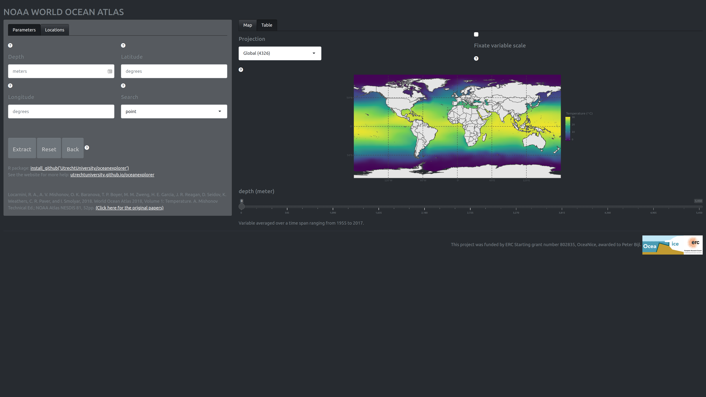
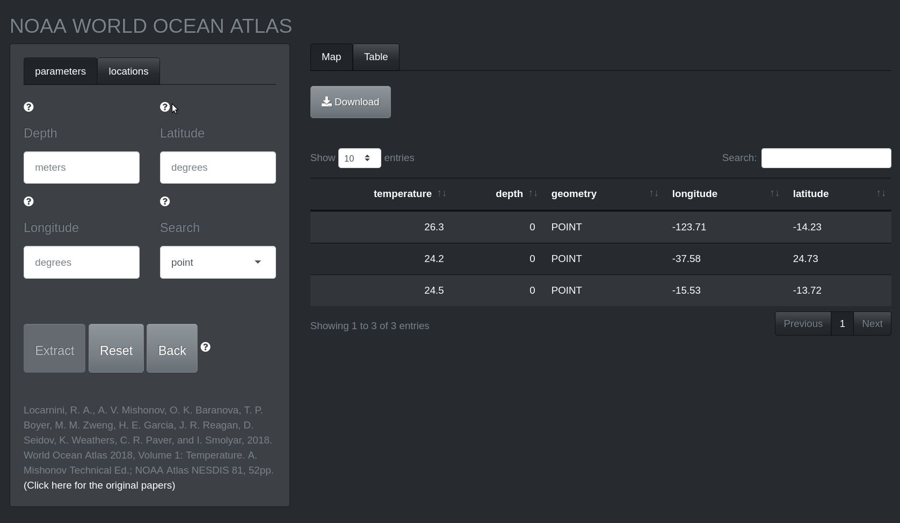
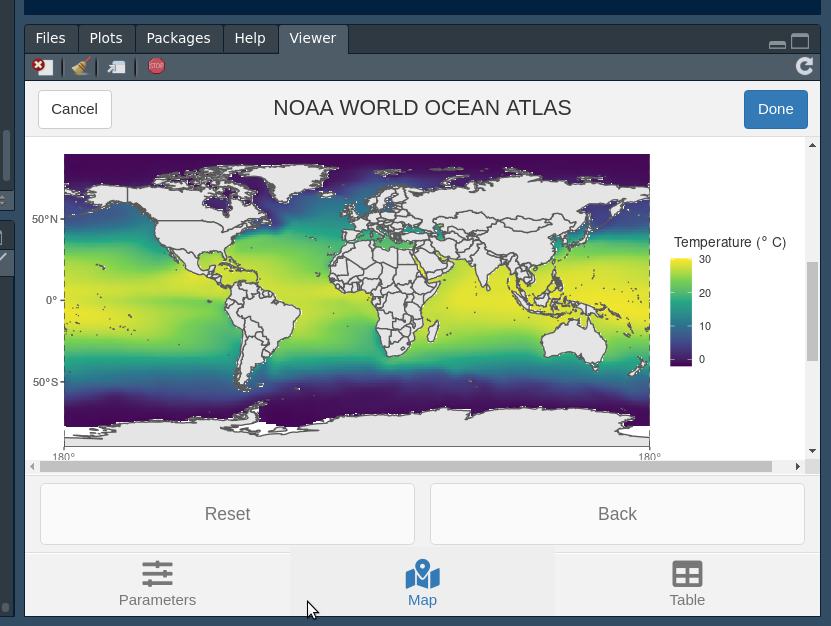

```{r, include = FALSE}
knitr::opts_chunk$set(
  collapse = TRUE,
  comment = "#>"
)
```

```{r here, echo = FALSE, eval = FALSE}
path <- fs::path("tests", "testthat", "apps", "NOAA_app", "tests", "shinytest",
                 "mytest-expected")
path <- fs::path_package("oceanexplorer", path)
fig1 <- fs::path(path, "001", ext = "png")
fig2 <- fs::path(path, "002", ext = "png")
fig3 <- fs::path(path, "003", ext = "png")

fs::file_copy(fig1, "vignettes/get-started-screenshot1.png", overwrite = TRUE)
fs::file_copy(fig2, "vignettes/get-started-screenshot2.png", overwrite = TRUE)
fs::file_copy(fig3, "vignettes/get-started-screenshot3.png", overwrite = TRUE)
```


## Introduction
The [World Ocean Atlas](https://www.nodc.noaa.gov/OC5/SELECT/woaselect/woaselect.html) of the US agency [NOAA](https://www.ncei.noaa.gov/) contains high-resolution oceanographic variables, such as temperature, salinity and nutrient concentrations, with high standard quality checks. This package facilitates easy access and exploration of this data and targets three different audiences:

-   Users with no programming experience by means of graphical user interface (Shiny app).
-   Users with minimal programming experience as a hybrid graphical-programming interface that can be easily integrated in an R workflow (RStudio addin).
-   Users with an R programming background.

I will now in reversed order explain some of the basic use cases of all three application types.

But first a word on the back-end of this R package. This package heavily relies on geospatial data analysis facilitated by *sf* [@sf] for vectors and *stars* [@stars] for raster data (e.g. the NOAA data). I highly recommend reading the accompanying documentation of these packages:

-   stars (https://r-spatial.github.io/stars/)
-   sf (https://r-spatial.github.io/sf/)

Reading this material will help dealing with these data formats in the R environment.

## Shiny app

The shiny app is hosted by Utrecht University and can be found here: https://utrecht-university.shinyapps.io/oceanexplorer/. The app allows exploration of the NOAA database and selected data points can be extracted as a csv file.

### Load NOAA data

The initial screen starts at the "parameter" tab of the left-most field which allows the selection of the oceanographic variable of interest.

```{r screenstart, echo = FALSE, out.width="90%"}
knitr::include_graphics("get-started-screenshot1.png")
```

-   The drop down menu "variable" selects the oceanographic variable of interest. 
-   The drop down menu "averaging" selects the time period over which the mean is calculated. The period can be annual, North Hemisphere seasonal (e.g. Spring, three-month periods) and monthly.
-   The drop down menu "resolution" selects the grid resolution for mean fields on a 1- or 5-degree longitude/latitude grid.

The following document lists the technical details of the variable collection and presentation: [NOAA World Ocean Atlas 2018 Product Documentation](https://www.ncei.noaa.gov/data/oceans/woa/WOA18/DOC/woa18documentation.pdf). The papers on this page give in-depth information on the variable of interest: [https://www.ncei.noaa.gov/products/world-ocean-atlas]().

Clicking the "Load data" button extract the data from the NOAA WOA database. This operation can take some time. 

### Filter NOAA data

The last action also automatically drops us in the "locations" tab (in the left most field), which allows us to select specific regions on the now displayed world map of the variable of interest. 

```{r screenselect, echo = FALSE, out.width="90%"}

```

**Locations tab (Left)**

This field allows filtering of the dataset. 

-   The text fields: "depth", "longitude", and "latitude" specify the location to extract oceanographic variables. Alternatively, one can click on the plot ("map" tab) to obtain the values. It is possible to extract multiple locations at once by providing a comma separated list (e.g., 120, 130, 140) to the text field on the left ("locations" tab). Note, that depth and coordinate vectors should be of the same length, or one of the two should have length one. The data is extracted only when all three text fields have been filled, and by subsequently clicking the button "Extract".
-   Data extraction can be achieved in two modes; "point" and "fuzzy", where the former results in a very precise search, the latter option searches in an area with a circumference of 50$\,$km around the selected coordinate point. The returned value of a fuzzy search is therefore an average of the search area. Currently, fuzzy search is not yet implemented."
-   The button "Extract" uses the information supplied in the text fields: "depth", "longitude", and "latitude" to extract the oceanographic variable. Hence the button is only active when those fields have been filled, and otherwise remains greyed-out. The buttons: "Reset" and "Back" revert all, or the last extraction, respectively. These two operations can be used for data extracted by clicking on the interactive plot and/or obtained by using the text field search.

**Map tab (right)**

This field allows changing visual aspects of the NOAA data. In addition the plot is interactive and can be clicked (single click). It is therefore possible to only use the right-hand side of the screen to select your data without touching any of the buttons and menus on the left-side.

-   The "EPSG" drop-down menu enables selection some of commonly used projections, such as "4326". And, two stereographic projections "3031" and "3995" of the Antarctic and Arctic regions, respectively. The option "original" refers to the original projection of the NOAA WOA data."
-   The toggle switch "Fix variable scale" determines whether the variable scale is fixed for the current depth slice or the whole dataset. Loosening the variable scale can help highlight nuanced differences in certain variables (e.g. phosphate).
-   The "depth" slider allows filter for depth slices.

### Extract NOAA data

Now that you have filtered the data you required you can view the results in a table by clicking on the "Table" tab on the right side of the screen.

```{r screenextract, echo = FALSE, out.width="90%"}

```

-   The button "Download" enables downloading of the current table in csv format.

## RStudio addin

The RStudio addin has more-or-less the same functionality as the Shiny app except that it has fewer options. This tool is, however, great for integration in R scripts, as the addin emits the code used for your data selection and filtering operation. The emitted code is actually the code used to generate the graphical output and is the backbone of the Shiny app and RStudio addin.

```{r screenaddin, echo = FALSE, out.width="90%"}

```

Clicking on the "Done" button terminates the application and emits the code at the point where the cursor currently resides.

## Using the oceanexplorer R code

The three main functionalities of the Shiny app and RStudio addin can also be performed programmatically.

### Loading the package and data

In this case we are interested in phosphate concentrations in the month December from the Agulhas Basin at a depth 0f 1000 meter below seablevel.

First, we extract the data by proving the variable, grid resolution, and the averaging period.

```{r setup}
library(oceanexplorer)
(WOA <- get_NOAA("phosphate", 1, "December"))
```

The first time you perform this call this operation can take a while. As a default this function caches the data which ensures that the next time you call upon this data it will load faster.

## Plot 

Then we can plot the data from a depth of 1000 meter below sea level.

```{r plot1, fig.width=7}
plot_NOAA(WOA, depth = 1000)
```


## Filter Agulhas Basin data point

Finally, we can filter a data point at the same depth from the Agulhas Basin.

```{r filter}
(pts <- filter_NOAA(WOA, depth = 1000, coord = list(lon = 20, lat = -46)))
```

We can then also plot these extraction points on the world map.

```{r plot2, fig.width=7}
plot_NOAA(WOA, depth = 1000, points = pts)
```

# References


